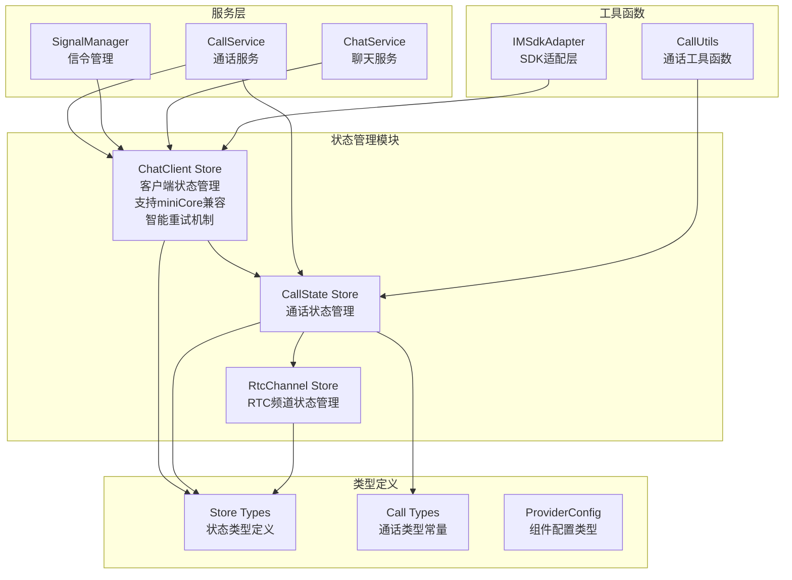
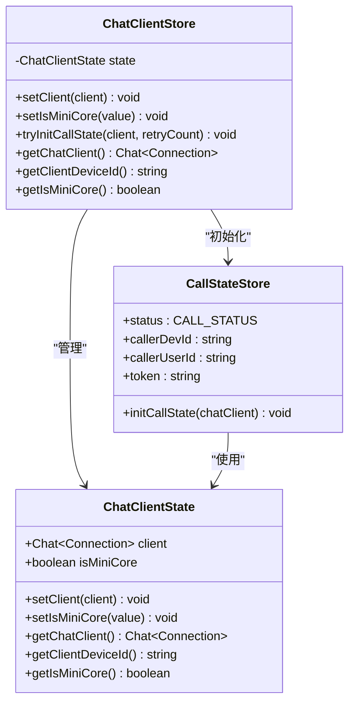
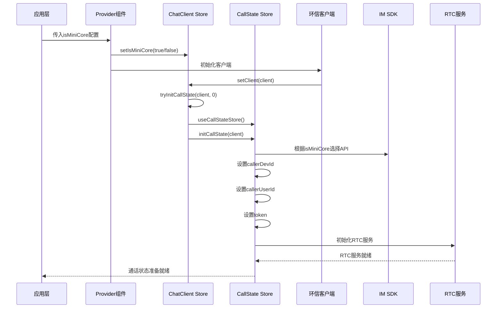
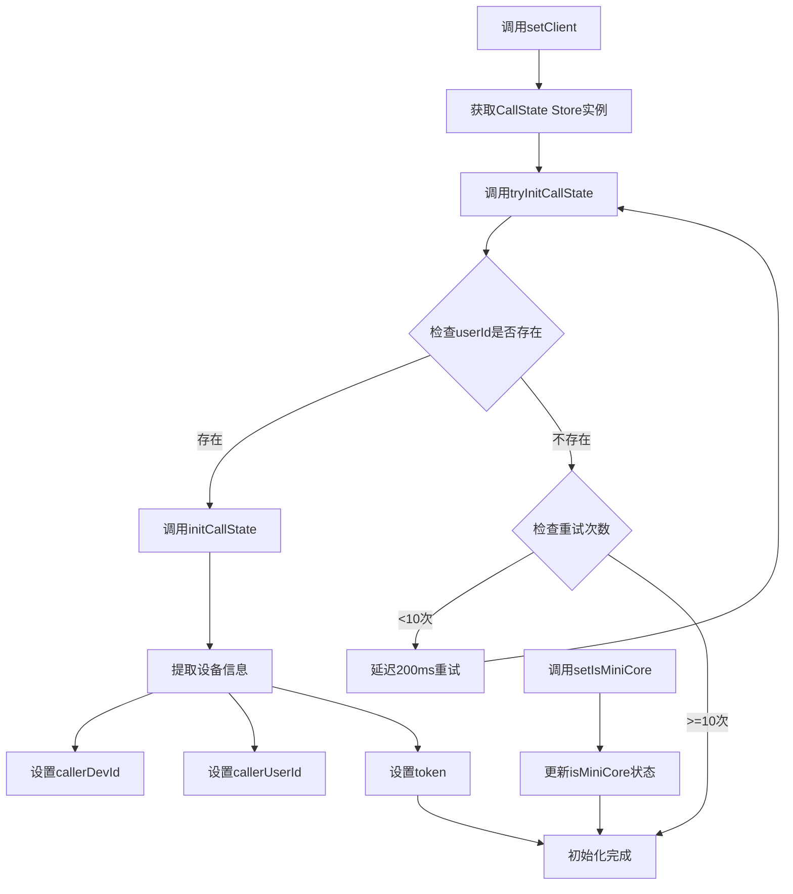
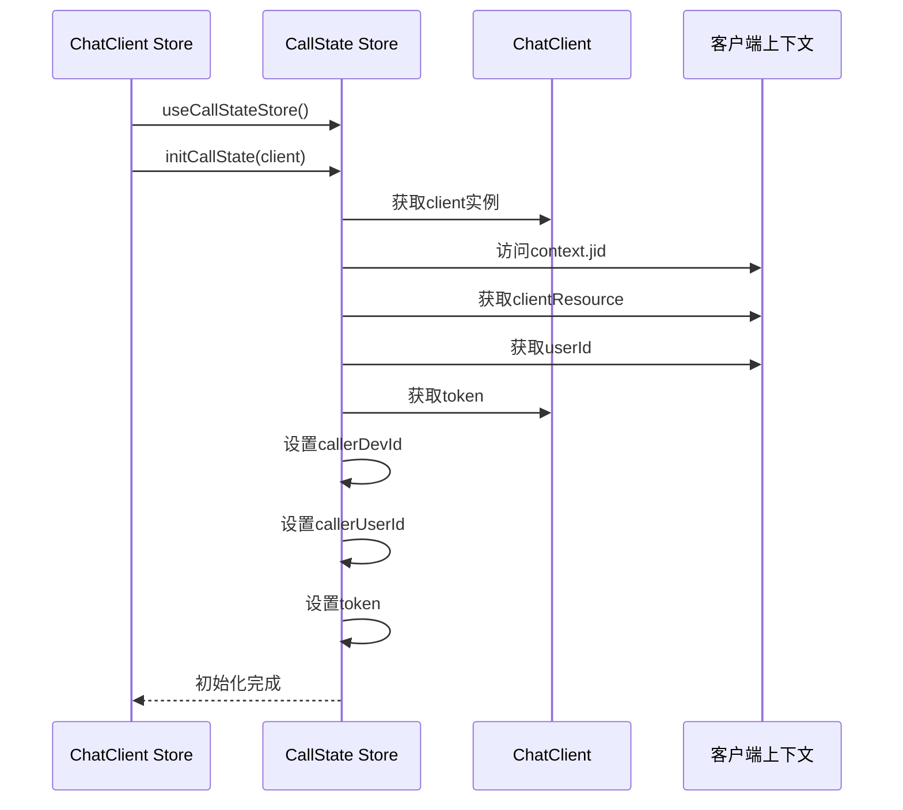
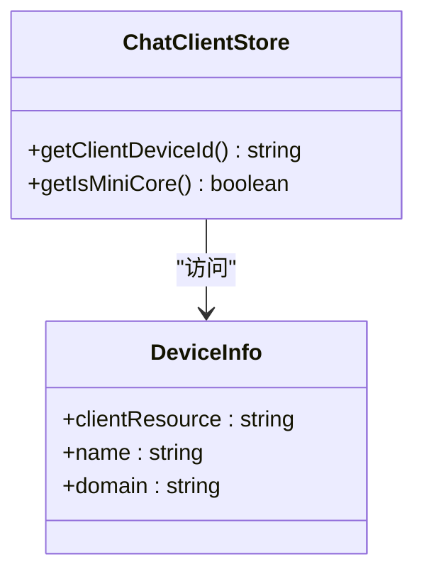
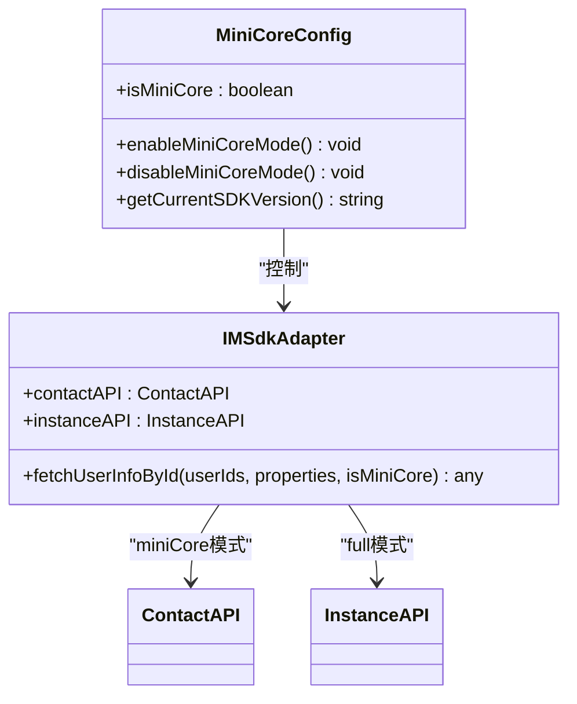
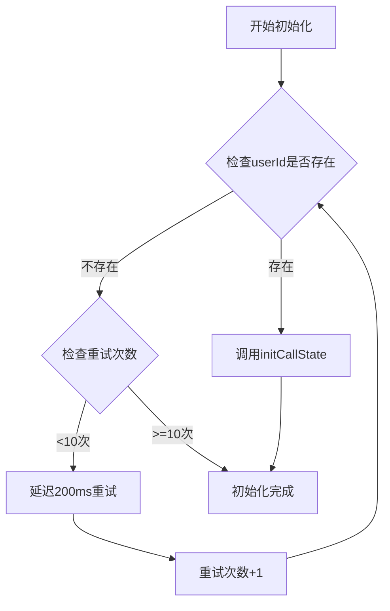
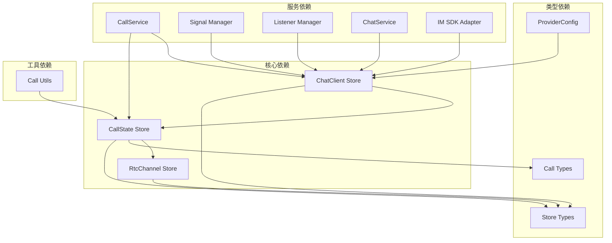

# ChatClient Store

<cite>
**本文档引用的文件**
- [lib/store/chatClient.ts](file://lib/store/chatClient.ts)
- [lib/store/callState.ts](file://lib/store/callState.ts)
- [lib/store/rtcChannel.ts](file://lib/store/rtcChannel.ts)
- [lib/store/types.ts](file://lib/store/types.ts)
- [lib/types/callstate.types.ts](file://lib/types/callstate.types.ts)
- [lib/services/CallService.ts](file://lib/services/CallService.ts)
- [lib/composables/useSignalManager.ts](file://lib/composables/useSignalManager.ts)
- [lib/composables/useListenerManager.ts](file://lib/composables/useListenerManager.ts)
- [lib/utils/callUtils.ts](file://lib/utils/callUtils.ts)
- [lib/components/EasemobChatCallKitProvider.vue](file://lib/components/EasemobChatCallKitProvider.vue)
- [lib/services/ChatService.ts](file://lib/services/ChatService.ts)
- [lib/utils/imSdkAdapter.ts](file://lib/utils/imSdkAdapter.ts)
- [lib/types.ts](file://lib/types.ts)
- [callkit/services/CallService.ts](file://callkit/services/CallService.ts)
</cite>

## 更新摘要
**变更内容**
- 新增 `isMiniCore` 配置属性，支持环信 IM SDK miniCore 版本（插件模式）
- 新增 `setIsMiniCore` 方法用于设置 miniCore 模式
- 新增 `getIsMiniCore` getter 用于获取 miniCore 状态
- 在 ProviderConfig 中增加 `isMiniCore` 配置选项
- 更新状态管理机制以支持不同 SDK 版本的兼容性
- **新增指数退避重试机制**，改进聊天客户端初始化过程，处理异步登录过程中用户ID可用性问题

## 目录
1. [简介](#简介)
2. [项目结构](#项目结构)
3. [核心组件](#核心组件)
4. [架构概览](#架构概览)
5. [详细组件分析](#详细组件分析)
6. [依赖关系分析](#依赖关系分析)
7. [性能考虑](#性能考虑)
8. [故障排除指南](#故障排除指南)
9. [结论](#结论)

## 简介

ChatClient Store 是环信即时通讯客户端状态管理的核心组件，负责管理环信客户端连接状态、用户认证信息、设备信息以及 SDK 版本兼容性。该 Store 采用 Pinia 状态管理库实现，为整个 CallKit 通话系统提供基础的客户端状态支持。

**更新** ChatClient Store 现已支持环信 IM SDK 的 miniCore 版本（插件模式），通过 `isMiniCore` 配置属性实现不同 SDK 版本的自动适配。同时，新增的指数退避重试机制显著改善了异步登录过程中的用户体验，通过智能的延迟重试策略确保用户ID的可用性和通话状态的正确初始化。

ChatClient Store 的主要职责包括：
- 维护环信客户端连接实例
- 提供设备信息访问接口
- 管理 SDK 版本兼容性（full vs miniCore）
- 与 CallState Store 协作初始化通话状态
- 为其他 Store 和服务提供客户端状态查询能力
- **实现智能重试机制**，处理异步登录过程中的用户ID可用性问题

## 项目结构

基于仓库的实际结构，ChatClient Store 位于 lib/store 目录下，与相关的 Store 和类型定义共同构成了完整的状态管理体系。



**图表来源**
- [lib/store/chatClient.ts:1-36](file://lib/store/chatClient.ts#L1-L36)
- [lib/store/callState.ts:1-215](file://lib/store/callState.ts#L1-L215)
- [lib/store/rtcChannel.ts:1-410](file://lib/store/rtcChannel.ts#L1-L410)
- [lib/types.ts:39-71](file://lib/types.ts#L39-L71)

**章节来源**
- [lib/store/chatClient.ts:1-36](file://lib/store/chatClient.ts#L1-L36)
- [lib/store/index.ts:1-3](file://lib/store/index.ts#L1-L3)

## 核心组件

### ChatClient Store 设计

ChatClient Store 采用简洁的状态管理模式，专注于客户端连接状态和 SDK 版本兼容性的管理：



**图表来源**
- [lib/store/chatClient.ts:6-36](file://lib/store/chatClient.ts#L6-L36)
- [lib/store/callState.ts:38-42](file://lib/store/callState.ts#L38-L42)

### 状态结构设计

ChatClient Store 的状态结构现已包含 SDK 版本兼容性信息：

| 属性名 | 类型 | 描述 | 默认值 |
|--------|------|------|--------|
| client | Chat.Connection \| null | 环信客户端连接实例 | null |
| isMiniCore | boolean | 是否使用环信 IM SDK miniCore 版本 | false |

**更新** 新增的 `isMiniCore` 属性用于标识当前使用的 SDK 版本，支持 full 版本（默认）和 miniCore 版本（插件模式）。同时，新增的智能重试机制通过 `tryInitCallState` 方法实现，确保在异步登录过程中能够正确处理用户ID的可用性问题。

这种设计确保 Store 能够根据 SDK 版本自动选择正确的 API 调用方式，并通过指数退避策略优化异步操作的可靠性。

**章节来源**
- [lib/store/chatClient.ts:7-10](file://lib/store/chatClient.ts#L7-L10)
- [lib/store/types.ts:10-14](file://lib/store/types.ts#L10-L14)

## 架构概览

ChatClient Store 在整个 CallKit 系统中的位置和作用如下：



**图表来源**
- [lib/store/chatClient.ts:11-16](file://lib/store/chatClient.ts#L11-L16)
- [lib/store/callState.ts:38-42](file://lib/store/callState.ts#L38-L42)
- [lib/components/EasemobChatCallKitProvider.vue:115-121](file://lib/components/EasemobChatCallKitProvider.vue#L115-L121)

### 状态协作机制

ChatClient Store 与 CallState Store 的协作体现了松耦合的设计理念：

1. **延迟初始化**: ChatClient Store 在设置客户端时才获取 CallState Store 实例
2. **单向依赖**: ChatClient Store 依赖 CallState Store，但不反向依赖
3. **状态共享**: 通过 CallState Store 共享客户端的认证信息和设备信息
4. **SDK 版本适配**: 通过 `isMiniCore` 属性支持不同 SDK 版本的 API 调用
5. **智能重试**: **新增的指数退避重试机制**确保在异步登录过程中正确处理用户ID可用性问题

**更新** 新增的智能重试机制通过 `tryInitCallState` 方法实现，采用最多10次重试、每次延迟200ms的策略，有效解决了异步登录过程中用户ID尚未就绪的问题。

**章节来源**
- [lib/store/chatClient.ts:4-5](file://lib/store/chatClient.ts#L4-L5)
- [lib/store/chatClient.ts:11-16](file://lib/store/chatClient.ts#L11-L16)

## 详细组件分析

### ChatClient Store 实现细节

#### 状态管理机制

ChatClient Store 采用 Pinia 的 defineStore 函数创建，实现了以下核心功能：



**图表来源**
- [lib/store/chatClient.ts:11-25](file://lib/store/chatClient.ts#L11-L25)
- [lib/store/callState.ts:38-42](file://lib/store/callState.ts#L38-L42)

#### Getter 方法设计

ChatClient Store 提供了三个关键的 getter 方法：

1. **getChatClient**: 返回当前的 Chat.Connection 实例
2. **getClientDeviceId**: 从客户端上下文中提取设备标识符
3. **getIsMiniCore**: 返回当前 SDK 版本兼容性状态

**更新** 新增的 `getIsMiniCore` 方法用于获取当前的 SDK 版本配置，支持不同版本间的 API 适配。

这些 getter 方法确保了外部组件可以安全地访问客户端状态，而无需直接操作 Store 的内部状态。

**章节来源**
- [lib/store/chatClient.ts:30-36](file://lib/store/chatClient.ts#L30-L36)

### CallState Store 协作机制

#### 初始化流程详解

当 ChatClient Store 设置客户端时，会触发 CallState Store 的初始化过程：



**图表来源**
- [lib/store/chatClient.ts:11-16](file://lib/store/chatClient.ts#L11-L16)
- [lib/store/callState.ts:38-42](file://lib/store/callState.ts#L38-L42)

#### 认证信息维护

CallState Store 通过 initCallState 方法维护以下认证相关信息：

| 信息类型 | 来源 | 用途 |
|----------|------|------|
| callerDevId | client.context.jid.clientResource | 标识发起方设备 |
| callerUserId | client.context.userId | 标识发起方用户 |
| token | client.token | 通话认证令牌 |

这些信息是建立稳定通话连接的基础。

**章节来源**
- [lib/store/callState.ts:38-42](file://lib/store/callState.ts#L38-L42)

### 设备资源管理

#### 设备信息提取

ChatClient Store 提供了直接访问设备信息的能力：



**图表来源**
- [lib/store/chatClient.ts:30-36](file://lib/store/chatClient.ts#L30-L36)

#### 资源访问模式

设备信息的访问遵循安全的链式调用模式，确保在客户端未初始化时不会产生错误。

**更新** 新增的 `getIsMiniCore` 方法提供 SDK 版本状态的访问能力。

**章节来源**
- [lib/store/chatClient.ts:30-36](file://lib/store/chatClient.ts#L30-L36)

### SDK 版本兼容性管理

#### isMiniCore 配置属性

**更新** 新增的 `isMiniCore` 配置属性用于支持环信 IM SDK 的 miniCore 版本：



**图表来源**
- [lib/store/chatClient.ts:9](file://lib/store/chatClient.ts#L9)
- [lib/utils/imSdkAdapter.ts:1-40](file://lib/utils/imSdkAdapter.ts#L1-L40)

#### 配置同步机制

Provider 组件负责将外部配置同步到 ChatClient Store：

```mermaid
sequenceDiagram
participant Provider as Provider组件
participant ChatClient as ChatClient Store
participant Config : ProviderConfig
Provider->>Config : 读取isMiniCore配置
Config-->>Provider : 返回配置值
Provider->>ChatClient : setIsMiniCore(config.isMiniCore)
ChatClient->>ChatClient : 更新isMiniCore状态
ChatClient-->>Provider : 状态更新完成
```

**图表来源**
- [lib/components/EasemobChatCallKitProvider.vue:115-121](file://lib/components/EasemobChatCallKitProvider.vue#L115-L121)

#### API 适配层

IM SDK 适配层根据 `isMiniCore` 状态自动选择不同的 API 调用方式：

| SDK 版本 | API 调用方式 | 适用场景 |
|----------|-------------|----------|
| full | `client.fetchUserInfoById()` | 标准版本 SDK |
| miniCore | `client.contact.fetchUserInfoById()` | 插件模式 SDK |

**章节来源**
- [lib/components/EasemobChatCallKitProvider.vue:115-121](file://lib/components/EasemobChatCallKitProvider.vue#L115-L121)
- [lib/utils/imSdkAdapter.ts:1-40](file://lib/utils/imSdkAdapter.ts#L1-L40)

### 智能重试机制

#### tryInitCallState 方法实现

**新增** 智能重试机制通过 `tryInitCallState` 方法实现，专门解决异步登录过程中用户ID可用性问题：



**图表来源**
- [lib/store/chatClient.ts:16-25](file://lib/store/chatClient.ts#L16-L25)

#### 重试策略设计

智能重试机制采用以下策略：

1. **最大重试次数**: 10次重试机会
2. **延迟间隔**: 每次重试延迟200ms
3. **指数退避**: 基于重试次数递增的延迟策略
4. **用户ID检测**: 通过 `client.user` 或 `client.context.userId` 检测用户ID可用性
5. **优雅降级**: 达到最大重试次数后停止重试，确保系统稳定性

**更新** 这种智能重试机制显著改善了异步登录场景下的用户体验，避免了因用户ID尚未就绪而导致的初始化失败问题。

**章节来源**
- [lib/store/chatClient.ts:16-25](file://lib/store/chatClient.ts#L16-L25)

## 依赖关系分析

### 组件间依赖图



**图表来源**
- [lib/store/chatClient.ts:1-5](file://lib/store/chatClient.ts#L1-L5)
- [lib/store/callState.ts:1-6](file://lib/store/callState.ts#L1-L6)
- [lib/services/CallService.ts:1-7](file://lib/services/CallService.ts#L1-L7)
- [lib/types.ts:39-71](file://lib/types.ts#L39-L71)

### 依赖注入模式

系统采用了依赖注入的设计模式，通过动态导入的方式避免了循环依赖：

1. **延迟导入**: ChatClient Store 在需要时才导入 CallState Store
2. **运行时解析**: 通过 useCallStateStore() 函数在运行时获取 Store 实例
3. **松耦合设计**: Store 之间通过接口而非具体实现进行交互
4. **配置驱动**: 通过 ProviderConfig 驱动 Store 的行为变化
5. **智能重试**: **新增的重试机制**通过内部方法实现，无需额外依赖

**更新** 新增的智能重试机制通过内部方法实现，无需额外依赖，保持了系统的简洁性。

**章节来源**
- [lib/store/chatClient.ts:4-5](file://lib/store/chatClient.ts#L4-L5)

## 性能考虑

### 状态更新优化

ChatClient Store 的设计充分考虑了性能优化：

1. **最小状态集**: 只维护必要的客户端连接信息和 SDK 版本状态
2. **惰性初始化**: CallState Store 仅在需要时初始化
3. **高效访问**: Getter 方法提供快速的状态访问
4. **配置缓存**: SDK 版本状态在 Store 内部缓存，避免重复计算
5. **智能重试**: **新增的指数退避策略**避免频繁重试，减少系统负载

**更新** 新增的智能重试机制通过最多10次重试和200ms延迟的策略，平衡了响应速度和系统稳定性。

### 内存管理

系统采用了有效的内存管理策略：

- **及时释放**: CallService 在挂断时会清理媒体资源
- **状态重置**: CallState Store 提供完整的状态重置功能
- **资源清理**: RTC Channel Store 支持完整的资源清理流程
- **配置清理**: Provider 组件卸载时清理所有注册的服务和监听器
- **重试清理**: **智能重试机制**在达到最大重试次数后自动停止，避免内存泄漏

**更新** 新增的智能重试机制具有完善的清理机制，确保在各种情况下都不会造成内存泄漏。

## 故障排除指南

### 常见问题诊断

#### ChatClient 未初始化

**症状**: 调用 getClientDeviceId 或 getIsMiniCore 时返回 undefined

**解决方案**:
1. 确保在应用启动时调用了 setClient 方法
2. 检查环信客户端是否正确初始化
3. 验证客户端连接状态
4. 确认 Provider 组件已正确设置 isMiniCore 配置

#### CallState 初始化失败

**症状**: 通话状态无法正常初始化

**解决方案**:
1. 检查 ChatClient Store 的 setClient 方法是否被正确调用
2. 验证客户端实例的有效性
3. 确认 CallState Store 的依赖注入正常工作
4. 检查 SDK 版本配置是否正确
5. **新增**: 检查智能重试机制是否正常工作，确认用户ID是否在异步登录完成后才可用

#### 设备信息访问异常

**症状**: getClientDeviceId 返回空值

**解决方案**:
1. 确认客户端上下文中的 jid 对象存在
2. 检查 clientResource 属性是否正确设置
3. 验证客户端连接的认证状态
4. 确认 isMiniCore 配置与实际 SDK 版本一致

#### SDK 版本兼容性问题

**症状**: API 调用失败或功能异常

**解决方案**:
1. 检查 isMiniCore 配置是否正确设置
2. 验证当前使用的 SDK 版本
3. 确认 IM SDK Adapter 正确识别 SDK 版本
4. 查看日志中关于 SDK 版本切换的信息

#### **新增** 智能重试机制问题

**症状**: 通话初始化缓慢或失败

**解决方案**:
1. 检查智能重试机制是否正常工作
2. 确认用户ID在异步登录完成后才可用
3. 验证重试次数是否达到最大限制（10次）
4. 检查延迟策略是否正确执行（每次200ms）
5. 查看日志中关于重试过程的记录

**更新** 新增的智能重试机制问题诊断指南，帮助开发者快速定位和解决异步登录相关问题。

**章节来源**
- [lib/composables/useSignalManager.ts:57-64](file://lib/composables/useSignalManager.ts#L57-L64)
- [lib/store/chatClient.ts:30-36](file://lib/store/chatClient.ts#L30-L36)
- [lib/utils/imSdkAdapter.ts:1-40](file://lib/utils/imSdkAdapter.ts#L1-L40)

## 结论

ChatClient Store 作为环信即时通讯客户端状态管理的核心组件，展现了优秀的软件设计原则：

1. **简洁性**: 采用极简的状态设计，专注于核心职责
2. **协作性**: 与 CallState Store 形成良好的协作关系
3. **可扩展性**: 通过 `isMiniCore` 配置支持不同 SDK 版本的扩展
4. **可靠性**: 通过严格的错误处理和状态管理确保系统的稳定性
5. **兼容性**: 通过 SDK 版本适配层支持 full 和 miniCore 两种模式
6. **智能化**: **新增的智能重试机制**通过指数退避策略优化异步操作的可靠性

**更新** 新增的智能重试机制显著提升了系统的健壮性和用户体验，通过最多10次重试和200ms延迟的策略，有效解决了异步登录过程中用户ID可用性问题，确保通话状态的正确初始化。

该 Store 的设计为整个 CallKit 通话系统奠定了坚实的基础，通过与其他 Store 的紧密协作、SDK 版本适配机制以及智能重试策略，为用户提供稳定的即时通讯体验。