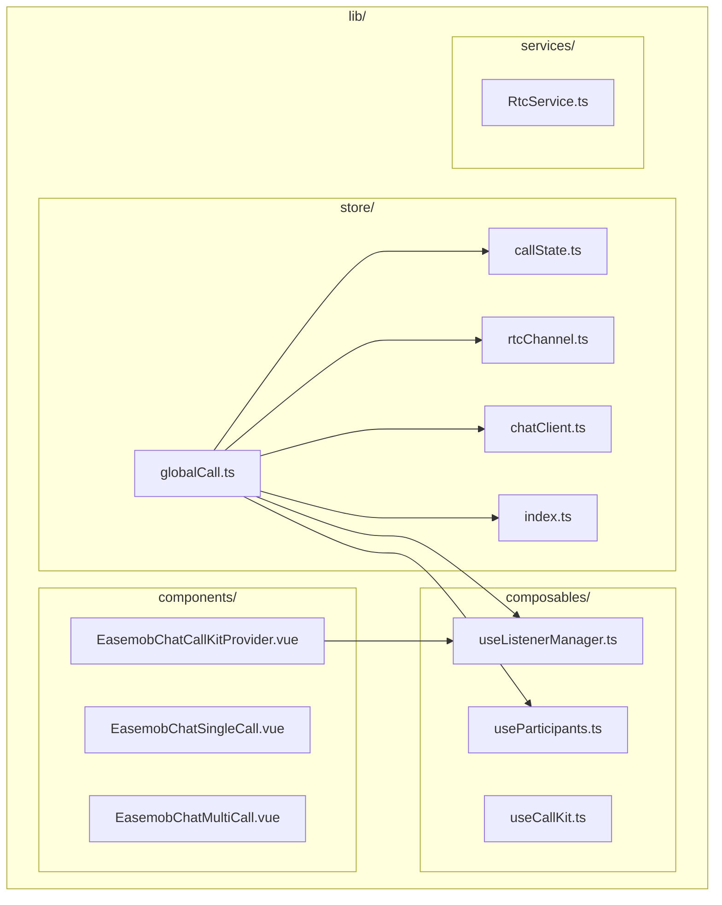
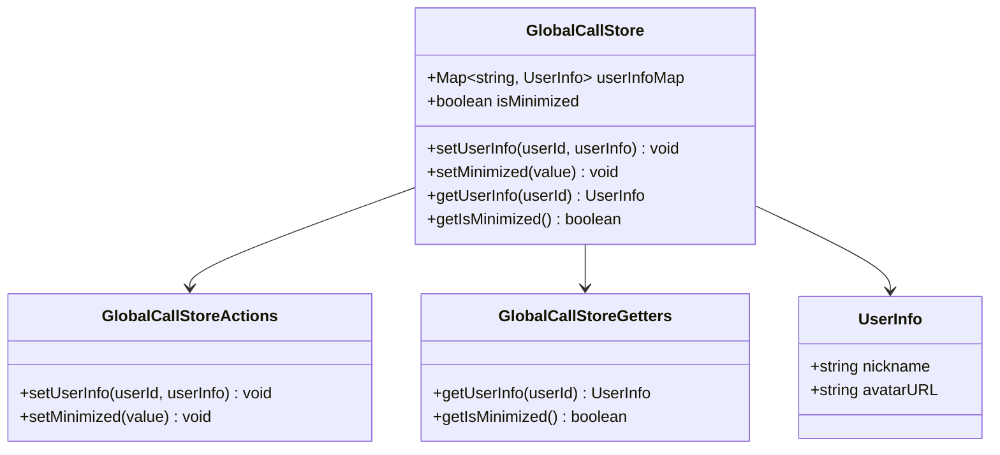
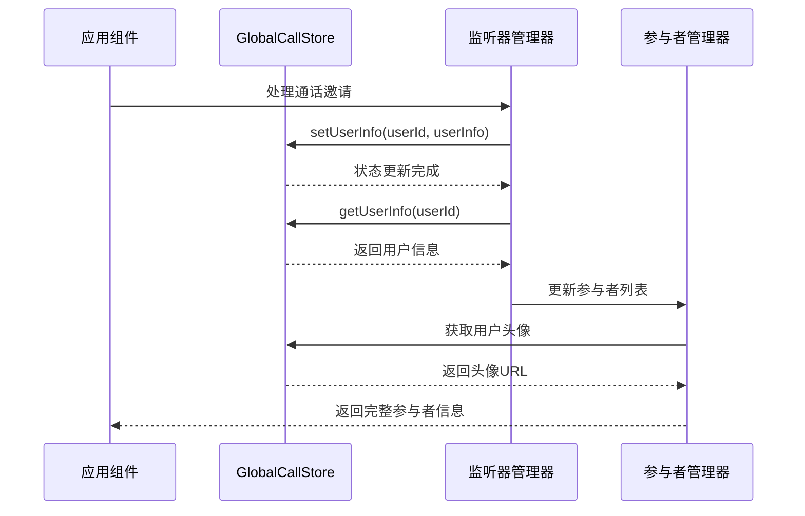
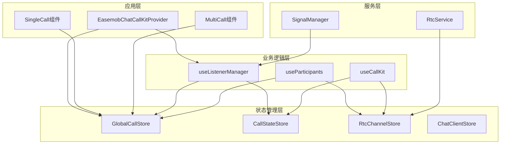
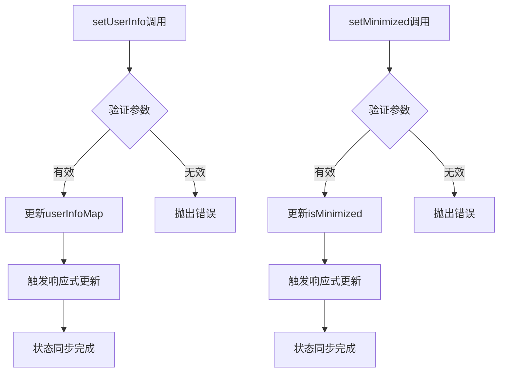
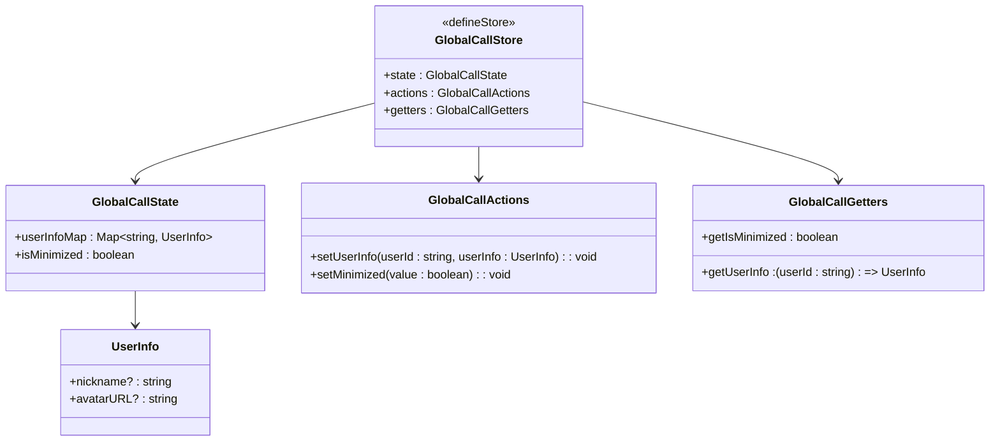
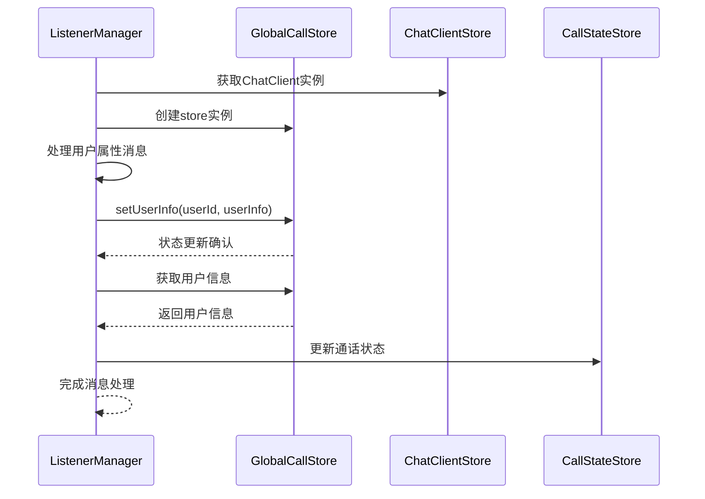
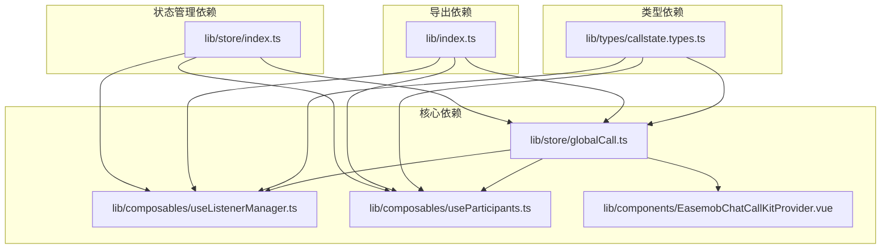

# GlobalCallStore 全局通话状态

<cite>
**本文档引用的文件**
- [lib/store/globalCall.ts](file://lib/store/globalCall.ts)
- [lib/index.ts](file://lib/index.ts)
- [lib/composables/useListenerManager.ts](file://lib/composables/useListenerManager.ts)
- [lib/composables/useParticipants.ts](file://lib/composables/useParticipants.ts)
- [lib/components/EasemobChatCallKitProvider.vue](file://lib/components/EasemobChatCallKitProvider.vue)
- [lib/store/index.ts](file://lib/store/index.ts)
- [lib/types/callstate.types.ts](file://lib/types/callstate.types.ts)
</cite>

## 目录
1. [简介](#简介)
2. [项目结构](#项目结构)
3. [核心组件](#核心组件)
4. [架构概览](#架构概览)
5. [详细组件分析](#详细组件分析)
6. [依赖关系分析](#依赖关系分析)
7. [性能考虑](#性能考虑)
8. [故障排除指南](#故障排除指南)
9. [结论](#结论)

## 简介

GlobalCallStore 是 Easemob Chat CallKit Vue3 插件中的核心状态管理组件，负责维护跨通话域的共享状态。该存储模块采用 Pinia 状态管理库实现，主要功能包括用户资料映射管理和窗口模式状态控制。

该组件设计为单聊和群聊场景共用，但不属于任何特定通话域的状态管理，确保了通话状态在不同通话类型间的统一性和一致性。

## 项目结构

Easemob Chat CallKit Vue3 项目采用模块化架构设计，主要包含以下核心目录：



**图表来源**
- [lib/store/globalCall.ts:1-42](file://lib/store/globalCall.ts#L1-L42)
- [lib/index.ts:1-68](file://lib/index.ts#L1-L68)

**章节来源**
- [lib/index.ts:1-68](file://lib/index.ts#L1-L68)
- [lib/store/globalCall.ts:1-42](file://lib/store/globalCall.ts#L1-L42)

## 核心组件

### GlobalCallStore 设计原理

GlobalCallStore 采用 Pinia 的 defineStore 函数创建，具有以下核心特性：

- **跨域共享**：用户资料和窗口状态在单聊和群聊间共享
- **响应式更新**：基于 Vue 3 的响应式系统实现状态变更通知
- **类型安全**：完整的 TypeScript 类型定义确保编译时类型检查

### 状态结构分析



**图表来源**
- [lib/store/globalCall.ts:8-41](file://lib/store/globalCall.ts#L8-L41)

### 数据流架构



**图表来源**
- [lib/composables/useListenerManager.ts:171-178](file://lib/composables/useListenerManager.ts#L171-L178)
- [lib/composables/useParticipants.ts:54-56](file://lib/composables/useParticipants.ts#L54-L56)

**章节来源**
- [lib/store/globalCall.ts:1-42](file://lib/store/globalCall.ts#L1-L42)
- [lib/composables/useListenerManager.ts:171-178](file://lib/composables/useListenerManager.ts#L171-L178)
- [lib/composables/useParticipants.ts:54-56](file://lib/composables/useParticipants.ts#L54-L56)

## 架构概览

### 系统架构图



**图表来源**
- [lib/components/EasemobChatCallKitProvider.vue:10-14](file://lib/components/EasemobChatCallKitProvider.vue#L10-L14)
- [lib/composables/useListenerManager.ts:12](file://lib/composables/useListenerManager.ts#L12)
- [lib/composables/useParticipants.ts:5](file://lib/composables/useParticipants.ts#L5)

### 状态管理模式

GlobalCallStore 采用集中式状态管理模式，通过以下机制确保状态一致性：

1. **单一数据源**：所有用户相关信息统一存储在 Map 结构中
2. **响应式更新**：Vue 3 响应式系统自动追踪状态变更
3. **类型约束**：严格的 TypeScript 类型定义防止数据污染
4. **作用域隔离**：与其他 Store 解耦，避免状态冲突

**章节来源**
- [lib/store/globalCall.ts:8-41](file://lib/store/globalCall.ts#L8-L41)
- [lib/store/index.ts:1-3](file://lib/store/index.ts#L1-L3)

## 详细组件分析

### GlobalCallStore 实现细节

#### 状态定义与初始化

GlobalCallStore 的状态结构简洁明了，包含两个核心属性：

- **userInfoMap**: 使用 Map 数据结构存储用户ID到用户信息的映射关系
- **isMinimized**: 布尔值表示通话窗口的最小化状态

#### Actions 方法分析



**图表来源**
- [lib/store/globalCall.ts:14-25](file://lib/store/globalCall.ts#L14-L25)

#### Getters 方法实现

Getters 提供了便捷的状态访问接口：

- **getUserInfo**: 根据用户ID获取用户信息，支持默认值返回
- **getIsMinimized**: 获取窗口最小化状态，提供默认值保障

#### 类型系统集成



**图表来源**
- [lib/store/globalCall.ts:8-41](file://lib/store/globalCall.ts#L8-L41)
- [lib/types/callstate.types.ts:49-67](file://lib/types/callstate.types.ts#L49-L67)

**章节来源**
- [lib/store/globalCall.ts:1-42](file://lib/store/globalCall.ts#L1-L42)
- [lib/types/callstate.types.ts:1-93](file://lib/types/callstate.types.ts#L1-L93)

### 组件集成分析

#### 监听器管理器集成

useListenerManager 组件通过以下方式集成 GlobalCallStore：



**图表来源**
- [lib/composables/useListenerManager.ts:171-178](file://lib/composables/useListenerManager.ts#L171-L178)

#### 参与者管理器集成

useParticipants 组件利用 GlobalCallStore 提供的用户信息：

```mermaid
flowchart LR
A[useParticipants] --> B[GlobalCallStore]
B --> C[getUserInfo(userId)]
C --> D[返回用户昵称]
B --> E[getUserInfo(userId)]
E --> F[返回用户头像]
D --> G[生成参与者列表]
F --> G
G --> H[返回完整参与者信息]
```

**图表来源**
- [lib/composables/useParticipants.ts:54-56](file://lib/composables/useParticipants.ts#L54-L56)

**章节来源**
- [lib/composables/useListenerManager.ts:171-178](file://lib/composables/useListenerManager.ts#L171-L178)
- [lib/composables/useParticipants.ts:54-56](file://lib/composables/useParticipants.ts#L54-L56)

## 依赖关系分析

### 模块依赖图



**图表来源**
- [lib/index.ts:10-31](file://lib/index.ts#L10-L31)
- [lib/store/globalCall.ts:1-42](file://lib/store/globalCall.ts#L1-L42)

### 依赖注入机制

GlobalCallStore 采用依赖注入的方式被各个组件使用：

1. **自动导入**: 通过 lib/index.ts 统一导出 store 实例
2. **按需使用**: 各组件根据需要导入相应的 store
3. **类型推断**: TypeScript 编译器自动推断 store 类型

**章节来源**
- [lib/index.ts:10-31](file://lib/index.ts#L10-L31)
- [lib/store/globalCall.ts:1-42](file://lib/store/globalCall.ts#L1-L42)

## 性能考虑

### 内存管理策略

GlobalCallStore 采用 Map 数据结构存储用户信息，具有以下性能优势：

- **O(1) 查找复杂度**: 用户信息查找时间复杂度为常数级
- **垃圾回收友好**: Map 对象生命周期由 Vue 响应式系统管理
- **内存占用优化**: 仅存储必要的用户信息，避免冗余数据

### 响应式更新优化

1. **细粒度更新**: 仅在用户信息发生变化时触发更新
2. **批量操作**: 支持批量设置用户信息减少更新次数
3. **缓存机制**: Getter 方法提供计算结果缓存

### 并发访问控制

- **线程安全**: Vue 3 响应式系统保证状态访问的线程安全性
- **状态一致性**: 通过 Pinia 的状态管理模式确保多组件间状态一致性

## 故障排除指南

### 常见问题诊断

#### Store 初始化问题

**问题描述**: 当 Pinia 未正确初始化时，useGlobalCallStore() 可能返回 undefined

**解决方案**:
1. 确保在应用层正确安装 Pinia 实例
2. 检查 store 的导入顺序
3. 验证应用的生命周期钩子

#### 状态访问异常

**问题描述**: 访问用户信息时返回空对象

**解决方案**:
1. 检查用户信息是否已通过 setUserInfo 方法设置
2. 验证用户ID的有效性
3. 确认 GlobalCallStore 的实例化状态

#### 性能问题排查

**问题描述**: 大量用户信息导致内存占用过高

**解决方案**:
1. 定期清理不再使用的用户信息
2. 监控 Map 对象的大小
3. 考虑实现用户信息的过期机制

**章节来源**
- [lib/store/globalCall.ts:1-42](file://lib/store/globalCall.ts#L1-L42)
- [lib/store/index.ts:1-3](file://lib/store/index.ts#L1-L3)

## 结论

GlobalCallStore 作为 Easemob Chat CallKit Vue3 插件的核心状态管理组件，展现了优秀的架构设计和实现质量。其主要特点包括：

1. **清晰的职责分离**: 专注于跨域共享状态管理，避免了功能膨胀
2. **类型安全保证**: 完整的 TypeScript 类型定义确保编译时类型检查
3. **高效的性能表现**: 基于 Map 数据结构和 Vue 3 响应式系统的优化
4. **良好的可维护性**: 模块化设计和清晰的依赖关系便于代码维护

该组件为整个通话系统提供了稳定可靠的状态管理基础，支持单聊和群聊场景的统一状态管理需求。通过合理的架构设计和实现细节，确保了在复杂业务场景下的稳定性和可扩展性。