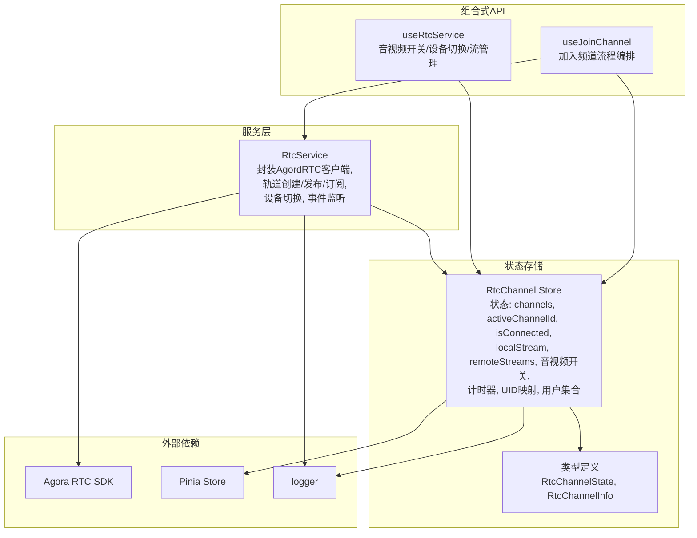
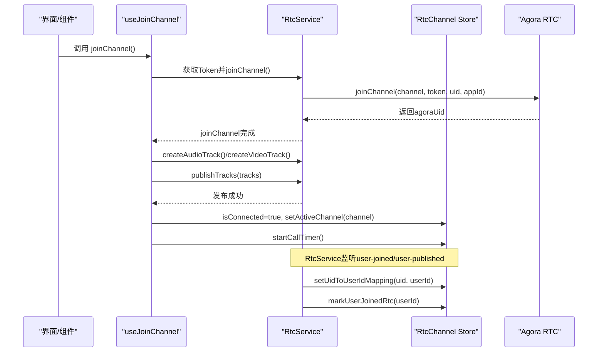
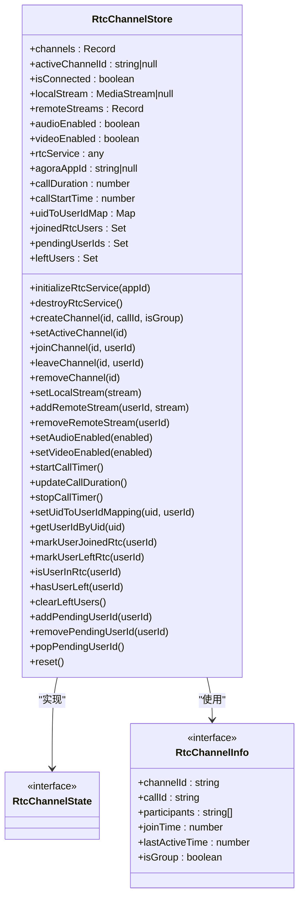
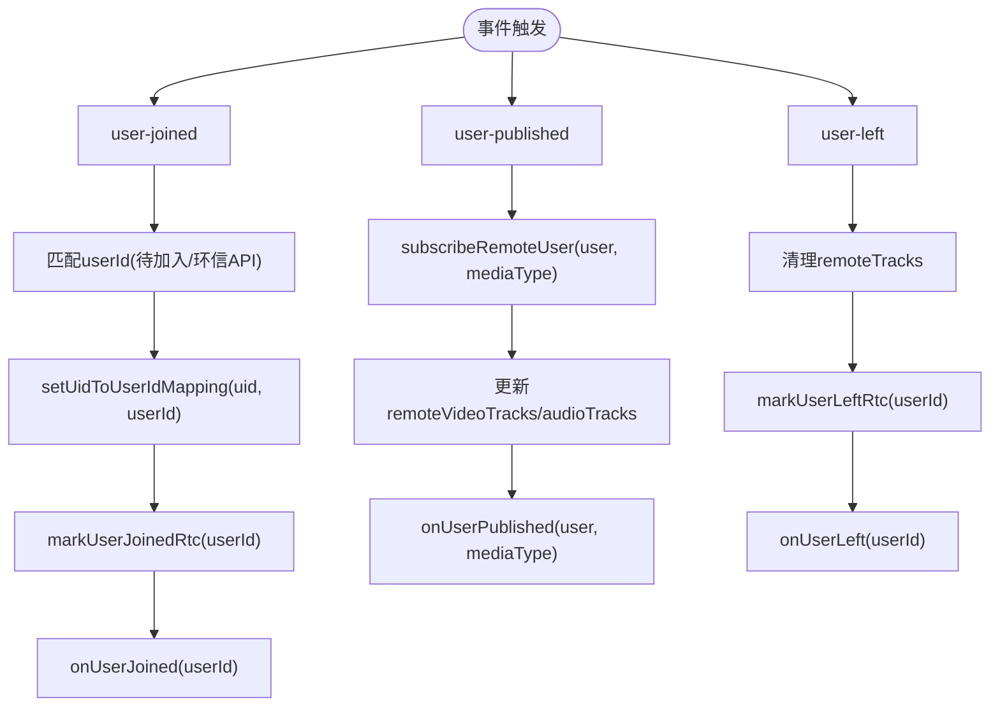
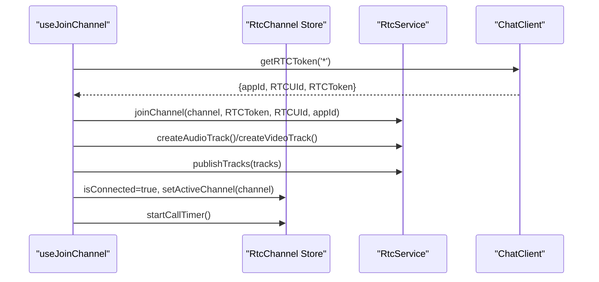
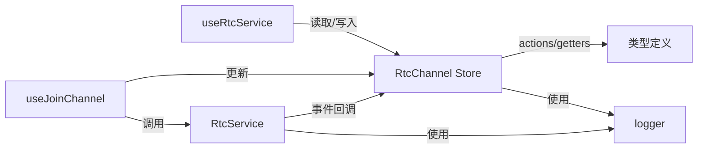

# RtcChannel Store

<cite>
**本文引用的文件**
- [lib/store/rtcChannel.ts](file://lib/store/rtcChannel.ts)
- [lib/store/types.ts](file://lib/store/types.ts)
- [lib/services/RtcService.ts](file://lib/services/RtcService.ts)
- [lib/composables/useJoinChannel.ts](file://lib/composables/useJoinChannel.ts)
- [lib/composables/useRtcService.ts](file://lib/composables/useRtcService.ts)
- [lib/store/index.ts](file://lib/store/index.ts)
</cite>

## 目录
1. [简介](#简介)
2. [项目结构](#项目结构)
3. [核心组件](#核心组件)
4. [架构总览](#架构总览)
5. [详细组件分析](#详细组件分析)
6. [依赖关系分析](#依赖关系分析)
7. [性能考虑](#性能考虑)
8. [故障排查指南](#故障排查指南)
9. [结论](#结论)
10. [附录](#附录)

## 简介
本文件系统性阐述 RtcChannel Store 的设计与实现，覆盖 RTC 频道状态管理、用户设备状态、音视频设备状态管理；详细说明频道加入/离开的状态变化、用户设备列表维护、设备开关状态同步机制；并给出状态更新流程、错误处理与状态恢复机制、实际使用示例与常见问题解决方案。

## 项目结构
RtcChannel Store 位于 lib/store 目录，配合 RtcService、CallState、ChatClient 等模块协同工作，采用 Pinia 状态管理，提供响应式状态与动作方法，支撑 CallKit 的音视频通话能力。

图表来源
- [lib/store/rtcChannel.ts](file://lib/store/rtcChannel.ts#L1-L410)
- [lib/services/RtcService.ts](file://lib/services/RtcService.ts#L1-L719)
- [lib/composables/useJoinChannel.ts](file://lib/composables/useJoinChannel.ts#L1-L185)
- [lib/composables/useRtcService.ts](file://lib/composables/useRtcService.ts#L1-L192)

章节来源
- [lib/store/rtcChannel.ts](file://lib/store/rtcChannel.ts#L1-L410)
- [lib/store/types.ts](file://lib/store/types.ts#L1-L86)
- [lib/store/index.ts](file://lib/store/index.ts#L1-L3)

## 核心组件
- RtcChannel Store：集中管理 RTC 频道、参与者、本地/远端媒体流、音视频开关、计时器、UID 到 userId 的映射及用户集合（已加入、待加入、已离开）。
- RtcService：封装 Agora RTC 客户端，负责加入/离开频道、创建/发布轨道、订阅远端用户、设备切换、事件回调。
- 组合式 API：
  - useJoinChannel：编排“获取 Token → 加入频道 → 创建并发布轨道 → 更新 store 状态 → 启动计时”的完整流程。
  - useRtcService：提供音视频开关、设备切换、本地/远端流读取与管理等响应式接口。

章节来源
- [lib/store/rtcChannel.ts](file://lib/store/rtcChannel.ts#L7-L410)
- [lib/services/RtcService.ts](file://lib/services/RtcService.ts#L42-L719)
- [lib/composables/useJoinChannel.ts](file://lib/composables/useJoinChannel.ts#L26-L185)
- [lib/composables/useRtcService.ts](file://lib/composables/useRtcService.ts#L52-L192)

## 架构总览
RtcChannel Store 与 RtcService 通过事件驱动协作：RtcService 监听用户加入/离开、发布/取消发布等事件，自动更新 store 的用户集合与 UID 映射；useJoinChannel 在信令确认后触发加入频道与轨道发布，并同步更新 store 的连接状态与活跃频道；useRtcService 提供对 store 状态的响应式读取与音视频开关控制。

图表来源
- [lib/composables/useJoinChannel.ts](file://lib/composables/useJoinChannel.ts#L76-L178)
- [lib/services/RtcService.ts](file://lib/services/RtcService.ts#L109-L138)
- [lib/services/RtcService.ts](file://lib/services/RtcService.ts#L548-L593)
- [lib/services/RtcService.ts](file://lib/services/RtcService.ts#L615-L649)
- [lib/store/rtcChannel.ts](file://lib/store/rtcChannel.ts#L164-L169)
- [lib/store/rtcChannel.ts](file://lib/store/rtcChannel.ts#L292-L302)

## 详细组件分析

### RtcChannel Store 设计与状态模型
- 状态字段
  - channels：记录频道信息（频道ID、关联 callId、参与者数组、创建/最后活跃时间、是否群组）
  - activeChannelId：当前活跃频道ID
  - isConnected：是否已加入频道
  - localStream/remoteStreams：本地/远端媒体流
  - audioEnabled/videoEnabled：音视频开关
  - rtcService/agoraAppId：服务实例与 AppId
  - callDuration/callStartTime/_timer：通话时长与计时器
  - uidToUserIdMap：Agora UID 到环信 userId 的映射
  - joinedRtcUsers/pendingUserIds/leftUsers：已加入、待加入、已离开的用户集合
- 计算属性
  - activeChannel：当前活跃频道
  - activeChannelParticipantCount：当前频道参与者数量
  - channelIds：所有频道ID列表
  - getRtcService：获取 RTC 服务实例
  - formattedCallDuration：格式化通话时长
- 动作方法
  - 初始化/销毁 RTC 服务
  - 频道管理：createChannel/joinChannel/leaveChannel/removeChannel/setActiveChannel
  - 媒体流管理：setLocalStream/addRemoteStream/removeRemoteStream
  - 音视频开关：setAudioEnabled/setVideoEnabled
  - 计时器：startCallTimer/updateCallDuration/stopCallTimer
  - UID 映射：setUidToUserIdMapping/getUserIdByUid
  - 用户状态：markUserJoinedRtc/markUserLeftRtc/isUserInRtc/hasUserLeft/clearLeftUsers
  - 待加入用户：addPendingUserId/removePendingUserId/popPendingUserId
  - 重置：reset（停止轨道、清空集合、停止计时）

图表来源
- [lib/store/rtcChannel.ts](file://lib/store/rtcChannel.ts#L11-L28)
- [lib/store/rtcChannel.ts](file://lib/store/rtcChannel.ts#L80-L410)
- [lib/store/types.ts](file://lib/store/types.ts#L58-L86)

章节来源
- [lib/store/rtcChannel.ts](file://lib/store/rtcChannel.ts#L7-L410)
- [lib/store/types.ts](file://lib/store/types.ts#L58-L86)

### RtcService 与事件驱动的状态同步
- 初始化与配置：设置日志级别、创建客户端、设置角色、注册事件监听。
- 频道生命周期：joinChannel/leaveChannel，动态更新 appId，发布/取消发布本地轨道。
- 轨道管理：createAudioTrack/createVideoTrack/publishTracks/toggleAudio/toggleVideo，支持摄像头/麦克风切换。
- 自动订阅：user-published 时自动 subscribe 并更新远端轨道。
- 事件同步：user-joined/user-left/user-published/user-unpublished/network-quality/volume-indicator，均同步到 store 的用户集合与 UID 映射。

图表来源
- [lib/services/RtcService.ts](file://lib/services/RtcService.ts#L548-L612)
- [lib/services/RtcService.ts](file://lib/services/RtcService.ts#L615-L662)
- [lib/services/RtcService.ts](file://lib/services/RtcService.ts#L596-L612)
- [lib/store/rtcChannel.ts](file://lib/store/rtcChannel.ts#L277-L302)
- [lib/store/rtcChannel.ts](file://lib/store/rtcChannel.ts#L307-L315)

章节来源
- [lib/services/RtcService.ts](file://lib/services/RtcService.ts#L82-L171)
- [lib/services/RtcService.ts](file://lib/services/RtcService.ts#L544-L673)

### useJoinChannel：加入频道的完整流程
- 获取 Token：通过 ChatClient 获取 Agora Token、AppId、Agora UID。
- 加入频道：调用 RtcService.joinChannel，支持动态 appId。
- 创建并发布轨道：根据通话类型创建音频/视频轨道并发布。
- 更新 store：设置 isConnected、activeChannelId，启动计时器。
- 错误处理：捕获异常并抛出，finally 中重置 isJoining。

图表来源
- [lib/composables/useJoinChannel.ts](file://lib/composables/useJoinChannel.ts#L39-L71)
- [lib/composables/useJoinChannel.ts](file://lib/composables/useJoinChannel.ts#L132-L170)
- [lib/services/RtcService.ts](file://lib/services/RtcService.ts#L109-L138)
- [lib/services/RtcService.ts](file://lib/services/RtcService.ts#L176-L221)

章节来源
- [lib/composables/useJoinChannel.ts](file://lib/composables/useJoinChannel.ts#L26-L185)

### useRtcService：音视频开关与流管理
- 响应式状态：localStream、remoteStreams、isVideoEnabled、isAudioEnabled、isConnected、activeChannel。
- 控制方法：toggleVideo/toggleAudio、switchCamera/switchMicrophone（占位，需扩展）。
- 流管理：getLocalStream/getRemoteStream/addRemoteStream/removeRemoteStream/setLocalStream。
- 重置：reset 调用 store.reset。

章节来源
- [lib/composables/useRtcService.ts](file://lib/composables/useRtcService.ts#L52-L192)

## 依赖关系分析
- RtcChannel Store 依赖 Pinia 进行状态持久化与响应式更新。
- RtcService 依赖 Agora RTC SDK，并与 RtcChannel Store 协同通过事件同步状态。
- useJoinChannel 依赖 RtcChannel Store 与 RtcService，协调 Token 获取与频道加入。
- useRtcService 依赖 RtcChannel Store，提供响应式读取与控制接口。
- 类型定义集中在 types.ts，统一 RtcChannelState 与 RtcChannelInfo 结构。

图表来源
- [lib/store/rtcChannel.ts](file://lib/store/rtcChannel.ts#L1-L410)
- [lib/services/RtcService.ts](file://lib/services/RtcService.ts#L1-L719)
- [lib/composables/useJoinChannel.ts](file://lib/composables/useJoinChannel.ts#L1-L185)
- [lib/composables/useRtcService.ts](file://lib/composables/useRtcService.ts#L1-L192)
- [lib/store/types.ts](file://lib/store/types.ts#L1-L86)

章节来源
- [lib/store/index.ts](file://lib/store/index.ts#L1-L3)

## 性能考虑
- 轨道生命周期管理：离开频道或切换摄像头时，及时 unpublish/unsubscribe 并 stop 轨道，避免资源泄漏。
- 计时器优化：通话计时使用 1 秒间隔定时器，避免频繁渲染；离开频道时及时清理。
- UID 映射与用户集合：使用 Set/Map 保证 O(1) 查找与去重，减少不必要的响应式更新。
- 事件驱动：通过 RtcService 的事件回调自动同步状态，降低手动轮询成本。

## 故障排查指南
- 加入频道失败
  - 检查 Token 获取：确认 ChatClient 已初始化且 getRTCToken 返回有效 appId/uid/token。
  - 检查客户端状态：避免重复加入，RtcService.getClient().connectionState 应非 CONNECTING/CONNECTED。
  - 检查 appId 动态更新：joinChannel 支持传入动态 appId，确保与 Agora 控台一致。
- 音视频轨道异常
  - 切换摄像头/麦克风前需确保轨道存在且启用；若轨道失效则重新创建并发布。
  - 关闭视频时先 unpublish 再 stop，防止残留轨道占用。
- 用户状态不同步
  - user-joined 时优先使用待加入列表匹配，其次通过环信 API 获取映射，最后回退到 uid。
  - 确保 leaveChannel 或用户离开事件触发后清理 remoteTracks 并标记 leftUsers。
- 计时器与资源清理
  - 离开频道或销毁服务时，务必 stopCallTimer、stop 所有轨道、清空集合，避免内存泄漏。

章节来源
- [lib/composables/useJoinChannel.ts](file://lib/composables/useJoinChannel.ts#L76-L178)
- [lib/services/RtcService.ts](file://lib/services/RtcService.ts#L143-L171)
- [lib/services/RtcService.ts](file://lib/services/RtcService.ts#L272-L354)
- [lib/services/RtcService.ts](file://lib/services/RtcService.ts#L548-L612)
- [lib/store/rtcChannel.ts](file://lib/store/rtcChannel.ts#L373-L408)

## 结论
RtcChannel Store 以清晰的状态模型与动作方法，结合 RtcService 的事件驱动机制，实现了 RTC 频道的全生命周期管理。通过 useJoinChannel 与 useRtcService 的组合式 API，开发者可以快速构建稳定的音视频通话体验，并具备完善的错误处理与状态恢复能力。

## 附录

### 实际使用示例（步骤说明）
- 初始化 RTC 服务
  - 在应用启动时调用 store.initializeRtcService(appId)，传入 Agora AppId。
- 加入频道
  - 调用 useJoinChannel().joinChannel()，在信令确认后执行。
  - 该方法会自动获取 Token、加入频道、创建并发布轨道、更新 store 状态。
- 控制音视频
  - 通过 useRtcService().toggleVideo()/toggleAudio() 切换开关。
  - 通过 getLocalStream()/getRemoteStream() 获取流并绑定到视频元素。
- 离开频道
  - 调用 RtcService.leaveChannel()，随后 store.reset() 清理状态与轨道。

章节来源
- [lib/composables/useJoinChannel.ts](file://lib/composables/useJoinChannel.ts#L76-L178)
- [lib/composables/useRtcService.ts](file://lib/composables/useRtcService.ts#L66-L93)
- [lib/services/RtcService.ts](file://lib/services/RtcService.ts#L143-L171)
- [lib/store/rtcChannel.ts](file://lib/store/rtcChannel.ts#L373-L408)