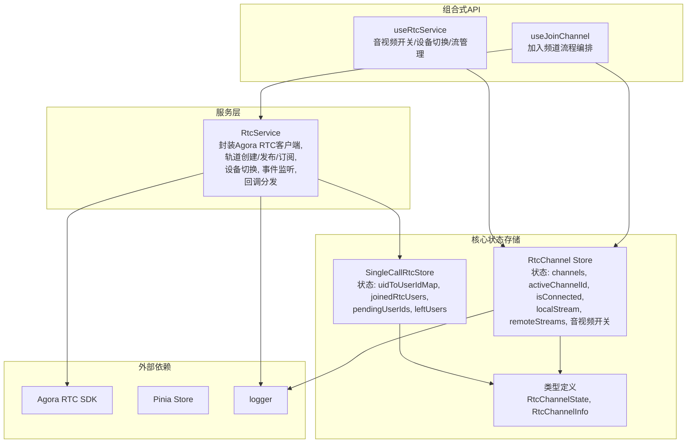
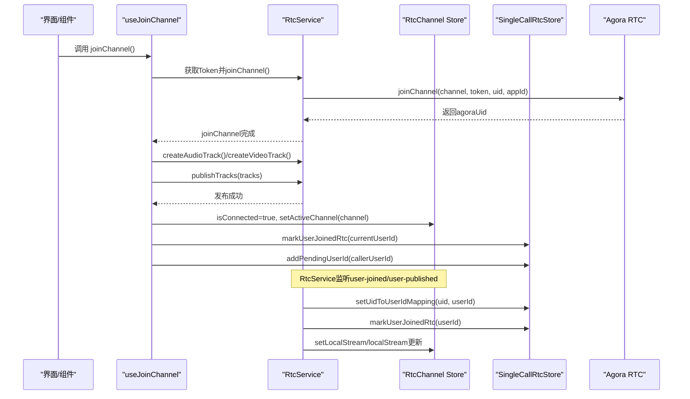
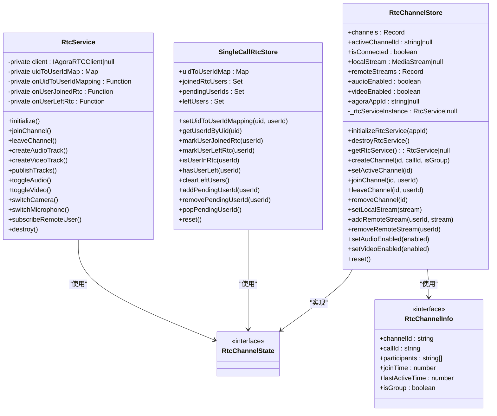
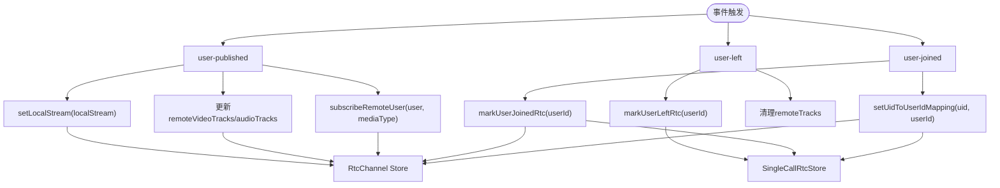
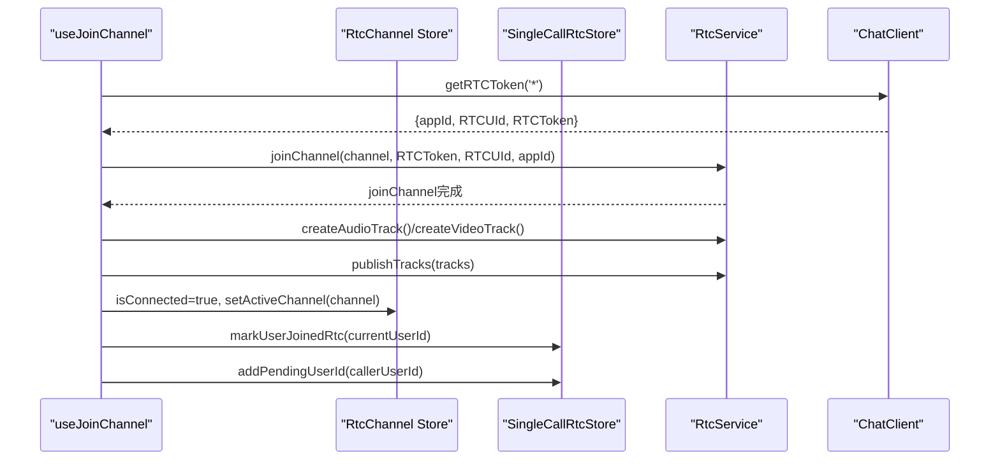
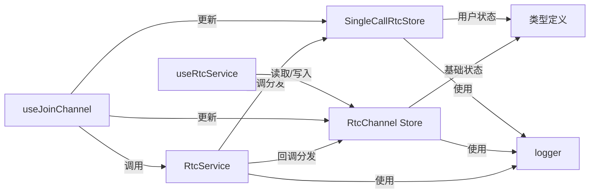

# RtcChannel Store

<cite>
**本文引用的文件**
- [lib/store/rtcChannel.ts](file://lib/store/rtcChannel.ts)
- [lib/store/singleCallRtc.ts](file://lib/store/singleCallRtc.ts)
- [lib/store/types.ts](file://lib/store/types.ts)
- [lib/services/RtcService.ts](file://lib/services/RtcService.ts)
- [lib/composables/useJoinChannel.ts](file://lib/composables/useJoinChannel.ts)
- [lib/composables/useRtcService.ts](file://lib/composables/useRtcService.ts)
- [lib/store/callState.ts](file://lib/store/callState.ts)
- [lib/store/chatClient.ts](file://lib/store/chatClient.ts)
- [lib/store/index.ts](file://lib/store/index.ts)
</cite>

## 更新摘要
**变更内容**
- RtcService 实例已从 Pinia 状态移动到模块级变量，消除循环依赖
- 新增模块级变量 `_rtcServiceInstance` 专门管理 RtcService 实例
- 架构解耦：通过回调函数向各 Store 分发状态更新，而非直接写入 Store
- 状态同步机制：RtcService 内部维护 UID 映射，替代 rtcChannelStore.uidToUserIdMap

## 目录
1. [简介](#简介)
2. [项目结构](#项目结构)
3. [核心组件](#核心组件)
4. [架构总览](#架构总览)
5. [详细组件分析](#详细组件分析)
6. [依赖关系分析](#依赖关系分析)
7. [性能考虑](#性能考虑)
8. [故障排查指南](#故障排查指南)
9. [结论](#结论)
10. [附录](#附录)

## 简介
本文件系统性阐述 RtcChannel Store 的设计与实现，经过架构简化后，RtcChannel Store 现已专注于基础的频道连接状态和媒体流管理，而复杂的用户状态管理已迁移到新的 SingleCallRtcStore。文档涵盖 RTC 频道状态管理、用户设备状态、音视频设备状态管理；详细说明频道加入/离开的状态变化、用户设备列表维护、设备开关状态同步机制；并给出状态更新流程、错误处理与状态恢复机制、实际使用示例与常见问题解决方案。

## 项目结构
RtcChannel Store 位于 lib/store 目录，配合 RtcService、SingleCallRtcStore、CallState、ChatClient 等模块协同工作，采用 Pinia 状态管理，提供响应式状态与动作方法，支撑 CallKit 的音视频通话能力。

**图表来源**
- [lib/store/rtcChannel.ts:1-262](file://lib/store/rtcChannel.ts#L1-L262)
- [lib/store/singleCallRtc.ts:1-135](file://lib/store/singleCallRtc.ts#L1-L135)
- [lib/services/RtcService.ts:1-765](file://lib/services/RtcService.ts#L1-L765)
- [lib/composables/useJoinChannel.ts:1-209](file://lib/composables/useJoinChannel.ts#L1-L209)
- [lib/composables/useRtcService.ts:1-192](file://lib/composables/useRtcService.ts#L1-L192)

**章节来源**
- [lib/store/rtcChannel.ts:1-262](file://lib/store/rtcChannel.ts#L1-L262)
- [lib/store/singleCallRtc.ts:1-135](file://lib/store/singleCallRtc.ts#L1-L135)
- [lib/store/types.ts:1-74](file://lib/store/types.ts#L1-L74)
- [lib/store/index.ts:1-3](file://lib/store/index.ts#L1-L3)

## 核心组件
- **RtcChannel Store**：简化后的状态管理，专注于频道连接状态、媒体流管理和基础音视频开关控制。通过模块级变量管理 RtcService 实例，避免循环依赖。
- **SingleCallRtcStore**：新增的专用 Store，管理一对一通话的用户映射和生命周期状态。
- **RtcService**：封装 Agora RTC 客户端，负责加入/离开频道、创建/发布轨道、订阅远端用户、设备切换、事件回调，并通过回调函数向各 Store 分发状态更新。
- **组合式 API**：
  - useJoinChannel：编排"获取 Token → 加入频道 → 创建并发布轨道 → 更新基础状态 → 启动计时"的完整流程。
  - useRtcService：提供音视频开关、设备切换、本地/远端流读取与管理等响应式接口。

**章节来源**
- [lib/store/rtcChannel.ts:8-262](file://lib/store/rtcChannel.ts#L8-L262)
- [lib/store/singleCallRtc.ts:18-135](file://lib/store/singleCallRtc.ts#L18-L135)
- [lib/services/RtcService.ts:50-765](file://lib/services/RtcService.ts#L50-L765)
- [lib/composables/useJoinChannel.ts:27-209](file://lib/composables/useJoinChannel.ts#L27-L209)
- [lib/composables/useRtcService.ts:52-192](file://lib/composables/useRtcService.ts#L52-L192)

## 架构总览
经过架构简化，RtcChannel Store 与 SingleCallRtcStore 分工明确：RtcChannel Store 负责基础的频道连接状态和媒体流管理，SingleCallRtcStore 专门处理用户映射和生命周期状态。RtcService 通过回调函数向各 Store 分发状态更新，实现松耦合的状态同步。

**图表来源**
- [lib/composables/useJoinChannel.ts:79-202](file://lib/composables/useJoinChannel.ts#L79-L202)
- [lib/services/RtcService.ts:143-202](file://lib/services/RtcService.ts#L143-L202)
- [lib/services/RtcService.ts:647-695](file://lib/services/RtcService.ts#L647-L695)
- [lib/store/rtcChannel.ts:141-192](file://lib/store/rtcChannel.ts#L141-L192)
- [lib/store/singleCallRtc.ts:45-68](file://lib/store/singleCallRtc.ts#L45-L68)

## 详细组件分析

### RtcChannel Store 设计与状态模型
**简化后的状态管理**
- **状态字段**
  - channels：记录频道信息（频道ID、关联 callId、参与者数组、创建/最后活跃时间、是否群组）
  - activeChannelId：当前活跃频道ID
  - isConnected：是否已加入频道
  - localStream/remoteStreams：本地/远端媒体流
  - audioEnabled/videoEnabled：音视频开关
  - agoraAppId：Agora AppId
- **模块级变量**
  - `_rtcServiceInstance`：RtcService 实例保存在模块级变量中，避免放入 Pinia state 造成循环依赖和响应式污染
- **计算属性**
  - activeChannel：当前活跃频道
  - activeChannelParticipantCount：当前频道参与者数量
  - channelIds：所有频道ID列表
  - getRtcService：获取 RTC 服务实例
- **动作方法**
  - 初始化/销毁 RTC 服务：通过模块级变量管理 RtcService 实例
  - 频道管理：createChannel/joinChannel/leaveChannel/removeChannel/setActiveChannel
  - 媒体流管理：setLocalStream/addRemoteStream/removeRemoteStream
  - 音视频开关：setAudioEnabled/setVideoEnabled
  - 重置：reset（停止轨道、清空集合、停止计时）

**图表来源**
- [lib/store/rtcChannel.ts:12-262](file://lib/store/rtcChannel.ts#L12-L262)
- [lib/store/singleCallRtc.ts:18-135](file://lib/store/singleCallRtc.ts#L18-L135)
- [lib/services/RtcService.ts:50-765](file://lib/services/RtcService.ts#L50-L765)
- [lib/store/types.ts:54-74](file://lib/store/types.ts#L54-L74)

**章节来源**
- [lib/store/rtcChannel.ts:8-262](file://lib/store/rtcChannel.ts#L8-L262)
- [lib/store/types.ts:54-74](file://lib/store/types.ts#L54-L74)

### SingleCallRtcStore：用户映射与生命周期管理
**新增的专用 Store**
- **职责**：管理一对一通话中的 RTC 用户映射和生命周期状态
- **状态字段**
  - uidToUserIdMap：Agora UID 到环信 userId 的映射
  - joinedRtcUsers：已加入 RTC 的用户集合
  - pendingUserIds：待加入 RTC 的用户集合
  - leftUsers：已离开 RTC 的用户集合
- **动作方法**
  - UID 映射：setUidToUserIdMapping/getUserIdByUid
  - 用户状态：markUserJoinedRtc/markUserLeftRtc/isUserInRtc/hasUserLeft
  - 待加入用户：addPendingUserId/removePendingUserId/popPendingUserId
  - 重置：reset

**章节来源**
- [lib/store/singleCallRtc.ts:18-135](file://lib/store/singleCallRtc.ts#L18-L135)

### RtcService 与事件驱动的状态同步
**回调分发机制**
- **初始化与配置**：设置日志级别、创建客户端、设置角色、注册事件监听。
- **模块级变量管理**：RtcService 实例保存在模块级变量中，避免循环依赖。
- **频道生命周期**：joinChannel/leaveChannel，动态更新 appId，发布/取消发布本地轨道。
- **轨道管理**：createAudioTrack/createVideoTrack/publishTracks/toggleAudio/toggleVideo，支持摄像头/麦克风切换。
- **自动订阅**：user-published 时自动 subscribe 并更新远端轨道。
- **事件同步**：通过回调函数向 RtcChannel Store 和 SingleCallRtcStore 分发状态更新，实现松耦合的状态同步。

**图表来源**
- [lib/services/RtcService.ts:647-695](file://lib/services/RtcService.ts#L647-L695)
- [lib/services/RtcService.ts:697-708](file://lib/services/RtcService.ts#L697-L708)
- [lib/services/RtcService.ts:654-657](file://lib/services/RtcService.ts#L654-L657)
- [lib/store/rtcChannel.ts:197-206](file://lib/store/rtcChannel.ts#L197-L206)
- [lib/store/singleCallRtc.ts:30-32](file://lib/store/singleCallRtc.ts#L30-L32)

**章节来源**
- [lib/services/RtcService.ts:108-122](file://lib/services/RtcService.ts#L108-L122)
- [lib/services/RtcService.ts:647-708](file://lib/services/RtcService.ts#L647-L708)

### useJoinChannel：加入频道的完整流程
**流程编排**
- 获取 Token：通过 ChatClient 获取 Agora Token、AppId、Agora UID。
- 加入频道：调用 RtcService.joinChannel，支持动态 appId。
- 创建并发布轨道：根据通话类型创建音频/视频轨道并发布。
- 更新基础状态：设置 isConnected、activeChannelId。
- 用户状态管理：标记当前用户加入 RTC，处理主叫方加入逻辑。
- 启动计时：启动通话计时器。

**图表来源**
- [lib/composables/useJoinChannel.ts:42-74](file://lib/composables/useJoinChannel.ts#L42-L74)
- [lib/composables/useJoinChannel.ts:142-173](file://lib/composables/useJoinChannel.ts#L142-L173)
- [lib/composables/useJoinChannel.ts:175-194](file://lib/composables/useJoinChannel.ts#L175-L194)

**章节来源**
- [lib/composables/useJoinChannel.ts:27-209](file://lib/composables/useJoinChannel.ts#L27-L209)

### useRtcService：音视频开关与流管理
**响应式接口**
- **响应式状态**：localStream、remoteStreams、isVideoEnabled、isAudioEnabled、isConnected、activeChannel。
- **控制方法**：toggleVideo/toggleAudio、switchCamera/switchMicrophone（占位，需扩展）。
- **流管理**：getLocalStream/getRemoteStream/addRemoteStream/removeRemoteStream/setLocalStream。
- **重置**：reset 调用 store.reset。

**章节来源**
- [lib/composables/useRtcService.ts:52-192](file://lib/composables/useRtcService.ts#L52-L192)

## 依赖关系分析
**架构解耦**
- RtcChannel Store 依赖 Pinia 进行状态持久化与响应式更新，但通过模块级变量管理 RtcService 实例。
- SingleCallRtcStore 专门管理用户映射和生命周期状态。
- RtcService 依赖 Agora RTC SDK，并通过回调函数向各 Store 分发状态更新。
- useJoinChannel 依赖 RtcChannel Store、SingleCallRtcStore 与 RtcService。
- useRtcService 依赖 RtcChannel Store，提供响应式读取与控制接口。
- 类型定义集中在 types.ts，统一 RtcChannelState 与 RtcChannelInfo 结构。

**图表来源**
- [lib/store/rtcChannel.ts:1-262](file://lib/store/rtcChannel.ts#L1-L262)
- [lib/store/singleCallRtc.ts:1-135](file://lib/store/singleCallRtc.ts#L1-L135)
- [lib/services/RtcService.ts:1-765](file://lib/services/RtcService.ts#L1-L765)
- [lib/composables/useJoinChannel.ts:1-209](file://lib/composables/useJoinChannel.ts#L1-L209)
- [lib/composables/useRtcService.ts:1-192](file://lib/composables/useRtcService.ts#L1-L192)
- [lib/store/types.ts:1-74](file://lib/store/types.ts#L1-L74)

**章节来源**
- [lib/store/index.ts:1-3](file://lib/store/index.ts#L1-L3)

## 性能考虑
**优化策略**
- **模块级变量管理**：将 RtcService 实例保存在模块级变量中，避免 Pinia 状态的响应式污染和循环依赖。
- **状态分离**：将用户状态管理从 RtcChannel Store 迁移到 SingleCallRtcStore，减少单一 Store 的状态复杂度。
- **回调分发**：通过回调函数向各 Store 分发状态更新，避免直接状态耦合。
- **轨道生命周期管理**：离开频道或切换摄像头时，及时 unpublish/unsubscribe 并 stop 轨道，避免资源泄漏。
- **计时器优化**：通话计时使用 1 秒间隔定时器，避免频繁渲染；离开频道时及时清理。
- **UID 映射与用户集合**：使用 Set/Map 保证 O(1) 查找与去重，减少不必要的响应式更新。

## 故障排查指南
**排查重点**
- **加入频道失败**
  - 检查 Token 获取：确认 ChatClient 已初始化且 getRTCToken 返回有效 appId/uid/token。
  - 检查客户端状态：避免重复加入，RtcService.getClient().connectionState 应非 CONNECTING/CONNECTED。
  - 检查 appId 动态更新：joinChannel 支持传入动态 appId，确保与 Agora 控台一致。
- **音视频轨道异常**
  - 切换摄像头/麦克风前需确保轨道存在且启用；若轨道失效则重新创建并发布。
  - 关闭视频时先 unpublish 再 stop，防止残留轨道占用。
- **用户状态不同步**
  - user-joined 时优先使用待加入列表匹配，其次通过环信 API 获取映射，最后回退到 uid。
  - 确保 leaveChannel 或用户离开事件触发后清理 remoteTracks 并标记 leftUsers。
- **状态同步问题**
  - 检查 RtcService 的回调函数配置，确保正确分发到 RtcChannel Store 和 SingleCallRtcStore。
  - 验证 SingleCallRtcStore 的用户状态管理逻辑，特别是 pendingUserIds 的处理。
- **模块级变量问题**
  - 确保 RtcService 实例通过模块级变量正确管理，避免重复初始化。
  - 检查 getRtcService 方法是否能正确返回 RtcService 实例。
- **计时器与资源清理**
  - 离开频道或销毁服务时，务必 stopCallTimer、stop 所有轨道、清空集合，避免内存泄漏。

**章节来源**
- [lib/composables/useJoinChannel.ts:79-202](file://lib/composables/useJoinChannel.ts#L79-L202)
- [lib/services/RtcService.ts:143-171](file://lib/services/RtcService.ts#L143-L171)
- [lib/services/RtcService.ts:647-695](file://lib/services/RtcService.ts#L647-L695)
- [lib/store/rtcChannel.ts:234-259](file://lib/store/rtcChannel.ts#L234-L259)
- [lib/store/singleCallRtc.ts:111-121](file://lib/store/singleCallRtc.ts#L111-L121)

## 结论
经过架构简化，RtcChannel Store 现已专注于基础的频道连接状态和媒体流管理，而复杂的用户状态管理已迁移到新的 SingleCallRtcStore。通过 RtcService 的回调分发机制，实现了松耦合的状态同步。**最重要的变更**是 RtcService 实例已从 Pinia 状态移动到模块级变量，消除了循环依赖问题，提高了代码的可维护性和可扩展性，为后续的功能扩展奠定了良好的基础。

## 附录

### 实际使用示例（步骤说明）
**初始化 RTC 服务**
- 在应用启动时调用 store.initializeRtcService(appId)，传入 Agora AppId。
- 该方法会创建 RtcService 实例并保存在模块级变量中，避免循环依赖。
- 配置回调函数，将状态更新分发到 RtcChannel Store 和 SingleCallRtcStore。

**加入频道**
- 调用 useJoinChannel().joinChannel()，在信令确认后执行。
- 该方法会自动获取 Token、加入频道、创建并发布轨道、更新基础状态。
- 同时标记当前用户加入 RTC，处理主叫方加入逻辑。

**控制音视频**
- 通过 useRtcService().toggleVideo()/toggleAudio() 切换开关。
- 通过 getLocalStream()/getRemoteStream() 获取流并绑定到视频元素。

**用户状态管理**
- 通过 SingleCallRtcStore 管理用户映射和生命周期状态。
- 使用 addPendingUserId/removePendingUserId/popPendingUserId 管理待加入用户列表。

**离开频道**
- 调用 RtcService.leaveChannel()，随后 store.reset() 清理状态与轨道。

**模块级变量管理**
- 通过 store.getRtcService() 获取 RtcService 实例，确保单例模式。
- 调用 store.destroyRtcService() 销毁服务实例，释放资源。

**章节来源**
- [lib/composables/useJoinChannel.ts:79-202](file://lib/composables/useJoinChannel.ts#L79-L202)
- [lib/composables/useRtcService.ts:167-191](file://lib/composables/useRtcService.ts#L167-L191)
- [lib/services/RtcService.ts:143-171](file://lib/services/RtcService.ts#L143-L171)
- [lib/store/rtcChannel.ts:234-259](file://lib/store/rtcChannel.ts#L234-L259)
- [lib/store/singleCallRtc.ts:111-121](file://lib/store/singleCallRtc.ts#L111-L121)