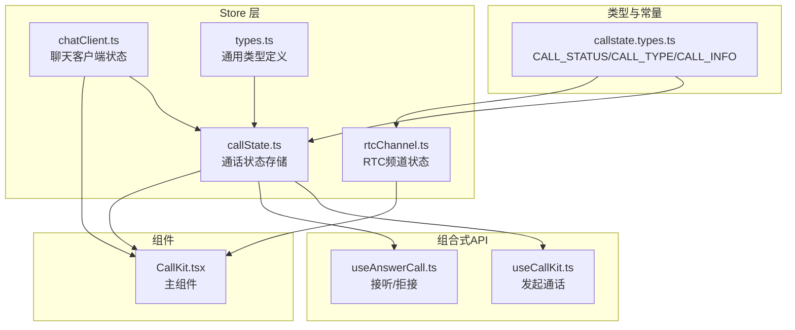
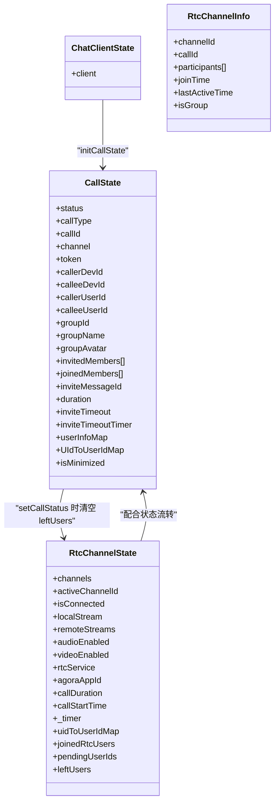
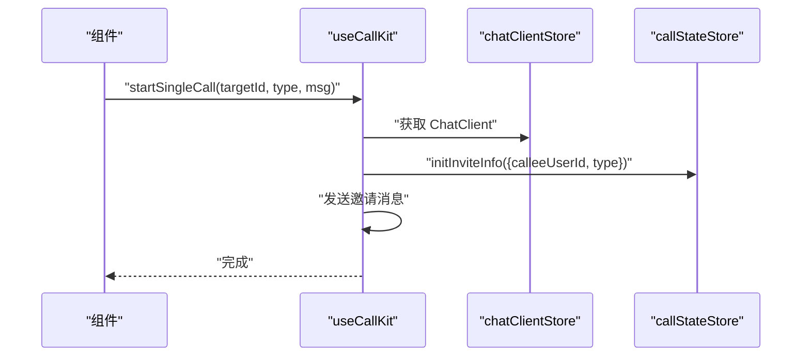
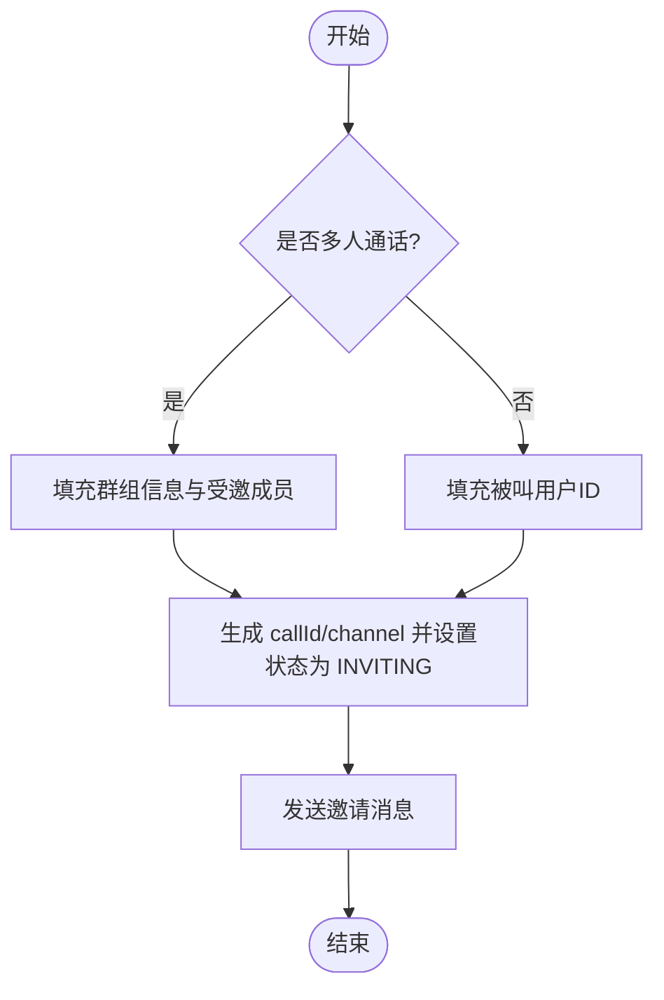
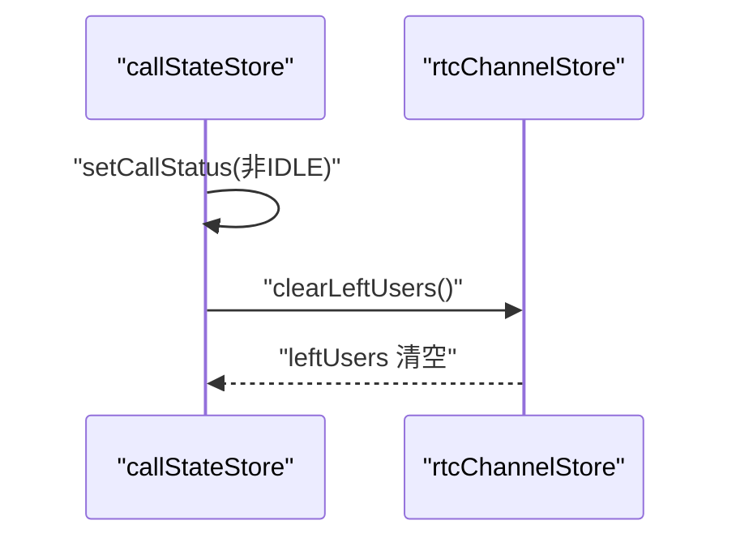
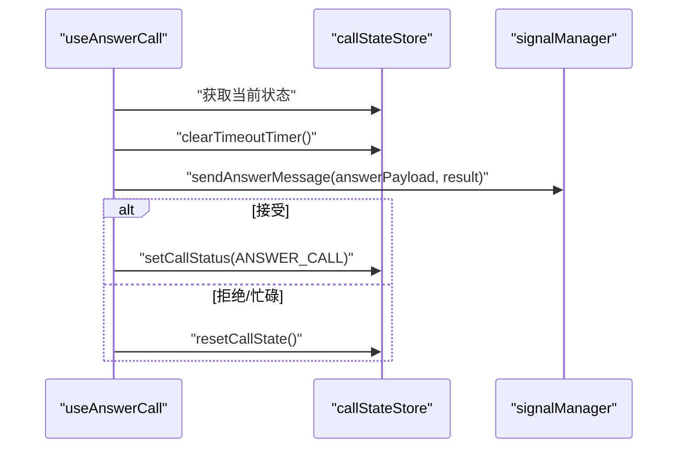
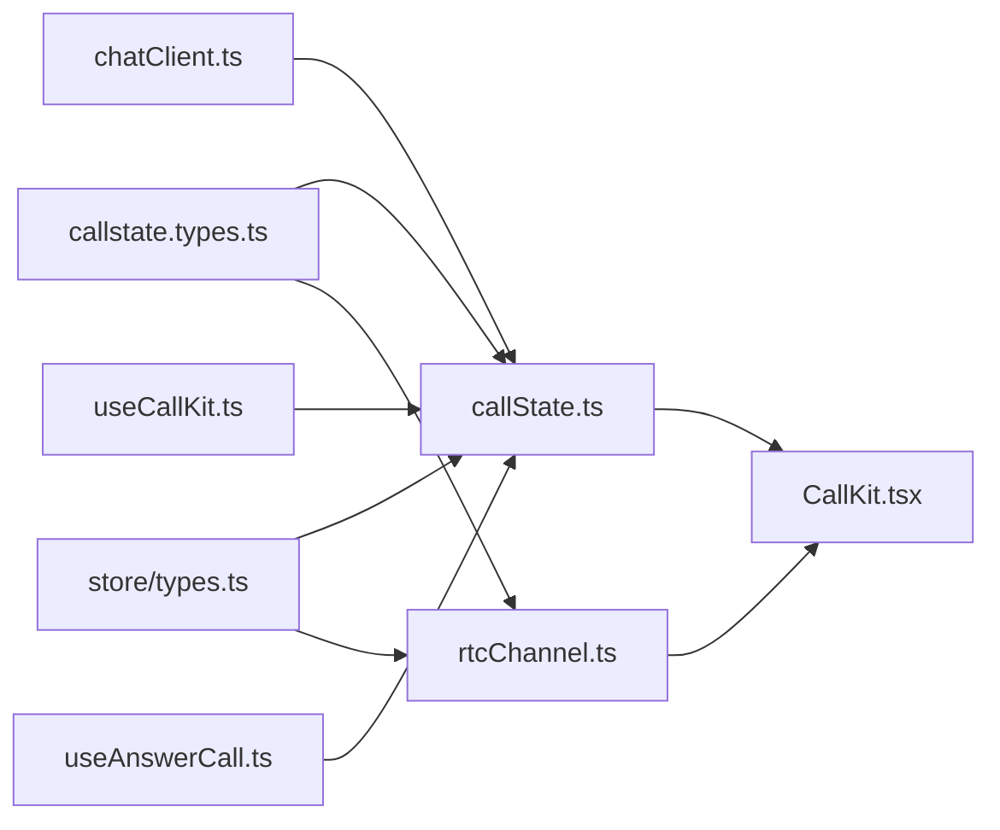

# Store 类型定义

<cite>
**本文档引用的文件**
- [lib/store/callState.ts](file://lib/store/callState.ts)
- [lib/store/types.ts](file://lib/store/types.ts)
- [lib/store/rtcChannel.ts](file://lib/store/rtcChannel.ts)
- [lib/store/chatClient.ts](file://lib/store/chatClient.ts)
- [lib/types/callstate.types.ts](file://lib/types/callstate.types.ts)
- [lib/composables/useCallKit.ts](file://lib/composables/useCallKit.ts)
- [lib/composables/useAnswerCall.ts](file://lib/composables/useAnswerCall.ts)
- [callkit/CallKit.tsx](file://callkit/CallKit.tsx)
</cite>

## 目录
1. [简介](#简介)
2. [项目结构](#项目结构)
3. [核心组件](#核心组件)
4. [架构总览](#架构总览)
5. [详细组件分析](#详细组件分析)
6. [依赖分析](#依赖分析)
7. [性能考虑](#性能考虑)
8. [故障排除指南](#故障排除指南)
9. [结论](#结论)

## 简介
本文件聚焦于项目中的 Store 类型定义与实现，系统性梳理与解释以下核心类型与状态模型：
- CallState 接口：通话全局状态容器
- INVITE_INFO 类型：邀请阶段所需的信息载体
- 用户信息类型：用户昵称与头像的存储与查询
- 通话状态与类型常量：CALL_STATUS、CALL_TYPE 的语义与取值
- RTC 频道状态：RtcChannelState 与 RtcChannelInfo
- Store 间协作：callState、chatClient、rtcChannel 三者的关系与交互

同时，提供类型之间的关系图、使用场景、约束条件、最佳实践与常见错误规避建议，并给出在组件中的典型使用方式。

## 项目结构
Store 相关代码主要位于 lib/store 目录，配合 lib/types 中的状态常量与接口，以及 lib/composables 中的组合式 API 使用 Store。

图表来源
- [lib/store/callState.ts](file://lib/store/callState.ts#L1-L263)
- [lib/store/types.ts](file://lib/store/types.ts#L1-L86)
- [lib/store/rtcChannel.ts](file://lib/store/rtcChannel.ts#L1-L410)
- [lib/store/chatClient.ts](file://lib/store/chatClient.ts#L1-L23)
- [lib/types/callstate.types.ts](file://lib/types/callstate.types.ts#L1-L93)
- [lib/composables/useCallKit.ts](file://lib/composables/useCallKit.ts#L1-L123)
- [lib/composables/useAnswerCall.ts](file://lib/composables/useAnswerCall.ts#L1-L168)
- [callkit/CallKit.tsx](file://callkit/CallKit.tsx#L1-L800)

章节来源
- [lib/store/callState.ts](file://lib/store/callState.ts#L1-L263)
- [lib/store/types.ts](file://lib/store/types.ts#L1-L86)
- [lib/store/rtcChannel.ts](file://lib/store/rtcChannel.ts#L1-L410)
- [lib/store/chatClient.ts](file://lib/store/chatClient.ts#L1-L23)
- [lib/types/callstate.types.ts](file://lib/types/callstate.types.ts#L1-L93)
- [lib/composables/useCallKit.ts](file://lib/composables/useCallKit.ts#L1-L123)
- [lib/composables/useAnswerCall.ts](file://lib/composables/useAnswerCall.ts#L1-L168)
- [callkit/CallKit.tsx](file://callkit/CallKit.tsx#L1-L800)

## 核心组件
本节对关键类型进行逐项解析，包括字段含义、数据类型、使用场景与约束条件。

- CallState 接口
  - 字段概览
    - 基础状态：status（通话状态）、callType（音频/视频/空）、callId、channel、token、callerDevId、calleeDevId、callerUserId、calleeUserId、groupId、groupName、groupAvatar、invitedMembers、joinedMembers、inviteMessageId、duration
    - 超时设置：inviteTimeout（毫秒，默认30秒）、inviteTimeoutTimer（定时器句柄或null）
    - 用户映射：userInfoMap（Map<userId, {nickname?, avatarURL?}>）、UIdToUserIdMap（Map<uid, userId>）
    - 窗口模式：isMinimized（布尔）
  - 数据类型与约束
    - status：使用 CALL_STATUS 常量，取值为数字枚举
    - callType：字面量联合 "audio"|"video"|null
    - inviteTimeout：number，建议为正整数（毫秒）
    - inviteTimeoutTimer：any|number|null，需与 setTimeout/clearTimeout 对应
    - userInfoMap/UIdToUserIdMap：Map 类型，键名需为字符串
    - isMinimized：布尔，控制 UI 小窗模式
  - 使用场景
    - 作为 Pinia Store 的 state，承载一次完整通话生命周期内的所有状态
    - 在发起/接听/结束通话、邀请超时、用户信息展示等环节使用
  - 约束条件
    - 初始化时需设置默认值（如 status=IDLE、callType=AUDIO_1V1），避免未定义访问
    - 超时定时器需在每次设置前清理旧定时器，防止重复计时
    - 群组通话时需填充 groupId/groupName/groupAvatar/invitedMembers

- INVITE_INFO 类型
  - 字段概览
    - type：CALL_TYPE（一对一/多人音视频）
    - calleeUserId：被邀请用户ID（或群组ID）
    - groupId/groupName/groupAvatar：群组信息（多人场景）
    - invitedMembers：受邀成员数组（多人场景）
  - 数据类型与约束
    - type：CALL_TYPE 常量
    - 多人场景下，groupId/groupName/groupAvatar/invitedMembers 通常必填
    - 被邀请者为单人时，calleeUserId 为用户ID
  - 使用场景
    - 发起邀请前构建 INVITE_INFO，随后调用 initInviteInfo 或 buildAndUpdateInviteState
  - 约束条件
    - 一对一场景下不要误传群组字段
    - 多人场景下必须提供 invitedMembers

- 用户信息类型
  - CallParticipant
    - 字段：userId、nickname?、avatar?、isAudioEnabled、isVideoEnabled、isLocalUser、joinedAt
    - 用途：描述参与者的实时状态（是否音频/视频开启、是否本地用户、加入时间）
  - CurrentCallInfo
    - 字段：callId、callerId、calleeIds、callType、startTime、duration、status、participants、isGroupCall、channelId?
    - 用途：描述当前通话的聚合信息
  - 用户信息映射
    - userInfoMap：Map<userId, {nickname?, avatarURL?}>
    - UIdToUserIdMap：Map<uid, userId>（用于 RTC UID 与环信 userId 的映射）

- 通话状态与类型常量
  - CALL_STATUS：IDLE、INVITING、ALERTING、CONFIRM_RING、RECEIVED_CONFIRM_RING、ANSWER_CALL、CONFIRM_CALLEE、IN_CALL
  - CALL_TYPE：AUDIO_1V1、VIDEO_1V1、VIDEO_MULTI、AUDIO_MULTI
  - CALL_INFO：callId、channel、token、type、callerDevId、calleeDevId、callerUserId、calleeUserId、groupId、groupName、groupAvatar、callerNickname、invitedMembers、joinedMembers、inviteMessageId、duration、state
  - HANGUP_REASON：挂断原因枚举，覆盖主动/被动/无响应/异常等情况

- RTC 频道状态
  - RtcChannelState：channels、activeChannelId、isConnected、localStream、remoteStreams、audioEnabled、videoEnabled、rtcService、agoraAppId、callDuration、callStartTime、_timer、uidToUserIdMap、joinedRtcUsers、pendingUserIds、leftUsers
  - RtcChannelInfo：channelId、callId、participants、joinTime、lastActiveTime、isGroup
  - 使用场景：维护 RTC 频道生命周期、用户加入/离开、媒体流管理、计时统计

章节来源
- [lib/store/types.ts](file://lib/store/types.ts#L1-L86)
- [lib/types/callstate.types.ts](file://lib/types/callstate.types.ts#L1-L93)

## 架构总览
Store 之间的协作关系如下：

图表来源
- [lib/store/callState.ts](file://lib/store/callState.ts#L1-L263)
- [lib/store/types.ts](file://lib/store/types.ts#L1-L86)
- [lib/store/rtcChannel.ts](file://lib/store/rtcChannel.ts#L1-L410)
- [lib/store/chatClient.ts](file://lib/store/chatClient.ts#L1-L23)

## 详细组件分析

### CallState Store 分析
- 状态初始化
  - 默认值：IDLE 状态、AUDIO_1V1 类型、空字符串的 callId/channel/token、空数组的 invitedMembers/joinedMembers、默认 inviteTimeout=30000、isMinimized=false
- 关键动作
  - initCallState：根据 Chat.Connection 初始化 callerDevId、callerUserId、token
  - initInviteInfo：根据 INVITE_INFO 设置 type/calleeUserId/群组信息、生成 callId/channel、设置状态为 INVITING、启动超时计时
  - setUserInfo：向 userInfoMap 写入用户昵称与头像
  - startTimeoutTimer/clearTimeoutTimer/handleTimeout：超时控制逻辑，多人场景下超时后不自动隐藏界面
  - updateCallState/setCallStatus：批量更新与状态机推进；从 IDLE 转换到非 IDLE 时清空 rtcChannel 的 leftUsers
  - resetCallState：重置所有状态，包括定时器、群组信息、映射表、窗口模式
  - buildAndUpdateInviteState：封装 initInviteInfo 并返回当前状态快照
  - generateCallId：生成唯一通话 ID
- 计算属性
  - getCallStatus/getCallState：只读访问
  - getUserInfo：按 userId 查询用户信息（默认空对象）
  - getInviteTimeoutTimer/isInviting/isInCall/getInvitedMembers/getIsMinimized：便捷查询

图表来源
- [lib/composables/useCallKit.ts](file://lib/composables/useCallKit.ts#L1-L123)
- [lib/store/chatClient.ts](file://lib/store/chatClient.ts#L1-L23)
- [lib/store/callState.ts](file://lib/store/callState.ts#L1-L263)

章节来源
- [lib/store/callState.ts](file://lib/store/callState.ts#L1-L263)
- [lib/composables/useCallKit.ts](file://lib/composables/useCallKit.ts#L1-L123)

### INVITE_INFO 类型与使用
- 构造 INVITE_INFO 的时机
  - 单人通话：type 为 AUDIO_1V1 或 VIDEO_1V1，calleeUserId 为目标用户 ID
  - 群组通话：type 为 AUDIO_MULTI 或 VIDEO_MULTI，需提供 groupId/groupName/groupAvatar/invitedMembers
- 使用流程
  - 调用 callStateStore.initInviteInfo(INVITE_INFO)
  - 发送邀请消息（信令）
  - 多人场景下，主叫方可能需要立即加入 RTC 频道

图表来源
- [lib/store/callState.ts](file://lib/store/callState.ts#L44-L71)
- [lib/composables/useCallKit.ts](file://lib/composables/useCallKit.ts#L28-L82)

章节来源
- [lib/store/callState.ts](file://lib/store/callState.ts#L44-L71)
- [lib/composables/useCallKit.ts](file://lib/composables/useCallKit.ts#L28-L82)

### 用户信息类型与映射
- CallParticipant：描述单个参与者的实时状态
- CurrentCallInfo：描述当前通话的聚合信息
- 用户信息映射
  - userInfoMap：用于 UI 展示昵称与头像
  - UIdToUserIdMap：用于 RTC 场景下的 UID 与 userId 映射
- 在组件中的使用
  - CallKit.tsx 中通过 userInfoProvider 获取群成员信息并写入 CallService 的用户信息映射
  - callStateStore.getUserInfo 提供按 userId 查询用户信息的能力

章节来源
- [lib/store/types.ts](file://lib/store/types.ts#L13-L34)
- [callkit/CallKit.tsx](file://callkit/CallKit.tsx#L523-L550)
- [lib/store/callState.ts](file://lib/store/callState.ts#L220-L231)

### RTC 频道状态与协作
- RtcChannelState
  - 维护 channels、activeChannelId、isConnected、localStream、remoteStreams、音频/视频开关、rtcService、agoraAppId、通话时长与计时器、UID 映射、加入/离开/待加入用户集合
- 行为要点
  - 初始化 RTC 服务、创建/加入/离开频道、设置本地/远程媒体流
  - 计时器管理：startCallTimer/updateCallDuration/stopCallTimer
  - 用户生命周期：markUserJoinedRtc/markUserLeftRtc/clearLeftUsers/addPendingUserId/popPendingUserId
- 与 CallState 的协作
  - setCallStatus 从 IDLE 转换到非 IDLE 时，调用 rtcChannelStore.clearLeftUsers，确保新通话开始时清理遗留状态

图表来源
- [lib/store/callState.ts](file://lib/store/callState.ts#L142-L151)
- [lib/store/rtcChannel.ts](file://lib/store/rtcChannel.ts#L334-L337)

章节来源
- [lib/store/rtcChannel.ts](file://lib/store/rtcChannel.ts#L1-L410)
- [lib/store/callState.ts](file://lib/store/callState.ts#L142-L151)

### 接听/拒接流程
- acceptCall/rejectCall/busyRejectCall
  - 校验状态（仅 ALERTING 可接受）
  - 清理超时定时器
  - 构造 answerPayload（包含 callId、callerDevId、calleeDevId）
  - 发送 answerCall 信令（accept/refuse/busy）
  - 接受时更新状态为 ANSWER_CALL；拒接/忙碌时重置通话状态

图表来源
- [lib/composables/useAnswerCall.ts](file://lib/composables/useAnswerCall.ts#L28-L118)
- [lib/store/callState.ts](file://lib/store/callState.ts#L90-L110)

章节来源
- [lib/composables/useAnswerCall.ts](file://lib/composables/useAnswerCall.ts#L1-L168)
- [lib/store/callState.ts](file://lib/store/callState.ts#L90-L110)

## 依赖分析
- 类型依赖
  - CallState 依赖 CALL_STATUS、CALL_TYPE、CALL_INFO
  - INVITE_INFO 依赖 CALL_TYPE
  - RtcChannelState 依赖 CALL_STATUS（用于 RTC 行为与状态）
- 组件依赖
  - useCallKit 依赖 chatClientStore 与 callStateStore
  - useAnswerCall 依赖 callStateStore 与 chatClientStore
  - CallKit.tsx 依赖 CallService、CallKitRef/Props、InvitationInfo 等

图表来源
- [lib/types/callstate.types.ts](file://lib/types/callstate.types.ts#L1-L93)
- [lib/store/types.ts](file://lib/store/types.ts#L1-L86)
- [lib/store/callState.ts](file://lib/store/callState.ts#L1-L263)
- [lib/store/rtcChannel.ts](file://lib/store/rtcChannel.ts#L1-L410)
- [lib/store/chatClient.ts](file://lib/store/chatClient.ts#L1-L23)
- [lib/composables/useCallKit.ts](file://lib/composables/useCallKit.ts#L1-L123)
- [lib/composables/useAnswerCall.ts](file://lib/composables/useAnswerCall.ts#L1-L168)
- [callkit/CallKit.tsx](file://callkit/CallKit.tsx#L1-L800)

章节来源
- [lib/types/callstate.types.ts](file://lib/types/callstate.types.ts#L1-L93)
- [lib/store/types.ts](file://lib/store/types.ts#L1-L86)
- [lib/store/callState.ts](file://lib/store/callState.ts#L1-L263)
- [lib/store/rtcChannel.ts](file://lib/store/rtcChannel.ts#L1-L410)
- [lib/store/chatClient.ts](file://lib/store/chatClient.ts#L1-L23)
- [lib/composables/useCallKit.ts](file://lib/composables/useCallKit.ts#L1-L123)
- [lib/composables/useAnswerCall.ts](file://lib/composables/useAnswerCall.ts#L1-L168)
- [callkit/CallKit.tsx](file://callkit/CallKit.tsx#L1-L800)

## 性能考虑
- 定时器管理
  - 每次设置 inviteTimeout 前先清理旧定时器，避免重复计时导致内存泄漏
- 响应式更新
  - RtcChannelState 中对 Set/Map 的更新采用“重新赋值”策略（如 joinedRtcUsers = new Set(...)）以强制触发响应式更新
- 状态重置
  - resetCallState 与 rtcChannel.reset() 会清理媒体轨道与计时器，避免资源泄露

## 故障排除指南
- 问题：邀请超时后界面自动隐藏
  - 现象：单人通话超时自动回到 IDLE
  - 多人通话超时不自动隐藏，需手动挂断
  - 处理：检查 handleTimeout 的分支逻辑与 isMultiCall 判断
- 问题：多人通话结束后 UI 仍显示“邀请中”
  - 现象：挂断后 leftUsers 未清空
  - 处理：确认 setCallStatus 从 IDLE 转换到非 IDLE 时调用了 rtcChannelStore.clearLeftUsers
- 问题：用户信息未显示
  - 现象：昵称/头像为空
  - 处理：确认 userInfoMap 已正确写入；组件侧通过 getUserInfo 或 userInfoProvider 获取
- 问题：RTC 频道状态异常
  - 现象：加入/离开用户统计不准确
  - 处理：检查 markUserJoinedRtc/markUserLeftRtc/clearLeftUsers 的调用时机与 pendingUserIds 的匹配

章节来源
- [lib/store/callState.ts](file://lib/store/callState.ts#L115-L131)
- [lib/store/callState.ts](file://lib/store/callState.ts#L142-L151)
- [lib/store/rtcChannel.ts](file://lib/store/rtcChannel.ts#L292-L315)
- [lib/store/rtcChannel.ts](file://lib/store/rtcChannel.ts#L334-L337)

## 结论
本文档系统梳理了项目中的 Store 类型定义与实现，重点围绕 CallState、INVITE_INFO、用户信息类型、通话状态与类型常量、以及 RTC 频道状态展开。通过清晰的类型定义、严格的约束条件与完善的 Store 协作机制，项目实现了从邀请、接听、通话到结束的完整生命周期管理。建议在实际使用中遵循以下最佳实践：
- 明确区分一对一与多人通话场景，正确填充 INVITE_INFO
- 严格管理定时器与状态重置，避免资源泄露与状态错乱
- 在多人场景下，重视 leftUsers 的清理与 pendingUserIds 的匹配
- 通过 getUserInfo 与 userInfoProvider 统一用户信息来源，保证 UI 一致性