# 单人通话RTC存储

<cite>
**本文档引用的文件**
- [lib/store/singleCallRtc.ts](file://lib/store/singleCallRtc.ts)
- [lib/store/callState.ts](file://lib/store/callState.ts)
- [lib/store/rtcChannel.ts](file://lib/store/rtcChannel.ts)
- [lib/store/types.ts](file://lib/store/types.ts)
- [lib/store/index.ts](file://lib/store/index.ts)
- [lib/index.ts](file://lib/index.ts)
- [.trae/documents/修复CallService中CallState store初始化检查问题.md](file://.trae/documents/修复CallService中CallState store初始化检查问题.md)
- [lib/ARCHITECTURE.md](file://lib/ARCHITECTURE.md)
- [package.json](file://package.json)
</cite>

## 目录
1. [简介](#简介)
2. [项目结构](#项目结构)
3. [核心组件](#核心组件)
4. [架构概览](#架构概览)
5. [详细组件分析](#详细组件分析)
6. [依赖关系分析](#依赖关系分析)
7. [性能考虑](#性能考虑)
8. [故障排除指南](#故障排除指南)
9. [结论](#结论)

## 简介

本文档深入分析了Easemob UIKit CallKit Vue3项目中的单人通话RTC存储系统。该系统采用Pinia状态管理，专门设计用于管理一对一实时通信中的用户状态和映射关系。系统通过三个核心Store实现了完整的状态管理：`SingleCallRtcStore`（单人通话RTC存储）、`CallStateStore`（通话状态存储）和`RtcChannelStore`（RTC频道存储）。

该存储系统的关键特性包括：
- **UID到用户ID映射管理**：维护Agora RTC UID与环信用户ID之间的双向映射
- **用户生命周期跟踪**：精确跟踪用户的加入、离开和待加入状态
- **响应式状态更新**：利用Vue 3的响应式系统实现实时状态同步
- **类型安全设计**：完整的TypeScript类型定义确保编译时类型检查

## 项目结构

项目采用模块化的文件组织结构，单人通话RTC存储位于`lib/store/`目录下：

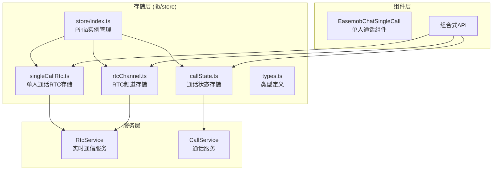

**图表来源**
- [lib/store/index.ts:1-3](file://lib/store/index.ts#L1-L3)
- [lib/store/singleCallRtc.ts:1-135](file://lib/store/singleCallRtc.ts#L1-L135)
- [lib/store/callState.ts:1-187](file://lib/store/callState.ts#L1-L187)
- [lib/store/rtcChannel.ts:1-145](file://lib/store/rtcChannel.ts#L1-L145)

**章节来源**
- [lib/store/index.ts:1-3](file://lib/store/index.ts#L1-L3)
- [lib/store/singleCallRtc.ts:1-135](file://lib/store/singleCallRtc.ts#L1-L135)
- [lib/store/callState.ts:1-187](file://lib/store/callState.ts#L1-L187)
- [lib/store/rtcChannel.ts:1-145](file://lib/store/rtcChannel.ts#L1-L145)

## 核心组件

### SingleCallRtcStore - 单人通话RTC存储

`SingleCallRtcStore`是单人通话场景的核心存储组件，专门管理一对一通话中的RTC用户状态。该Store提供了完整的用户生命周期管理功能。

#### 主要数据结构

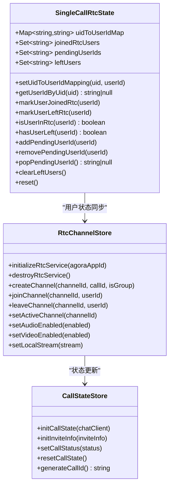

**图表来源**
- [lib/store/singleCallRtc.ts:4-134](file://lib/store/singleCallRtc.ts#L4-L134)
- [lib/store/rtcChannel.ts:8-145](file://lib/store/rtcChannel.ts#L8-L145)
- [lib/store/callState.ts:7-187](file://lib/store/callState.ts#L7-L187)

#### 核心功能特性

1. **UID映射管理**：维护Agora UID与用户ID的双向映射关系
2. **用户状态跟踪**：精确跟踪用户的加入、离开和待加入状态
3. **响应式更新**：通过强制重新赋值确保Vue响应式系统的正确更新
4. **生命周期管理**：支持用户重新加入和明确离开的复杂场景

**章节来源**
- [lib/store/singleCallRtc.ts:11-134](file://lib/store/singleCallRtc.ts#L11-L134)

### CallStateStore - 通话状态存储

`CallStateStore`负责管理整个通话过程中的状态信息，包括基础状态、邀请信息和超时控制。

#### 状态管理机制

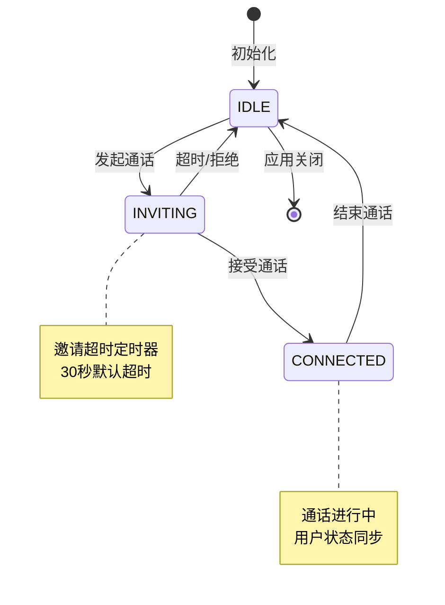

**图表来源**
- [lib/store/callState.ts:11-187](file://lib/store/callState.ts#L11-L187)

**章节来源**
- [lib/store/callState.ts:1-187](file://lib/store/callState.ts#L1-L187)

### RtcChannelStore - RTC频道存储

`RtcChannelStore`管理RTC频道的创建、连接和状态，为单人和群组通话提供统一的频道管理接口。

**章节来源**
- [lib/store/rtcChannel.ts:1-145](file://lib/store/rtcChannel.ts#L1-L145)

## 架构概览

系统采用分层架构设计，实现了清晰的职责分离：

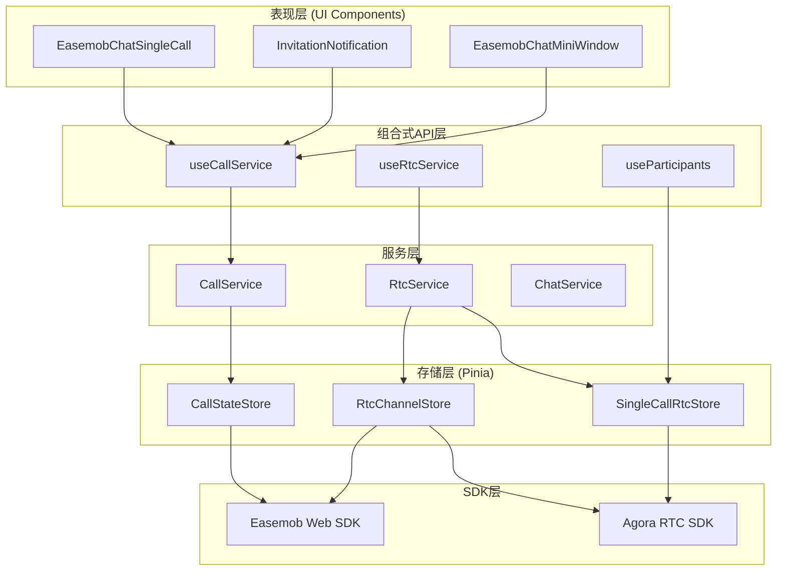

**图表来源**
- [lib/index.ts:1-70](file://lib/index.ts#L1-L70)
- [lib/ARCHITECTURE.md:1-190](file://lib/ARCHITECTURE.md#L1-L190)

**章节来源**
- [lib/index.ts:1-70](file://lib/index.ts#L1-L70)
- [lib/ARCHITECTURE.md:1-190](file://lib/ARCHITECTURE.md#L1-L190)

## 详细组件分析

### SingleCallRtcStore 详细分析

#### 数据结构设计

`SingleCallRtcStore`使用四种核心数据结构来管理用户状态：

1. **uidToUserIdMap (Map)**：维护Agora UID到用户ID的映射关系
2. **joinedRtcUsers (Set)**：跟踪已加入RTC频道的用户集合
3. **pendingUserIds (Set)**：管理待加入RTC的用户集合
4. **leftUsers (Set)**：记录已明确离开的用户，避免挂断后显示"邀请中"

#### 关键操作流程

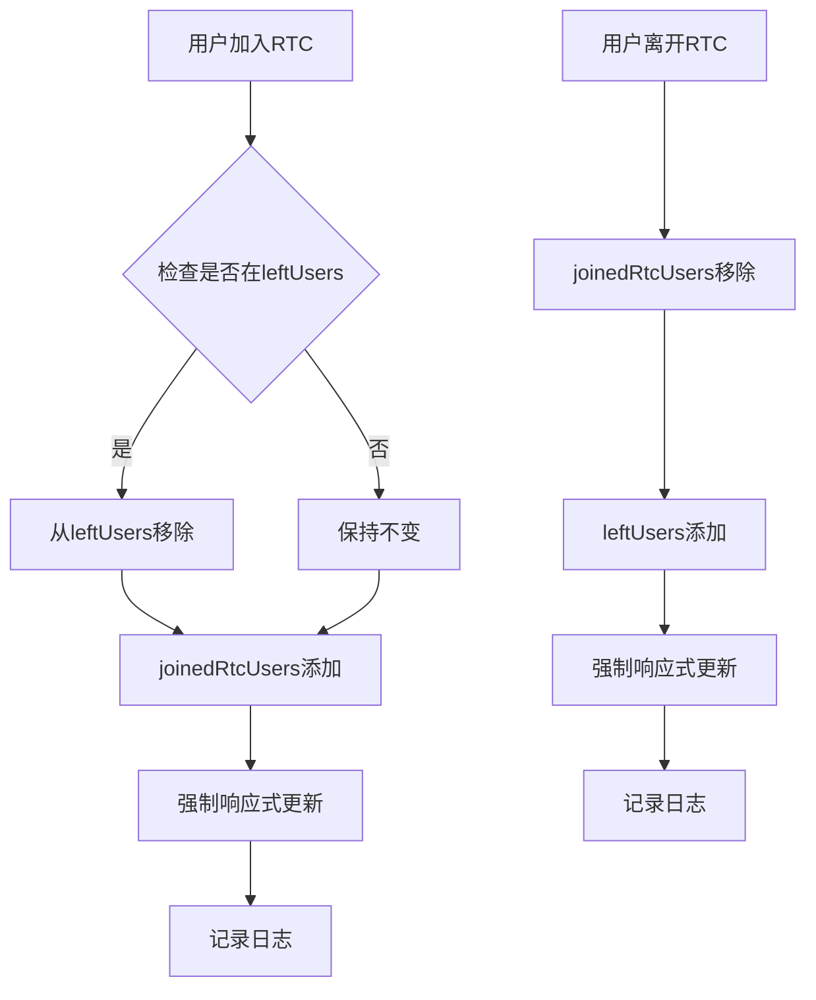

**图表来源**
- [lib/store/singleCallRtc.ts:45-68](file://lib/store/singleCallRtc.ts#L45-L68)

#### 状态同步机制

系统通过RtcService的回调机制实现状态同步：

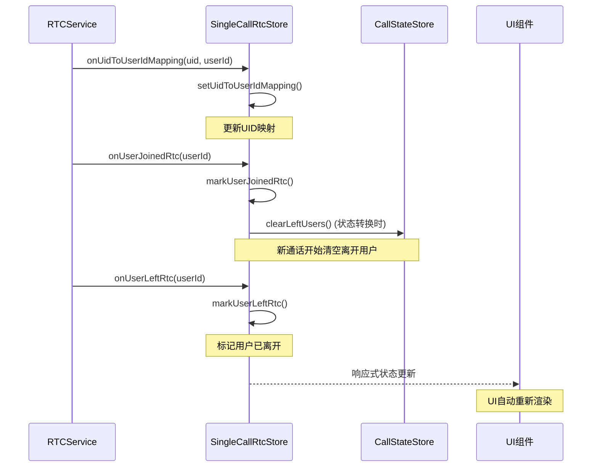

**图表来源**
- [lib/store/rtcChannel.ts:88-92](file://lib/store/rtcChannel.ts#L88-L92)
- [lib/store/callState.ts:103-107](file://lib/store/callState.ts#L103-L107)

**章节来源**
- [lib/store/singleCallRtc.ts:1-135](file://lib/store/singleCallRtc.ts#L1-L135)
- [lib/store/rtcChannel.ts:66-101](file://lib/store/rtcChannel.ts#L66-L101)
- [lib/store/callState.ts:99-108](file://lib/store/callState.ts#L99-L108)

### CallStateStore 状态管理

#### 状态转换逻辑

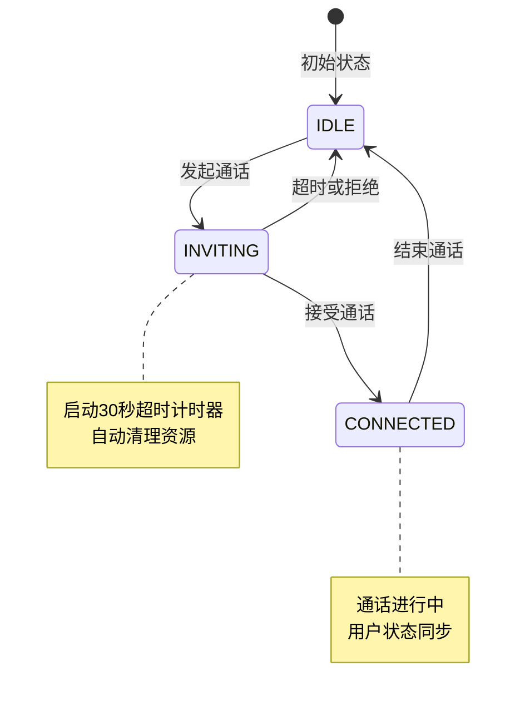

**图表来源**
- [lib/store/callState.ts:13-187](file://lib/store/callState.ts#L13-L187)

#### 超时处理机制

系统实现了智能的超时处理机制：

1. **定时器管理**：每个邀请都会启动独立的超时计时器
2. **资源清理**：超时后自动重置状态并清理定时器
3. **状态一致性**：确保超时处理不会影响其他正在进行的通话

**章节来源**
- [lib/store/callState.ts:58-88](file://lib/store/callState.ts#L58-L88)

### 类型系统设计

系统提供了完整的类型定义，确保类型安全：

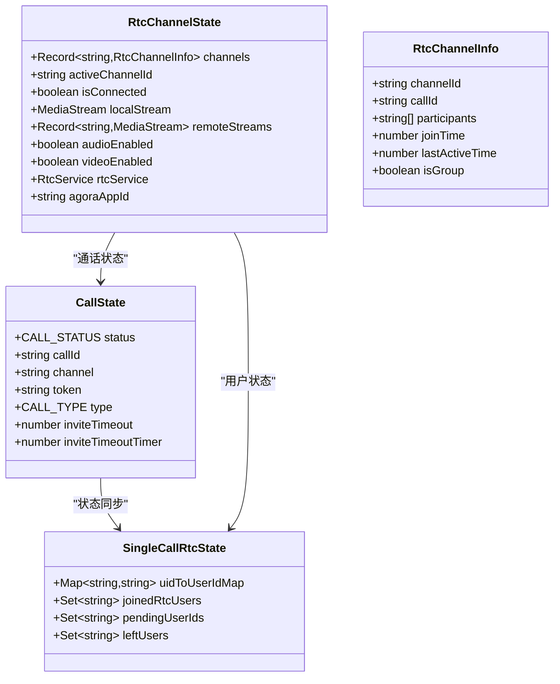

**图表来源**
- [lib/store/types.ts:43-75](file://lib/store/types.ts#L43-L75)

**章节来源**
- [lib/store/types.ts:1-75](file://lib/store/types.ts#L1-L75)

## 依赖关系分析

### 外部依赖

系统依赖以下关键外部库：

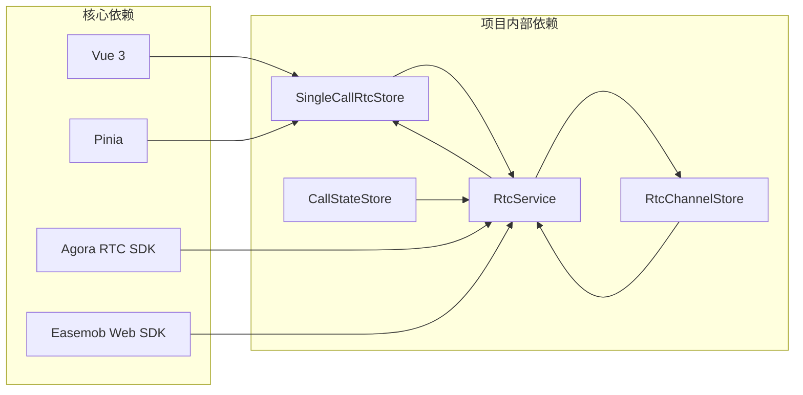

**图表来源**
- [package.json:47-51](file://package.json#L47-L51)
- [lib/store/singleCallRtc.ts:1](file://lib/store/singleCallRtc.ts#L1)
- [lib/store/rtcChannel.ts:1](file://lib/store/rtcChannel.ts#L1)

### 内部模块依赖

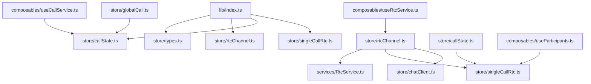

**图表来源**
- [lib/index.ts:9-13](file://lib/index.ts#L9-L13)
- [lib/store/rtcChannel.ts:5-6](file://lib/store/rtcChannel.ts#L5-L6)
- [lib/store/callState.ts:6](file://lib/store/callState.ts#L6)

**章节来源**
- [package.json:47-51](file://package.json#L47-L51)
- [lib/index.ts:1-70](file://lib/index.ts#L1-L70)

## 性能考虑

### 响应式更新优化

系统采用了多种优化策略来确保性能：

1. **强制响应式更新**：通过重新赋值Set对象确保Vue响应式系统的正确更新
2. **状态懒加载**：Store实例通过延迟获取机制避免不必要的初始化
3. **内存管理**：及时清理定时器和映射关系，防止内存泄漏

### 并发处理

系统能够有效处理并发场景：

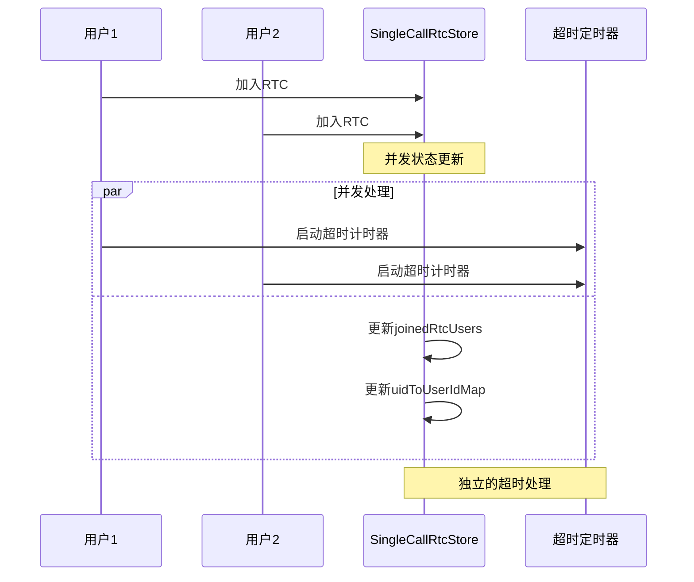

## 故障排除指南

### 常见问题及解决方案

#### Store初始化问题

**问题描述**：当Pinia未正确初始化时，可能出现"CallState store not properly initialized"错误。

**解决方案**：
1. 确保在应用层正确安装Pinia实例
2. 使用`app.use(pinia)`确保Pinia正确初始化
3. 添加store初始化状态跟踪机制

**章节来源**
- [.trae/documents/修复CallService中CallState store初始化检查问题.md:1-42](file://.trae/documents/修复CallService中CallState store初始化检查问题.md#L1-L42)

#### 状态同步问题

**问题描述**：用户状态不同步或UI不更新的问题。

**解决方案**：
1. 检查UID映射是否正确建立
2. 确认响应式更新机制正常工作
3. 验证状态转换逻辑的完整性

#### 内存泄漏问题

**问题描述**：长时间运行后出现内存占用过高的问题。

**解决方案**：
1. 确保超时定时器正确清理
2. 及时清理用户映射关系
3. 在组件卸载时调用store.reset()

## 结论

单人通话RTC存储系统展现了优秀的架构设计和实现质量。通过精心设计的数据结构、完善的类型系统和智能的状态管理机制，系统能够可靠地处理复杂的实时通信场景。

### 主要优势

1. **类型安全**：完整的TypeScript类型定义确保编译时类型检查
2. **响应式更新**：利用Vue 3的响应式系统实现高效的UI同步
3. **状态一致性**：通过严格的状态转换逻辑确保系统状态的一致性
4. **可扩展性**：模块化的设计便于功能扩展和维护

### 技术亮点

1. **智能状态同步**：通过回调机制实现多组件间的状态同步
2. **超时处理机制**：完善的超时处理确保系统稳定性
3. **内存管理**：及时的资源清理防止内存泄漏
4. **错误处理**：健壮的错误处理机制提高系统可靠性

该存储系统为单人实时通信提供了坚实的技术基础，能够满足各种复杂的业务场景需求。