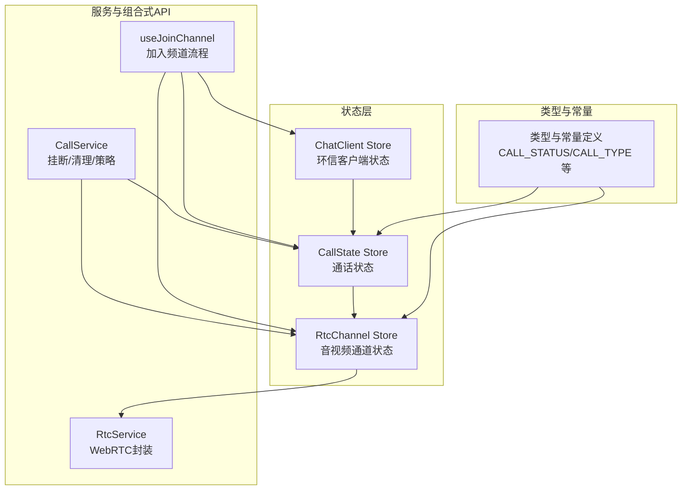
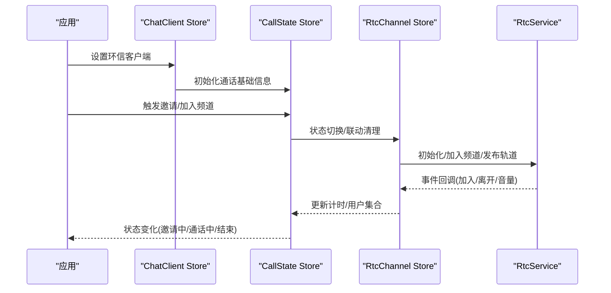
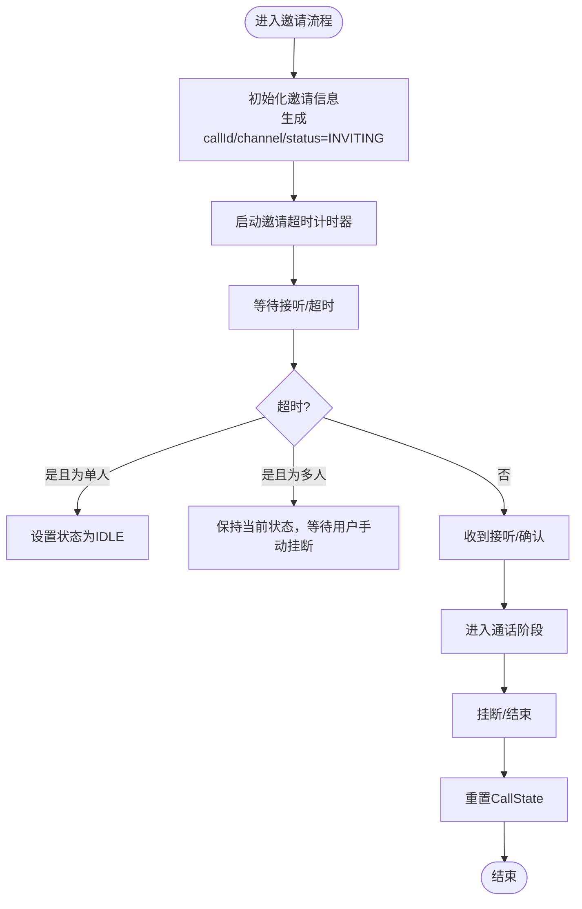
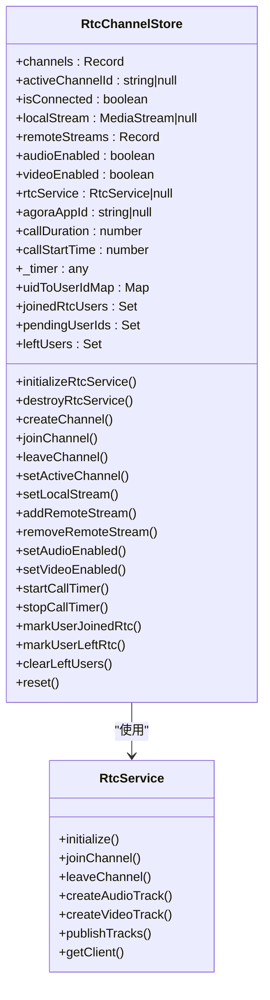
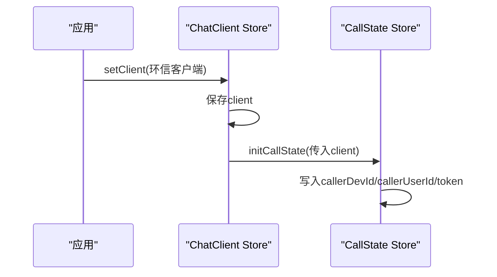
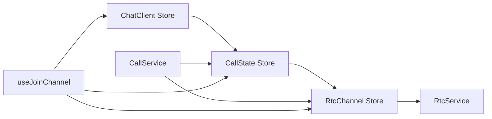

# 状态管理

<cite>
**本文引用的文件**
- [lib/store/callState.ts](file://lib/store/callState.ts)
- [lib/store/rtcChannel.ts](file://lib/store/rtcChannel.ts)
- [lib/store/chatClient.ts](file://lib/store/chatClient.ts)
- [lib/store/types.ts](file://lib/store/types.ts)
- [lib/store/index.ts](file://lib/store/index.ts)
- [lib/types/callstate.types.ts](file://lib/types/callstate.types.ts)
- [lib/services/CallService.ts](file://lib/services/CallService.ts)
- [lib/composables/useJoinChannel.ts](file://lib/composables/useJoinChannel.ts)
- [lib/services/RtcService.ts](file://lib/services/RtcService.ts)
</cite>

## 目录
1. [简介](#简介)
2. [项目结构](#项目结构)
3. [核心组件](#核心组件)
4. [架构总览](#架构总览)
5. [详细组件分析](#详细组件分析)
6. [依赖分析](#依赖分析)
7. [性能考虑](#性能考虑)
8. [故障排查指南](#故障排查指南)
9. [结论](#结论)
10. [附录](#附录)

## 简介
本文件系统性梳理并说明本项目的状态管理方案，重点围绕 Pinia Store 的设计与实现，解释 CallState Store、RtcChannel Store、ChatClient Store 的职责分工、状态结构、动作方法、计算属性与生命周期管理；阐明三者之间的依赖关系与同步机制；并总结状态持久化、状态重置与恢复的实现方式与最佳实践。

## 项目结构
本项目采用“按领域分层”的 store 组织方式：
- store 层：定义三个核心 Pinia Store（CallState、RtcChannel、ChatClient），统一导出并在应用层注入 Pinia 实例。
- 类型层：集中定义 Call/RTC 相关的类型与常量，保证状态结构与行为的一致性。
- 服务层：封装业务流程（如挂断、加入频道等），协调多个 Store 与外部 SDK。
- 组合式 API：封装常用流程（如加入频道）以复用逻辑。

图表来源
- [lib/store/callState.ts](file://lib/store/callState.ts#L1-L263)
- [lib/store/rtcChannel.ts](file://lib/store/rtcChannel.ts#L1-L410)
- [lib/store/chatClient.ts](file://lib/store/chatClient.ts#L1-L23)
- [lib/types/callstate.types.ts](file://lib/types/callstate.types.ts#L1-L93)
- [lib/services/CallService.ts](file://lib/services/CallService.ts#L1-L298)
- [lib/composables/useJoinChannel.ts](file://lib/composables/useJoinChannel.ts#L1-L185)
- [lib/services/RtcService.ts](file://lib/services/RtcService.ts#L1-L200)

章节来源
- [lib/store/index.ts](file://lib/store/index.ts#L1-L3)
- [lib/store/types.ts](file://lib/store/types.ts#L1-L86)

## 核心组件
- CallState Store：负责通话生命周期状态、邀请流程、超时控制、用户信息映射、窗口模式等。
- RtcChannel Store：负责 RTC 频道管理、媒体流管理、计时器、用户加入/离开状态、UID 映射等。
- ChatClient Store：负责保存环信客户端实例，并在初始化时联动 CallState Store 注入基础信息。

章节来源
- [lib/store/callState.ts](file://lib/store/callState.ts#L7-L263)
- [lib/store/rtcChannel.ts](file://lib/store/rtcChannel.ts#L7-L410)
- [lib/store/chatClient.ts](file://lib/store/chatClient.ts#L6-L22)

## 架构总览
三者协作关系如下：
- ChatClient Store 在设置客户端时，调用 CallState Store 初始化基础信息（如用户ID、设备ID、token）。
- CallState Store 管理通话状态与邀请流程，同时在状态切换时联动 RtcChannel Store 清理“已离开用户”集合。
- RtcChannel Store 通过 RtcService 管理 WebRTC 生命周期，维护频道、媒体流、计时器与用户集合。
- CallService 与 useJoinChannel 等组合式 API 协同，驱动状态变更与外部资源释放。

图表来源
- [lib/store/chatClient.ts](file://lib/store/chatClient.ts#L10-L16)
- [lib/store/callState.ts](file://lib/store/callState.ts#L142-L151)
- [lib/store/rtcChannel.ts](file://lib/store/rtcChannel.ts#L84-L121)
- [lib/services/RtcService.ts](file://lib/services/RtcService.ts#L82-L138)
- [lib/composables/useJoinChannel.ts](file://lib/composables/useJoinChannel.ts#L76-L178)

## 详细组件分析

### CallState Store（通话状态）
- 职责
  - 维护通话生命周期状态（邀请中、响铃、连接中、已连接、结束等）。
  - 维护邀请信息（被邀请成员、群组信息、通话ID、频道名、token 等）。
  - 超时控制与处理（定时器、超时回调、多人群呼超时策略）。
  - 用户信息映射与 UID 映射。
  - 窗口模式状态（最小化）。
- 状态结构要点
  - 基础状态：状态码、通话类型、通话ID、频道名、token、caller/callee 用户与设备ID、群组信息、被邀请/已加入成员列表、时长等。
  - 超时配置：邀请超时时间与定时器句柄。
  - 映射：用户信息 Map、UID 到用户ID Map。
  - 窗口模式：是否最小化。
- 动作方法
  - 初始化：initCallState、initInviteInfo、buildAndUpdateInviteState。
  - 超时控制：startTimeoutTimer、clearTimeoutTimer、handleTimeout。
  - 状态更新：updateCallState、setCallStatus（含状态切换联动清理 leftUsers）。
  - 重置：resetCallState。
  - 辅助：setUserInfo、updateInvitedMembers、generateCallId。
- 计算属性
  - getCallStatus、getCallState、getUserInfo、getInviteTimeoutTimer、isInviting、isInCall、getInvitedMembers、getIsMinimized。
- 生命周期管理
  - 超时定时器在邀请阶段启用，结束后清理。
  - 状态从 IDLE 切换到非 IDLE 时，联动清理 RtcChannel Store 的 leftUsers，避免挂断后残留状态。
- 依赖关系
  - 依赖 RtcChannel Store（状态切换时调用其清理 leftUsers）。
  - 依赖类型常量（CALL_STATUS、CALL_TYPE）。

图表来源
- [lib/store/callState.ts](file://lib/store/callState.ts#L44-L131)
- [lib/store/rtcChannel.ts](file://lib/store/rtcChannel.ts#L334-L337)

章节来源
- [lib/store/callState.ts](file://lib/store/callState.ts#L11-L206)
- [lib/store/callState.ts](file://lib/store/callState.ts#L210-L261)
- [lib/types/callstate.types.ts](file://lib/types/callstate.types.ts#L13-L22)
- [lib/types/callstate.types.ts](file://lib/types/callstate.types.ts#L42-L48)

### RtcChannel Store（音视频通道状态）
- 职责
  - 管理 RTC 频道集合、当前活跃频道、连接状态。
  - 管理本地/远程媒体流、音视频开关。
  - 维护通话计时器、起始时间、时长。
  - 维护 UID 到用户ID映射、已加入用户集合、待加入用户集合、已离开用户集合（避免挂断后显示“邀请中”）。
  - 初始化/销毁 RTC 服务。
- 状态结构要点
  - channels：记录各频道的参与者、加入/最后活跃时间、是否群组。
  - activeChannelId、isConnected、localStream、remoteStreams。
  - 音视频开关、rtcService、agoraAppId。
  - 计时器、起始时间、时长。
  - 映射与集合：uidToUserIdMap、joinedRtcUsers、pendingUserIds、leftUsers。
- 动作方法
  - 服务管理：initializeRtcService、destroyRtcService。
  - 频道管理：createChannel、setActiveChannel、joinChannel、leaveChannel、removeChannel。
  - 流管理：setLocalStream、addRemoteStream、removeRemoteStream。
  - 音视频控制：setAudioEnabled、setVideoEnabled。
  - 计时器：startCallTimer、updateCallDuration、stopCallTimer。
  - 用户集合：markUserJoinedRtc、markUserLeftRtc、isUserInRtc、hasUserLeft、clearLeftUsers。
  - 待加入用户：addPendingUserId、removePendingUserId、popPendingUserId。
  - 重置：reset（停止轨道、清理集合、停止计时器）。
- 计算属性
  - activeChannel、activeChannelParticipantCount、channelIds、getRtcService、formattedCallDuration。
- 生命周期管理
  - 通过 CallService 在挂断时清理媒体资源与连接，并重置状态。
  - 通过 CallState 在状态切换时清理 leftUsers，避免状态错乱。
- 依赖关系
  - 依赖 ChatClient Store 获取环信客户端。
  - 依赖 RtcService 执行 WebRTC 操作。
  - 与 CallState 存在状态联动（leftUsers 清理）。

图表来源
- [lib/store/rtcChannel.ts](file://lib/store/rtcChannel.ts#L11-L408)
- [lib/services/RtcService.ts](file://lib/services/RtcService.ts#L42-L171)

章节来源
- [lib/store/rtcChannel.ts](file://lib/store/rtcChannel.ts#L11-L408)
- [lib/store/rtcChannel.ts](file://lib/store/rtcChannel.ts#L33-L75)

### ChatClient Store（环信客户端）
- 职责
  - 保存环信客户端实例。
  - 在设置客户端时，联动初始化 CallState Store 的基础信息（如用户ID、设备ID、token）。
- 状态结构
  - client：Chat.Connection 或 null。
- 动作方法
  - setClient：设置客户端并初始化 CallState。
- 计算属性
  - getChatClient、getClientDeviceId。
- 依赖关系
  - 依赖 CallState Store。

图表来源
- [lib/store/chatClient.ts](file://lib/store/chatClient.ts#L10-L16)
- [lib/store/callState.ts](file://lib/store/callState.ts#L44-L48)

章节来源
- [lib/store/chatClient.ts](file://lib/store/chatClient.ts#L7-L22)

### 类型与常量（统一契约）
- 类型与常量
  - CALL_STATUS：通话状态枚举（IDLE、INVITING、ALERTING、CONFIRM_RING、RECEIVED_CONFIRM_RING、ANSWER_CALL、CONFIRM_CALLEE、IN_CALL）。
  - CALL_TYPE：通话类型枚举（一对一音频/视频、多人音频/视频）。
  - HANGUP_REASON：挂断原因枚举。
- 通话状态接口
  - CALL_INFO：通话基本信息。
  - CallState：扩展 CALL_INFO 并加入状态、超时、映射、窗口模式等。
  - RtcChannelState/RtcChannelInfo：RTC 频道状态与信息。
- 作用
  - 保证 Store 状态结构与业务流程一致，便于跨模块协作与类型安全。

章节来源
- [lib/types/callstate.types.ts](file://lib/types/callstate.types.ts#L13-L22)
- [lib/types/callstate.types.ts](file://lib/types/callstate.types.ts#L42-L67)
- [lib/store/types.ts](file://lib/store/types.ts#L43-L85)

## 依赖分析
- 模块耦合
  - ChatClient → CallState：初始化依赖。
  - CallState → RtcChannel：状态切换联动清理 leftUsers。
  - RtcChannel → RtcService：底层 WebRTC 能力封装。
  - CallService/组合式 API：协调多个 Store 与外部 SDK。
- 外部依赖
  - Pinia：Store 容器（应用层提供实例）。
  - Agora RTC SDK：音视频能力。
  - 环信 IM SDK：信令与 token 获取。
- 循环依赖
  - 通过延迟获取 Store 实例（在类 getter 中）避免循环依赖问题。

图表来源
- [lib/services/CallService.ts](file://lib/services/CallService.ts#L12-L23)
- [lib/composables/useJoinChannel.ts](file://lib/composables/useJoinChannel.ts#L26-L29)
- [lib/store/chatClient.ts](file://lib/store/chatClient.ts#L13-L15)
- [lib/store/callState.ts](file://lib/store/callState.ts#L148-L149)
- [lib/store/rtcChannel.ts](file://lib/store/rtcChannel.ts#L95-L103)

## 性能考虑
- 响应式更新
  - 对于频繁更新的集合（如 joinedRtcUsers/leftUsers），通过重新赋值 Set 的方式强制触发响应式更新，确保视图及时刷新。
- 定时器与计时
  - 邀请超时与通话计时分别使用独立定时器，退出时需清理，避免内存泄漏。
- 媒体资源
  - 离开频道/挂断时，停止本地与远程轨道，避免资源占用。
- 状态粒度
  - 将用户映射、集合状态拆分为独立字段，降低不必要的响应式开销。
- 最佳实践
  - 在状态切换关键点（如从 IDLE 切换到非 IDLE）进行联动清理，避免脏数据。
  - 使用组合式 API 封装复杂流程，减少重复逻辑与错误路径。

[本节为通用指导，不直接分析具体文件]

## 故障排查指南
- 无法加入频道
  - 检查 ChatClient 是否已设置，Token 是否获取成功。
  - 检查 RtcChannel Store 的 rtcService 是否初始化，isConnected 状态是否异常。
  - 查看 RtcService 的日志输出，定位 joinChannel 失败原因。
- 通话结束后仍显示“邀请中”
  - 确认 CallState 在状态切换时是否调用 RtcChannel 的 clearLeftUsers。
  - 检查 RtcChannel 的 leftUsers 是否被正确清空。
- 挂断异常
  - 通过 CallService 的 hangup 流程，确认是否清理了媒体资源与连接。
  - 若中途异常，确保最终将 CallState 状态重置为 IDLE。
- 超时处理
  - 单人通话超时应自动回到 IDLE；多人通话超时不应自动隐藏，需等待用户手动挂断。

章节来源
- [lib/composables/useJoinChannel.ts](file://lib/composables/useJoinChannel.ts#L76-L178)
- [lib/store/callState.ts](file://lib/store/callState.ts#L115-L131)
- [lib/store/rtcChannel.ts](file://lib/store/rtcChannel.ts#L334-L337)
- [lib/services/CallService.ts](file://lib/services/CallService.ts#L25-L72)

## 结论
本项目通过三个 Store 明确划分职责：ChatClient 负责客户端上下文初始化，CallState 负责通话生命周期与邀请流程，RtcChannel 负责 RTC 频道与媒体状态。二者之间通过类型常量与组合式 API 协作，形成清晰的依赖链与同步机制。配合 CallService 的挂断策略与资源清理，整体状态管理具备良好的可维护性与可扩展性。

[本节为总结性内容，不直接分析具体文件]

## 附录

### 状态持久化、重置与恢复
- 持久化
  - 当前实现未见内置持久化逻辑。若需持久化，建议在应用层通过 Pinia 插件或自定义序列化策略对关键状态（如用户ID、设备ID、token）进行持久化，并在应用启动时恢复。
- 重置
  - CallState：resetCallState 清理邀请与通话相关状态，保留 caller 相关不变项。
  - RtcChannel：reset 清理媒体轨道、频道集合、计时器与映射集合。
- 恢复
  - ChatClient 初始化后联动 CallState 恢复基础信息；RtcChannel 在需要时重新初始化服务与加入频道。

章节来源
- [lib/store/callState.ts](file://lib/store/callState.ts#L156-L188)
- [lib/store/rtcChannel.ts](file://lib/store/rtcChannel.ts#L373-L408)
- [lib/store/chatClient.ts](file://lib/store/chatClient.ts#L10-L16)