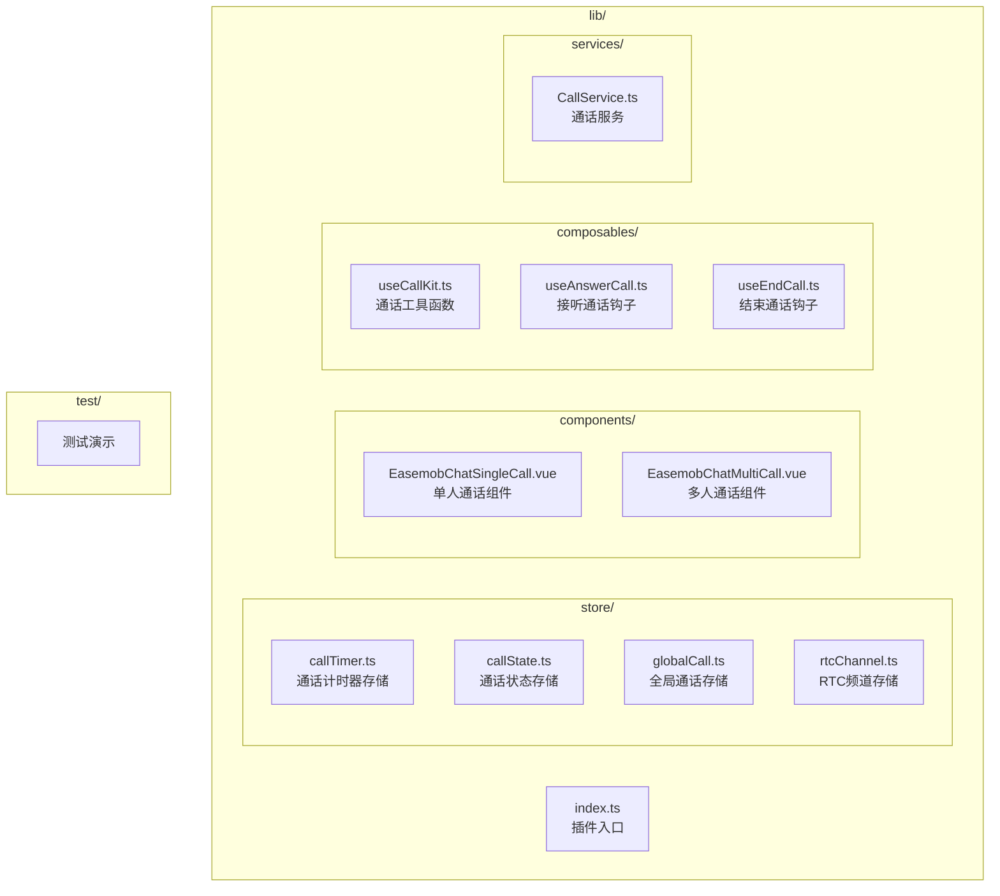
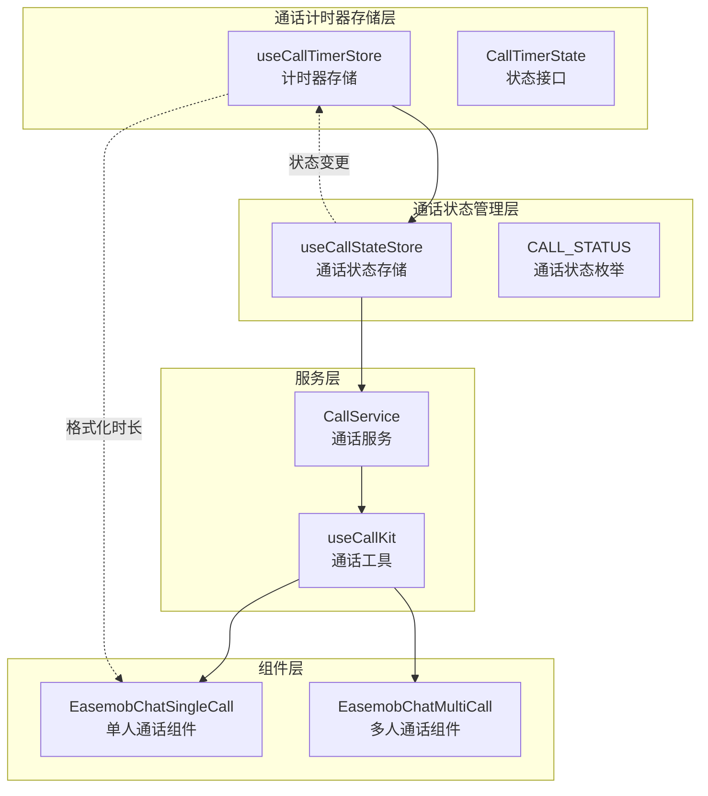
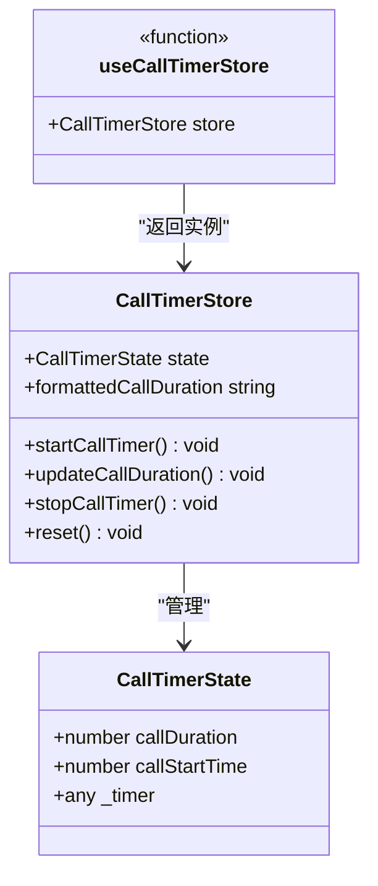
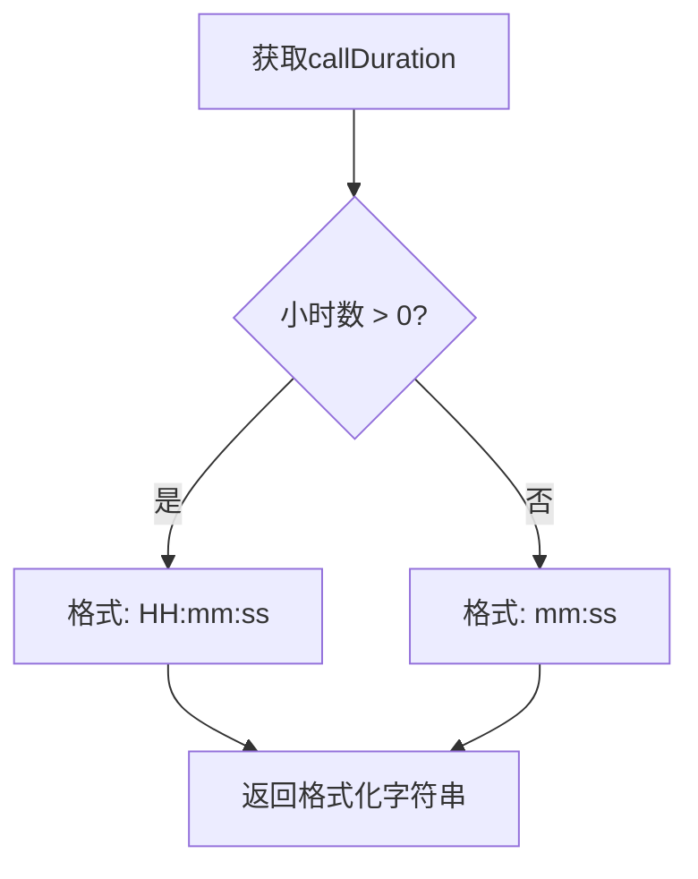
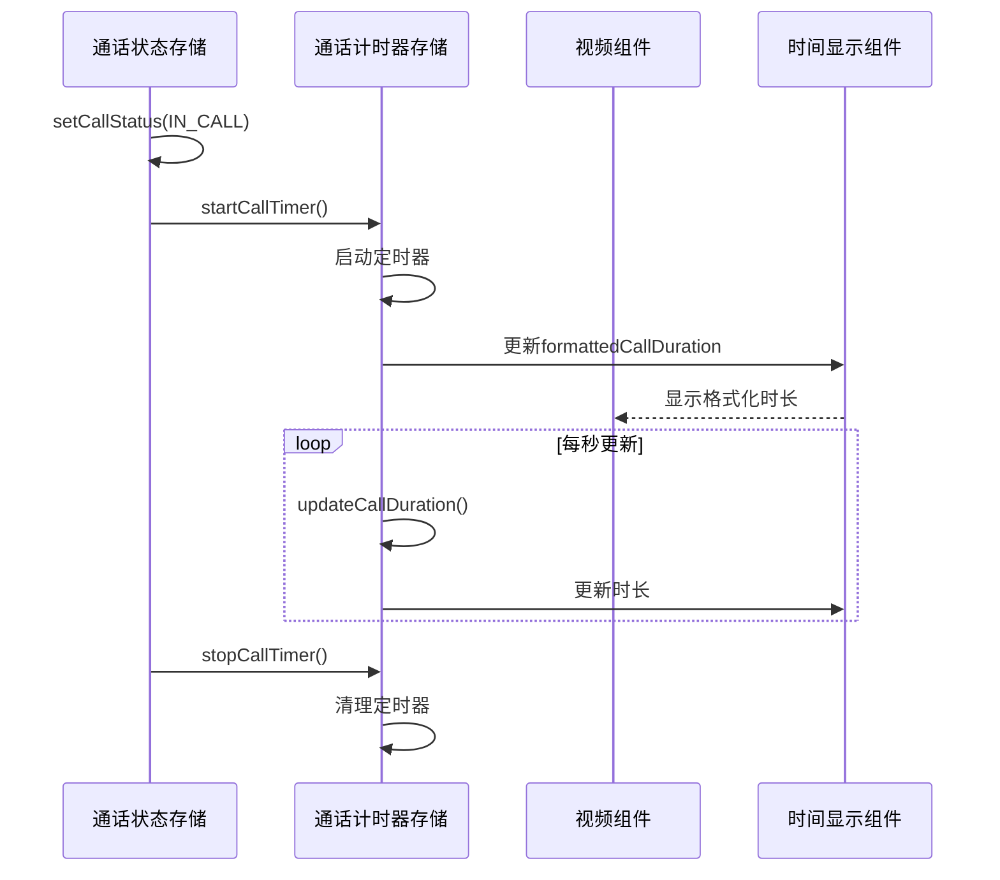
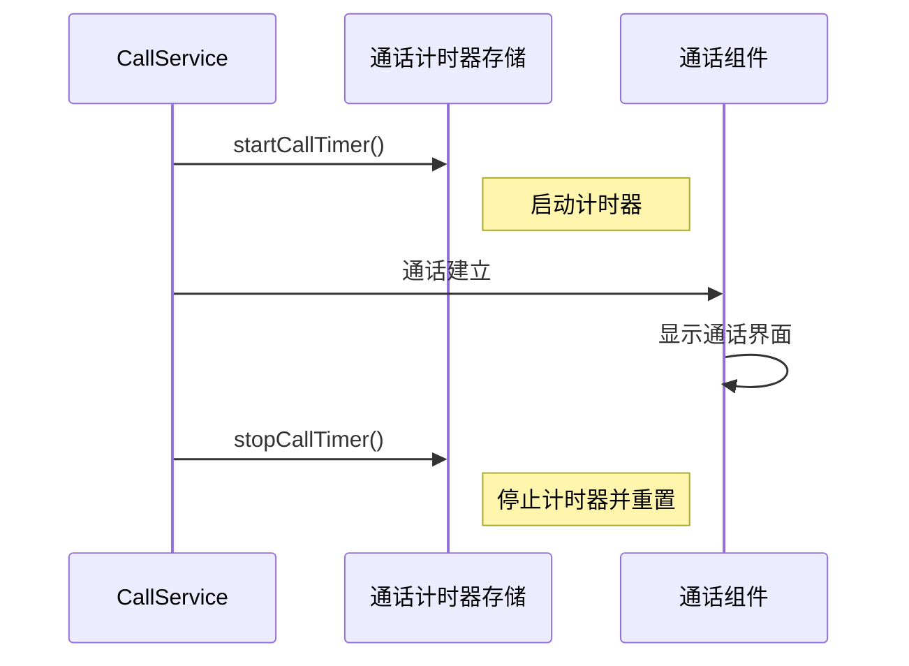
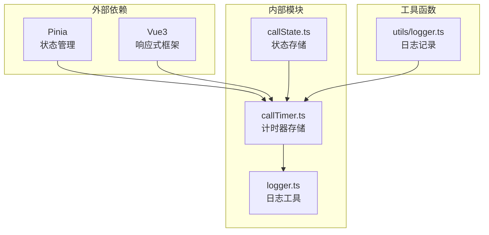

# 通话计时器存储

<cite>
**本文档引用的文件**
- [README.md](file://README.md)
- [index.ts](file://lib/index.ts)
- [callTimer.ts](file://lib/store/callTimer.ts)
- [callState.ts](file://lib/store/callState.ts)
- [CallService.ts](file://lib/services/CallService.ts)
- [useCallKit.ts](file://lib/composables/useCallKit.ts)
- [useAnswerCall.ts](file://lib/composables/useAnswerCall.ts)
- [useEndCall.ts](file://lib/composables/useEndCall.ts)
- [EasemobChatSingleCall.vue](file://lib/components/singleCall/EasemobChatSingleCall.vue)
- [logger.ts](file://lib/utils/logger.ts)
- [callstate.types.ts](file://lib/types/callstate.types.ts)
</cite>

## 目录
1. [简介](#简介)
2. [项目结构](#项目结构)
3. [核心组件](#核心组件)
4. [架构概览](#架构概览)
5. [详细组件分析](#详细组件分析)
6. [依赖关系分析](#依赖关系分析)
7. [性能考虑](#性能考虑)
8. [故障排除指南](#故障排除指南)
9. [结论](#结论)

## 简介

通话计时器存储是环信聊天和音视频通话插件中的一个核心功能模块，专门负责管理一对一通话的时长计时。该模块基于Pinia状态管理库实现，提供了完整的通话计时生命周期管理，包括计时器的启动、暂停、停止和重置功能。

该项目是一个Vue3插件项目，集成了环信聊天和音视频通话功能，支持一对一和群组通话场景。通话计时器存储作为其中的一个独立模块，专注于提供准确的通话时长统计功能。

## 项目结构

项目采用模块化架构设计，主要分为以下几个核心目录：

**图表来源**
- [README.md:5-31](file://README.md#L5-L31)
- [index.ts:1-70](file://lib/index.ts#L1-L70)

**章节来源**
- [README.md:5-31](file://README.md#L5-L31)
- [index.ts:1-70](file://lib/index.ts#L1-L70)

## 核心组件

通话计时器存储模块的核心组件包括：

### 主要存储接口

| 接口名称 | 描述 | 责任范围 |
|---------|------|----------|
| `CallTimerState` | 通话计时器状态接口 | 定义计时器所需的所有状态字段 |
| `useCallTimerStore` | 主存储实例 | 提供完整的计时器功能 |

### 关键状态字段

| 字段名 | 类型 | 描述 | 默认值 |
|--------|------|------|--------|
| `callDuration` | number | 通话持续时间（秒） | 0 |
| `callStartTime` | number | 通话开始时间戳 | 0 |
| `_timer` | any | 定时器引用 | null |

### 核心功能方法

| 方法名 | 参数 | 返回值 | 描述 |
|--------|------|--------|------|
| `formattedCallDuration` | 无 | string | 获取格式化的通话时长（HH:mm:ss或mm:ss） |
| `startCallTimer` | 无 | void | 启动通话计时器 |
| `updateCallDuration` | 无 | void | 更新通话时长（内部调用） |
| `stopCallTimer` | 无 | void | 停止通话计时器 |
| `reset` | 无 | void | 重置计时器状态 |

**章节来源**
- [callTimer.ts:4-84](file://lib/store/callTimer.ts#L4-L84)

## 架构概览

通话计时器存储在整个通话系统中的位置和交互关系如下：

**图表来源**
- [callTimer.ts:15-84](file://lib/store/callTimer.ts#L15-L84)
- [callState.ts:7-187](file://lib/store/callState.ts#L7-L187)
- [CallService.ts:10-360](file://lib/services/CallService.ts#L10-L360)

## 详细组件分析

### 通话计时器存储实现

通话计时器存储基于Pinia实现，提供了完整的状态管理和计算属性功能：

**图表来源**
- [callTimer.ts:4-84](file://lib/store/callTimer.ts#L4-L84)

#### 状态管理机制

通话计时器存储采用了标准的Pinia模式，包含以下核心特性：

1. **响应式状态**：所有状态字段都是响应式的，自动追踪变更
2. **计算属性**：`formattedCallDuration`提供格式化的时长显示
3. **动作方法**：封装了所有状态变更操作
4. **生命周期管理**：自动处理定时器的创建和清理

#### 格式化时长算法

时长格式化逻辑根据通话时长自动选择合适的显示格式：

**图表来源**
- [callTimer.ts:22-36](file://lib/store/callTimer.ts#L22-L36)

**章节来源**
- [callTimer.ts:15-84](file://lib/store/callTimer.ts#L15-L84)

### 与通话状态的集成

通话计时器存储与通话状态存储紧密集成，通过状态变更触发计时器操作：

**图表来源**
- [callState.ts:99-108](file://lib/store/callState.ts#L99-L108)
- [callTimer.ts:42-74](file://lib/store/callTimer.ts#L42-L74)

### 服务层集成

通话计时器存储与CallService的集成确保了在通话生命周期中的正确时序：

**图表来源**
- [CallService.ts:341-355](file://lib/services/CallService.ts#L341-L355)
- [callTimer.ts:66-74](file://lib/store/callTimer.ts#L66-L74)

**章节来源**
- [callState.ts:99-108](file://lib/store/callState.ts#L99-L108)
- [CallService.ts:341-355](file://lib/services/CallService.ts#L341-L355)

## 依赖关系分析

通话计时器存储模块的依赖关系清晰明确，遵循单一职责原则：

**图表来源**
- [callTimer.ts:1-3](file://lib/store/callTimer.ts#L1-L3)
- [logger.ts:50-217](file://lib/utils/logger.ts#L50-L217)

### 关键依赖特性

1. **Pinia集成**：使用defineStore创建响应式存储
2. **Vue3响应式**：利用Vue的响应式系统自动更新UI
3. **日志集成**：统一的日志记录机制便于调试和监控
4. **类型安全**：完整的TypeScript类型定义

**章节来源**
- [callTimer.ts:1-3](file://lib/store/callTimer.ts#L1-L3)
- [logger.ts:50-217](file://lib/utils/logger.ts#L50-L217)

## 性能考虑

通话计时器存储在性能方面采用了多项优化措施：

### 内存管理
- **定时器清理**：确保每次停止计时器时都清理定时器引用
- **状态重置**：提供reset方法彻底清理所有状态
- **垃圾回收**：避免内存泄漏，及时释放定时器资源

### 计算效率
- **精确计时**：使用Date.now()获取高精度时间戳
- **按需更新**：只有在状态变更时才更新UI
- **格式化缓存**：计算属性自动缓存格式化结果

### 并发安全
- **状态隔离**：每个通话实例都有独立的计时器状态
- **竞态条件防护**：通过状态检查防止重复操作
- **错误恢复**：完善的错误处理机制确保系统稳定性

## 故障排除指南

### 常见问题及解决方案

| 问题类型 | 症状 | 可能原因 | 解决方案 |
|----------|------|----------|----------|
| 计时器不启动 | 时长始终为0 | 定时器未正确启动 | 检查startCallTimer调用 |
| 计时器不停止 | 页面刷新后仍有计时 | 定时器未清理 | 调用stopCallTimer或reset |
| 时长显示异常 | 格式化时长错误 | 状态字段损坏 | 重置计时器状态 |
| 内存泄漏 | 页面长时间运行后内存增长 | 定时器未清理 | 确保在组件卸载时清理定时器 |

### 调试建议

1. **启用详细日志**：使用logger.debug查看计时器状态变更
2. **监控定时器状态**：检查_timer字段确认定时器是否活跃
3. **验证状态同步**：确保计时器状态与通话状态同步
4. **测试边界情况**：验证长时间通话和快速切换场景

**章节来源**
- [logger.ts:148-231](file://lib/utils/logger.ts#L148-L231)

## 结论

通话计时器存储模块是环信聊天和音视频通话插件中的重要组成部分，具有以下特点：

### 设计优势
- **模块化设计**：独立的存储模块，职责单一明确
- **响应式更新**：基于Vue3和Pinia的响应式状态管理
- **类型安全**：完整的TypeScript类型定义
- **易于扩展**：清晰的接口设计便于功能扩展

### 技术特色
- **精确计时**：基于高精度时间戳的计时机制
- **格式化显示**：智能的时长格式化算法
- **生命周期管理**：完善的定时器生命周期控制
- **错误处理**：健壮的错误处理和恢复机制

### 应用价值
该模块为用户提供准确的通话时长统计功能，支持多种显示格式，满足不同场景下的使用需求。通过与其他模块的紧密集成，形成了完整的通话管理系统。