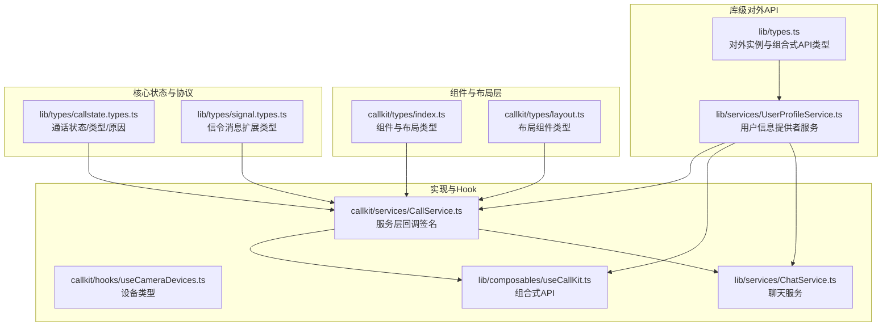
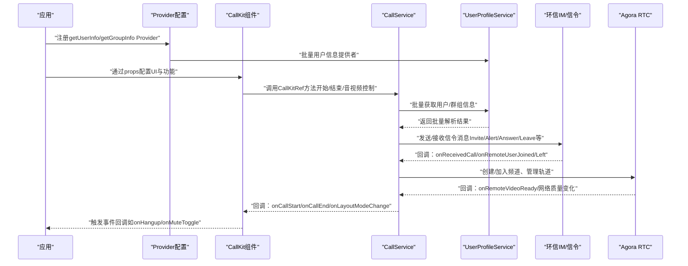
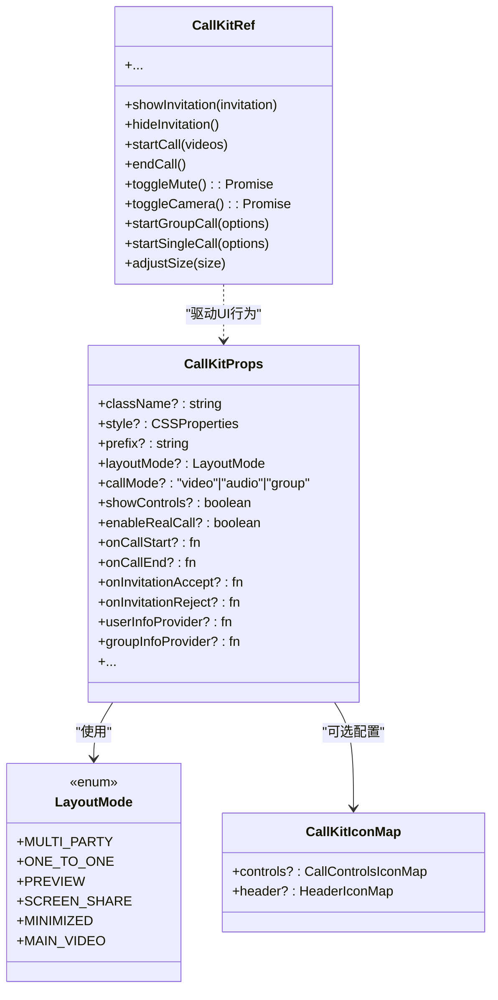
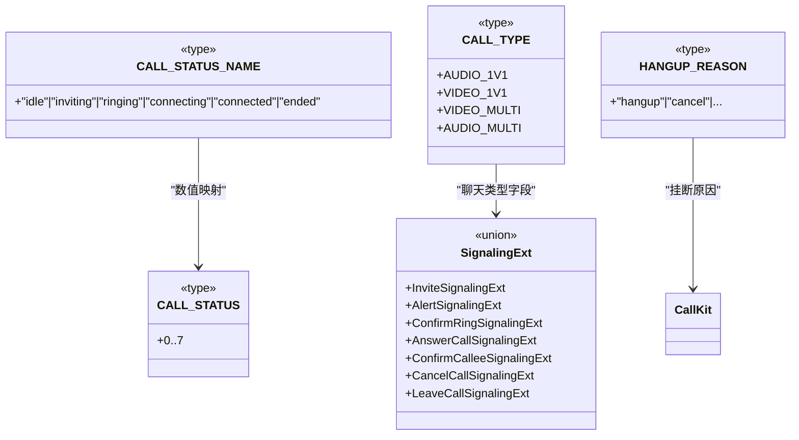
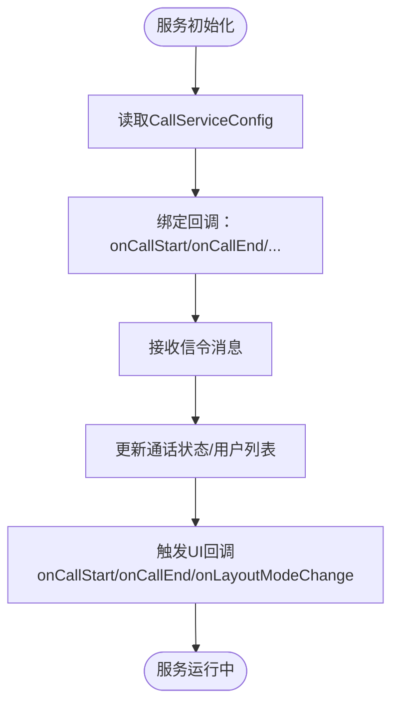
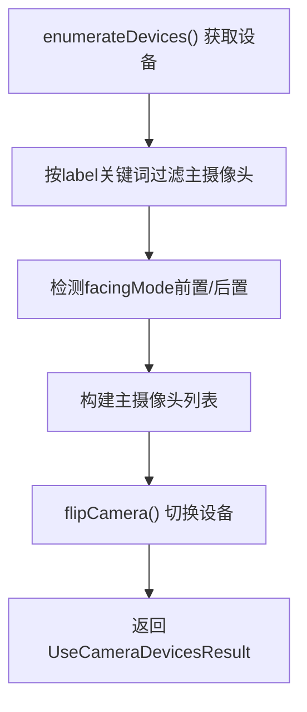
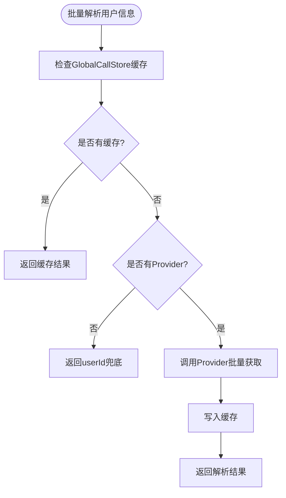
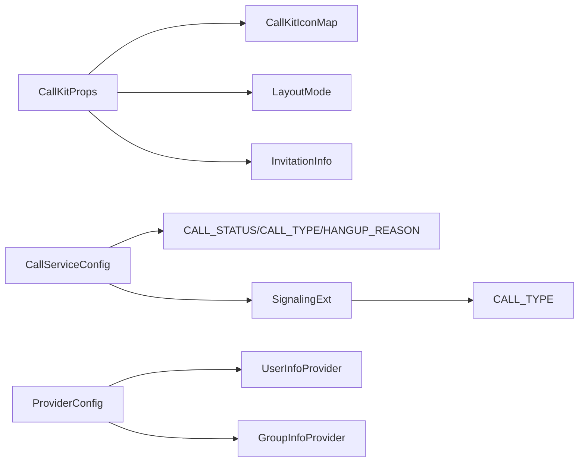

# 类型定义

<cite>
**本文引用的文件**
- [lib/types.ts](file://lib/types.ts)
- [callkit/types/index.ts](file://callkit/types/index.ts)
- [callkit/types/layout.ts](file://callkit/types/layout.ts)
- [lib/types/callstate.types.ts](file://lib/types/callstate.types.ts)
- [lib/types/signal.types.ts](file://lib/types/signal.types.ts)
- [lib/services/UserProfileService.ts](file://lib/services/UserProfileService.ts)
- [callkit/services/CallService.ts](file://callkit/services/CallService.ts)
- [callkit/hooks/useCameraDevices.ts](file://callkit/hooks/useCameraDevices.ts)
- [lib/composables/useCallKit.ts](file://lib/composables/useCallKit.ts)
- [lib/services/ChatService.ts](file://lib/services/ChatService.ts)
- [.trae/documents/修复CallService中CallState store初始化检查问题.md](file://.trae/documents/修复CallService中CallState store初始化检查问题.md)
</cite>

## 更新摘要
**变更内容**
- 增强Provider配置接口，支持批量用户信息获取
- 新增UserInfoProvider和GroupInfoProvider类型定义
- 扩展ProviderConfig接口，添加getUserInfo和getGroupInfo方法
- 更新UserProfileService，实现批量用户信息解析功能
- 增强CallService对批量用户信息的支持

## 目录
1. [简介](#简介)
2. [项目结构](#项目结构)
3. [核心组件](#核心组件)
4. [架构总览](#架构总览)
5. [详细组件分析](#详细组件分析)
6. [依赖分析](#依赖分析)
7. [性能考虑](#性能考虑)
8. [故障排查指南](#故障排查指南)
9. [结论](#结论)
10. [附录](#附录)

## 简介
本文件系统性梳理了项目中的 TypeScript 类型定义，覆盖接口、类型别名、枚举及回调/事件类型，并结合实际实现说明其用途与约束。重点解释核心类型如 CallMode、CALL_STATUS、CALL_TYPE、HANGUP_REASON 等的定义与语义，同时给出配置项、回调函数与事件类型的使用示例与最佳实践，帮助开发者在保证类型安全的前提下高效扩展与定制。

**更新** 本次更新重点增强了Provider配置接口，支持批量用户信息获取功能，提升了大规模通话场景下的性能表现。

## 项目结构
类型定义主要分布在以下模块：
- lib/types：库级对外 API 类型（如 EasemobChatCallKitOptions、CallKitInstance、UseCallKitReturn 等）
- lib/services/UserProfileService.ts：用户信息提供者服务（UserInfoProvider、GroupInfoProvider）
- callkit/types：组件与布局层的类型定义（如 VideoWindowProps、CallKitProps、LayoutMode、CallKitIconMap 等）
- lib/types/callstate.types.ts：通话状态与消息协议相关的核心类型（CALL_STATUS、CALL_TYPE、HANGUP_REASON 等）
- lib/types/signal.types.ts：信令消息扩展字段类型（InviteSignalingExt、AnswerCallSignalingExt 等）
- callkit/services/CallService.ts：服务层对类型的实际使用与回调签名
- callkit/hooks/useCameraDevices.ts：设备相关类型（CameraDevice、UseCameraDevicesResult）



**图表来源**
- [lib/types.ts:38-63](file://lib/types.ts#L38-L63)
- [lib/services/UserProfileService.ts:15-16](file://lib/services/UserProfileService.ts#L15-L16)
- [callkit/types/index.ts:261-267](file://callkit/types/index.ts#L261-L267)
- [callkit/services/CallService.ts:85-91](file://callkit/services/CallService.ts#L85-L91)

## 核心组件
本节聚焦于关键类型及其职责与典型用法。

- CallMode 与 CALL_TYPE
  - CallMode 表示通话模式（音频/视频/群组），用于区分单人与群组通话场景。
  - CALL_TYPE 以数值常量集合表达通话类型（一对一音频、一对一视频、多人视频、多人音频），便于底层协议与状态机使用。
  - 典型用法：在发起/接听通话时根据目标类型选择合适的媒体轨道与布局策略。

- CALL_STATUS 与 CALL_STATUS_NAME
  - CALL_STATUS_NAME 提供人类可读的状态名（空闲/邀请中/响铃/连接中/已连接/结束）。
  - CALL_STATUS 以数值常量集合表达状态机的内部状态，便于序列化与跨进程传递。
  - 典型用法：在 UI 中根据状态名展示不同交互，在服务端/信令中使用数值常量进行状态迁移。

- HANGUP_REASON
  - 定义挂断原因的字符串字面量集合，涵盖主动挂断、取消、远端拒绝、忙线、无响应、其他设备处理、异常结束等。
  - 典型用法：在挂断流程中记录原因，便于统计与诊断。

- InvitationInfo 与 InvitationNotificationProps
  - InvitationInfo 描述一次邀请的完整上下文（主被叫、群组信息、自定义数据、时间戳等）。
  - InvitationNotificationProps 描述邀请通知组件的输入属性（接受/拒绝回调、自动拒绝时间、自定义内容等）。
  - 典型用法：在收到邀请时构造 InvitationInfo 并传入通知组件，处理用户操作后执行相应业务动作。

- CallKitProps 与 CallKitRef
  - CallKitProps 定义 CallKit 主组件的全部配置项（布局、外观、控制按钮、真实通话集成、日志、事件回调等）。
  - CallKitRef 定义通过 ref 暴露给外部的 API（显示/隐藏邀请、开始/结束通话、音视频控制、尺寸调整、多人通话发起等）。
  - 典型用法：在应用侧通过 ref 调用方法控制 CallKit 生命周期与行为；通过 props 配置 UI 与功能。

- LayoutMode 与布局策略接口
  - LayoutMode 枚举描述布局模式（多人网格、1v1 画中画、预览、屏幕共享、最小化、主视频等）。
  - LayoutStrategy 接口定义布局计算与渲染的契约（计算布局、计算视频尺寸、渲染布局）。
  - 典型用法：根据视频数量与容器尺寸动态计算布局，按需渲染视频窗口与控制栏。

- 设备类型：CameraDevice 与 UseCameraDevicesResult
  - CameraDevice 描述摄像头设备的基本信息（deviceId、label、facingMode）。
  - UseCameraDevicesResult 描述摄像头 Hook 的结果（设备列表、当前索引、权限状态、翻转摄像头等）。
  - 典型用法：在预览/通话中选择/切换摄像头，避免与 RTC SDK 冲突。

- 信令消息类型：SignalMessageInviteExt 与 SignalingExt
  - SignalMessageInviteExt 定义邀请类文本消息的扩展字段（callId、channelName、chatType、推送扩展、APNS 扩展、用户信息等）。
  - SignalingExt 定义通用信令扩展字段与多种具体扩展类型（Invite、Alert、ConfirmRing、AnswerCall、ConfirmCallee、CancelCall、LeaveCall）。
  - 典型用法：在发送/接收信令时校验扩展字段，确保通话建立与控制流程的正确性。

- **更新** Provider配置与用户信息提供者
  - ProviderConfig：增强的Provider配置接口，支持getUserInfo和getGroupInfo批量信息获取。
  - UserInfoProvider/GroupInfoProvider：批量用户信息提供者类型定义。
  - UserProfile/GroupProfile：用户和群组信息的数据结构。
  - 典型用法：在Provider初始化时注册批量信息获取函数，提升大规模通话场景的性能。

章节来源
- [lib/types/callstate.types.ts:1-93](file://lib/types/callstate.types.ts#L1-L93)
- [lib/types/signal.types.ts:1-196](file://lib/types/signal.types.ts#L1-L196)
- [callkit/types/index.ts:95-123](file://callkit/types/index.ts#L95-L123)
- [callkit/types/index.ts:125-176](file://callkit/types/index.ts#L125-L176)
- [callkit/types/index.ts:20-28](file://callkit/types/index.ts#L20-L28)
- [callkit/types/index.ts:60-84](file://callkit/types/index.ts#L60-L84)
- [callkit/hooks/useCameraDevices.ts:4-387](file://callkit/hooks/useCameraDevices.ts#L4-L387)
- [lib/types.ts:38-63](file://lib/types.ts#L38-L63)
- [lib/services/UserProfileService.ts:3-16](file://lib/services/UserProfileService.ts#L3-L16)

## 架构总览
下图展示了类型定义与实际实现之间的对应关系，以及关键回调与事件的流向。



**图表来源**
- [lib/types.ts:38-63](file://lib/types.ts#L38-L63)
- [lib/services/UserProfileService.ts:49-110](file://lib/services/UserProfileService.ts#L49-L110)
- [callkit/types/index.ts:261-267](file://callkit/types/index.ts#L261-L267)
- [callkit/services/CallService.ts:85-91](file://callkit/services/CallService.ts#L85-L91)

## 详细组件分析

### CallKit 类型体系
- 组件属性与回调
  - CallKitProps：集中定义 UI 与功能开关、真实通话集成、日志与事件回调等。
  - CallKitRef：集中定义对外 API，包括邀请管理、通话生命周期、音视频控制、多人通话、尺寸调整等。
- 布局与图标
  - LayoutMode：布局模式枚举。
  - LayoutStrategy：布局计算与渲染契约。
  - CallKitIconMap/CallControlsIconMap/HeaderIconMap：图标自定义映射，支持组件级与全局级定制。
- 邀请与通知
  - InvitationInfo：邀请上下文。
  - InvitationNotificationProps：邀请通知组件属性。



**图表来源**
- [callkit/types/index.ts:178-307](file://callkit/types/index.ts#L178-L307)
- [callkit/types/index.ts:125-176](file://callkit/types/index.ts#L125-L176)
- [callkit/types/index.ts:20-28](file://callkit/types/index.ts#L20-L28)
- [callkit/types/index.ts:351-355](file://callkit/types/index.ts#L351-L355)

章节来源
- [callkit/types/index.ts:178-307](file://callkit/types/index.ts#L178-L307)
- [callkit/types/index.ts:125-176](file://callkit/types/index.ts#L125-L176)
- [callkit/types/index.ts:20-28](file://callkit/types/index.ts#L20-L28)
- [callkit/types/index.ts:351-355](file://callkit/types/index.ts#L351-L355)

### 通话状态与协议类型
- 状态与类型
  - CALL_STATUS_NAME/CALL_STATUS：状态名与数值常量集合。
  - CALL_TYPE：通话类型常量集合。
- 原因与命令
  - HANGUP_REASON：挂断原因集合。
  - CALLKIT_CMD_MSG_RESULT_TYPE：命令消息结果类型（接受/拒绝/忙线）。
- 信令扩展
  - SignalingExt 联合类型覆盖 Invite/Alert/ConfirmRing/AnswerCall/ConfirmCallee/CancelCall/LeaveCall 等扩展字段。



**图表来源**
- [lib/types/callstate.types.ts:3-22](file://lib/types/callstate.types.ts#L3-L22)
- [lib/types/callstate.types.ts:42-48](file://lib/types/callstate.types.ts#L42-L48)
- [lib/types/callstate.types.ts:69-92](file://lib/types/callstate.types.ts#L69-L92)
- [lib/types/signal.types.ts:173-180](file://lib/types/signal.types.ts#L173-L180)

章节来源
- [lib/types/callstate.types.ts:1-93](file://lib/types/callstate.types.ts#L1-L93)
- [lib/types/signal.types.ts:1-196](file://lib/types/signal.types.ts#L1-L196)

### 服务层回调与事件
- CallServiceConfig：服务层配置（连接、回调、音量阈值、铃声配置等）。
- CallService 回调：onCallStart/onCallEnd/onReceivedCall/onRemoteUserJoined/onRemoteUserLeft/onRtcEngineCreated 等。
- 事件总线：EventBus（待完善，当前为占位实现）。



**图表来源**
- [callkit/services/CallService.ts:68-99](file://callkit/services/CallService.ts#L68-L99)
- [callkit/services/CallService.ts:153-186](file://callkit/services/CallService.ts#L153-L186)

章节来源
- [callkit/services/CallService.ts:68-99](file://callkit/services/CallService.ts#L68-L99)
- [callkit/services/CallService.ts:153-186](file://callkit/services/CallService.ts#L153-L186)

### 设备类型与 Hook
- CameraDevice：摄像头设备信息。
- UseCameraDevicesResult：摄像头 Hook 返回结果（设备列表、当前索引、权限状态、翻转摄像头）。
- Hook 行为：通过 enumerateDevices 获取设备列表，过滤非主摄像头，支持翻转与缓存。



**图表来源**
- [callkit/hooks/useCameraDevices.ts:163-263](file://callkit/hooks/useCameraDevices.ts#L163-L263)
- [callkit/hooks/useCameraDevices.ts:354-377](file://callkit/hooks/useCameraDevices.ts#L354-L377)

章节来源
- [callkit/hooks/useCameraDevices.ts:4-387](file://callkit/hooks/useCameraDevices.ts#L4-L387)

### 库级对外 API 类型
- EasemobChatCallKitOptions：初始化配置（appKey、userId、accessToken、功能开关、环信客户端）。
- CallKitInstance：对外实例能力（开始/结束通话、开始聊天、状态与配置）。
- ProviderConfig：Provider 初始化配置（可选 chatClient、initConfig、getUserInfo、getGroupInfo）。
- UseCallKitReturn/UseEndCallReturn/UseAnswerCallReturn：组合式 API 返回类型，封装常用操作。

```mermaid
classDiagram
class EasemobChatCallKitOptions {
+appKey : string
+userId? : string
+accessToken? : string
+enableRingtone? : boolean
+resizable? : boolean
+draggable? : boolean
+chatClient? : any
}
class CallKitInstance {
+startCall(targetId, type)
+endCall()
+startChat(targetId)
+isInCall : boolean
+callType : "audio"|"video"|null
+targetUser : string
+config : any
}
class ProviderConfig {
+chatClient? : Chat.Connection
+agoraAppId? : string
+initConfig? : {
debug? : boolean
enableRingtone? : boolean
resizable? : boolean
draggable? : boolean
inviteTimeout? : number
}
+getUserInfo? : fn
+getGroupInfo? : fn
}
EasemobChatCallKitOptions --> CallKitInstance : "初始化"
ProviderConfig --> CallKitInstance : "配置"
```

**图表来源**
- [lib/types.ts:3-17](file://lib/types.ts#L3-L17)
- [lib/types.ts:19-34](file://lib/types.ts#L19-L34)
- [lib/types.ts:36-46](file://lib/types.ts#L36-L46)

章节来源
- [lib/types.ts:1-95](file://lib/types.ts#L1-L95)

### **更新** 用户信息提供者服务
- UserProfileService：用户信息提供者服务，支持批量用户信息解析。
- UserInfoProvider/GroupInfoProvider：批量信息提供者类型定义。
- UserProfile/GroupProfile：用户和群组信息的数据结构。
- 批量解析机制：优先读取缓存，未命中部分调用Provider，获取后写入缓存。



**图表来源**
- [lib/services/UserProfileService.ts:49-110](file://lib/services/UserProfileService.ts#L49-L110)
- [lib/services/UserProfileService.ts:15-16](file://lib/services/UserProfileService.ts#L15-L16)

章节来源
- [lib/services/UserProfileService.ts:1-138](file://lib/services/UserProfileService.ts#L1-L138)

## 依赖分析
- 类型耦合关系
  - CallKitProps 依赖 LayoutMode、CallKitIconMap、InvitationInfo 等类型。
  - CallServiceConfig 与 CallService 回调依赖核心状态与信令类型。
  - 信令类型（SignalingExt）依赖 CALL_TYPE 与消息动作类型。
  - **更新** ProviderConfig 依赖 UserInfoProvider 和 GroupInfoProvider 类型。
- 外部依赖
  - Agora SDK 类型（VideoEncoderConfigurationPreset）与错误类型（IAgoraRTCError）。
  - 环信 SDK 类型（ChatSDK）。
- 循环依赖风险
  - 当前类型定义未见明显循环依赖；若后续扩展，应避免在类型文件间形成双向引用。



**图表来源**
- [callkit/types/index.ts:178-307](file://callkit/types/index.ts#L178-L307)
- [callkit/services/CallService.ts:68-99](file://callkit/services/CallService.ts#L68-L99)
- [lib/types/callstate.types.ts:42-48](file://lib/types/callstate.types.ts#L42-L48)
- [lib/types/signal.types.ts:173-180](file://lib/types/signal.types.ts#L173-L180)
- [lib/types.ts:38-63](file://lib/types.ts#L38-L63)

章节来源
- [callkit/types/index.ts:178-307](file://callkit/types/index.ts#L178-L307)
- [callkit/services/CallService.ts:68-99](file://callkit/services/CallService.ts#L68-L99)
- [lib/types/callstate.types.ts:42-48](file://lib/types/callstate.types.ts#L42-L48)
- [lib/types/signal.types.ts:173-180](file://lib/types/signal.types.ts#L173-L180)
- [lib/types.ts:38-63](file://lib/types.ts#L38-L63)

## 性能考虑
- 类型层面的性能收益
  - 使用联合类型与字面量类型减少运行时分支判断成本，提升编译期校验效率。
  - 将状态常量与数值映射分离，既便于人类阅读又利于序列化与传输。
  - **更新** 批量用户信息获取通过缓存机制避免重复请求，显著提升大规模通话场景的性能。
- 实践建议
  - 对高频回调（如音量阈值、网络质量）采用防抖/节流策略，避免频繁重渲染。
  - 在布局计算中缓存计算结果，减少重复计算。
  - 对设备枚举与摄像头切换操作，避免与 RTC SDK 冲突，必要时使用 Hook 的缓存策略。
  - **更新** Provider实现中采用分批缓存策略，优先使用缓存数据，减少网络请求次数。

## 故障排查指南
- Store 初始化检查问题
  - 问题：在测试取消通话时出现"CallState store not properly initialized"错误。
  - 原因：对 Pinia store 的访问方式不当，将 getter 当作方法检查。
  - 修复：修正 store 访问逻辑，确保在使用前进行正确的初始化检查与错误处理。
- **更新** 批量用户信息获取问题
  - 问题：Provider返回的用户信息格式不正确导致UI显示异常。
  - 原因：Provider函数返回的数据结构不符合UserProfile接口定义。
  - 修复：确保Provider函数返回Promise<Array<{userId, nickname?, avatarUrl?}>格式的数据。
  - 建议：在Provider实现中添加数据验证和错误处理逻辑。

- 建议排查步骤
  - 确认 Pinia 已正确安装并在应用启动阶段完成初始化。
  - 在访问 store 前增加空值检查与兜底逻辑。
  - 对关键回调（如 onCallStart/onCallEnd）增加日志与错误捕获，便于定位问题。
  - **更新** 验证Provider函数的输入参数（userIds数组）和返回格式是否符合预期。

章节来源
- [.trae/documents/修复CallService中CallState store初始化检查问题.md:1-42](file://.trae/documents/修复CallService中CallState store初始化检查问题.md#L1-L42)
- [callkit/services/CallService.ts:54-66](file://callkit/services/CallService.ts#L54-L66)
- [lib/services/UserProfileService.ts:49-110](file://lib/services/UserProfileService.ts#L49-L110)

## 结论
本类型体系通过明确的接口、枚举与回调定义，为 CallKit 的 UI、布局、设备与服务层提供了强类型支撑。核心类型（CallMode、CALL_STATUS、CALL_TYPE、HANGUP_REASON）与信令类型（SignalingExt）清晰界定了状态流转与消息协议，配合丰富的配置与回调，使开发者能够在保证类型安全的同时灵活扩展与定制。

**更新** 新增的Provider配置接口和批量用户信息获取功能，显著提升了大规模通话场景下的性能表现和用户体验。通过缓存机制和批量请求优化，减少了网络请求次数和UI渲染开销。

建议在后续迭代中持续完善事件总线与错误处理，进一步提升系统的健壮性与可维护性。

## 附录
- 类型使用示例与最佳实践
  - 邀请流程：构造 InvitationInfo，传入 InvitationNotificationProps，处理接受/拒绝回调，最终调用 CallKitRef 的 startCall 或 startSingleCall。
  - 多人通话：通过 CallKitRef.startGroupCall 提供 groupId 与消息内容，内部可结合 userInfoProvider/groupInfoProvider 获取成员与群组信息。
  - 布局适配：根据 LayoutMode 与容器尺寸计算布局，使用 LayoutStrategy 的计算与渲染方法生成视频窗口。
  - 音视频控制：通过 CallKitRef.toggleMute/toggleCamera 控制本地状态，结合 onMuteToggle/onCameraToggle 回调同步 UI。
  - 铃声与日志：通过 CallKitProps.enableRingtone/ringtoneVolume/logLevel 等配置统一管理体验与可观测性。
  - **更新** Provider配置：在ProviderConfig中注册getUserInfo和getGroupInfo函数，实现批量用户信息获取，提升性能表现。
- 类型扩展与自定义
  - 图标自定义：通过 CallKitIconMap/CallControlsIconMap/HeaderIconMap 注入自定义组件或元素，利用 iconRenderer 进行统一渲染。
  - 事件与回调：新增回调时保持参数一致与命名规范，确保与服务层回调签名匹配。
  - 状态与协议：扩展状态或信令时，遵循数值常量与字符串字面量的双重表达，兼顾易读性与传输效率。
  - **更新** Provider扩展：实现UserInfoProvider和GroupInfoProvider接口，支持批量用户信息获取，优化大规模通话场景的性能。