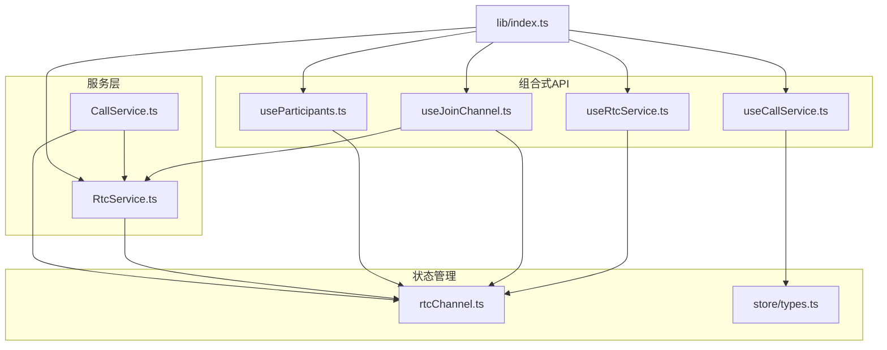
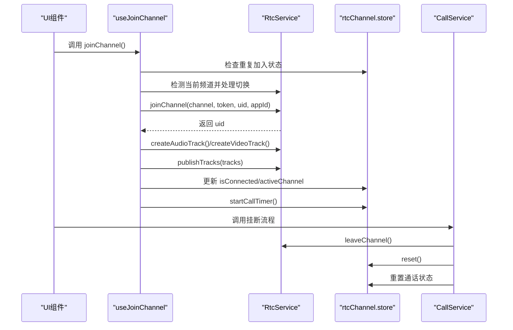
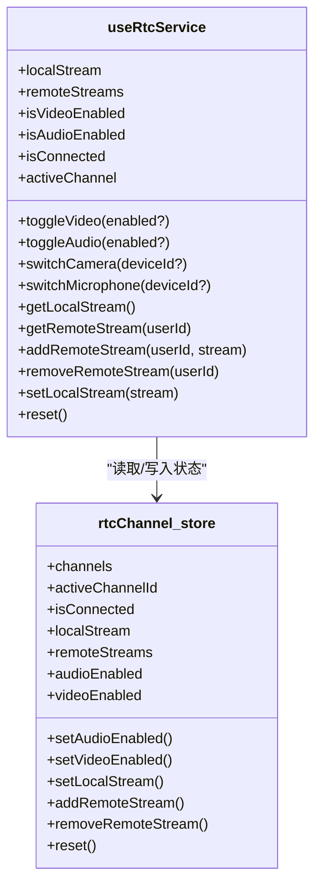
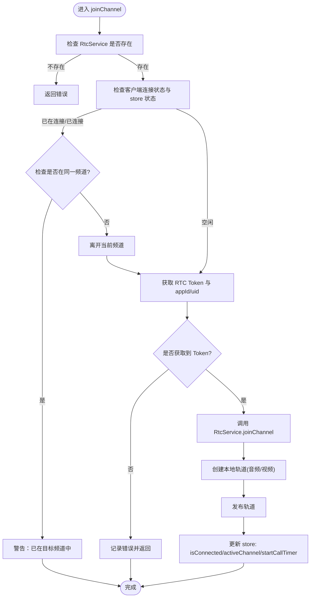
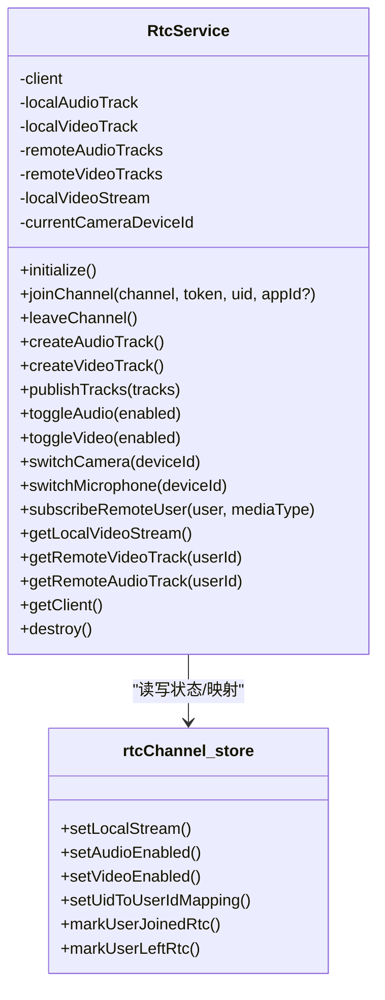
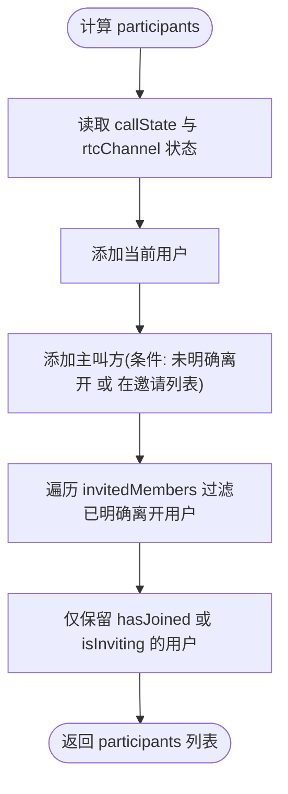
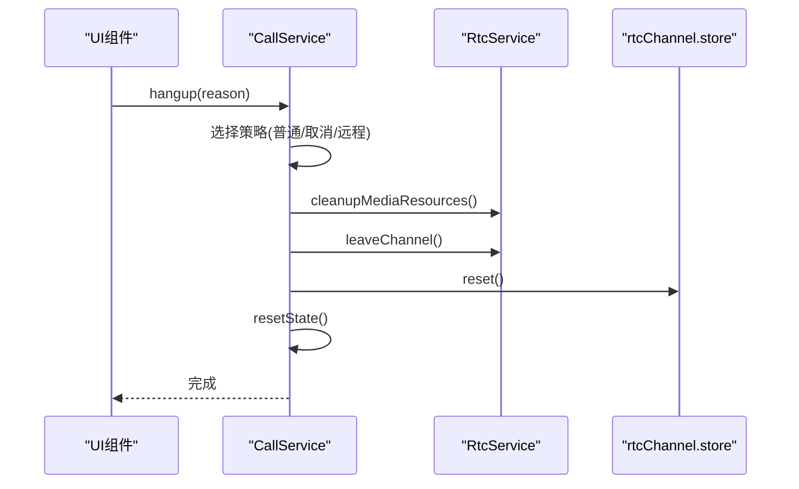
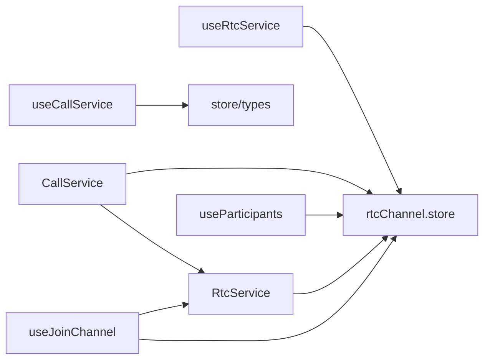

# RTC 服务 API

<cite>
**本文档引用的文件**
- [lib/index.ts](file://lib/index.ts)
- [lib/types.ts](file://lib/types.ts)
- [lib/types/callstate.types.ts](file://lib/types/callstate.types.ts)
- [lib/composables/useRtcService.ts](file://lib/composables/useRtcService.ts)
- [lib/composables/useJoinChannel.ts](file://lib/composables/useJoinChannel.ts)
- [lib/composables/useCallService.ts](file://lib/composables/useCallService.ts)
- [lib/composables/useParticipants.ts](file://lib/composables/useParticipants.ts)
- [lib/services/RtcService.ts](file://lib/services/RtcService.ts)
- [lib/services/CallService.ts](file://lib/services/CallService.ts)
- [lib/store/rtcChannel.ts](file://lib/store/rtcChannel.ts)
- [lib/store/types.ts](file://lib/store/types.ts)
</cite>

## 更新摘要
**变更内容**
- 更新了 useJoinChannel 的频道切换逻辑，增强了重复加入检测机制
- 新增了更完善的频道状态重置功能
- 改进了 RtcService 的 leaveChannel 方法，支持更优雅的频道切换
- 增强了 rtcChannel store 的状态管理能力

## 目录
1. [简介](#简介)
2. [项目结构](#项目结构)
3. [核心组件](#核心组件)
4. [架构总览](#架构总览)
5. [详细组件分析](#详细组件分析)
6. [依赖关系分析](#依赖关系分析)
7. [性能考虑](#性能考虑)
8. [故障排查指南](#故障排查指南)
9. [结论](#结论)
10. [附录](#附录)

## 简介
本文件系统性梳理并说明 RTC 服务相关的组合式 API，重点覆盖 useRtcService、useJoinChannel、useCallService、useParticipants 等能力，并结合 RtcService、CallService、rtcChannel store 等模块，解释如何通过这些函数管理 Agora RTC SDK 的连接、加入/离开频道、设备开关、音视频轨道发布与订阅、网络质量监控、参与者列表生成等关键能力。文档同时提供使用示例、性能优化建议、错误处理策略与调试技巧，并阐述 RTC 服务与通话状态的协调机制。

**更新** 本次更新重点关注频道管理的改进，包括更好的频道切换逻辑、重复加入检测和状态重置机制。

## 项目结构
围绕 RTC 服务 API 的关键目录与文件如下：
- 组合式 API：lib/composables 下的 useRtcService、useJoinChannel、useCallService、useParticipants 等
- 服务层：lib/services 下的 RtcService、CallService
- 状态管理：lib/store 下的 rtcChannel.ts 与 store/types.ts
- 类型定义：lib/types.ts、lib/types/callstate.types.ts
- 入口导出：lib/index.ts

**图表来源**
- [lib/index.ts:1-64](file://lib/index.ts#L1-L64)
- [lib/composables/useRtcService.ts:1-192](file://lib/composables/useRtcService.ts#L1-L192)
- [lib/composables/useJoinChannel.ts:1-204](file://lib/composables/useJoinChannel.ts#L1-L204)
- [lib/composables/useCallService.ts:1-359](file://lib/composables/useCallService.ts#L1-L359)
- [lib/composables/useParticipants.ts:1-120](file://lib/composables/useParticipants.ts#L1-L120)
- [lib/services/RtcService.ts:1-719](file://lib/services/RtcService.ts#L1-L719)
- [lib/services/CallService.ts:1-359](file://lib/services/CallService.ts#L1-L359)
- [lib/store/rtcChannel.ts:1-410](file://lib/store/rtcChannel.ts#L1-L410)
- [lib/store/types.ts:1-86](file://lib/store/types.ts#L1-L86)

## 核心组件
- useRtcService：封装 RTC 服务的组合式 API，提供本地/远端流、音视频开关、设备切换、状态查询与重置等能力
- useJoinChannel：负责在信令确认后获取 RTC Token、初始化/复用 RtcService、创建并发布本地音视频轨道、加入频道并启动通话计时。**新增** 支持更智能的频道切换和重复加入检测
- RtcService：封装 Agora RTC SDK 的客户端、轨道管理、发布/订阅、设备切换、事件监听与销毁。**增强** 支持更优雅的频道切换和状态重置
- CallService：统一挂断流程，清理媒体资源与连接，重置通话状态
- rtcChannel store：集中管理 RTC 频道状态、本地/远端流、音视频开关、UID/用户ID映射、参与者集合与计时器。**改进** 增强了状态重置和频道管理能力
- useCallService：提供通话状态与操作的组合式 API（当前实现以 store 为中心）
- useParticipants：自动生成并过滤参与者的列表，屏蔽 leftUsers 等细节

**章节来源**
- [lib/composables/useRtcService.ts:1-192](file://lib/composables/useRtcService.ts#L1-L192)
- [lib/composables/useJoinChannel.ts:1-204](file://lib/composables/useJoinChannel.ts#L1-L204)
- [lib/services/RtcService.ts:1-719](file://lib/services/RtcService.ts#L1-L719)
- [lib/services/CallService.ts:1-359](file://lib/services/CallService.ts#L1-L359)
- [lib/store/rtcChannel.ts:1-410](file://lib/store/rtcChannel.ts#L1-L410)
- [lib/composables/useCallService.ts:1-359](file://lib/composables/useCallService.ts#L1-L359)
- [lib/composables/useParticipants.ts:1-120](file://lib/composables/useParticipants.ts#L1-L120)

## 架构总览
下图展示 RTC 服务 API 的整体交互：UI 层通过组合式 API 调用服务层与状态层；服务层与 SDK 交互并回写状态；状态层驱动 UI 响应式更新。

**图表来源**
- [lib/composables/useJoinChannel.ts:76-197](file://lib/composables/useJoinChannel.ts#L76-L197)
- [lib/services/RtcService.ts:109-138](file://lib/services/RtcService.ts#L109-L138)
- [lib/services/RtcService.ts:143-171](file://lib/services/RtcService.ts#L143-L171)
- [lib/services/RtcService.ts:226-238](file://lib/services/RtcService.ts#L226-L238)
- [lib/services/CallService.ts:25-72](file://lib/services/CallService.ts#L25-L72)
- [lib/services/CallService.ts:288-314](file://lib/services/CallService.ts#L288-L314)
- [lib/store/rtcChannel.ts:242-272](file://lib/store/rtcChannel.ts#L242-L272)

## 详细组件分析

### useRtcService 组件分析
职责与能力：
- 提供本地/远端流、音视频开关、连接状态、活跃频道等响应式状态
- 提供切换视频/音频、切换摄像头/麦克风、获取/设置流、重置状态等方法
- 通过 rtcChannel store 管理状态，保证与 RtcService 的一致性

**图表来源**
- [lib/composables/useRtcService.ts:52-192](file://lib/composables/useRtcService.ts#L52-L192)
- [lib/store/rtcChannel.ts:11-28](file://lib/store/rtcChannel.ts#L11-L28)

使用要点：
- 切换音视频时，内部通过 store 更新状态，避免直接操作底层轨道
- 设备切换预留接口，需配合 RtcService 的设备枚举与 setDevice 实现
- 流管理方法用于将本地/远端 MediaStream 写入 store，便于 UI 绑定

**章节来源**
- [lib/composables/useRtcService.ts:1-192](file://lib/composables/useRtcService.ts#L1-L192)
- [lib/store/rtcChannel.ts:373-408](file://lib/store/rtcChannel.ts#L373-L408)

### useJoinChannel 组件分析
职责与能力：
- 在信令确认后获取 RTC Token（通过环信 SDK），并初始化/复用 RtcService
- 创建本地音视频轨道并发布，加入频道，更新 store 状态并启动通话计时
- **增强** 支持重复加入检测、智能频道切换和状态重置

**图表来源**
- [lib/composables/useJoinChannel.ts:76-197](file://lib/composables/useJoinChannel.ts#L76-L197)
- [lib/services/RtcService.ts:109-138](file://lib/services/RtcService.ts#L109-L138)
- [lib/services/RtcService.ts:143-171](file://lib/services/RtcService.ts#L143-L171)
- [lib/services/RtcService.ts:226-238](file://lib/services/RtcService.ts#L226-L238)

使用要点：
- **新增** 重复加入检测：检查客户端连接状态和频道名称，避免重复加入同一频道
- **改进** 智能频道切换：当客户端在其他频道时，自动离开当前频道再加入目标频道
- 仅在需要时创建轨道，避免重复创建
- 发布前确保客户端已连接，避免发布失败
- 通过 store 的 startCallTimer 启动计时，便于 UI 展示

**章节来源**
- [lib/composables/useJoinChannel.ts:1-204](file://lib/composables/useJoinChannel.ts#L1-L204)
- [lib/services/RtcService.ts:1-719](file://lib/services/RtcService.ts#L1-L719)
- [lib/store/rtcChannel.ts:242-272](file://lib/store/rtcChannel.ts#L242-L272)

### RtcService 组件分析
职责与能力：
- 封装 Agora RTC SDK 客户端、轨道创建与发布/订阅、设备切换、事件监听与销毁
- 提供网络质量、音量指示等回调扩展点
- 与 rtcChannel store 协作，维护 UID/用户ID映射与参与者集合

**图表来源**
- [lib/services/RtcService.ts:42-77](file://lib/services/RtcService.ts#L42-L77)
- [lib/services/RtcService.ts:143-171](file://lib/services/RtcService.ts#L143-L171)
- [lib/services/RtcService.ts:176-221](file://lib/services/RtcService.ts#L176-L221)
- [lib/services/RtcService.ts:243-354](file://lib/services/RtcService.ts#L243-L354)
- [lib/store/rtcChannel.ts:373-408](file://lib/store/rtcChannel.ts#L373-L408)
- [lib/store/rtcChannel.ts:292-315](file://lib/store/rtcChannel.ts#L292-L315)

使用要点：
- **增强** 支持优雅的频道切换：leaveChannel 方法会自动取消发布轨道、关闭本地轨道并离开频道
- 切换视频时，若轨道失效则重新创建并更新本地流
- 订阅远程用户时自动播放音频轨道
- 事件监听中维护 UID/用户ID映射与加入/离开集合

**章节来源**
- [lib/services/RtcService.ts:1-719](file://lib/services/RtcService.ts#L1-L719)
- [lib/store/rtcChannel.ts:1-410](file://lib/store/rtcChannel.ts#L1-L410)

### useCallService 组件分析
职责与能力：
- 提供通话状态与操作的组合式 API（当前实现以 store 为中心）
- 提供 startCall、acceptCall、rejectCall、endCall、toggleAudio/Video/Speaker 等方法
- 提供事件监听方法占位，便于后续接入

**图表来源**
- [lib/composables/useCallService.ts:91-359](file://lib/composables/useCallService.ts#L91-L359)

注意：当前实现主要通过 store 更新状态，具体服务层方法需按实际实现补齐。

**章节来源**
- [lib/composables/useCallService.ts:1-359](file://lib/composables/useCallService.ts#L1-L359)
- [lib/store/types.ts:43-55](file://lib/store/types.ts#L43-L55)

### useParticipants 组件分析
职责与能力：
- 自动生成群组参与者列表，自动过滤已明确离开的用户
- 结合 rtcChannel store 的 joinedRtcUsers、leftUsers、uidToUserIdMap 等状态
- 输出包含用户 ID、昵称、头像、是否静音、是否邀请中、是否已加入等字段

**图表来源**
- [lib/composables/useParticipants.ts:27-114](file://lib/composables/useParticipants.ts#L27-L114)
- [lib/store/rtcChannel.ts:292-329](file://lib/store/rtcChannel.ts#L292-L329)

**章节来源**
- [lib/composables/useParticipants.ts:1-120](file://lib/composables/useParticipants.ts#L1-L120)
- [lib/store/rtcChannel.ts:292-329](file://lib/store/rtcChannel.ts#L292-L329)

### CallService 组件分析
职责与能力：
- 统一挂断流程：根据原因选择策略、清理媒体资源、断开连接、重置状态
- 清理媒体资源：取消发布本地轨道
- 清理连接：调用 RtcService.leaveChannel 并重置 rtcChannel store
- 事件日志：记录挂断原因与状态变更

**图表来源**
- [lib/services/CallService.ts:25-72](file://lib/services/CallService.ts#L25-L72)
- [lib/services/CallService.ts:251-314](file://lib/services/CallService.ts#L251-L314)
- [lib/services/CallService.ts:316-337](file://lib/services/CallService.ts#L316-L337)

**章节来源**
- [lib/services/CallService.ts:1-359](file://lib/services/CallService.ts#L1-L359)

## 依赖关系分析
- useRtcService 依赖 rtcChannel store 提供的状态与方法
- useJoinChannel 依赖 rtcChannel store 与 RtcService，负责加入/发布/计时。**增强** 支持重复加入检测和智能频道切换
- RtcService 依赖 Agora SDK 与 rtcChannel store，负责轨道与事件。**改进** 支持更优雅的频道切换
- CallService 依赖 rtcChannel store 与 RtcService，负责挂断清理。**增强** 与改进后的频道管理协同工作
- useCallService 与 useParticipants 依赖 store 与 rtcChannel store

**图表来源**
- [lib/composables/useRtcService.ts:48-53](file://lib/composables/useRtcService.ts#L48-L53)
- [lib/composables/useJoinChannel.ts:12-29](file://lib/composables/useJoinChannel.ts#L12-L29)
- [lib/services/RtcService.ts:65-66](file://lib/services/RtcService.ts#L65-L66)
- [lib/services/CallService.ts:12-23](file://lib/services/CallService.ts#L12-L23)
- [lib/composables/useCallService.ts:42-45](file://lib/composables/useCallService.ts#L42-L45)
- [lib/composables/useParticipants.ts:1-4](file://lib/composables/useParticipants.ts#L1-L4)

**章节来源**
- [lib/index.ts:8-29](file://lib/index.ts#L8-L29)

## 性能考虑
- 避免重复创建轨道：在切换视频时检查轨道有效性，必要时才重新创建并更新本地流
- 条件发布：仅在客户端已连接且轨道未发布时执行发布，减少不必要的网络操作
- **增强** 智能频道切换：useJoinChannel 会检测重复加入并自动处理频道切换，避免不必要的网络请求
- 资源及时释放：离开频道与挂断时取消发布、停止轨道、清理 store，防止内存泄漏
- 计时器管理：通话结束后停止计时器，避免后台持续运行
- 事件监听：销毁时移除监听，避免内存泄漏与重复触发

## 故障排查指南
常见问题与定位思路：
- 加入频道失败
  - 检查 RtcService 是否初始化、客户端连接状态、Token 是否获取成功
  - 查看日志输出，关注"获取Token失败""加入频道失败"等错误
  - **新增** 检查是否出现重复加入检测导致的提前返回
- 音视频轨道异常
  - 切换视频时轨道失效，需重新创建并更新本地流
  - 发布失败时检查客户端连接状态与轨道是否已发布
- 设备切换无效
  - 当前 useRtcService 中设备切换为预留实现，需配合 RtcService 的设备枚举与 setDevice
- 参与者列表异常
  - 检查 rtcChannel.store 的 uidToUserIdMap、joinedRtcUsers、leftUsers 状态
  - 确认事件监听是否正确维护映射与集合
- **新增** 频道切换问题
  - 检查 useJoinChannel 的重复加入检测逻辑是否正确
  - 确认 RtcService.leaveChannel 是否正常执行
  - 验证 rtcChannel.store.reset 是否完全清理状态
- 日志与调试
  - 使用 logger 输出关键路径日志，便于定位问题
  - 在开发环境开启调试模式，观察状态变化与事件触发

**章节来源**
- [lib/composables/useJoinChannel.ts:84-109](file://lib/composables/useJoinChannel.ts#L84-L109)
- [lib/services/RtcService.ts:143-171](file://lib/services/RtcService.ts#L143-L171)
- [lib/composables/useRtcService.ts:98-123](file://lib/composables/useRtcService.ts#L98-L123)
- [lib/composables/useParticipants.ts:34-44](file://lib/composables/useParticipants.ts#L34-L44)

## 结论
本套 RTC 服务 API 通过组合式 API、服务层与状态层的清晰分层，提供了从频道加入、设备控制、网络质量监控到参与者管理的完整能力。useRtcService 与 useJoinChannel 分别承担"状态与设备控制"和"加入与发布"的职责，RtcService 与 rtcChannel store 协同实现底层 SDK 与 UI 状态的一致性，CallService 则统一了挂断流程与资源清理。

**更新** 本次更新显著增强了频道管理能力，包括更好的重复加入检测、智能频道切换和完整的状态重置机制。这些改进使得 RTC 服务在多频道切换场景下更加稳定可靠，用户体验得到显著提升。

建议在实际集成中遵循"先状态、后服务"的顺序，配合完善的日志与错误处理，确保稳定可靠的通话体验。

## 附录

### 使用示例（场景化指引）
- 音频/视频设备切换
  - 通过 useRtcService 的切换方法触发，内部依赖 RtcService 的设备切换能力
  - 注意：当前设备切换为预留实现，需在 RtcService 中完善设备枚举与 setDevice
- 屏幕共享
  - 可通过 Agora SDK 的屏幕共享轨道创建与发布，结合 RtcService 的轨道管理与发布流程
  - 建议在加入频道前完成屏幕共享轨道的创建与发布
- 网络质量检测
  - RtcService 提供网络质量事件回调，可在初始化时注入回调，将质量数据写入 store 或 UI 状态
- 通话状态协调
  - useCallService 与 rtcChannel store 协同，通过 CallService 的挂断流程统一清理资源与状态
- **新增** 频道切换场景
  - 当用户从一个频道切换到另一个频道时，useJoinChannel 会自动检测并处理重复加入
  - RtcService.leaveChannel 会优雅地清理当前频道状态，确保资源正确释放
  - rtcChannel.store.reset 提供完整的状态重置，避免状态污染