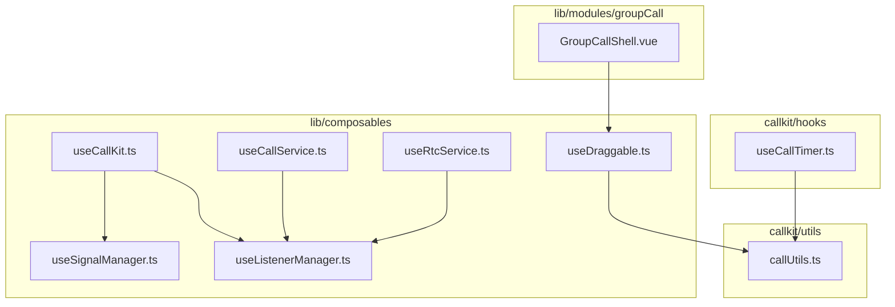
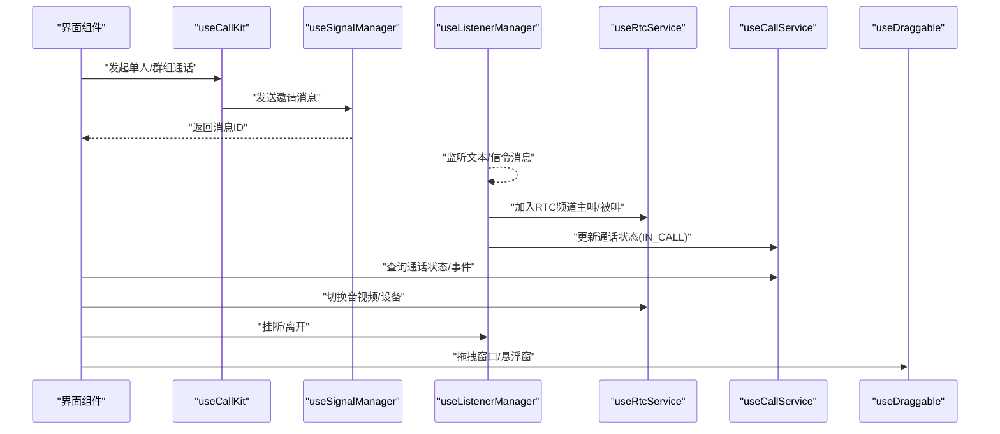
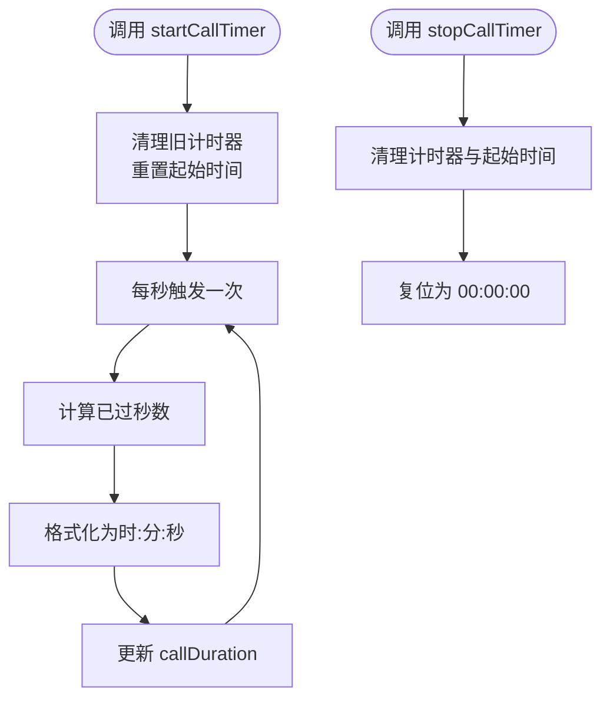
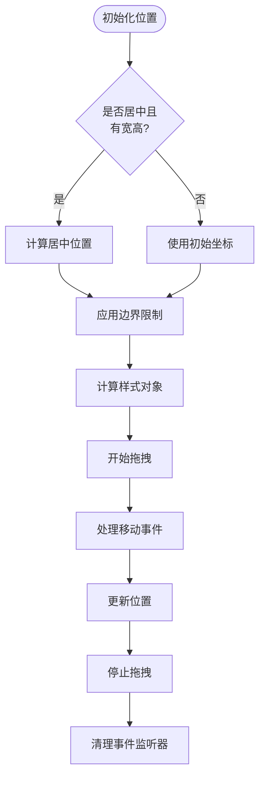
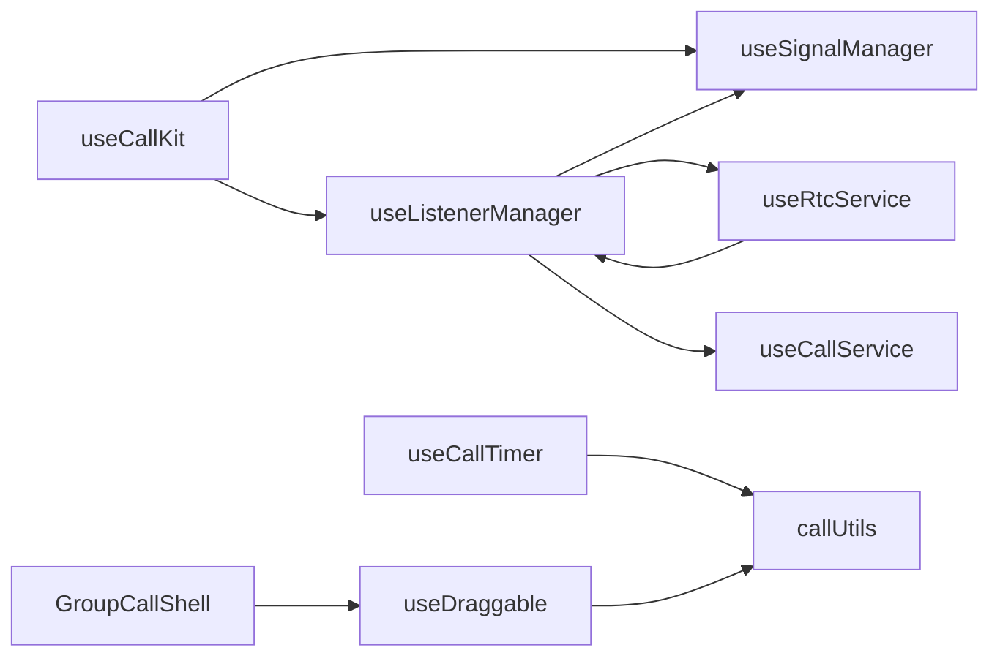

# 工具类组合式函数

<cite>
**本文引用的文件**
- [useDraggable.ts](file://lib/composables/useDraggable.ts)
- [useCallTimer.ts](file://callkit/hooks/useCallTimer.ts)
- [useCallKit.ts](file://lib/composables/useCallKit.ts)
- [useCallService.ts](file://lib/composables/useCallService.ts)
- [useRtcService.ts](file://lib/composables/useRtcService.ts)
- [useSignalManager.ts](file://lib/composables/useSignalManager.ts)
- [useListenerManager.ts](file://lib/composables/useListenerManager.ts)
- [callUtils.ts](file://callkit/utils/callUtils.ts)
- [GroupCallShell.vue](file://lib/modules/groupCall/components/GroupCallShell.vue)
- [GroupCallShell.css](file://lib/modules/groupCall/components/GroupCallShell.css)
</cite>

## 更新摘要
**变更内容**
- 新增 useDraggable 组合式函数在 GroupCallShell 中的实际应用案例
- 补充群组通话场景下的拖拽定位最佳实践
- 更新拖拽功能的视觉反馈和用户体验设计
- 完善拖拽组件在不同屏幕尺寸下的适配方案

## 目录
1. [简介](#简介)
2. [项目结构](#项目结构)
3. [核心组件](#核心组件)
4. [架构总览](#架构总览)
5. [详细组件分析](#详细组件分析)
6. [依赖分析](#依赖分析)
7. [性能考虑](#性能考虑)
8. [故障排查指南](#故障排查指南)
9. [结论](#结论)
10. [附录](#附录)

## 简介
本文件聚焦于工具类组合式函数，围绕时间管理、设备检测、网络质量监控和拖拽交互等辅助能力，系统梳理并说明以下函数的实现原理与使用方法：
- useCallTimer：通话计时器，提供秒级计时与格式化显示
- useDraggable：拖拽组合式函数，支持居中定位、边界限制和多种拖拽模式
- useDeviceDetector：设备能力检测（按需扩展）
- useNetworkQuality：网络质量监控（按需扩展）

同时，文档解释这些工具函数如何与核心 API 协作，简化常见开发任务，并给出性能、兼容性与错误边界处理建议。

## 项目结构
本仓库采用"lib"作为核心库目录，其中包含大量组合式函数（composables），用于封装业务与通信层交互；"callkit/hooks"下保留部分传统 Hook 示例（如 useCallTimer）。结合核心 API 如 useCallKit、useCallService、useRtcService、useSignalManager、useListenerManager，形成完整的通话生命周期管理与 UI 交互支撑。



**图表来源**
- [useCallKit.ts:1-123](file://lib/composables/useCallKit.ts#L1-L123)
- [useCallService.ts:1-299](file://lib/composables/useCallService.ts#L1-L299)
- [useRtcService.ts:1-192](file://lib/composables/useRtcService.ts#L1-L192)
- [useSignalManager.ts:1-354](file://lib/composables/useSignalManager.ts#L1-L354)
- [useListenerManager.ts:1-730](file://lib/composables/useListenerManager.ts#L1-L730)
- [useDraggable.ts:1-323](file://lib/composables/useDraggable.ts#L1-L323)
- [useCallTimer.ts:1-50](file://callkit/hooks/useCallTimer.ts#L1-L50)
- [callUtils.ts](file://callkit/utils/callUtils.ts)
- [GroupCallShell.vue:1-300](file://lib/modules/groupCall/components/GroupCallShell.vue#L1-L300)

**章节来源**
- [useCallKit.ts:1-123](file://lib/composables/useCallKit.ts#L1-L123)
- [useCallService.ts:1-299](file://lib/composables/useCallService.ts#L1-L299)
- [useRtcService.ts:1-192](file://lib/composables/useRtcService.ts#L1-L192)
- [useSignalManager.ts:1-354](file://lib/composables/useSignalManager.ts#L1-L354)
- [useListenerManager.ts:1-730](file://lib/composables/useListenerManager.ts#L1-L730)
- [useDraggable.ts:1-323](file://lib/composables/useDraggable.ts#L1-L323)
- [useCallTimer.ts:1-50](file://callkit/hooks/useCallTimer.ts#L1-L50)

## 核心组件
- useCallTimer：提供通话计时的启动/停止与自动清理，配合格式化工具输出标准时分秒显示
- useDraggable：拖拽组合式函数，支持居中定位、边界限制、触摸和鼠标事件处理
- useDeviceDetector：设备能力检测（按需扩展，当前仓库未提供具体实现）
- useNetworkQuality：网络质量监控（按需扩展，当前仓库未提供具体实现）

**章节来源**
- [useCallTimer.ts:1-50](file://callkit/hooks/useCallTimer.ts#L1-L50)
- [useDraggable.ts:1-323](file://lib/composables/useDraggable.ts#L1-L323)

## 架构总览
下图展示了工具函数与核心 API 的协作关系：UI 层通过 useCallKit 发起通话，useListenerManager 统一监听文本与信令消息并驱动状态机，useRtcService 管理音视频资源，useCallService 提供通话状态与事件接口，useCallTimer 在 UI 中显示计时，useDraggable 提供拖拽交互能力。



**图表来源**
- [useCallKit.ts:13-50](file://lib/composables/useCallKit.ts#L13-L50)
- [useSignalManager.ts:73-102](file://lib/composables/useSignalManager.ts#L73-L102)
- [useListenerManager.ts:619-677](file://lib/composables/useListenerManager.ts#L619-L677)
- [useRtcService.ts:52-192](file://lib/composables/useRtcService.ts#L52-L192)
- [useCallService.ts:91-299](file://lib/composables/useCallService.ts#L91-L299)
- [useDraggable.ts:78-263](file://lib/composables/useDraggable.ts#L78-L263)

## 详细组件分析

### useCallTimer：通话计时器
- 功能要点
  - 启动计时：清理由上一次计时器残留，记录起始时间，每秒刷新一次
  - 停止计时：清理计时器与起始时间，复位显示
  - 组件卸载清理：在副作用中自动清理，避免内存泄漏
  - 时间格式化：依赖工具函数将秒数格式化为"时:分:秒"
- 数据与状态
  - callDuration：字符串形式的时间显示
  - callStartTimeRef：起始时间戳引用
  - callTimerRef：计时器句柄引用
- 性能与健壮性
  - 每秒一次的定时器频率适中，对性能影响较小
  - 卸载清理避免重复计时器累积
  - 与格式化工具解耦，便于替换实现
- 使用场景
  - 视频/音频通话界面显示已通话时长
  - 录音/通话时长统计与日志上报



**图表来源**
- [useCallTimer.ts:10-35](file://callkit/hooks/useCallTimer.ts#L10-L35)
- [callUtils.ts](file://callkit/utils/callUtils.ts)

**章节来源**
- [useCallTimer.ts:1-50](file://callkit/hooks/useCallTimer.ts#L1-L50)

### useDraggable：拖拽组合式函数

**更新** 新增详细的拖拽组合式函数文档，包含居中定位选项、改进的 TypeScript 类型定义、更好的初始化逻辑和视觉反馈增强，以及在 GroupCallShell 中的实际应用案例

- 功能特性
  - 居中定位：支持元素初始居中显示，优先级高于手动设置的初始坐标
  - 边界限制：可选的边界限制功能，防止元素拖出可视区域
  - 多种拖拽模式：支持固定位置、居中定位、角落定位等多种使用场景
  - 触摸和鼠标兼容：统一处理鼠标事件和触摸事件
  - 视觉反馈：拖拽时提供光标变化和过渡效果
  - 初始化优化：立即执行的初始化逻辑，确保首次渲染就在正确位置
- TypeScript 类型定义
  - DraggableOptions：配置选项接口，包含初始坐标、居中定位、边界限制等参数
  - DraggableReturn：返回值接口，包含元素引用、状态和操作方法
  - 提供完整的类型安全性和智能提示
- 数据与状态
  - elementRef：DOM 元素引用
  - isDragging：是否正在拖拽的状态
  - hasDragged：是否发生过拖拽的标记
  - position：当前位置坐标（左上角）
  - style：计算后的样式对象
- 性能与健壮性
  - 使用 fixed 定位而非 transform，避免布局抖动
  - 拖拽时禁用过渡效果，提供流畅的拖拽体验
  - 窗口大小变化时自动重新计算边界
  - 完整的事件监听器清理机制
- 使用场景
  - 弹窗类组件的拖拽移动
  - 悬浮窗、通知框的拖拽交互
  - 视频通话窗口的拖拽定位
  - 自定义对话框的拖拽功能

**实际应用案例：GroupCallShell 中的拖拽定位**

在群组通话组件中，useDraggable 被用于创建可拖拽的通话外壳，提供以下功能：

```typescript
const SHELL_WIDTH = 800
const SHELL_HEIGHT = 600
const {
  elementRef: shellRef,
  isDragging,
  hasDragged,
  style: draggableStyle,
  startDrag,
} = useDraggable({
  centered: true,
  width: SHELL_WIDTH,
  height: SHELL_HEIGHT,
  boundary: true,
  boundaryPadding: 10,
})

const shellStyle = computed(() => {
  return {
    ...(draggableStyle.value as Record<string, any>),
    width: `${SHELL_WIDTH}px`,
    height: `${SHELL_HEIGHT}px`,
    maxWidth: '90vw',
    maxHeight: '90vh',
    zIndex: 1000,
  }
})
```

**最佳实践**
- 在 GroupCallShell 中，拖拽触发区域设置在头部区域，提供良好的用户体验
- 使用 boundary 参数确保窗口不会被拖出屏幕边界
- 通过 boundaryPadding 为窗口留出安全边距
- 结合 CSS 类名 `.is-dragging` 实现拖拽时的视觉反馈
- 在响应式设计中，合理设置最大宽度和高度限制



**图表来源**
- [useDraggable.ts:131-263](file://lib/composables/useDraggable.ts#L131-L263)
- [GroupCallShell.vue:120-146](file://lib/modules/groupCall/components/GroupCallShell.vue#L120-L146)

#### 辅助函数
- useCenteredDraggable：专门用于居中定位的拖拽 Hook，简化居中显示的使用
- useCornerDraggable：用于角落定位的拖拽 Hook，适用于悬浮窗、通知等场景

#### 使用示例

**居中定位示例**
```typescript
const { elementRef, style, startDrag } = useDraggable({
  centered: true,
  width: 360,
  height: 640,
  boundary: true
})
```

**固定位置示例**
```typescript
const { elementRef, style, startDrag } = useDraggable({
  initialX: 100,
  initialY: 100,
  boundary: true
})
```

**章节来源**
- [useDraggable.ts:1-323](file://lib/composables/useDraggable.ts#L1-L323)
- [GroupCallShell.vue:120-146](file://lib/modules/groupCall/components/GroupCallShell.vue#L120-L146)

### useDeviceDetector：设备能力检测（按需扩展）
- 设计说明
  - 用于检测浏览器/运行环境的设备能力，如摄像头、麦克风、屏幕尺寸、方向等
  - 可结合 WebRTC API、MediaDevices、Screen Orientation API 等
- 建议实现路径
  - 使用 navigator.mediaDevices.enumerateDevices 获取媒体设备列表
  - 使用 screen.orientation 监听屏幕方向变化
  - 使用 window.visualViewport 监听视口变化
- 与现有组合式函数的协作
  - 与 useRtcService 的设备切换联动，提供设备可用性前置判断
  - 与 UI 布局组件协作，动态调整布局策略

### useNetworkQuality：网络质量监控（按需扩展）
- 设计说明
  - 通过 WebRTC RTCPeerConnection 的统计数据（如丢包率、RTT、抖动）评估网络质量
  - 结合业务场景定义等级阈值（优/良/中/差），驱动 UI 降级策略（如分辨率、码率）
- 建议实现路径
  - 在 useRtcService 中注入统计回调，周期性采集指标
  - 将网络质量映射为可读等级，暴露给 UI 与业务层
- 与现有组合式函数的协作
  - 与 useRtcService 的连接状态协同，避免在未连接时误判
  - 与 UI 组件协作，提示用户网络不佳并引导优化

## 依赖分析
- useCallTimer 依赖 callUtils 的时间格式化能力
- useDraggable 依赖 callUtils 的安全位置计算功能
- useCallKit 依赖 useSignalManager 与 useListenerManager，负责发起与监听
- useListenerManager 依赖 useSignalManager、useJoinChannel、CallService 等，统一处理信令与状态机
- useRtcService 依赖 RTC 频道 Store，提供音视频控制与流管理
- useCallService 作为状态与事件的抽象层，向上提供统一接口



**图表来源**
- [useCallTimer.ts:1-50](file://callkit/hooks/useCallTimer.ts#L1-L50)
- [useDraggable.ts:1-323](file://lib/composables/useDraggable.ts#L1-L323)
- [callUtils.ts](file://callkit/utils/callUtils.ts)
- [useCallKit.ts:1-123](file://lib/composables/useCallKit.ts#L1-L123)
- [useSignalManager.ts:1-354](file://lib/composables/useSignalManager.ts#L1-L354)
- [useListenerManager.ts:1-730](file://lib/composables/useListenerManager.ts#L1-L730)
- [useRtcService.ts:1-192](file://lib/composables/useRtcService.ts#L1-L192)
- [useCallService.ts:1-299](file://lib/composables/useCallService.ts#L1-L299)
- [GroupCallShell.vue:1-300](file://lib/modules/groupCall/components/GroupCallShell.vue#L1-L300)

**章节来源**
- [useCallTimer.ts:1-50](file://callkit/hooks/useCallTimer.ts#L1-L50)
- [useDraggable.ts:1-323](file://lib/composables/useDraggable.ts#L1-L323)
- [useCallKit.ts:1-123](file://lib/composables/useCallKit.ts#L1-L123)
- [useSignalManager.ts:1-354](file://lib/composables/useSignalManager.ts#L1-L354)
- [useListenerManager.ts:1-730](file://lib/composables/useListenerManager.ts#L1-L730)
- [useRtcService.ts:1-192](file://lib/composables/useRtcService.ts#L1-L192)
- [useCallService.ts:1-299](file://lib/composables/useCallService.ts#L1-L299)

## 性能考虑
- 计时器频率
  - useCallTimer 每秒一次，开销极低；若 UI 需更高精度，可考虑更短间隔并增加节流
- 拖拽性能
  - useDraggable 使用 fixed 定位而非 transform，避免布局抖动
  - 拖拽时禁用过渡效果，提供流畅的拖拽体验
  - 窗口大小变化时使用防抖处理，避免频繁重计算
- 状态更新
  - useRtcService 与 useListenerManager 中的状态变更尽量批量合并，减少不必要的响应式更新
- 资源释放
  - useCallTimer 在卸载时清理计时器；useRtcService 提供 reset 方法，确保媒体流与设备权限及时释放
  - useDraggable 在组件卸载时自动清理事件监听器
- 网络质量采样
  - useNetworkQuality 建议采用指数滑动平均或窗口聚合，降低抖动对判断的影响

## 故障排查指南
- 计时异常
  - 症状：计时器重复、显示停滞
  - 排查：确认每次启动前是否清理旧计时器；检查组件卸载是否触发清理
  - 参考
    - [useCallTimer.ts:10-42](file://callkit/hooks/useCallTimer.ts#L10-L42)
- 拖拽异常
  - 症状：拖拽失效、元素跳出边界、触摸事件冲突
  - 排查：确认元素具有正确的定位属性；检查边界参数设置；验证事件监听器是否正确清理
  - 参考
    - [useDraggable.ts:174-227](file://lib/composables/useDraggable.ts#L174-L227)
    - [GroupCallShell.vue:120-146](file://lib/modules/groupCall/components/GroupCallShell.vue#L120-L146)
- 信令未达/状态不一致
  - 症状：被叫未弹窗、状态卡住
  - 排查：检查 useListenerManager 是否正确挂载文本与信令监听；确认设备 ID 一致性与 callId 匹配
  - 参考
    - [useListenerManager.ts:619-677](file://lib/composables/useListenerManager.ts#L619-L677)
    - [useSignalManager.ts:73-102](file://lib/composables/useSignalManager.ts#L73-L102)
- 音视频异常
  - 症状：无法打开摄像头/麦克风、画面黑屏
  - 排查：确认设备权限与设备列表；使用 useRtcService 的切换与状态查询接口定位问题
  - 参考
    - [useRtcService.ts:66-123](file://lib/composables/useRtcService.ts#L66-L123)
- 通话状态未更新
  - 症状：UI 不随状态变化
  - 排查：确认 useCallService 返回的状态与事件监听是否正确绑定
  - 参考
    - [useCallService.ts:96-158](file://lib/composables/useCallService.ts#L96-L158)

**章节来源**
- [useCallTimer.ts:10-42](file://callkit/hooks/useCallTimer.ts#L10-L42)
- [useDraggable.ts:174-227](file://lib/composables/useDraggable.ts#L174-L227)
- [useListenerManager.ts:619-677](file://lib/composables/useListenerManager.ts#L619-L677)
- [useSignalManager.ts:73-102](file://lib/composables/useSignalManager.ts#L73-L102)
- [useRtcService.ts:66-123](file://lib/composables/useRtcService.ts#L66-L123)
- [useCallService.ts:96-158](file://lib/composables/useCallService.ts#L96-L158)

## 结论
- useCallTimer 为通话计时提供了轻量、可靠的工具能力，易于集成到 UI 层
- useDraggable 为拖拽交互提供了完整、易用的解决方案，支持多种定位模式和边界限制，在 GroupCallShell 中展现了优秀的实际应用效果
- useDeviceDetector 与 useNetworkQuality 作为扩展点，可按需引入，提升设备适配与网络鲁棒性
- 与 useCallKit、useCallService、useRtcService、useSignalManager、useListenerManager 的协作，构成完整的通话生命周期支撑体系

## 附录
- 实用场景建议
  - 计时显示：在通话界面顶部展示 useCallTimer 的 callDuration
  - 拖拽交互：在弹窗、悬浮窗、视频通话窗口中使用 useDraggable 提供拖拽功能
  - 设备检测：在设置页或通话前调用 useDeviceDetector，提示用户授权与设备可用性
  - 网络监控：在通话中周期性采集 useNetworkQuality 指标，动态调整分辨率或提示用户
- 最佳实践
  - 将工具函数与业务状态解耦，通过组合式函数统一暴露接口
  - 在组件卸载时确保计时器、拖拽事件监听器与媒体资源清理
  - 对网络质量与设备能力变化进行节流与缓存，避免频繁重绘
  - 使用 TypeScript 类型定义确保代码的类型安全性和开发体验
  - 在群组通话场景中，合理设置拖拽边界和视觉反馈，提升用户体验