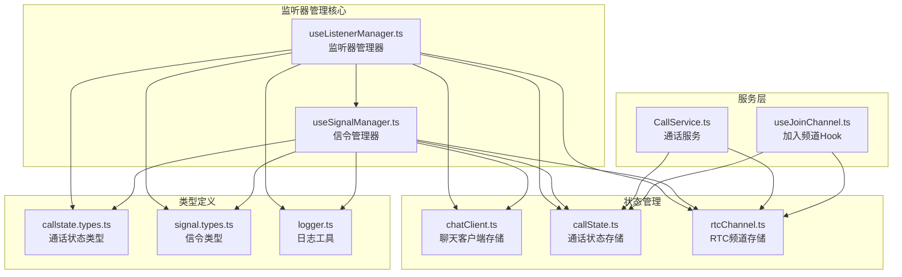
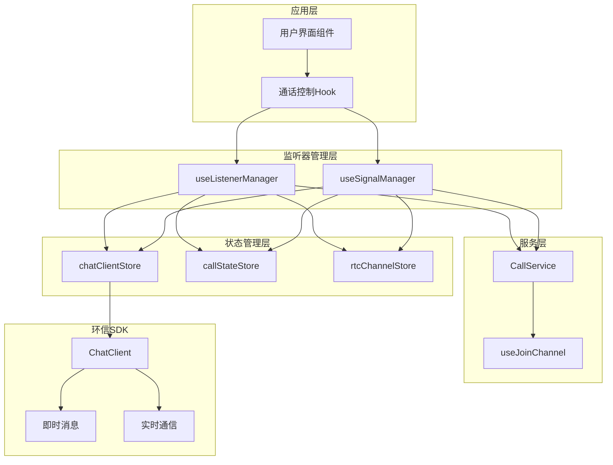
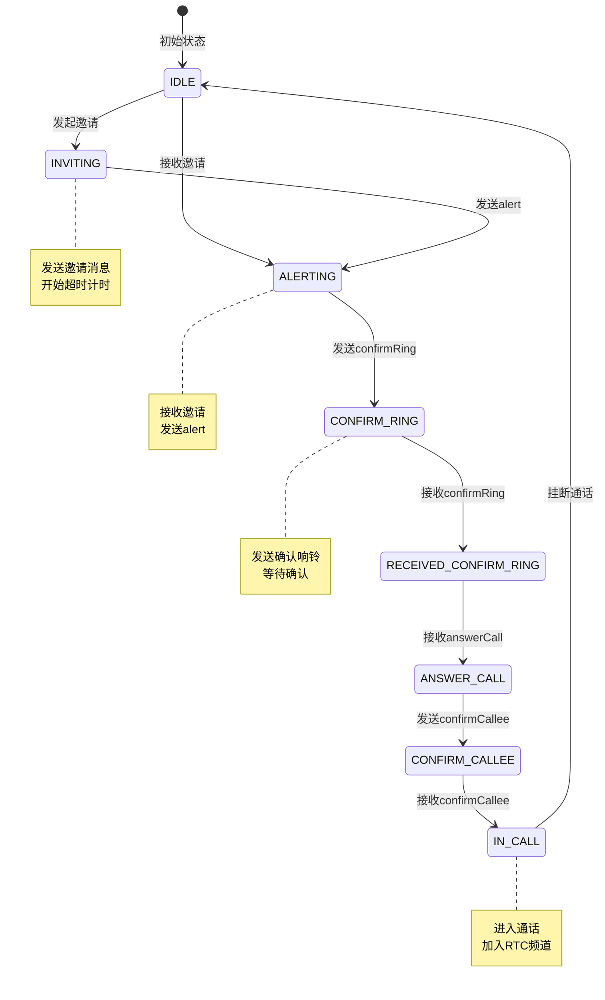
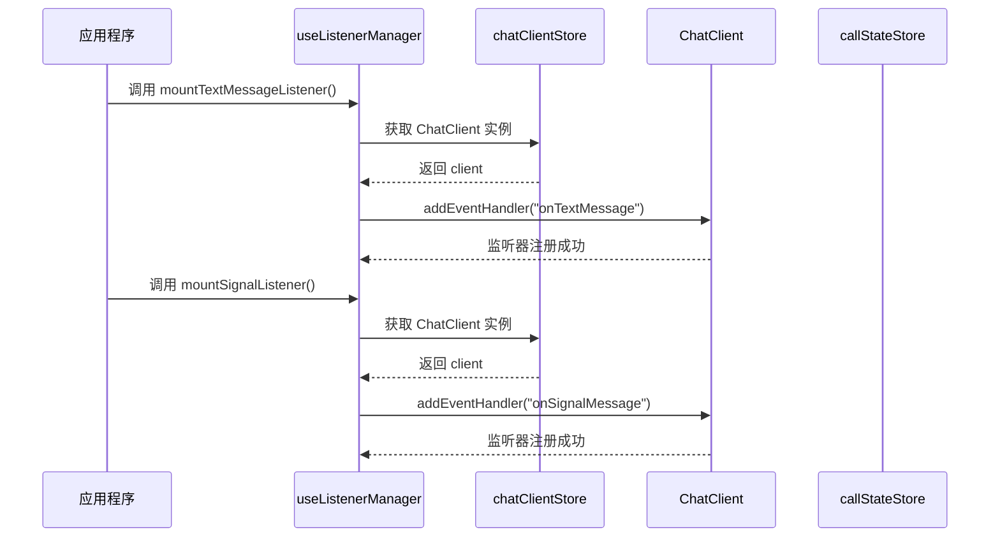
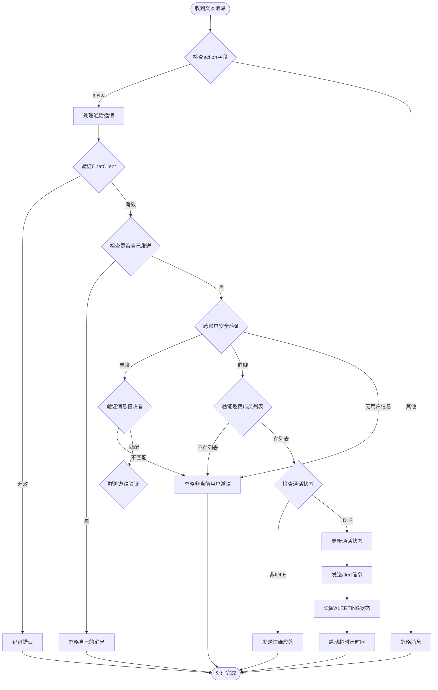
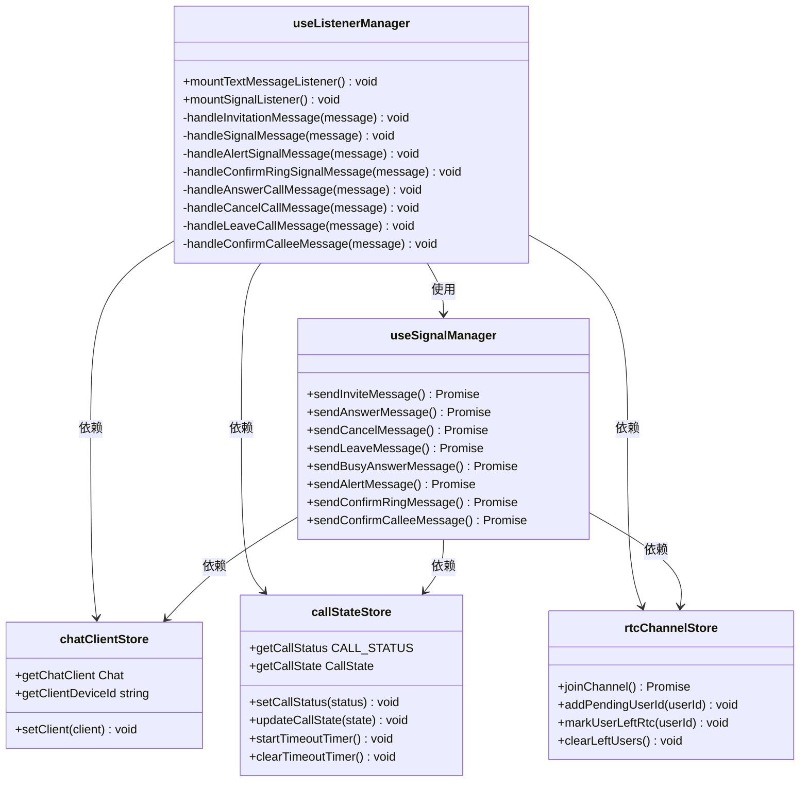
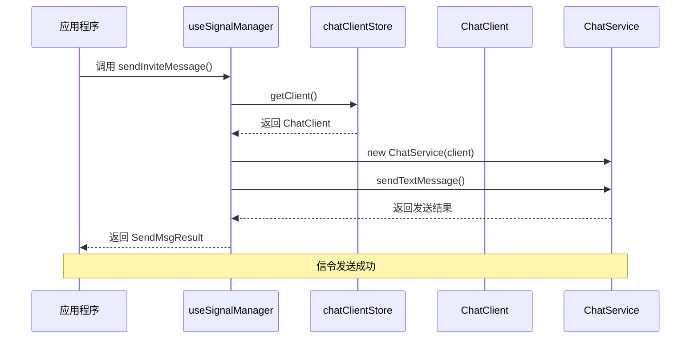
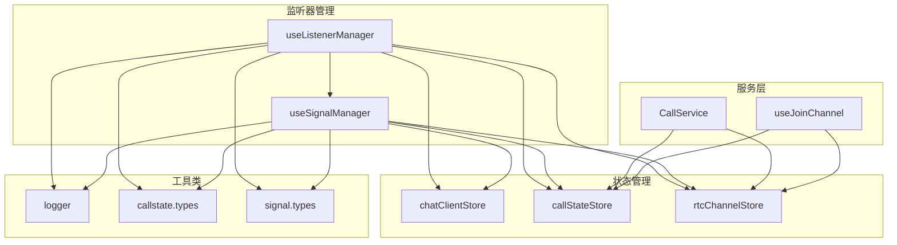
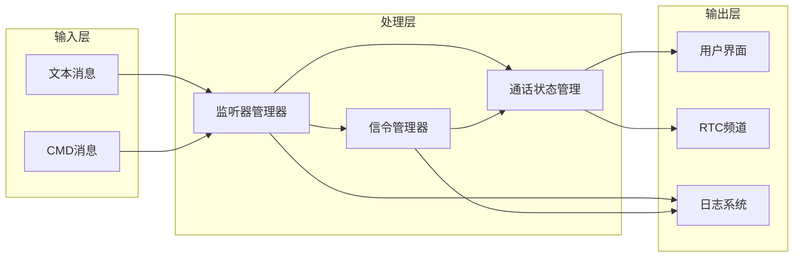
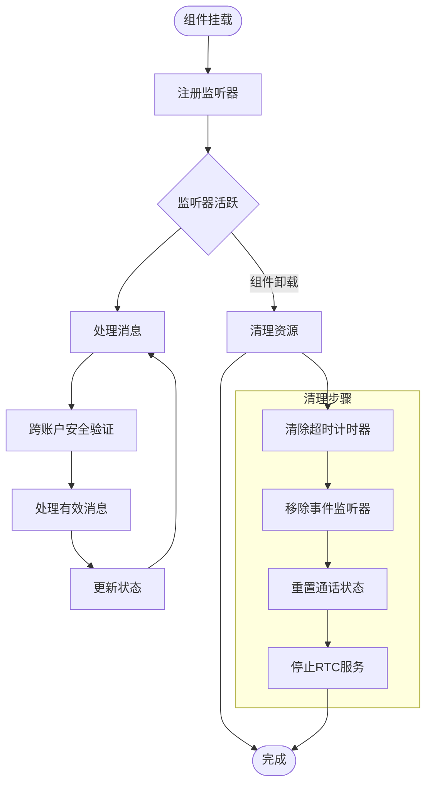

# 监听器管理 API

<cite>
**本文档引用的文件**
- [lib/composables/useListenerManager.ts](file://lib/composables/useListenerManager.ts)
- [lib/composables/useSignalManager.ts](file://lib/composables/useSignalManager.ts)
- [lib/store/chatClient.ts](file://lib/store/chatClient.ts)
- [lib/store/callState.ts](file://lib/store/callState.ts)
- [lib/store/rtcChannel.ts](file://lib/store/rtcChannel.ts)
- [lib/services/CallService.ts](file://lib/services/CallService.ts)
- [lib/composables/useJoinChannel.ts](file://lib/composables/useJoinChannel.ts)
- [lib/types/callstate.types.ts](file://lib/types/callstate.types.ts)
- [lib/types/signal.types.ts](file://lib/types/signal.types.ts)
- [lib/utils/logger.ts](file://lib/utils/logger.ts)
</cite>

## 更新摘要
**变更内容**
- 增强了群组通话的监听器管理能力
- 改进了 cancelCall 和 leaveCall 消息处理逻辑
- 针对网络延迟和早期邀请阶段的处理进行了优化
- 新增了 callId 不匹配时的容错处理机制
- 增强了多人通话场景下的状态同步和资源管理
- **新增跨账户邀请冲突防护**：确保邀请只针对当前登录用户，防止切换账号后收到前账号的离线邀请

## 目录
1. [简介](#简介)
2. [项目结构](#项目结构)
3. [核心组件](#核心组件)
4. [架构概览](#架构概览)
5. [详细组件分析](#详细组件分析)
6. [依赖关系分析](#依赖关系分析)
7. [性能考虑](#性能考虑)
8. [故障排除指南](#故障排除指南)
9. [结论](#结论)

## 简介
本文档详细介绍环信 SDK 通话系统中的监听器管理 API，重点涵盖 useListenerManager 和 useSignalManager 两个组合式 API。这两个 API 是通话系统的核心监听器管理组件，负责处理环信 SDK 的事件监听器、信令消息处理、回调函数注册等关键功能。

监听器管理在整个通话系统中扮演着至关重要的角色，它确保了：
- 通话邀请消息的正确接收和处理
- 信令消息的可靠传输和状态同步
- 通话生命周期的完整管理
- 多端设备间的协调和一致性
- 内存泄漏防护和性能优化
- **跨账户安全防护**：防止切换账号后收到前账号的离线邀请

**更新** 本次更新特别强化了群组通话的监听器管理能力，改进了取消和离开消息的处理逻辑，特别是在网络延迟和早期邀请阶段的容错处理。**新增的关键安全特性**：跨账户邀请冲突防护，确保邀请只针对当前登录用户，有效防止了账号切换场景下的安全风险。

## 项目结构
监听器管理相关的代码主要分布在以下目录结构中：



**图表来源**
- [lib/composables/useListenerManager.ts:1-749](file://lib/composables/useListenerManager.ts#L1-L749)
- [lib/composables/useSignalManager.ts:1-354](file://lib/composables/useSignalManager.ts#L1-L354)
- [lib/store/chatClient.ts:1-23](file://lib/store/chatClient.ts#L1-L23)
- [lib/store/callState.ts:1-263](file://lib/store/callState.ts#L1-L263)

## 核心组件

### useListenerManager - 监听器管理器
useListenerManager 是监听器管理的核心组件，负责注册和管理环信 SDK 的事件监听器。它提供了两个主要的监听器注册方法：

#### 主要功能
1. **文本消息监听器** (`mountTextMessageListener`) - 处理通话邀请等文本消息
2. **信令消息监听器** (`mountSignalListener`) - 处理各种信令消息

#### 关键特性
- **动态客户端获取** - 每次调用时动态获取最新的 ChatClient 实例
- **状态管理集成** - 与 Pinia store 紧密集成，实时更新通话状态
- **错误处理** - 完善的错误捕获和日志记录机制
- **多端支持** - 处理多设备场景下的监听器冲突
- **群组通话增强** - 特别优化了多人通话场景的监听器管理
- **跨账户安全防护** - **新增**：防止切换账号后收到前账号的离线邀请

**更新** 新增了针对网络延迟和早期邀请阶段的容错处理机制，特别是在 callId 不匹配时的智能判断逻辑。**新增的关键安全特性**：跨账户邀请冲突防护，确保邀请只针对当前登录用户。

**章节来源**
- [lib/composables/useListenerManager.ts:37-749](file://lib/composables/useListenerManager.ts#L37-L749)

### useSignalManager - 信令管理器
useSignalManager 专门负责所有通话相关信令的发送和管理。它封装了复杂的信令发送逻辑，提供了统一的 API 接口。

#### 支持的信令类型
- 邀请消息 (invite)
- 响应消息 (answerCall)
- 取消消息 (cancelCall)
- 离开消息 (leaveCall)
- 确认响铃 (confirmRing)
- 确认被叫方 (confirmCallee)

#### 关键特性
- **统一接口** - 所有信令通过统一的 API 发送
- **类型安全** - 完整的 TypeScript 类型定义
- **错误恢复** - 自动的错误处理和重试机制
- **日志记录** - 详细的信令交互日志
- **群组支持** - 完整支持群组通话的定向消息发送

**更新** 增强了群组通话场景下的消息路由和接收者列表管理。

**章节来源**
- [lib/composables/useSignalManager.ts:50-354](file://lib/composables/useSignalManager.ts#L50-L354)

## 架构概览

### 整体架构设计



**图表来源**
- [lib/composables/useListenerManager.ts:37-749](file://lib/composables/useListenerManager.ts#L37-L749)
- [lib/composables/useSignalManager.ts:50-354](file://lib/composables/useSignalManager.ts#L50-L354)
- [lib/store/chatClient.ts:6-22](file://lib/store/chatClient.ts#L6-L22)

### 通话状态流转



**更新** 新增了群组通话场景下的特殊状态处理逻辑，特别是在早期邀请阶段的容错机制。**新增跨账户安全防护**：在邀请处理前验证当前用户身份，防止切换账号后的安全风险。

**图表来源**
- [lib/types/callstate.types.ts:13-22](file://lib/types/callstate.types.ts#L13-L22)
- [lib/store/callState.ts:14-151](file://lib/store/callState.ts#L14-L151)

## 详细组件分析

### useListenerManager 详细分析

#### 监听器注册流程



**图表来源**
- [lib/composables/useListenerManager.ts:685-742](file://lib/composables/useListenerManager.ts#L685-L742)

#### 文本消息处理流程



**更新** 新增了跨账户安全验证流程，包括单聊消息接收者验证和群聊邀请成员验证。

**图表来源**
- [lib/composables/useListenerManager.ts:56-139](file://lib/composables/useListenerManager.ts#L56-L139)

#### 信令消息处理架构



**更新** 新增了跨账户安全防护相关的状态管理，包括用户身份验证和邀请成员列表管理。

**图表来源**
- [lib/composables/useListenerManager.ts:37-749](file://lib/composables/useListenerManager.ts#L37-L749)
- [lib/composables/useSignalManager.ts:50-354](file://lib/composables/useSignalManager.ts#L50-L354)

**章节来源**
- [lib/composables/useListenerManager.ts:37-749](file://lib/composables/useListenerManager.ts#L37-L749)

### useSignalManager 详细分析

#### 信令发送流程



**图表来源**
- [lib/composables/useSignalManager.ts:73-102](file://lib/composables/useSignalManager.ts#L73-L102)

#### 信令类型定义

| 信令类型 | 用途 | 触发时机 |
|---------|------|----------|
| invite | 发送通话邀请 | 发起通话时 |
| alert | 告警提醒 | 接收邀请时 |
| confirmRing | 确认响铃 | 响应邀请时 |
| answerCall | 应答通话 | 接收确认时 |
| confirmCallee | 确认被叫方 | 发送应答时 |
| cancelCall | 取消通话 | 取消邀请时 |
| leaveCall | 离开通话 | 挂断或离开时 |

**章节来源**
- [lib/composables/useSignalManager.ts:7-42](file://lib/composables/useSignalManager.ts#L7-L42)
- [lib/types/signal.types.ts:173-180](file://lib/types/signal.types.ts#L173-L180)

## 依赖关系分析

### 组件依赖图



**图表来源**
- [lib/composables/useListenerManager.ts:1-16](file://lib/composables/useListenerManager.ts#L1-L16)
- [lib/composables/useSignalManager.ts:1-6](file://lib/composables/useSignalManager.ts#L1-L6)

### 数据流分析



**更新** 新增了跨账户安全验证的数据流，包括用户身份验证和邀请权限检查。

**图表来源**
- [lib/composables/useListenerManager.ts:685-742](file://lib/composables/useListenerManager.ts#L685-L742)
- [lib/composables/useSignalManager.ts:50-354](file://lib/composables/useSignalManager.ts#L50-L354)

**章节来源**
- [lib/store/chatClient.ts:6-22](file://lib/store/chatClient.ts#L6-L22)
- [lib/store/callState.ts:7-206](file://lib/store/callState.ts#L7-L206)
- [lib/store/rtcChannel.ts:7-410](file://lib/store/rtcChannel.ts#L7-L410)

## 性能考虑

### 监听器性能优化

1. **动态客户端获取**
   - 每次调用时动态获取最新的 ChatClient 实例
   - 避免静态变量导致的过期引用问题

2. **内存泄漏防护**
   - 使用 Pinia store 管理状态，自动清理过期数据
   - 及时清除超时计时器
   - 正确管理 RTC 资源释放

3. **错误恢复机制**
   - 完善的 try-catch 包装
   - 详细的日志记录便于调试
   - 自动重试和降级策略

4. **群组通话优化**
   - 特别优化了多人通话场景下的监听器管理
   - 增强了网络延迟场景下的容错处理
   - 改进了早期邀请阶段的状态同步

5. **跨账户安全优化**
   - **新增**：快速用户身份验证，避免不必要的消息处理
   - **新增**：邀请成员列表缓存，减少重复验证开销
   - **新增**：早期过滤机制，防止无效消息进入处理流程

### 监听器生命周期管理



**更新** 新增了跨账户安全验证步骤，确保只有当前登录用户才能接收和处理通话邀请。

**图表来源**
- [lib/store/callState.ts:156-188](file://lib/store/callState.ts#L156-L188)
- [lib/store/rtcChannel.ts:373-408](file://lib/store/rtcChannel.ts#L373-L408)

## 故障排除指南

### 常见问题及解决方案

#### 1. ChatClient 未初始化
**问题描述**: 监听器注册时报错，提示 ChatClient 未初始化
**解决方案**:
- 确保在 Provider 中正确初始化 ChatClient
- 检查登录状态是否正常
- 验证客户端设备 ID 获取是否成功

#### 2. 重复监听器注册
**问题描述**: 同一监听器被多次注册导致消息重复处理
**解决方案**:
- 在组件卸载时正确清理监听器
- 使用唯一的监听器标识符
- 避免在多个地方重复注册相同的监听器

#### 3. 信令消息处理异常
**问题描述**: 信令消息处理过程中出现异常
**解决方案**:
- 检查信令消息的 action 字段是否正确
- 验证消息扩展字段的完整性
- 查看日志输出定位具体问题

#### 4. 多端设备冲突
**问题描述**: 多个设备同时处理同一通话请求
**解决方案**:
- 检查设备 ID 匹配逻辑
- 实现设备优先级策略
- 处理设备切换场景

#### 5. 群组通话状态不一致
**问题描述**: 多人通话中各成员状态不同步
**解决方案**:
- 检查 callId 匹配逻辑
- 验证邀请成员列表管理
- 确认多人通话状态同步机制

#### 6. 跨账户安全问题
**问题描述**: 切换账号后仍收到前账号的通话邀请
**解决方案**:
- 检查跨账户安全验证逻辑
- 验证当前用户 ID 获取是否正确
- 确认邀请消息的目标用户验证

**更新** 新增了跨账户安全问题的诊断和解决方案，包括用户身份验证和邀请权限检查。

#### 7. 网络延迟导致的信令处理问题
**问题描述**: 由于网络延迟导致的 callId 不匹配问题
**解决方案**:
- 利用新增的容错处理机制
- 检查早期邀请阶段的状态判断
- 验证群组通话场景下的特殊逻辑

**章节来源**
- [lib/utils/logger.ts:50-231](file://lib/utils/logger.ts#L50-L231)
- [lib/composables/useListenerManager.ts:458-592](file://lib/composables/useListenerManager.ts#L458-L592)

### 调试方法

1. **启用详细日志**
   ```typescript
   import { logger } from "@/utils/logger";
   logger.setDebug(true);
   ```

2. **监控状态变化**
   - 使用浏览器开发者工具观察 Pinia store 变化
   - 监控 RTC 频道状态
   - 跟踪信令消息的发送和接收

3. **单元测试**
   - 为关键监听器函数编写单元测试
   - 测试边界条件和异常情况
   - 验证状态转换的正确性

4. **群组通话调试**
   - 监控邀请成员列表的变化
   - 跟踪多人通话状态同步
   - 验证网络延迟场景下的容错处理

5. **跨账户安全调试**
   - 监控用户身份验证过程
   - 跟踪邀请消息的目标用户验证
   - 验证账号切换场景下的安全防护

## 结论

监听器管理 API 是环信 SDK 通话系统的核心基础设施，它通过 useListenerManager 和 useSignalManager 两个关键组件实现了：

1. **完整的监听器管理** - 提供了文本消息和信令消息的完整监听能力
2. **可靠的信令处理** - 确保通话状态的准确同步和一致性
3. **完善的错误处理** - 提供了多层次的错误捕获和恢复机制
4. **性能优化保障** - 通过内存管理和资源清理防止性能问题
5. **多端设备支持** - 处理复杂的多设备场景和冲突解决
6. **群组通话增强** - 特别优化了多人通话场景的监听器管理和状态同步
7. **跨账户安全防护** - **新增**：防止切换账号后收到前账号的离线邀请，确保邀请只针对当前登录用户

**更新** 本次更新显著增强了群组通话的监听器管理能力，改进了取消和离开消息的处理逻辑，特别是在网络延迟和早期邀请阶段的容错处理方面。**新增的关键安全特性**：跨账户邀请冲突防护，通过用户身份验证和邀请权限检查，有效防止了账号切换场景下的安全风险。新增的 callId 不匹配时的智能判断机制，以及多人通话场景下的特殊状态管理，使得整个系统在复杂网络环境下的稳定性得到了大幅提升。

这些组件的设计充分考虑了实时通信系统的特殊需求，包括高可靠性、低延迟、强一致性的要求。通过合理的架构设计和完善的错误处理机制，为上层应用提供了稳定可靠的通话基础能力。

在未来的发展中，建议继续关注：
- 监听器性能的持续优化
- 更完善的错误恢复机制
- 更丰富的调试和监控工具
- 对新功能特性的支持和扩展
- 网络环境适应性的进一步提升
- **跨账户安全防护的持续改进**：定期审查和更新安全验证逻辑，应对新的安全威胁