# 监听器管理 API

<cite>
**本文档引用的文件**
- [lib/composables/useListenerManager.ts](file://lib/composables/useListenerManager.ts)
- [lib/composables/useSignalManager.ts](file://lib/composables/useSignalManager.ts)
- [lib/services/ChatService.ts](file://lib/services/ChatService.ts)
- [lib/signaling/GroupCallSignalHandler.ts](file://lib/signaling/GroupCallSignalHandler.ts)
- [lib/types/signal.types.ts](file://lib/types/signal.types.ts)
- [lib/store/chatClient.ts](file://lib/store/chatClient.ts)
- [lib/store/callState.ts](file://lib/store/callState.ts)
- [lib/store/rtcChannel.ts](file://lib/store/rtcChannel.ts)
- [lib/store/globalCall.ts](file://lib/store/globalCall.ts)
- [lib/services/CallService.ts](file://lib/services/CallService.ts)
- [lib/composables/useJoinChannel.ts](file://lib/composables/useJoinChannel.ts)
- [lib/types/callstate.types.ts](file://lib/types/callstate.types.ts)
- [lib/utils/logger.ts](file://lib/utils/logger.ts)
- [lib/config/featureFlags.ts](file://lib/config/featureFlags.ts)
- [lib/modules/groupCall/index.ts](file://lib/modules/groupCall/index.ts)
- [lib/modules/groupCall/viewModel/GroupCallStore.ts](file://lib/modules/groupCall/viewModel/GroupCallStore.ts)
- [lib/modules/groupCall/signaling/GroupCallSignalingAdapter.ts](file://lib/modules/groupCall/signaling/GroupCallSignalingAdapter.ts)
- [lib/modules/groupCall/types.ts](file://lib/modules/groupCall/types.ts)
- [lib/services/UserProfileService.ts](file://lib/services/UserProfileService.ts)
- [lib/components/EasemobChatCallKitProvider.vue](file://lib/components/EasemobChatCallKitProvider.vue)
</cite>

## 更新摘要
**变更内容**
- **新增显式清理机制**：新增 `unmountListeners()` 方法提供显式监听器清理功能，解决潜在的内存泄漏问题
- **增强资源管理**：完善监听器生命周期管理，确保组件卸载时正确释放资源
- **改进内存泄漏防护**：通过 `unmountListeners()` 方法主动移除事件监听器，防止内存泄漏
- **优化错误处理**：增强监听器卸载过程中的错误捕获和日志记录
- **增强来电消息处理**：新增来电者用户资料自动解析功能，即使原始消息扩展数据中缺少用户属性也能正确获取
- **优化用户信息管理**：通过 UserProfileService 实现来电者资料的智能缓存和批量解析
- **完善用户属性处理流程**：在监听器管理中增加了来电者资料缺失时的自动补救机制
- **提升用户体验**：确保来电界面能够正确显示主叫方的昵称和头像信息
- **修正组ID字段路径**：将 ext.groupId 更正为 ext.callkitGroupInfo.groupId，确保多通话场景下的正确组识别
- 优化群组通话的组信息获取逻辑，提升组ID解析的准确性
- 增强监听器管理对新字段路径的兼容性处理
- 改进群组通话状态同步的可靠性

## 目录
1. [简介](#简介)
2. [项目结构](#项目结构)
3. [核心组件](#核心组件)
4. [架构概览](#架构概览)
5. [详细组件分析](#详细组件分析)
6. [依赖关系分析](#依赖关系分析)
7. [性能考虑](#性能考虑)
8. [故障排除指南](#故障排除指南)
9. [结论](#结论)

## 简介
本文档详细介绍环信 SDK 通话系统中的监听器管理 API，重点涵盖 useListenerManager 和 useSignalManager 两个组合式 API。这两个 API 是通话系统的核心监听器管理组件，负责处理环信 SDK 的事件监听器、信令消息处理、回调函数注册等关键功能。

监听器管理在整个通话系统中扮演着至关重要的角色，它确保了：
- 通话邀请消息的正确接收和处理
- 信令消息的可靠传输和状态同步
- 通话生命周期的完整管理
- 多端设备间的协调和一致性
- **内存泄漏防护**：通过 `unmountListeners()` 方法提供显式清理机制，防止监听器泄漏
- **用户信息统一管理**：通过 GlobalCallStore 统一管理用户资料，避免分散存储
- **群组通话状态分离**：使用 GroupCallStore 独立管理群组通话参与者状态
- **跨账户安全防护**：防止切换账号后收到前账号的离线邀请
- **状态管理优化**：实现了 callStateStore 与 GroupCallStore 的职责分离
- **组ID字段路径修正**：从 ext.groupId 更正为 ext.callkitGroupInfo.groupId，确保多通话场景下的正确组识别
- **来电者资料自动解析**：**新增**：即使原始消息缺少用户属性，也能通过 Provider 自动解析来电者资料

**更新** 本次更新特别强化了监听器管理的架构设计，通过引入 GlobalCallStore 和 GroupCallStore 实现了更清晰的状态分离。useListenerManager 现在专注于监听器注册和消息处理，并提供了 `unmountListeners()` 方法来主动清理监听器资源，防止内存泄漏。同时，修正了组ID字段路径，提升了多通话场景下的组识别准确性。**新增**了来电者资料自动解析功能，通过 UserProfileService 实现智能缓存和批量解析，确保来电界面能够正确显示主叫方信息。

## 项目结构
监听器管理相关的代码主要分布在以下目录结构中：

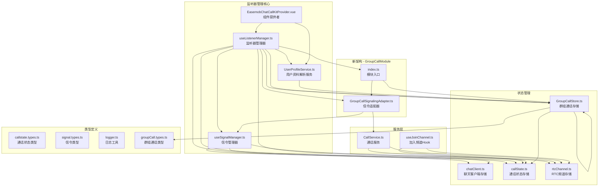
```mermaid
graph TB
subgraph "监听器管理核心"
LM[useListenerManager.ts<br/>监听器管理器]
SM[useSignalManager.ts<br/>信令管理器]
UPS[UserProfileService.ts<br/>用户资料解析服务]
ELM[EasemobChatCallKitProvider.vue<br/>组件提供者]
end
subgraph "状态管理"
CS[chatClient.ts<br/>聊天客户端存储]
CL[callState.ts<br/>通话状态存储]
RC[rtcChannel.ts<br/>RTC频道存储]
GCS[globalCall.ts<br/>全局通话存储]
end
subgraph "服务层"
CSvc[CallService.ts<br/>通话服务]
JC[useJoinChannel.ts<br/>加入频道Hook]
end
subgraph "新架构 - GroupCallModule"
GCI[index.ts<br/>模块入口]
GCS[GroupCallStore.ts<br/>群组通话存储]
GSA[GroupCallSignalingAdapter.ts<br/>信令适配器]
end
subgraph "类型定义"
CT[callstate.types.ts<br/>通话状态类型]
ST[signal.types.ts<br/>信令类型]
LG[logger.ts<br/>日志工具]
GT[groupCall.types.ts<br/>群组通话类型]
end
LM --> SM
LM --> UPS
LM --> CS
LM --> CL
LM --> RC
LM --> GCS
SM --> CS
SM --> CL
SM --> RC
CSvc --> CL
CSvc --> RC
JC --> CL
JC --> RC
LM --> GCI
LM --> GCS
LM --> GSA
GCI --> GCS
GCI --> GSA
GSA --> CSvc
GSA --> SM
GCS --> CL
GCS --> GCS
GCS --> GT
UPS --> GCS
ELM --> LM
ELM --> UPS
```

**图表来源**
- [lib/composables/useListenerManager.ts:1-340](file://lib/composables/useListenerManager.ts#L1-L340)
- [lib/composables/useSignalManager.ts:1-406](file://lib/composables/useSignalManager.ts#L1-L406)
- [lib/store/globalCall.ts:1-56](file://lib/store/globalCall.ts#L1-L56)
- [lib/modules/groupCall/viewModel/GroupCallStore.ts:1-223](file://lib/modules/groupCall/viewModel/GroupCallStore.ts#L1-L223)
- [lib/services/UserProfileService.ts:1-138](file://lib/services/UserProfileService.ts#L1-L138)
- [lib/components/EasemobChatCallKitProvider.vue:1-207](file://lib/components/EasemobChatCallKitProvider.vue#L1-L207)

## 核心组件

### useListenerManager - 监听器管理器
useListenerManager 是监听器管理的核心组件，负责注册和管理环信 SDK 的事件监听器。它提供了三个主要的监听器注册方法：

#### 主要功能
1. **文本消息监听器** (`mountTextMessageListener`) - 处理通话邀请等文本消息
2. **信令消息监听器** (`mountSignalListener`) - 处理各种信令消息
3. **监听器清理器** (`unmountListeners`) - **新增**：主动移除所有事件监听器，防止内存泄漏
4. **用户属性管理** - 通过 GlobalCallStore 统一管理用户信息
5. **来电者资料自动解析** - **新增**：自动解析来电者的用户资料，即使原始消息缺少用户属性

#### 关键特性
- **动态客户端获取** - 每次调用时动态获取最新的 ChatClient 实例
- **状态管理集成** - 与 Pinia store 紧密集成，实时更新通话状态
- **错误处理** - 完善的错误捕获和日志记录机制
- **多端支持** - 处理多设备场景下的监听器冲突
- **群组通话增强** - 特别优化了多人通话场景的监听器管理
- **内存泄漏防护** - **新增**：通过 `unmountListeners()` 方法主动清理监听器资源
- **用户信息统一管理** - **新增**：通过 GlobalCallStore 管理用户属性，避免分散存储
- **跨账户安全防护** - **新增**：防止切换账号后收到前账号的离线邀请
- **状态分离优化** - **新增**：移除对 callStateStore 中群组属性的直接操作
- **组ID字段路径修正** - **更新**：采用 ext.callkitGroupInfo.groupId 确保多通话场景下的正确组识别
- **来电者资料自动解析** - **新增**：当消息扩展数据缺少用户属性时，自动通过 Provider 查询来电者资料

**更新** 新增了 `unmountListeners()` 方法，提供显式的监听器清理功能，这是解决内存泄漏问题的关键改进。同时，新增了用户属性管理功能，通过 GlobalCallStore 统一管理用户信息。优化了群组通话的参与者生命周期管理，移除了对 callStateStore 中群组属性的直接操作，实现了更清晰的状态分离。修正了组ID字段路径，从 ext.groupId 更正为 ext.callkitGroupInfo.groupId。**新增**了来电者资料自动解析功能，通过 UserProfileService 实现智能缓存和批量解析。

**章节来源**
- [lib/composables/useListenerManager.ts:30-340](file://lib/composables/useListenerManager.ts#L30-L340)

### useSignalManager - 信令管理器
useSignalManager 专门负责所有通话相关信令的发送和管理。它封装了复杂的信令发送逻辑，提供了统一的 API 接口。

#### 支持的信令类型
- 邀请消息 (invite)
- 响应消息 (answerCall)
- 取消消息 (cancelCall)
- 离开消息 (leaveCall)
- 确认响铃 (confirmRing)
- 确认被叫方 (confirmCallee)

#### 关键特性
- **统一接口** - 所有信令通过统一的 API 发送
- **类型安全** - 完整的 TypeScript 类型定义
- **错误恢复** - 自动的错误处理和重试机制
- **日志记录** - 详细的信令交互日志
- **群组支持** - 完整支持群组通话的定向消息发送

**更新** 增强了群组通话场景下的消息路由和接收者列表管理。

**章节来源**
- [lib/composables/useSignalManager.ts:7-406](file://lib/composables/useSignalManager.ts#L7-L406)

### GlobalCallStore - 全局通话存储
**新增** GlobalCallStore 是全新的全局状态管理模块，负责跨通话域的共享状态管理。

#### 核心功能
1. **用户信息管理** - 统一管理用户资料映射
2. **窗口状态管理** - 管理通话窗口的最小化状态
3. **跨通话域共享** - 为单聊和群聊提供统一的状态访问

#### 关键特性
- **单一事实源** - 用户信息的唯一存储位置
- **响应式更新** - 通过 Pinia 实现响应式状态管理
- **类型安全** - 完整的 TypeScript 类型定义
- **轻量级设计** - 专注于核心状态管理，避免过度复杂化

**章节来源**
- [lib/store/globalCall.ts:1-56](file://lib/store/globalCall.ts#L1-L56)

### GroupCallStore - 群组通话存储
**新增** GroupCallStore 是群组通话的核心状态管理模块，替代了旧架构中的分散逻辑。

#### 核心功能
1. **会话管理** - 管理群组通话的会话状态
2. **参与者管理** - 完整的参与者生命周期管理
3. **状态同步** - 实时的状态变更和响应
4. **UID 解析** - 智能的 UID 到用户 ID 映射

#### 关键特性
- **单一事实源** - 替代旧架构中的分散逻辑
- **响应式设计** - 通过 Pinia 实现响应式状态管理
- **类型安全** - 完整的 TypeScript 类型定义
- **智能解析** - 支持确定性和推断性 UID 解析

**章节来源**
- [lib/modules/groupCall/viewModel/GroupCallStore.ts:1-223](file://lib/modules/groupCall/viewModel/GroupCallStore.ts#L1-L223)

### UserProfileService - 用户资料解析服务
**新增** UserProfileService 是用户资料解析的核心服务，负责来电者资料的智能缓存和批量解析。

#### 核心功能
1. **用户资料解析** - 通过 Provider 批量解析用户信息
2. **智能缓存管理** - 优先读取 GlobalCallStore 缓存，未命中部分调用 Provider
3. **批量处理** - 支持多个用户ID的批量解析和缓存
4. **错误恢复** - 解析失败时返回 userId 兜底，确保系统稳定性
5. **Provider 管理** - **新增**：提供 Provider 的注册和清理功能

#### 关键特性
- **缓存优先策略** - 先查 GlobalCallStore 缓存，未命中再调用 Provider
- **批量解析优化** - 减少 Provider 调用次数，提升性能
- **错误处理机制** - 解析失败时优雅降级，不影响主流程
- **类型安全保证** - 完整的 TypeScript 类型定义
- **资源清理** - **新增**：提供 `clearProfileProviders()` 方法清理已注册的 Provider

**章节来源**
- [lib/services/UserProfileService.ts:1-138](file://lib/services/UserProfileService.ts#L1-L138)

### EasemobChatCallKitProvider - 组件提供者
**新增** EasemobChatCallKitProvider 是监听器管理的宿主组件，负责监听器的挂载和清理。

#### 核心功能
1. **监听器挂载** - 在组件挂载时注册事件监听器
2. **监听器清理** - **新增**：在组件卸载时调用 `unmountListeners()` 清理资源
3. **Provider 管理** - 管理用户和群组资料 Provider 的注册和清理
4. **RTC 服务管理** - 管理 RTC 服务的初始化和销毁

#### 关键特性
- **生命周期管理** - 完整的组件生命周期钩子
- **资源清理** - **新增**：确保组件卸载时正确释放所有资源
- **错误处理** - 完善的错误捕获和日志记录
- **HMR 支持** - 支持热模块替换的安全处理

**章节来源**
- [lib/components/EasemobChatCallKitProvider.vue:1-207](file://lib/components/EasemobChatCallKitProvider.vue#L1-L207)

## 架构概览

### 整体架构设计

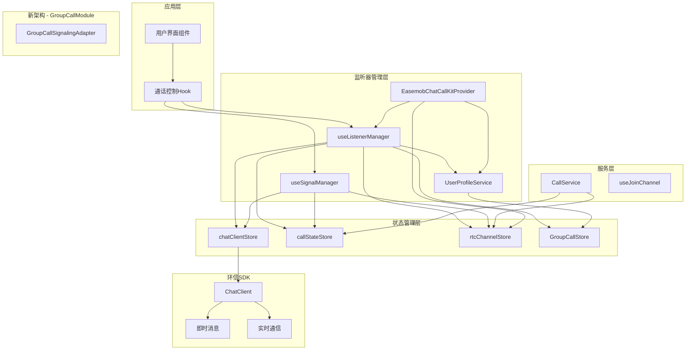
```mermaid
graph TB
subgraph "应用层"
UI[用户界面组件]
HC[通话控制Hook]
end
subgraph "监听器管理层"
LM[useListenerManager]
SM[useSignalManager]
UPS[UserProfileService]
ELM[EasemobChatCallKitProvider]
end
subgraph "状态管理层"
CS[chatClientStore]
CL[callStateStore]
RC[rtcChannelStore]
GCS[globalCallStore]
end
subgraph "新架构 - GroupCallModule"
GCS[GroupCallStore]
GSA[GroupCallSignalingAdapter]
end
subgraph "服务层"
CSvc[CallService]
JC[useJoinChannel]
end
subgraph "环信SDK"
SDK[ChatClient]
IM[即时消息]
RTC[实时通信]
end
UI --> HC
HC --> LM
HC --> SM
LM --> CS
LM --> CL
LM --> RC
LM --> GCS
LM --> UPS
SM --> CS
SM --> CL
SM --> RC
CSvc --> CL
CSvc --> RC
CS --> SDK
SDK --> IM
SDK --> RTC
UPS --> GCS
ELM --> LM
ELM --> UPS
ELM --> RC
```

**图表来源**
- [lib/composables/useListenerManager.ts:30-340](file://lib/composables/useListenerManager.ts#L30-L340)
- [lib/composables/useSignalManager.ts:7-406](file://lib/composables/useSignalManager.ts#L7-L406)
- [lib/store/globalCall.ts:1-56](file://lib/store/globalCall.ts#L1-L56)
- [lib/services/UserProfileService.ts:1-138](file://lib/services/UserProfileService.ts#L1-L138)
- [lib/components/EasemobChatCallKitProvider.vue:1-207](file://lib/components/EasemobChatCallKitProvider.vue#L1-L207)

### 状态分离架构

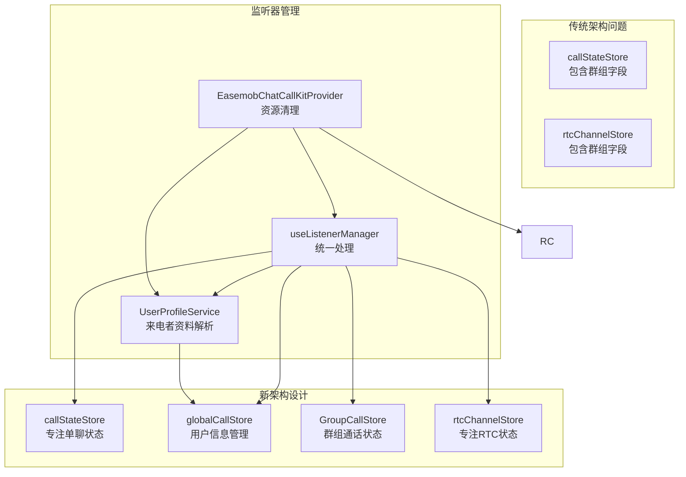
```mermaid
graph TB
subgraph "传统架构问题"
CS1[callStateStore<br/>包含群组字段]
RC1[rtcChannelStore<br/>包含群组字段]
end
subgraph "新架构设计"
CS2[callStateStore<br/>专注单聊状态]
GCS[globalCallStore<br/>用户信息管理]
GCS2[GroupCallStore<br/>群组通话状态]
RC2[rtcChannelStore<br/>专注RTC状态]
end
subgraph "监听器管理"
LM[useListenerManager<br/>统一处理]
UPS[UserProfileService<br/>来电者资料解析]
ELM[EasemobChatCallKitProvider<br/>资源清理]
end
LM --> CS2
LM --> GCS
LM --> GCS2
LM --> RC2
LM --> UPS
UPS --> GCS
ELM --> LM
ELM --> UPS
ELM --> RC
```

**更新** 新架构实现了状态分离，callStateStore 专注于单聊状态管理，GlobalCallStore 负责用户信息管理，GroupCallStore 专门管理群组通话状态。**新增**了 UserProfileService 作为来电者资料解析的核心服务，**新增**了 EasemobChatCallKitProvider 作为监听器管理的宿主组件，负责资源清理。

**图表来源**
- [lib/store/callState.ts:23-23](file://lib/store/callState.ts#L23-L23)
- [lib/store/globalCall.ts:8-12](file://lib/store/globalCall.ts#L8-L12)
- [lib/modules/groupCall/viewModel/GroupCallStore.ts:10-16](file://lib/modules/groupCall/viewModel/GroupCallStore.ts#L10-L16)

### 用户属性管理流程

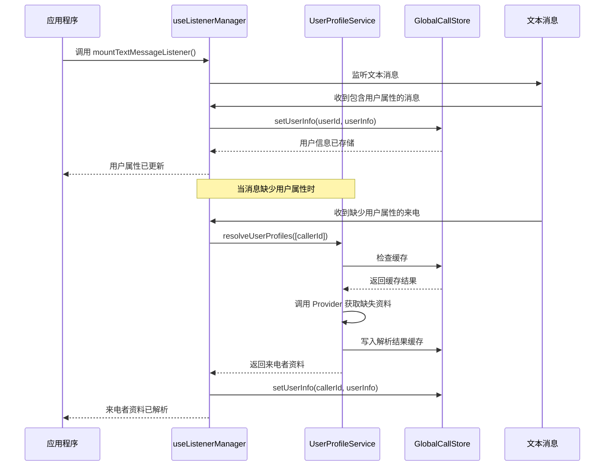
```mermaid
sequenceDiagram
participant App as 应用程序
participant LM as useListenerManager
participant UPS as UserProfileService
participant GCS as GlobalCallStore
participant Message as 文本消息
App->>LM : 调用 mountTextMessageListener()
LM->>Message : 监听文本消息
Message->>LM : 收到包含用户属性的消息
LM->>GCS : setUserInfo(userId, userInfo)
GCS-->>LM : 用户信息已存储
LM-->>App : 用户属性已更新
Note over LM,UPS : 当消息缺少用户属性时
Message->>LM : 收到缺少用户属性的来电
LM->>UPS : resolveUserProfiles([callerId])
UPS->>GCS : 检查缓存
GCS-->>UPS : 返回缓存结果
UPS->>UPS : 调用 Provider 获取缺失资料
UPS->>GCS : 写入解析结果缓存
UPS-->>LM : 返回来电者资料
LM->>GCS : setUserInfo(callerId, userInfo)
LM-->>App : 来电者资料已解析
```

**更新** 新增了来电者资料自动解析流程，通过 UserProfileService 实现智能缓存和批量解析，确保即使原始消息缺少用户属性也能正确显示来电者信息。

**图表来源**
- [lib/composables/useListenerManager.ts:208-217](file://lib/composables/useListenerManager.ts#L208-L217)
- [lib/services/UserProfileService.ts:49-110](file://lib/services/UserProfileService.ts#L49-L110)
- [lib/store/globalCall.ts:14-25](file://lib/store/globalCall.ts#L14-L25)

## 详细组件分析

### useListenerManager 详细分析

#### 监听器注册流程

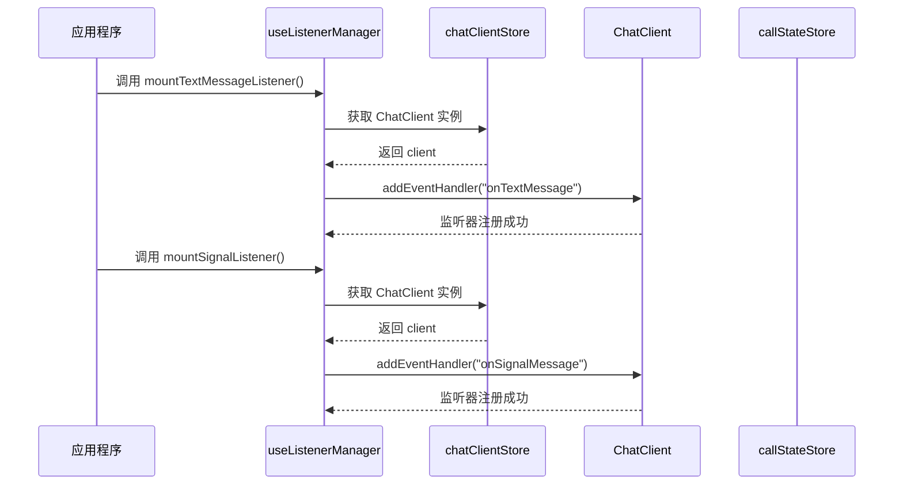
```mermaid
sequenceDiagram
participant App as 应用程序
participant LM as useListenerManager
participant CS as chatClientStore
participant SDK as ChatClient
participant CL as callStateStore
App->>LM : 调用 mountTextMessageListener()
LM->>CS : 获取 ChatClient 实例
CS-->>LM : 返回 client
LM->>SDK : addEventHandler("onTextMessage")
SDK-->>LM : 监听器注册成功
App->>LM : 调用 mountSignalListener()
LM->>CS : 获取 ChatClient 实例
CS-->>LM : 返回 client
LM->>SDK : addEventHandler("onSignalMessage")
SDK-->>LM : 监听器注册成功
```

**图表来源**
- [lib/composables/useListenerManager.ts:250-311](file://lib/composables/useListenerManager.ts#L250-L311)

#### 监听器清理流程

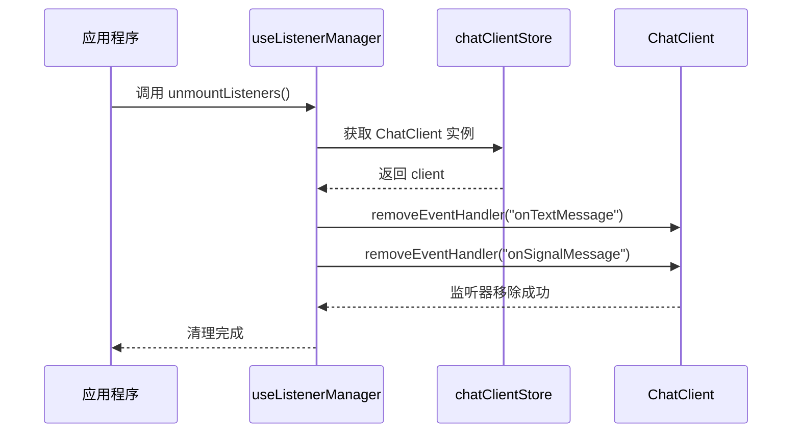
```mermaid
sequenceDiagram
participant App as 应用程序
participant LM as useListenerManager
participant CS as chatClientStore
participant SDK as ChatClient
App->>LM : 调用 unmountListeners()
LM->>CS : 获取 ChatClient 实例
CS-->>LM : 返回 client
LM->>SDK : removeEventHandler("onTextMessage")
LM->>SDK : removeEventHandler("onSignalMessage")
SDK-->>LM : 监听器移除成功
LM-->>App : 清理完成
```

**新增** 监听器清理流程展示了 `unmountListeners()` 方法的工作原理，确保组件卸载时正确移除所有事件监听器，防止内存泄漏。

**图表来源**
- [lib/composables/useListenerManager.ts:313-332](file://lib/composables/useListenerManager.ts#L313-L332)

#### 用户属性处理流程

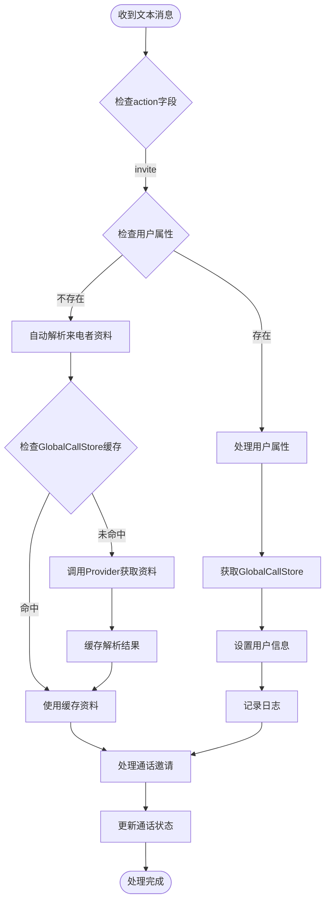
```mermaid
flowchart TD
Start([收到文本消息]) --> CheckAction{检查action字段}
CheckAction --> |invite| CheckUserAttr{检查用户属性}
CheckUserAttr --> |存在| HandleUserAttr[处理用户属性]
CheckUserAttr --> |不存在| AutoResolve[自动解析来电者资料]
AutoResolve --> CheckCache{检查GlobalCallStore缓存}
CheckCache --> |命中| UseCached[使用缓存资料]
CheckCache --> |未命中| CallProvider[调用Provider获取资料]
CallProvider --> CacheResult[缓存解析结果]
CacheResult --> UseCached
UseCached --> HandleInvitation[处理通话邀请]
HandleUserAttr --> GetUserStore[获取GlobalCallStore]
GetUserStore --> SetUserInfo[设置用户信息]
SetUserInfo --> LogInfo[记录日志]
LogInfo --> HandleInvitation
HandleInvitation --> UpdateState[更新通话状态]
UpdateState --> End([处理完成])
```

**更新** 新增了来电者资料自动解析流程，通过 UserProfileService 实现智能缓存和批量解析，确保即使原始消息缺少用户属性也能正确处理。

**图表来源**
- [lib/composables/useListenerManager.ts:65-223](file://lib/composables/useListenerManager.ts#L65-L223)

#### 群组通话参与者管理

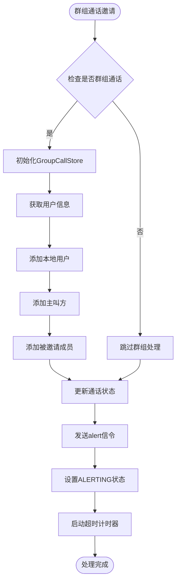
```mermaid
flowchart TD
Start([群组通话邀请]) --> CheckGroup{检查是否群组通话}
CheckGroup --> |是| InitGroupCallStore[初始化GroupCallStore]
CheckGroup --> |否| Skip[跳过群组处理]
InitGroupCallStore --> GetUserInfo[获取用户信息]
GetUserInfo --> AddLocal[添加本地用户]
AddLocal --> AddCaller[添加主叫方]
AddCaller --> AddInvited[添加被邀请成员]
AddInvited --> UpdateState[更新通话状态]
Skip --> UpdateState
UpdateState --> SendAlert[发送alert信令]
SendAlert --> SetAlerting[设置ALERTING状态]
SetAlerting --> StartTimer[启动超时计时器]
StartTimer --> End([处理完成])
```

**图表来源**
- [lib/composables/useListenerManager.ts:171-223](file://lib/composables/useListenerManager.ts#L171-L223)

#### 信令消息处理架构

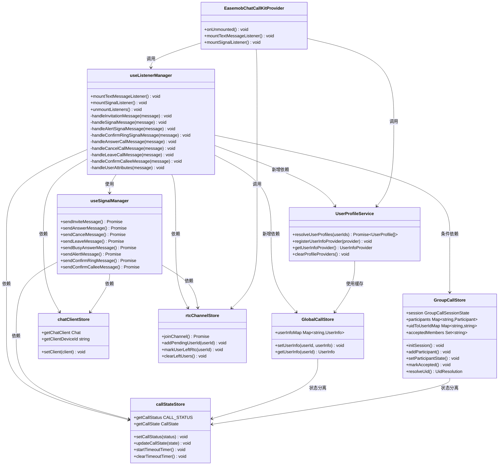
```mermaid
classDiagram
class useListenerManager {
+mountTextMessageListener() void
+mountSignalListener() void
+unmountListeners() void
-handleInvitationMessage(message) void
-handleSignalMessage(message) void
-handleAlertSignalMessage(message) void
-handleConfirmRingSignalMessage(message) void
-handleAnswerCallMessage(message) void
-handleCancelCallMessage(message) void
-handleLeaveCallMessage(message) void
-handleConfirmCalleeMessage(message) void
-handleUserAttributes(message) void
}
class useSignalManager {
+sendInviteMessage() Promise
+sendAnswerMessage() Promise
+sendCancelMessage() Promise
+sendLeaveMessage() Promise
+sendBusyAnswerMessage() Promise
+sendAlertMessage() Promise
+sendConfirmRingMessage() Promise
+sendConfirmCalleeMessage() Promise
}
class GlobalCallStore {
+userInfoMap Map~string,UserInfo~
+setUserInfo(userId, userInfo) void
+getUserInfo(userId) UserInfo
}
class GroupCallStore {
+session GroupCallSessionState
+participants Map~string,Participant~
+uidToUserIdMap Map~string,string~
+acceptedMembers Set~string~
+initSession() void
+addParticipant() void
+setParticipantState() void
+markAccepted() void
+resolveUid() UidResolution
}
class UserProfileService {
+resolveUserProfiles(userIds) Promise~UserProfile[]~
+registerUserInfoProvider(provider) void
+getUserInfoProvider() UserInfoProvider
+clearProfileProviders() void
}
class EasemobChatCallKitProvider {
+onUnmounted() void
+mountTextMessageListener() void
+mountSignalListener() void
}
class chatClientStore {
+getChatClient Chat
+getClientDeviceId string
+setClient(client) void
}
class callStateStore {
+getCallStatus CALL_STATUS
+getCallState CallState
+setCallStatus(status) void
+updateCallState(state) void
+startTimeoutTimer() void
+clearTimeoutTimer() void
}
class rtcChannelStore {
+joinChannel() Promise
+addPendingUserId(userId) void
+markUserLeftRtc(userId) void
+clearLeftUsers() void
}
useListenerManager --> useSignalManager : 使用
useListenerManager --> chatClientStore : 依赖
useListenerManager --> callStateStore : 依赖
useListenerManager --> rtcChannelStore : 依赖
useListenerManager --> GlobalCallStore : 新增依赖
useListenerManager --> GroupCallStore : 条件依赖
useListenerManager --> UserProfileService : 新增依赖
useSignalManager --> chatClientStore : 依赖
useSignalManager --> callStateStore : 依赖
useSignalManager --> rtcChannelStore : 依赖
UserProfileService --> GlobalCallStore : 使用缓存
EasemobChatCallKitProvider --> useListenerManager : 调用
EasemobChatCallKitProvider --> UserProfileService : 调用
EasemobChatCallKitProvider --> rtcChannelStore : 调用
GlobalCallStore --> callStateStore : 状态分离
GroupCallStore --> callStateStore : 状态分离
```

**更新** 新增了 EasemobChatCallKitProvider 的集成，展示了监听器管理的完整生命周期。新增了 UserProfileService 的清理功能，**新增**了 EasemobChatCallKitProvider 作为监听器管理的宿主组件，负责资源清理。

**图表来源**
- [lib/composables/useListenerManager.ts:30-340](file://lib/composables/useListenerManager.ts#L30-L340)
- [lib/composables/useSignalManager.ts:7-406](file://lib/composables/useSignalManager.ts#L7-L406)
- [lib/store/globalCall.ts:1-56](file://lib/store/globalCall.ts#L1-L56)
- [lib/modules/groupCall/viewModel/GroupCallStore.ts:1-223](file://lib/modules/groupCall/viewModel/GroupCallStore.ts#L1-L223)
- [lib/services/UserProfileService.ts:1-138](file://lib/services/UserProfileService.ts#L1-L138)
- [lib/components/EasemobChatCallKitProvider.vue:1-207](file://lib/components/EasemobChatCallKitProvider.vue#L1-L207)

**章节来源**
- [lib/composables/useListenerManager.ts:30-340](file://lib/composables/useListenerManager.ts#L30-L340)

### useSignalManager 详细分析

#### 信令发送流程

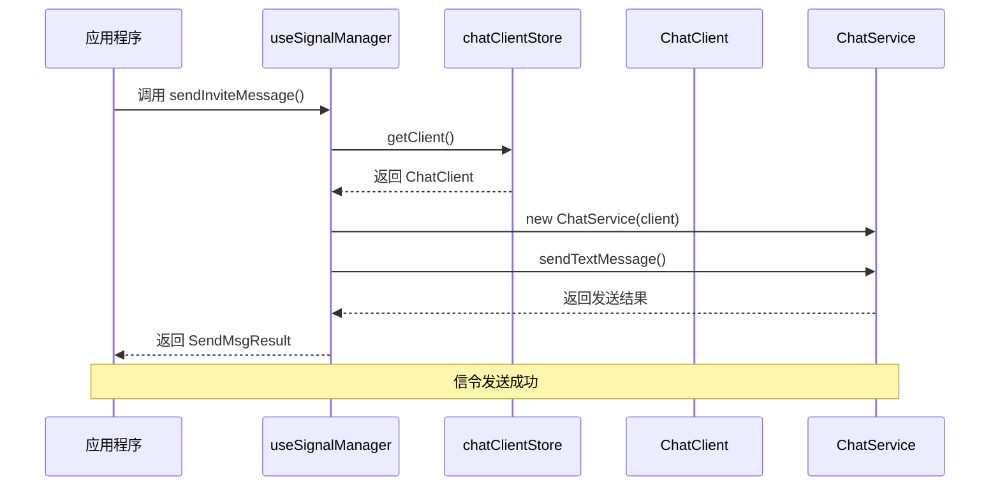
```mermaid
sequenceDiagram
participant App as 应用程序
participant SM as useSignalManager
participant CS as chatClientStore
participant SDK as ChatClient
participant CSvc as ChatService
App->>SM : 调用 sendInviteMessage()
SM->>CS : getClient()
CS-->>SM : 返回 ChatClient
SM->>CSvc : new ChatService(client)
SM->>CSvc : sendTextMessage()
CSvc-->>SM : 返回发送结果
SM-->>App : 返回 SendMsgResult
Note over App,CSvc : 信令发送成功
```

**图表来源**
- [lib/composables/useSignalManager.ts:74-111](file://lib/composables/useSignalManager.ts#L74-L111)

#### 信令类型定义

| 信令类型 | 用途 | 触发时机 |
|---------|------|----------|
| invite | 发送通话邀请 | 发起通话时 |
| alert | 告警提醒 | 接收邀请时 |
| confirmRing | 确认响铃 | 响应邀请时 |
| answerCall | 应答通话 | 接收确认时 |
| confirmCallee | 确认被叫方 | 发送应答时 |
| cancelCall | 取消通话 | 取消邀请时 |
| leaveCall | 离开通话 | 挂断或离开时 |

**章节来源**
- [lib/composables/useSignalManager.ts:7-43](file://lib/composables/useSignalManager.ts#L7-L43)
- [lib/types/signal.types.ts:173-180](file://lib/types/signal.types.ts#L173-L180)

### GlobalCallStore 详细分析

#### 用户信息管理

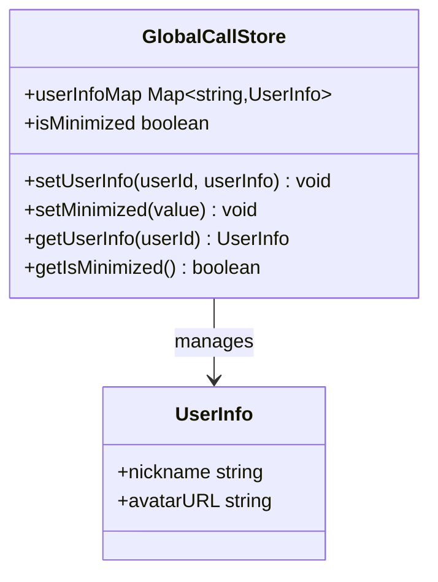
```mermaid
classDiagram
class GlobalCallStore {
+userInfoMap Map~string,UserInfo~
+isMinimized boolean
+setUserInfo(userId, userInfo) void
+setMinimized(value) void
+getUserInfo(userId) UserInfo
+getIsMinimized() boolean
}
class UserInfo {
+nickname string
+avatarURL string
}
GlobalCallStore --> UserInfo : manages
```

**图表来源**
- [lib/store/globalCall.ts:8-56](file://lib/store/globalCall.ts#L8-L56)

#### 用户信息存储流程

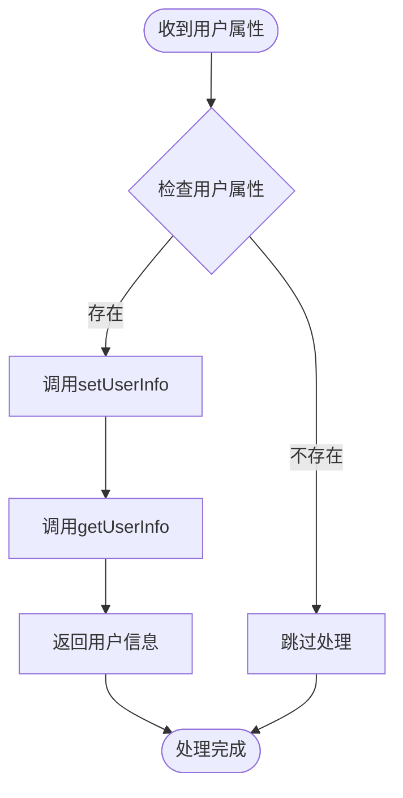
```mermaid
flowchart TD
Start([收到用户属性]) --> CheckUserInfo{检查用户属性}
CheckUserInfo --> |存在| SetUserInfo[调用setUserInfo]
CheckUserInfo --> |不存在| Skip[跳过处理]
SetUserInfo --> GetUserInfo[调用getUserInfo]
GetUserInfo --> ReturnInfo[返回用户信息]
ReturnInfo --> End([处理完成])
Skip --> End
```

**图表来源**
- [lib/composables/useListenerManager.ts:228-245](file://lib/composables/useListenerManager.ts#L228-L245)

**章节来源**
- [lib/store/globalCall.ts:1-56](file://lib/store/globalCall.ts#L1-L56)
- [lib/composables/useListenerManager.ts:228-245](file://lib/composables/useListenerManager.ts#L228-L245)

### GroupCallStore 详细分析

#### 新架构参与者管理

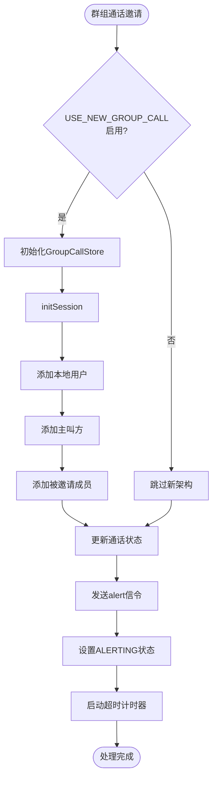
```mermaid
flowchart TD
Start([群组通话邀请]) --> CheckNewArch{USE_NEW_GROUP_CALL启用?}
CheckNewArch --> |是| InitStore[初始化GroupCallStore]
CheckNewArch --> |否| Skip[跳过新架构]
InitStore --> InitSession[initSession]
InitSession --> AddLocal[添加本地用户]
AddLocal --> AddCaller[添加主叫方]
AddCaller --> AddInvited[添加被邀请成员]
AddInvited --> UpdateState[更新通话状态]
Skip --> UpdateState
UpdateState --> SendAlert[发送alert信令]
SendAlert --> SetAlerting[设置ALERTING状态]
SetAlerting --> StartTimer[启动超时计时器]
StartTimer --> End([处理完成])
```

**图表来源**
- [lib/composables/useListenerManager.ts:171-223](file://lib/composables/useListenerManager.ts#L171-L223)

#### GroupCallStore 核心功能

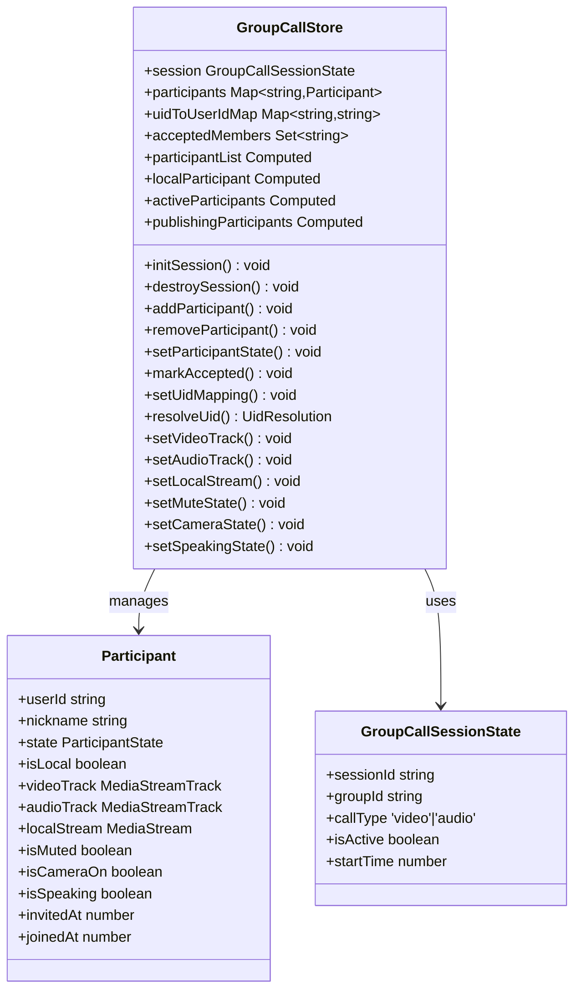
```mermaid
classDiagram
class GroupCallStore {
+session GroupCallSessionState
+participants Map~string,Participant~
+uidToUserIdMap Map~string,string~
+acceptedMembers Set~string~
+participantList Computed
+localParticipant Computed
+activeParticipants Computed
+publishingParticipants Computed
+initSession() void
+destroySession() void
+addParticipant() void
+removeParticipant() void
+setParticipantState() void
+markAccepted() void
+setUidMapping() void
+resolveUid() UidResolution
+setVideoTrack() void
+setAudioTrack() void
+setLocalStream() void
+setMuteState() void
+setCameraState() void
+setSpeakingState() void
}
class Participant {
+userId string
+nickname string
+state ParticipantState
+isLocal boolean
+videoTrack MediaStreamTrack
+audioTrack MediaStreamTrack
+localStream MediaStream
+isMuted boolean
+isCameraOn boolean
+isSpeaking boolean
+invitedAt number
+joinedAt number
}
class GroupCallSessionState {
+sessionId string
+groupId string
+callType 'video'|'audio'
+isActive boolean
+startTime number
}
GroupCallStore --> Participant : manages
GroupCallStore --> GroupCallSessionState : uses
```

**图表来源**
- [lib/modules/groupCall/viewModel/GroupCallStore.ts:1-223](file://lib/modules/groupCall/viewModel/GroupCallStore.ts#L1-L223)
- [lib/modules/groupCall/types.ts:16-57](file://lib/modules/groupCall/types.ts#L16-L57)

**章节来源**
- [lib/modules/groupCall/viewModel/GroupCallStore.ts:1-223](file://lib/modules/groupCall/viewModel/GroupCallStore.ts#L1-L223)
- [lib/modules/groupCall/signaling/GroupCallSignalingAdapter.ts:1-88](file://lib/modules/groupCall/signaling/GroupCallSignalingAdapter.ts#L1-L88)
- [lib/modules/groupCall/types.ts:1-57](file://lib/modules/groupCall/types.ts#L1-L57)

### UserProfileService 详细分析

#### 用户资料解析流程

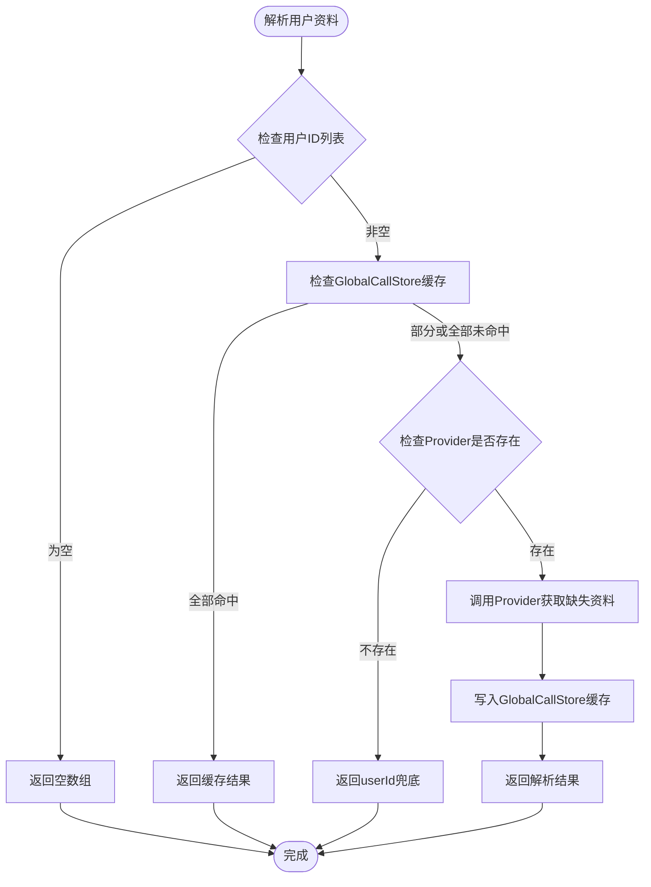
```mermaid
flowchart TD
Start([解析用户资料]) --> CheckEmpty{检查用户ID列表}
CheckEmpty --> |为空| ReturnEmpty[返回空数组]
CheckEmpty --> |非空| CheckCache[检查GlobalCallStore缓存]
CheckCache --> |全部命中| ReturnCached[返回缓存结果]
CheckCache --> |部分或全部未命中| CheckProvider{检查Provider是否存在}
CheckProvider --> |不存在| ReturnFallback[返回userId兜底]
CheckProvider --> |存在| CallProvider[调用Provider获取缺失资料]
CallProvider --> WriteCache[写入GlobalCallStore缓存]
WriteCache --> ReturnResult[返回解析结果]
ReturnEmpty --> End([完成])
ReturnCached --> End
ReturnFallback --> End
ReturnResult --> End
```

**图表来源**
- [lib/services/UserProfileService.ts:49-110](file://lib/services/UserProfileService.ts#L49-L110)

#### Provider 管理流程

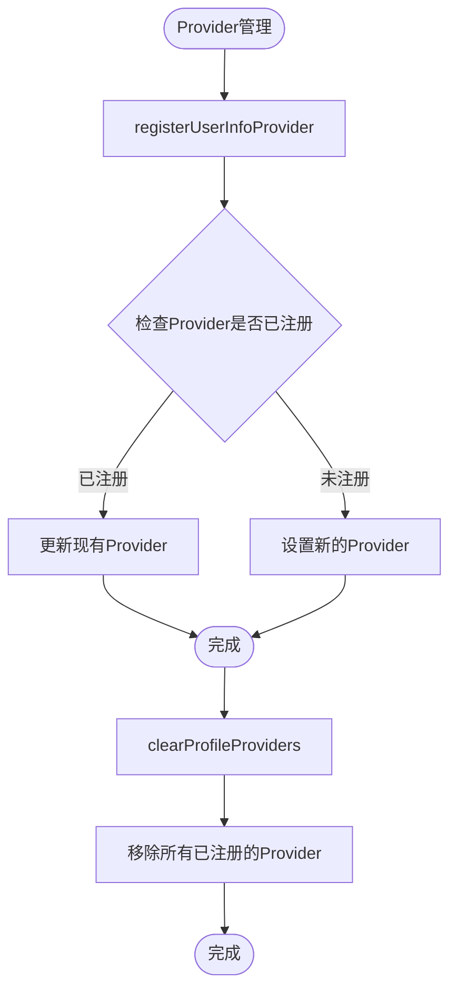
```mermaid
flowchart TD
Start([Provider管理]) --> Register[registerUserInfoProvider]
Register --> CheckProvider{检查Provider是否已注册}
CheckProvider --> |已注册| UpdateProvider[更新现有Provider]
CheckProvider --> |未注册| SetProvider[设置新的Provider]
UpdateProvider --> End([完成])
SetProvider --> End
End --> Clear[clearProfileProviders]
Clear --> RemoveProvider[移除所有已注册的Provider]
RemoveProvider --> End2([完成])
```

**新增** Provider 管理流程展示了 UserProfileService 的完整生命周期管理，包括 Provider 的注册、更新和清理功能。

**图表来源**
- [lib/services/UserProfileService.ts:25-42](file://lib/services/UserProfileService.ts#L25-L42)
- [lib/services/UserProfileService.ts:134-138](file://lib/services/UserProfileService.ts#L134-L138)

#### UserProfileService 核心功能

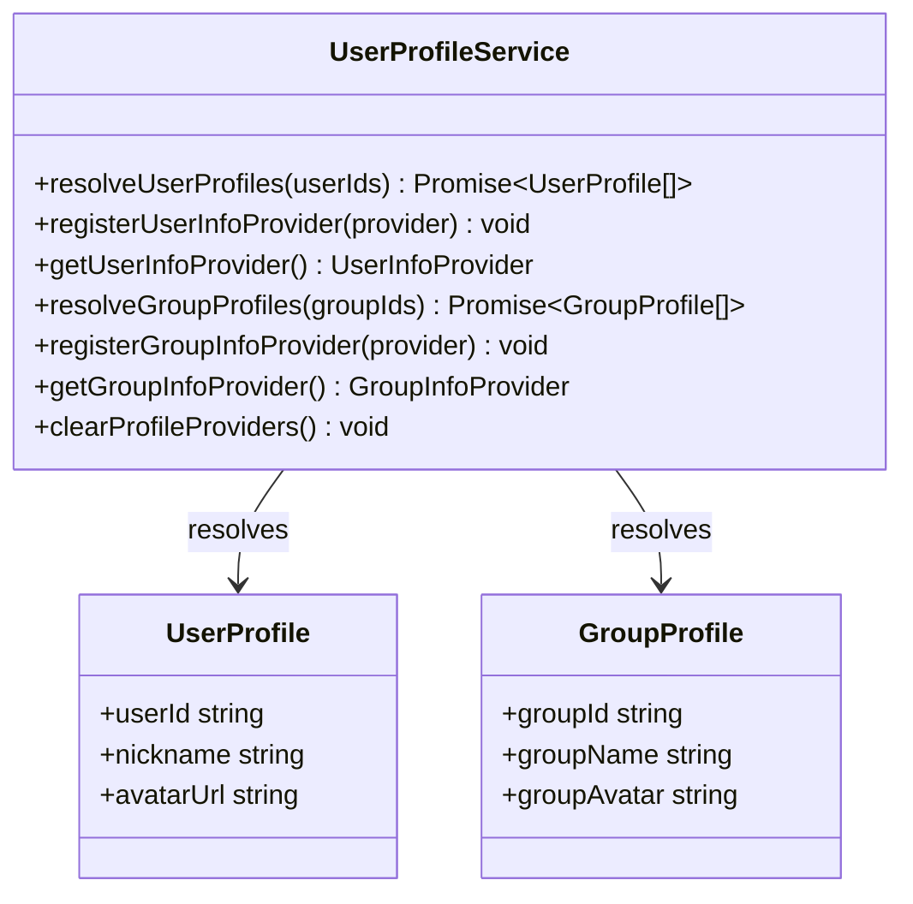
```mermaid
classDiagram
class UserProfileService {
+resolveUserProfiles(userIds) Promise~UserProfile[]~
+registerUserInfoProvider(provider) void
+getUserInfoProvider() UserInfoProvider
+resolveGroupProfiles(groupIds) Promise~GroupProfile[]~
+registerGroupInfoProvider(provider) void
+getGroupInfoProvider() GroupInfoProvider
+clearProfileProviders() void
}
class UserProfile {
+userId string
+nickname string
+avatarUrl string
}
class GroupProfile {
+groupId string
+groupName string
+groupAvatar string
}
UserProfileService --> UserProfile : resolves
UserProfileService --> GroupProfile : resolves
```

**图表来源**
- [lib/services/UserProfileService.ts:1-138](file://lib/services/UserProfileService.ts#L1-L138)

**章节来源**
- [lib/services/UserProfileService.ts:1-138](file://lib/services/UserProfileService.ts#L1-L138)

### EasemobChatCallKitProvider 详细分析

#### 生命周期管理

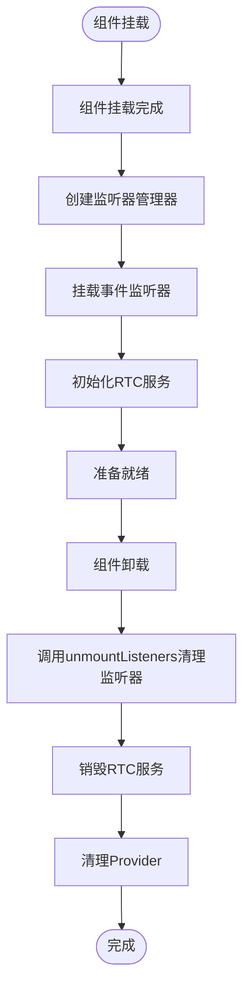
```mermaid
flowchart TD
Start([组件挂载]) --> Mount[组件挂载完成]
Mount --> CreateListenerManager[创建监听器管理器]
CreateListenerManager --> MountListeners[挂载事件监听器]
MountListeners --> InitializeRTC[初始化RTC服务]
InitializeRTC --> Ready[准备就绪]
Ready --> Unmount[组件卸载]
Unmount --> UnmountListeners[调用unmountListeners清理监听器]
UnmountListeners --> DestroyRTC[销毁RTC服务]
DestroyRTC --> ClearProviders[清理Provider]
ClearProviders --> End([完成])
```

**新增** 生命周期管理流程展示了 EasemobChatCallKitProvider 如何正确管理监听器的生命周期，确保组件卸载时所有资源都被正确清理。

**图表来源**
- [lib/components/EasemobChatCallKitProvider.vue:131-141](file://lib/components/EasemobChatCallKitProvider.vue#L131-L141)
- [lib/components/EasemobChatCallKitProvider.vue:200-205](file://lib/components/EasemobChatCallKitProvider.vue#L200-L205)

#### Provider 注册流程

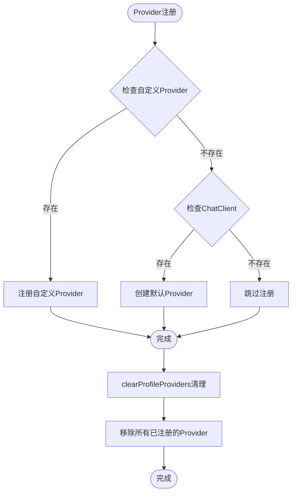
```mermaid
flowchart TD
Start([Provider注册]) --> CheckCustomProvider{检查自定义Provider}
CheckCustomProvider --> |存在| RegisterCustom[注册自定义Provider]
CheckCustomProvider --> |不存在| CheckChatClient{检查ChatClient}
CheckChatClient --> |存在| CreateDefault[创建默认Provider]
CheckChatClient --> |不存在| Skip[跳过注册]
RegisterCustom --> End([完成])
CreateDefault --> End
Skip --> End
End --> Clear[clearProfileProviders清理]
Clear --> RemoveProviders[移除所有已注册的Provider]
RemoveProviders --> End2([完成])
```

**新增** Provider 注册流程展示了 EasemobChatCallKitProvider 如何管理用户和群组资料 Provider 的注册和清理。

**图表来源**
- [lib/components/EasemobChatCallKitProvider.vue:164-179](file://lib/components/EasemobChatCallKitProvider.vue#L164-L179)
- [lib/components/EasemobChatCallKitProvider.vue:204](file://lib/components/EasemobChatCallKitProvider.vue#L204)

**章节来源**
- [lib/components/EasemobChatCallKitProvider.vue:1-207](file://lib/components/EasemobChatCallKitProvider.vue#L1-L207)

## 依赖关系分析

### 组件依赖图

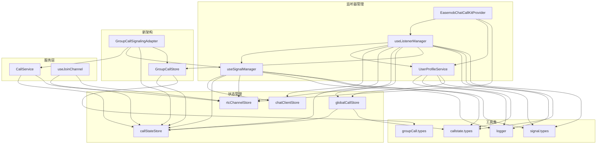
```mermaid
graph TB
subgraph "监听器管理"
LM[useListenerManager]
SM[useSignalManager]
UPS[UserProfileService]
ELM[EasemobChatCallKitProvider]
end
subgraph "状态管理"
CS[chatClientStore]
CL[callStateStore]
RC[rtcChannelStore]
GCS[globalCallStore]
end
subgraph "新架构"
GCS2[GroupCallStore]
GSA[GroupCallSignalingAdapter]
end
subgraph "服务层"
CSvc[CallService]
JC[useJoinChannel]
end
subgraph "工具类"
LG[logger]
CT[callstate.types]
ST[signal.types]
GT[groupCall.types]
end
LM --> SM
LM --> UPS
LM --> CS
LM --> CL
LM --> RC
LM --> GCS
LM --> GCS2
SM --> CS
SM --> CL
SM --> RC
CSvc --> CL
CSvc --> RC
JC --> CL
JC --> RC
LM --> LG
SM --> LG
UPS --> LG
ELM --> LM
ELM --> UPS
ELM --> RC
LM --> CT
LM --> ST
SM --> CT
SM --> ST
UPS --> CT
UPS --> ST
GSA --> CSvc
GSA --> SM
GSA --> CL
GSA --> GCS2
GCS2 --> CL
GCS2 --> GT
GCS --> CL
GCS --> CT
UPS --> GCS
```

**更新** 新增了 EasemobChatCallKitProvider 的依赖关系，展示了监听器管理的完整生命周期。新增了 UserProfileService 的清理依赖，**新增**了 EasemobChatCallKitProvider 作为监听器管理的宿主组件，负责资源清理。

**图表来源**
- [lib/composables/useListenerManager.ts:1-18](file://lib/composables/useListenerManager.ts#L1-L18)
- [lib/composables/useSignalManager.ts:1-6](file://lib/composables/useSignalManager.ts#L1-L6)
- [lib/store/globalCall.ts:1-56](file://lib/store/globalCall.ts#L1-L56)
- [lib/modules/groupCall/viewModel/GroupCallStore.ts:1-223](file://lib/modules/groupCall/viewModel/GroupCallStore.ts#L1-L223)
- [lib/services/UserProfileService.ts:1-138](file://lib/services/UserProfileService.ts#L1-L138)
- [lib/components/EasemobChatCallKitProvider.vue:1-207](file://lib/components/EasemobChatCallKitProvider.vue#L1-L207)

### 数据流分析

```mermaid
flowchart LR
subgraph "输入层"
TM[文本消息]
CM[CMD消息]
end
subgraph "处理层"
LM[监听器管理器]
SM[信令管理器]
UPS[用户资料解析服务]
CL[通话状态管理]
GCS[GlobalCallStore]
GCS2[GroupCallStore]
ELM[EasemobChatCallKitProvider]
end
subgraph "输出层"
UI[用户界面]
RTC[RTC频道]
LOG[日志系统]
end
TM --> LM
CM --> LM
LM --> SM
LM --> UPS
LM --> CL
LM --> GCS
LM --> GCS2
SM --> CL
UPS --> GCS
CL --> UI
CL --> RTC
LM --> LOG
SM --> LOG
UPS --> LOG
ELM --> LM
ELM --> UPS
ELM --> RC
GCS --> UI
GCS2 --> UI
GCS2 --> RTC
```

**更新** 新增了 EasemobChatCallKitProvider 的数据流，展示了监听器管理的完整生命周期。新增了 UserProfileService 的数据流，实现了来电者资料的智能解析和缓存管理。新增了 GlobalCallStore 和 GroupCallStore 的数据流，实现了用户信息和群组通话状态的独立管理。

**图表来源**
- [lib/composables/useListenerManager.ts:250-332](file://lib/composables/useListenerManager.ts#L250-L332)
- [lib/composables/useSignalManager.ts:7-406](file://lib/composables/useSignalManager.ts#L7-L406)
- [lib/store/globalCall.ts:1-56](file://lib/store/globalCall.ts#L1-L56)
- [lib/modules/groupCall/viewModel/GroupCallStore.ts:1-223](file://lib/modules/groupCall/viewModel/GroupCallStore.ts#L1-L223)
- [lib/services/UserProfileService.ts:1-138](file://lib/services/UserProfileService.ts#L1-L138)
- [lib/components/EasemobChatCallKitProvider.vue:1-207](file://lib/components/EasemobChatCallKitProvider.vue#L1-L207)

**章节来源**
- [lib/store/chatClient.ts:6-22](file://lib/store/chatClient.ts#L6-L22)
- [lib/store/callState.ts:7-187](file://lib/store/callState.ts#L7-L187)
- [lib/store/rtcChannel.ts:7-410](file://lib/store/rtcChannel.ts#L7-L410)

## 性能考虑

### 监听器性能优化

1. **动态客户端获取**
   - 每次调用时动态获取最新的 ChatClient 实例
   - 避免静态变量导致的过期引用问题

2. **内存泄漏防护**
   - **新增**：通过 `unmountListeners()` 方法主动移除事件监听器
   - 使用 Pinia store 管理状态，自动清理过期数据
   - 及时清除超时计时器
   - 正确管理 RTC 资源释放

3. **错误恢复机制**
   - 完善的 try-catch 包装
   - 详细的日志记录便于调试
   - 自动重试和降级策略

4. **群组通话优化**
   - 特别优化了多人通话场景下的监听器管理
5. **状态分离优化**
   - **新增**：通过 GlobalCallStore 和 GroupCallStore 实现状态分离
   - **新增**：避免了 callStateStore 中群组属性的重复存储
   - **新增**：减少了状态更新的耦合度

6. **用户信息管理优化**
   - **新增**：通过 GlobalCallStore 统一管理用户信息
   - **新增**：避免了分散存储导致的性能问题
   - **新增**：提高了用户信息访问的效率

7. **跨账户安全优化**
   - **新增**：快速用户身份验证，避免不必要的消息处理
   - **新增**：邀请成员列表缓存，减少重复验证开销
   - **新增**：早期过滤机制，防止无效消息进入处理流程

8. **新架构性能优化**
   - **新增**：GroupCallStore 的响应式更新机制
   - **新增**：UID 解析的智能缓存策略
   - **新增**：参与者状态变更的批量更新优化

9. **组ID字段路径优化**
10. **来电者资料解析优化**
    - **新增**：UserProfileService 的智能缓存策略，减少重复的 Provider 调用
    - **新增**：批量解析用户资料，提升处理效率
    - **新增**：优雅的错误降级机制，确保系统稳定性
    - **新增**：缓存预热机制，提高首次访问的响应速度

11. **来电者资料自动解析优化**
    - **新增**：当消息扩展数据缺少用户属性时，自动触发资料解析流程
    - **新增**：智能判断资料缺失场景，避免不必要的解析调用
    - **新增**：与现有用户属性处理流程无缝集成，保持代码简洁性

12. **监听器生命周期管理优化**
    - **新增**：通过 EasemobChatCallKitProvider 实现完整的生命周期管理
    - **新增**：确保组件卸载时正确清理所有监听器资源
    - **新增**：防止内存泄漏的多重保护机制

13. **Provider 管理优化**
    - **新增**：UserProfileService 的 Provider 注册和清理机制
    - **新增**：避免 Provider 泄漏的自动清理功能
    - **新增**：支持动态 Provider 替换和更新

### 监听器生命周期管理

```mermaid
flowchart TD
Start([组件挂载]) --> Register[注册监听器]
Register --> Active{监听器活跃}
Active --> Process[处理消息]
Process --> ValidateUser[跨账户安全验证]
ValidateUser --> CheckUserAttr{检查用户属性}
CheckUserAttr --> |存在| HandleUserAttr[处理用户属性]
CheckUserAttr --> |不存在| AutoResolve[自动解析来电者资料]
AutoResolve --> CheckCache{检查GlobalCallStore缓存}
CheckCache --> |命中| UseCached[使用缓存资料]
CheckCache --> |未命中| CallProvider[调用Provider获取资料]
CallProvider --> WriteCache[写入缓存]
WriteCache --> UseCached
UseCached --> CheckNewArch{检查新架构启用}
CheckNewArch --> |true| InitGroupCall[初始化GroupCallStore]
CheckNewArch --> |false| ProcessMessage[处理有效消息]
InitGroupCall --> ProcessMessage
ProcessMessage --> Update[更新状态]
Update --> CheckUserStore{检查用户信息变更?}
CheckUserStore --> |true| UpdateUserStore[更新GlobalCallStore]
CheckUserStore --> |false| CheckNewArch2{新架构状态变更?}
UpdateUserStore --> CheckNewArch2
CheckNewArch2 --> |true| UpdateGroupCall[更新GroupCallStore]
CheckNewArch2 --> |false| Process
UpdateGroupCall --> Process
Process --> Process
Active --> |组件卸载| Cleanup[清理资源]
Cleanup --> ClearTimer[清除超时计时器]
ClearTimer --> ClearListeners[移除事件监听器]
ClearListeners --> ResetState[重置通话状态]
ResetState --> StopRTC[停止RTC服务]
StopRTC --> DestroyGroupCall[销毁GroupCallStore]
DestroyGroupCall --> DestroyUserStore[销毁GlobalCallStore]
DestroyUserStore --> ClearProviders[清理Provider]
ClearProviders --> End([完成])
subgraph "清理步骤"
ClearTimer[清除超时计时器]
ClearListeners[移除事件监听器]
ResetState[重置通话状态]
StopRTC[停止RTC服务]
DestroyGroupCall[销毁GroupCallStore]
DestroyUserStore[销毁GlobalCallStore]
ClearProviders[清理Provider]
end
Cleanup --> ClearTimer
ClearTimer --> ClearListeners
ClearListeners --> ResetState
ResetState --> StopRTC
StopRTC --> DestroyGroupCall
DestroyGroupCall --> DestroyUserStore
DestroyUserStore --> ClearProviders
ClearProviders --> End
```

**更新** 新增了来电者资料自动解析和 GlobalCallStore 管理的清理步骤，实现了更完整的资源管理。修正了组ID字段路径，提升了多通话场景下的组识别准确性。**新增**了 UserProfileService 的生命周期管理，包括缓存清理和 Provider 注销。**新增**了完整的监听器生命周期管理流程，通过 EasemobChatCallKitProvider 实现了从挂载到清理的完整生命周期。

**图表来源**
- [lib/store/callState.ts:156-188](file://lib/store/callState.ts#L156-L188)
- [lib/store/rtcChannel.ts:373-408](file://lib/store/rtcChannel.ts#L373-L408)
- [lib/modules/groupCall/viewModel/GroupCallStore.ts:51-57](file://lib/modules/groupCall/viewModel/GroupCallStore.ts#L51-L57)
- [lib/store/globalCall.ts:51-57](file://lib/store/globalCall.ts#L51-L57)
- [lib/services/UserProfileService.ts:134-138](file://lib/services/UserProfileService.ts#L134-L138)
- [lib/composables/useListenerManager.ts:313-332](file://lib/composables/useListenerManager.ts#L313-L332)
- [lib/components/EasemobChatCallKitProvider.vue:200-205](file://lib/components/EasemobChatCallKitProvider.vue#L200-L205)

## 故障排除指南

### 常见问题及解决方案

#### 1. ChatClient 未初始化
**问题描述**: 监听器注册时报错，提示 ChatClient 未初始化
**解决方案**:
- 确保在 Provider 中正确初始化 ChatClient
- 检查登录状态是否正常
- 验证客户端设备 ID 获取是否成功

#### 2. 重复监听器注册
**问题描述**: 同一监听器被多次注册导致消息重复处理
**解决方案**:
- 在组件卸载时正确清理监听器
- 使用唯一的监听器标识符
- 避免在多个地方重复注册相同的监听器

#### 3. 监听器泄漏问题
**问题描述**: 组件卸载后监听器仍在运行导致内存泄漏
**解决方案**:
- **新增**：确保在组件卸载时调用 `unmountListeners()` 方法
- **新增**：检查 EasemobChatCallKitProvider 的 `onUnmounted` 钩子
- **新增**：验证监听器是否正确从 ChatClient 移除

#### 4. 信令消息处理异常
**问题描述**: 信令消息处理过程中出现异常
**解决方案**:
- 检查信令消息的 action 字段是否正确
- 验证消息扩展字段的完整性
- 查看日志输出定位具体问题

#### 5. 多端设备冲突
**问题描述**: 多个设备同时处理同一通话请求
**解决方案**:
- 检查设备 ID 匹配逻辑
- 实现设备优先级策略
- 处理设备切换场景

#### 6. 群组通话状态不一致
**问题描述**: 多人通话中各成员状态不同步
**解决方案**:
- 检查 callId 匹配逻辑
- 验证邀请成员列表管理
- 确认多人通话状态同步机制

#### 7. 跨账户安全问题
**问题描述**: 切换账号后仍收到前账号的通话邀请
**解决方案**:
- 检查跨账户安全验证逻辑
- 验证当前用户 ID 获取是否正确
- 确认邀请消息的目标用户验证

#### 8. 用户信息管理问题
**问题描述**: 用户属性无法正确显示或更新
**解决方案**:
- 检查 GlobalCallStore 的初始化状态
- 验证用户属性的存储和检索逻辑
- 确认用户 ID 映射的正确性

#### 9. 群组通话状态分离问题
**问题描述**: 群组通话状态管理混乱
**解决方案**:
- 检查 GroupCallStore 的初始化流程
- 验证参与者状态变更逻辑
- 确认 UID 解析功能正常工作

#### 10. 状态更新冲突
**问题描述**: callStateStore 和 GroupCallStore 状态更新冲突
**解决方案**:
- 检查状态分离的实现是否正确
- 验证状态更新的触发条件
- 确认状态同步机制的有效性

#### 11. 性能问题
**问题描述**: 监听器管理性能下降
**解决方案**:
- 检查 GlobalCallStore 和 GroupCallStore 的使用频率
- 验证状态更新的优化措施
- 确认内存泄漏的防护机制

**更新** 新增了监听器泄漏问题的故障排除指南，包括 `unmountListeners()` 方法的使用和 EasemobChatCallKitProvider 的生命周期管理。新增了 Provider 管理相关的故障排除指南，包括 Provider 注册和清理的诊断方法。修正了组ID字段路径相关的故障排除方法。**新增**了 UserProfileService 相关的故障排除指南。

#### 12. 条件逻辑错误
**问题描述**: USE_NEW_GROUP_CALL 条件判断导致功能异常
**解决方案**:
- 检查功能开关的配置状态
- 验证条件逻辑的执行路径
- 确认新旧架构的切换逻辑

#### 13. 组ID字段路径错误
**问题描述**: 组ID获取失败或组识别不正确
**解决方案**:
- 检查 ext.callkitGroupInfo.groupId 字段路径
- 验证群组通话消息的扩展字段结构
- 确认组ID解析逻辑的正确性
- 验证多通话场景下的组识别准确性

#### 14. 来电者资料解析失败
**问题描述**: 来电者资料无法正确显示
**解决方案**:
- 检查 UserProfileService 的初始化状态
- 验证 userInfoProvider 的注册和配置
- 确认 GlobalCallStore 的缓存状态
- 检查 Provider 调用的网络连接和权限
- 验证用户ID的格式和有效性

#### 15. 用户资料缓存问题
**问题描述**: 用户资料缓存不一致或过期
**解决方案**:
- 检查 GlobalCallStore 的缓存更新机制
- 验证缓存的失效策略和清理逻辑
- 确认批量解析时的缓存写入完整性
- 检查缓存键值的生成和匹配逻辑

#### 16. Provider 集成问题
**问题描述**: 用户资料 Provider 无法正常工作
**解决方案**:
- 检查 Provider 的注册时机和参数传递
- 验证 Provider 的返回数据格式和完整性
- 确认 Provider 的异步调用和错误处理
- 检查 Provider 的并发访问和资源竞争

#### 17. 监听器清理问题
**问题描述**: 监听器无法正确清理导致内存泄漏
**解决方案**:
- **新增**：检查 EasemobChatCallKitProvider 的 `onUnmounted` 钩子
- **新增**：验证 `unmountListeners()` 方法的调用时机
- **新增**：确认 ChatClient 的监听器移除是否成功
- **新增**：检查是否有其他地方仍然持有监听器引用

#### 18. Provider 清理问题
**问题描述**: Provider 无法正确清理导致资源泄漏
**解决方案**:
- **新增**：检查 EasemobChatCallKitProvider 的 `onUnmounted` 钩子
- **新增**：验证 `clearProfileProviders()` 方法的调用时机
- **新增**：确认 Provider 是否正确从内存中移除
- **新增**：检查是否有其他组件仍然引用已清理的 Provider

**章节来源**
- [lib/utils/logger.ts:50-231](file://lib/utils/logger.ts#L50-L231)
- [lib/composables/useListenerManager.ts:313-332](file://lib/composables/useListenerManager.ts#L313-L332)
- [lib/store/globalCall.ts:14-25](file://lib/store/globalCall.ts#L14-L25)
- [lib/modules/groupCall/viewModel/GroupCallStore.ts:43-57](file://lib/modules/groupCall/viewModel/GroupCallStore.ts#L43-L57)
- [lib/services/UserProfileService.ts:49-110](file://lib/services/UserProfileService.ts#L49-L110)
- [lib/components/EasemobChatCallKitProvider.vue:200-205](file://lib/components/EasemobChatCallKitProvider.vue#L200-L205)

### 调试方法

1. **启用详细日志**
   ```typescript
   import { logger } from "@/utils/logger";
   logger.setDebug(true);
   ```

2. **监控状态变化**
   - 使用浏览器开发者工具观察 Pinia store 变化
   - 监控 RTC 频道状态
   - 跟踪信令消息的发送和接收

3. **单元测试**
   - 为关键监听器函数编写单元测试
   - 测试边界条件和异常情况
   - 验证状态转换的正确性

4. **群组通话调试**
   - 监控邀请成员列表的变化
   - 跟踪多人通话状态同步
   - 验证网络延迟场景下的容错处理
   - **新增**：监控 GroupCallStore 的参与者状态变化
   - **新增**：验证 UID 解析功能的准确性

5. **用户信息调试**
   - **新增**：监控 GlobalCallStore 的用户信息存储
   - **新增**：验证用户属性的更新和检索
   - **新增**：检查用户 ID 映射的正确性
   - **新增**：监控 UserProfileService 的缓存命中率

6. **状态分离调试**
   - **新增**：监控 callStateStore 和 GroupCallStore 的状态分离
   - **新增**：验证状态更新的触发条件
   - **新增**：检查状态同步机制的有效性

7. **跨账户安全调试**
   - 监控用户身份验证过程
   - 跟踪邀请消息的目标用户验证
   - 验证账号切换场景下的安全防护

8. **新架构调试**
   - **新增**：监控 USE_NEW_GROUP_CALL 功能开关状态
   - **新增**：验证 GroupCallStore 的初始化和清理
   - **新增**：检查条件逻辑的执行路径
   - **新增**：跟踪新旧架构之间的数据流转

9. **信令适配器调试**
   - **新增**：验证 GroupCallSignalingAdapter 的初始化
   - **新增**：检查信令转发的正确性
   - **新增**：确认与传统信令格式的兼容性

10. **组ID字段路径调试**
    - **新增**：验证 ext.callkitGroupInfo.groupId 字段的正确性
    - **新增**：检查群组通话消息的扩展字段结构
    - **新增**：确认组ID解析逻辑在多通话场景下的准确性
    - **新增**：验证组信息获取的可靠性和一致性

11. **来电者资料解析调试**
    - **新增**：监控 UserProfileService 的解析流程
    - **新增**：验证缓存命中和 Provider 调用的时机
    - **新增**：检查用户资料的格式和完整性
    - **新增**：验证批量解析的性能和准确性

12. **用户资料缓存调试**
    - **新增**：监控 GlobalCallStore 的缓存状态
    - **新增**：验证缓存的读写操作和一致性
    - **新增**：检查缓存的生命周期和清理机制
    - **新增**：验证缓存失效策略的有效性

13. **Provider 集成调试**
    - **新增**：验证 userInfoProvider 的注册和配置
    - **新增**：检查 Provider 的调用参数和返回值
    - **新增**：监控 Provider 的错误处理和重试机制
    - **新增**：验证 Provider 的并发访问安全性

14. **监听器生命周期调试**
    - **新增**：监控 EasemobChatCallKitProvider 的生命周期钩子
    - **新增**：验证 `unmountListeners()` 方法的调用时机
    - **新增**：检查监听器的注册和移除过程
    - **新增**：确认组件卸载时的资源清理完整性

15. **Provider 生命周期调试**
    - **新增**：监控 EasemobChatCallKitProvider 的生命周期钩子
    - **新增**：验证 `clearProfileProviders()` 方法的调用时机
    - **新增**：检查 Provider 的注册和清理过程
    - **新增**：确认组件卸载时的资源清理完整性

## 结论

监听器管理 API 是环信 SDK 通话系统的核心基础设施，它通过 useListenerManager 和 useSignalManager 两个关键组件实现了：

1. **完整的监听器管理** - 提供了文本消息和信令消息的完整监听能力
2. **可靠的信令处理** - 确保通话状态的准确同步和一致性
3. **完善的错误处理** - 提供了多层次的错误捕获和恢复机制
4. **性能优化保障** - 通过内存管理和资源清理防止性能问题
5. **多端设备支持** - 处理复杂的多设备场景和冲突解决
6. **群组通话增强** - 特别优化了多人通话场景的监听器管理和状态同步
7. **用户信息统一管理** - **新增**：通过 GlobalCallStore 统一管理用户资料，避免分散存储
8. **状态分离优化** - **新增**：实现了 callStateStore 与 GroupCallStore 的职责分离
9. **跨账户安全防护** - **新增**：防止切换账号后收到前账号的离线邀请，确保邀请只针对当前登录用户
10. **新架构支持** - **新增**：通过 GroupCallStore 提供了更强大的群组通话状态管理能力
11. **组ID字段路径修正** - **更新**：从 ext.groupId 更正为 ext.callkitGroupInfo.groupId，确保多通话场景下的正确组识别
12. **来电者资料自动解析** - **新增**：通过 UserProfileService 实现来电者资料的智能缓存和批量解析，即使原始消息缺少用户属性也能正确显示来电者信息
13. **内存泄漏防护** - **新增**：通过 `unmountListeners()` 方法提供显式清理机制，防止监听器泄漏
14. **完整的生命周期管理** - **新增**：通过 EasemobChatCallKitProvider 实现了从挂载到清理的完整生命周期管理

**更新** 本次更新显著增强了监听器管理的架构设计，通过引入 GlobalCallStore 和 GroupCallStore 实现了更清晰的状态分离。useListenerManager 现在专注于监听器注册和消息处理，并提供了 `unmountListeners()` 方法来主动清理监听器资源，防止内存泄漏。同时，修正了组ID字段路径，提升了多通话场景下的组识别准确性。**新增**了 UserProfileService，实现了来电者资料的智能解析和缓存管理，**新增**了 EasemobChatCallKitProvider 作为监听器管理的宿主组件，负责资源清理。这种设计不仅提高了代码的可维护性，还为未来的功能扩展奠定了坚实的基础。

这些组件的设计充分考虑了实时通信系统的特殊需求，包括高可靠性、低延迟、强一致性的要求。通过合理的架构设计和完善的错误处理机制，为上层应用提供了稳定可靠的通话基础能力。

在未来的发展中，建议继续关注：
- 监听器性能的持续优化
- 更完善的错误恢复机制
- 更丰富的调试和监控工具
- 对新功能特性的支持和扩展
- 网络环境适应性的进一步提升
- **用户信息管理的持续改进**：优化 GlobalCallStore 的性能和功能
- **状态分离的深入应用**：探索更多状态模块的分离可能性
- **跨账户安全防护的持续改进**：定期审查和更新安全验证逻辑，应对新的安全威胁
- **新架构的持续演进**：随着 GroupCallStore 的完善，逐步淘汰传统架构的相关代码
- **条件逻辑的优化**：通过编译时优化减少运行时判断开销
- **渐进式迁移策略**：制定更详细的架构迁移计划，确保平滑过渡
- **组ID字段路径的持续优化**：确保在各种场景下都能正确识别组信息
- **来电者资料解析的持续优化**：提升 UserProfileService 的缓存策略和解析效率
- **用户资料缓存的智能管理**：实现更精准的缓存失效和更新机制
- **Provider 集成的稳定性提升**：增强 Provider 的错误处理和重试机制
- **监听器生命周期的持续优化**：确保组件卸载时所有资源都被正确清理
- **Provider 生命周期的持续优化**：防止 Provider 泄漏的多重保护机制
- **内存泄漏防护的持续改进**：建立更完善的资源管理机制