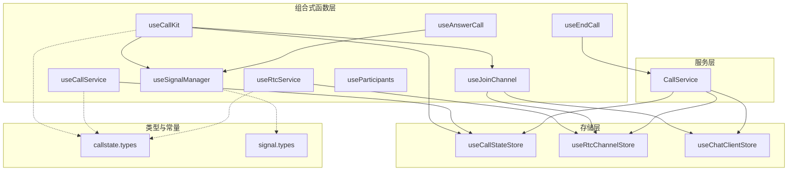
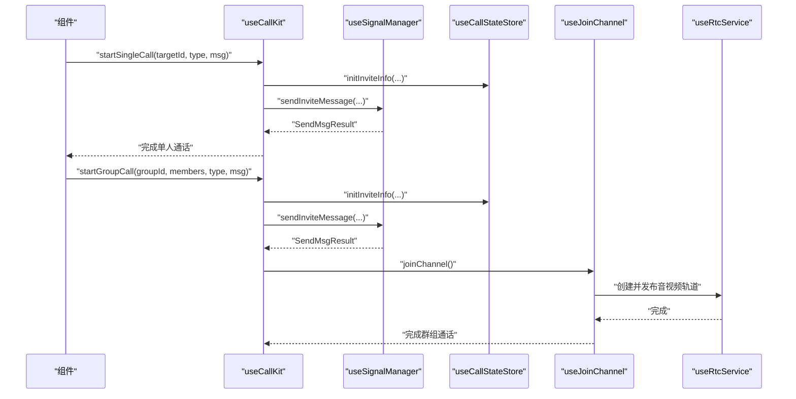
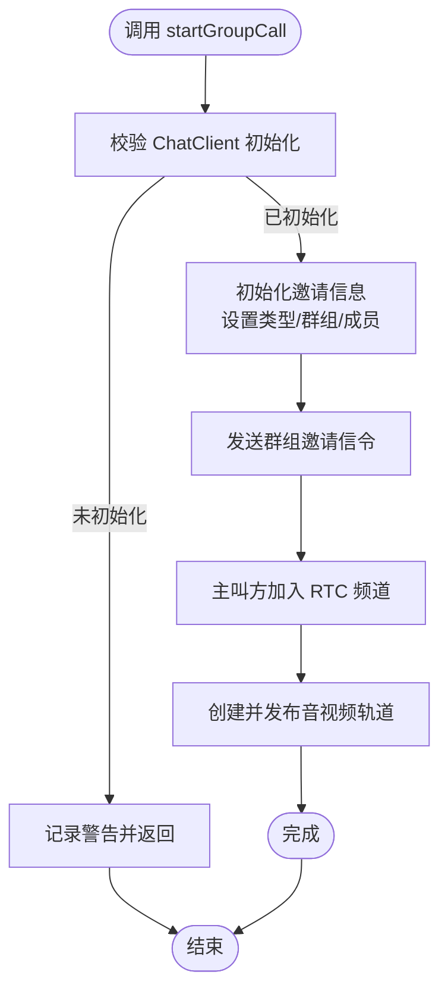
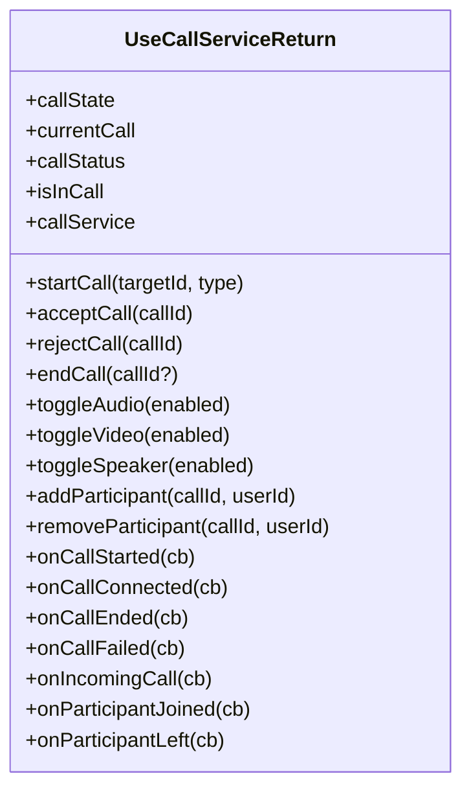
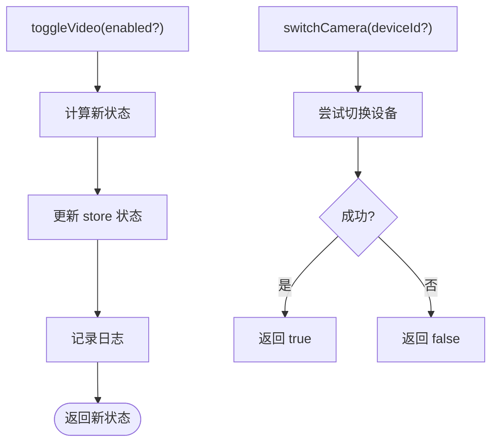
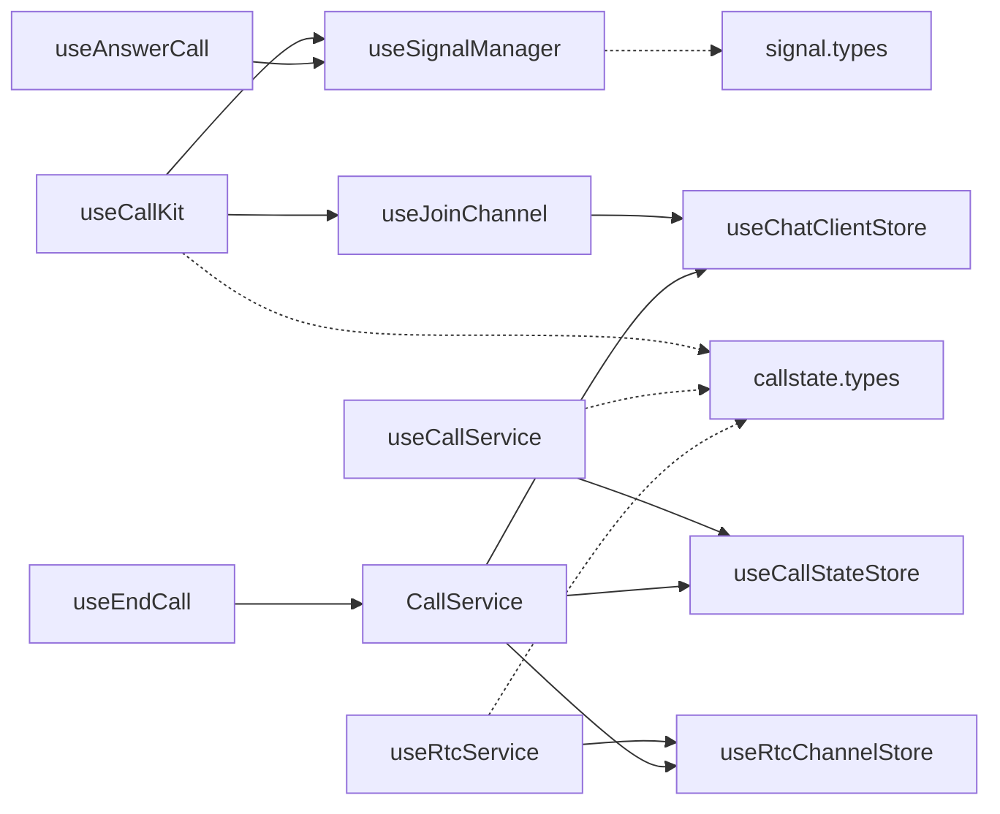

# 组合式 API

<cite>
**本文档引用的文件**
- [lib/composables/useCallKit.ts](file://lib/composables/useCallKit.ts)
- [lib/composables/useCallService.ts](file://lib/composables/useCallService.ts)
- [lib/composables/useRtcService.ts](file://lib/composables/useRtcService.ts)
- [lib/composables/useSignalManager.ts](file://lib/composables/useSignalManager.ts)
- [lib/composables/useJoinChannel.ts](file://lib/composables/useJoinChannel.ts)
- [lib/composables/useEndCall.ts](file://lib/composables/useEndCall.ts)
- [lib/composables/useAnswerCall.ts](file://lib/composables/useAnswerCall.ts)
- [lib/composables/useParticipants.ts](file://lib/composables/useParticipants.ts)
- [lib/services/CallService.ts](file://lib/services/CallService.ts)
- [lib/store/types.ts](file://lib/store/types.ts)
- [lib/types/callstate.types.ts](file://lib/types/callstate.types.ts)
- [lib/types/signal.types.ts](file://lib/types/signal.types.ts)
- [lib/index.ts](file://lib/index.ts)
</cite>

## 目录
1. [简介](#简介)
2. [项目结构](#项目结构)
3. [核心组件](#核心组件)
4. [架构总览](#架构总览)
5. [详细组件分析](#详细组件分析)
6. [依赖关系分析](#依赖关系分析)
7. [性能考量](#性能考量)
8. [故障排查指南](#故障排查指南)
9. [结论](#结论)
10. [附录](#附录)

## 简介
本文件为该 Vue3 CallKit 组件库的组合式 API 参考文档，聚焦于 useCallKit、useCallService、useRtcService 等核心组合式函数。文档系统性阐述这些函数的功能、参数、返回值、使用场景与最佳实践，并解释它们如何通过响应式状态、服务封装与信令管理，简化状态管理、服务调用与业务逻辑处理。同时提供与传统组件 API 的差异与优势说明，帮助开发者高效集成与扩展。

## 项目结构
该库采用“组合式函数 + 服务 + 存储 + 类型”的分层组织方式：
- 组合式函数层：封装 UI 交互与业务流程，如发起通话、应答、挂断、音视频控制等。
- 服务层：封装底层业务逻辑，如 CallService、RtcService 等。
- 存储层：使用 Pinia 管理响应式状态，如通话状态、RTC 频道状态等。
- 类型层：统一定义通话状态、信令类型、常量等。

图表来源
- [lib/composables/useCallKit.ts](file://lib/composables/useCallKit.ts#L1-L123)
- [lib/composables/useCallService.ts](file://lib/composables/useCallService.ts#L1-L299)
- [lib/composables/useRtcService.ts](file://lib/composables/useRtcService.ts#L1-L192)
- [lib/composables/useSignalManager.ts](file://lib/composables/useSignalManager.ts#L1-L354)
- [lib/composables/useJoinChannel.ts](file://lib/composables/useJoinChannel.ts#L1-L185)
- [lib/composables/useEndCall.ts](file://lib/composables/useEndCall.ts#L1-L131)
- [lib/composables/useAnswerCall.ts](file://lib/composables/useAnswerCall.ts#L1-L168)
- [lib/services/CallService.ts](file://lib/services/CallService.ts#L1-L298)
- [lib/store/types.ts](file://lib/store/types.ts#L1-L86)
- [lib/types/callstate.types.ts](file://lib/types/callstate.types.ts#L1-L93)
- [lib/types/signal.types.ts](file://lib/types/signal.types.ts#L1-L196)

章节来源
- [lib/index.ts](file://lib/index.ts#L1-L58)

## 核心组件
本节概述三大核心组合式函数及其职责与能力边界。

- useCallKit
  - 职责：封装发起单人/群组通话的入口，负责初始化邀请信息、发送邀请信令、在群组通话中主动加入 RTC 频道。
  - 关键能力：startSingleCall、startGroupCall；与 useSignalManager、useJoinChannel、useCallStateStore 协作。
  - 适用场景：主叫方发起通话、准备信令与媒体通道。

- useCallService
  - 职责：提供类型安全的通话操作接口，管理通话状态生命周期，封装对 CallService 的访问。
  - 关键能力：startCall、acceptCall、rejectCall、endCall、toggleAudio/Video/Speaker、参与者管理、事件监听。
  - 适用场景：统一管理通话状态与操作，便于在组件中以组合式方式使用。

- useRtcService
  - 职责：封装 RTC 音视频设备与流管理，提供切换摄像头/麦克风、本地/远端流读取与重置能力。
  - 关键能力：localStream、remoteStreams、isVideoEnabled/isAudioEnabled、toggleVideo/toggleAudio、switchCamera/switchMicrophone、get/setLocalStream/add/removeRemoteStream、reset。
  - 适用场景：在 UI 中控制音视频开关、切换设备、渲染本地/远端视频流。

章节来源
- [lib/composables/useCallKit.ts](file://lib/composables/useCallKit.ts#L1-L123)
- [lib/composables/useCallService.ts](file://lib/composables/useCallService.ts#L1-L299)
- [lib/composables/useRtcService.ts](file://lib/composables/useRtcService.ts#L1-L192)

## 架构总览
下图展示从 UI 到服务与存储的调用链路，体现组合式函数如何解耦状态与业务逻辑。

图表来源
- [lib/composables/useCallKit.ts](file://lib/composables/useCallKit.ts#L13-L117)
- [lib/composables/useSignalManager.ts](file://lib/composables/useSignalManager.ts#L73-L102)
- [lib/composables/useJoinChannel.ts](file://lib/composables/useJoinChannel.ts#L76-L178)
- [lib/composables/useRtcService.ts](file://lib/composables/useRtcService.ts#L128-L158)

## 详细组件分析

### useCallKit：发起通话的组合式入口
- 功能要点
  - 单人通话：校验 ChatClient 初始化、设置邀请状态、发送邀请信令。
  - 群组通话：校验成员列表、设置群组邀请状态、发送邀请信令，并在主叫侧立即加入 RTC 频道与发布轨道。
- 参数与返回
  - startSingleCall(targetId, type, msg)：无返回值，内部异步处理。
  - startGroupCall(groupId, members[], type, msg, groupName?, groupAvatar?)：无返回值，内部异步处理。
- 使用场景
  - 主动发起一对一/群组通话，快速完成信令与媒体通道准备。
- 最佳实践
  - 确保 Provider 已注入 ChatClient；群组通话务必提供有效成员列表。
  - 群组通话中，主叫方应在发送邀请后尽快加入频道，避免被叫方先接入导致的时序问题。

图表来源
- [lib/composables/useCallKit.ts](file://lib/composables/useCallKit.ts#L51-L117)
- [lib/composables/useJoinChannel.ts](file://lib/composables/useJoinChannel.ts#L76-L178)

章节来源
- [lib/composables/useCallKit.ts](file://lib/composables/useCallKit.ts#L1-L123)

### useCallService：统一通话状态与操作
- 功能要点
  - 提供类型安全的通话操作：startCall、acceptCall、rejectCall、endCall。
  - 提供通话控制：toggleAudio、toggleVideo、toggleSpeaker。
  - 提供参与者管理：addParticipant、removeParticipant。
  - 提供事件监听：onCallStarted、onCallConnected、onCallEnded、onCallFailed、onIncomingCall、onParticipantJoined、onParticipantLeft。
  - 管理生命周期：onMounted/onUnmounted，维护 store 状态。
- 参数与返回
  - startCall(targetId, type)：返回 callId 字符串。
  - acceptCall/rejectCall/endCall：Promise<void>。
  - toggle*：Promise<void>。
- 使用场景
  - 在组件中以组合式方式集中管理通话状态与操作，避免分散的状态更新与副作用。
- 最佳实践
  - 通过 computed 包装 callStatus/isInCall/currentCall，减少重复读取 store。
  - 对外暴露 callService 实例，便于与第三方服务对接。

图表来源
- [lib/composables/useCallService.ts](file://lib/composables/useCallService.ts#L47-L80)

章节来源
- [lib/composables/useCallService.ts](file://lib/composables/useCallService.ts#L1-L299)

### useRtcService：音视频设备与流管理
- 功能要点
  - 提供本地/远端流的响应式访问：localStream、remoteStreams。
  - 设备控制：toggleVideo、toggleAudio、switchCamera、switchMicrophone。
  - 流管理：getLocalStream、getRemoteStream、addRemoteStream、removeRemoteStream、setLocalStream。
  - 状态查询：isVideoEnabled、isAudioEnabled、isConnected、activeChannel。
  - 重置：reset。
- 参数与返回
  - toggleVideo/ toggleAudio(enabled?)：返回新状态布尔值。
  - switchCamera/ switchMicrophone(deviceId?)：返回布尔值表示是否成功。
  - get/setLocalStream/getRemoteStream/removeRemoteStream：读写本地/远端流。
- 使用场景
  - 在 UI 中控制音视频开关、切换摄像头/麦克风、渲染本地/远端视频。
- 最佳实践
  - 使用 computed 订阅 localStream/remoteStreams，配合深监听观察远端流变化。
  - 在组件卸载时调用 reset，避免资源泄漏。

图表来源
- [lib/composables/useRtcService.ts](file://lib/composables/useRtcService.ts#L66-L123)

章节来源
- [lib/composables/useRtcService.ts](file://lib/composables/useRtcService.ts#L1-L192)

### useSignalManager：统一信令发送
- 功能要点
  - 提供多种信令发送方法：sendInviteMessage、sendAnswerMessage、sendCancelMessage、sendLeaveMessage、sendBusyAnswerMessage、sendAlertMessage、sendConfirmRingMessage、sendConfirmCalleeMessage。
  - 统一封装 ChatClient 获取与错误处理。
- 参数与返回
  - sendInviteMessage(targetId|targetId[], chatType, message, groupId?)：返回 SendMsgResult。
  - sendAnswerMessage(targetId, payload, result?)：返回 SendMsgResult。
  - sendCancelMessage(to, chatType, receiverList?)：返回 SendMsgResult。
  - sendLeaveMessage(to, chatType, receiverList?)：返回 SendMsgResult。
- 使用场景
  - 在发起/应答/取消/离开等环节发送标准化信令，保证一致性与可追踪性。
- 最佳实践
  - 在调用前确保 ChatClient 已初始化；对异常进行捕获与日志记录。

章节来源
- [lib/composables/useSignalManager.ts](file://lib/composables/useSignalManager.ts#L1-L354)

### useJoinChannel：加入 RTC 频道
- 功能要点
  - 获取并缓存 RTC Token 与 Agora appId/uid。
  - 检查重复加入与已有连接状态，避免并发问题。
  - 创建并发布音视频轨道，更新 store 状态并启动计时。
- 参数与返回
  - joinChannel()：Promise<void>。
  - isJoining：布尔状态。
- 使用场景
  - 在被叫应答或主叫确认后，加入 RTC 频道并发布本地轨道。
- 最佳实践
  - 在调用前确保 RtcService 已注入；对网络异常与设备权限进行降级处理。

章节来源
- [lib/composables/useJoinChannel.ts](file://lib/composables/useJoinChannel.ts#L1-L185)

### useEndCall：挂断与异常处理
- 功能要点
  - 提供多种挂断场景：hangup(reason)、hangupCall()、cancelCall()、handleRemoteCancel()、handleRemoteRefuse()、handleAbnormalEnd()。
  - 提供状态检查：canHangup()、canCancel()。
- 参数与返回
  - hangup(reason?)：Promise<void>。
  - canHangup/canCancel：boolean。
- 使用场景
  - 统一处理挂断、取消、远程取消/拒绝、异常结束等场景。
- 最佳实践
  - 在 UI 中根据 canHangup/canCancel 控制按钮可用性；对异常进行日志记录与提示。

章节来源
- [lib/composables/useEndCall.ts](file://lib/composables/useEndCall.ts#L1-L131)

### useAnswerCall：被叫应答
- 功能要点
  - 接受通话：发送 answerCall 信令（result=accept），更新状态为 ANSWER_CALL。
  - 拒绝通话：发送 answerCall 信令（result=refuse），重置状态。
  - 忙碌拒绝：发送 answerCall 信令（result=busy），重置状态。
- 参数与返回
  - acceptCall/rejectCall/busyRejectCall：Promise<void>。
- 使用场景
  - 被叫方在响铃阶段进行应答/拒绝/忙碌拒绝。
- 最佳实践
  - 在状态非 ALERTING 时拒绝接受；及时清除超时计时器。

章节来源
- [lib/composables/useAnswerCall.ts](file://lib/composables/useAnswerCall.ts#L1-L168)

### useParticipants：自动生成参与者列表
- 功能要点
  - 自动过滤已离开用户，标记邀请中/已加入状态，聚合当前用户、主叫方与其他被邀请成员。
  - 支持传入 currentUserId 覆盖默认当前用户。
- 参数与返回
  - useParticipants(currentUserId?)：返回 participants 计算属性。
- 使用场景
  - 在 UI 中展示群组通话的实时参与者列表，屏蔽底层状态细节。
- 最佳实践
  - 通过 computed 订阅参与者的 isInviting/hasJoined，驱动 UI 状态更新。

章节来源
- [lib/composables/useParticipants.ts](file://lib/composables/useParticipants.ts#L1-L120)

## 依赖关系分析
- 组合式函数之间的协作
  - useCallKit 依赖 useSignalManager 与 useJoinChannel，用于信令发送与频道加入。
  - useCallService 依赖 useCallStateStore，提供统一的状态与操作接口。
  - useRtcService 依赖 useRtcChannelStore，提供音视频设备与流管理。
  - useEndCall 依赖 CallService，统一处理挂断与异常场景。
  - useAnswerCall 依赖 useSignalManager 与 useCallStateStore，处理被叫应答。
  - useJoinChannel 依赖 useChatClientStore 与 useRtcChannelStore，获取 Token 并发布轨道。
- 类型与常量
  - callstate.types：定义通话状态、类型、挂断原因等常量与接口。
  - signal.types：定义信令扩展字段与消息配置接口。
- 存储类型
  - store/types：定义 CallState、RtcChannelState、CurrentCallInfo 等类型。

图表来源
- [lib/composables/useCallKit.ts](file://lib/composables/useCallKit.ts#L1-L123)
- [lib/composables/useCallService.ts](file://lib/composables/useCallService.ts#L1-L299)
- [lib/composables/useRtcService.ts](file://lib/composables/useRtcService.ts#L1-L192)
- [lib/composables/useSignalManager.ts](file://lib/composables/useSignalManager.ts#L1-L354)
- [lib/composables/useJoinChannel.ts](file://lib/composables/useJoinChannel.ts#L1-L185)
- [lib/composables/useEndCall.ts](file://lib/composables/useEndCall.ts#L1-L131)
- [lib/composables/useAnswerCall.ts](file://lib/composables/useAnswerCall.ts#L1-L168)
- [lib/services/CallService.ts](file://lib/services/CallService.ts#L1-L298)
- [lib/store/types.ts](file://lib/store/types.ts#L1-L86)
- [lib/types/callstate.types.ts](file://lib/types/callstate.types.ts#L1-L93)
- [lib/types/signal.types.ts](file://lib/types/signal.types.ts#L1-L196)

章节来源
- [lib/store/types.ts](file://lib/store/types.ts#L1-L86)
- [lib/types/callstate.types.ts](file://lib/types/callstate.types.ts#L1-L93)
- [lib/types/signal.types.ts](file://lib/types/signal.types.ts#L1-L196)

## 性能考量
- 响应式与计算属性
  - 使用 computed 包装状态读取，减少不必要的重渲染；对 remoteStreams 使用深监听时注意性能。
- 异步与并发
  - joinChannel 内部有 isJoining 标记，避免重复加入；在 UI 中应根据 canHangup/canCancel 控制按钮状态，减少无效调用。
- 日志与可观测性
  - 各组合式函数均内置 logger，建议在生产环境配置合适的日志级别，避免过度输出影响性能。
- 资源释放
  - 在组件卸载时调用 useRtcService.reset 或执行必要的清理逻辑，防止媒体资源泄漏。

## 故障排查指南
- ChatClient 未初始化
  - 现象：调用 useCallKit/useSignalManager 时出现警告或抛错。
  - 处理：确保在 Provider 中注入 ChatClient；在组件中延迟调用或在 mounted 后再发起请求。
- Token 获取失败
  - 现象：加入频道时报错，提示无法获取 Token。
  - 处理：检查环信 SDK 的 getRTCToken 接口返回；确认 appId/uid/RTCToken 正确；在网络异常时重试。
- 重复加入频道
  - 现象：多次调用 joinChannel 不生效或报错。
  - 处理：利用 isJoining 标记与 store 中 isConnected 状态，避免并发加入。
- 信令发送失败
  - 现象：邀请/应答/离开等信令发送异常。
  - 处理：捕获异常并记录日志；检查 ChatClient 状态与网络连通性；必要时重发。
- 挂断异常
  - 现象：hangup 后状态未重置或媒体资源未释放。
  - 处理：确保 CallService 的清理流程执行；在异常分支中也尝试重置状态。

章节来源
- [lib/composables/useCallKit.ts](file://lib/composables/useCallKit.ts#L22-L25)
- [lib/composables/useSignalManager.ts](file://lib/composables/useSignalManager.ts#L57-L64)
- [lib/composables/useJoinChannel.ts](file://lib/composables/useJoinChannel.ts#L84-L103)
- [lib/services/CallService.ts](file://lib/services/CallService.ts#L25-L72)

## 结论
该组合式 API 体系通过 useCallKit、useCallService、useRtcService 等函数，将复杂的通话生命周期、信令交互与媒体管理抽象为简洁易用的接口，显著降低了状态管理与业务逻辑的复杂度。配合统一的类型与常量定义、完善的错误处理与日志记录，开发者可以更专注于 UI 与用户体验的实现。相比传统组件 API，组合式 API 更加模块化、可测试、可复用，适合在大型项目中长期演进。

## 附录
- 导出清单
  - 组合式函数：useCallKit、useCallService、useRtcService、useJoinChannel、useEndCall、useAnswerCall、useParticipants。
  - 存储：useCallStateStore、useRtcChannelStore、useChatClientStore。
  - 服务：CallService。
  - 类型：CALL_STATUS、CALL_TYPE、HANGUP_REASON、CALLKIT_CMD_MSG_RESULT_TYPE、SignalMessageInviteExt、SignalingMessageOptions 等。
- 使用建议
  - 在组件中优先使用组合式函数，避免直接操作 store 与服务实例。
  - 对外暴露的组合式函数应尽量保持纯函数特性，副作用集中在内部处理。
  - 对关键流程绘制序列图与状态图，便于团队协作与知识沉淀。

章节来源
- [lib/index.ts](file://lib/index.ts#L18-L46)