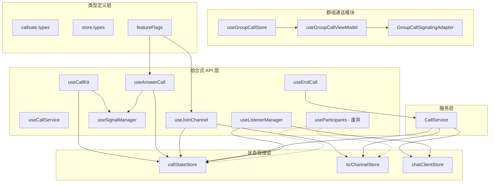
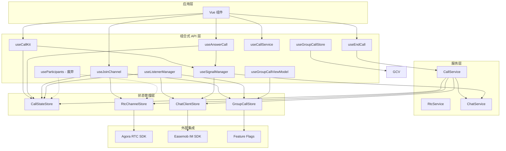
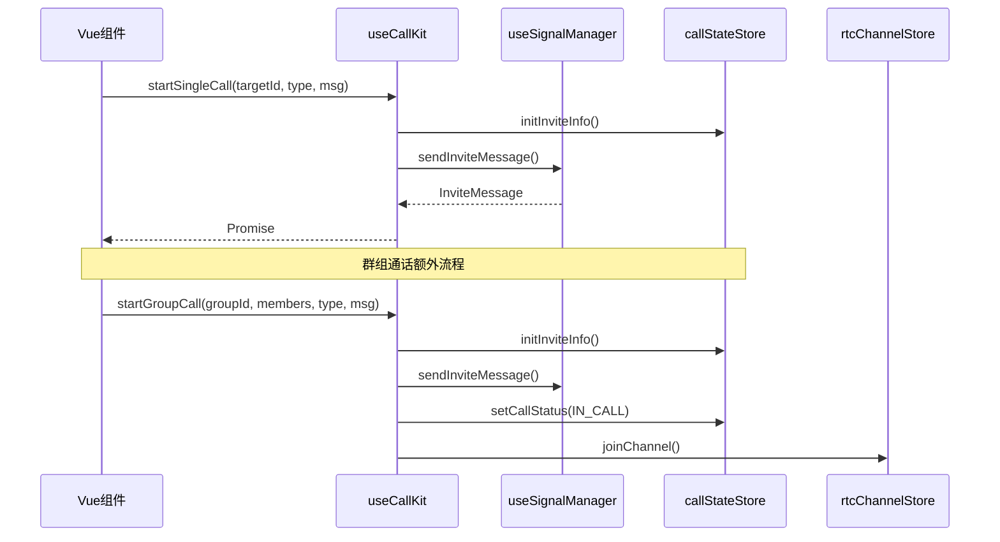
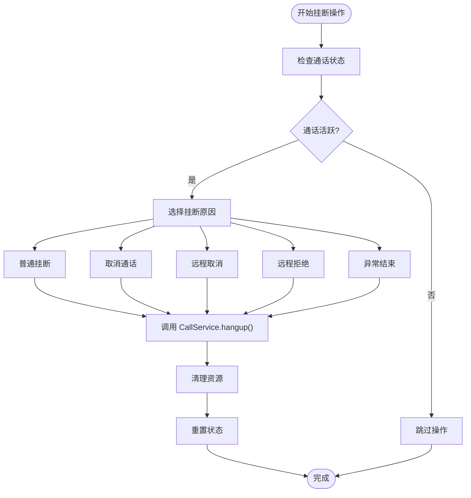
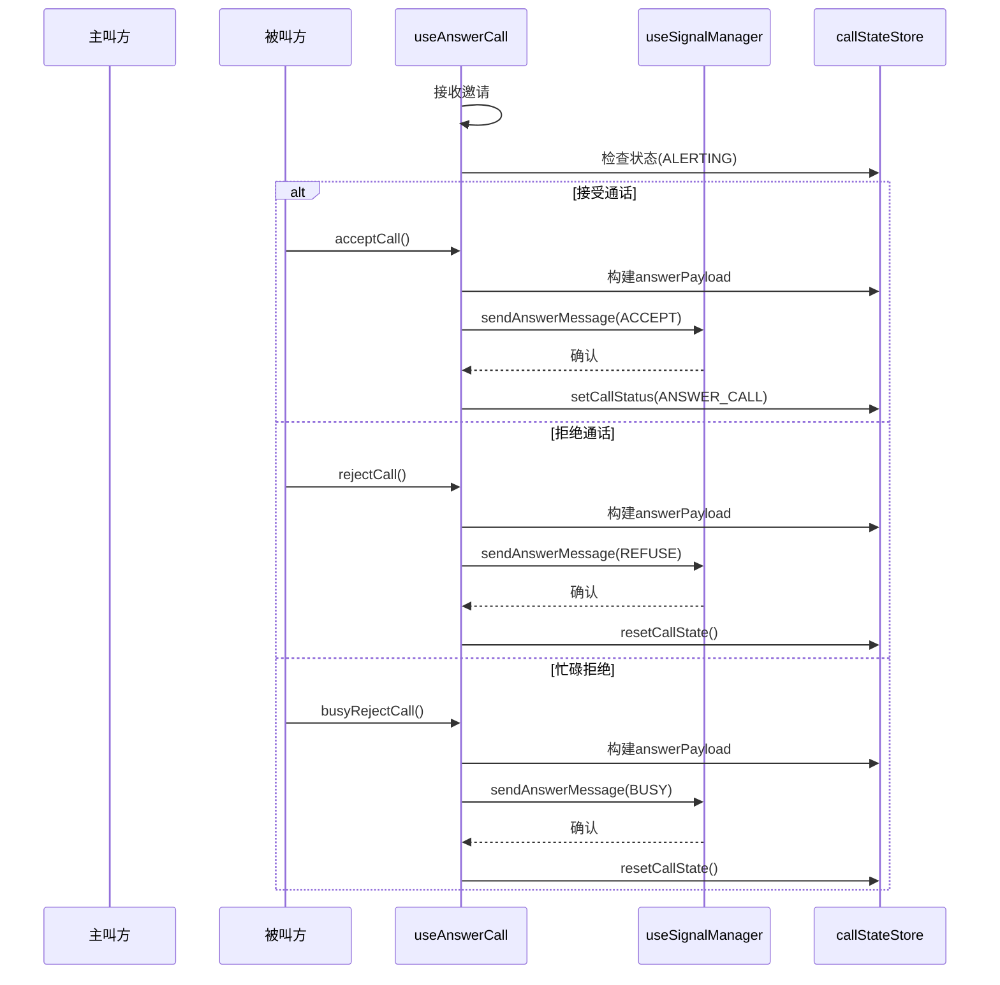
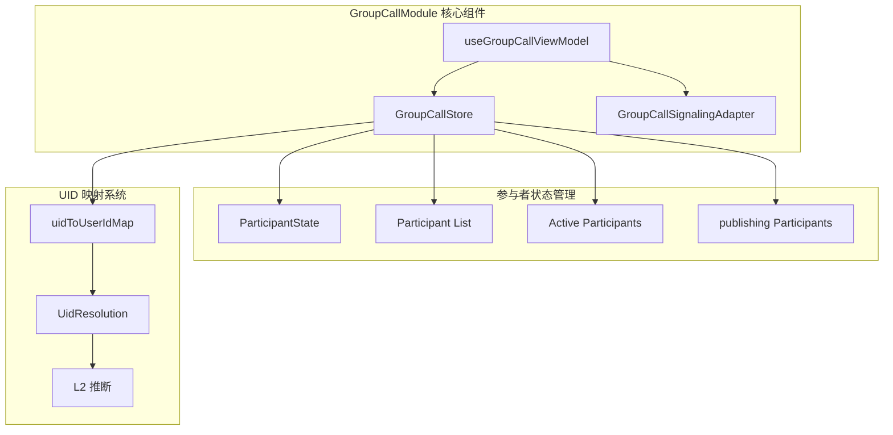
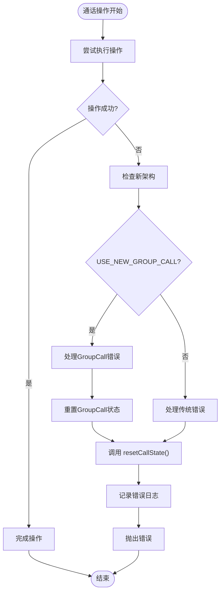
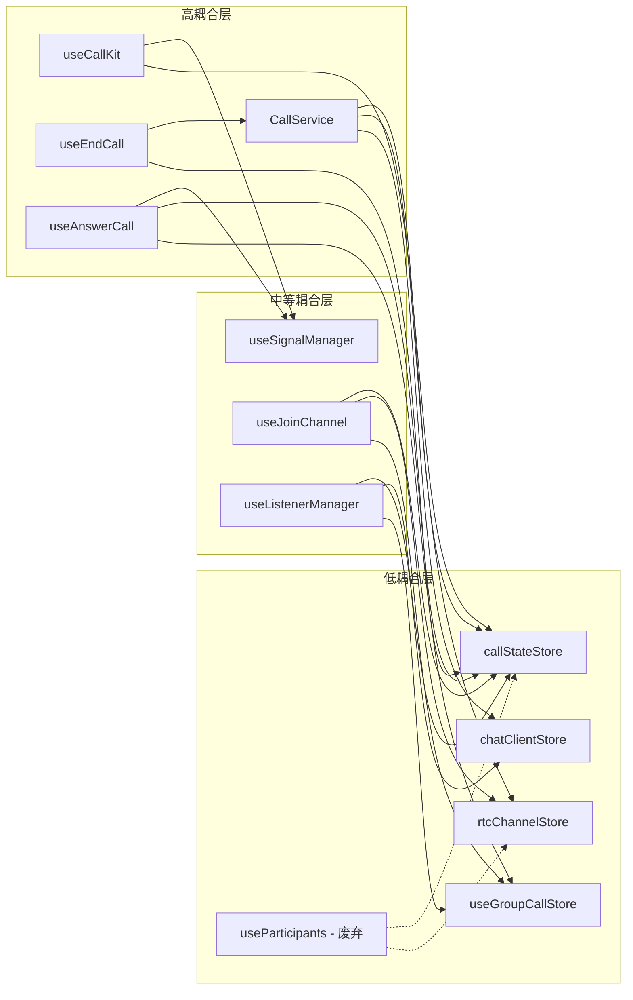
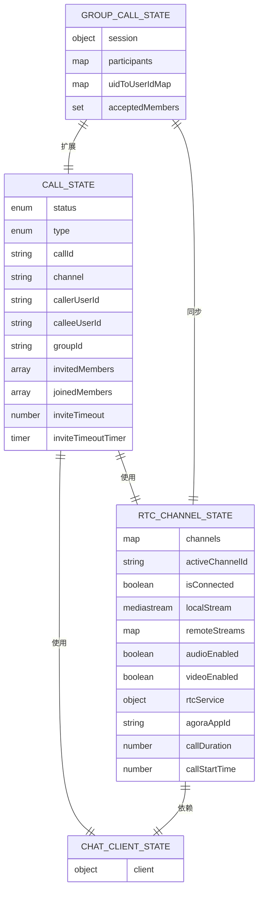

# 通话控制 API

<cite>
**本文档引用的文件**
- [lib/composables/useCallKit.ts](file://lib/composables/useCallKit.ts)
- [lib/composables/useCallService.ts](file://lib/composables/useCallService.ts)
- [lib/composables/useEndCall.ts](file://lib/composables/useEndCall.ts)
- [lib/composables/useAnswerCall.ts](file://lib/composables/useAnswerCall.ts)
- [lib/composables/useJoinChannel.ts](file://lib/composables/useJoinChannel.ts)
- [lib/composables/useSignalManager.ts](file://lib/composables/useSignalManager.ts)
- [lib/composables/useListenerManager.ts](file://lib/composables/useListenerManager.ts)
- [lib/composables/useParticipants.ts](file://lib/composables/useParticipants.ts)
- [lib/services/CallService.ts](file://lib/services/CallService.ts)
- [lib/store/callState.ts](file://lib/store/callState.ts)
- [lib/store/types.ts](file://lib/store/types.ts)
- [lib/types/callstate.types.ts](file://lib/types/callstate.types.ts)
- [lib/config/featureFlags.ts](file://lib/config/featureFlags.ts)
- [lib/modules/groupCall/index.ts](file://lib/modules/groupCall/index.ts)
- [lib/modules/groupCall/viewModel/GroupCallStore.ts](file://lib/modules/groupCall/viewModel/GroupCallStore.ts)
- [lib/modules/groupCall/types.ts](file://lib/modules/groupCall/types.ts)
- [lib/modules/groupCall/viewModel/useGroupCallViewModel.ts](file://lib/modules/groupCall/viewModel/useGroupCallViewModel.ts)
- [lib/modules/groupCall/signaling/GroupCallSignalingAdapter.ts](file://lib/modules/groupCall/signaling/GroupCallSignalingAdapter.ts)
- [lib/ARCHITECTURE.md](file://lib/ARCHITECTURE.md)
- [lib/SIGNALING_IMPLEMENTATION.md](file://lib/SIGNALING_IMPLEMENTATION.md)
</cite>

## 更新摘要
**变更内容**
- 新增 GroupCallModule 架构支持，包含条件逻辑以启用新功能
- 更新 useAnswerCall.ts 和 useJoinChannel.ts 的增强功能
- 新增 useGroupCallStore 状态管理模块
- 更新错误处理改进章节，包含新的兜底状态重置机制
- 新增群组通话参与者状态管理功能
- 更新故障排除指南，包含新架构的调试方法
- **重构**：useCallKit.ts、useAnswerCall.ts、useJoinChannel.ts 移除了旧架构依赖，简化了调用逻辑并通过功能开关集成新架构
- **废弃**：useParticipants.ts 标记为废弃，推荐使用新的 GroupCallModule

## 目录
1. [简介](#简介)
2. [项目结构](#项目结构)
3. [核心组件](#核心组件)
4. [架构概览](#架构概览)
5. [详细组件分析](#详细组件分析)
6. [GroupCallModule 架构](#groupcallmodule-架构)
7. [错误处理改进](#错误处理改进)
8. [依赖关系分析](#依赖关系分析)
9. [性能考虑](#性能考虑)
10. [故障排除指南](#故障排除指南)
11. [结论](#结论)

## 简介

本文档详细介绍 Easemob Vue3 通话控制相关的组合式 API，重点涵盖 `useCallKit`、`useCallService`、`useEndCall`、`useAnswerCall`、`useJoinChannel` 等核心函数。这些 API 提供了完整的通话生命周期管理能力，包括发起单人和群组通话、接听来电、结束通话等操作。

该系统采用组合式 API 设计模式，结合 Pinia 状态管理、信令管理和 RTC 集成，为开发者提供了简洁而强大的通话控制接口。最新版本引入了全新的 GroupCallModule 架构，通过条件逻辑支持新的群组通话管理模式，并增强了错误处理机制，在信令发送失败时能够自动重置状态，避免 UI 卡住的问题。

**重构更新**：本次更新反映了组合式函数的重大重构，移除了对旧架构的依赖，简化了调用逻辑，并通过功能开关集成了新的 GroupCallModule 架构。

## 项目结构

项目采用模块化设计，主要分为以下几个核心模块：

**图表来源**
- [lib/composables/useCallKit.ts:1-157](file://lib/composables/useCallKit.ts#L1-L157)
- [lib/composables/useEndCall.ts:1-131](file://lib/composables/useEndCall.ts#L1-L131)
- [lib/composables/useAnswerCall.ts:1-169](file://lib/composables/useAnswerCall.ts#L1-L169)
- [lib/composables/useJoinChannel.ts:1-209](file://lib/composables/useJoinChannel.ts#L1-L209)
- [lib/composables/useListenerManager.ts](file://lib/composables/useListenerManager.ts)
- [lib/composables/useParticipants.ts:1-127](file://lib/composables/useParticipants.ts#L1-L127)
- [lib/services/CallService.ts](file://lib/services/CallService.ts)
- [lib/config/featureFlags.ts:1-10](file://lib/config/featureFlags.ts#L1-L10)

**章节来源**
- [lib/composables/useCallKit.ts:1-157](file://lib/composables/useCallKit.ts#L1-L157)
- [lib/composables/useEndCall.ts:1-131](file://lib/composables/useEndCall.ts#L1-L131)
- [lib/composables/useAnswerCall.ts:1-169](file://lib/composables/useAnswerCall.ts#L1-L169)
- [lib/composables/useJoinChannel.ts:1-209](file://lib/composables/useJoinChannel.ts#L1-L209)
- [lib/composables/useListenerManager.ts](file://lib/composables/useListenerManager.ts)

## 核心组件

### useCallKit - 通话发起控制器

`useCallKit` 是通话发起的核心组合式 API，提供单人和群组通话的发起能力。

**主要功能：**
- 发起单人语音/视频通话
- 发起群组语音/视频通话
- 管理通话状态初始化
- 处理信令发送

**核心方法：**
- `startSingleCall(targetId, type, msg)` - 发起单人通话
- `startGroupCall(groupId, members, type, msg, groupName?, groupAvatar?)` - 发起群组通话

**重构更新**：新增对 GroupCallModule 的集成支持，通过功能开关控制新架构的启用

**章节来源**
- [lib/composables/useCallKit.ts:10-157](file://lib/composables/useCallKit.ts#L10-L157)

### useEndCall - 通话结束控制器

`useEndCall` 提供多种通话结束场景的便捷方法。

**支持的操作：**
- 普通挂断 (`hangupCall`)
- 取消通话邀请 (`cancelCall`)
- 远程取消处理 (`handleRemoteCancel`)
- 远程拒绝处理 (`handleRemoteRefuse`)
- 异常结束处理 (`handleAbnormalEnd`)

**状态检查：**
- `canHangup()` - 检查是否可以挂断
- `canCancel()` - 检查是否可以取消

**章节来源**
- [lib/composables/useEndCall.ts:10-131](file://lib/composables/useEndCall.ts#L10-L131)

### useAnswerCall - 通话应答控制器

`useAnswerCall` 专门处理被叫方的通话应答操作。

**核心功能：**
- 接受通话 (`acceptCall`)
- 拒绝通话 (`rejectCall`)
- 忙碌拒绝通话 (`busyRejectCall`)

**状态管理：**
- 自动处理超时计时器
- 更新通话状态为 `ANSWER_CALL`
- 发送相应的信令消息

**错误处理改进**：新增兜底状态重置机制，当信令发送失败时自动重置通话状态，避免 UI 卡住

**章节来源**
- [lib/composables/useAnswerCall.ts:15-169](file://lib/composables/useAnswerCall.ts#L15-L169)

### useJoinChannel - RTC 频道加入控制器

`useJoinChannel` 提供 RTC 频道加入的统一接口。

**核心功能：**
- 加入 RTC 频道
- 管理音视频轨道创建和发布
- 处理单聊和群聊的加入逻辑

**状态管理：**
- 获取和验证 RTC Token
- 创建音视频轨道
- 更新频道连接状态

**关键修复**：新增被叫方场景下的主叫方用户 ID 管理，确保 user-joined 事件能正确映射 UID 到用户 ID

**章节来源**
- [lib/composables/useJoinChannel.ts:22-209](file://lib/composables/useJoinChannel.ts#L22-L209)

### useCallService - 通话服务适配器

`useCallService` 提供类型安全的通话服务访问接口。

**主要职责：**
- 管理通话状态生命周期
- 提供类型安全的通话操作接口
- 自动处理服务初始化和清理

**核心接口：**
- `startCall(targetId, callType)` - 发起通话
- `acceptCall(callId)` - 接受通话
- `rejectCall(callId)` - 拒绝通话
- `endCall(callId?)` - 结束通话

**章节来源**
- [lib/composables/useCallService.ts:82-299](file://lib/composables/useCallService.ts#L82-L299)

### useParticipants - 参与者管理（已废弃）

**重要说明**：此组件已被废弃，不再推荐使用。

**主要功能：**
- 自动生成群组参与者列表
- 自动过滤已离开的用户
- 标记用户的加入状态

**废弃原因**：
- 被新的 GroupCallModule 替代
- 群组通话管理迁移到新的架构
- 更好的状态管理和性能优化

**替代方案**：使用 `useGroupCallViewModel` 和 `useGroupCallStore` 获取新的群组通话参与者管理功能

**章节来源**
- [lib/composables/useParticipants.ts:18-127](file://lib/composables/useParticipants.ts#L18-L127)

## 架构概览

系统采用分层架构设计，各层职责清晰分离，支持新旧两种通话架构：

**图表来源**
- [lib/composables/useCallKit.ts:1-157](file://lib/composables/useCallKit.ts#L1-L157)
- [lib/composables/useEndCall.ts:1-131](file://lib/composables/useEndCall.ts#L1-L131)
- [lib/composables/useAnswerCall.ts:1-169](file://lib/composables/useAnswerCall.ts#L1-L169)
- [lib/composables/useListenerManager.ts](file://lib/composables/useListenerManager.ts)
- [lib/services/CallService.ts](file://lib/services/CallService.ts)
- [lib/config/featureFlags.ts:1-10](file://lib/config/featureFlags.ts#L1-L10)

## 详细组件分析

### useCallKit 组件分析

#### 功能架构图

**图表来源**
- [lib/composables/useCallKit.ts:13-157](file://lib/composables/useCallKit.ts#L13-L157)
- [lib/composables/useJoinChannel.ts:75-209](file://lib/composables/useJoinChannel.ts#L75-L209)

#### 核心实现要点

1. **状态初始化**：通过 `initInviteInfo` 方法设置初始通话状态
2. **信令发送**：使用 `useSignalManager` 统一封装信令发送逻辑
3. **群组特殊处理**：群组通话会在发送邀请后立即加入 RTC 频道

**重构更新**：新增对 GroupCallModule 的集成，群组通话发起时会初始化新的会话状态

**章节来源**
- [lib/composables/useCallKit.ts:52-151](file://lib/composables/useCallKit.ts#L52-L151)

### useEndCall 组件分析

#### 错误处理流程图

**图表来源**
- [lib/composables/useEndCall.ts:18-131](file://lib/composables/useEndCall.ts#L18-L131)
- [lib/services/CallService.ts](file://lib/services/CallService.ts)

#### 状态检查机制

组件提供了智能的状态检查功能：

- `canHangup()`：检查当前是否为活跃通话状态
- `canCancel()`：检查当前是否为邀请中状态

**章节来源**
- [lib/composables/useEndCall.ts:104-115](file://lib/composables/useEndCall.ts#L104-L115)

### useAnswerCall 组件分析

#### 通话应答序列图

**图表来源**
- [lib/composables/useAnswerCall.ts:27-169](file://lib/composables/useAnswerCall.ts#L27-L169)

#### 错误处理改进

**更新**：新增兜底状态重置机制，当信令发送失败时自动调用 `resetCallState()`，避免 UI 卡住

组件通过 `useSignalManager` 统一管理所有通话信令：

- `sendAnswerMessage()`：发送通话应答信令
- 支持三种结果类型：接受、拒绝、忙碌
- 自动处理 payload 构建和发送

**章节来源**
- [lib/composables/useAnswerCall.ts:27-169](file://lib/composables/useAnswerCall.ts#L27-L169)

### useJoinChannel 组件分析

#### RTC 频道加入流程

**图表来源**
- [lib/composables/useJoinChannel.ts:75-209](file://lib/composables/useJoinChannel.ts#L75-L209)

#### 关键修复

**更新**：新增被叫方场景下的用户 ID 管理

组件实现了关键修复，确保被叫方场景下的正确行为：

- 检测到主叫方用户 ID 且与当前用户不同
- 将主叫方加入 pending 用户列表
- 确保 `user-joined` 事件能正确将 UID 映射到 `callerUserId`

**章节来源**
- [lib/composables/useJoinChannel.ts:185-190](file://lib/composables/useJoinChannel.ts#L185-L190)

## GroupCallModule 架构

### 架构概述

GroupCallModule 是全新的群组通话管理系统，采用单一事实源设计，替代了旧架构中的分散状态管理。

**图表来源**
- [lib/modules/groupCall/viewModel/GroupCallStore.ts:1-223](file://lib/modules/groupCall/viewModel/GroupCallStore.ts#L1-L223)
- [lib/modules/groupCall/viewModel/useGroupCallViewModel.ts:1-295](file://lib/modules/groupCall/viewModel/useGroupCallViewModel.ts#L1-L295)
- [lib/modules/groupCall/types.ts](file://lib/modules/groupCall/types.ts)

### 核心特性

#### 单一事实源
- `useGroupCallStore` 提供单一的参与者和状态管理
- 替代旧架构中的 `useParticipants` + `rtcChannelStore` 分散逻辑
- 确保状态一致性，避免竞态条件

#### 智能状态管理
- 支持五种参与者生命周期状态：`invited`、`accepted`、`joinedRtc`、`publishing`、`left`
- 自动状态转换和时间戳管理
- 计算属性提供派生状态的高效访问

#### UID 解析系统
- `resolveUid()` 方法提供三级解析：确定映射、强推断、未知
- L2 推断机制：通过 accepted 但未建立映射的用户进行推断
- 支持弱响应式更新，确保 UI 实时同步

#### 会话管理
- `initSession()` 和 `destroySession()` 生命周期管理
- 支持视频和音频两种通话类型
- 记录会话开始时间和活跃状态

**章节来源**
- [lib/modules/groupCall/viewModel/GroupCallStore.ts:1-223](file://lib/modules/groupCall/viewModel/GroupCallStore.ts#L1-L223)
- [lib/modules/groupCall/types.ts](file://lib/modules/groupCall/types.ts)

### 功能开关

**USE_NEW_GROUP_CALL** 功能开关控制新架构的启用：

- 默认值：`true` - 启用新架构
- 作用范围：影响 `useAnswerCall`、`useJoinChannel`、`useListenerManager` 等组件
- 渐进式迁移：允许新旧架构共存，逐步切换

**章节来源**
- [lib/config/featureFlags.ts:1-10](file://lib/config/featureFlags.ts#L1-L10)

## 错误处理改进

### 信令发送失败的自动重置机制

**更新**：最新版本增强了错误处理能力，确保在信令发送失败时能够自动重置通话状态，避免 UI 卡住的问题。

#### 关键改进点

1. **useAnswerCall 组件的兜底重置**
   - 在 `acceptCall()`、`rejectCall()`、`busyRejectCall()` 方法中添加了 `resetCallState()` 调用
   - 即使信令发送失败，也会重置通话状态，确保 UI 正常恢复

2. **CallService 的健壮性增强**
   - 在 `hangup()` 方法中增加了更完善的错误处理
   - 即使在清理过程中发生错误，也会尝试重置基本状态

3. **状态重置的双重保障**
   - `resetState()` 方法中调用了两次 `resetCallState()` 确保状态完全重置
   - 防止状态残留导致的 UI 问题

4. **useJoinChannel 的关键修复**
   - 新增被叫方场景下的用户 ID 管理，确保正确的 UID 映射
   - 避免 user-joined 事件无法正确映射的问题

#### GroupCallModule 错误处理

**更新**：新架构下的错误处理增强

- `useGroupCallStore` 提供了更细粒度的状态管理
- 参与者状态的自动清理和重置
- UID 映射的错误恢复机制

#### 错误处理流程图

**章节来源**
- [lib/composables/useAnswerCall.ts:69-72](file://lib/composables/useAnswerCall.ts#L69-L72)
- [lib/composables/useJoinChannel.ts:185-190](file://lib/composables/useJoinChannel.ts#L185-L190)

### UI 卡住问题的解决方案

**更新**：通过自动状态重置机制，有效解决了信令发送失败时 UI 卡住的问题。

#### 解决方案要点

1. **兜底状态重置**
   - 在所有关键操作中添加了 `resetCallState()` 调用
   - 确保即使出现异常也能恢复到 IDLE 状态

2. **错误日志记录**
   - 所有错误都会被记录到日志中
   - 方便开发者进行问题诊断和调试

3. **异常传播**
   - 错误会被正确抛出，让上层组件能够处理
   - 避免静默失败导致的问题

4. **新架构下的状态管理**
   - `useGroupCallStore` 提供了更可靠的状态恢复
   - 参与者状态的自动清理机制

5. **被叫方场景修复**
   - `useJoinChannel` 中的用户 ID 管理修复
   - 确保正确的 UID 映射和状态同步

**章节来源**
- [lib/composables/useAnswerCall.ts:69-72](file://lib/composables/useAnswerCall.ts#L69-L72)
- [lib/composables/useJoinChannel.ts:185-190](file://lib/composables/useJoinChannel.ts#L185-L190)

## 依赖关系分析

### 组件耦合度分析

**图表来源**
- [lib/composables/useCallKit.ts:1-157](file://lib/composables/useCallKit.ts#L1-L157)
- [lib/composables/useEndCall.ts:1-131](file://lib/composables/useEndCall.ts#L1-L131)
- [lib/composables/useAnswerCall.ts:1-169](file://lib/composables/useAnswerCall.ts#L1-L169)
- [lib/composables/useListenerManager.ts](file://lib/composables/useListenerManager.ts)
- [lib/services/CallService.ts](file://lib/services/CallService.ts)

### 状态管理关系

系统采用集中式状态管理模式，支持新旧两种架构：

**图表来源**
- [lib/store/types.ts:43-86](file://lib/store/types.ts#L43-L86)
- [lib/modules/groupCall/types.ts:42-56](file://lib/modules/groupCall/types.ts#L42-L56)

**章节来源**
- [lib/store/callState.ts:7-187](file://lib/store/callState.ts#L7-L187)
- [lib/store/types.ts:1-86](file://lib/store/types.ts#L1-L86)
- [lib/modules/groupCall/viewModel/GroupCallStore.ts:10-223](file://lib/modules/groupCall/viewModel/GroupCallStore.ts#L10-L223)

## 性能考虑

### 异步操作优化

1. **防抖处理**：所有通话操作都实现了防重复调用机制
2. **资源清理**：自动清理媒体资源和 RTC 连接
3. **状态同步**：实时同步通话状态到各个存储层

### 内存管理

- 使用 WeakMap 和 Map 优化内存使用
- 及时清理定时器和事件监听器
- 避免循环引用和内存泄漏

### 网络优化

- 智能重连机制
- 错误重试策略
- 超时控制和异常处理

### GroupCallModule 性能优化

**更新**：新架构下的性能优化

- 计算属性缓存：`participantList`、`localParticipant` 等计算属性提供高效访问
- 浅响应式更新：通过重新赋值触发响应式更新，避免深层监听
- 智能状态转换：自动状态转换减少手动管理开销
- UID 缓存：`uidToUserIdMap` 提供快速映射查询

### 废弃组件的性能影响

**更新**：useParticipants.ts 废弃后的性能提升

- 减少了不必要的计算和状态维护
- 简化了状态管理逻辑
- 提高了整体系统的响应速度

## 故障排除指南

### 常见问题及解决方案

#### 1. ChatClient 未初始化

**症状**：调用 API 时出现 "ChatClient未初始化" 错误

**解决方案**：
- 确保在 Provider 包裹下使用 API
- 检查登录状态
- 验证 SDK 初始化顺序

#### 2. 通话状态异常

**症状**：通话结束后状态未重置，UI 卡住

**解决方案**：
- 检查 `resetCallState()` 调用
- 验证状态流转逻辑
- 查看日志输出定位问题

**更新**：新版本已增强错误处理，即使出现异常也会自动重置状态

#### 3. RTC 连接失败

**症状**：加入频道失败或音视频轨道创建失败

**解决方案**：
- 检查 Token 获取
- 验证网络连接
- 确认权限设置

#### 4. 信令发送失败

**症状**：通话邀请或应答信令发送失败，UI 无响应

**解决方案**：
- 检查网络连接状态
- 验证目标用户是否在线
- 查看错误日志获取详细信息

**更新**：新版本已实现自动状态重置，避免 UI 卡住问题

#### 5. GroupCallModule 相关问题

**症状**：群组通话参与者状态异常或 UID 映射失败

**解决方案**：
- 检查 `USE_NEW_GROUP_CALL` 功能开关
- 验证 `useGroupCallStore` 状态
- 确认参与者状态转换逻辑
- 查看 UID 解析日志

**更新**：新架构提供了更详细的错误日志和状态恢复机制

#### 6. 被叫方 UID 映射问题

**症状**：被叫方场景下 user-joined 事件无法正确映射 UID

**解决方案**：
- 检查 pending 用户列表设置
- 验证主叫方用户 ID 检测逻辑
- 确认 `addPendingUserId()` 调用时机

**更新**：新版本已实现关键修复，确保正确的用户 ID 管理

#### 7. useParticipants 组件问题

**症状**：使用旧的 useParticipants 组件时出现问题

**解决方案**：
- 升级到新的 GroupCallModule
- 使用 `useGroupCallViewModel` 和 `useGroupCallStore`
- 参考新的架构文档进行迁移

**更新**：useParticipants.ts 已标记为废弃，建议尽快迁移

**章节来源**
- [lib/composables/useSignalManager.ts:57-64](file://lib/composables/useSignalManager.ts#L57-L64)
- [lib/services/CallService.ts](file://lib/services/CallService.ts)
- [lib/composables/useAnswerCall.ts:69-72](file://lib/composables/useAnswerCall.ts#L69-L72)
- [lib/composables/useJoinChannel.ts:185-190](file://lib/composables/useJoinChannel.ts#L185-L190)
- [lib/composables/useParticipants.ts:20](file://lib/composables/useParticipants.ts#L20)]

## 结论

Easemob Vue3 通话控制 API 提供了完整而灵活的通话管理解决方案。通过组合式 API 设计，开发者可以轻松集成语音和视频通话功能，同时享受类型安全和良好的开发体验。

### 主要优势

1. **模块化设计**：清晰的职责分离和低耦合架构
2. **类型安全**：完整的 TypeScript 类型定义
3. **易于使用**：简洁的 API 接口和丰富的示例
4. **可扩展性**：支持自定义配置和扩展点
5. **稳定性**：完善的错误处理和状态管理
6. **健壮性**：新增的自动状态重置机制，有效避免 UI 卡住问题
7. **现代化架构**：GroupCallModule 提供了更先进的群组通话管理

### GroupCallModule 架构优势

**更新**：新架构带来的显著改进

1. **单一事实源**：`useGroupCallStore` 提供统一的状态管理
2. **智能状态管理**：自动状态转换和时间戳管理
3. **UID 解析系统**：三级解析机制确保准确的用户映射
4. **计算属性优化**：高效的派生状态访问
5. **渐进式迁移**：通过功能开关支持平滑过渡

### 最佳实践建议

1. **状态管理**：合理使用 Pinia 状态管理
2. **错误处理**：实现完善的错误捕获和处理机制
3. **资源清理**：确保及时清理媒体资源和连接
4. **性能优化**：利用防抖和节流技术优化用户体验
5. **测试覆盖**：编写充分的单元测试和集成测试
6. **错误监控**：利用自动状态重置机制提供的日志信息进行问题诊断
7. **架构选择**：根据项目需求选择合适的通话架构

### 错误处理最佳实践

**更新**：基于最新的错误处理改进，建议遵循以下最佳实践：

1. **兜底状态重置**：在所有关键操作中确保有状态重置的兜底逻辑
2. **错误日志记录**：详细记录错误信息，便于问题诊断
3. **异常传播**：正确的错误传播机制，让上层组件能够处理异常
4. **UI 状态同步**：确保状态重置后 UI 能够正确更新
5. **用户反馈**：提供适当的用户反馈，告知操作结果
6. **新架构调试**：利用 GroupCallModule 的详细日志进行问题定位
7. **废弃组件迁移**：及时迁移使用废弃的 useParticipants 组件

该 API 为构建高质量的实时通信应用提供了坚实的基础，开发者可以根据具体需求进行定制和扩展。最新版本的错误处理改进和 GroupCallModule 架构进一步提升了系统的稳定性和用户体验，为未来的功能扩展奠定了良好的基础。

### 架构迁移指南

**重要提示**：由于 useParticipants.ts 已标记为废弃，建议开发者进行架构迁移：

1. **评估现有代码**：检查项目中使用 useParticipants 的地方
2. **学习新 API**：熟悉 useGroupCallViewModel 和 useGroupCallStore 的使用方法
3. **渐进式迁移**：逐步替换旧的参与者管理逻辑
4. **测试验证**：确保迁移后的功能正常工作
5. **文档更新**：更新项目文档和注释

**重构总结**：本次重构移除了对旧架构的依赖，简化了组合式函数的调用逻辑，通过功能开关集成了新的 GroupCallModule 架构，为开发者提供了更加现代化和稳定的通话控制解决方案。同时，废弃了不再使用的 useParticipants 组件，进一步优化了系统的整体性能和可维护性。