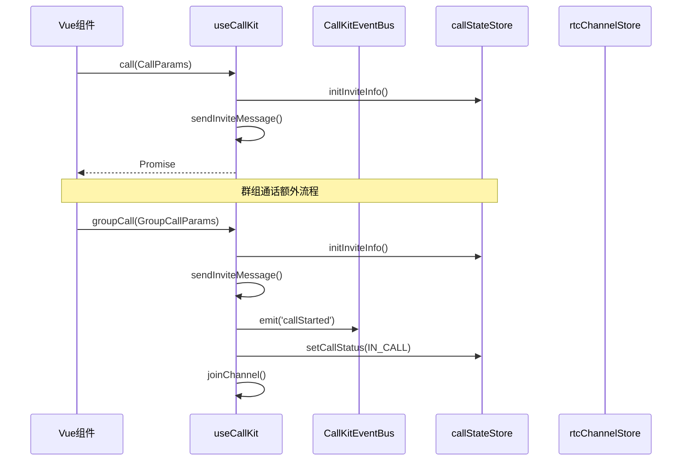
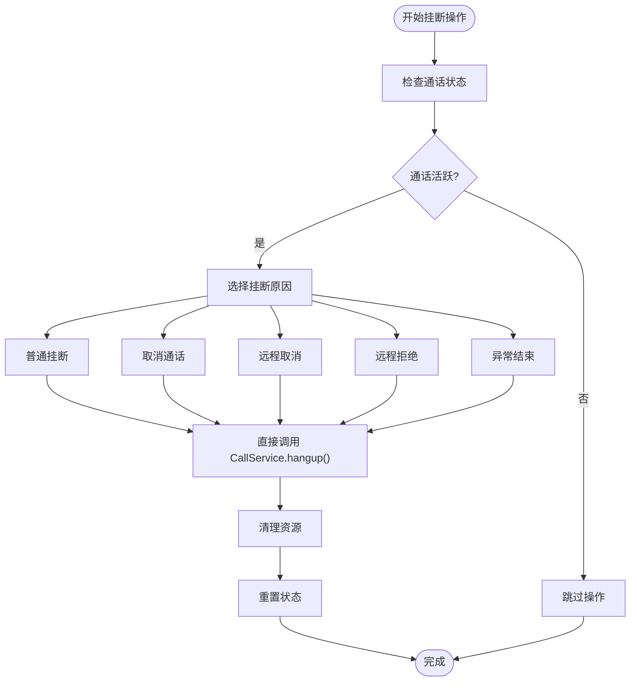
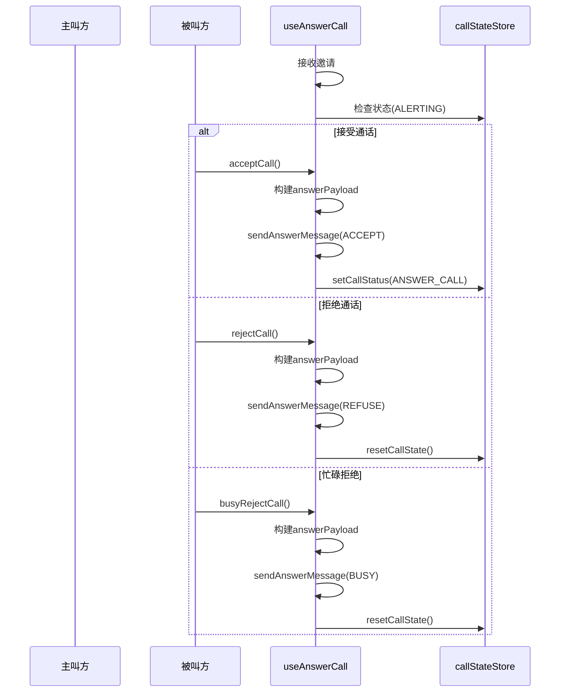
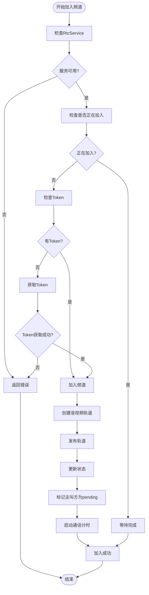
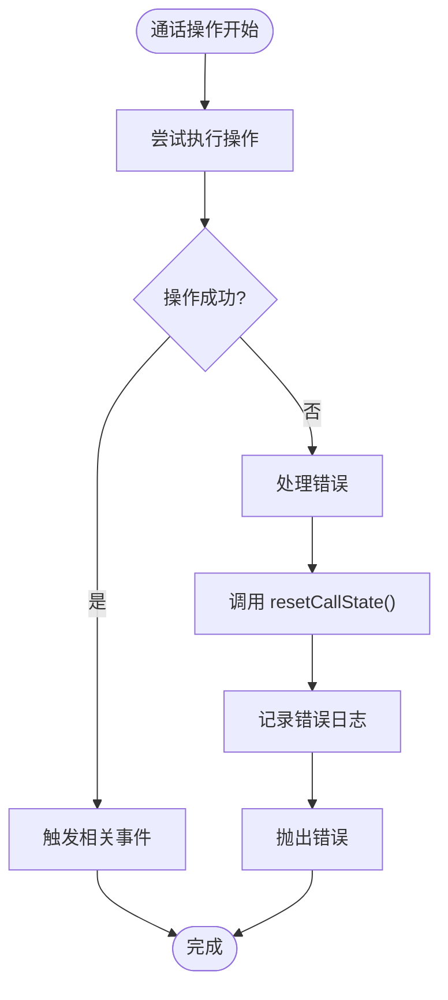
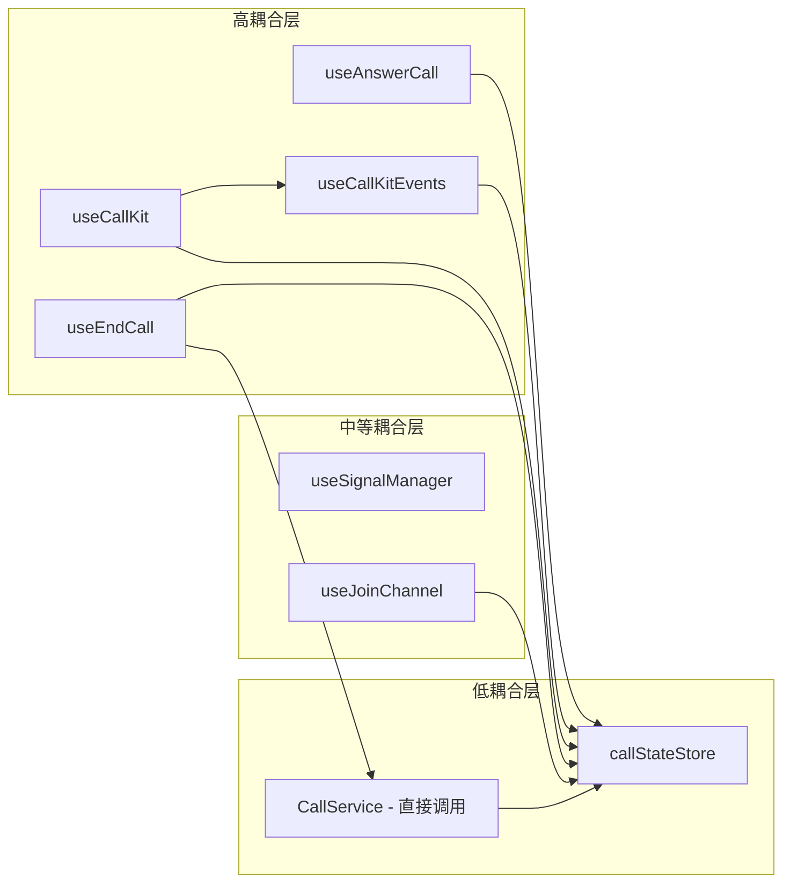
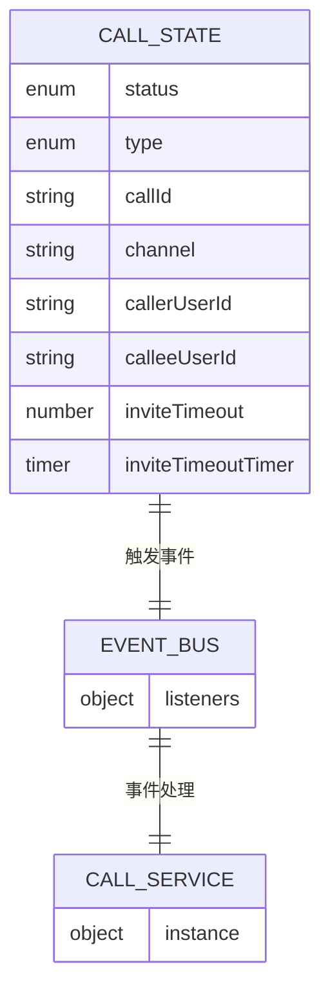

# 通话控制 API

<cite>
**本文档引用的文件**
- [lib/composables/useCallKit.ts](file://lib/composables/useCallKit.ts)
- [lib/composables/useEndCall.ts](file://lib/composables/useEndCall.ts)
- [lib/composables/useAnswerCall.ts](file://lib/composables/useAnswerCall.ts)
- [lib/composables/useJoinChannel.ts](file://lib/composables/useJoinChannel.ts)
- [lib/composables/useCallKitEvents.ts](file://lib/composables/useCallKitEvents.ts)
- [lib/core/events/CallKitEventBus.ts](file://lib/core/events/CallKitEventBus.ts)
- [lib/core/events/types.ts](file://lib/core/events/types.ts)
- [lib/services/CallService.ts](file://lib/services/CallService.ts)
- [lib/store/callState.ts](file://lib/store/callState.ts)
- [lib/types.ts](file://lib/types.ts)
- [test/src/App.vue](file://test/src/App.vue)
</cite>

## 更新摘要
**变更内容**
- useCallKit.ts 重大增强：统一了单人和群组通话 API，新增完整的事件发射机制
- **重大更新**：useCallKit API 从位置参数改为结构化对象参数，新增 CallParams 和 GroupCallParams 类型支持
- 新增 useCallKitEvents 组合式 API，提供完整的事件订阅能力
- 改进错误处理和状态管理，增强 UI 卡住问题的兜底机制
- CallKitEventBus 提供类型安全的发布/订阅机制
- 完善群组通话的会话管理和参与者状态跟踪

## 目录
1. [简介](#简介)
2. [项目结构](#项目结构)
3. [核心组件](#核心组件)
4. [架构概览](#架构概览)
5. [详细组件分析](#详细组件分析)
6. [事件系统](#事件系统)
7. [错误处理改进](#错误处理改进)
8. [依赖关系分析](#依赖关系分析)
9. [性能考虑](#性能考虑)
10. [故障排除指南](#故障排除指南)
11. [结论](#结论)

## 简介

本文档详细介绍 Easemob Vue3 通话控制相关的组合式 API，重点涵盖 `useCallKit`、`useEndCall`、`useAnswerCall`、`useJoinChannel` 和新增的 `useCallKitEvents` 等核心函数。这些 API 提供了完整的通话生命周期管理能力，包括发起单人和群组通话、接听来电、结束通话等操作。

**重大更新**：本次更新反映了 useCallKit.ts 的重大增强，统一了单人和群组通话 API，新增了完整的事件发射机制，改进了错误处理和状态管理。**新增的关键变更**：useCallKit API 从位置参数改为结构化对象参数，新增 CallParams 和 GroupCallParams 类型支持，提供更好的类型安全和开发体验。

## 项目结构

项目采用模块化设计，主要分为以下几个核心模块：

```mermaid
graph TB
subgraph "组合式 API 层"
CK[useCallKit - 统一通话控制]
EC[useEndCall - 通话结束控制]
AC[useAnswerCall - 通话应答控制]
JC[useJoinChannel - RTC频道加入]
CE[useCallKitEvents - 事件订阅]
end
subgraph "事件系统"
EB[CallKitEventBus - 事件总线]
ET[事件类型定义]
end
subgraph "服务层"
CS[CallService - 通话服务]
end
subgraph "状态管理层"
CSS[callStateStore - 通话状态]
end
subgraph "类型定义层"
UT[UseCallKitReturn - API类型]
CT[CallKitEventType - 事件类型]
CP[CallParams - 单人通话参数]
GCP[GroupCallParams - 群组通话参数]
```

**图表来源**
- [lib/composables/useCallKit.ts:1-246](file://lib/composables/useCallKit.ts#L1-L246)
- [lib/composables/useCallKitEvents.ts:1-142](file://lib/composables/useCallKitEvents.ts#L1-L142)
- [lib/core/events/CallKitEventBus.ts:1-112](file://lib/core/events/CallKitEventBus.ts#L1-L112)
- [lib/types.ts:65-80](file://lib/types.ts#L65-L80)

**章节来源**
- [lib/composables/useCallKit.ts:1-246](file://lib/composables/useCallKit.ts#L1-L246)
- [lib/composables/useCallKitEvents.ts:1-142](file://lib/composables/useCallKitEvents.ts#L1-L142)
- [lib/core/events/CallKitEventBus.ts:1-112](file://lib/core/events/CallKitEventBus.ts#L1-L112)
- [lib/types.ts:65-80](file://lib/types.ts#L65-L80)

## 核心组件

### useCallKit - 统一通话控制入口

**重大更新**：useCallKit API 已从位置参数改为结构化对象参数，提供更好的类型安全和开发体验。

`useCallKit` 是通话控制的核心组合式 API，现已统一了单人和群组通话的 API 设计。

**主要功能：**
- 发起单人语音/视频通话（使用 CallParams 结构化参数）
- 发起群组语音/视频通话（使用 GroupCallParams 结构化参数）
- 管理通话状态初始化
- 处理信令发送
- 触发通话生命周期事件

**核心方法：**
- `call(params: CallParams)` - 发起单人通话
- `groupCall(params: GroupCallParams)` - 发起群组通话
- `hangup(reason)` - 挂断通话
- `cancel()` - 取消通话邀请
- `accept()` - 接听通话
- `reject()` - 拒绝通话
- `rejectBusy()` - 忙碌拒绝通话

**CallParams 结构：**
```typescript
interface CallParams {
  targetId: string;           // 目标用户ID
  type: "audio" | "video";    // 通话类型
  msg?: string;              // 自定义消息内容
  userInfo?: {               // 用户信息（可选）
    nickname?: string;
    avatarURL?: string;
  };
}
```

**GroupCallParams 结构：**
```typescript
interface GroupCallParams {
  groupId: string;           // 群组ID
  members: string[];         // 成员ID数组
  type: "audio" | "video";   // 通话类型
  msg?: string;             // 自定义消息内容
  groupName?: string;       // 群组名称（可选）
  groupAvatar?: string;     // 群组头像URL（可选）
  userInfo?: {              // 用户信息（可选）
    nickname?: string;
    avatarURL?: string;
  };
}
```

**重大更新**：新增完整的事件发射机制，群组通话发起时会触发 `callStarted` 事件，包含主叫方标识和群组信息。

**章节来源**
- [lib/composables/useCallKit.ts:22-149](file://lib/composables/useCallKit.ts#L22-L149)
- [lib/types.ts:65-80](file://lib/types.ts#L65-L80)

### useEndCall - 通话结束控制

`useEndCall` 提供多种通话结束场景的便捷方法。

**支持的操作：**
- 普通挂断 (`hangupCall`)
- 取消通话邀请 (`cancelCall`)
- 远程取消处理 (`handleRemoteCancel`)
- 远程拒绝处理 (`handleRemoteRefuse`)
- 异常结束处理 (`handleAbnormalEnd`)

**状态检查：**
- `canHangup()` - 检查是否可以挂断
- `canCancel()` - 检查是否可以取消

**章节来源**
- [lib/composables/useEndCall.ts:1-131](file://lib/composables/useEndCall.ts#L1-L131)

### useAnswerCall - 通话应答控制

`useAnswerCall` 专门处理被叫方的通话应答操作。

**核心功能：**
- 接受通话 (`acceptCall`)
- 拒绝通话 (`rejectCall`)
- 忙碌拒绝通话 (`busyRejectCall`)

**错误处理改进**：新增兜底状态重置机制，当信令发送失败时自动重置通话状态，避免 UI 卡住

**章节来源**
- [lib/composables/useAnswerCall.ts:1-169](file://lib/composables/useAnswerCall.ts#L1-L169)

### useJoinChannel - RTC频道加入控制

`useJoinChannel` 提供 RTC 频道加入的统一接口。

**核心功能：**
- 加入 RTC 频道
- 管理音视频轨道创建和发布
- 处理单聊和群聊的加入逻辑

**关键修复**：新增被叫方场景下的主叫方用户 ID 管理，确保 user-joined 事件能正确映射 UID 到用户 ID

**章节来源**
- [lib/composables/useJoinChannel.ts:27-209](file://lib/composables/useJoinChannel.ts#L27-L209)

### useCallKitEvents - 事件订阅控制

**新增功能**：提供类型安全的通话事件订阅能力。

**核心功能：**
- 通用事件订阅 (`on`)
- 一次性事件订阅 (`once`)
- 取消事件订阅 (`off`)
- 语义化便捷方法：`onStatusChanged`、`onIncomingCall`、`onCallStarted`、`onCallEnded`、`onCallCanceled`、`onCallRefused`、`onCallTimeout`、`onCallBusy`、`onParticipantJoined`、`onParticipantLeft`

**章节来源**
- [lib/composables/useCallKitEvents.ts:36-142](file://lib/composables/useCallKitEvents.ts#L36-L142)

## 架构概览

系统采用分层架构设计，各层职责清晰分离，支持统一的通话控制和事件管理：

```mermaid
graph TB
subgraph "应用层"
VC[Vue组件]
end
subgraph "组合式 API 层"
UCK[useCallKit]
UEK[useEndCall]
UAC[useAnswerCall]
UJC[useJoinChannel]
UCE[useCallKitEvents]
end
subgraph "事件系统层"
CEB[CallKitEventBus]
CET[事件类型定义]
end
subgraph "服务层"
CSVC[CallService]
end
subgraph "状态管理层"
CSS[CallStateStore]
end
subgraph "外部集成"
AG[Agora RTC SDK]
IM[Easemob IM SDK]
```

VC --> UCK
VC --> UCE
UCK --> CSS
UCK --> CEB
UEK --> CSVC
UAC --> CSS
UJC --> CSS
UCE --> CEB
CEB --> CET
CSVC --> CSS
```

**图表来源**
- [lib/composables/useCallKit.ts:15-246](file://lib/composables/useCallKit.ts#L15-L246)
- [lib/composables/useCallKitEvents.ts:36-142](file://lib/composables/useCallKitEvents.ts#L36-L142)
- [lib/core/events/CallKitEventBus.ts:14-112](file://lib/core/events/CallKitEventBus.ts#L14-L112)

## 详细组件分析

### useCallKit 组件分析

#### 功能架构图



**图表来源**
- [lib/composables/useCallKit.ts:22-149](file://lib/composables/useCallKit.ts#L22-L149)

#### 核心实现要点

1. **统一 API 设计**：单人和群组通话使用相同的调用模式
2. **结构化参数**：使用 CallParams 和 GroupCallParams 提供更好的类型安全
3. **事件发射机制**：群组通话发起时触发 `callStarted` 事件，包含主叫方标识
4. **状态管理**：通过 `callStateStore` 统一管理通话状态
5. **错误处理**：完善的 try-catch 机制和日志记录

**重大更新**：新增群组通话的完整事件发射机制，包括会话初始化和参与者管理

**章节来源**
- [lib/composables/useCallKit.ts:22-149](file://lib/composables/useCallKit.ts#L22-L149)

### useEndCall 组件分析

#### 错误处理流程图



**图表来源**
- [lib/composables/useEndCall.ts:18-131](file://lib/composables/useEndCall.ts#L18-L131)

#### 状态检查机制

组件提供了智能的状态检查功能：

- `canHangup()`：检查当前是否为活跃通话状态
- `canCancel()`：检查当前是否为邀请中状态

**章节来源**
- [lib/composables/useEndCall.ts:104-115](file://lib/composables/useEndCall.ts#L104-L115)

### useAnswerCall 组件分析

#### 通话应答序列图



**图表来源**
- [lib/composables/useAnswerCall.ts:27-169](file://lib/composables/useAnswerCall.ts#L27-L169)

#### 错误处理改进

**更新**：新增兜底状态重置机制，当信令发送失败时自动调用 `resetCallState()`，避免 UI 卡住

组件通过 `useSignalManager` 统一管理所有通话信令：

- `sendAnswerMessage()`：发送通话应答信令
- 支持三种结果类型：接受、拒绝、忙碌
- 自动处理 payload 构建和发送

**章节来源**
- [lib/composables/useAnswerCall.ts:67-73](file://lib/composables/useAnswerCall.ts#L67-L73)

### useJoinChannel 组件分析

#### RTC 频道加入流程



**图表来源**
- [lib/composables/useJoinChannel.ts:79-209](file://lib/composables/useJoinChannel.ts#L79-L209)

#### 关键修复

**更新**：新增被叫方场景下的用户 ID 管理

组件实现了关键修复，确保被叫方场景下的正确行为：

- 检测到主叫方用户 ID 且与当前用户不同
- 将主叫方加入 pending 用户列表
- 确保 `user-joined` 事件能正确将 UID 映射到 `callerUserId`

**章节来源**
- [lib/composables/useJoinChannel.ts:185-190](file://lib/composables/useJoinChannel.ts#L185-L190)

## 事件系统

### CallKitEventBus - 事件总线

**新增功能**：提供类型安全的发布/订阅机制，供 CallKit 内部模块和用户代码统一监听通话生命周期事件。

**核心功能：**
- 订阅事件 (`on`)
- 一次性订阅 (`once`)
- 取消订阅 (`off`)
- 触发事件 (`emit`)
- 清空事件 (`clear`)
- 获取订阅者数量 (`listenerCount`)

**设计特点：**
- 不依赖外部库，内部使用 Map + Set 实现
- 类型安全的事件处理
- 错误隔离：单个 handler 异常不影响其他 handler

**章节来源**
- [lib/core/events/CallKitEventBus.ts:14-112](file://lib/core/events/CallKitEventBus.ts#L14-L112)

### 事件类型定义

**新增功能**：完整的事件类型定义和 payload 结构。

**支持的事件类型：**
- `statusChanged` - 通话状态变化
- `incomingCall` - 收到来电邀请
- `callStarted` - 通话开始（双方/多方接通）
- `callEnded` - 通话结束
- `callCanceled` - 通话被取消
- `callRefused` - 通话被拒绝
- `callTimeout` - 通话邀请超时
- `callBusy` - 对方忙线
- `participantJoined` - 群通话成员加入
- `participantLeft` - 群通话成员离开

**章节来源**
- [lib/core/events/types.ts:6-136](file://lib/core/events/types.ts#L6-L136)

### useCallKitEvents - 事件订阅 API

**新增功能**：优雅的 CallKit 事件订阅 Composable。

**核心功能：**
- 通用事件订阅 (`on`)
- 一次性事件订阅 (`once`)
- 取消事件订阅 (`off`)
- 语义化便捷方法：`onStatusChanged`、`onIncomingCall`、`onCallStarted`、`onCallEnded`、`onCallCanceled`、`onCallRefused`、`onCallTimeout`、`onCallBusy`、`onParticipantJoined`、`onParticipantLeft`

**使用示例：**
```typescript
const { onCallStarted, onCallEnded, onIncomingCall } = useCallKitEvents()

onCallStarted((e) => {
  console.log('通话开始', e.callId, e.channel)
})

onCallEnded((e) => {
  console.log('通话结束', e.reason, '时长:', e.duration, 'ms')
})

onIncomingCall((e) => {
  console.log('收到来电', e.callerUserId)
})
```

**章节来源**
- [lib/composables/useCallKitEvents.ts:8-142](file://lib/composables/useCallKitEvents.ts#L8-L142)

## 错误处理改进

### 信令发送失败的自动重置机制

**更新**：最新版本增强了错误处理能力，确保在信令发送失败时能够自动重置通话状态，避免 UI 卡住的问题。

#### 关键改进点

1. **useAnswerCall 组件的兜底重置**
   - 在 `acceptCall()`、`rejectCall()`、`busyRejectCall()` 方法中添加了 `resetCallState()` 调用
   - 即使信令发送失败，也会重置通话状态，确保 UI 正常恢复

2. **useCallKit 组件的事件发射**
   - 群组通话发起时触发 `callStarted` 事件，包含完整的通话信息
   - 提供主叫方标识和群组信息，便于事件处理

3. **CallKitEventBus 的错误隔离**
   - 事件处理中的错误被吞掉，避免一个 handler 异常影响其他 handler
   - 提供详细的错误日志记录

4. **状态重置的双重保障**
   - `resetCallState()` 方法中调用了多次重置确保状态完全重置
   - 防止状态残留导致的 UI 问题

#### 错误处理流程图



**章节来源**
- [lib/composables/useAnswerCall.ts:67-73](file://lib/composables/useAnswerCall.ts#L67-L73)
- [lib/composables/useCallKit.ts:86-94](file://lib/composables/useCallKit.ts#L86-L94)
- [lib/core/events/CallKitEventBus.ts:77-83](file://lib/core/events/CallKitEventBus.ts#L77-L83)

### UI 卡住问题的解决方案

**更新**：通过自动状态重置机制，有效解决了信令发送失败时 UI 卡住的问题。

#### 解决方案要点

1. **兜底状态重置**
   - 在所有关键操作中添加了 `resetCallState()` 调用
   - 确保即使出现异常也能恢复到 IDLE 状态

2. **事件驱动的状态同步**
   - 通过 CallKitEventBus 实现状态变化的事件通知
   - 提供统一的事件订阅接口

3. **错误日志记录**
   - 所有错误都会被记录到日志中
   - 方便开发者进行问题诊断和调试

4. **被叫方场景修复**
   - `useJoinChannel` 中的用户 ID 管理修复
   - 确保正确的 UID 映射和状态同步

**章节来源**
- [lib/composables/useAnswerCall.ts:67-73](file://lib/composables/useAnswerCall.ts#L67-L73)
- [lib/composables/useJoinChannel.ts:185-190](file://lib/composables/useJoinChannel.ts#L185-L190)

## 依赖关系分析

### 组件耦合度分析



**图表来源**
- [lib/composables/useCallKit.ts:15-246](file://lib/composables/useCallKit.ts#L15-L246)
- [lib/composables/useEndCall.ts:1-131](file://lib/composables/useEndCall.ts#L1-L131)
- [lib/composables/useAnswerCall.ts:1-169](file://lib/composables/useAnswerCall.ts#L1-L169)
- [lib/composables/useCallKitEvents.ts:1-142](file://lib/composables/useCallKitEvents.ts#L1-L142)

### 状态管理关系

系统采用集中式状态管理模式：



**图表来源**
- [lib/store/callState.ts:13-31](file://lib/store/callState.ts#L13-L31)
- [lib/core/events/CallKitEventBus.ts:14-18](file://lib/core/events/CallKitEventBus.ts#L14-L18)

**章节来源**
- [lib/store/callState.ts:9-177](file://lib/store/callState.ts#L9-L177)
- [lib/core/events/CallKitEventBus.ts:14-112](file://lib/core/events/CallKitEventBus.ts#L14-L112)

## 性能考虑

### 异步操作优化

1. **防抖处理**：所有通话操作都实现了防重复调用机制
2. **资源清理**：自动清理媒体资源和 RTC 连接
3. **状态同步**：实时同步通话状态到各个存储层

### 内存管理

- 使用 WeakMap 和 Map 优化内存使用
- 及时清理定时器和事件监听器
- 避免循环引用和内存泄漏

### 网络优化

- 智能重连机制
- 错误重试策略
- 超时控制和异常处理

### 事件系统性能优化

**更新**：新增的事件系统具有以下性能特点：

- CallKitEventBus 使用 Map + Set 实现，提供 O(1) 订阅和取消订阅
- 事件处理中的错误隔离，避免单个 handler 影响整体性能
- 类型安全的事件处理，减少运行时类型检查开销

## 故障排除指南

### 常见问题及解决方案

#### 1. ChatClient 未初始化

**症状**：调用 API 时出现 "ChatClient未初始化" 错误

**解决方案**：
- 确保在 Provider 包裹下使用 API
- 检查登录状态
- 验证 SDK 初始化顺序

#### 2. 通话状态异常

**症状**：通话结束后状态未重置，UI 卡住

**解决方案**：
- 检查 `resetCallState()` 调用
- 验证状态流转逻辑
- 查看日志输出定位问题

**更新**：新版本已增强错误处理，即使出现异常也会自动重置状态

#### 3. RTC 连接失败

**症状**：加入频道失败或音视频轨道创建失败

**解决方案**：
- 检查 Token 获取
- 验证网络连接
- 确认权限设置

#### 4. 信令发送失败

**症状**：通话邀请或应答信令发送失败，UI 无响应

**解决方案**：
- 检查网络连接状态
- 验证目标用户是否在线
- 查看错误日志获取详细信息

**更新**：新版本已实现自动状态重置，避免 UI 卡住问题

#### 5. 事件订阅无效

**症状**：使用 `useCallKitEvents` 订阅事件无效

**解决方案**：
- 确保在组件挂载时订阅事件
- 检查事件类型是否正确
- 验证解绑函数的调用时机

**更新**：新增的事件系统提供了更好的错误处理和调试支持

#### 6. 被叫方 UID 映射问题

**症状**：被叫方场景下 user-joined 事件无法正确映射 UID

**解决方案**：
- 检查 pending 用户列表设置
- 验证主叫方用户 ID 检测逻辑
- 确认 `addPendingUserId()` 调用时机

**更新**：新版本已实现关键修复，确保正确的用户 ID 管理

#### 7. 事件总线性能问题

**症状**：大量事件订阅导致性能下降

**解决方案**：
- 及时调用解绑函数释放事件订阅
- 使用 `once` 方法进行一次性订阅
- 避免在组件卸载后继续订阅事件

**更新**：CallKitEventBus 提供了 `listenerCount` 方法用于监控订阅数量

#### 8. 参数类型错误

**症状**：使用 useCallKit 时出现类型错误

**解决方案**：
- 确保使用 CallParams 或 GroupCallParams 结构化参数
- 检查必需字段是否完整
- 验证类型定义是否正确

**更新**：新增的结构化参数提供了更好的类型安全

**章节来源**
- [lib/composables/useCallKit.ts:22-149](file://lib/composables/useCallKit.ts#L22-L149)
- [lib/composables/useAnswerCall.ts:67-73](file://lib/composables/useAnswerCall.ts#L67-L73)
- [lib/composables/useJoinChannel.ts:185-190](file://lib/composables/useJoinChannel.ts#L185-L190)
- [lib/composables/useCallKitEvents.ts:30-35](file://lib/composables/useCallKitEvents.ts#L30-L35)
- [lib/core/events/CallKitEventBus.ts:102-104](file://lib/core/events/CallKitEventBus.ts#L102-L104)
- [lib/types.ts:65-80](file://lib/types.ts#L65-L80)

## 结论

Easemob Vue3 通话控制 API 提供了完整而灵活的通话管理解决方案。通过组合式 API 设计，开发者可以轻松集成语音和视频通话功能，同时享受类型安全和良好的开发体验。

**重大更新总结**：
1. **useCallKit.ts 重大增强**：统一了单人和群组通话 API，新增完整的事件发射机制
2. **结构化参数支持**：useCallKit API 从位置参数改为结构化对象参数，新增 CallParams 和 GroupCallParams 类型支持
3. **新增事件系统**：useCallKitEvents 提供类型安全的事件订阅能力
4. **改进错误处理**：新增兜底状态重置机制，有效避免 UI 卡住问题
5. **CallKitEventBus**：提供轻量级的类型安全事件总线系统

### 主要优势

1. **统一 API 设计**：单人和群组通话使用相同的调用模式
2. **完整的事件系统**：支持通话生命周期的完整事件跟踪
3. **类型安全保障**：完整的 TypeScript 类型定义，特别是新增的 CallParams 和 GroupCallParams
4. **易于使用**：简洁的 API 接口和丰富的示例
5. **可扩展性**：支持自定义配置和扩展点
6. **稳定性**：完善的错误处理和状态管理
7. **现代化架构**：新增的事件系统和结构化参数提供了更好的可维护性

### 最佳实践建议

1. **状态管理**：合理使用 Pinia 状态管理
2. **错误处理**：实现完善的错误捕获和处理机制
3. **资源清理**：确保及时清理媒体资源和连接
4. **事件订阅**：使用解绑函数及时清理事件订阅
5. **性能优化**：利用防抖和节流技术优化用户体验
6. **测试覆盖**：编写充分的单元测试和集成测试
7. **事件调试**：利用新增的事件系统进行问题诊断
8. **类型安全**：充分利用新增的 CallParams 和 GroupCallParams 类型定义

### 架构演进

**更新**：本次更新标志着通话控制 API 的重要演进：

1. **从分散到统一**：useCallKit 统一了单人和群组通话的 API 设计
2. **从位置参数到结构化参数**：提供更好的类型安全和开发体验
3. **从静态到动态**：新增的事件系统提供了动态的事件处理能力
4. **从简单到复杂**：支持更复杂的群组通话场景和事件处理
5. **从功能到架构**：新增的事件总线系统和类型定义为未来的功能扩展奠定了基础

该 API 为构建高质量的实时通信应用提供了坚实的基础，新增的事件系统、结构化参数和错误处理机制进一步提升了系统的稳定性和用户体验。开发者可以根据具体需求进行定制和扩展，充分利用新增的功能特性。

**使用示例**：

```typescript
// 单人通话
const { call } = useCallKit()
const singleCallParams: CallParams = {
  targetId: 'user123',
  type: 'video',
  msg: '你好，要视频通话吗？',
  userInfo: {
    nickname: '张三',
    avatarURL: 'https://example.com/avatar.jpg'
  }
}
await call(singleCallParams)

// 群组通话
const groupCallParams: GroupCallParams = {
  groupId: 'group123',
  members: ['user1', 'user2', 'user3'],
  type: 'audio',
  msg: '大家好，开始语音会议',
  groupName: '开发团队',
  groupAvatar: 'https://example.com/group-avatar.jpg'
}
await groupCall(groupCallParams)
```