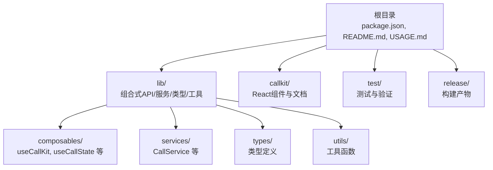
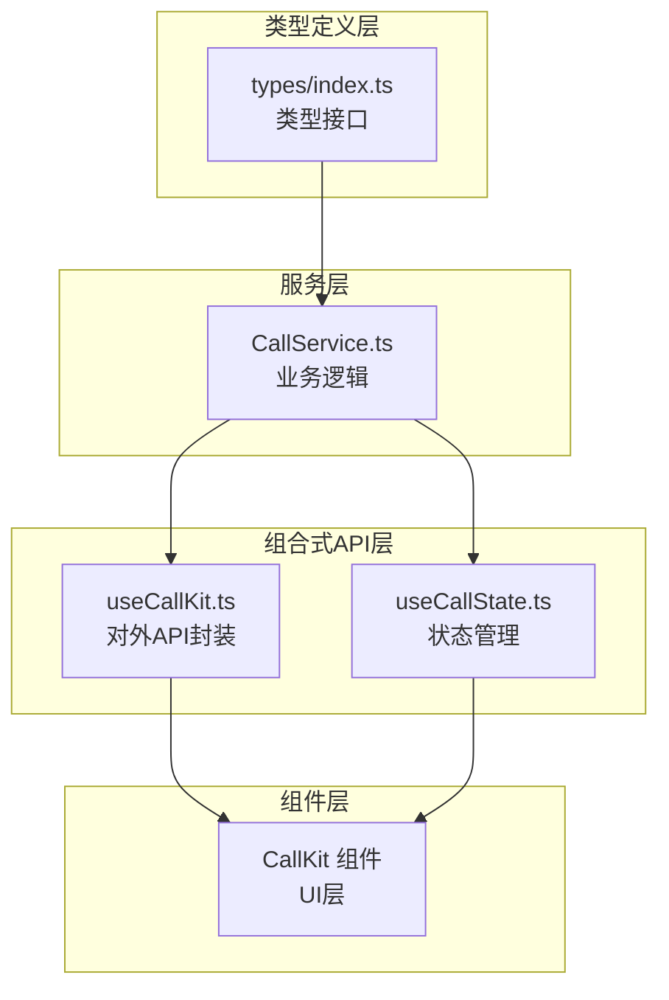
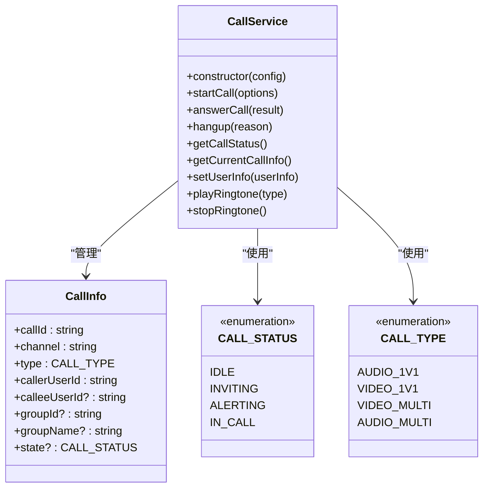
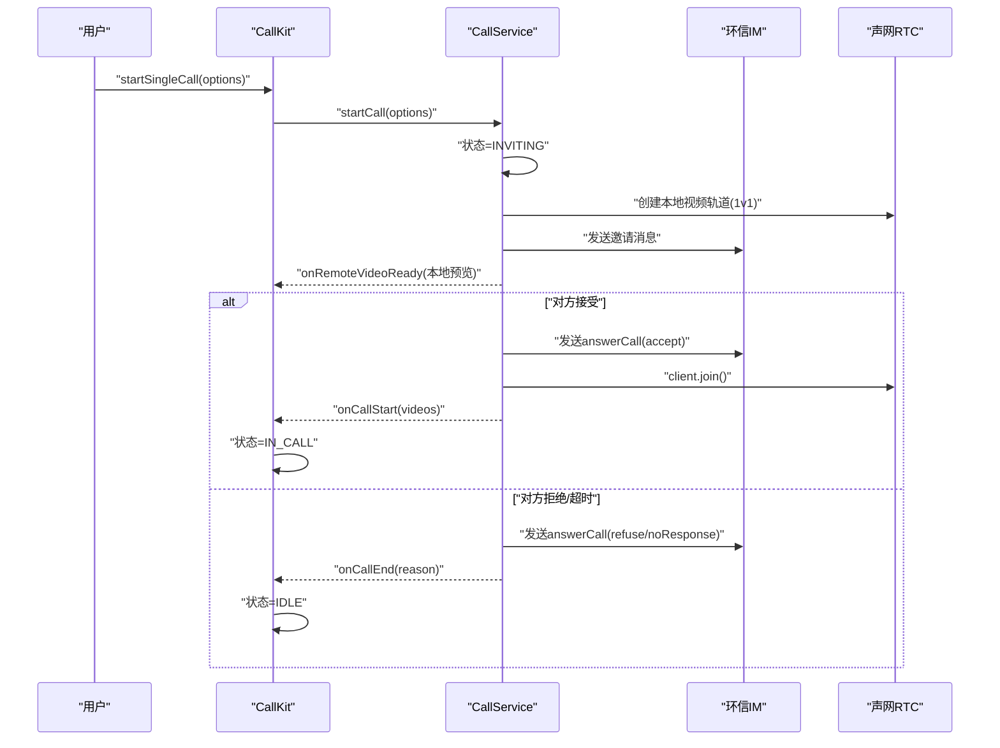
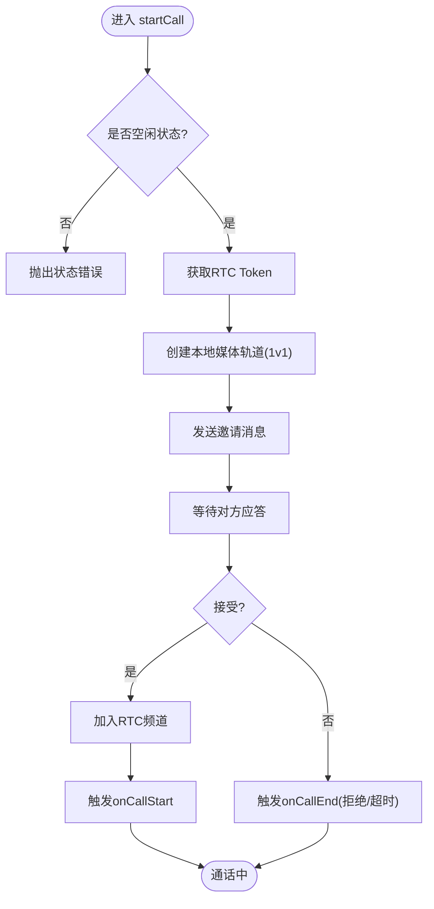
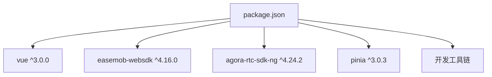

# 迁移指南

<cite>
**本文档引用的文件**
- [package.json](file://package.json)
- [README.md](file://README.md)
- [USAGE.md](file://USAGE.md)
- [ARCHITECTURE.md](file://lib/ARCHITECTURE.md)
- [SIGNALING_IMPLEMENTATION.md](file://lib/SIGNALING_IMPLEMENTATION.md)
- [CallService.ts](file://callkit/services/CallService.ts)
- [index.ts](file://callkit/types/index.ts)
- [callUtils.ts](file://callkit/utils/callUtils.ts)
- [CallKit架构文档.md](file://callkit/docs/CallKit架构文档.md)
- [api_overview.md](file://callkit/docs/api_overview.md)
</cite>

## 目录
1. [简介](#简介)
2. [项目结构](#项目结构)
3. [核心组件](#核心组件)
4. [架构总览](#架构总览)
5. [详细组件分析](#详细组件分析)
6. [依赖分析](#依赖分析)
7. [性能考虑](#性能考虑)
8. [故障排查指南](#故障排查指南)
9. [结论](#结论)
10. [附录](#附录)

## 简介
本指南旨在帮助用户从旧版本平滑迁移到当前版本（1.0.0），涵盖破坏性变更、新增功能、废弃特性、自动化迁移工具使用方法、兼容性问题处理与依赖更新策略，并提供与其他类似库的迁移对比与最佳实践。

## 项目结构
当前项目采用模块化分层架构，核心目录与职责如下：
- lib/：库源码（Vue3组合式API、服务层、类型定义、工具函数）
- callkit/：React版本组件（保留用于参考与对比）
- test/：测试与验证环境（源码模式与tgz包模式）
- release/：构建产物目录
- 根目录：构建脚本、依赖与发布流程

**图表来源**
- [README.md](file://README.md#L5-L31)
- [ARCHITECTURE.md](file://lib/ARCHITECTURE.md#L1-L20)

**章节来源**
- [README.md](file://README.md#L5-L31)
- [package.json](file://package.json#L1-L53)

## 核心组件
- 组合式API层：提供响应式状态管理与业务封装（如 useCallKit、useCallState）
- 服务层：封装业务逻辑（如 CallService）
- 类型定义层：统一的类型接口（如 VideoWindowProps、LayoutMode）
- 工具函数：通用工具（如 generateRandomChannel、formatCallDuration）

**章节来源**
- [ARCHITECTURE.md](file://lib/ARCHITECTURE.md#L40-L78)
- [index.ts](file://callkit/types/index.ts#L1-L356)

## 架构总览
整体架构采用“类型定义 + 服务层 + 组合式API + 组件层”的分层设计，职责清晰、可扩展性强。服务层与组合式API之间通过明确的接口解耦，便于单元测试与维护。

**图表来源**
- [ARCHITECTURE.md](file://lib/ARCHITECTURE.md#L67-L83)
- [CallService.ts](file://callkit/services/CallService.ts#L116-L285)
- [index.ts](file://callkit/types/index.ts#L125-L176)

**章节来源**
- [ARCHITECTURE.md](file://lib/ARCHITECTURE.md#L1-L190)

## 详细组件分析

### CallService 组件分析
CallService 是通话流程的核心，负责状态管理、信令交互、媒体轨道创建与销毁、错误处理与铃声播放等。

**图表来源**
- [CallService.ts](file://callkit/services/CallService.ts#L14-L66)
- [CallService.ts](file://callkit/services/CallService.ts#L116-L285)

**章节来源**
- [CallService.ts](file://callkit/services/CallService.ts#L116-L527)

### API/服务组件调用序列
发起一对一通话的典型流程如下：

**图表来源**
- [CallKit架构文档.md](file://callkit/docs/CallKit架构文档.md#L148-L178)
- [CallService.ts](file://callkit/services/CallService.ts#L345-L527)

**章节来源**
- [CallKit架构文档.md](file://callkit/docs/CallKit架构文档.md#L148-L208)

### 复杂逻辑组件：通话状态机
通话状态机覆盖从发起邀请到通话结束的关键节点，包含超时、拒绝、异常等分支处理。

**图表来源**
- [CallService.ts](file://callkit/services/CallService.ts#L345-L527)

**章节来源**
- [CallService.ts](file://callkit/services/CallService.ts#L345-L527)

## 依赖分析
- 运行时依赖
  - vue: ^3.0.0（peerDependency）
  - easemob-websdk: ^4.16.0（环信IM SDK）
  - agora-rtc-sdk-ng: ^4.24.2（声网RTC SDK）
  - pinia: ^3.0.3（状态管理）
- 开发依赖
  - vite、typescript、vue-tsc 等（构建与类型检查）

**图表来源**
- [package.json](file://package.json#L33-L51)

**章节来源**
- [package.json](file://package.json#L33-L51)

## 性能考虑
- 媒体轨道复用与清理：避免重复创建本地/远程轨道，及时停止与释放资源
- 铃声播放节流：防止重复播放与竞态条件
- 状态更新去抖：对频繁状态变化进行合并更新
- 日志级别控制：生产环境建议降低日志级别以减少开销

[本节为通用指导，无需特定文件分析]

## 故障排查指南
- 通话状态异常
  - 检查 CallService 的状态流转与错误回调
  - 关注 onCallError 与 onCallEnd 的触发时机
- 邀请消息发送失败
  - 核对 easemob-websdk 的连接状态与权限
  - 检查 sendInvitationMessage 的返回与异常
- 媒体会话建立失败
  - 确认 RTC Token 获取与 AgoraRTC 客户端初始化
  - 检查网络质量回调与轨道创建结果
- 铃声播放问题
  - 检查 enableRingtone、ringtoneVolume、ringtoneLoop 配置
  - 确保音频元素初始化顺序与资源路径

**章节来源**
- [CallService.ts](file://callkit/services/CallService.ts#L292-L308)
- [CallService.ts](file://callkit/services/CallService.ts#L529-L684)
- [CallService.ts](file://callkit/services/CallService.ts#L198-L207)

## 结论
当前版本在架构上实现了清晰的分层与类型安全，提供了完整的通话生命周期管理与丰富的配置选项。迁移时重点关注状态机与回调接口的变更、媒体轨道的创建与清理、以及铃声与错误处理的配置。建议优先使用 tgz 模式进行发布前验证，确保构建产物与实际使用一致。

[本节为总结，无需特定文件分析]

## 附录

### 版本间破坏性变更与迁移要点
- 通话状态枚举与状态机
  - 新增/调整状态枚举（如 INVITING、ALERTING、CONFIRM_CALLEE 等）
  - 迁移时需同步更新 UI 与业务逻辑对状态的处理
- 组合式API变更
  - useCallKit 与 useCallState 的返回值与方法签名
  - 迁移时替换旧API调用点，确保响应式状态更新正确
- 铃声配置
  - enableRingtone、ringtoneVolume、ringtoneLoop 等配置项
  - 迁移时统一配置并确保资源路径可用
- 错误处理
  - CallError 类型细分（rtc、chat、callkit）
  - 迁移时增加对不同类型错误的差异化处理

**章节来源**
- [CallService.ts](file://callkit/services/CallService.ts#L14-L66)
- [CallService.ts](file://callkit/services/CallService.ts#L198-L207)
- [index.ts](file://callkit/types/index.ts#L125-L176)

### 新增功能与废弃特性
- 新增功能
  - 多人通话背景图片配置（backgroundImage）
  - 动态调整 CallKit 尺寸（adjustSize）
  - 自定义图标映射（customIcons）
- 废弃特性
  - 旧版 setUserIdMap、setAccessToken 等方法已被移除
  - 旧版布局模式与属性需替换为新版枚举与配置

**章节来源**
- [index.ts](file://callkit/types/index.ts#L190-L294)

### 自动化迁移工具与注意事项
- 模式切换与验证
  - 源码模式：直接引用 lib/ 源码，适合开发调试
  - tgz 包模式：使用打包后的 .tgz 文件，模拟真实用户场景
- 使用建议
  - 开发阶段使用源码模式快速迭代
  - 发布前使用 tgz 模式进行最终验证
  - 切换模式后需重新安装依赖

**章节来源**
- [README.md](file://README.md#L47-L101)
- [README.md](file://README.md#L167-L181)

### 兼容性问题与依赖更新
- Vue 版本
  - 保持 vue ^3.0.0 的兼容性，避免使用 Vue 2 的语法与特性
- SDK 版本
  - easemob-websdk 与 agora-rtc-sdk-ng 需与当前版本兼容
  - 更新前先在测试环境中验证
- Pinia 状态管理
  - 确保使用最新 pinia 版本，避免与组合式API冲突

**章节来源**
- [package.json](file://package.json#L33-L51)

### 从其他类似库迁移的对比与策略
- 与 React 版本对比
  - Vue3 版本采用组合式API与响应式状态管理，迁移时需替换为 Vue 的响应式写法
  - 通话流程与状态机基本一致，差异主要在API风格与生命周期
- 迁移策略
  - 优先迁移核心通话流程（发起/接听/结束）
  - 逐步替换 UI 组件与样式
  - 使用 tgz 模式进行端到端验证

**章节来源**
- [CallKit架构文档.md](file://callkit/docs/CallKit架构文档.md#L107-L146)

### 面向不同升级场景的最佳实践
- 小幅功能升级
  - 保持 API 表面不变，内部优化状态管理与媒体轨道处理
  - 重点验证回调与错误处理的稳定性
- 中等范围重构
  - 替换旧版组合式API为新版 useCallKit/useCallState
  - 统一铃声与图标配置，提升用户体验
- 大规模架构迁移
  - 先在测试环境中完成端到端验证
  - 使用 tgz 模式进行发布前最终确认
  - 逐步替换旧版组件与逻辑，避免一次性改动带来的风险

**章节来源**
- [README.md](file://README.md#L167-L181)
- [USAGE.md](file://USAGE.md#L1-L162)