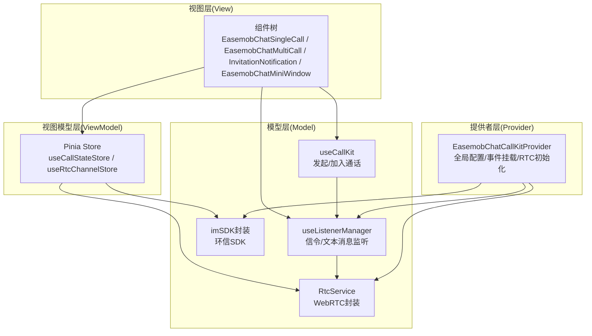
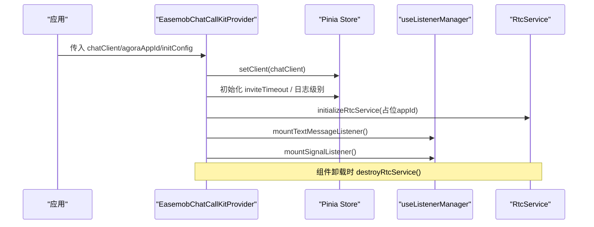
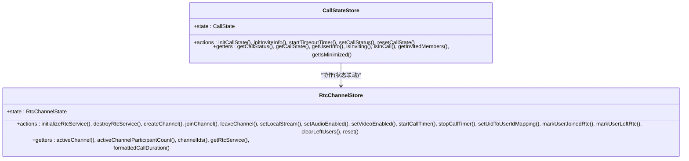
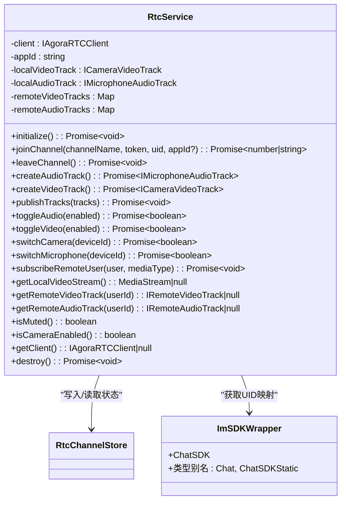
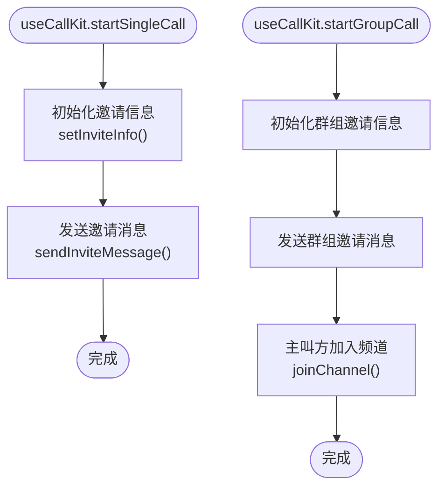
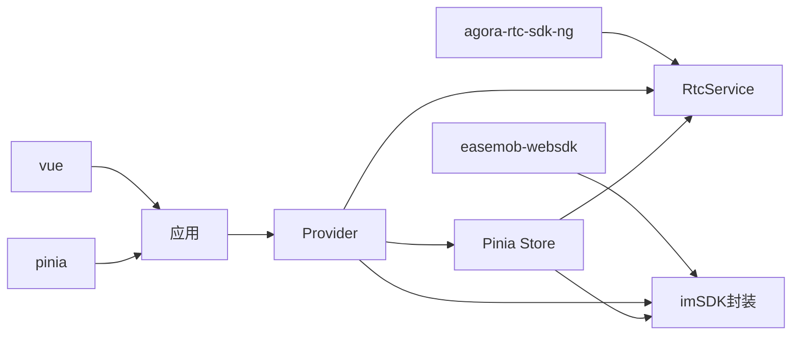

# 技术架构

<cite>
**本文档引用的文件**
- [README.md](file://README.md)
- [package.json](file://package.json)
- [lib/index.ts](file://lib/index.ts)
- [lib/components/EasemobChatCallKitProvider.vue](file://lib/components/EasemobChatCallKitProvider.vue)
- [lib/store/callState.ts](file://lib/store/callState.ts)
- [lib/store/rtcChannel.ts](file://lib/store/rtcChannel.ts)
- [lib/composables/useCallKit.ts](file://lib/composables/useCallKit.ts)
- [lib/composables/useListenerManager.ts](file://lib/composables/useListenerManager.ts)
- [lib/services/RtcService.ts](file://lib/services/RtcService.ts)
- [lib/types/callstate.types.ts](file://lib/types/callstate.types.ts)
- [lib/core/sdk/imSDK/index.ts](file://lib/core/sdk/imSDK/index.ts)
- [vite.lib.config.ts](file://vite.lib.config.ts)
- [callkit/index.ts](file://callkit/index.ts)
- [callkit/CallKit.tsx](file://callkit/CallKit.tsx)
</cite>

## 目录
1. [引言](#引言)
2. [项目结构](#项目结构)
3. [核心组件](#核心组件)
4. [架构总览](#架构总览)
5. [详细组件分析](#详细组件分析)
6. [依赖分析](#依赖分析)
7. [性能考虑](#性能考虑)
8. [故障排查指南](#故障排查指南)
9. [结论](#结论)
10. [附录](#附录)

## 引言
本项目为 Easemob Chat CallKit Vue3 插件，提供环信聊天与音视频通话能力的集成方案。本文档聚焦于整体技术架构，阐述分层架构模式（Provider-Store-Service-Component）、MVVM 设计思想在 Vue3 中的应用，以及组合式函数（Composables）的采用方式。文档同时解释技术选型原因（如 Vue3 Composition API、Pinia 状态管理、TypeScript、Agora RTC SDK、环信 Web SDK），并通过架构图与组件关系图帮助读者快速理解系统设计。

## 项目结构
项目采用“库模式”构建，核心源码位于 lib/ 目录，提供可复用的 Vue3 插件能力；同时保留 callkit/ 目录用于 React 版本的 CallKit（与 Vue3 插件并行）。测试样例位于 test/ 目录，支持源码模式与 tgz 包模式两种验证方式。

图表来源
- [lib/index.ts](file://lib/index.ts#L1-L58)
- [vite.lib.config.ts](file://vite.lib.config.ts#L1-L68)
- [package.json](file://package.json#L1-L53)

章节来源
- [README.md](file://README.md#L5-L31)
- [package.json](file://package.json#L1-L53)
- [vite.lib.config.ts](file://vite.lib.config.ts#L1-L68)

## 核心组件
- Provider 层：EasemobChatCallKitProvider.vue 负责全局配置注入、事件监听器挂载、RTC 服务初始化与销毁，确保上层组件在运行时具备一致的上下文。
- Store 层：基于 Pinia 的 callState 与 rtcChannel 两个 Store，分别管理通话状态机与 RTC 频道/媒体流状态，提供响应式状态与计算属性。
- Service 层：RtcService 封装 Agora WebRTC 能力，负责客户端初始化、加入/离开频道、音视频轨道管理、设备切换、网络质量与音量回调等。
- Composables 层：useCallKit、useListenerManager 等组合式函数封装业务流程与跨组件共享逻辑，降低组件复杂度。
- Types 层：统一的通话状态、类型常量与事件枚举，保证各模块间契约清晰。
- Core 层：对环信 Web SDK 的轻量封装，提供稳定的 IM 能力接入点。

章节来源
- [lib/components/EasemobChatCallKitProvider.vue](file://lib/components/EasemobChatCallKitProvider.vue#L1-L115)
- [lib/store/callState.ts](file://lib/store/callState.ts#L1-L263)
- [lib/store/rtcChannel.ts](file://lib/store/rtcChannel.ts#L1-L410)
- [lib/services/RtcService.ts](file://lib/services/RtcService.ts#L1-L719)
- [lib/composables/useCallKit.ts](file://lib/composables/useCallKit.ts#L1-L123)
- [lib/composables/useListenerManager.ts](file://lib/composables/useListenerManager.ts#L1-L684)
- [lib/types/callstate.types.ts](file://lib/types/callstate.types.ts#L1-L93)
- [lib/core/sdk/imSDK/index.ts](file://lib/core/sdk/imSDK/index.ts#L1-L12)

## 架构总览
整体采用“Provider-Store-Service-Component”的分层架构，结合 MVVM 思想（Model-View-ViewModel）在 Vue3 中落地：Store 承担 ViewModel 的职责，组件作为 View，Service 与 Composables 作为 Model 的一部分，共同协作完成端到端的通话体验。

图表来源
- [lib/components/EasemobChatCallKitProvider.vue](file://lib/components/EasemobChatCallKitProvider.vue#L1-L115)
- [lib/store/callState.ts](file://lib/store/callState.ts#L1-L263)
- [lib/store/rtcChannel.ts](file://lib/store/rtcChannel.ts#L1-L410)
- [lib/composables/useListenerManager.ts](file://lib/composables/useListenerManager.ts#L1-L684)
- [lib/composables/useCallKit.ts](file://lib/composables/useCallKit.ts#L1-L123)
- [lib/services/RtcService.ts](file://lib/services/RtcService.ts#L1-L719)
- [lib/core/sdk/imSDK/index.ts](file://lib/core/sdk/imSDK/index.ts#L1-L12)

## 详细组件分析

### Provider 组件：全局配置与生命周期管理
- 职责
  - 合并默认配置与用户配置，形成全局有效配置。
  - 初始化并注入环信客户端实例到 Store。
  - 在组件挂载时创建并初始化 RTC 服务（占位 appId，实际 appId 由信令动态下发）。
  - 挂载文本消息与信令监听器，统一处理通话邀请与状态变更。
  - 组件卸载时销毁 RTC 服务，释放资源。
- 交互关系
  - 依赖 useCallStateStore、useRtcChannelStore、useListenerManager。
  - 与 RtcService、imSDK 封装协同工作。

图表来源
- [lib/components/EasemobChatCallKitProvider.vue](file://lib/components/EasemobChatCallKitProvider.vue#L1-L115)
- [lib/composables/useListenerManager.ts](file://lib/composables/useListenerManager.ts#L619-L684)
- [lib/services/RtcService.ts](file://lib/services/RtcService.ts#L78-L104)

章节来源
- [lib/components/EasemobChatCallKitProvider.vue](file://lib/components/EasemobChatCallKitProvider.vue#L1-L115)

### Store 层：状态管理与计算属性
- callState Store
  - 管理通话状态机（IDLE/INVITING/ALERTING/CONFIRM_RING/RECEIVED_CONFIRM_RING/ANSWER_CALL/CONFIRM_CALLEE/IN_CALL）。
  - 维护邀请信息、用户映射、定时器、最小化窗口状态等。
  - 提供超时计时器、状态重置、邀请成员管理等动作与 getter。
- rtcChannel Store
  - 管理 RTC 频道、参与者集合、UID/UserId 映射、本地/远端媒体流、通话计时器等。
  - 提供初始化/销毁 RTC 服务、加入/离开频道、设置媒体状态、映射管理等动作与 getter。
- MVVM 视图模型映射
  - Store 的 state 作为 Model，getter 作为 ViewModel 的计算属性，组件通过响应式绑定展示状态。

图表来源
- [lib/store/callState.ts](file://lib/store/callState.ts#L1-L263)
- [lib/store/rtcChannel.ts](file://lib/store/rtcChannel.ts#L1-L410)

章节来源
- [lib/store/callState.ts](file://lib/store/callState.ts#L1-L263)
- [lib/store/rtcChannel.ts](file://lib/store/rtcChannel.ts#L1-L410)

### Service 层：WebRTC 与 IM 能力封装
- RtcService
  - 负责 Agora WebRTC 客户端生命周期、加入/离开频道、本地/远端轨道管理、设备切换、网络质量与音量回调。
  - 与 rtcChannel Store 协作维护 UID/UserId 映射、用户加入/离开状态、本地流同步。
- imSDK 封装
  - 对 easemob-websdk 的类型化封装，提供稳定的 IM 能力接入点，供 Provider 与监听器使用。

图表来源
- [lib/services/RtcService.ts](file://lib/services/RtcService.ts#L1-L719)
- [lib/store/rtcChannel.ts](file://lib/store/rtcChannel.ts#L1-L410)
- [lib/core/sdk/imSDK/index.ts](file://lib/core/sdk/imSDK/index.ts#L1-L12)

章节来源
- [lib/services/RtcService.ts](file://lib/services/RtcService.ts#L1-L719)
- [lib/core/sdk/imSDK/index.ts](file://lib/core/sdk/imSDK/index.ts#L1-L12)

### Composables 层：业务流程与共享逻辑
- useCallKit
  - 封装发起单人/群组通话的流程：初始化邀请信息、发送邀请消息、主叫方加入频道等。
- useListenerManager
  - 统一处理文本消息（邀请）与信令消息（alert/confirmRing/answerCall/confirmCallee/cancelCall/leaveCall），驱动 Store 状态变更与 RTC 行为。
- 与 MVVM 的关系
  - Composables 作为 ViewModel 的一部分，承载业务逻辑，组件通过响应式 Store 与回调感知状态变化。

图表来源
- [lib/composables/useCallKit.ts](file://lib/composables/useCallKit.ts#L1-L123)

章节来源
- [lib/composables/useCallKit.ts](file://lib/composables/useCallKit.ts#L1-L123)
- [lib/composables/useListenerManager.ts](file://lib/composables/useListenerManager.ts#L1-L684)

### 类型体系：统一契约与可维护性
- 通话状态与类型常量：CALL_STATUS、CALL_TYPE、HANGUP_REASON 等，确保跨模块一致性。
- 类型导出：在 lib/index.ts 中集中导出，便于上层按需引入。

章节来源
- [lib/types/callstate.types.ts](file://lib/types/callstate.types.ts#L1-L93)
- [lib/index.ts](file://lib/index.ts#L33-L46)

### 构建与发布：库模式与类型声明
- 构建配置
  - 使用 vite.lib.config.ts 输出 ES 与 UMD 两种格式，CSS 独立打包，Rollup 外部化 vue 与 pinia。
  - 构建前自动清空 release/dist 目录，确保产物纯净。
- 类型声明
  - 通过 vite-plugin-dts 生成类型声明文件，输出到 release/dist。

章节来源
- [vite.lib.config.ts](file://vite.lib.config.ts#L1-L68)
- [package.json](file://package.json#L1-L53)

## 依赖分析
- 运行时依赖
  - Vue3：组件框架与 Composition API。
  - Pinia：状态管理。
  - Agora RTC SDK NG：WebRTC 能力。
  - 环信 Web SDK：即时通讯能力。
- 开发依赖
  - TypeScript、Vite、vue-tsc、vite-plugin-dts 等，保障类型安全与高质量构建。

图表来源
- [package.json](file://package.json#L47-L51)

章节来源
- [package.json](file://package.json#L1-L53)

## 性能考虑
- 组合式函数与响应式 Store：减少重复渲染与副作用，提升组件性能与可维护性。
- RTC 轨道管理：按需创建/销毁本地轨道，避免重复发布与资源泄漏。
- 事件监听与定时器：在 Provider 卸载时统一销毁，防止内存泄漏。
- 构建优化：库模式输出独立 CSS 与类型声明，减小应用包体积。

## 故障排查指南
- Provider 未挂载事件监听器
  - 检查是否传入 chatClient；确认 Provider 组件已挂载。
- RTC 初始化失败
  - 确认 Agora appId 是否在加入频道时动态下发；检查 RtcService.initialize 与 joinChannel 的调用顺序。
- 信令处理异常
  - 查看 useListenerManager 的日志输出，确认 onTextMessage 与 onCmdMessage 的挂载与过滤条件。
- 超时与状态不一致
  - 检查 callState 的定时器与状态流转；多人通话场景下超时不自动隐藏界面属预期行为。

章节来源
- [lib/components/EasemobChatCallKitProvider.vue](file://lib/components/EasemobChatCallKitProvider.vue#L93-L113)
- [lib/composables/useListenerManager.ts](file://lib/composables/useListenerManager.ts#L619-L684)
- [lib/store/callState.ts](file://lib/store/callState.ts#L88-L131)

## 结论
本项目通过 Provider-Store-Service-Component 的分层架构，结合 Vue3 Composition API 与 Pinia，实现了高内聚、低耦合的音视频通话解决方案。类型系统与构建配置进一步提升了可维护性与可复用性。建议在实际集成中遵循 Provider 全局初始化、Store 响应式驱动、Service 封装边界清晰的原则，确保系统稳定与性能。

## 附录
- 插件入口与导出
  - lib/index.ts 汇集组件、Store、Composables、Service 与类型导出，作为插件统一入口。
- React 版本对照
  - callkit/index.ts 与 callkit/CallKit.tsx 提供 React 版本实现，便于理解跨框架设计差异。

章节来源
- [lib/index.ts](file://lib/index.ts#L1-L58)
- [callkit/index.ts](file://callkit/index.ts#L1-L46)
- [callkit/CallKit.tsx](file://callkit/CallKit.tsx#L1-L800)