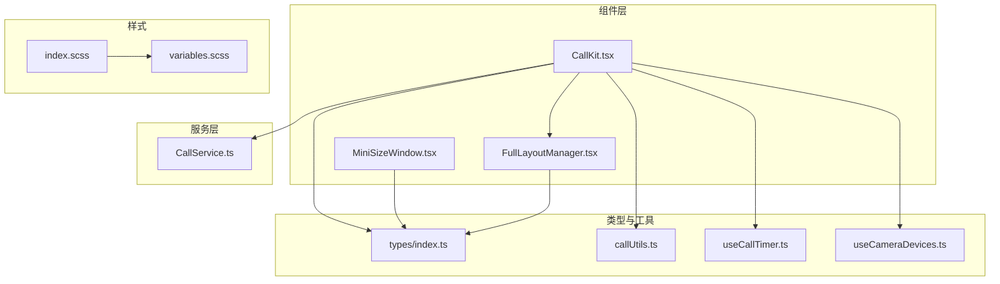
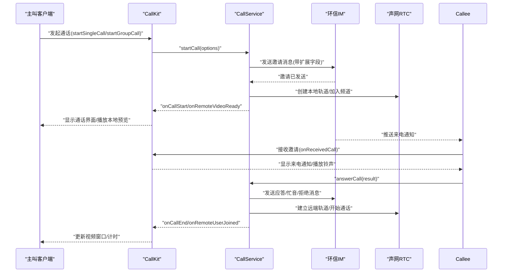
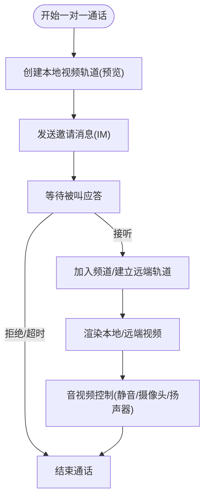
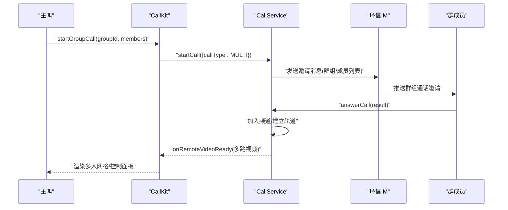
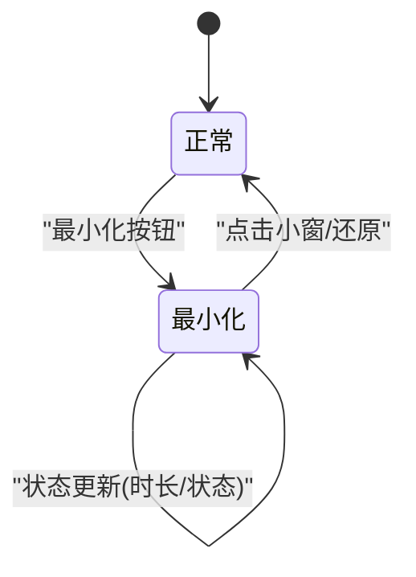
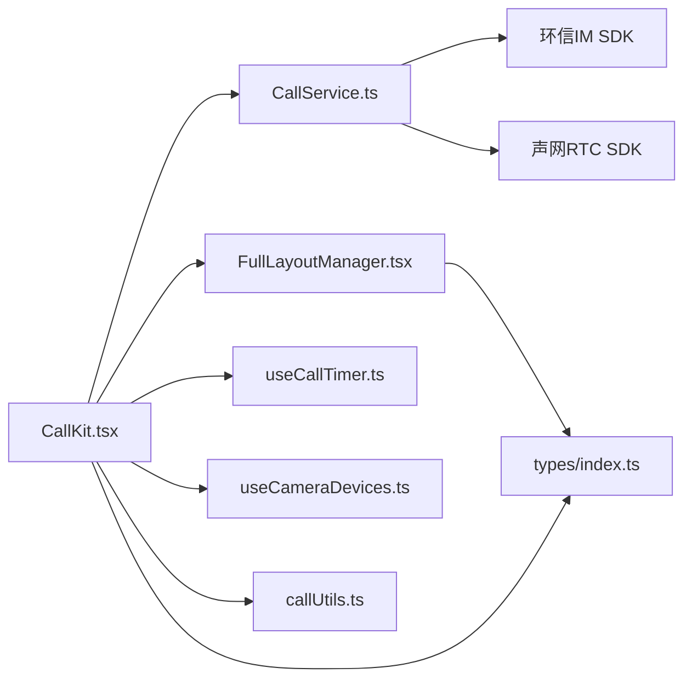

# 核心特性

<cite>
**本文引用的文件**
- [README.md](file://README.md)
- [USAGE.md](file://USAGE.md)
- [CallKit.tsx](file://callkit/CallKit.tsx)
- [CallService.ts](file://callkit/services/CallService.ts)
- [index.ts](file://callkit/types/index.ts)
- [MiniSizeWindow.tsx](file://callkit/components/MiniSizeWindow.tsx)
- [FullLayoutManager.tsx](file://callkit/layouts/FullLayoutManager.tsx)
- [useCallTimer.ts](file://callkit/hooks/useCallTimer.ts)
- [useCameraDevices.ts](file://callkit/hooks/useCameraDevices.ts)
- [callUtils.ts](file://callkit/utils/callUtils.ts)
- [quickstart.md](file://callkit/docs/quickstart.md)
- [integration.md](file://callkit/docs/integration.md)
- [index.scss](file://callkit/styles/index.scss)
- [variables.scss](file://callkit/styles/variables.scss)
</cite>

## 目录
1. [简介](#简介)
2. [项目结构](#项目结构)
3. [核心组件](#核心组件)
4. [架构总览](#架构总览)
5. [详细组件分析](#详细组件分析)
6. [依赖关系分析](#依赖关系分析)
7. [性能考量](#性能考量)
8. [故障排查指南](#故障排查指南)
9. [结论](#结论)
10. [附录](#附录)

## 简介
本文件面向 Easemob Chat CallKit Vue3 插件，系统性阐述其核心特性与实现要点，涵盖一对一音视频通话、群组音视频通话、来电通知、小窗口模式、音视频设备控制等能力。文档同时给出特性对比、使用场景说明、简化集成的实现原理以及可直接参考的代码示例路径，帮助开发者快速落地高质量的音视频通话体验。

## 项目结构
- 插件采用模块化组织：组件层、组合式函数层、服务层、类型定义、工具与样式。
- 核心入口位于 CallKit 主组件，配合 CallService 服务层完成信令与媒体生命周期管理。
- 布局层通过 FullLayoutManager 统一调度不同模式（1v1、多人、预览、最小化等）。
- Hooks 提供计时、设备、拖拽、可调整大小等横切能力。
- 样式体系通过 SCSS 变量与混入，支撑响应式与主题化。

**图表来源**
- [CallKit.tsx](file://callkit/CallKit.tsx#L1-L200)
- [CallService.ts](file://callkit/services/CallService.ts#L1-L120)
- [FullLayoutManager.tsx](file://callkit/layouts/FullLayoutManager.tsx#L1-L158)
- [MiniSizeWindow.tsx](file://callkit/components/MiniSizeWindow.tsx#L1-L120)
- [index.ts](file://callkit/types/index.ts#L1-L120)
- [callUtils.ts](file://callkit/utils/callUtils.ts#L1-L85)
- [useCallTimer.ts](file://callkit/hooks/useCallTimer.ts#L1-L50)
- [useCameraDevices.ts](file://callkit/hooks/useCameraDevices.ts#L1-L120)
- [index.scss](file://callkit/styles/index.scss#L1-L120)
- [variables.scss](file://callkit/styles/variables.scss#L1-L49)

**章节来源**
- [README.md](file://README.md#L1-L181)
- [USAGE.md](file://USAGE.md#L1-L162)

## 核心组件
- CallKit 主组件：负责 UI 布局、状态管理、事件回调、铃声播放、计时器、最小化窗口、拖拽与可调整大小等。
- CallService 服务：封装环信 IM 信令与声网 RTC 的交互，处理邀请、响铃、接听/拒绝、加入频道、媒体轨道管理、网络质量回调等。
- 布局管理器：根据通话模式与状态动态选择布局（1v1、多人、预览、最小化、屏幕共享等）。
- 小窗口组件：在最小化状态下显示通话时长、状态与关键控制按钮，支持一键还原。
- 组合式函数：提供计时、摄像头设备枚举与切换、容器尺寸计算、全屏/拖拽/可调整大小等能力。
- 类型系统：统一视频窗口、布局模式、邀请信息、组件属性与回调签名，提升开发一致性与可维护性。

**章节来源**
- [CallKit.tsx](file://callkit/CallKit.tsx#L1-L200)
- [CallService.ts](file://callkit/services/CallService.ts#L116-L285)
- [FullLayoutManager.tsx](file://callkit/layouts/FullLayoutManager.tsx#L16-L88)
- [MiniSizeWindow.tsx](file://callkit/components/MiniSizeWindow.tsx#L44-L120)
- [index.ts](file://callkit/types/index.ts#L178-L307)
- [useCallTimer.ts](file://callkit/hooks/useCallTimer.ts#L4-L49)
- [useCameraDevices.ts](file://callkit/hooks/useCameraDevices.ts#L272-L387)

## 架构总览
整体架构围绕“UI 组件 + 服务层 + 信令/媒体引擎”的分层设计展开。CallKit 作为 UI 层，通过 CallService 与环信 IM 与声网 RTC 对接，实现从邀请、响铃、加入频道到媒体渲染与控制的完整闭环。

**图表来源**
- [CallService.ts](file://callkit/services/CallService.ts#L345-L527)
- [CallService.ts](file://callkit/services/CallService.ts#L686-L727)
- [CallService.ts](file://callkit/services/CallService.ts#L529-L684)
- [CallKit.tsx](file://callkit/CallKit.tsx#L658-L758)

## 详细组件分析

### 一对一音视频通话
- 技术实现
  - 主叫侧：创建本地视频轨道（1v1 预览）、发送邀请消息、播放外拨铃声、等待被叫应答。
  - 被叫侧：接收邀请回调、播放来电铃声、支持接听/拒绝；接听后加入频道并建立远端轨道。
  - 通话中：渲染本地/远端视频窗口、支持静音、摄像头开关、扬声器、挂断。
- 使用场景
  - 个人对个人的视频/语音通话，强调低延迟与高清晰度。
- 代码示例路径
  - [发起一对一视频通话](file://callkit/docs/quickstart.md#L175-L191)
  - [发起一对一音频通话](file://callkit/docs/quickstart.md#L193-L209)
  - [CallService.startCall](file://callkit/services/CallService.ts#L345-L527)
  - [CallService.answerCall](file://callkit/services/CallService.ts#L686-L727)

**图表来源**
- [CallService.ts](file://callkit/services/CallService.ts#L408-L510)
- [CallService.ts](file://callkit/services/CallService.ts#L686-L727)
- [CallKit.tsx](file://callkit/CallKit.tsx#L319-L353)

**章节来源**
- [CallService.ts](file://callkit/services/CallService.ts#L345-L527)
- [CallService.ts](file://callkit/services/CallService.ts#L686-L727)
- [quickstart.md](file://callkit/docs/quickstart.md#L175-L209)

### 群组音视频通话
- 技术实现
  - 主叫侧：拉起群成员选择界面，限定最大参与人数，发送邀请消息至群组成员。
  - 被叫侧：收到群组通话邀请，支持接受/拒绝；接受后加入频道。
  - 通话中：多人网格布局，支持邀请新增成员、最小化、全屏、拖拽与可调整大小。
- 使用场景
  - 会议、教学、协作等多人实时沟通。
- 代码示例路径
  - [发起群组通话](file://callkit/docs/quickstart.md#L211-L227)
  - [CallService.startCall(群组)](file://callkit/services/CallService.ts#L473-L510)
  - [FullLayoutManager(多人布局)](file://callkit/layouts/FullLayoutManager.tsx#L153-L156)

**图表来源**
- [CallService.ts](file://callkit/services/CallService.ts#L345-L527)
- [FullLayoutManager.tsx](file://callkit/layouts/FullLayoutManager.tsx#L153-L156)

**章节来源**
- [CallService.ts](file://callkit/services/CallService.ts#L345-L527)
- [integration.md](file://callkit/docs/integration.md#L319-L334)

### 来电通知
- 技术实现
  - 被叫侧收到 IM 邀请消息后，触发 onReceivedCall 回调，显示来电通知与铃声。
  - 支持自动拒绝倒计时、自定义通知内容与按钮文案。
- 使用场景
  - 提升用户体验，降低误操作成本。
- 代码示例路径
  - [来电通知配置与回调](file://callkit/docs/integration.md#L240-L273)
  - [CallKit 邀请状态与铃声](file://callkit/CallKit.tsx#L427-L431)

**章节来源**
- [integration.md](file://callkit/docs/integration.md#L240-L273)
- [CallKit.tsx](file://callkit/CallKit.tsx#L427-L431)

### 小窗口模式
- 技术实现
  - 最小化状态下显示通话时长、状态图标与关键控制按钮；1v1 视频模式下可直接显示远端视频。
  - 支持点击还原、静音/摄像头切换、挂断。
- 使用场景
  - 多任务场景下保持通话可见与可控，减少全屏占用。
- 代码示例路径
  - [MiniSizeWindow 组件](file://callkit/components/MiniSizeWindow.tsx#L44-L120)
  - [FullLayoutManager(最小化)](file://callkit/layouts/FullLayoutManager.tsx#L93-L123)

**图表来源**
- [MiniSizeWindow.tsx](file://callkit/components/MiniSizeWindow.tsx#L44-L120)
- [FullLayoutManager.tsx](file://callkit/layouts/FullLayoutManager.tsx#L93-L123)

**章节来源**
- [MiniSizeWindow.tsx](file://callkit/components/MiniSizeWindow.tsx#L44-L120)
- [FullLayoutManager.tsx](file://callkit/layouts/FullLayoutManager.tsx#L93-L123)

### 音视频设备控制
- 技术实现
  - 摄像头设备：枚举前后主摄像头、缓存设备列表、支持翻转摄像头。
  - 麦克风/扬声器：静音/取消静音、摄像头开关、扬声器切换。
  - 计时器：自动统计通话时长，支持开始/停止。
- 使用场景
  - 优化设备使用体验，满足隐私与性能需求。
- 代码示例路径
  - [useCameraDevices](file://callkit/hooks/useCameraDevices.ts#L272-L387)
  - [useCallTimer](file://callkit/hooks/useCallTimer.ts#L4-L49)
  - [CallKit 音视频控制回调](file://callkit/CallKit.tsx#L130-L158)

**章节来源**
- [useCameraDevices.ts](file://callkit/hooks/useCameraDevices.ts#L272-L387)
- [useCallTimer.ts](file://callkit/hooks/useCallTimer.ts#L4-L49)
- [CallKit.tsx](file://callkit/CallKit.tsx#L130-L158)

## 依赖关系分析
- 组件耦合
  - CallKit 与 CallService 强耦合，通过配置注入回调与状态同步。
  - 布局层与组件层解耦，通过 props 传递状态与渲染函数。
- 外部依赖
  - 环信 IM SDK：负责信令与消息投递。
  - 声网 RTC SDK：负责媒体采集、编码、传输与渲染。
- 可能的循环依赖
  - 通过回调与 ref 解耦，避免直接互相引用。
- 接口契约
  - 类型系统统一了视频窗口、布局模式、邀请信息等接口，降低变更风险。

**图表来源**
- [CallKit.tsx](file://callkit/CallKit.tsx#L1-L120)
- [CallService.ts](file://callkit/services/CallService.ts#L1-L120)
- [FullLayoutManager.tsx](file://callkit/layouts/FullLayoutManager.tsx#L1-L158)
- [index.ts](file://callkit/types/index.ts#L1-L120)
- [callUtils.ts](file://callkit/utils/callUtils.ts#L1-L85)
- [useCallTimer.ts](file://callkit/hooks/useCallTimer.ts#L1-L50)
- [useCameraDevices.ts](file://callkit/hooks/useCameraDevices.ts#L1-L120)

**章节来源**
- [CallKit.tsx](file://callkit/CallKit.tsx#L1-L120)
- [CallService.ts](file://callkit/services/CallService.ts#L1-L120)

## 性能考量
- 媒体资源复用
  - 本地/远端轨道与流对象缓存，避免重复创建与内存泄漏。
- UI 渲染优化
  - React.memo 优化布局渲染，减少不必要的重绘。
- 网络质量与指标
  - 提供网络质量回调，便于前端做降分辨率或提示。
- 设备权限与缓存
  - 摄像头设备列表缓存与失效策略，减少频繁枚举设备带来的性能损耗。
- 样式与布局
  - SCSS 变量与混入统一尺寸、颜色与动画，提升渲染效率与一致性。

[本节为通用指导，不直接分析具体文件]

## 故障排查指南
- 常见问题
  - 无法发起通话：检查 IM 登录状态、App Key 与 Token 配置。
  - 无声音/无画面：检查浏览器权限与设备权限。
  - 通话无响应：检查网络质量与设备切换。
- 错误回调
  - 通过 onCallError 获取错误类型与信息，结合 CallError 类型定位问题。
- 日志与调试
  - 通过日志级别与前缀配置，输出详细调试信息。
- 代码示例路径
  - [错误回调与日志配置](file://callkit/docs/integration.md#L240-L273)
  - [CallService 错误上报](file://callkit/services/CallService.ts#L300-L308)

**章节来源**
- [integration.md](file://callkit/docs/integration.md#L240-L273)
- [CallService.ts](file://callkit/services/CallService.ts#L300-L308)

## 结论
Easemob Chat CallKit Vue3 通过清晰的分层设计与完善的 UI/服务/类型体系，将复杂的音视频通话集成抽象为开箱即用的能力：从一对一到群组通话、从来电通知到小窗模式、从设备控制到布局管理，均提供一致的 API 与良好的扩展性。配合环信 IM 与声网 RTC，开发者可快速搭建稳定、易用、高性能的音视频通话体验。

[本节为总结性内容，不直接分析具体文件]

## 附录

### 特性对比与优势
- 与传统音视频集成方案相比
  - 一体化 UI 组件：内置布局、控制面板、通知与小窗，减少重复开发。
  - 信令与媒体解耦：CallService 统一封装 IM 与 RTC，降低耦合度。
  - 设备与权限管理：提供摄像头枚举与翻转、权限缓存与失效策略。
  - 响应式与主题化：SCSS 变量与混入，适配多终端与品牌定制。
  - 开发体验：类型系统与回调契约明确，便于团队协作与长期维护。

[本节为概念性内容，不直接分析具体文件]

### 快速上手与示例路径
- 安装与引入
  - [安装与引入](file://USAGE.md#L14-L31)
- 基本使用
  - [发起一对一视频/音频通话](file://callkit/docs/quickstart.md#L175-L209)
  - [发起群组通话](file://callkit/docs/quickstart.md#L211-L227)
- 高级功能
  - [来电通知与回调](file://callkit/docs/integration.md#L240-L273)
  - [最小化窗口与还原](file://callkit/layouts/FullLayoutManager.tsx#L93-L123)
  - [摄像头设备切换](file://callkit/hooks/useCameraDevices.ts#L354-L377)
  - [通话计时](file://callkit/hooks/useCallTimer.ts#L10-L35)

**章节来源**
- [USAGE.md](file://USAGE.md#L14-L31)
- [quickstart.md](file://callkit/docs/quickstart.md#L175-L227)
- [integration.md](file://callkit/docs/integration.md#L240-L273)
- [useCameraDevices.ts](file://callkit/hooks/useCameraDevices.ts#L354-L377)
- [useCallTimer.ts](file://callkit/hooks/useCallTimer.ts#L10-L35)