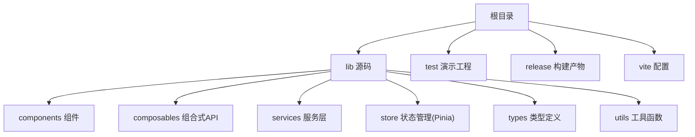
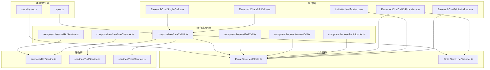

# 目标用户

<cite>
**本文引用的文件**
- [README.md](file://README.md)
- [USAGE.md](file://USAGE.md)
- [package.json](file://package.json)
- [lib/index.ts](file://lib/index.ts)
- [lib/types.ts](file://lib/types.ts)
- [lib/components/EasemobChatCallKitProvider.vue](file://lib/components/EasemobChatCallKitProvider.vue)
- [lib/composables/useCallKit.ts](file://lib/composables/useCallKit.ts)
- [lib/store/callState.ts](file://lib/store/callState.ts)
- [lib/ARCHITECTURE.md](file://lib/ARCHITECTURE.md)
- [lib/SIGNALING_IMPLEMENTATION.md](file://lib/SIGNALING_IMPLEMENTATION.md)
- [callkit/docs/CallKit架构文档.md](file://callkit/docs/CallKit架构文档.md)
- [callkit/docs/quickstart.md](file://callkit/docs/quickstart.md)
- [callkit/docs/integration.md](file://callkit/docs/integration.md)
</cite>

## 目录
1. [简介](#简介)
2. [项目结构](#项目结构)
3. [核心组件](#核心组件)
4. [架构总览](#架构总览)
5. [详细组件分析](#详细组件分析)
6. [依赖分析](#依赖分析)
7. [性能考量](#性能考量)
8. [故障排查指南](#故障排查指南)
9. [结论](#结论)
10. [附录](#附录)

## 简介
本项目是面向 Vue3 的“环信聊天 + 音视频通话”一体化 UI 组件库，提供从“发起通话、接听邀请、通话中控制、结束通话”的完整链路能力，并内置 IM 信令与声网 RTC 的集成方案。项目同时提供两类使用形态：lib 源码形态与打包产物形态，便于开发者在开发阶段与发布阶段分别采用“源码直连”和“构建产物验证”。

本目标用户分析聚焦三类主要用户群体：
- 企业级应用开发者：需要在自有业务系统中快速集成音视频通话能力，关注稳定性、可维护性与二次定制。
- IM 产品团队：希望在即时通讯基础上无缝扩展音视频通话，关注信令流程、UI 交互与跨端一致性。
- 音视频通信解决方案提供商：需要在自身 SDK/服务之上，提供统一的 UI 与交互体验，关注可配置性、可扩展性与性能。

## 项目结构
项目采用“lib 源码 + 测试演示 + 构建产物”的组织方式，核心目录与职责如下：
- lib：插件源码，包含组件、组合式 API、服务层、Pinia Store、类型定义与样式。
- test：测试演示工程，提供源码模式与 tgz 包模式的切换与验证。
- release：构建产物输出目录，包含库文件与 tgz 包。
- vite.config.*：开发与构建配置，支持库构建与演示构建。

图表来源
- [README.md](file://README.md#L5-L31)
- [package.json](file://package.json#L1-L53)

章节来源
- [README.md](file://README.md#L5-L31)
- [package.json](file://package.json#L1-L53)

## 核心组件
围绕“音视频通话”这一主线，项目提供以下核心能力与组件：
- Provider 上下文：负责初始化 IM 客户端、合并配置、挂载监听器、初始化 RTC 服务。
- 组合式 API：useCallKit、useEndCall、useAnswerCall、useRtcService、useJoinChannel、useParticipants 等，提供对通话生命周期的细粒度控制。
- 组件：EasemobChatCallKitProvider、EasemobChatSingleCall、EasemobChatMultiCall、InvitationNotification、EasemobChatMiniWindow 等。
- 状态管理：Pinia Store 管理通话状态、邀请信息、超时计时、用户映射等。
- 类型体系：ProviderConfig、UseCallKitReturn、UseEndCallReturn、UseAnswerCallReturn 等，确保类型安全与开发体验。

章节来源
- [lib/index.ts](file://lib/index.ts#L1-L58)
- [lib/types.ts](file://lib/types.ts#L1-L91)
- [lib/components/EasemobChatCallKitProvider.vue](file://lib/components/EasemobChatCallKitProvider.vue#L1-L115)
- [lib/composables/useCallKit.ts](file://lib/composables/useCallKit.ts#L1-L123)
- [lib/store/callState.ts](file://lib/store/callState.ts#L1-L263)

## 架构总览
项目采用“类型定义层—服务层—组合式 API 层—组件层”的分层架构，强调职责分离与可扩展性；同时通过 Provider 统一注入上下文，组合式 API 连接服务与 UI，Pinia Store 提供响应式状态管理。

图表来源
- [lib/ARCHITECTURE.md](file://lib/ARCHITECTURE.md#L1-L190)
- [lib/index.ts](file://lib/index.ts#L1-L58)
- [lib/types.ts](file://lib/types.ts#L1-L91)
- [lib/store/callState.ts](file://lib/store/callState.ts#L1-L263)

章节来源
- [lib/ARCHITECTURE.md](file://lib/ARCHITECTURE.md#L1-L190)

## 详细组件分析

### 企业级应用开发者
- 用户画像
  - 技术背景：具备 Vue3 生态经验，熟悉组件化与状态管理，对 IM 与 RTC 集成有一定要求。
  - 关注点：稳定性、可维护性、二次定制、与现有业务系统的耦合度、发布验证流程。
- 需求特点
  - 快速接入：通过 Provider 与组合式 API 快速完成 IM 与 RTC 的初始化与通话发起/接听。
  - 可配置性：ProviderConfig 与 initConfig 支持调试、铃声、可拖拽、可调整大小等开关。
  - 状态可观测：Pinia Store 提供通话状态、超时计时、用户映射等，便于埋点与监控。
  - 发布验证：提供源码模式与 tgz 包模式，确保开发与发布的闭环一致。
- 典型使用场景
  - 在企业 OA/CRM/工单系统中嵌入“一键视频/语音”能力，用户通过业务侧账号登录后直接发起/接听通话。
  - 在客服系统中，客户与坐席之间建立音视频通道，通话结束后自动记录时长与状态。
- 使用路径
  - 安装依赖与插件 → Provider 注入 IM 客户端与配置 → 组合式 API 发起/接听通话 → 组件展示与控制 → 状态持久化与埋点。
- 潜在挑战与解决方案
  - 挑战：多端登录、网络波动、权限授权失败。
  - 解决：结合 useAnswerCall 与 useEndCall 的挂断/取消逻辑，配合超时计时与日志级别配置，提升稳定性与可观测性。

章节来源
- [USAGE.md](file://USAGE.md#L1-L162)
- [lib/components/EasemobChatCallKitProvider.vue](file://lib/components/EasemobChatCallKitProvider.vue#L1-L115)
- [lib/composables/useCallKit.ts](file://lib/composables/useCallKit.ts#L1-L123)
- [lib/store/callState.ts](file://lib/store/callState.ts#L1-L263)
- [README.md](file://README.md#L33-L181)

### IM 产品团队
- 用户画像
  - 产品导向：关注用户体验、交互一致性与跨端表现。
  - 技术边界：在环信 IM 基础上扩展音视频能力，追求“信令—UI—状态”的一致性。
- 需求特点
  - 信令流程：明确邀请、接听、拒绝、超时、挂断等状态机与回调。
  - UI 一致性：统一的邀请通知、通话界面、控制按钮与布局。
  - 可扩展性：支持自定义样式、图标与回调事件，便于产品化定制。
- 典型使用场景
  - 在即时通讯产品中增加“音视频通话”入口，用户点击后弹出邀请通知，被叫方可选择接听/拒绝。
  - 在群聊中发起群组通话，支持成员选择与实时显示。
- 使用路径
  - Provider 初始化 → 组合式 API 控制通话 → InvitationNotification 展示邀请 → 状态变更驱动 UI 更新。
- 潜在挑战与解决方案
  - 挑战：信令处理复杂、多人通话状态同步、UI 与状态不一致。
  - 解决：参考信令实现文档，确保 accept/refuse/busy 的状态更新与回调一致；利用 Pinia Store 的 getter 与 action 保证状态一致性。

章节来源
- [lib/SIGNALING_IMPLEMENTATION.md](file://lib/SIGNALING_IMPLEMENTATION.md#L1-L183)
- [lib/composables/useCallKit.ts](file://lib/composables/useCallKit.ts#L1-L123)
- [lib/store/callState.ts](file://lib/store/callState.ts#L1-L263)
- [callkit/docs/integration.md](file://callkit/docs/integration.md#L1-L417)

### 音视频通信解决方案提供商
- 用户画像
  - 服务导向：在自身 SDK/服务之上提供统一 UI 与交互体验，关注可配置性与性能。
- 需求特点
  - 可配置性：ProviderConfig 与 initConfig 支持调试、铃声、可拖拽、可调整大小等。
  - 性能与稳定性：通过组合式 API 与 Pinia Store 管理状态，减少不必要的重渲染与资源泄露。
  - 扩展性：支持自定义样式、图标与回调事件，便于二次封装与品牌化。
- 典型使用场景
  - 为在线教育平台提供“师生视频课堂”能力，支持主讲/学生自由切换角色。
  - 为远程医疗系统提供“医生—患者”音视频问诊能力，支持邀请通知与通话记录。
- 使用路径
  - Provider 注入 → 组合式 API 发起/接听 → 组件展示与控制 → 回调事件与埋点 → 性能优化与品牌化。
- 潜在挑战与解决方案
  - 挑战：RTC 频道加入时机、多人通话性能、UI 品牌化适配。
  - 解决：遵循信令实现文档，确保 RTC 频道加入逻辑与状态机一致；利用布局组件与样式变量进行品牌化适配。

章节来源
- [lib/ARCHITECTURE.md](file://lib/ARCHITECTURE.md#L1-L190)
- [lib/types.ts](file://lib/types.ts#L1-L91)
- [callkit/docs/CallKit架构文档.md](file://callkit/docs/CallKit架构文档.md#L1-L271)

## 依赖分析
项目依赖关系如下：
- 运行时依赖：easemob-websdk（IM）、agora-rtc-sdk-ng（RTC）、pinia（状态管理）。
- 开发依赖：vue、vite、typescript、vue-tsc 等。
- 插件导出：组件、组合式 API、服务、Store、类型与默认安装器。

```mermaid
graph TB
P["package.json"] --> D1["easemob-websdk"]
P --> D2["agora-rtc-sdk-ng"]
P --> D3["pinia"]
P --> DEV1["vue"]
P --> DEV2["vite"]
P --> DEV3["typescript"]
P --> DEV4["vue-tsc"]
L["lib/index.ts"] --> C1["EasemobChatCallKitProvider"]
L --> C2["EasemobChatSingleCall"]
L --> C3["EasemobChatMultiCall"]
L --> C4["InvitationNotification"]
L --> C5["EasemobChatMiniWindow"]
L --> H1["useCallKit"]
L --> H2["useEndCall"]
L --> H3["useAnswerCall"]
L --> S1["RtcService"]
L --> ST1["useCallStateStore"]
L --> ST2["useRtcChannelStore"]
```

图表来源
- [package.json](file://package.json#L1-L53)
- [lib/index.ts](file://lib/index.ts#L1-L58)

章节来源
- [package.json](file://package.json#L1-L53)
- [lib/index.ts](file://lib/index.ts#L1-L58)

## 性能考量
- 状态管理：Pinia Store 提供响应式状态，避免直接修改状态，使用 action 与 getter 管理状态更新与查询。
- 资源清理：Provider 在卸载时销毁 RTC 服务，避免内存泄漏。
- 日志与调试：Provider 支持调试模式与日志级别设置，便于定位问题。
- 超时与重试：Pinia Store 提供邀请超时计时器，支持回调与状态重置。

章节来源
- [lib/components/EasemobChatCallKitProvider.vue](file://lib/components/EasemobChatCallKitProvider.vue#L1-L115)
- [lib/store/callState.ts](file://lib/store/callState.ts#L1-L263)

## 故障排查指南
- 信令流程异常：参考信令实现文档，确保 accept/refuse/busy 的状态更新与回调一致。
- 多人通话超时：多人通话场景下，超时后不自动隐藏界面，需手动挂断以正确销毁资源。
- 权限与网络：确保摄像头/麦克风权限已授权，生产环境使用 HTTPS 协议。
- 发布验证：使用 tgz 包模式验证构建产物，确保与源码模式一致。

章节来源
- [lib/SIGNALING_IMPLEMENTATION.md](file://lib/SIGNALING_IMPLEMENTATION.md#L1-L183)
- [lib/store/callState.ts](file://lib/store/callState.ts#L115-L131)
- [README.md](file://README.md#L167-L181)

## 结论
本项目为 Vue3 提供了“环信 IM + 声网 RTC”的一体化音视频通话能力，具备清晰的分层架构、完善的类型体系与组合式 API，适用于企业级应用开发者、IM 产品团队与音视频通信解决方案提供商。通过 Provider 统一上下文、组合式 API 精准控制、Pinia Store 状态管理与完善的信令实现，能够满足从快速集成到深度定制的多样化需求。

## 附录
- 快速开始与使用示例可参考 USAGE 文档与测试演示工程。
- 架构设计与扩展指南可参考 ARCHITECTURE 文档与 CallKit 架构文档。

章节来源
- [USAGE.md](file://USAGE.md#L1-L162)
- [callkit/docs/quickstart.md](file://callkit/docs/quickstart.md#L1-L617)
- [callkit/docs/CallKit架构文档.md](file://callkit/docs/CallKit架构文档.md#L1-L271)