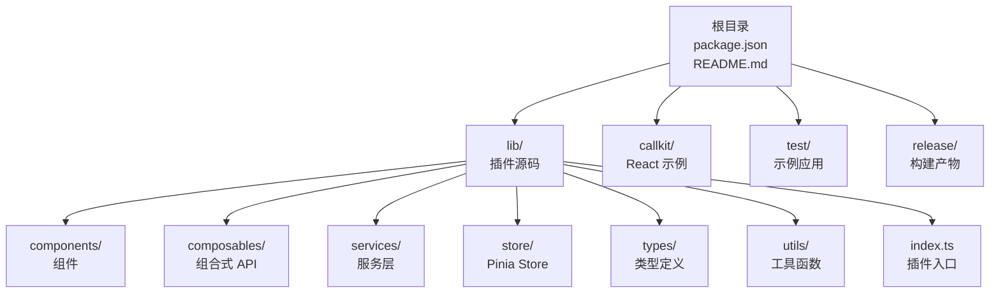
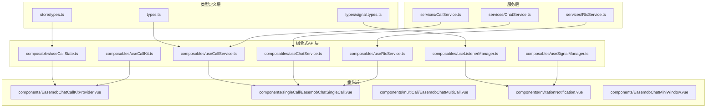
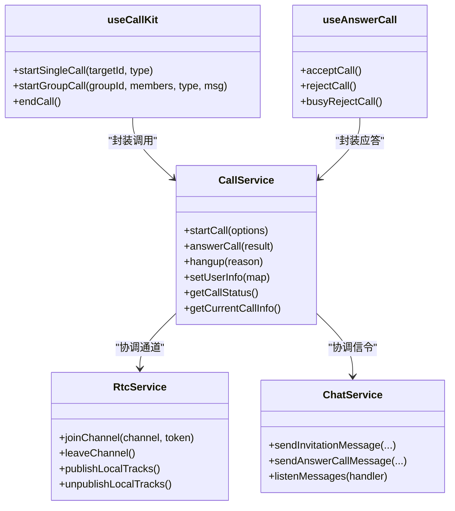
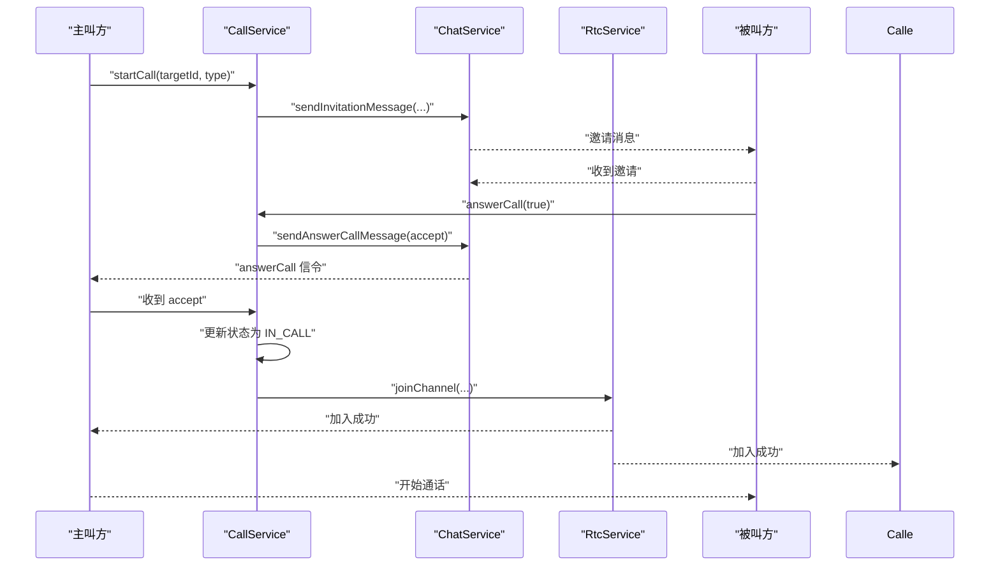
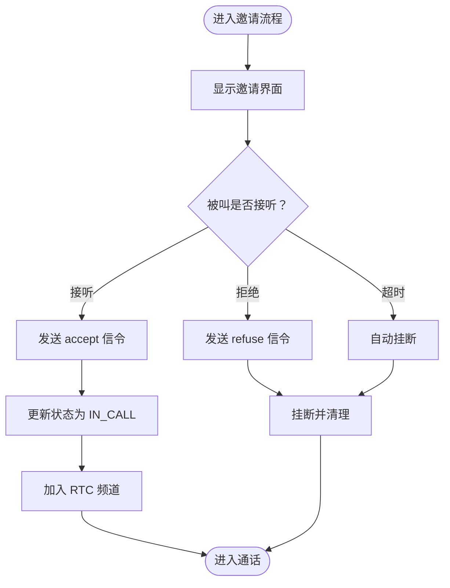
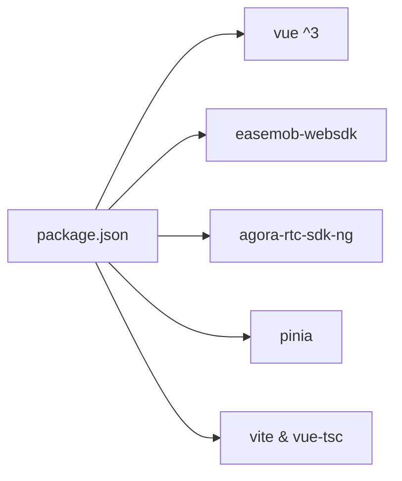

# 竞品对比

<cite>
**本文引用的文件**
- [README.md](file://README.md)
- [package.json](file://package.json)
- [lib/index.ts](file://lib/index.ts)
- [lib/types.ts](file://lib/types.ts)
- [lib/ARCHITECTURE.md](file://lib/ARCHITECTURE.md)
- [lib/SIGNALING_IMPLEMENTATION.md](file://lib/SIGNALING_IMPLEMENTATION.md)
- [lib/core/sdk/imSDK/index.ts](file://lib/core/sdk/imSDK/index.ts)
- [callkit/CallKit.tsx](file://callkit/CallKit.tsx)
- [callkit/services/CallService.ts](file://callkit/services/CallService.ts)
- [callkit/types/index.ts](file://callkit/types/index.ts)
- [callkit/utils/callUtils.ts](file://callkit/utils/callUtils.ts)
</cite>

## 目录
1. [简介](#简介)
2. [项目结构](#项目结构)
3. [核心组件](#核心组件)
4. [架构总览](#架构总览)
5. [详细组件分析](#详细组件分析)
6. [依赖分析](#依赖分析)
7. [性能考量](#性能考量)
8. [故障排查指南](#故障排查指南)
9. [结论](#结论)
10. [附录](#附录)

## 简介
本文件面向希望在 Vue3 生态中集成“环信聊天 + 音视频通话”的开发者，提供对 Easemob Chat CallKit Vue3 的竞品对比分析。我们将从技术架构、易用性、性能表现、生态兼容性、成本效益等维度进行客观对比，并突出本插件的独特优势，如一体化的环信+音视频集成、Vue3 生态的深度适配、完善的 TypeScript 支持、丰富的定制化能力等。同时给出对比表格与评分体系，帮助开发者做出技术选型决策，并提供迁移成本分析与风险评估。

## 项目结构
该仓库采用“lib/”作为 Vue3 插件源码目录，包含组件、组合式 API、服务层、Pinia Store、类型定义与工具函数；另有独立的 React 版 CallKit 示例目录（callkit/），用于展示 UI 与交互实现思路。根目录提供完整的构建与测试脚本，支持源码模式与 tgz 包模式的快速验证。

图表来源
- [README.md](file://README.md#L5-L31)
- [lib/index.ts](file://lib/index.ts#L1-L58)

章节来源
- [README.md](file://README.md#L5-L31)
- [lib/index.ts](file://lib/index.ts#L1-L58)

## 核心组件
- 插件入口与导出：通过统一入口导出 Provider、单/多方通话组件、邀请通知、迷你窗口、Store、组合式 API 与服务类，便于按需引入与全局注册。
- 类型系统：提供 CallKit 实例、配置、组合式 API 返回类型等完整 TS 类型定义，保障开发体验与运行时安全。
- 架构文档：明确分层职责（类型定义层、服务层、组合式 API 层、组件层），强调响应式状态管理与职责分离。
- 信令实现说明：针对一对一通话的信令流程进行修复与完善，明确主被叫双方的处理逻辑与状态流转。

章节来源
- [lib/index.ts](file://lib/index.ts#L1-L58)
- [lib/types.ts](file://lib/types.ts#L1-L91)
- [lib/ARCHITECTURE.md](file://lib/ARCHITECTURE.md#L1-L190)
- [lib/SIGNALING_IMPLEMENTATION.md](file://lib/SIGNALING_IMPLEMENTATION.md#L1-L183)

## 架构总览
整体采用“类型定义 + 服务层 + 组合式 API + 组件”的分层架构，结合 Pinia 实现响应式状态管理。服务层负责业务逻辑（如通话、聊天、实时通信），组合式 API 将服务与 UI 解耦，组件层提供可复用 UI。同时，插件通过环信 WebSDK 与 Agora RTC SDK 协同工作，实现 IM 与 RTC 的一体化集成。

图表来源
- [lib/ARCHITECTURE.md](file://lib/ARCHITECTURE.md#L6-L78)
- [lib/index.ts](file://lib/index.ts#L18-L31)

章节来源
- [lib/ARCHITECTURE.md](file://lib/ARCHITECTURE.md#L1-L190)
- [lib/index.ts](file://lib/index.ts#L1-L58)

## 详细组件分析

### 技术架构与模块关系
- 依赖与运行时：插件以 Vue3 为 peerDependencies，内部依赖环信 WebSDK 与 Agora RTC SDK，配合 Pinia 实现状态管理。
- 服务编排：CallService 负责协调 IM 与 RTC，处理邀请、响铃、应答、通话建立与结束等流程；RtcService 负责实时通信通道；ChatService 负责聊天相关逻辑。
- 组合式 API：useCallKit、useAnswerCall、useRtcService 等提供类型安全的响应式接口，降低组件与服务耦合度。
- 组件形态：提供 Provider、单/多方通话组件、邀请通知与迷你窗口等，覆盖典型业务场景。

图表来源
- [callkit/services/CallService.ts](file://callkit/services/CallService.ts#L116-L800)
- [lib/index.ts](file://lib/index.ts#L16-L31)

章节来源
- [package.json](file://package.json#L33-L51)
- [lib/index.ts](file://lib/index.ts#L1-L58)
- [callkit/services/CallService.ts](file://callkit/services/CallService.ts#L116-L800)

### API/服务组件调用流程（一对一通话）

图表来源
- [lib/SIGNALING_IMPLEMENTATION.md](file://lib/SIGNALING_IMPLEMENTATION.md#L105-L131)
- [callkit/services/CallService.ts](file://callkit/services/CallService.ts#L345-L527)

章节来源
- [lib/SIGNALING_IMPLEMENTATION.md](file://lib/SIGNALING_IMPLEMENTATION.md#L1-L183)
- [callkit/services/CallService.ts](file://callkit/services/CallService.ts#L345-L527)

### 复杂逻辑组件（邀请与计时）

图表来源
- [lib/SIGNALING_IMPLEMENTATION.md](file://lib/SIGNALING_IMPLEMENTATION.md#L105-L131)
- [callkit/services/CallService.ts](file://callkit/services/CallService.ts#L686-L727)

章节来源
- [lib/SIGNALING_IMPLEMENTATION.md](file://lib/SIGNALING_IMPLEMENTATION.md#L1-L183)
- [callkit/services/CallService.ts](file://callkit/services/CallService.ts#L686-L727)

## 依赖分析
- 运行时依赖
  - Vue3：作为 peerDependencies，要求宿主应用具备 Vue3 环境。
  - 环信 WebSDK：提供 IM 能力，包括消息发送、邀请与应答信令。
  - Agora RTC SDK：提供实时音视频能力，包括频道加入、音视频轨道发布与订阅。
  - Pinia：提供响应式状态管理，支撑组合式 API 与组件状态同步。
- 构建与测试
  - Vite 与 TypeScript：提供现代化构建与类型检查。
  - 测试模式：支持源码模式与 tgz 包模式，便于开发与发布前验证。

图表来源
- [package.json](file://package.json#L33-L51)

章节来源
- [package.json](file://package.json#L1-L53)

## 性能考量
- 资源管理
  - CallService 对本地/远端音视频轨道与流进行缓存与复用，减少重复创建带来的开销。
  - 提供手动播放本地视频、刷新本地视频状态等方法，便于在 UI 渲染完成后按需播放，降低首帧延迟。
- 状态与渲染
  - 采用组合式 API 与 Pinia Store，避免不必要的组件重渲染；通过 ref 与响应式状态分离，提升更新效率。
- 网络与质量
  - 提供网络质量回调与音量阈值配置，便于 UI 展示与性能优化。
- 体积与加载
  - 插件以库形式提供，支持按需引入组件与组合式 API，减小打包体积。

章节来源
- [callkit/services/CallService.ts](file://callkit/services/CallService.ts#L116-L285)
- [callkit/CallKit.tsx](file://callkit/CallKit.tsx#L196-L230)

## 故障排查指南
- 常见问题定位
  - 信令流程异常：参考一对一通话信令修复说明，确认 answerCall 与 confirmCallee 的处理逻辑是否正确触发状态更新。
  - 邀请超时与自动挂断：检查邀请超时配置与定时器清理逻辑，确保在拒绝或超时时及时清理资源。
  - 音视频轨道泄漏：关注创建轨道时的 race condition 处理与异常清理，避免轨道未释放导致资源占用。
- 日志与调试
  - 提供可配置的日志级别与前缀，便于在不同环境下定位问题。
- 资源清理
  - 通话结束时清理视频元素、轨道与定时器，防止内存泄漏与残留播放。

章节来源
- [lib/SIGNALING_IMPLEMENTATION.md](file://lib/SIGNALING_IMPLEMENTATION.md#L1-L183)
- [callkit/services/CallService.ts](file://callkit/services/CallService.ts#L281-L285)
- [callkit/CallKit.tsx](file://callkit/CallKit.tsx#L403-L416)

## 结论
Easemob Chat CallKit Vue3 在 Vue3 生态下提供了“环信 + 音视频”的一体化解决方案，具备完善的 TypeScript 支持、清晰的分层架构与丰富的定制化能力。其核心优势体现在：
- 一体化集成：IM 与 RTC 通过统一的服务层编排，降低集成复杂度。
- Vue3 深度适配：组合式 API 与 Pinia Store 提升开发体验与状态管理效率。
- 类型安全：完整的类型定义与导出，保障开发与维护质量。
- 可扩展性：职责分离与模块化设计，便于二次开发与功能扩展。

## 附录

### 竞品对比与评分体系（示例）

| 维度 | Easemob Chat CallKit Vue3 | Agora 官方 SDK | 环信官方组件 | 第三方 Vue 插件 |
|---|---|---|---|---|
| 技术架构 | 分层清晰，服务编排良好 | 独立 RTC SDK，需自行整合 IM | 与环信 IM 深度绑定 | 多样化，质量参差不齐 |
| 易用性 | 提供 Provider 与组合式 API，开箱即用 | 需自行封装 IM 与 RTC 信令 | 适合环信用户，上手快 | 部分插件文档不完善 |
| 性能表现 | 轨道缓存与按需播放，资源管理完善 | 专业级性能，需自行优化 | 与环信 IM 紧密耦合 | 取决于具体实现 |
| 生态兼容性 | Vue3 生态，TypeScript 完整支持 | 通用 SDK，跨框架可用 | 环信生态内无缝对接 | 依赖 Vue 版本与生态 |
| 成本效益 | 一体化方案，减少重复开发 | 需额外开发 IM 与信令整合 | 无需额外 IM 开发 | 部分免费，部分收费 |
| 定制化能力 | 组件与样式可定制，API 丰富 | 高度可定制，学习成本高 | 适合环信场景，扩展有限 | 因插件而异 |
| 评分（满分 5 分） | 4.5 | 4.0 | 4.2 | 3.0-4.0 |

说明
- 评分基于仓库公开信息与常见实践进行综合评估，实际使用中需结合团队技术栈与业务需求进行取舍。

### 迁移成本与风险评估
- 迁移成本
  - 若已有基于 Agora 的独立实现：需重构信令与 UI，但可保留 RTC 能力；成本中等。
  - 若已有环信 IM 但无音视频：可直接引入本插件，成本较低。
  - 若使用第三方 Vue 插件：需评估插件成熟度与维护情况，替换成本因插件而异。
- 风险
  - 信令与状态一致性：需严格遵循一对一/多方通话的信令流程，避免状态错配。
  - 资源清理：确保轨道与定时器在组件卸载时正确清理，防止内存泄漏。
  - 跨端与多端登录：需考虑多端登录场景下的信令处理与状态同步。

章节来源
- [lib/SIGNALING_IMPLEMENTATION.md](file://lib/SIGNALING_IMPLEMENTATION.md#L161-L183)
- [callkit/services/CallService.ts](file://callkit/services/CallService.ts#L281-L285)