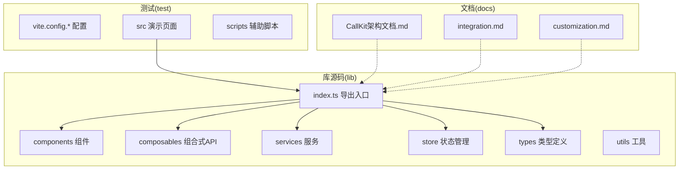
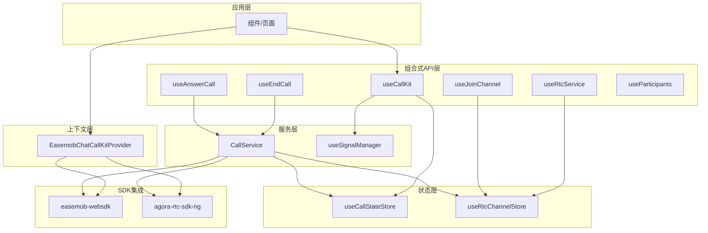
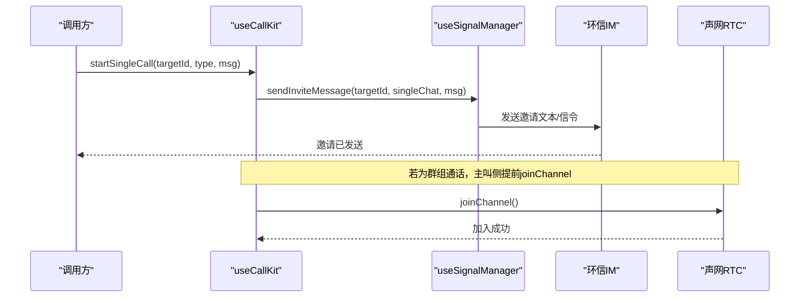
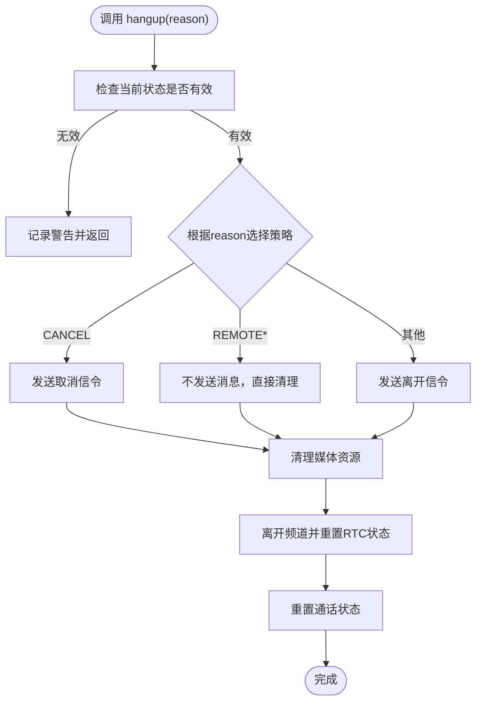
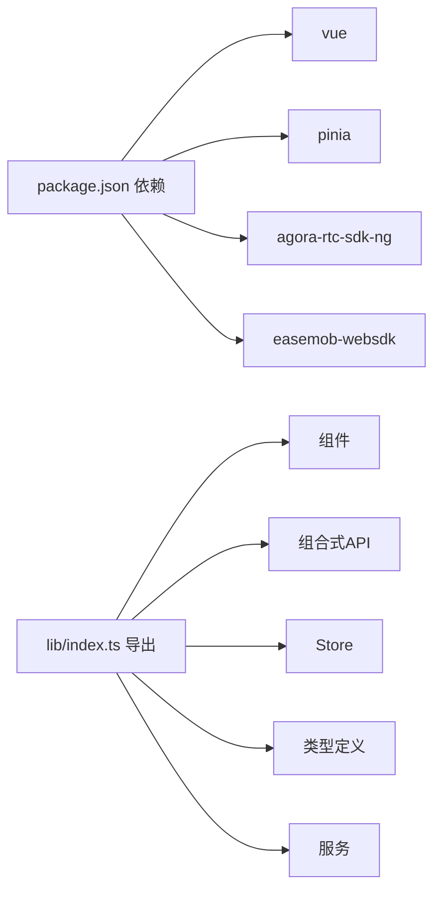

# 项目介绍

<cite>
**本文引用的文件**
- [README.md](file://README.md)
- [USAGE.md](file://USAGE.md)
- [package.json](file://package.json)
- [lib/index.ts](file://lib/index.ts)
- [lib/components/EasemobChatCallKitProvider.vue](file://lib/components/EasemobChatCallKitProvider.vue)
- [lib/composables/useCallKit.ts](file://lib/composables/useCallKit.ts)
- [lib/services/CallService.ts](file://lib/services/CallService.ts)
- [lib/store/callState.ts](file://lib/store/callState.ts)
- [lib/composables/useSignalManager.ts](file://lib/composables/useSignalManager.ts)
- [lib/types/callstate.types.ts](file://lib/types/callstate.types.ts)
- [callkit/docs/CallKit架构文档.md](file://callkit/docs/CallKit架构文档.md)
- [callkit/docs/integration.md](file://callkit/docs/integration.md)
- [callkit/docs/customization.md](file://callkit/docs/customization.md)
</cite>

## 目录
1. [引言](#引言)
2. [项目结构](#项目结构)
3. [核心组件](#核心组件)
4. [架构总览](#架构总览)
5. [详细组件分析](#详细组件分析)
6. [依赖分析](#依赖分析)
7. [性能考虑](#性能考虑)
8. [故障排查指南](#故障排查指南)
9. [结论](#结论)
10. [附录](#附录)

## 引言
Easemob Chat CallKit Vue3 是一个面向 Vue3 的音视频通话 UI 组件库，核心价值在于“将环信即时通讯 IM 与声网 Agora 音视频能力进行一体化集成”，为前端开发者提供开箱即用的一对一与群组音视频通话能力。项目定位明确：降低企业级应用在音视频通话领域的集成门槛，提供稳定、可定制、可扩展的 UI 与状态管理方案。

- 解决的痛点
  - 音视频通话涉及 IM 信令与 RTC 音视频两条链路，传统方案需要分别对接两套 SDK，集成复杂度高。
  - 通话状态机、邀请/应答流程、媒体资源生命周期管理、UI 布局与交互体验等，都需要大量重复造轮子。
  - 企业级应用对稳定性、可维护性、可扩展性要求高，需要统一的上下文、状态与事件模型。

- 与环信聊天的无缝结合
  - 通过 Provider 统一注入环信 ChatClient，集中挂载文本消息与信令监听，形成“IM 信令通道”。
  - 通话邀请、应答、取消、离开等动作均通过环信消息通道完成，确保跨端一致性与可靠性。

- 与声网 Agora 的结合
  - 通过 RTC 服务封装与 Pinia Store 管理，实现频道加入、媒体轨道发布/订阅、网络质量监控、异常恢复等。
  - 支持一对一与群组通话，具备预览、布局、最小化、拖拽、调整大小等丰富交互能力。

- 目标用户
  - 企业级应用开发者、IM 产品团队、低代码平台与 UIKIT 团队、需要快速落地音视频通话的 SaaS 与 PaaS 产品。

- 典型场景
  - 在线客服/人工服务、远程问诊/咨询、在线教育/培训、企业协作会议、远程办公、社交互动等。

- 差异化优势
  - 一体化集成：IM 与 RTC 的统一上下文与状态机，减少重复开发。
  - 模块化与可定制：Provider、组合式 API、Store、布局系统、Hook 等分层清晰，便于按需替换与扩展。
  - 企业级稳定性：完善的错误处理、超时与重试、媒体资源清理、异常恢复。
  - 开发体验：完善的类型定义、事件回调、日志系统、构建与测试模式。

## 项目结构
项目采用“lib 源码 + 测试样例 + 文档”的组织方式，核心源码位于 lib 目录，提供 Vue3 组件、组合式 API、Store、服务与类型定义；test 目录提供演示与验证；docs 提供架构、集成与定制指南。

**图表来源**
- [lib/index.ts](file://lib/index.ts#L1-L58)
- [README.md](file://README.md#L5-L31)

**章节来源**
- [README.md](file://README.md#L5-L31)

## 核心组件
- Provider 上下文：负责注入 ChatClient、初始化 RTC 服务、挂载 IM 与信令监听、合并全局配置。
- 组合式 API：useCallKit、useEndCall、useAnswerCall、useRtcService、useJoinChannel、useParticipants 等，提供高层抽象与易用接口。
- 通话服务：CallService 封装挂断策略、媒体资源清理、连接清理与状态重置。
- 状态管理：Pinia Store 管理通话状态、邀请超时、用户映射、最小化模式等。
- 信令管理：useSignalManager 统一封装邀请、应答、取消、离开、确认响铃等信令发送。

**章节来源**
- [lib/components/EasemobChatCallKitProvider.vue](file://lib/components/EasemobChatCallKitProvider.vue#L1-L115)
- [lib/composables/useCallKit.ts](file://lib/composables/useCallKit.ts#L1-L123)
- [lib/services/CallService.ts](file://lib/services/CallService.ts#L1-L298)
- [lib/store/callState.ts](file://lib/store/callState.ts#L1-L263)
- [lib/composables/useSignalManager.ts](file://lib/composables/useSignalManager.ts#L1-L354)
- [lib/index.ts](file://lib/index.ts#L1-L58)

## 架构总览
整体架构围绕“Provider 上下文 + 组合式 API + 服务层 + 状态层 + UI 组件”的分层设计展开，IM 与 RTC 通过统一的上下文与状态机协同工作。

**图表来源**
- [lib/components/EasemobChatCallKitProvider.vue](file://lib/components/EasemobChatCallKitProvider.vue#L1-L115)
- [lib/composables/useCallKit.ts](file://lib/composables/useCallKit.ts#L1-L123)
- [lib/services/CallService.ts](file://lib/services/CallService.ts#L1-L298)
- [lib/composables/useSignalManager.ts](file://lib/composables/useSignalManager.ts#L1-L354)
- [lib/store/callState.ts](file://lib/store/callState.ts#L1-L263)
- [package.json](file://package.json#L47-L51)

## 详细组件分析

### Provider 上下文（EasemobChatCallKitProvider）
- 职责
  - 接收 ChatClient，写入 Store，作为 IM 与 RTC 的统一入口。
  - 合并默认与用户配置，设置日志级别、邀请超时等全局行为。
  - 初始化 RTC 服务（占位 appId，实际 appId 动态从环信服务器获取）。
  - 挂载文本消息与信令监听器，建立 IM 与 UI 的双向通道。
- 设计要点
  - 使用响应式配置与计算属性，避免重复初始化。
  - 组件卸载时销毁 RTC 服务，防止内存泄漏。

**章节来源**
- [lib/components/EasemobChatCallKitProvider.vue](file://lib/components/EasemobChatCallKitProvider.vue#L1-L115)

### 组合式 API（useCallKit）
- 职责
  - 发起一对一/群组通话：封装邀请消息发送、状态初始化、加入 RTC 频道等流程。
  - 对外暴露 startSingleCall、startGroupCall，简化调用侧复杂度。
- 设计要点
  - 通过 useSignalManager 发送邀请信令，确保 IM 通道一致性。
  - 群组通话在主叫侧提前加入频道，保证多方同时入会。

**图表来源**
- [lib/composables/useCallKit.ts](file://lib/composables/useCallKit.ts#L1-L123)
- [lib/composables/useSignalManager.ts](file://lib/composables/useSignalManager.ts#L1-L354)

**章节来源**
- [lib/composables/useCallKit.ts](file://lib/composables/useCallKit.ts#L1-L123)

### 通话服务（CallService）
- 职责
  - 统一挂断策略：区分普通挂断、取消、远程原因等，发送相应信令。
  - 媒体资源清理：取消发布本地轨道、关闭本地轨道、离开频道。
  - 连接清理与状态重置：确保异常中断后资源回收与状态归零。
- 设计要点
  - 延迟获取 Store 实例，避免在 Pinia 激活前使用。
  - 对远程原因不做消息发送，避免重复或冲突。

**图表来源**
- [lib/services/CallService.ts](file://lib/services/CallService.ts#L1-L298)

**章节来源**
- [lib/services/CallService.ts](file://lib/services/CallService.ts#L1-L298)

### 状态管理（useCallStateStore）
- 职责
  - 维护通话状态机、邀请超时、用户映射、最小化模式等。
  - 提供 initInviteInfo、setCallStatus、resetCallState 等动作，支撑 UI 与服务层协同。
- 设计要点
  - 邀请超时策略：多人通话超时不自动隐藏界面，需用户手动挂断，避免资源误释放。
  - 状态切换时联动 RTC 清理，确保新通话开始前的干净状态。

**章节来源**
- [lib/store/callState.ts](file://lib/store/callState.ts#L1-L263)
- [lib/types/callstate.types.ts](file://lib/types/callstate.types.ts#L1-L93)

### 信令管理（useSignalManager）
- 职责
  - 统一封装邀请、应答、取消、离开、确认响铃、确认被叫等信令发送。
  - 与 ChatService 协作，确保消息类型、聊天类型与接收者列表正确。
- 设计要点
  - 每次调用获取最新 ChatClient，避免登录后实例未就绪。
  - 对群组通话支持 receiverList，精确控制接收者。

**章节来源**
- [lib/composables/useSignalManager.ts](file://lib/composables/useSignalManager.ts#L1-L354)

### 架构与流程参考
- 架构文档提供了 CallKit 的模块化设计、组件关系、布局系统与流程图，建议配合源码阅读加深理解。
- 集成指南与定制指南覆盖了环境要求、Provider 配置、事件回调、发起/接听流程与自定义项。

**章节来源**
- [callkit/docs/CallKit架构文档.md](file://callkit/docs/CallKit架构文档.md#L1-L271)
- [callkit/docs/integration.md](file://callkit/docs/integration.md#L1-L417)
- [callkit/docs/customization.md](file://callkit/docs/customization.md#L1-L82)

## 依赖分析
- 运行时依赖
  - easemob-websdk：环信 IM SDK，提供信令与消息通道。
  - agora-rtc-sdk-ng：声网 RTC SDK，提供音视频编解码与传输。
  - pinia：状态管理，提供 Store 与响应式状态。
- 开发依赖
  - vue、@vue/tsconfig、typescript、vite、vite-plugin-dts 等，支撑构建与类型生成。
- 导出与构建
  - 通过 lib 入口导出组件、组合式 API、Store、服务与类型，支持样式导入与 UMD 构建产物。

**图表来源**
- [package.json](file://package.json#L47-L51)
- [lib/index.ts](file://lib/index.ts#L1-L58)

**章节来源**
- [package.json](file://package.json#L1-L53)
- [lib/index.ts](file://lib/index.ts#L1-L58)

## 性能考虑
- 状态与渲染优化
  - 使用 Pinia Store 管理通话状态，避免冗余渲染；合理拆分 UI 组件，按需更新。
- 媒体资源管理
  - 挂断/异常中断时及时取消发布本地轨道、关闭本地轨道、离开频道，防止资源泄漏。
- 超时与重试
  - 邀请超时策略区分一对一与群组场景，避免误判与资源占用。
- 日志与可观测性
  - 提供日志级别配置与前缀，便于问题定位与生产环境观测。

## 故障排查指南
- 常见问题
  - ChatClient 未初始化：确保在 Provider 内使用组件或组合式 API，避免在未登录状态下调用。
  - RTC 未初始化：确认 Provider 已完成 RTC 服务初始化（占位 appId），实际 appId 在 joinChannel 时动态获取。
  - 媒体权限：检查浏览器权限与设备可用性，必要时在 UI 层提示用户授权。
  - 信令发送失败：查看 useSignalManager 的日志与错误堆栈，确认消息类型与接收者列表。
- 建议流程
  - 开启 debug 日志，复现问题并收集日志。
  - 分段验证：先验证 IM 信令是否可达，再验证 RTC 频道加入是否成功。
  - 使用 CallService 的 hangup 与 reset，确保资源与状态被清理。

**章节来源**
- [lib/components/EasemobChatCallKitProvider.vue](file://lib/components/EasemobChatCallKitProvider.vue#L1-L115)
- [lib/services/CallService.ts](file://lib/services/CallService.ts#L1-L298)
- [lib/composables/useSignalManager.ts](file://lib/composables/useSignalManager.ts#L1-L354)

## 结论
Easemob Chat CallKit Vue3 通过“IM 信令 + RTC 音视频”的一体化设计，为企业级应用提供了一条从“集成到定制再到稳定运营”的高效路径。其模块化架构、完善的组合式 API、健壮的错误处理与状态管理，使其在复杂业务场景中具备良好可维护性与扩展性。建议在项目初期即引入 Provider 与组合式 API，结合文档与示例快速落地，并在上线前通过测试模式与构建产物验证稳定性。

## 附录
- 快速开始与使用示例可参考官方使用指南与 README。
- 架构与集成细节可进一步阅读架构文档与集成指南。

**章节来源**
- [USAGE.md](file://USAGE.md#L1-L162)
- [README.md](file://README.md#L1-L181)
- [callkit/docs/CallKit架构文档.md](file://callkit/docs/CallKit架构文档.md#L1-L271)
- [callkit/docs/integration.md](file://callkit/docs/integration.md#L1-L417)