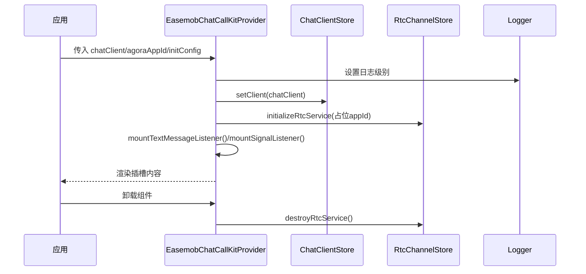
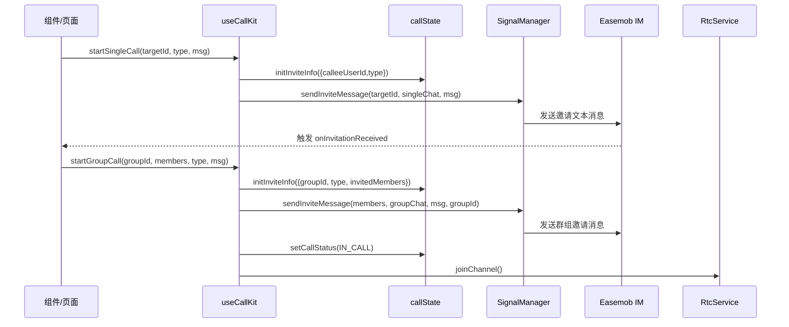

# 项目概述

<cite>
**本文档引用的文件**
- [README.md](file://README.md)
- [package.json](file://package.json)
- [USAGE.md](file://USAGE.md)
- [lib/index.ts](file://lib/index.ts)
- [lib/components/EasemobChatCallKitProvider.vue](file://lib/components/EasemobChatCallKitProvider.vue)
- [lib/composables/useCallKit.ts](file://lib/composables/useCallKit.ts)
- [lib/store/callState.ts](file://lib/store/callState.ts)
- [lib/services/RtcService.ts](file://lib/services/RtcService.ts)
- [lib/types/callstate.types.ts](file://lib/types/callstate.types.ts)
- [callkit/CallKit.tsx](file://callkit/CallKit.tsx)
- [callkit/services/CallService.ts](file://callkit/services/CallService.ts)
- [callkit/docs/CallKit架构文档.md](file://callkit/docs/CallKit架构文档.md)
</cite>

## 目录
1. [引言](#引言)
2. [项目结构](#项目结构)
3. [核心组件](#核心组件)
4. [架构总览](#架构总览)
5. [详细组件分析](#详细组件分析)
6. [依赖分析](#依赖分析)
7. [性能考虑](#性能考虑)
8. [故障排查指南](#故障排查指南)
9. [结论](#结论)
10. [附录](#附录)

## 引言
Easemob Chat CallKit Vue3 插件是一个专为 Vue3 应用打造的音视频通话组件库，旨在无缝集成环信聊天与声网（Agora）音视频能力，提供从“发起通话”到“多人会议”的完整端到端体验。项目通过清晰的模块化架构、完善的类型系统与可配置的 UI 组件，帮助开发者快速搭建稳定、易扩展的音视频通话功能。

- 核心价值
  - 降低集成成本：将环信 IM 信令与声网 RTC 能力整合为统一的插件体系
  - 提升开发效率：提供组合式 API、Provider 上下文、Pinia 状态管理与可复用组件
  - 增强用户体验：内置铃声、邀请通知、超时处理、网络质量监控与多布局适配
  - 保障稳定性：完善的错误处理、资源清理与状态机管理

- 目标用户
  - 需要在 Vue3 应用中快速接入音视频通话的前端团队
  - 需要统一 IM 信令与 RTC 能力的混合通信场景（如在线教育、企业协作、客服系统）

- 技术定位
  - 前端 UI 组件库 + 服务层封装 + 状态管理 + 信令与媒体流编排
  - 既可作为独立插件使用，也可按需拆解为多个子模块复用

- 生态角色
  - 在前端音视频通信生态中，承担“信令桥接 + UI 组件 + 媒体流编排”的中间层角色
  - 与环信 IM 服务配合实现“消息驱动的通话信令”，与声网 RTC 配合实现“高质量音视频传输”

## 项目结构
项目采用“lib/”作为核心库源码目录，提供 Vue3 插件形态；同时保留“callkit/”作为早期 React 版本的参考实现，二者共享相同的核心理念与能力边界。

```mermaid
graph TB
subgraph "库源码(lib/)"
A[index.ts 插件入口]
B[components 组件]
C[composables 组合式API]
D[store 状态管理(Pinia)]
E[services 服务层]
F[types 类型定义]
G[utils 工具]
end
subgraph "测试与构建"
T[test 测试Demo]
V[vite.config 构建配置]
P[package.json 依赖与脚本]
end
A --> B
A --> C
A --> D
A --> E
A --> F
A --> G
T --> A
V --> A
P --> A
```

图表来源
- [lib/index.ts](file://lib/index.ts#L1-L55)
- [package.json](file://package.json#L1-L53)

章节来源
- [README.md](file://README.md#L5-L31)
- [lib/index.ts](file://lib/index.ts#L1-L55)
- [package.json](file://package.json#L1-L53)

## 核心组件
- 插件入口与导出
  - 通过统一入口导出 Provider、单人/多人通话组件、通知组件、迷你窗口、Pinia Store 与组合式 API
  - 便于在应用中按需引入与全局注册

- Provider 上下文
  - 负责注入环信客户端实例、聚合初始化配置、挂载消息与信令监听器、初始化 RTC 服务
  - 为所有通话组件提供统一的运行时上下文

- 组合式 API
  - useCallKit：发起单人/群组通话的高层封装
  - useAnswerCall/useEndCall/useJoinChannel/useRtcService：围绕接听、挂断、加入频道、RTC 服务的细粒度组合式能力

- 状态管理（Pinia）
  - callState：通话状态机与邀请信息管理
  - rtcChannel：频道与用户映射、音视频开关、本地流等

- 服务层
  - RtcService：封装 Agora RTC 的客户端、轨道创建、发布/订阅、设备切换、网络质量与音量指示
  - CallService（React 版本）：负责 IM 信令与 RTC 的协同、通话生命周期管理、错误处理

章节来源
- [lib/index.ts](file://lib/index.ts#L1-L55)
- [lib/components/EasemobChatCallKitProvider.vue](file://lib/components/EasemobChatCallKitProvider.vue#L1-L115)
- [lib/composables/useCallKit.ts](file://lib/composables/useCallKit.ts#L1-L123)
- [lib/store/callState.ts](file://lib/store/callState.ts#L1-L263)
- [lib/services/RtcService.ts](file://lib/services/RtcService.ts#L1-L719)
- [lib/types/callstate.types.ts](file://lib/types/callstate.types.ts#L1-L93)

## 架构总览
整体架构分为三层：UI 组件层、服务层与基础设施层。UI 组件通过 Provider 获取上下文，组合式 API 调用状态管理与服务层，服务层协调环信 IM 与声网 RTC，最终驱动 UI 渲染与媒体流播放。

```mermaid
graph TB
subgraph "UI 组件层"
P[Provider:EasemobChatCallKitProvider]
S[Single/Multi Call 组件]
N[InvitationNotification]
M[EasemobChatMiniWindow]
end
subgraph "服务层"
CS[CallService(React版) - 信令/状态]
RS[RtcService - 媒体流/设备]
SM[SignalManager - 信令编排]
JC[JoinChannel - 频道加入]
end
subgraph "基础设施"
IM[Easemob IM SDK]
RTC[Agora RTC SDK]
PINIA[Pinia Store]
end
P --> S
P --> N
P --> M
S --> CS
S --> RS
S --> PINIA
CS --> IM
CS --> RTC
RS --> RTC
CS --> SM
S --> JC
JC --> RS
```

图表来源
- [lib/components/EasemobChatCallKitProvider.vue](file://lib/components/EasemobChatCallKitProvider.vue#L1-L115)
- [lib/composables/useCallKit.ts](file://lib/composables/useCallKit.ts#L1-L123)
- [lib/services/RtcService.ts](file://lib/services/RtcService.ts#L1-L719)
- [callkit/services/CallService.ts](file://callkit/services/CallService.ts#L1-L800)

## 详细组件分析

### Provider 上下文与初始化流程
Provider 负责：
- 接收环信客户端实例并写入 store
- 合并默认与用户配置，设置日志级别与邀请超时
- 初始化 RTC 服务（占位 appId，实际 appId 由环信动态下发）
- 挂载文本消息与信令监听器
- 组件卸载时销毁 RTC 服务



图表来源
- [lib/components/EasemobChatCallKitProvider.vue](file://lib/components/EasemobChatCallKitProvider.vue#L60-L113)

章节来源
- [lib/components/EasemobChatCallKitProvider.vue](file://lib/components/EasemobChatCallKitProvider.vue#L1-L115)

### 发起通话流程（useCallKit）
useCallKit 提供高层 API：
- startSingleCall：初始化邀请信息，发送 IM 邀请消息，触发 UI 展示
- startGroupCall：初始化群组邀请信息，发送群组邀请消息，主叫方立即加入频道



图表来源
- [lib/composables/useCallKit.ts](file://lib/composables/useCallKit.ts#L10-L122)
- [lib/store/callState.ts](file://lib/store/callState.ts#L42-L100)
- [lib/services/RtcService.ts](file://lib/services/RtcService.ts#L108-L138)

章节来源
- [lib/composables/useCallKit.ts](file://lib/composables/useCallKit.ts#L1-L123)
- [lib/store/callState.ts](file://lib/store/callState.ts#L1-L263)
- [lib/services/RtcService.ts](file://lib/services/RtcService.ts#L1-L719)

### 通话状态机与错误处理
- 状态机（简化）：IDLE → INVITING → ALERTING → CONFIRM_RING → RECEIVED_CONFIRM_RING → ANSWER_CALL → CONFIRM_CALLEE → IN_CALL
- 群组场景邀请超时策略：超时不自动隐藏界面，需用户手动挂断以正确释放资源
- 错误处理：统一通过 CallError/错误回调上报，支持日志级别控制

章节来源
- [lib/types/callstate.types.ts](file://lib/types/callstate.types.ts#L1-L93)
- [lib/store/callState.ts](file://lib/store/callState.ts#L112-L131)
- [callkit/services/CallService.ts](file://callkit/services/CallService.ts#L14-L66)

### RTC 服务与媒体流管理
- 初始化与加入频道：支持动态 appId（从环信获取）、发布/取消发布本地轨道、订阅远端轨道
- 设备管理：摄像头与麦克风切换、音视频开关、音量指示器
- 资源清理：离开频道、停止轨道、移除事件监听，防止内存泄漏

章节来源
- [lib/services/RtcService.ts](file://lib/services/RtcService.ts#L1-L719)

### React 版本 CallKit（对照理解）
- CallKit 主组件：集中管理 UI 状态（视频窗口、通话状态、邀请、计时器等），与 CallService 协同
- 布局系统：根据通话类型自动选择布局（一对一/多人/预览）
- 邀请与超时：内置邀请通知、自动超时处理、铃声播放控制

章节来源
- [callkit/CallKit.tsx](file://callkit/CallKit.tsx#L1-L800)
- [callkit/services/CallService.ts](file://callkit/services/CallService.ts#L1-L800)
- [callkit/docs/CallKit架构文档.md](file://callkit/docs/CallKit架构文档.md#L1-L271)

## 依赖分析
- 运行时依赖
  - vue: ^3.0.0（插件基于 Composition API）
  - pinia: ^3.0.3（状态管理）
  - easemob-websdk: ^4.16.0（环信 IM 信令）
  - agora-rtc-sdk-ng: ^4.24.2（声网 RTC）

- 开发依赖
  - vite、vue-tsc、typescript、vite-plugin-dts 等（构建与类型生成）

- 导出规范
  - 通过 package.json 的 exports 字段暴露入口与样式文件，支持按需导入

章节来源
- [package.json](file://package.json#L33-L51)
- [lib/index.ts](file://lib/index.ts#L9-L20)

## 性能考虑
- 组件级优化
  - React 版本使用 memo 包装布局管理器，减少重渲染
  - 合理拆分状态，避免不必要的全局刷新
- 媒体流优化
  - 本地/远端轨道缓存与复用，避免重复创建
  - 离开频道时及时停止轨道与移除监听
- 资源清理
  - 组件卸载与通话结束时清理视频元素、定时器与回调
  - 群组超时策略避免界面残留导致资源泄漏

章节来源
- [callkit/CallKit.tsx](file://callkit/CallKit.tsx#L45-L45)
- [lib/services/RtcService.ts](file://lib/services/RtcService.ts#L514-L539)
- [lib/store/callState.ts](file://lib/store/callState.ts#L112-L131)

## 故障排查指南
- 常见问题
  - 未在 Provider 内使用：useCallKit 等 API 会记录警告，确保在 Provider 下使用
  - 群组通话无主叫加入频道：确认 startGroupCall 是否正确调用 joinChannel
  - 邀请超时后界面未消失：群组场景需手动挂断以释放资源
  - 铃声不播放：检查 enableRingtone 与音频权限
  - 设备切换失败：确认设备 ID 与权限，必要时重新创建轨道

- 调试建议
  - 打开 debug 日志，查看 Provider 初始化、信令发送与 RTC 加入过程
  - 使用浏览器开发者工具观察媒体流与事件监听器是否正确挂载/移除

章节来源
- [lib/components/EasemobChatCallKitProvider.vue](file://lib/components/EasemobChatCallKitProvider.vue#L66-L77)
- [lib/composables/useCallKit.ts](file://lib/composables/useCallKit.ts#L22-L25)
- [lib/store/callState.ts](file://lib/store/callState.ts#L112-L131)

## 结论
Easemob Chat CallKit Vue3 插件以“信令 + 媒体 + UI”的一体化思路，为 Vue3 应用提供了稳定、可扩展的音视频通话能力。通过 Provider 上下文、组合式 API、Pinia 状态管理与服务层封装，开发者可以在短时间内完成从“发起邀请”到“多人会议”的全流程集成。项目在架构设计、类型安全与可配置性方面具备良好工程实践，适合在复杂业务场景中长期演进。

## 附录
- 快速开始与使用示例参见 [USAGE.md](file://USAGE.md#L1-L162)
- 项目结构与开发指南参见 [README.md](file://README.md#L1-L181)
- 架构文档与流程图参见 [callkit/docs/CallKit架构文档.md](file://callkit/docs/CallKit架构文档.md#L1-L271)