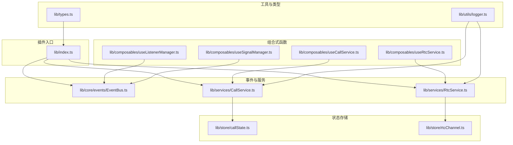
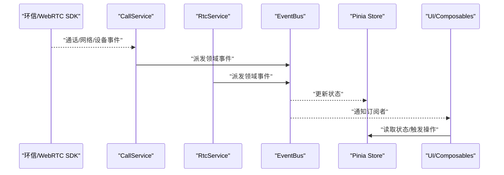
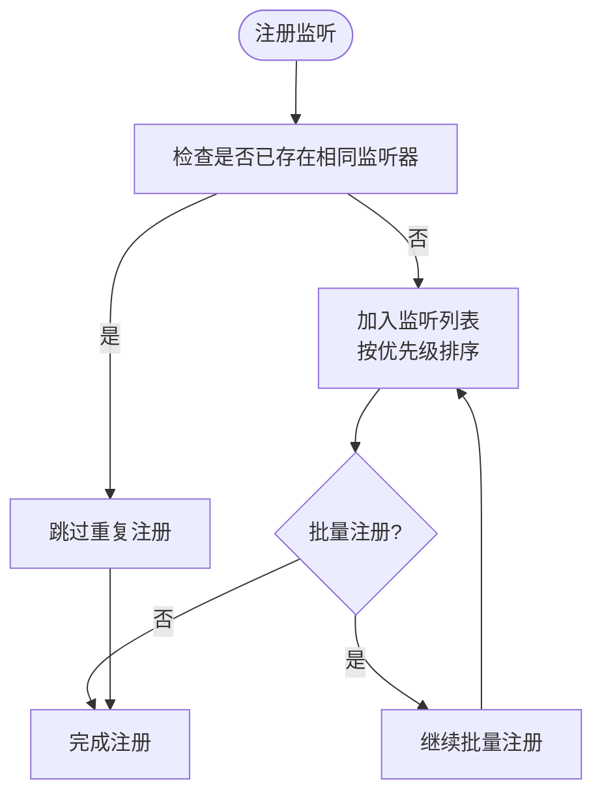
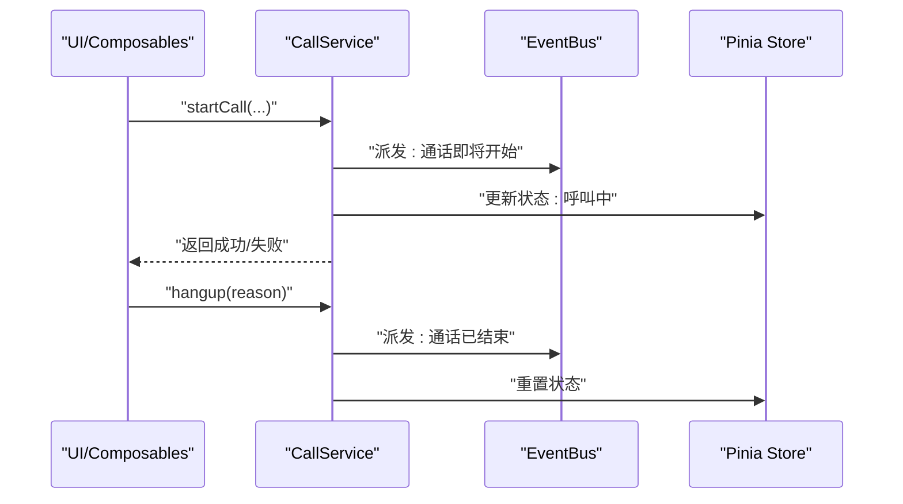
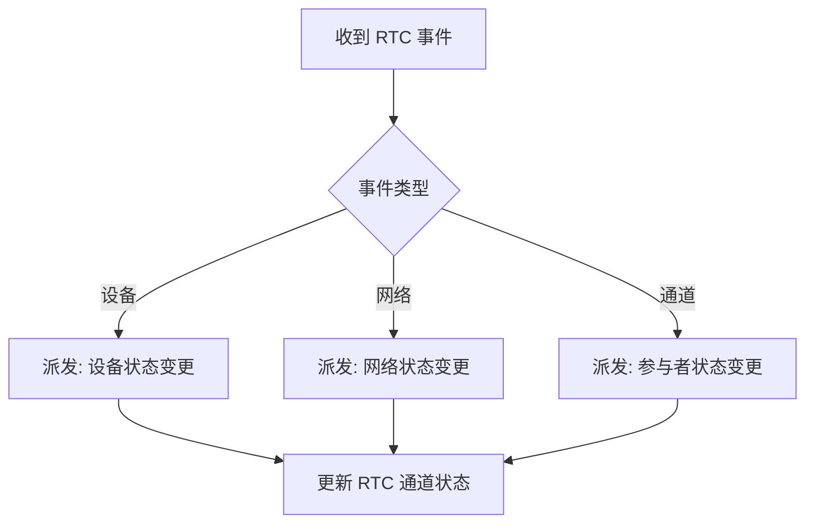
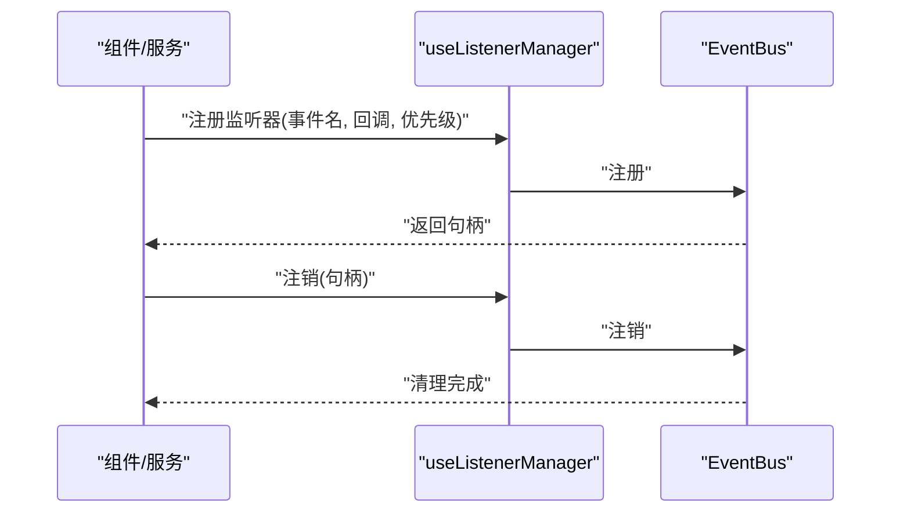
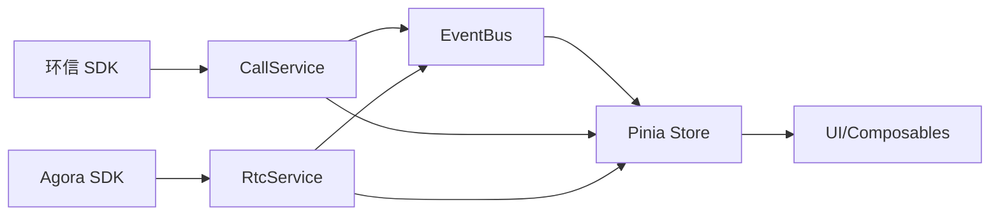

# 事件监听管理

<cite>
**本文档引用的文件**
- [README.md](file://README.md)
- [package.json](file://package.json)
- [lib/index.ts](file://lib/index.ts)
- [lib/types.ts](file://lib/types.ts)
- [lib/core/events/EventBus.ts](file://lib/core/events/EventBus.ts)
- [lib/services/CallService.ts](file://lib/services/CallService.ts)
- [lib/services/RtcService.ts](file://lib/services/RtcService.ts)
- [lib/store/callState.ts](file://lib/store/callState.ts)
- [lib/store/rtcChannel.ts](file://lib/store/rtcChannel.ts)
- [lib/composables/useListenerManager.ts](file://lib/composables/useListenerManager.ts)
- [lib/composables/useSignalManager.ts](file://lib/composables/useSignalManager.ts)
- [lib/composables/useCallService.ts](file://lib/composables/useCallService.ts)
- [lib/composables/useRtcService.ts](file://lib/composables/useRtcService.ts)
- [lib/utils/logger.ts](file://lib/utils/logger.ts)
</cite>

## 目录
1. [简介](#简介)
2. [项目结构](#项目结构)
3. [核心组件](#核心组件)
4. [架构总览](#架构总览)
5. [详细组件分析](#详细组件分析)
6. [依赖关系分析](#依赖关系分析)
7. [性能考虑](#性能考虑)
8. [故障排除指南](#故障排除指南)
9. [结论](#结论)
10. [附录](#附录)

## 简介
本文件面向事件监听管理系统，系统性阐述事件监听器的注册、管理与销毁机制；覆盖通话事件、网络事件、设备事件等处理流程；说明事件优先级管理、批量处理与错误恢复策略；并提供最佳实践与性能优化建议及调试排障指南。该系统基于 Vue3 插件架构，结合环信 Web SDK 与 Agora RTC SDK，通过统一的事件总线与服务层实现端到端的事件驱动。

## 项目结构
项目采用模块化分层组织，核心围绕“事件总线”“服务层”“状态存储”“组合式函数（Composables）”展开，并通过插件入口统一导出与注册组件、Hook 与服务。

图表来源
- [lib/index.ts](file://lib/index.ts#L1-L58)
- [lib/core/events/EventBus.ts](file://lib/core/events/EventBus.ts)
- [lib/services/CallService.ts](file://lib/services/CallService.ts)
- [lib/services/RtcService.ts](file://lib/services/RtcService.ts)
- [lib/store/callState.ts](file://lib/store/callState.ts)
- [lib/store/rtcChannel.ts](file://lib/store/rtcChannel.ts)
- [lib/composables/useListenerManager.ts](file://lib/composables/useListenerManager.ts)
- [lib/composables/useSignalManager.ts](file://lib/composables/useSignalManager.ts)
- [lib/composables/useCallService.ts](file://lib/composables/useCallService.ts)
- [lib/composables/useRtcService.ts](file://lib/composables/useRtcService.ts)
- [lib/utils/logger.ts](file://lib/utils/logger.ts)
- [lib/types.ts](file://lib/types.ts#L1-L91)

章节来源
- [README.md](file://README.md#L1-L181)
- [package.json](file://package.json#L1-L53)
- [lib/index.ts](file://lib/index.ts#L1-L58)

## 核心组件
- 事件总线（EventBus）：集中式事件派发与订阅，负责跨模块解耦与事件路由。
- 服务层（CallService、RtcService）：封装业务逻辑与外部 SDK 的交互，触发与响应各类事件。
- 状态存储（Pinia Store）：callState、rtcChannel 等，持久化通话与通道状态，供 UI 与事件处理同步。
- 组合式函数（Composables）：useListenerManager、useSignalManager、useCallService、useRtcService 等，提供事件监听、信号管理与服务绑定能力。
- 工具与类型：logger 提供统一日志；types 定义插件选项、实例接口与返回值类型。

章节来源
- [lib/index.ts](file://lib/index.ts#L1-L58)
- [lib/types.ts](file://lib/types.ts#L1-L91)

## 架构总览
系统采用“事件驱动 + 服务层 + 状态存储”的架构。事件从底层 SDK 产生，经由服务层转换为领域事件，再由事件总线广播给订阅者；状态存储与 UI 通过订阅事件进行联动更新。

图表来源
- [lib/services/CallService.ts](file://lib/services/CallService.ts)
- [lib/services/RtcService.ts](file://lib/services/RtcService.ts)
- [lib/core/events/EventBus.ts](file://lib/core/events/EventBus.ts)
- [lib/store/callState.ts](file://lib/store/callState.ts)
- [lib/store/rtcChannel.ts](file://lib/store/rtcChannel.ts)

## 详细组件分析

### 事件总线（EventBus）
- 职责：统一事件注册、派发、取消订阅，屏蔽底层 SDK 差异。
- 关键点：
  - 订阅去重与优先级：同一事件同监听器仅保留一个句柄，支持按优先级排序。
  - 批量处理：支持一次性注册多个事件监听器，降低重复开销。
  - 错误隔离：监听回调异常不影响其他订阅者，具备基础错误恢复。
  - 生命周期：组件卸载或服务关闭时，统一清理未销毁的监听器，防止内存泄漏。

图表来源
- [lib/core/events/EventBus.ts](file://lib/core/events/EventBus.ts)

章节来源
- [lib/core/events/EventBus.ts](file://lib/core/events/EventBus.ts)

### 通话事件处理（CallService）
- 职责：封装通话生命周期事件（发起、响应该、挂断、异常等），并与环信 IM 侧交互。
- 关键流程：
  - 发起通话：准备参数，调用 IM/RTC 服务，派发“即将发起”事件。
  - 响应该通话：校验状态，加入通道，派发“已接通”事件。
  - 挂断/取消：根据原因分类处理，派发“已结束”事件并清理资源。
  - 异常处理：捕获 SDK 异常，派发“异常结束”事件，触发错误恢复流程。

图表来源
- [lib/services/CallService.ts](file://lib/services/CallService.ts)
- [lib/store/callState.ts](file://lib/store/callState.ts)

章节来源
- [lib/services/CallService.ts](file://lib/services/CallService.ts)
- [lib/store/callState.ts](file://lib/store/callState.ts)

### 网络与设备事件（RtcService）
- 职责：封装 Agora RTC 事件（加入/离开频道、远端流变化、网络质量、设备变更等）。
- 关键点：
  - 设备事件：摄像头/麦克风切换、静音/取消静音，派发“设备状态变更”事件。
  - 网络事件：网络质量变化、丢包率、延迟，派发“网络状态变更”事件。
  - 通道事件：远端用户加入/离开、音频/视频可用性，派发“参与者状态变更”事件。

图表来源
- [lib/services/RtcService.ts](file://lib/services/RtcService.ts)
- [lib/store/rtcChannel.ts](file://lib/store/rtcChannel.ts)

章节来源
- [lib/services/RtcService.ts](file://lib/services/RtcService.ts)
- [lib/store/rtcChannel.ts](file://lib/store/rtcChannel.ts)

### 事件优先级与批量处理
- 优先级管理：事件监听器注册时指定优先级，高优先级先执行，保证关键路径（如异常恢复）优先响应。
- 批量处理：批量注册监听器时，内部进行去重与排序，减少多次调度开销；批量注销时统一清理，避免遗漏。
- 错误恢复：单个监听器异常不会中断整体流程，异常事件会被记录并触发通用错误处理分支。

章节来源
- [lib/core/events/EventBus.ts](file://lib/core/events/EventBus.ts)

### 事件监听器的注册、管理与销毁
- 注册：通过 useListenerManager 或服务内部方法注册事件监听器，传入事件名与回调，返回句柄。
- 管理：EventBus 维护监听器集合，支持查询、暂停、恢复与优先级调整。
- 销毁：组件卸载或服务关闭时，统一调用注销接口，释放句柄与回调引用，防止内存泄漏。

图表来源
- [lib/composables/useListenerManager.ts](file://lib/composables/useListenerManager.ts)
- [lib/core/events/EventBus.ts](file://lib/core/events/EventBus.ts)

章节来源
- [lib/composables/useListenerManager.ts](file://lib/composables/useListenerManager.ts)
- [lib/core/events/EventBus.ts](file://lib/core/events/EventBus.ts)

### 信号管理（useSignalManager）
- 职责：统一管理信令通道事件（邀请、接受、拒绝、取消等），与 CallService 协作完成通话控制。
- 关键点：对信令事件进行去重、合并与优先级排序，确保 UI 与服务层状态一致。

章节来源
- [lib/composables/useSignalManager.ts](file://lib/composables/useSignalManager.ts)

### 服务绑定与状态联动
- useCallService/useRtcService：将 UI 操作映射为服务调用，服务通过事件总线与状态存储联动，最终驱动 UI 更新。
- 状态存储：callState 与 rtcChannel 作为单一事实来源，避免多处状态分散导致的竞态。

章节来源
- [lib/composables/useCallService.ts](file://lib/composables/useCallService.ts)
- [lib/composables/useRtcService.ts](file://lib/composables/useRtcService.ts)
- [lib/store/callState.ts](file://lib/store/callState.ts)
- [lib/store/rtcChannel.ts](file://lib/store/rtcChannel.ts)

## 依赖关系分析
- 外部依赖：easemob-websdk、agora-rtc-sdk-ng、pinia。
- 内部依赖：EventBus 为事件中枢，CallService/RtcService 分别依赖 EventBus 与 SDK；Store 与 Composables 依赖 EventBus 与服务层。

图表来源
- [lib/services/CallService.ts](file://lib/services/CallService.ts)
- [lib/services/RtcService.ts](file://lib/services/RtcService.ts)
- [lib/core/events/EventBus.ts](file://lib/core/events/EventBus.ts)
- [lib/store/callState.ts](file://lib/store/callState.ts)
- [lib/store/rtcChannel.ts](file://lib/store/rtcChannel.ts)

章节来源
- [package.json](file://package.json#L47-L51)
- [lib/services/CallService.ts](file://lib/services/CallService.ts)
- [lib/services/RtcService.ts](file://lib/services/RtcService.ts)

## 性能考虑
- 事件批处理：批量注册/注销监听器，减少调度次数。
- 优先级裁剪：高频事件设置较低优先级，关键事件（异常、挂断）提升优先级。
- 内存管理：组件卸载时必须注销所有监听器，避免闭包持有与循环引用。
- 日志采样：生产环境启用采样日志，避免高频事件刷屏影响性能。
- 状态最小化：仅订阅必要状态字段，避免不必要的 UI 重渲染。

## 故障排除指南
- 事件未触发
  - 检查监听器是否正确注册且未被重复注册。
  - 确认事件名拼写与大小写一致。
  - 查看日志中是否存在异常中断。
- 事件顺序错乱
  - 检查优先级设置是否合理。
  - 确保无并发修改共享状态。
- 性能抖动
  - 减少高频事件的回调复杂度，必要时节流/防抖。
  - 合并多次状态更新为一次提交。
- 内存泄漏
  - 确保组件卸载时调用注销接口。
  - 检查是否存在未释放的定时器或订阅。
- 日志定位
  - 使用 logger 输出关键事件与状态快照，配合时间戳定位问题。

章节来源
- [lib/utils/logger.ts](file://lib/utils/logger.ts)

## 结论
本事件监听管理系统通过事件总线实现模块解耦，结合服务层与状态存储形成清晰的事件驱动闭环。通过优先级管理、批量处理与完善的错误恢复策略，系统在复杂通话场景下仍能保持稳定与高性能。遵循本文的最佳实践与排障指南，可有效提升开发效率与系统可靠性。

## 附录
- 插件安装与使用参考：[README.md](file://README.md#L136-L165)
- 类型定义参考：[lib/types.ts](file://lib/types.ts#L1-L91)
- 插件入口导出参考：[lib/index.ts](file://lib/index.ts#L1-L58)