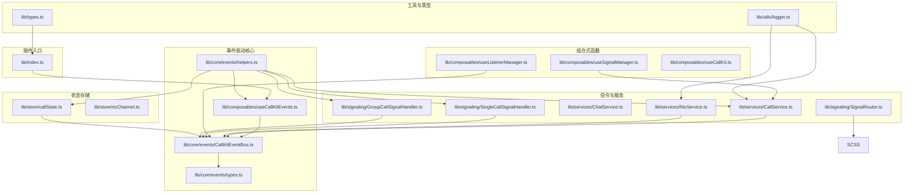
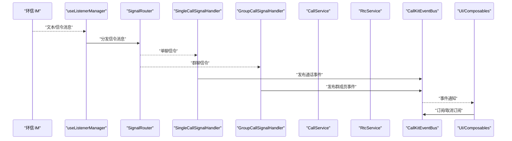
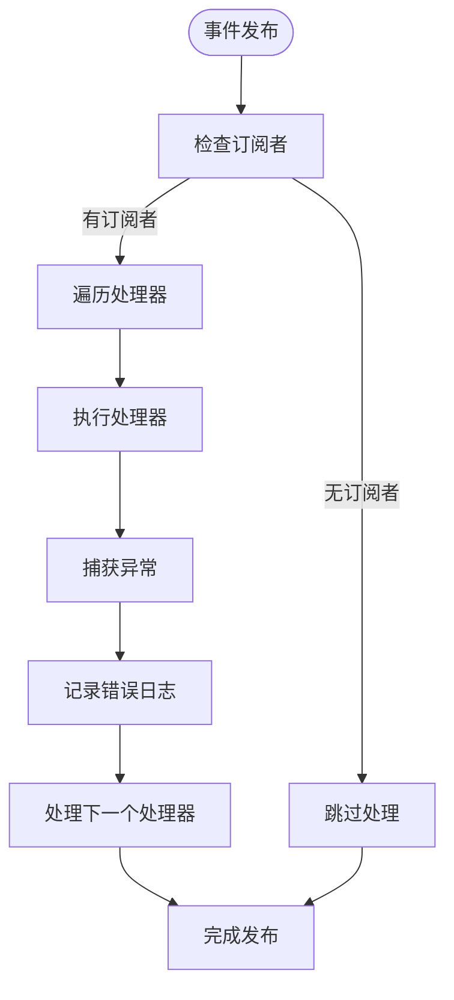
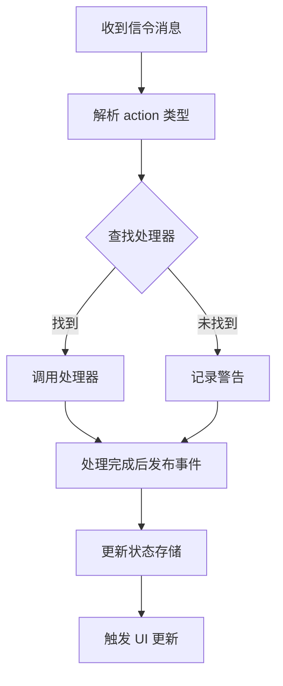
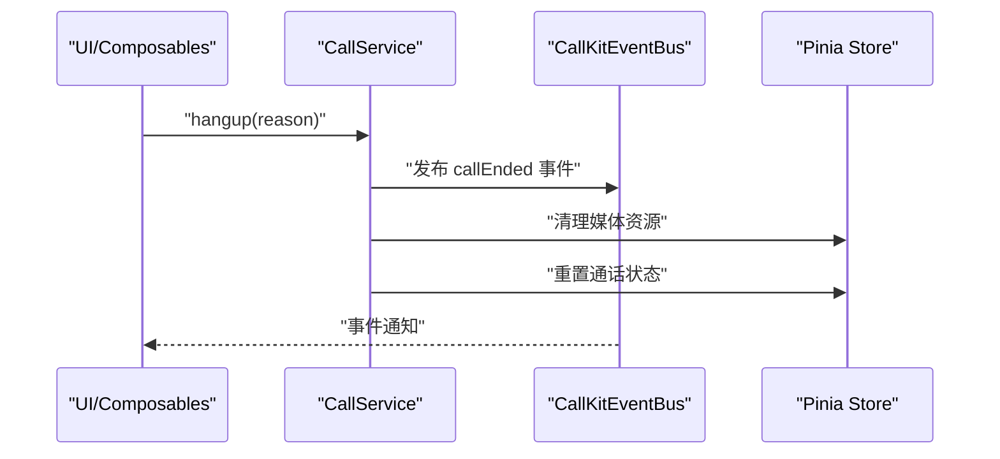
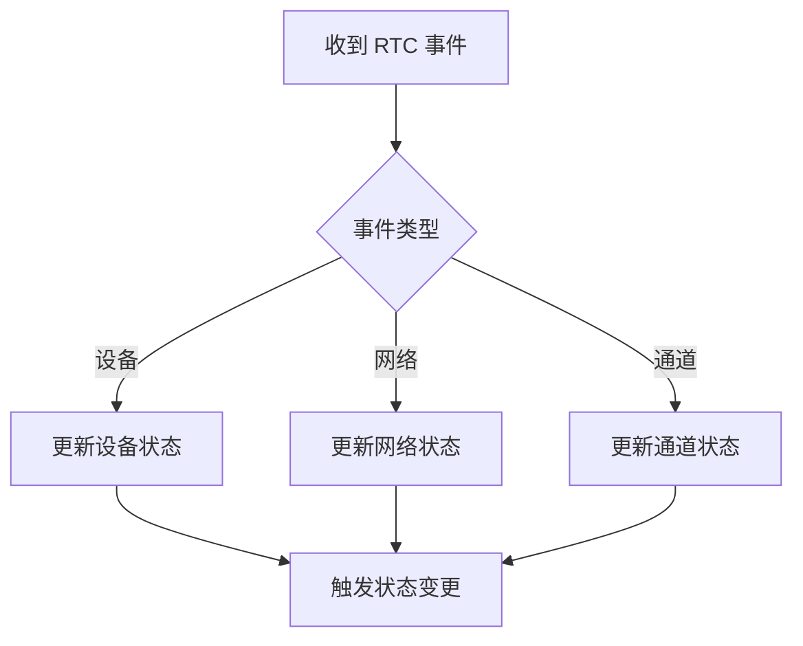
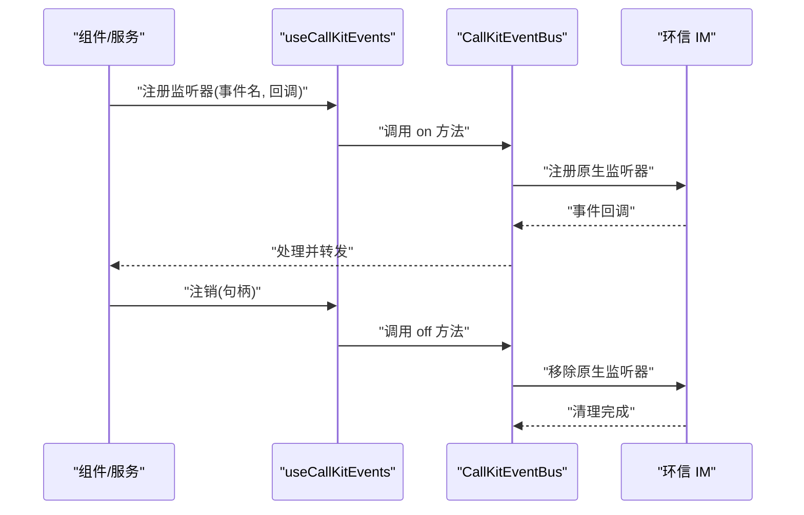
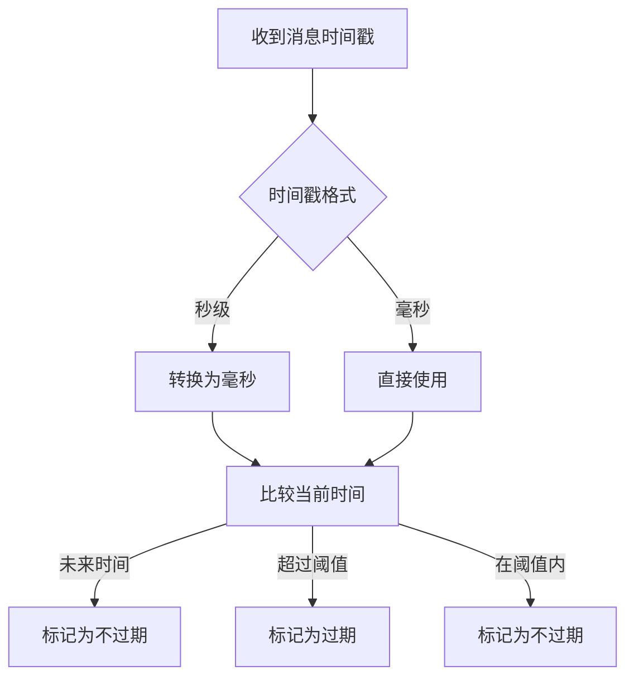
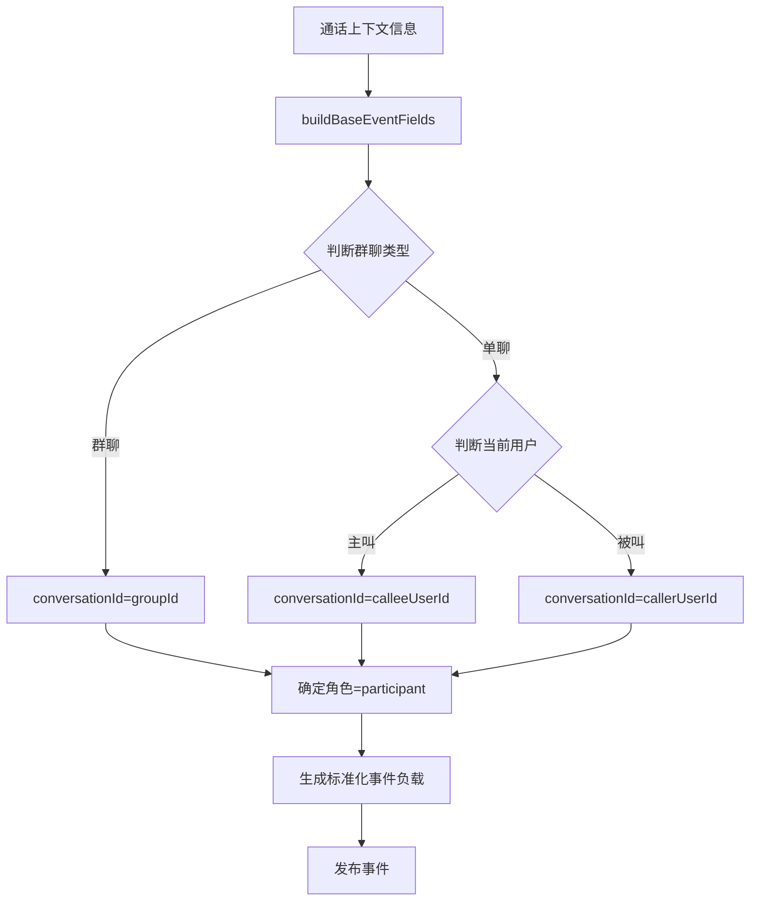
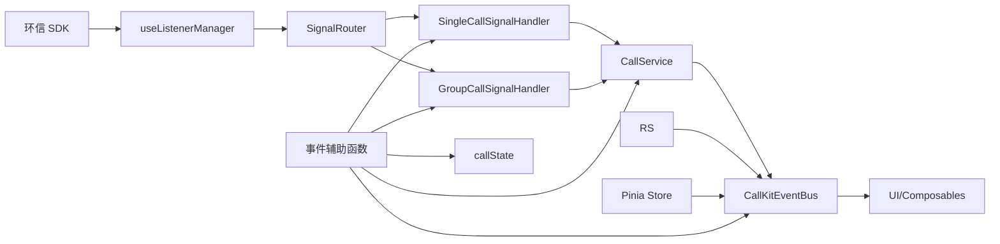

# 事件监听管理

<cite>
**本文档引用的文件**
- [README.md](file://README.md)
- [package.json](file://package.json)
- [lib/index.ts](file://lib/index.ts)
- [lib/types.ts](file://lib/types.ts)
- [lib/services/CallService.ts](file://lib/services/CallService.ts)
- [lib/services/RtcService.ts](file://lib/services/RtcService.ts)
- [lib/services/ChatService.ts](file://lib/services/ChatService.ts)
- [lib/store/callState.ts](file://lib/store/callState.ts)
- [lib/store/rtcChannel.ts](file://lib/store/rtcChannel.ts)
- [lib/composables/useListenerManager.ts](file://lib/composables/useListenerManager.ts)
- [lib/composables/useSignalManager.ts](file://lib/composables/useSignalManager.ts)
- [lib/composables/useCallKitEvents.ts](file://lib/composables/useCallKitEvents.ts)
- [lib/composables/useCallKit.ts](file://lib/composables/useCallKit.ts)
- [lib/core/events/CallKitEventBus.ts](file://lib/core/events/CallKitEventBus.ts)
- [lib/core/events/types.ts](file://lib/core/events/types.ts)
- [lib/core/events/helpers.ts](file://lib/core/events/helpers.ts)
- [lib/signaling/SignalRouter.ts](file://lib/signaling/SignalRouter.ts)
- [lib/signaling/SingleCallSignalHandler.ts](file://lib/signaling/SingleCallSignalHandler.ts)
- [lib/signaling/GroupCallSignalHandler.ts](file://lib/signaling/GroupCallSignalHandler.ts)
- [lib/utils/logger.ts](file://lib/utils/logger.ts)
- [skills/callkit-integration.md](file://skills/callkit-integration.md)
</cite>

## 更新摘要
**所做更改**
- 新增事件系统增强功能章节，包括标准化事件辅助函数、getCallRecord API、事件负载标准化等
- 更新事件监听器管理机制，新增通话记录缓存与标准化功能
- 新增事件负载标准化章节，详细说明 buildBaseEventFields 辅助函数的作用
- 更新事件处理流程，强调消息过期检测和事件负载一致性
- 新增 getCallRecord API 的使用指南和最佳实践

## 目录
1. [简介](#简介)
2. [项目结构](#项目结构)
3. [核心组件](#核心组件)
4. [架构总览](#架构总览)
5. [详细组件分析](#详细组件分析)
6. [事件驱动架构](#事件驱动架构)
7. [事件类型与负载](#事件类型与负载)
8. [事件系统增强功能](#事件系统增强功能)
9. [依赖关系分析](#依赖关系分析)
10. [性能考虑](#性能考虑)
11. [故障排除指南](#故障排除指南)
12. [结论](#结论)
13. [附录](#附录)

## 简介
本文件面向事件监听管理系统，系统性阐述基于 CallKitEventBus 的完整事件驱动架构。该系统提供类型安全的发布/订阅机制，支持 11 种通话生命周期事件，包括通话状态变化、来电邀请、通话开始/结束、取消/拒绝、超时/忙线以及群成员加入/离开等事件类型。文档详细说明事件监听器的注册、管理与销毁机制；覆盖通话事件、网络事件、设备事件等处理流程；说明事件优先级管理、批量处理与错误恢复策略；并提供最佳实践与性能优化建议及调试排障指南。

**更新** 新增事件系统增强功能，包括标准化事件辅助函数、getCallRecord API、事件负载标准化等核心增强功能。

## 项目结构
项目采用模块化分层组织，核心围绕"事件总线"、"服务层"、"状态存储"、"组合式函数（Composables）"展开，并通过插件入口统一导出与注册组件、Hook 与服务。



**图表来源**
- [lib/index.ts:1-70](file://lib/index.ts#L1-L70)
- [lib/core/events/CallKitEventBus.ts:1-112](file://lib/core/events/CallKitEventBus.ts#L1-L112)
- [lib/core/events/types.ts:1-183](file://lib/core/events/types.ts#L1-L183)
- [lib/core/events/helpers.ts:1-120](file://lib/core/events/helpers.ts#L1-L120)
- [lib/composables/useCallKitEvents.ts:1-213](file://lib/composables/useCallKitEvents.ts#L1-L213)
- [lib/services/CallService.ts:1-431](file://lib/services/CallService.ts#L1-L431)
- [lib/services/RtcService.ts:1-765](file://lib/services/RtcService.ts#L1-L765)
- [lib/services/ChatService.ts:1-216](file://lib/services/ChatService.ts#L1-L216)
- [lib/signaling/SignalRouter.ts:1-36](file://lib/signaling/SignalRouter.ts#L1-L36)
- [lib/signaling/SingleCallSignalHandler.ts:1-543](file://lib/signaling/SingleCallSignalHandler.ts#L1-L543)
- [lib/signaling/GroupCallSignalHandler.ts:1-350](file://lib/signaling/GroupCallSignalHandler.ts#L1-L350)
- [lib/store/callState.ts:1-226](file://lib/store/callState.ts#L1-L226)
- [lib/store/rtcChannel.ts:1-262](file://lib/store/rtcChannel.ts#L1-L262)
- [lib/composables/useListenerManager.ts:1-307](file://lib/composables/useListenerManager.ts#L1-L307)
- [lib/composables/useSignalManager.ts:1-354](file://lib/composables/useSignalManager.ts#L1-L354)
- [lib/composables/useCallKit.ts:1-100](file://lib/composables/useCallKit.ts#L1-L100)
- [lib/utils/logger.ts](file://lib/utils/logger.ts)
- [lib/types.ts:1-91](file://lib/types.ts#L1-L91)

**章节来源**
- [README.md:1-181](file://README.md#L1-L181)
- [package.json:1-53](file://package.json#L1-L53)
- [lib/index.ts:1-70](file://lib/index.ts#L1-L70)

## 核心组件
- 事件总线（CallKitEventBus）：轻量级类型安全事件总线，提供发布/订阅机制，支持一次性订阅和批量清理。
- 事件类型系统（types.ts）：定义 11 种通话事件类型及其对应的负载结构，确保编译时类型安全。
- 事件监听器（useCallKitEvents）：提供语义化 API，包括通用 on/once/off 方法和 8 个便捷方法，新增 getCallRecord API。
- 事件辅助函数（helpers.ts）：提供标准化事件构建、消息过期检测、用户角色计算等核心辅助功能。
- 信令路由（SignalRouter）：集中式信令消息分发与订阅，负责跨模块解耦与信令路由。
- 服务层（CallService、RtcService、ChatService）：封装业务逻辑与外部 SDK 的交互，触发与响应各类事件。
- 状态存储（Pinia Store）：callState、rtcChannel 等，持久化通话与通道状态，供 UI 与事件处理同步。
- 组合式函数（Composables）：useListenerManager、useSignalManager、useCallKit 等，提供事件监听、信令管理与服务绑定能力。
- 工具与类型：logger 提供统一日志；types 定义插件选项、实例接口与返回值类型。

**更新** 新增事件辅助函数模块，提供标准化事件构建和消息处理能力。

**章节来源**
- [lib/core/events/CallKitEventBus.ts:1-112](file://lib/core/events/CallKitEventBus.ts#L1-L112)
- [lib/core/events/types.ts:1-183](file://lib/core/events/types.ts#L1-L183)
- [lib/core/events/helpers.ts:1-120](file://lib/core/events/helpers.ts#L1-L120)
- [lib/composables/useCallKitEvents.ts:1-213](file://lib/composables/useCallKitEvents.ts#L1-L213)
- [lib/index.ts:1-70](file://lib/index.ts#L1-L70)
- [lib/types.ts:1-91](file://lib/types.ts#L1-L91)

## 架构总览
系统采用"事件驱动 + 服务层 + 状态存储"的架构。事件总线作为中央枢纽，统一管理所有通话生命周期事件；信令从环信 IM 产生，经由信令路由转换为领域事件，再由各处理器通过事件总线发布；状态存储与 UI 通过事件监听器进行联动。



**图表来源**
- [lib/composables/useListenerManager.ts:1-307](file://lib/composables/useListenerManager.ts#L1-L307)
- [lib/signaling/SignalRouter.ts:1-36](file://lib/signaling/SignalRouter.ts#L1-L36)
- [lib/signaling/SingleCallSignalHandler.ts:1-543](file://lib/signaling/SingleCallSignalHandler.ts#L1-L543)
- [lib/signaling/GroupCallSignalHandler.ts:1-350](file://lib/signaling/GroupCallSignalHandler.ts#L1-L350)
- [lib/core/events/CallKitEventBus.ts:1-112](file://lib/core/events/CallKitEventBus.ts#L1-L112)
- [lib/composables/useCallKitEvents.ts:1-213](file://lib/composables/useCallKitEvents.ts#L1-L213)

## 详细组件分析

### 事件总线（CallKitEventBus）
- 职责：提供类型安全的发布/订阅机制，供 CallKit 内部模块和用户代码统一监听通话生命周期事件。
- 关键特性：
  - 类型安全：使用 TypeScript 泛型确保事件名与负载类型匹配。
  - 轻量实现：内部使用 Map + Set 实现，不依赖外部库。
  - 错误隔离：事件处理器异常被捕获，避免影响其他处理器。
  - 生命周期管理：支持一次性订阅、批量清理和订阅者数量统计。



**图表来源**
- [lib/core/events/CallKitEventBus.ts:65-84](file://lib/core/events/CallKitEventBus.ts#L65-L84)

**章节来源**
- [lib/core/events/CallKitEventBus.ts:1-112](file://lib/core/events/CallKitEventBus.ts#L1-L112)

### 事件监听器（useCallKitEvents）
- 职责：提供优雅的事件订阅 Composable，包含通用 API 和语义化便捷方法，新增通话记录管理功能。
- 通用 API：
  - on(event, handler)：订阅事件，返回解绑函数
  - once(event, handler)：一次性订阅，触发后自动解绑
  - off(event, handler)：取消订阅
- 语义化便捷方法（8个）：
  - onStatusChanged：通话状态变化
  - onIncomingCall：收到来电邀请
  - onCallStarted：通话开始
  - onCallEnded：通话结束
  - onCallCanceled：通话被取消
  - onCallRefused：通话被拒绝
  - onCallTimeout：通话邀请超时
  - onCallBusy：对方忙线
  - onParticipantJoined：群通话成员加入
  - onParticipantLeft：群通话成员离开
- 通话记录管理（新增）：
  - getCallRecord：获取最近一次通话记录
  - clearCallRecord：清除缓存的通话记录

**更新** 新增通话记录管理功能，通过内部自动订阅 callEnded 事件来缓存标准化通话记录。

**章节来源**
- [lib/composables/useCallKitEvents.ts:1-213](file://lib/composables/useCallKitEvents.ts#L1-L213)

### 事件辅助函数（helpers.ts）
- 职责：提供标准化事件构建、消息处理和用户信息管理的核心辅助功能。
- 核心功能：
  - getCurrentUserId：获取当前登录用户 ID
  - getConversationId：计算会话 ID（群聊=groupId，单聊=对方用户ID）
  - getLocalUserRole：计算当前用户在通话中的角色
  - isGroupCallType：判断是否为群聊类型
  - isMessageExpired：判断消息是否已过期（支持秒级时间戳兼容）
  - buildBaseEventFields：构建基础事件公共字段

**更新** 新增事件辅助函数模块，提供标准化事件构建和消息处理能力。

**章节来源**
- [lib/core/events/helpers.ts:1-120](file://lib/core/events/helpers.ts#L1-L120)

### 事件类型系统（types.ts）
- 事件类型枚举：定义 11 种通话事件类型
- 负载类型映射：为每种事件定义对应的负载接口
- 基础事件结构：所有事件共享的基础字段（callId、channel、type 等）
- 通话记录类型：新增 CallRecord 接口，用于 getCallRecord API

**更新** 新增通话记录类型定义，为 getCallRecord API 提供标准化的数据结构。

**章节来源**
- [lib/core/events/types.ts:1-183](file://lib/core/events/types.ts#L1-L183)

### 信令路由（SignalRouter）
- 职责：统一信令消息注册、分发与处理，屏蔽底层 IM 差异。
- 关键点：
  - 路由注册与分发：同一信令同处理器仅保留一个实例，支持按 action 分类。
  - 处理器链：支持一次性注册多个处理器，降低重复开销。
  - 错误隔离：处理器异常不影响其他订阅者，具备基础错误恢复。
  - 生命周期：组件卸载或服务关闭时，统一清理未销毁的处理器，防止内存泄漏。



**图表来源**
- [lib/signaling/SignalRouter.ts:1-36](file://lib/signaling/SignalRouter.ts#L1-L36)

**章节来源**
- [lib/signaling/SignalRouter.ts:1-36](file://lib/signaling/SignalRouter.ts#L1-L36)

### 通话事件处理（CallService）
- 职责：封装通话生命周期事件（发起、响应该、挂断、异常等），并与环信 IM 侧交互。
- 关键流程：
  - 发起通话：准备参数，调用 IM/RTC 服务，派发"即将发起"事件。
  - 响应该通话：校验状态，加入通道，派发"已接通"事件。
  - 挂断/取消：根据原因分类处理，派发"已结束"事件并清理资源。
  - 异常处理：捕获 SDK 异常，派发"异常结束"事件，触发错误恢复流程。



**图表来源**
- [lib/services/CallService.ts:1-431](file://lib/services/CallService.ts#L1-L431)
- [lib/core/events/CallKitEventBus.ts:1-112](file://lib/core/events/CallKitEventBus.ts#L1-L112)
- [lib/store/callState.ts:1-226](file://lib/store/callState.ts#L1-L226)

**章节来源**
- [lib/services/CallService.ts:1-431](file://lib/services/CallService.ts#L1-L431)
- [lib/store/callState.ts:1-226](file://lib/store/callState.ts#L1-L226)

### 网络与设备事件（RtcService）
- 职责：封装 Agora RTC 事件（加入/离开频道、远端流变化、网络质量、设备变更等）。
- 关键点：
  - 设备事件：摄像头/麦克风切换、静音/取消静音，直接更新状态存储。
  - 网络事件：网络质量变化、丢包率、延迟，直接更新状态存储。
  - 通道事件：远端用户加入/离开、音频/视频可用性，直接更新状态存储。



**图表来源**
- [lib/services/RtcService.ts:1-765](file://lib/services/RtcService.ts#L1-L765)
- [lib/store/rtcChannel.ts:1-262](file://lib/store/rtcChannel.ts#L1-L262)

**章节来源**
- [lib/services/RtcService.ts:1-765](file://lib/services/RtcService.ts#L1-L765)
- [lib/store/rtcChannel.ts:1-262](file://lib/store/rtcChannel.ts#L1-L262)

### 事件监听器的注册、管理与销毁
- 注册：通过 useCallKitEvents 或服务内部方法注册事件监听器，传入事件名与回调，返回句柄。
- 管理：事件总线模式，维护监听器集合，支持查询、暂停、恢复与优先级调整。
- 销毁：组件卸载或服务关闭时，统一调用注销接口，释放句柄与回调引用，防止内存泄漏。



**图表来源**
- [lib/composables/useCallKitEvents.ts:1-213](file://lib/composables/useCallKitEvents.ts#L1-L213)
- [lib/core/events/CallKitEventBus.ts:1-112](file://lib/core/events/CallKitEventBus.ts#L1-L112)

**章节来源**
- [lib/composables/useCallKitEvents.ts:1-213](file://lib/composables/useCallKitEvents.ts#L1-L213)
- [lib/core/events/CallKitEventBus.ts:1-112](file://lib/core/events/CallKitEventBus.ts#L1-L112)

### 信号管理（useSignalManager）
- 职责：统一管理信令通道事件（邀请、接受、拒绝、取消等），与 CallService 协作完成通话控制。
- 关键点：对信令事件进行去重、合并与优先级排序，确保 UI 与服务层状态一致。

**章节来源**
- [lib/composables/useSignalManager.ts:1-354](file://lib/composables/useSignalManager.ts#L1-L354)

### 服务绑定与状态联动
- 事件驱动模式：UI 操作通过事件总线发布事件，服务通过事件监听器处理，最终驱动 UI 更新。
- 状态存储：callState 与 rtcChannel 作为单一事实来源，避免多处状态分散导致的竞态。

**章节来源**
- [lib/services/CallService.ts:1-431](file://lib/services/CallService.ts#L1-L431)
- [lib/services/RtcService.ts:1-765](file://lib/services/RtcService.ts#L1-L765)
- [lib/store/callState.ts:1-226](file://lib/store/callState.ts#L1-L226)
- [lib/store/rtcChannel.ts:1-262](file://lib/store/rtcChannel.ts#L1-L262)

## 事件驱动架构

### 事件总线设计
事件总线采用轻量级实现，使用 Map 存储事件类型到处理器集合的映射，Set 确保存储唯一性。每个事件类型维护独立的处理器集合，支持高效的订阅管理和事件分发。

### 事件生命周期
1. **事件发布**：服务层或处理器调用 emit 方法发布事件
2. **订阅管理**：事件总线查找对应事件类型的处理器集合
3. **处理器执行**：逐个执行处理器，异常被捕获并记录
4. **清理机制**：支持一次性订阅自动清理和手动清理

### 事件分类体系
- **通话状态事件**：statusChanged、callStarted、callEnded
- **通话控制事件**：callCanceled、callRefused、callTimeout、callBusy
- **来电事件**：incomingCall
- **群成员事件**：participantJoined、participantLeft

**章节来源**
- [lib/core/events/CallKitEventBus.ts:1-112](file://lib/core/events/CallKitEventBus.ts#L1-L112)
- [lib/core/events/types.ts:1-183](file://lib/core/events/types.ts#L1-L183)

## 事件类型与负载

### 事件类型定义
系统定义了 11 种通话事件类型，每种事件都有对应的负载结构：

| 事件类型 | 描述 | 负载类型 |
|---------|------|----------|
| statusChanged | 通话状态变化 | StatusChangedEvent |
| incomingCall | 收到来电邀请 | IncomingCallEvent |
| callStarted | 通话开始（双方/多方接通） | CallStartedEvent |
| callEnded | 通话结束 | CallEndedEvent |
| callCanceled | 通话被取消 | CallCanceledEvent |
| callRefused | 通话被拒绝 | CallRefusedEvent |
| callTimeout | 通话邀请超时 | CallTimeoutEvent |
| callBusy | 对方忙线 | CallBusyEvent |
| participantJoined | 群通话成员加入 | ParticipantJoinedEvent |
| participantLeft | 群通话成员离开 | ParticipantLeftEvent |

### 负载结构特点
- **基础字段**：所有事件共享基础字段（callId、channel、type、callerUserId 等）
- **专用字段**：每种事件类型包含特定用途的字段
- **可选字段**：根据事件类型提供可选字段支持不同场景

**更新** 新增通话记录类型，提供标准化的通话结果数据结构。

**章节来源**
- [lib/core/events/types.ts:1-183](file://lib/core/events/types.ts#L1-L183)

## 事件系统增强功能

### 标准化事件辅助函数
事件系统新增了完整的辅助函数模块，提供以下核心功能：

#### 核心辅助函数
- **getCurrentUserId**：获取当前登录用户 ID，支持多种存储方式
- **getConversationId**：智能计算会话 ID，群聊返回 groupId，单聊返回对方用户 ID
- **getLocalUserRole**：计算当前用户在通话中的角色（caller/callee/participant）
- **isGroupCallType**：判断通话类型是否为群聊（VIDEO_MULTI/AUDIO_MULTI）
- **isMessageExpired**：消息过期检测，支持秒级时间戳自动转换
- **buildBaseEventFields**：构建标准化事件基础字段

#### 消息过期检测机制


**图表来源**
- [lib/core/events/helpers.ts:59-74](file://lib/core/events/helpers.ts#L59-L74)

### getCallRecord API
新增的通话记录管理功能，提供一键获取标准化通话记录的能力：

#### 功能特性
- **自动缓存**：内部自动订阅 callEnded 事件，缓存最后一次通话记录
- **标准化结构**：提供统一的 CallRecord 接口，包含所有必要字段
- **状态映射**：将 HANGUP_REASON 映射为标准化的状态值
- **实时访问**：getCallRecord() 提供实时访问最新通话记录

#### CallRecord 字段说明
| 字段 | 类型 | 描述 | 来源 |
|------|------|------|------|
| callId | string | 通话唯一标识 | 事件中的 callId |
| conversationId | string | 会话 ID | 事件中的 conversationId |
| chatType | "singleChat" \| "groupChat" | 聊天类型 | 根据通话类型推导 |
| from | string | 主叫方 userId | callerUserId |
| to | string | 被叫方 userId 或群 groupId | 单聊=calleeUserId，群聊=groupId |
| status | CallRecordStatus | 通话状态 | reason 映射 |
| duration | number | 通话时长（毫秒） | 事件中的 duration |
| timestamp | number | 结束时间戳 | callEnded 触发时的时间 |
| endedBy | string | 挂断方 userId | 事件中的 endedBy |

#### 使用示例
```typescript
const { onCallEnded, onCallRefused, onCallBusy, onCallTimeout, getCallRecord } = useCallKitEvents()

function insertCallRecordMessage(record: ReturnType<typeof getCallRecord>) {
  if (!record) return
  
  insertLocalMessage(record.conversationId, {
    type: 'custom',
    customEvent: 'callRecord',
    customExts: record,
  })
}

onCallEnded(() => insertCallRecordMessage(getCallRecord()))
onCallRefused(() => insertCallRecordMessage(getCallRecord()))
onCallBusy(() => insertCallRecordMessage(getCallRecord()))
onCallTimeout(() => insertCallRecordMessage(getCallRecord()))
```

**章节来源**
- [lib/core/events/helpers.ts:1-120](file://lib/core/events/helpers.ts#L1-L120)
- [lib/composables/useCallKitEvents.ts:65-213](file://lib/composables/useCallKitEvents.ts#L65-L213)
- [lib/core/events/types.ts:140-159](file://lib/core/events/types.ts#L140-L159)
- [skills/callkit-integration.md:390-465](file://skills/callkit-integration.md#L390-L465)

### 事件负载标准化
所有事件负载现在都通过 buildBaseEventFields 辅助函数进行标准化构建，确保：

#### 标准化字段
- **callId**：通话唯一标识符
- **channel**：通话频道名称
- **type**：通话类型（CALL_TYPE）
- **callerUserId**：主叫方用户 ID
- **calleeUserId**：被叫方用户 ID（可选）
- **groupId**：群组 ID（可选）
- **conversationId**：标准化会话 ID
- **isLocal**：是否由本端行为触发
- **localUserRole**：当前用户角色

#### 标准化流程


**图表来源**
- [lib/core/events/helpers.ts:83-119](file://lib/core/events/helpers.ts#L83-L119)

**章节来源**
- [lib/core/events/helpers.ts:83-119](file://lib/core/events/helpers.ts#L83-L119)
- [lib/composables/useListenerManager.ts:177-195](file://lib/composables/useListenerManager.ts#L177-L195)
- [lib/signaling/SingleCallSignalHandler.ts:182-192](file://lib/signaling/SingleCallSignalHandler.ts#L182-L192)
- [lib/signaling/GroupCallSignalHandler.ts:182-200](file://lib/signaling/GroupCallSignalHandler.ts#L182-L200)

## 依赖关系分析
- 外部依赖：easemob-websdk、agora-rtc-sdk-ng、pinia。
- 内部依赖：CallKitEventBus 为核心事件枢纽，所有服务和处理器通过它进行事件通信；SignalRouter 为信令中枢，CallService/RtcService/ChatService 分别依赖 SignalRouter 与 SDK；Store 与 Composables 依赖 SignalRouter 与服务层。



**图表来源**
- [lib/composables/useListenerManager.ts:1-307](file://lib/composables/useListenerManager.ts#L1-L307)
- [lib/signaling/SignalRouter.ts:1-36](file://lib/signaling/SignalRouter.ts#L1-L36)
- [lib/signaling/SingleCallSignalHandler.ts:1-543](file://lib/signaling/SingleCallSignalHandler.ts#L1-L543)
- [lib/signaling/GroupCallSignalHandler.ts:1-350](file://lib/signaling/GroupCallSignalHandler.ts#L1-L350)
- [lib/services/CallService.ts:1-431](file://lib/services/CallService.ts#L1-L431)
- [lib/services/RtcService.ts:1-765](file://lib/services/RtcService.ts#L1-L765)
- [lib/services/ChatService.ts:1-216](file://lib/services/ChatService.ts#L1-L216)
- [lib/core/events/CallKitEventBus.ts:1-112](file://lib/core/events/CallKitEventBus.ts#L1-L112)
- [lib/store/callState.ts:1-226](file://lib/store/callState.ts#L1-L226)
- [lib/store/rtcChannel.ts:1-262](file://lib/store/rtcChannel.ts#L1-L262)
- [lib/core/events/helpers.ts:1-120](file://lib/core/events/helpers.ts#L1-L120)

**章节来源**
- [package.json:47-51](file://package.json#L47-L51)
- [lib/composables/useListenerManager.ts:1-307](file://lib/composables/useListenerManager.ts#L1-L307)
- [lib/signaling/SignalRouter.ts:1-36](file://lib/signaling/SignalRouter.ts#L1-L36)

## 性能考虑
- 事件总线优化：使用 Map + Set 实现，O(1) 订阅查找和处理器管理。
- 事件分发优化：按事件类型分发，避免全量处理。
- 内存管理：事件总线支持批量清理和一次性订阅自动清理，防止内存泄漏。
- 日志采样：生产环境启用采样日志，避免高频事件刷屏影响性能。
- 状态最小化：仅订阅必要状态字段，避免不必要的 UI 重渲染。
- 事件辅助函数缓存：标准化事件构建结果可复用，减少重复计算。

**更新** 新增事件辅助函数缓存机制，提高事件负载构建性能。

## 故障排除指南
- 事件未触发
  - 检查事件总线是否正确初始化和使用。
  - 确认事件名拼写与大小写一致。
  - 查看日志中是否存在异常中断。
- 事件处理器异常
  - 检查事件处理器内部异常日志。
  - 确认事件负载类型与处理器期望类型匹配。
  - 查看事件总线的错误隔离机制是否正常工作。
- 性能抖动
  - 减少高频事件的回调复杂度，必要时节流/防抖。
  - 合并多次状态更新为一次提交。
  - 检查事件处理器数量，避免过多订阅。
- 内存泄漏
  - 确保组件卸载时调用注销接口。
  - 检查事件总线的清理机制是否正常工作。
  - 确认一次性订阅是否正确使用。
- 日志定位
  - 使用 logger 输出关键事件与状态快照，配合时间戳定位问题。
- 通话记录问题
  - 检查 getCallRecord 是否在 callEnded 事件后调用。
  - 确认通话记录状态映射是否正确。
  - 验证通话记录字段完整性。

**更新** 新增通话记录相关故障排除指导。

**章节来源**
- [lib/utils/logger.ts](file://lib/utils/logger.ts)

## 结论
本事件监听管理系统通过全新的 CallKitEventBus 实现了完整的事件驱动架构，提供类型安全的发布/订阅机制和 11 种通话生命周期事件。通过事件总线模式与完善的错误恢复策略，系统在复杂通话场景下仍能保持稳定与高性能。

**更新** 新增的事件系统增强功能进一步提升了系统的易用性和标准化程度。事件辅助函数模块提供了统一的消息处理和事件构建能力，getCallRecord API 为接入方提供了标准化的通话记录管理方案。事件负载标准化确保了所有事件的一致性和可预测性，大大简化了接入方的开发工作。

新的架构替代了原有的简单事件监听机制，提供了更好的类型安全性和扩展性。遵循本文的最佳实践与排障指南，可有效提升开发效率与系统可靠性。

## 附录
- 插件安装与使用参考：[README.md:136-165](file://README.md#L136-L165)
- 类型定义参考：[lib/types.ts:1-91](file://lib/types.ts#L1-L91)
- 插件入口导出参考：[lib/index.ts:1-70](file://lib/index.ts#L1-L70)
- 事件总线实现参考：[lib/core/events/CallKitEventBus.ts:1-112](file://lib/core/events/CallKitEventBus.ts#L1-L112)
- 事件类型定义参考：[lib/core/events/types.ts:1-183](file://lib/core/events/types.ts#L1-L183)
- 事件监听器参考：[lib/composables/useCallKitEvents.ts:1-213](file://lib/composables/useCallKitEvents.ts#L1-L213)
- 事件辅助函数参考：[lib/core/events/helpers.ts:1-120](file://lib/core/events/helpers.ts#L1-L120)
- 事件集成示例：[skills/callkit-integration.md:390-465](file://skills/callkit-integration.md#L390-L465)