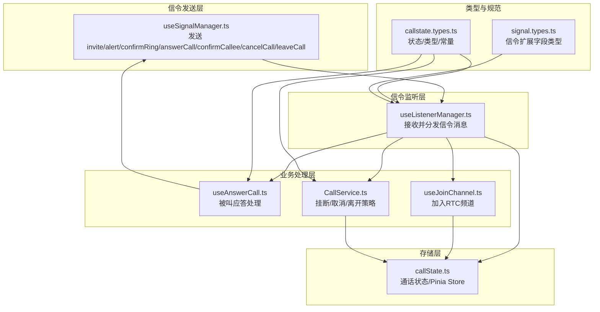
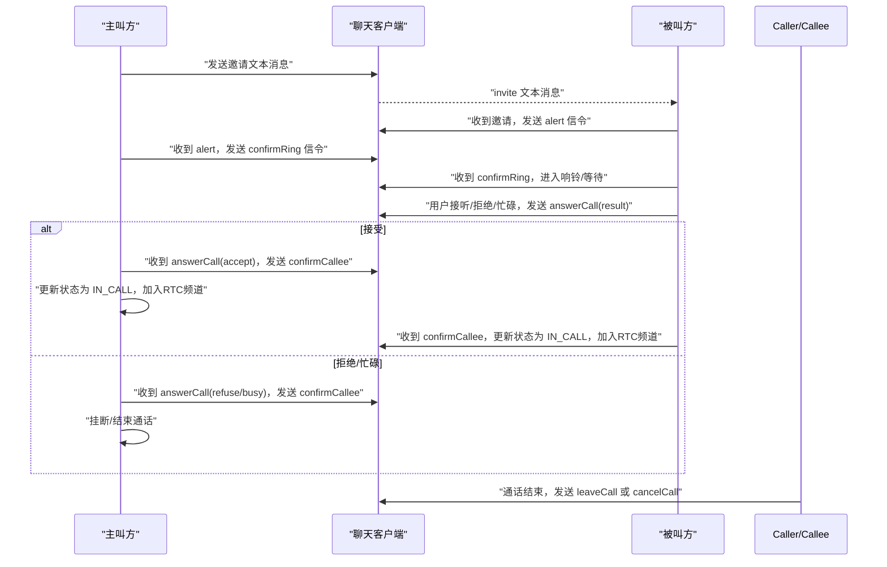
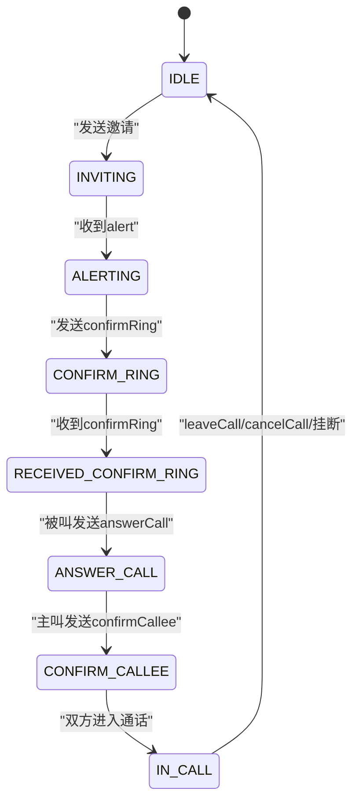
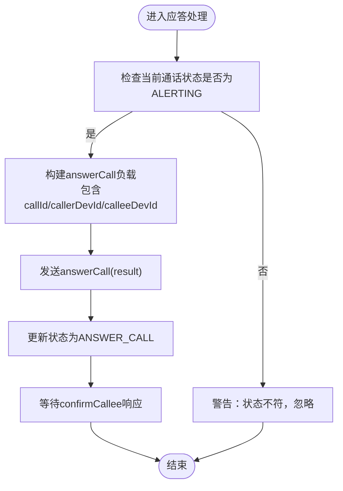
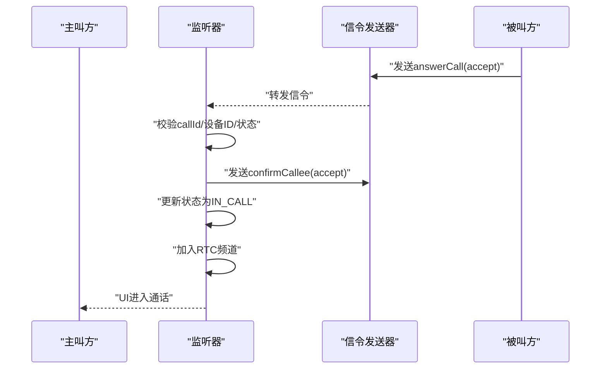
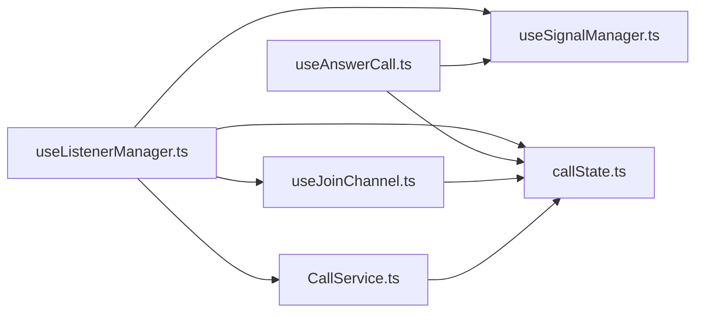

# 信令协议概述

<cite>
**本文档引用的文件**
- [SIGNALING_IMPLEMENTATION.md](file://lib/SIGNALING_IMPLEMENTATION.md)
- [useSignalManager.ts](file://lib/composables/useSignalManager.ts)
- [useListenerManager.ts](file://lib/composables/useListenerManager.ts)
- [useAnswerCall.ts](file://lib/composables/useAnswerCall.ts)
- [useJoinChannel.ts](file://lib/composables/useJoinChannel.ts)
- [CallService.ts](file://lib/services/CallService.ts)
- [callstate.types.ts](file://lib/types/callstate.types.ts)
- [signal.types.ts](file://lib/types/signal.types.ts)
- [callState.ts](file://lib/store/callState.ts)
- [index.ts](file://lib/index.ts)
</cite>

## 目录
1. [引言](#引言)
2. [项目结构](#项目结构)
3. [核心组件](#核心组件)
4. [架构总览](#架构总览)
5. [详细组件分析](#详细组件分析)
6. [依赖关系分析](#依赖关系分析)
7. [性能考虑](#性能考虑)
8. [故障排查指南](#故障排查指南)
9. [结论](#结论)
10. [附录](#附录)

## 引言
本文件面向开发者，系统性阐述一对一与群组音视频通话的信令协议基础架构与实现细节。内容覆盖信令消息定义、传输机制、协议规范、生命周期管理、状态转换规则与错误处理机制，并提供完整的流程图与消息序列图，帮助快速理解与集成。

## 项目结构
围绕信令协议的核心模块包括：
- 信令发送层：封装各类信令的发送接口，负责将命令消息通过聊天客户端发送到对端
- 信令监听层：统一接收并分发信令消息，按动作类型路由到对应处理器
- 业务处理层：根据信令进行状态机推进、UI联动与资源清理
- 存储层：集中维护通话状态、超时控制、用户信息与RTC通道状态
- 服务层：提供挂断、取消、离开等策略与媒体资源清理

图表来源
- [useSignalManager.ts](file://lib/composables/useSignalManager.ts#L50-L353)
- [useListenerManager.ts](file://lib/composables/useListenerManager.ts#L37-L683)
- [useAnswerCall.ts](file://lib/composables/useAnswerCall.ts#L20-L167)
- [useJoinChannel.ts](file://lib/composables/useJoinChannel.ts#L26-L184)
- [CallService.ts](file://lib/services/CallService.ts#L9-L297)
- [callstate.types.ts](file://lib/types/callstate.types.ts#L1-L93)
- [signal.types.ts](file://lib/types/signal.types.ts#L1-L196)
- [callState.ts](file://lib/store/callState.ts#L7-L262)

章节来源
- [useSignalManager.ts](file://lib/composables/useSignalManager.ts#L50-L353)
- [useListenerManager.ts](file://lib/composables/useListenerManager.ts#L37-L683)
- [callState.ts](file://lib/store/callState.ts#L7-L262)

## 核心组件
- 信令发送器：提供统一的信令发送接口，屏蔽底层聊天客户端差异
- 信令监听器：集中处理文本消息与命令消息，按动作类型分发
- 被叫应答器：封装被叫方接受/拒绝/忙碌拒绝的交互与信令发送
- 加入频道器：在确认阶段后触发加入RTC频道与媒体轨道发布
- 通话服务：统一挂断、取消、离开策略，负责资源清理与状态重置
- 状态存储：集中管理通话状态、超时计时、用户信息与RTC状态

章节来源
- [useSignalManager.ts](file://lib/composables/useSignalManager.ts#L50-L353)
- [useListenerManager.ts](file://lib/composables/useListenerManager.ts#L37-L683)
- [useAnswerCall.ts](file://lib/composables/useAnswerCall.ts#L20-L167)
- [useJoinChannel.ts](file://lib/composables/useJoinChannel.ts#L26-L184)
- [CallService.ts](file://lib/services/CallService.ts#L9-L297)
- [callState.ts](file://lib/store/callState.ts#L7-L262)

## 架构总览
信令协议采用“文本消息承载邀请 + 命令消息承载通话控制”的双通道设计。主叫通过文本消息发送邀请，被叫收到后发送alert；随后双方互相发送confirmRing与confirmCallee；被叫应答后，主被叫分别发送answerCall并进入IN_CALL状态，最后通过leaveCall或cancelCall结束通话。

图表来源
- [useSignalManager.ts](file://lib/composables/useSignalManager.ts#L73-L341)
- [useListenerManager.ts](file://lib/composables/useListenerManager.ts#L56-L546)
- [useAnswerCall.ts](file://lib/composables/useAnswerCall.ts#L28-L160)
- [SIGNALING_IMPLEMENTATION.md](file://lib/SIGNALING_IMPLEMENTATION.md#L105-L131)

## 详细组件分析

### 信令消息定义与传输机制
- 邀请消息（invite）：通过文本消息发送，扩展字段包含通话ID、频道名、类型、主被叫信息等
- 响铃消息（alert）：被叫收到邀请后发送，通知主叫其已收到邀请
- 确认响铃（confirmRing）：主叫收到alert后发送，确认被叫已收到并处于等待状态
- 应答消息（answerCall）：被叫应答时发送，result可为accept/refuse/busy
- 确认被叫（confirmCallee）：主叫收到answerCall后发送，确认被叫状态
- 取消通话（cancelCall）：主叫取消邀请时发送
- 离开通话（leaveCall）：任意一方结束通话时发送

章节来源
- [signal.types.ts](file://lib/types/signal.types.ts#L3-L44)
- [signal.types.ts](file://lib/types/signal.types.ts#L107-L168)
- [useSignalManager.ts](file://lib/composables/useSignalManager.ts#L73-L341)

### 一对一通话信令流程
- 主叫方流程
  1) 发送invite文本消息
  2) 收到被叫方alert信令
  3) 发送confirmRing信令
  4) 收到被叫方answerCall(result)
  5) 若result为accept：发送confirmCallee并更新状态为IN_CALL，加入RTC频道
  6) 若result为refuse/busy：发送confirmCallee并挂断
- 被叫方流程
  1) 收到invite文本消息
  2) 发送alert信令
  3) 收到主叫方confirmRing
  4) 用户点击接听：发送answerCall(accept)，更新状态为ANSWER_CALL
  5) 用户点击拒绝：发送answerCall(refuse)，重置状态为IDLE

章节来源
- [SIGNALING_IMPLEMENTATION.md](file://lib/SIGNALING_IMPLEMENTATION.md#L105-L131)
- [useListenerManager.ts](file://lib/composables/useListenerManager.ts#L56-L116)
- [useListenerManager.ts](file://lib/composables/useListenerManager.ts#L179-L212)
- [useListenerManager.ts](file://lib/composables/useListenerManager.ts#L279-L317)
- [useListenerManager.ts](file://lib/composables/useListenerManager.ts#L323-L447)
- [useAnswerCall.ts](file://lib/composables/useAnswerCall.ts#L28-L76)

### 群组通话信令流程（当前实现要点）
- 群组通话类型：VIDEO_MULTI/AUDIO_MULTI
- 邀请与确认：群组邀请通过文本消息携带扩展字段，confirmRing逻辑需检查已加入/已邀请列表
- 拒绝处理：一对一通话直接挂断，群组通话仅从邀请列表移除被拒成员
- 离开处理：群组通话仅移除离开成员，不整体会话挂断

章节来源
- [callstate.types.ts](file://lib/types/callstate.types.ts#L42-L48)
- [callState.ts](file://lib/store/callState.ts#L55-L64)
- [useListenerManager.ts](file://lib/composables/useListenerManager.ts#L390-L408)
- [useListenerManager.ts](file://lib/composables/useListenerManager.ts#L520-L538)

### 信令生命周期与状态转换
- 状态枚举与转换
  - IDLE → INVITING（发起邀请）
  - INVITING → ALERTING（收到alert）
  - ALERTING → CONFIRM_RING（发送confirmRing）
  - CONFIRM_RING → RECEIVED_CONFIRM_RING（收到confirmRing）
  - RECEIVED_CONFIRM_RING → ANSWER_CALL（被叫发送answerCall）
  - ANSWER_CALL → CONFIRM_CALLEE（主叫发送confirmCallee）
  - CONFIRM_CALLEE → IN_CALL（双方进入通话）
- 超时与异常
  - 邀请超时：一对一自动回到IDLE；群组保持等待，需手动挂断
  - 多端冲突：若非本设备处理，挂断并上报原因HANDLE_ON_OTHER_DEVICE

图表来源
- [callstate.types.ts](file://lib/types/callstate.types.ts#L13-L22)
- [callState.ts](file://lib/store/callState.ts#L114-L131)
- [useListenerManager.ts](file://lib/composables/useListenerManager.ts#L553-L618)

章节来源
- [callstate.types.ts](file://lib/types/callstate.types.ts#L13-L22)
- [callState.ts](file://lib/store/callState.ts#L114-L131)
- [useListenerManager.ts](file://lib/composables/useListenerManager.ts#L553-L618)

### 错误处理机制
- 设备ID校验：多端场景下，若非本设备处理则忽略或挂断
- 通话ID一致性：收到信令需校验callId，不一致则丢弃
- 状态前置检查：在发送/处理信令前检查当前状态，避免非法转换
- 资源清理：挂断/取消后清理媒体资源与RTC连接，重置状态

章节来源
- [useListenerManager.ts](file://lib/composables/useListenerManager.ts#L282-L296)
- [useListenerManager.ts](file://lib/composables/useListenerManager.ts#L331-L339)
- [useListenerManager.ts](file://lib/composables/useListenerManager.ts#L572-L578)
- [CallService.ts](file://lib/services/CallService.ts#L25-L72)
- [CallService.ts](file://lib/services/CallService.ts#L194-L257)

### 信令处理流程图（被叫方应答）

图表来源
- [useAnswerCall.ts](file://lib/composables/useAnswerCall.ts#L28-L76)

章节来源
- [useAnswerCall.ts](file://lib/composables/useAnswerCall.ts#L28-L76)

### 信令序列图（主叫方收到被叫接受）

图表来源
- [useListenerManager.ts](file://lib/composables/useListenerManager.ts#L409-L447)
- [useJoinChannel.ts](file://lib/composables/useJoinChannel.ts#L76-L178)

章节来源
- [useListenerManager.ts](file://lib/composables/useListenerManager.ts#L409-L447)
- [useJoinChannel.ts](file://lib/composables/useJoinChannel.ts#L76-L178)

## 依赖关系分析
- useListenerManager依赖useSignalManager发送confirmRing/confirmCallee/leave等信令
- useAnswerCall依赖useSignalManager发送answerCall
- useJoinChannel依赖rtcChannelStore与RtcService，在IN_CALL后加入频道
- CallService在挂断/取消/离开时统一调度信令发送与资源清理
- callState.ts提供状态机与超时控制，贯穿整个流程

图表来源
- [useListenerManager.ts](file://lib/composables/useListenerManager.ts#L37-L683)
- [useSignalManager.ts](file://lib/composables/useSignalManager.ts#L50-L353)
- [useAnswerCall.ts](file://lib/composables/useAnswerCall.ts#L20-L167)
- [useJoinChannel.ts](file://lib/composables/useJoinChannel.ts#L26-L184)
- [CallService.ts](file://lib/services/CallService.ts#L9-L297)
- [callState.ts](file://lib/store/callState.ts#L7-L262)

章节来源
- [index.ts](file://lib/index.ts#L12-L29)

## 性能考虑
- 信令发送与接收均通过聊天客户端事件回调，避免轮询
- Pinia状态集中管理，减少跨组件通信成本
- RTC加入与媒体轨道发布在IN_CALL后异步执行，避免阻塞UI
- 超时定时器在状态切换时及时清理，防止内存泄漏

## 故障排查指南
- 问题：主叫收到被叫accept后立即挂断
  - 原因：未更新状态为IN_CALL且未加入RTC频道
  - 处理：在收到accept后更新状态并加入频道
- 问题：多端登录导致信令冲突
  - 处理：校验callerDevId/calleeDevId，非本设备信令忽略或挂断
- 问题：群组通话拒绝后仍显示邀请中
  - 处理：群组通话仅移除拒绝成员，不整体会话挂断

章节来源
- [SIGNALING_IMPLEMENTATION.md](file://lib/SIGNALING_IMPLEMENTATION.md#L6-L11)
- [useListenerManager.ts](file://lib/composables/useListenerManager.ts#L356-L371)
- [useListenerManager.ts](file://lib/composables/useListenerManager.ts#L390-L408)

## 结论
本文档梳理了一对一与群组音视频通话的信令协议实现，明确了各信令类型的作用、数据格式与处理流程，并给出了状态机与错误处理策略。建议在集成时重点关注多端冲突、群组成员管理与RTC频道接入时机，确保通话稳定与用户体验。

## 附录
- 信令类型与扩展字段参考：signal.types.ts
- 状态与类型常量：callstate.types.ts
- 导出入口与类型导出：index.ts

章节来源
- [signal.types.ts](file://lib/types/signal.types.ts#L173-L180)
- [callstate.types.ts](file://lib/types/callstate.types.ts#L1-L93)
- [index.ts](file://lib/index.ts#L33-L46)