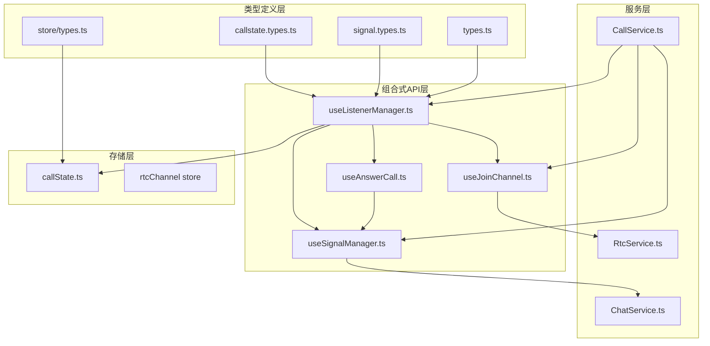
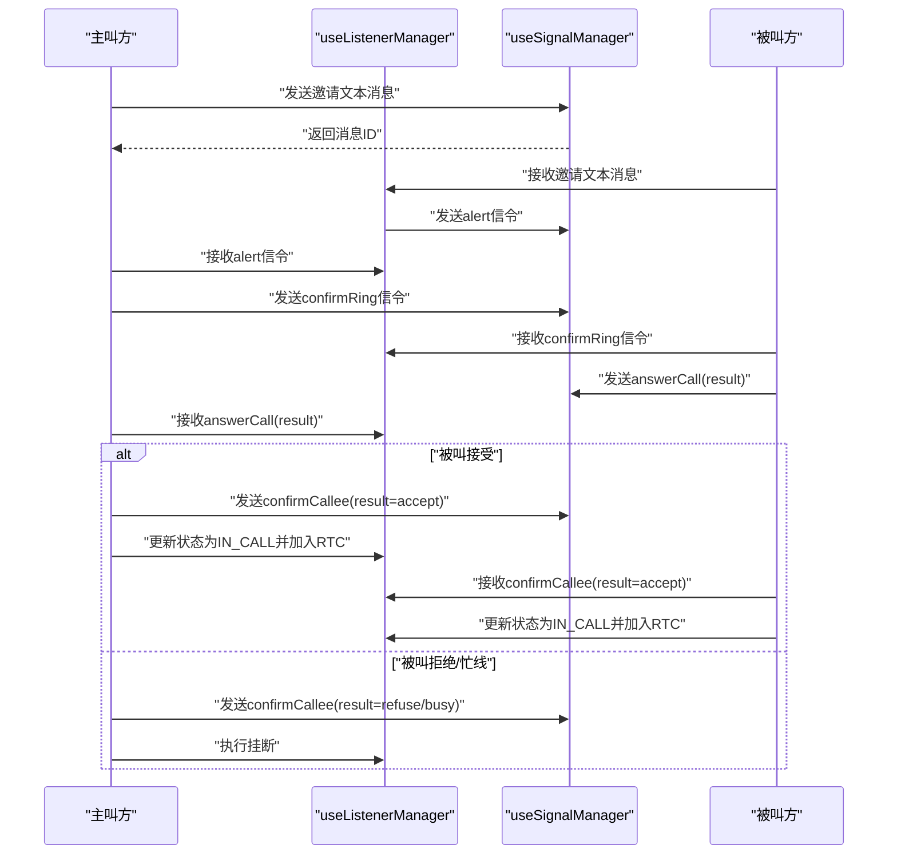
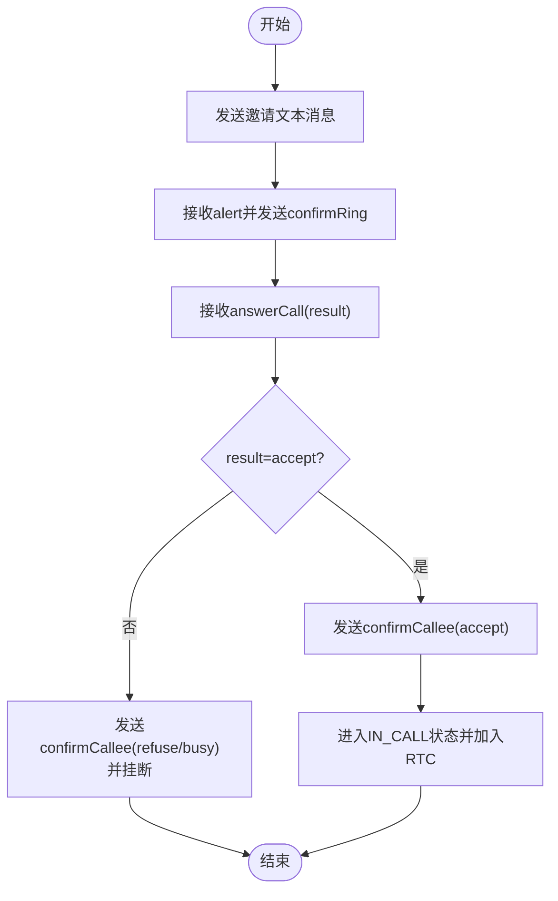
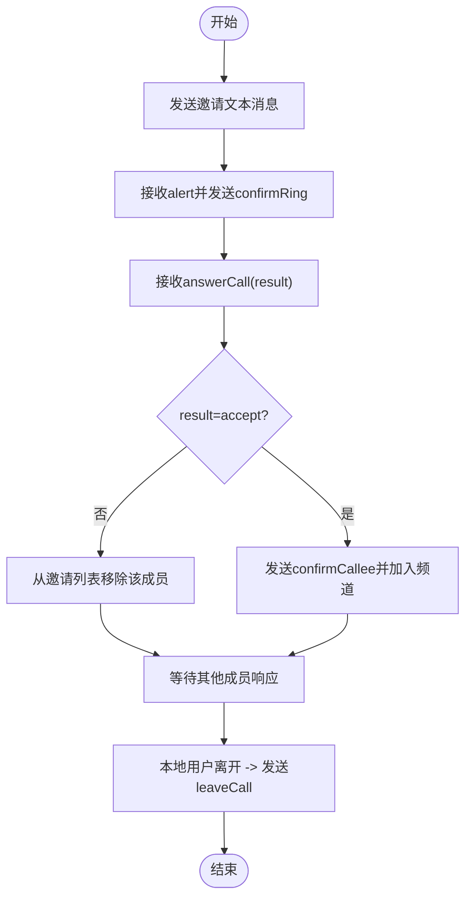
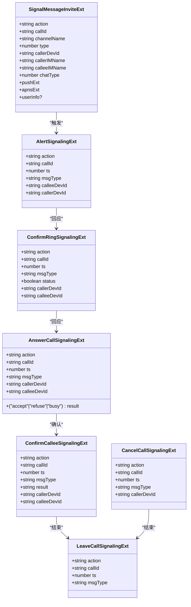
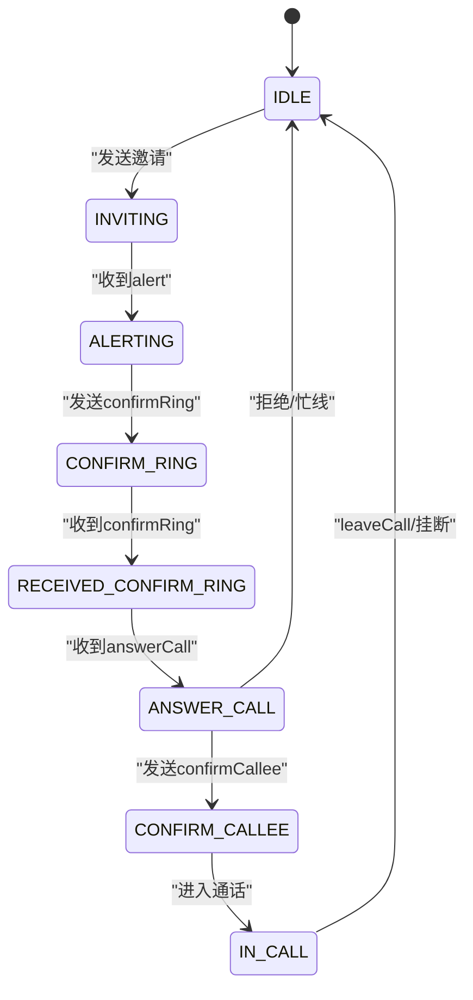
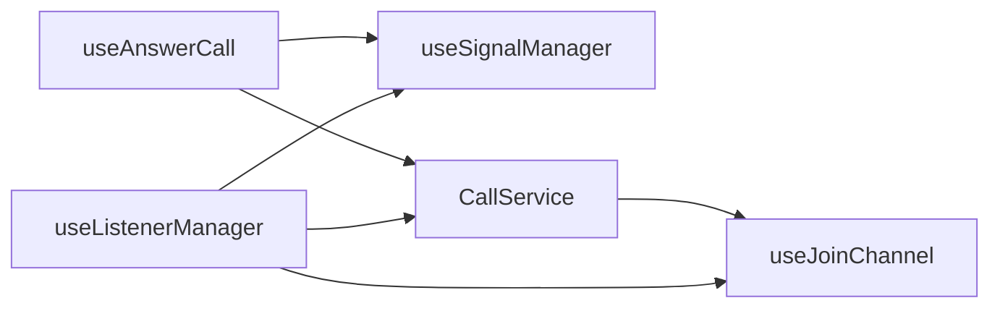
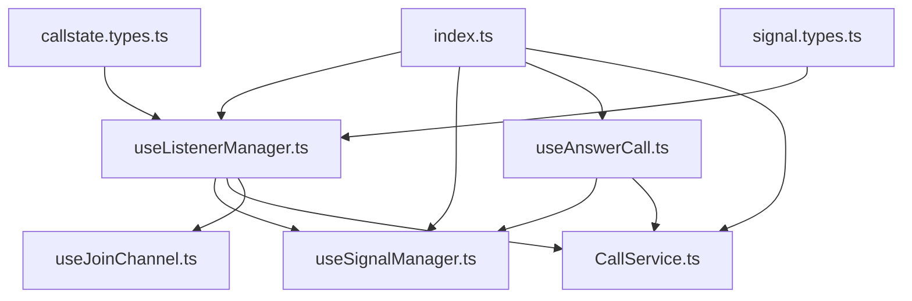

# 信令实现机制

<cite>
**本文档引用的文件**
- [lib/SIGNALING_IMPLEMENTATION.md](file://lib/SIGNALING_IMPLEMENTATION.md)
- [lib/ARCHITECTURE.md](file://lib/ARCHITECTURE.md)
- [lib/index.ts](file://lib/index.ts)
- [lib/types.ts](file://lib/types.ts)
- [lib/types/callstate.types.ts](file://lib/types/callstate.types.ts)
- [lib/types/signal.types.ts](file://lib/types/signal.types.ts)
- [lib/store/callState.ts](file://lib/store/callState.ts)
- [lib/store/types.ts](file://lib/store/types.ts)
- [lib/services/CallService.ts](file://lib/services/CallService.ts)
- [lib/composables/useListenerManager.ts](file://lib/composables/useListenerManager.ts)
- [lib/composables/useSignalManager.ts](file://lib/composables/useSignalManager.ts)
- [lib/composables/useAnswerCall.ts](file://lib/composables/useAnswerCall.ts)
- [lib/composables/useJoinChannel.ts](file://lib/composables/useJoinChannel.ts)
</cite>

## 目录
1. [引言](#引言)
2. [项目结构](#项目结构)
3. [核心组件](#核心组件)
4. [架构总览](#架构总览)
5. [详细组件分析](#详细组件分析)
6. [依赖关系分析](#依赖关系分析)
7. [性能考虑](#性能考虑)
8. [故障排查指南](#故障排查指南)
9. [结论](#结论)
10. [附录](#附录)

## 引言
本文件面向实现一对一与群组音视频通话的信令协议，系统化阐述邀请、响铃、应答、确认等完整信令流程，覆盖主叫方与被叫方的差异化处理逻辑、错误处理与异常恢复机制，并提供最佳实践与性能优化建议。文档同时给出关键流程的时序图与状态图，帮助读者快速理解与落地。

## 项目结构
项目采用分层架构，围绕“类型定义层 → 服务层 → 组合式API层 → 组件层”组织，其中与信令实现直接相关的关键模块如下：
- 类型定义：通话状态、信令动作、消息扩展字段等
- 服务层：CallService、ChatService、RtcService
- 组合式API：useListenerManager、useSignalManager、useAnswerCall、useJoinChannel
- 存储层：callState、rtcChannel 状态管理

**图表来源**
- [lib/ARCHITECTURE.md](file://lib/ARCHITECTURE.md#L1-L190)
- [lib/types/callstate.types.ts](file://lib/types/callstate.types.ts#L1-L93)
- [lib/types/signal.types.ts](file://lib/types/signal.types.ts#L1-L196)
- [lib/store/types.ts](file://lib/store/types.ts#L1-L86)
- [lib/services/CallService.ts](file://lib/services/CallService.ts#L1-L298)
- [lib/composables/useListenerManager.ts](file://lib/composables/useListenerManager.ts#L1-L684)
- [lib/composables/useSignalManager.ts](file://lib/composables/useSignalManager.ts#L1-L354)
- [lib/composables/useAnswerCall.ts](file://lib/composables/useAnswerCall.ts#L1-L168)
- [lib/composables/useJoinChannel.ts](file://lib/composables/useJoinChannel.ts)

**章节来源**
- [lib/ARCHITECTURE.md](file://lib/ARCHITECTURE.md#L1-L190)

## 核心组件
- 信令监听与状态同步：useListenerManager
- 信令发送管理：useSignalManager
- 被叫方应答：useAnswerCall
- 通话生命周期管理：CallService
- 响应式状态：callState.store
- RTC频道接入：useJoinChannel + RtcService

**章节来源**
- [lib/composables/useListenerManager.ts](file://lib/composables/useListenerManager.ts#L1-L684)
- [lib/composables/useSignalManager.ts](file://lib/composables/useSignalManager.ts#L1-L354)
- [lib/composables/useAnswerCall.ts](file://lib/composables/useAnswerCall.ts#L1-L168)
- [lib/services/CallService.ts](file://lib/services/CallService.ts#L1-L298)
- [lib/store/callState.ts](file://lib/store/callState.ts#L1-L263)

## 架构总览
信令处理遵循“文本邀请消息 + CMD 信令”的双通道模型：
- 文本邀请消息：携带通话元信息（callId、channelName、type、callerDevId 等），用于建立通话上下文
- CMD 信令：承载实时控制消息（alert、confirmRing、answerCall、confirmCallee、cancelCall、leaveCall）

**图表来源**
- [lib/composables/useListenerManager.ts](file://lib/composables/useListenerManager.ts#L141-L447)
- [lib/composables/useSignalManager.ts](file://lib/composables/useSignalManager.ts#L73-L353)
- [lib/types/signal.types.ts](file://lib/types/signal.types.ts#L64-L180)

**章节来源**
- [lib/types/signal.types.ts](file://lib/types/signal.types.ts#L1-L196)
- [lib/composables/useListenerManager.ts](file://lib/composables/useListenerManager.ts#L141-L447)
- [lib/composables/useSignalManager.ts](file://lib/composables/useSignalManager.ts#L73-L353)

## 详细组件分析

### 一对一通话信令流程
- 主叫方流程要点
  - 发送邀请文本消息，初始化通话上下文
  - 接收被叫alert后，发送confirmRing
  - 接收被叫answerCall(result)，若accept则发送confirmCallee并进入IN_CALL；否则发送confirmCallee并挂断
- 被叫方流程要点
  - 接收邀请后发送alert
  - 接收confirmRing后，根据用户操作发送answerCall(result)
  - 接收主叫confirmCallee(result)，若accept则进入IN_CALL

**图表来源**
- [lib/composables/useListenerManager.ts](file://lib/composables/useListenerManager.ts#L105-L131)
- [lib/composables/useListenerManager.ts](file://lib/composables/useListenerManager.ts#L319-L447)
- [lib/composables/useAnswerCall.ts](file://lib/composables/useAnswerCall.ts#L28-L76)

**章节来源**
- [lib/SIGNALING_IMPLEMENTATION.md](file://lib/SIGNALING_IMPLEMENTATION.md#L105-L131)
- [lib/composables/useAnswerCall.ts](file://lib/composables/useAnswerCall.ts#L28-L76)
- [lib/composables/useListenerManager.ts](file://lib/composables/useListenerManager.ts#L409-L447)

### 群组通话信令流程
- 邀请阶段：主叫发送邀请文本消息，被邀请者收到后进入待确认状态
- 响铃阶段：主叫收到被叫alert后发送confirmRing，群组中需校验被叫是否已在频道或已移除
- 应答阶段：被叫发送answerCall(result)，主叫根据result决定是否发送confirmCallee
- 离开阶段：群组成员离开时仅移除邀请列表中的成员，不直接挂断整场通话

**图表来源**
- [lib/composables/useListenerManager.ts](file://lib/composables/useListenerManager.ts#L390-L408)
- [lib/composables/useListenerManager.ts](file://lib/composables/useListenerManager.ts#L520-L546)

**章节来源**
- [lib/composables/useListenerManager.ts](file://lib/composables/useListenerManager.ts#L390-L408)
- [lib/composables/useListenerManager.ts](file://lib/composables/useListenerManager.ts#L520-L546)

### 信令消息格式与传输机制
- 文本邀请消息扩展字段包含：action=invite、callId、channelName、type、callerDevId、calleeIMName、chatType、推送扩展等
- CMD 信令扩展字段包含：基础字段（action、callId、ts、msgType）与具体动作字段（alert、confirmRing、answerCall、confirmCallee、cancelCall、leaveCall）
- 传输机制：通过 ChatService.sendTextMessage 与 ChatService.sendSignalMessage 发送，分别对应文本消息与CMD信令

**图表来源**
- [lib/types/signal.types.ts](file://lib/types/signal.types.ts#L3-L44)
- [lib/types/signal.types.ts](file://lib/types/signal.types.ts#L107-L180)

**章节来源**
- [lib/types/signal.types.ts](file://lib/types/signal.types.ts#L1-L196)

### 状态同步与错误处理
- 主叫方收到被叫accept后，应更新状态为IN_CALL并加入RTC频道
- 主叫方收到被叫拒绝/忙线后，发送confirmCallee并执行挂断
- 被叫方收到主叫confirmCallee后，若accept则进入IN_CALL并加入RTC
- 多端登录场景：若非当前设备处理，应挂断当前通话并上报原因
- 超时处理：一对一通话超时自动挂断；群组通话超时保持界面等待用户手动挂断

**图表来源**
- [lib/types/callstate.types.ts](file://lib/types/callstate.types.ts#L13-L22)
- [lib/store/callState.ts](file://lib/store/callState.ts#L142-L151)

**章节来源**
- [lib/composables/useListenerManager.ts](file://lib/composables/useListenerManager.ts#L409-L447)
- [lib/composables/useListenerManager.ts](file://lib/composables/useListenerManager.ts#L553-L618)
- [lib/store/callState.ts](file://lib/store/callState.ts#L115-L131)

### 组件交互与职责边界
- useListenerManager：集中处理文本消息与CMD信令，维护状态机，路由到具体处理函数
- useSignalManager：封装信令发送，屏蔽底层SDK细节
- useAnswerCall：被叫方应答入口，负责构建answerCall payload并更新状态
- CallService：统一挂断策略，区分普通挂断、取消、远端操作等
- useJoinChannel：封装加入/离开RTC频道的流程，配合状态同步

**图表来源**
- [lib/composables/useListenerManager.ts](file://lib/composables/useListenerManager.ts#L37-L683)
- [lib/composables/useSignalManager.ts](file://lib/composables/useSignalManager.ts#L50-L353)
- [lib/composables/useAnswerCall.ts](file://lib/composables/useAnswerCall.ts#L20-L167)
- [lib/services/CallService.ts](file://lib/services/CallService.ts#L9-L298)
- [lib/composables/useJoinChannel.ts](file://lib/composables/useJoinChannel.ts)

**章节来源**
- [lib/composables/useListenerManager.ts](file://lib/composables/useListenerManager.ts#L37-L683)
- [lib/composables/useSignalManager.ts](file://lib/composables/useSignalManager.ts#L50-L353)
- [lib/composables/useAnswerCall.ts](file://lib/composables/useAnswerCall.ts#L20-L167)
- [lib/services/CallService.ts](file://lib/services/CallService.ts#L9-L298)

## 依赖关系分析
- 类型依赖：callstate.types.ts 与 signal.types.ts 为所有信令处理提供强类型约束
- 组合式API依赖：useListenerManager 依赖 useSignalManager、useJoinChannel、CallService、store
- 服务层依赖：CallService 依赖 store 与 useSignalManager
- 导出与入口：index.ts 汇总导出组件、store、hooks、服务与类型

**图表来源**
- [lib/types/callstate.types.ts](file://lib/types/callstate.types.ts#L1-L93)
- [lib/types/signal.types.ts](file://lib/types/signal.types.ts#L1-L196)
- [lib/composables/useListenerManager.ts](file://lib/composables/useListenerManager.ts#L1-L684)
- [lib/composables/useSignalManager.ts](file://lib/composables/useSignalManager.ts#L1-L354)
- [lib/composables/useAnswerCall.ts](file://lib/composables/useAnswerCall.ts#L1-L168)
- [lib/index.ts](file://lib/index.ts#L1-L58)

**章节来源**
- [lib/index.ts](file://lib/index.ts#L1-L58)

## 性能考虑
- 信令发送批量化：在短时间内多次发送同类信令时，合并或去抖有助于降低网络压力
- 状态更新最小化：仅在必要时更新store，避免不必要的响应式更新
- 超时与定时器管理：确保超时定时器及时清理，防止内存泄漏
- RTC接入时机：仅在IN_CALL状态才加入频道，避免无效资源占用
- 错误降级：信令发送失败时，优先保证UI反馈与状态一致性，再进行重试或兜底

## 故障排查指南
- 主叫方收到accept后立即挂断
  - 现象：主叫方收到accept后未进入IN_CALL
  - 根因：handleAnswerCallMessage中未更新状态为IN_CALL
  - 处理：在收到accept后更新状态为IN_CALL并加入RTC频道
- 被叫方拒绝/忙线后未正确挂断
  - 现象：被叫方发送refuse/busy后，主叫方未发送confirmCallee并挂断
  - 处理：主叫方收到非accept时发送confirmCallee并执行挂断
- 多端登录冲突
  - 现象：其他设备已处理answerCall
  - 处理：检测callerDevId不匹配时挂断当前通话并上报原因
- 群组通话成员离开
  - 现象：leaveCall后整场通话结束
  - 处理：群组通话仅从邀请列表移除成员，不直接挂断

**章节来源**
- [lib/SIGNALING_IMPLEMENTATION.md](file://lib/SIGNALING_IMPLEMENTATION.md#L6-L11)
- [lib/composables/useListenerManager.ts](file://lib/composables/useListenerManager.ts#L372-L408)
- [lib/composables/useListenerManager.ts](file://lib/composables/useListenerManager.ts#L580-L592)
- [lib/composables/useListenerManager.ts](file://lib/composables/useListenerManager.ts#L520-L546)

## 结论
本文档系统梳理了一对一与群组音视频通话的信令实现，明确了主被叫方的处理差异、状态同步逻辑与错误恢复机制。通过类型约束、组合式API与服务层解耦，实现了高可维护性的信令处理框架。后续可在RTC频道加入、多人通话细化与cancelCall/leaveCall完善方面持续演进。

## 附录
- 使用示例与导出项参考：index.ts 汇总导出组件、store、hooks、服务与类型
- 通话状态与类型常量：callstate.types.ts 提供完整的状态与类型枚举
- 信令类型定义：signal.types.ts 提供邀请与各类CMD信令的扩展字段规范

**章节来源**
- [lib/index.ts](file://lib/index.ts#L1-L58)
- [lib/types/callstate.types.ts](file://lib/types/callstate.types.ts#L1-L93)
- [lib/types/signal.types.ts](file://lib/types/signal.types.ts#L1-L196)