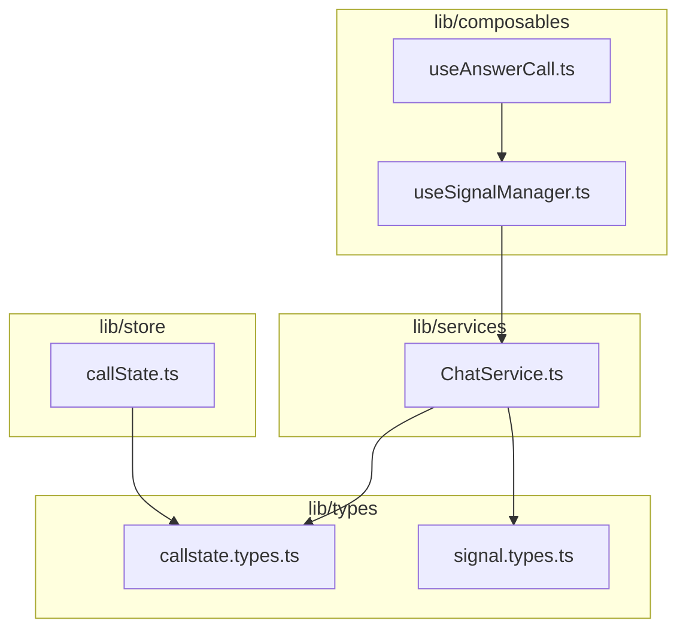
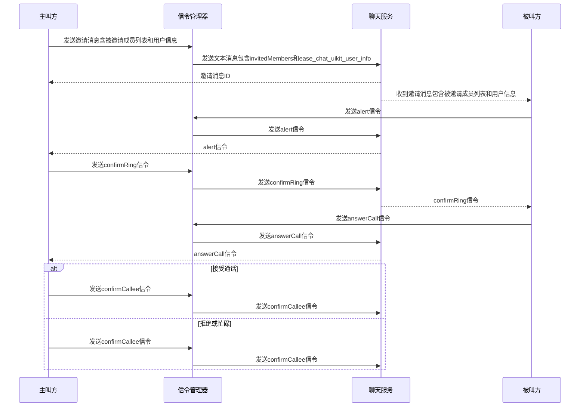
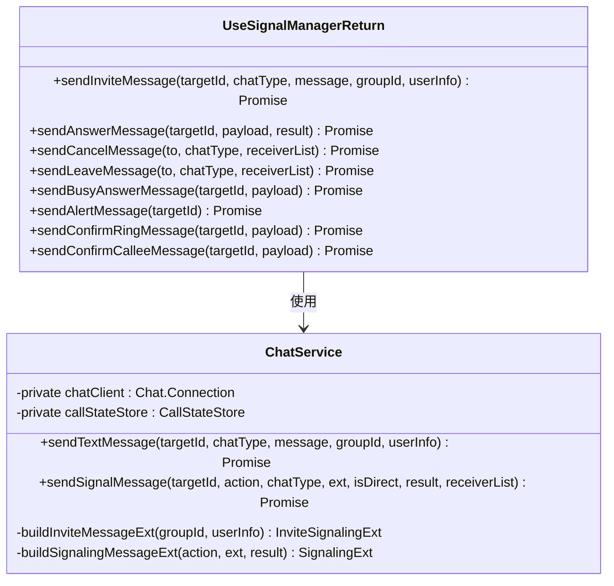
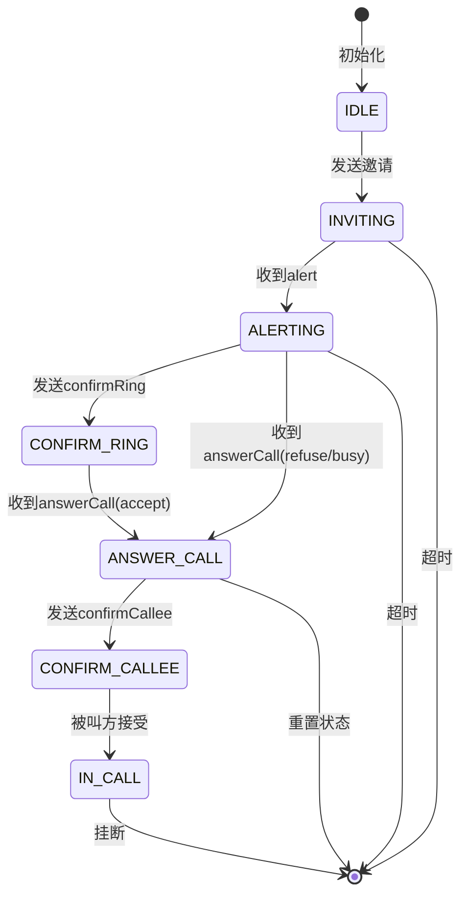
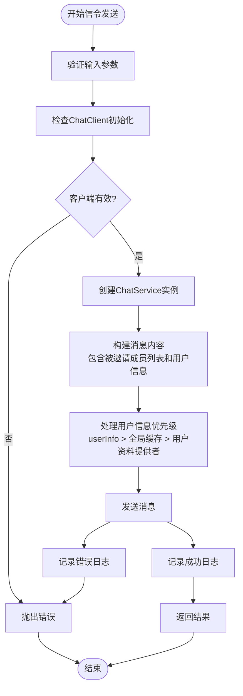
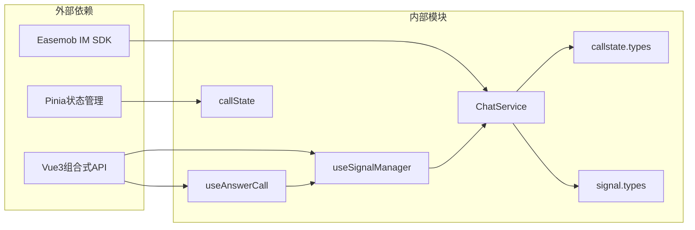

# 信令管理 API

<cite>
**本文档引用的文件**
- [useSignalManager.ts](file://lib/composables/useSignalManager.ts)
- [useAnswerCall.ts](file://lib/composables/useAnswerCall.ts)
- [ChatService.ts](file://lib/services/ChatService.ts)
- [callState.ts](file://lib/store/callState.ts)
- [callstate.types.ts](file://lib/types/callstate.types.ts)
- [signal.types.ts](file://lib/types/signal.types.ts)
- [index.ts](file://lib/index.ts)
</cite>

## 更新摘要
**变更内容**
- useSignalManager 支持新的 userInfo 参数，确保信令消息发送的一致性
- 新增对发送方用户信息的显式传递和处理机制
- 增强群组通话中用户资料的一致性保证
- ChatService 现在支持用户信息的优先级处理和缓存机制

## 目录
1. [简介](#简介)
2. [项目结构](#项目结构)
3. [核心组件](#核心组件)
4. [架构概览](#架构概览)
5. [详细组件分析](#详细组件分析)
6. [依赖关系分析](#依赖关系分析)
7. [性能考虑](#性能考虑)
8. [故障排除指南](#故障排除指南)
9. [结论](#结论)

## 简介

信令管理 API 是环信聊天和音视频通话功能的核心模块，提供了完整的信令发送和接收组合式 API。本文档详细介绍 useSignalManager 和 useAnswerCall 组合式 API 的完整接口说明，包括每个函数的参数、返回值和使用场景。

该 API 架构基于 Vue3 组合式函数设计，采用分层架构模式，将信令管理、状态管理和服务层清晰分离。系统支持一对一和多人音视频通话，提供完整的信令流程处理，包括邀请、响铃、接听、拒绝、忙碌拒绝和挂断等操作。

**更新** 新增对 userInfo 参数的支持，允许在信令发送时显式传递发送方的用户信息，确保信令消息的一致性和完整性。ChatService 现在支持用户信息的优先级处理和缓存机制，包括 userInfo 参数的最高优先级、全局缓存和用户资料提供者的三级处理策略。

## 项目结构

**图表来源**
- [useSignalManager.ts:1-357](file://lib/composables/useSignalManager.ts#L1-L357)
- [useAnswerCall.ts:1-169](file://lib/composables/useAnswerCall.ts#L1-L169)
- [ChatService.ts:1-333](file://lib/services/ChatService.ts#L1-L333)
- [callState.ts:1-215](file://lib/store/callState.ts#L1-L215)

**章节来源**
- [index.ts:1-92](file://lib/index.ts#L1-L92)

## 核心组件

### useSignalManager 组合式 API

useSignalManager 是信令管理的核心组合式函数，提供统一的信令发送接口。它封装了所有通话相关的信令发送逻辑，包括邀请、响铃、接听、拒绝、忙碌拒绝和挂断等操作。

#### 主要功能

1. **邀请消息发送** - 支持一对一和群组通话邀请，包含被邀请成员列表和发送方用户信息
2. **通话状态信令** - 处理 alert、confirmRing、answerCall 等状态信令
3. **通话控制信令** - 处理 cancelCall、leaveCall 等控制信令
4. **错误处理和日志记录** - 提供完整的错误处理和调试信息

#### 核心接口

| 函数名 | 参数 | 返回值 | 描述 |
|--------|------|--------|------|
| sendInviteMessage | targetId: string \| string[], chatType: Chat.ChatType, message: string, groupId?: string, userInfo?: { nickname?: string; avatarURL?: string } | Promise<Chat.SendMsgResult> | 发送通话邀请消息，支持群组通话的被邀请成员列表和发送方用户信息 |
| sendAnswerMessage | targetId: string, payload: any, result?: CALLKIT_CMD_MSG_RESULT_TYPE | Promise<Chat.SendMsgResult> | 发送通话应答信令 |
| sendCancelMessage | to: string, chatType: "singleChat" \| "groupChat", receiverList?: string[] | Promise<Chat.SendMsgResult> | 发送取消通话信令 |
| sendLeaveMessage | to: string, chatType: "singleChat" \| "groupChat", receiverList?: string[] | Promise<Chat.SendMsgResult> | 发送离开通话信令 |
| sendBusyAnswerMessage | targetId: string, payload: any | Promise<Chat.SendMsgResult> | 发送忙碌拒绝信令 |
| sendAlertMessage | targetId: string | Promise<Chat.SendMsgResult> | 发送响铃信令 |
| sendConfirmRingMessage | targetId: string, payload: any | Promise<Chat.SendMsgResult> | 发送确认响铃信令 |
| sendConfirmCalleeMessage | targetId: string, payload: any | Promise<Chat.SendMsgResult> | 发送确认被叫方状态信令 |

**更新** sendInviteMessage 函数现在支持 userInfo 参数，允许显式传递发送方的昵称和头像信息，确保信令消息的一致性。userInfo 参数具有最高优先级，会覆盖其他来源的用户信息。

**章节来源**
- [useSignalManager.ts:7-43](file://lib/composables/useSignalManager.ts#L7-L43)

### useAnswerCall 组合式 API

useAnswerCall 是被叫方应答通话的专用组合式函数，提供接受、拒绝和忙碌拒绝通话的方法。它基于 useSignalManager 实现，专门处理被叫方的通话应答逻辑。

#### 核心功能

1. **接受通话** - 发送 answerCall 信令（result: accept）
2. **拒绝通话** - 发送 answerCall 信令（result: refuse）
3. **忙碌拒绝** - 发送 answerCall 信令（result: busy）
4. **状态管理** - 自动管理通话状态转换
5. **超时处理** - 处理邀请超时逻辑

#### 主要接口

| 函数名 | 参数 | 返回值 | 描述 |
|--------|------|--------|------|
| acceptCall | 无 | Promise<void> | 被叫方接受通话 |
| rejectCall | 无 | Promise<void> | 被叫方拒绝通话 |
| busyRejectCall | 无 | Promise<void> | 被叫方忙碌拒绝通话 |

**章节来源**
- [useAnswerCall.ts:6-13](file://lib/composables/useAnswerCall.ts#L6-L13)

## 架构概览

**更新** 新增对发送方用户信息的处理流程，包括 userInfo 参数的传递和在信令消息中的存储。用户信息具有最高优先级，会覆盖全局缓存和用户资料提供者的数据。

**图表来源**
- [useSignalManager.ts:74-105](file://lib/composables/useSignalManager.ts#L74-L105)
- [ChatService.ts:27-144](file://lib/services/ChatService.ts#L27-L144)

## 详细组件分析

### 信令管理器类图

**更新** ChatService 现在支持 userInfo 参数的处理，包括用户信息的优先级选择和缓存机制。userInfo 参数具有最高优先级，会覆盖全局缓存和用户资料提供者的数据。

**图表来源**
- [useSignalManager.ts:51-356](file://lib/composables/useSignalManager.ts#L51-L356)
- [ChatService.ts:20-333](file://lib/services/ChatService.ts#L20-L333)

### 通话状态管理

**更新** 群组通话场景下，状态转换会涉及被邀请成员列表的动态更新和参与者状态管理。用户信息的传递确保了所有参与者都能看到正确的发送方信息。

**图表来源**
- [callstate.types.ts:13-22](file://lib/types/callstate.types.ts#L13-L22)
- [callState.ts:112-136](file://lib/store/callState.ts#L112-L136)

### 信令发送流程

**更新** 新增对 userInfo 参数的处理步骤，在构建消息内容时自动包含 ease_chat_uikit_user_info 字段。用户信息按照 userInfo > 全局缓存 > 用户资料提供者的优先级顺序处理。

**图表来源**
- [useSignalManager.ts:74-105](file://lib/composables/useSignalManager.ts#L74-L105)
- [ChatService.ts:229-273](file://lib/services/ChatService.ts#L229-L273)

**章节来源**
- [useSignalManager.ts:51-356](file://lib/composables/useSignalManager.ts#L51-L356)
- [useAnswerCall.ts:19-168](file://lib/composables/useAnswerCall.ts#L19-L168)

## 依赖关系分析

**更新** 新增 signal.types 依赖关系，ChatService 现在依赖 signal.types 来处理扩展的信令类型定义，包括 ease_chat_uikit_user_info 字段。signal.types.ts 文件中定义了用户信息扩展字段的完整类型定义。

**图表来源**
- [useSignalManager.ts:1-6](file://lib/composables/useSignalManager.ts#L1-L6)
- [useAnswerCall.ts:1-6](file://lib/composables/useAnswerCall.ts#L1-L6)
- [ChatService.ts:1-20](file://lib/services/ChatService.ts#L1-L20)
- [callState.ts:1-9](file://lib/store/callState.ts#L1-L9)
- [signal.types.ts:1-216](file://lib/types/signal.types.ts#L1-L216)

### 核心依赖关系

1. **ChatService 依赖关系**
   - 依赖 Chat SDK 进行消息发送
   - 依赖 Pinia store 获取通话状态
   - 依赖 callstate.types 定义信令格式
   - **新增** 依赖 signal.types 处理扩展的信令类型，包括 ease_chat_uikit_user_info 字段

2. **useSignalManager 依赖关系**
   - 依赖 ChatService 处理具体消息发送
   - 依赖 Pinia store 管理客户端状态
   - 依赖 logger 进行调试输出

3. **useAnswerCall 依赖关系**
   - 依赖 useSignalManager 发送应答信令
   - 依赖 Pinia store 管理通话状态
   - 依赖 logger 进行调试输出

**章节来源**
- [ChatService.ts:20-333](file://lib/services/ChatService.ts#L20-L333)
- [callState.ts:9-215](file://lib/store/callState.ts#L9-L215)
- [signal.types.ts:1-216](file://lib/types/signal.types.ts#L1-L216)

## 性能考虑

### 信令发送优化

1. **异步处理** - 所有信令发送都是异步操作，避免阻塞主线程
2. **错误缓存** - 使用 try-catch 包装，防止错误传播影响整体系统
3. **日志分级** - 不同级别的日志使用不同的记录级别，减少不必要的日志输出

### 内存管理

1. **状态清理** - 通话结束后自动清理状态和定时器
2. **定时器管理** - 邀请超时后自动清理定时器，防止内存泄漏
3. **资源释放** - 挂断时自动释放媒体资源和连接

### 并发控制

1. **状态检查** - 发送信令前检查当前通话状态，避免无效操作
2. **重复调用防护** - 防止同一操作的重复调用
3. **超时机制** - 提供邀请超时机制，避免长时间等待

**更新** 新增对 userInfo 参数的性能考虑，包括用户信息的缓存机制和优先级处理策略。用户信息按照 userInfo > 全局缓存 > 用户资料提供者的优先级顺序处理，避免重复查询用户资料。

## 故障排除指南

### 常见错误及解决方案

#### ChatClient 未初始化
**问题描述**: 尝试发送信令时发现 ChatClient 未初始化
**解决方案**: 
- 确保在 Provider 组件中正确初始化 ChatClient
- 检查用户登录状态
- 验证 appKey、userId、accessToken 配置

#### 通话状态异常
**问题描述**: 通话状态无法正常转换或出现状态冲突
**解决方案**:
- 检查状态转换逻辑
- 确认信令处理顺序
- 验证多端登录场景下的状态同步

#### 信令发送失败
**问题描述**: 信令发送过程中出现网络错误或服务器错误
**解决方案**:
- 检查网络连接状态
- 验证用户权限和Token有效性
- 查看服务器返回的具体错误信息

#### 超时处理问题
**问题描述**: 邀请超时后界面未正确关闭或状态未重置
**解决方案**:
- 检查超时定时器设置
- 验证超时回调函数执行
- 确认多人通话场景下的特殊处理逻辑

#### 用户信息传递问题
**问题描述**: 发送方用户信息在信令中显示不正确或缺失
**解决方案**:
- 检查 userInfo 参数的传递和格式
- 验证用户信息的优先级处理逻辑
- 确认用户信息缓存和查询机制

**更新** 新增用户信息传递问题的解决方案。如果 userInfo 参数为空或不完整，系统会按优先级顺序获取用户信息：userInfo 参数 > 全局缓存 > 用户资料提供者。如果所有来源都无法获取用户信息，系统会使用用户ID作为默认昵称。

### 调试建议

1. **启用调试模式**: 设置 debug: true 获取详细日志
2. **监控状态变化**: 使用浏览器开发者工具监控 Pinia store 状态
3. **网络请求追踪**: 检查信令消息的发送和接收情况
4. **错误堆栈分析**: 查看完整的错误堆栈信息定位问题
5. **用户信息调试**: 特别关注 userInfo 参数的传递和处理过程

**章节来源**
- [useSignalManager.ts:58-65](file://lib/composables/useSignalManager.ts#L58-L65)
- [callState.ts:112-136](file://lib/store/callState.ts#L112-L136)

## 结论

信令管理 API 提供了完整、可靠的音视频通话信令处理能力。通过 useSignalManager 和 useAnswerCall 组合式 API，开发者可以轻松实现复杂的通话场景，包括一对一和多人通话、各种通话状态转换和错误处理。

**更新** 新版本增强了对用户信息传递的支持，通过 userInfo 参数实现了发送方用户信息的一致性保证。这一改进使得信令消息更加完整和准确，特别是在群组通话场景下，能够确保所有参与者都能看到正确的发送方信息。

ChatService 现在支持用户信息的优先级处理机制，包括 userInfo 参数的最高优先级、全局缓存和用户资料提供者的三级处理策略。这种设计确保了用户信息的准确性和一致性，同时提高了系统的性能和可靠性。

该 API 的设计遵循了 Vue3 最佳实践，采用组合式函数模式，具有良好的可维护性和扩展性。同时，完善的错误处理机制和状态管理确保了系统的稳定性和可靠性。

建议在实际项目中：
1. 仔细阅读并理解信令流程
2. 正确处理各种异常情况
3. 合理使用超时和重试机制
4. 做好性能优化和内存管理
5. 充分利用调试工具进行问题排查
6. **新增** 在需要精确控制发送方信息的场景下，合理使用 userInfo 参数
7. **新增** 注意用户信息的优先级处理和缓存机制
8. **新增** 充分利用用户信息的三级优先级处理策略，提高用户体验

通过合理使用这些 API，可以快速构建高质量的音视频通话应用，特别是支持多人参与和精确用户信息展示的复杂通话场景。