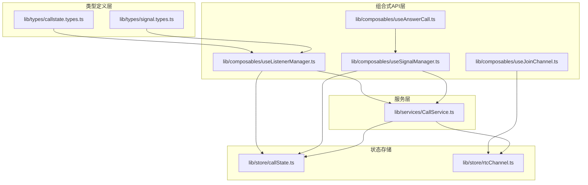
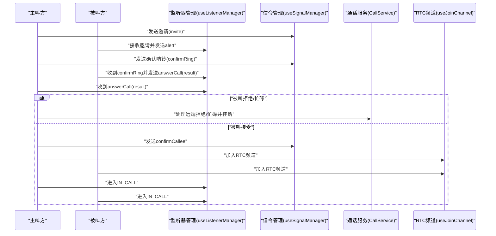
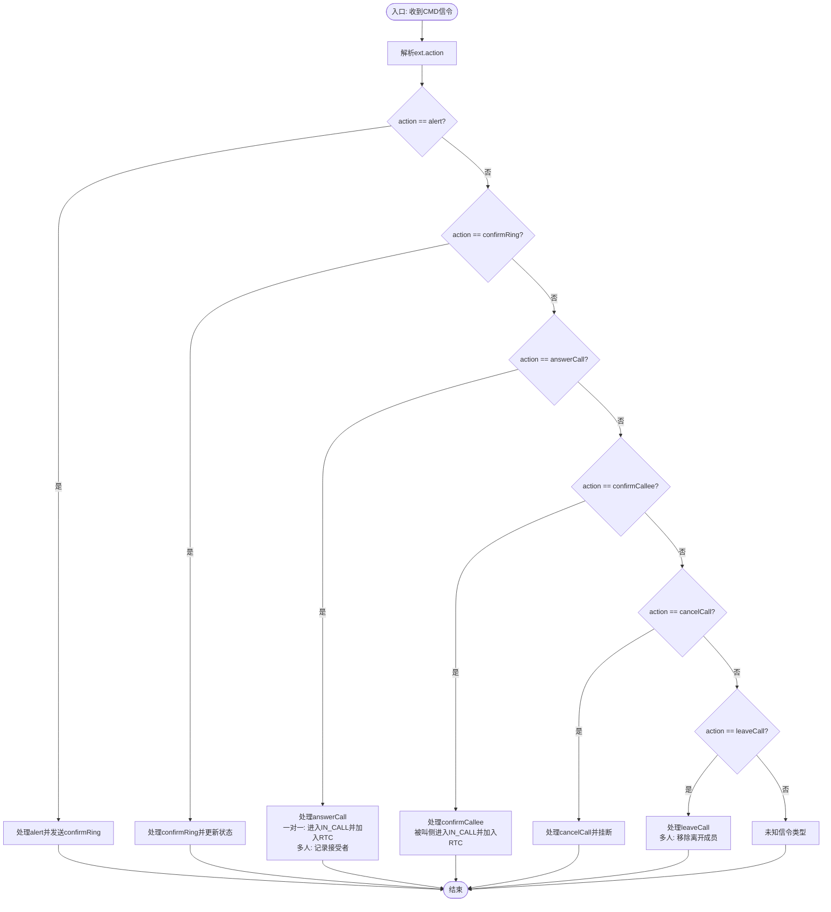
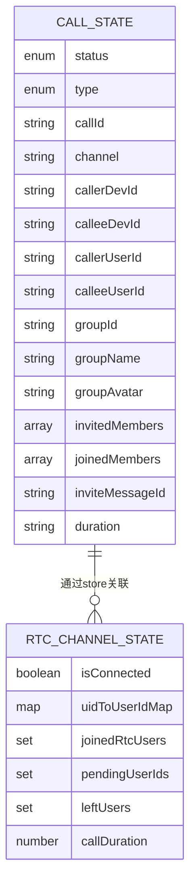
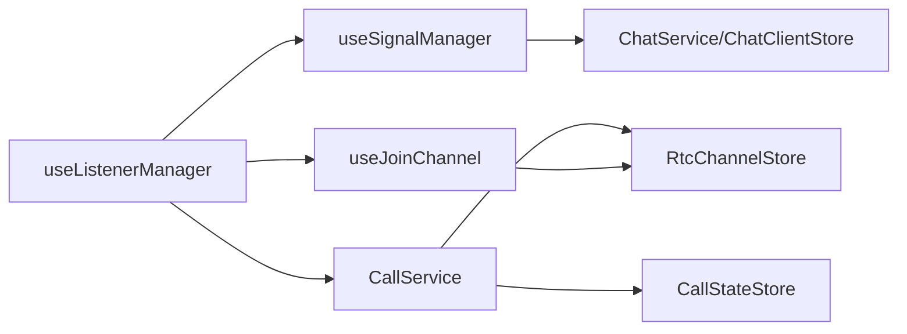

# 多人通话信令

<cite>
**本文档引用的文件**
- [lib/SIGNALING_IMPLEMENTATION.md](file://lib/SIGNALING_IMPLEMENTATION.md)
- [lib/ARCHITECTURE.md](file://lib/ARCHITECTURE.md)
- [lib/composables/useListenerManager.ts](file://lib/composables/useListenerManager.ts)
- [lib/composables/useSignalManager.ts](file://lib/composables/useSignalManager.ts)
- [lib/composables/useAnswerCall.ts](file://lib/composables/useAnswerCall.ts)
- [lib/composables/useJoinChannel.ts](file://lib/composables/useJoinChannel.ts)
- [lib/services/CallService.ts](file://lib/services/CallService.ts)
- [lib/store/callState.ts](file://lib/store/callState.ts)
- [lib/store/rtcChannel.ts](file://lib/store/rtcChannel.ts)
- [lib/types/callstate.types.ts](file://lib/types/callstate.types.ts)
- [lib/types/signal.types.ts](file://lib/types/signal.types.ts)
</cite>

## 目录
1. [引言](#引言)
2. [项目结构](#项目结构)
3. [核心组件](#核心组件)
4. [架构总览](#架构总览)
5. [详细组件分析](#详细组件分析)
6. [依赖关系分析](#依赖关系分析)
7. [性能考虑](#性能考虑)
8. [故障排查指南](#故障排查指南)
9. [结论](#结论)
10. [附录](#附录)

## 引言
本文件聚焦于多人通话信令的现状与待完成事项，对比一对一与多人通话在信令处理上的差异，梳理成员管理、权限控制与状态同步机制，并给出流程图、冲突处理与网络优化策略，最后提供未来开发计划与扩展建议，帮助开发者快速理解当前限制与改进方向。

## 项目结构
- 采用分层架构：类型定义层、服务层、组合式API层、组件层
- 信令处理集中在组合式API与服务层，状态管理通过Pinia store集中维护
- 多人通话与一对一通话共享基础信令协议，但在成员管理与状态流转上存在显著差异

图表来源
- [lib/ARCHITECTURE.md](file://lib/ARCHITECTURE.md#L1-L190)
- [lib/types/callstate.types.ts](file://lib/types/callstate.types.ts#L1-L93)
- [lib/types/signal.types.ts](file://lib/types/signal.types.ts#L1-L196)
- [lib/composables/useListenerManager.ts](file://lib/composables/useListenerManager.ts#L1-L684)
- [lib/composables/useSignalManager.ts](file://lib/composables/useSignalManager.ts#L1-L354)
- [lib/composables/useAnswerCall.ts](file://lib/composables/useAnswerCall.ts#L1-L168)
- [lib/composables/useJoinChannel.ts](file://lib/composables/useJoinChannel.ts#L1-L185)
- [lib/services/CallService.ts](file://lib/services/CallService.ts#L1-L298)
- [lib/store/callState.ts](file://lib/store/callState.ts#L1-L263)
- [lib/store/rtcChannel.ts](file://lib/store/rtcChannel.ts#L1-L410)

章节来源
- [lib/ARCHITECTURE.md](file://lib/ARCHITECTURE.md#L1-L190)

## 核心组件
- 信令发送管理：封装所有信令发送接口，统一错误日志与返回
- 信令监听与状态同步：解析CMD信令，驱动CallState与RTC状态变更
- 被叫应答：提供接受/拒绝/忙碌三种应答路径
- 加入频道：在确认信令后创建并发布本地音视频轨道，加入RTC频道
- 通话服务：封装挂断策略、清理资源、离线信令发送

章节来源
- [lib/composables/useSignalManager.ts](file://lib/composables/useSignalManager.ts#L1-L354)
- [lib/composables/useListenerManager.ts](file://lib/composables/useListenerManager.ts#L1-L684)
- [lib/composables/useAnswerCall.ts](file://lib/composables/useAnswerCall.ts#L1-L168)
- [lib/composables/useJoinChannel.ts](file://lib/composables/useJoinChannel.ts#L1-L185)
- [lib/services/CallService.ts](file://lib/services/CallService.ts#L1-L298)

## 架构总览
多人通话与一对一通话共享同一套信令协议（invite/alert/confirmRing/answerCall/confirmCallee/cancelCall/leaveCall），差异主要体现在：
- 成员管理：一对一仅涉及主被叫两方；多人通话需维护邀请列表、加入列表、离开标记
- 权限控制：多端登录、设备ID校验、拒绝/忙碌仅影响当前用户
- 状态同步：一对一在confirmCallee后直接进入IN_CALL；多人通话需等待所有受邀者加入后再进入IN_CALL

图表来源
- [lib/composables/useListenerManager.ts](file://lib/composables/useListenerManager.ts#L140-L447)
- [lib/composables/useSignalManager.ts](file://lib/composables/useSignalManager.ts#L73-L341)
- [lib/composables/useJoinChannel.ts](file://lib/composables/useJoinChannel.ts#L76-L178)
- [lib/services/CallService.ts](file://lib/services/CallService.ts#L101-L164)

## 详细组件分析

### 一对一通话信令流程（已完成）
- 主叫：invite → alert → confirmRing → answerCall(result) → confirmCallee → IN_CALL
- 被叫：收到invite → alert → confirmRing → answerCall(result) → IN_CALL
- 关键点：被叫接受后，主/被双方均进入IN_CALL并加入RTC频道

章节来源
- [lib/SIGNALING_IMPLEMENTATION.md](file://lib/SIGNALING_IMPLEMENTATION.md#L105-L131)
- [lib/composables/useListenerManager.ts](file://lib/composables/useListenerManager.ts#L409-L446)
- [lib/composables/useJoinChannel.ts](file://lib/composables/useJoinChannel.ts#L132-L170)

### 多人通话信令现状与差异
- 成员管理
  - 邀请列表：invitedMembers，用于跟踪尚未加入的受邀者
  - 加入列表：joinedMembers，用于跟踪已加入的用户
  - 离开标记：leftUsers，避免挂断后仍显示“邀请中”
- 权限控制
  - 设备ID校验：多端登录时严格校验callerDevId/calleeDevId
  - 拒绝/忙碌仅影响当前用户，不中断整个通话
- 状态同步
  - 被叫接受：主叫侧加入RTC频道，被叫侧进入IN_CALL
  - leaveCall：仅移除离开成员，不中断通话

章节来源
- [lib/composables/useListenerManager.ts](file://lib/composables/useListenerManager.ts#L390-L446)
- [lib/composables/useListenerManager.ts](file://lib/composables/useListenerManager.ts#L520-L546)
- [lib/store/callState.ts](file://lib/store/callState.ts#L26-L28)
- [lib/store/rtcChannel.ts](file://lib/store/rtcChannel.ts#L340-L368)

### 信令处理差异对比
- answerCall处理
  - 一对一：收到accept后立即进入IN_CALL并加入RTC频道
  - 多人：仅记录接受者，等待其他受邀者加入后统一进入IN_CALL
- cancelCall/leaveCall
  - 当前实现中这两个case在监听器中为空，需补充多人场景下的成员移除与状态更新

章节来源
- [lib/composables/useListenerManager.ts](file://lib/composables/useListenerManager.ts#L163-L174)
- [lib/composables/useListenerManager.ts](file://lib/composables/useListenerManager.ts#L454-L477)
- [lib/composables/useListenerManager.ts](file://lib/composables/useListenerManager.ts#L484-L546)

### 信令发送与接收流程
- 发送侧：useSignalManager统一封装invite/alert/confirmRing/answerCall/confirmCallee/cancelCall/leaveCall
- 接收侧：useListenerManager根据action分发到具体处理器，更新CallState并触发UI与RTC

图表来源
- [lib/composables/useListenerManager.ts](file://lib/composables/useListenerManager.ts#L141-L173)
- [lib/composables/useListenerManager.ts](file://lib/composables/useListenerManager.ts#L179-L212)
- [lib/composables/useListenerManager.ts](file://lib/composables/useListenerManager.ts#L279-L317)
- [lib/composables/useListenerManager.ts](file://lib/composables/useListenerManager.ts#L323-L447)
- [lib/composables/useListenerManager.ts](file://lib/composables/useListenerManager.ts#L553-L618)
- [lib/composables/useListenerManager.ts](file://lib/composables/useListenerManager.ts#L454-L546)

### RTC频道加入与状态联动
- 主叫侧：收到被叫accept后加入RTC频道并发布本地音视频轨道
- 被叫侧：收到confirmCallee后进入IN_CALL并加入RTC频道
- 待加入用户：通过pendingUserIds在用户加入RTC前进行匹配与标记

章节来源
- [lib/composables/useListenerManager.ts](file://lib/composables/useListenerManager.ts#L413-L445)
- [lib/composables/useListenerManager.ts](file://lib/composables/useListenerManager.ts#L606-L617)
- [lib/composables/useJoinChannel.ts](file://lib/composables/useJoinChannel.ts#L115-L178)
- [lib/store/rtcChannel.ts](file://lib/store/rtcChannel.ts#L340-L368)

### 成员管理与状态模型

图表来源
- [lib/store/callState.ts](file://lib/store/callState.ts#L11-L37)
- [lib/store/rtcChannel.ts](file://lib/store/rtcChannel.ts#L11-L28)

## 依赖关系分析
- useListenerManager依赖useSignalManager与useJoinChannel，负责信令解析与状态同步
- useSignalManager依赖ChatService与ChatClientStore，负责信令发送
- CallService依赖CallStateStore与RtcChannelStore，负责挂断策略与资源清理
- 多人通话依赖RTC频道store进行用户加入/离开标记与待加入用户匹配

图表来源
- [lib/composables/useListenerManager.ts](file://lib/composables/useListenerManager.ts#L1-L684)
- [lib/composables/useSignalManager.ts](file://lib/composables/useSignalManager.ts#L1-L354)
- [lib/composables/useJoinChannel.ts](file://lib/composables/useJoinChannel.ts#L1-L185)
- [lib/services/CallService.ts](file://lib/services/CallService.ts#L1-L298)

章节来源
- [lib/composables/useListenerManager.ts](file://lib/composables/useListenerManager.ts#L1-L684)
- [lib/composables/useSignalManager.ts](file://lib/composables/useSignalManager.ts#L1-L354)
- [lib/composables/useJoinChannel.ts](file://lib/composables/useJoinChannel.ts#L1-L185)
- [lib/services/CallService.ts](file://lib/services/CallService.ts#L1-L298)

## 性能考虑
- 信令发送与接收解耦：通过useSignalManager集中发送，降低重复逻辑与错误率
- 状态一致性：通过Pinia store统一管理，避免UI与业务逻辑状态不一致
- RTC资源管理：加入频道前检查连接状态，避免重复加入；挂断时统一清理本地/远程轨道
- 超时处理：一对一默认邀请超时自动挂断；多人通话超时保持界面等待用户手动挂断，避免误操作

章节来源
- [lib/composables/useJoinChannel.ts](file://lib/composables/useJoinChannel.ts#L84-L103)
- [lib/store/callState.ts](file://lib/store/callState.ts#L115-L131)

## 故障排查指南
- 多端登录冲突
  - 现象：收到其他设备的confirmCallee或answerCall
  - 处理：校验calleeDevId，若不匹配则按“其他设备已处理”挂断
- 被叫拒绝/忙碌
  - 现象：收到answerCall(result)为refuse/busy
  - 处理：一对一立即挂断；多人仅从邀请列表移除该用户
- leaveCall异常
  - 现象：IDLE状态下收到leaveCall或ALERTING状态下主叫leaveCall
  - 处理：根据状态分支处理，避免误挂断
- cancelCall缺失
  - 现象：监听器中cancelCall case为空
  - 处理：补充多人场景下的成员移除与状态更新逻辑

章节来源
- [lib/composables/useListenerManager.ts](file://lib/composables/useListenerManager.ts#L355-L371)
- [lib/composables/useListenerManager.ts](file://lib/composables/useListenerManager.ts#L372-L408)
- [lib/composables/useListenerManager.ts](file://lib/composables/useListenerManager.ts#L494-L513)
- [lib/composables/useListenerManager.ts](file://lib/composables/useListenerManager.ts#L163-L174)

## 结论
当前多人通话信令已具备基础框架：成员管理、权限控制与状态同步在一对一基础上进行了扩展。但仍存在以下待完成事项：
- 补充cancelCall与leaveCall在多人场景下的处理逻辑
- 完善RTC频道加入的统一调度与异常恢复
- 优化多人通话的UI交互与超时提示策略

## 附录

### 未来开发计划与扩展建议
- 信令增强
  - 补充cancelCall/leaveCall在多人场景下的成员移除与状态更新
  - 引入“主持人/管理员”角色，支持踢人、静音等权限控制
- RTC优化
  - 统一加入频道流程，增加重试与降级策略
  - 增加网络质量监控与动态码率调整
- UI与交互
  - 多人通话界面支持成员列表滚动、静音/摄像头切换
  - 超时与异常提示明确化，减少误操作
- 测试与监控
  - 增加多人通话场景的自动化测试用例
  - 上报关键指标（加入成功率、掉线率、首帧时延）

章节来源
- [lib/SIGNALING_IMPLEMENTATION.md](file://lib/SIGNALING_IMPLEMENTATION.md#L161-L183)