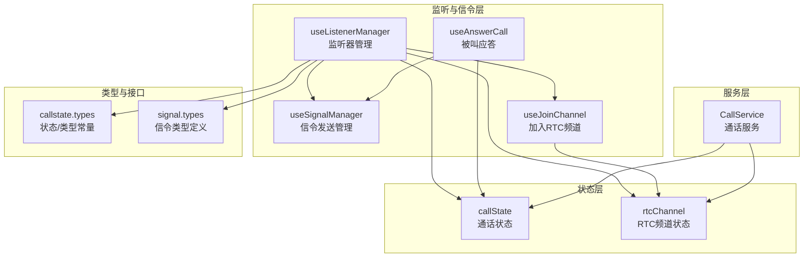
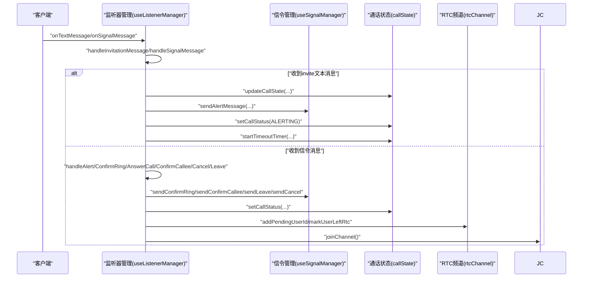
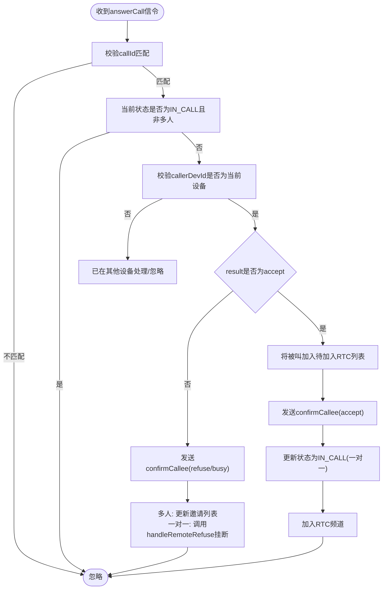
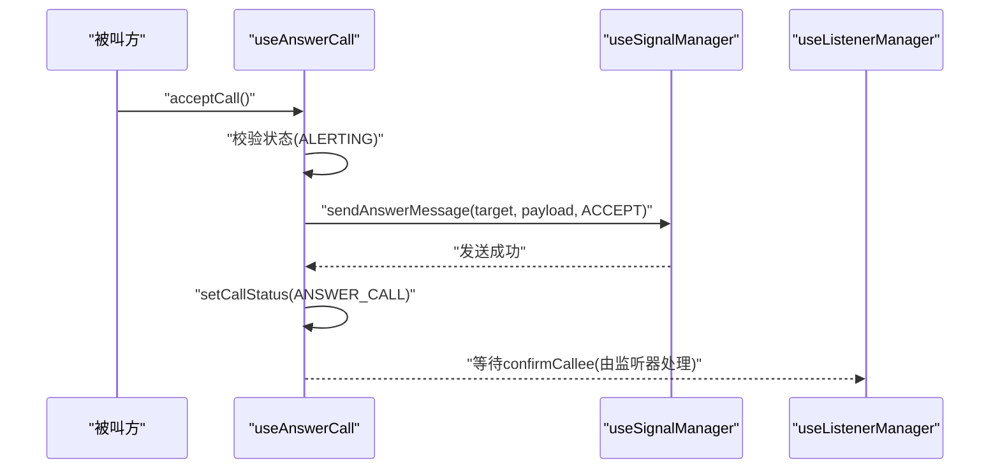
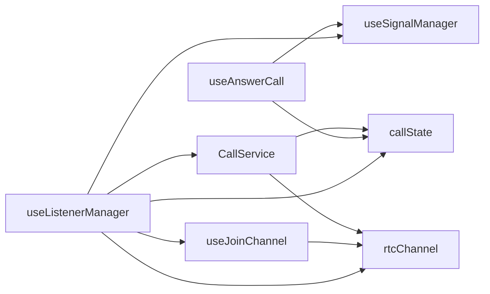

# 监听器管理

<cite>
**本文档引用的文件**
- [lib/composables/useListenerManager.ts](file://lib/composables/useListenerManager.ts)
- [lib/composables/useSignalManager.ts](file://lib/composables/useSignalManager.ts)
- [lib/composables/useAnswerCall.ts](file://lib/composables/useAnswerCall.ts)
- [lib/composables/useJoinChannel.ts](file://lib/composables/useJoinChannel.ts)
- [lib/services/CallService.ts](file://lib/services/CallService.ts)
- [lib/store/callState.ts](file://lib/store/callState.ts)
- [lib/store/rtcChannel.ts](file://lib/store/rtcChannel.ts)
- [lib/types/callstate.types.ts](file://lib/types/callstate.types.ts)
- [lib/types/signal.types.ts](file://lib/types/signal.types.ts)
- [lib/SIGNALING_IMPLEMENTATION.md](file://lib/SIGNALING_IMPLEMENTATION.md)
- [lib/ARCHITECTURE.md](file://lib/ARCHITECTURE.md)
- [lib/index.ts](file://lib/index.ts)
</cite>

## 目录
1. [简介](#简介)
2. [项目结构](#项目结构)
3. [核心组件](#核心组件)
4. [架构总览](#架构总览)
5. [详细组件分析](#详细组件分析)
6. [依赖关系分析](#依赖关系分析)
7. [性能考虑](#性能考虑)
8. [故障排查指南](#故障排查指南)
9. [结论](#结论)

## 简介
本文件聚焦于“监听器管理”子系统，系统化阐述信令监听与处理机制，覆盖一对一与多人通话的信令流转、状态同步、多端登录处理、异常与超时控制等关键场景。重点解析 handleAnswerCallMessage、handleConfirmCalleeMessage 等关键函数的实现原理与调用流程，并提供调试技巧与性能优化建议，帮助开发者快速定位与解决信令相关问题。

## 项目结构
监听器管理位于组合式API层，围绕 useListenerManager 组合式API展开，配合 useSignalManager、useAnswerCall、useJoinChannel 等模块协同工作；状态管理由 Pinia Store 提供，包括通话状态与 RTC 频道状态。

图表来源
- [lib/composables/useListenerManager.ts](file://lib/composables/useListenerManager.ts#L37-L684)
- [lib/composables/useSignalManager.ts](file://lib/composables/useSignalManager.ts#L50-L354)
- [lib/composables/useAnswerCall.ts](file://lib/composables/useAnswerCall.ts#L20-L168)
- [lib/composables/useJoinChannel.ts](file://lib/composables/useJoinChannel.ts#L26-L185)
- [lib/services/CallService.ts](file://lib/services/CallService.ts#L9-L298)
- [lib/store/callState.ts](file://lib/store/callState.ts#L7-L263)
- [lib/store/rtcChannel.ts](file://lib/store/rtcChannel.ts#L7-L410)
- [lib/types/callstate.types.ts](file://lib/types/callstate.types.ts#L1-L93)
- [lib/types/signal.types.ts](file://lib/types/signal.types.ts#L1-L196)

章节来源
- [lib/ARCHITECTURE.md](file://lib/ARCHITECTURE.md#L1-L190)

## 核心组件
- 监听器管理器：集中处理文本消息与信令消息的监听、路由与状态更新，是信令处理的中枢。
- 信令发送管理：封装各类信令的发送逻辑，保证发送路径统一、错误可控。
- 被叫应答：提供 accept/reject/buys 拒绝三种应答能力，构建并发送 answerCall 信令。
- 加入频道：在信令确认后触发加入 RTC 频道，创建并发布本地音视频轨道。
- 通话服务：统一挂断策略与资源清理，支持取消、远程取消、远程拒绝、异常结束等场景。
- 状态存储：通话状态与 RTC 频道状态，提供响应式更新与查询能力。

章节来源
- [lib/composables/useListenerManager.ts](file://lib/composables/useListenerManager.ts#L37-L684)
- [lib/composables/useSignalManager.ts](file://lib/composables/useSignalManager.ts#L50-L354)
- [lib/composables/useAnswerCall.ts](file://lib/composables/useAnswerCall.ts#L20-L168)
- [lib/composables/useJoinChannel.ts](file://lib/composables/useJoinChannel.ts#L26-L185)
- [lib/services/CallService.ts](file://lib/services/CallService.ts#L9-L298)
- [lib/store/callState.ts](file://lib/store/callState.ts#L7-L263)
- [lib/store/rtcChannel.ts](file://lib/store/rtcChannel.ts#L7-L410)

## 架构总览
监听器管理采用“监听器注册 + 信令分发 + 状态同步”的模式，结合 Pinia 响应式状态与 RTC 频道状态，形成闭环的信令处理链路。

图表来源
- [lib/composables/useListenerManager.ts](file://lib/composables/useListenerManager.ts#L620-L684)
- [lib/composables/useSignalManager.ts](file://lib/composables/useSignalManager.ts#L110-L354)
- [lib/composables/useJoinChannel.ts](file://lib/composables/useJoinChannel.ts#L76-L185)
- [lib/store/callState.ts](file://lib/store/callState.ts#L142-L189)
- [lib/store/rtcChannel.ts](file://lib/store/rtcChannel.ts#L342-L368)

## 详细组件分析

### 监听器管理器（useListenerManager）
职责与要点
- 文本消息监听：识别 action=invite 的文本消息，更新通话状态、发送 alert 信令、启动超时计时。
- 信令消息监听：根据 ext.action 分发到具体处理器，包括 alert、confirmRing、answerCall、confirmCallee、cancelCall、leaveCall。
- 多端登录处理：严格校验 callerDevId/calleeDevId 与当前设备ID，避免跨设备误处理。
- 状态同步：根据信令结果更新 CALL_STATUS，必要时触发 RTC 频道加入。
- 异常与超时：对异常分支进行日志记录与状态保护，避免状态错乱。

关键处理函数
- handleInvitationMessage：解析邀请文本消息，更新通话状态，发送 alert，设置超时。
- handleAlertSignalMessage：收到 alert 后构建 confirmRing 并发送，启动超时。
- handleConfirmRingSignalMessage：校验 confirmRing 状态与设备ID，更新状态。
- handleAnswerCallMessage：核心处理逻辑，区分 accept/refuse/busy，发送 confirmCallee，更新状态并加入 RTC。
- handleConfirmCalleeMessage：主叫收到 confirmCallee，校验设备ID与结果，进入 IN_CALL。
- handleCancelCallMessage/handleLeaveCallMessage：处理取消与离开，触发挂断或成员移除。

图表来源
- [lib/composables/useListenerManager.ts](file://lib/composables/useListenerManager.ts#L323-L447)

章节来源
- [lib/composables/useListenerManager.ts](file://lib/composables/useListenerManager.ts#L56-L116)
- [lib/composables/useListenerManager.ts](file://lib/composables/useListenerManager.ts#L179-L212)
- [lib/composables/useListenerManager.ts](file://lib/composables/useListenerManager.ts#L279-L317)
- [lib/composables/useListenerManager.ts](file://lib/composables/useListenerManager.ts#L323-L447)
- [lib/composables/useListenerManager.ts](file://lib/composables/useListenerManager.ts#L454-L546)
- [lib/composables/useListenerManager.ts](file://lib/composables/useListenerManager.ts#L553-L618)

### 信令发送管理（useSignalManager）
职责与要点
- 统一封装 sendInviteMessage、sendAlertMessage、sendConfirmRingMessage、sendAnswerMessage、sendConfirmCalleeMessage、sendCancelMessage、sendLeaveMessage。
- 每个发送方法均包含错误捕获与日志记录，确保调用方无需关心底层细节。
- 与 ChatService 协作，构造正确的 CMD 信令消息并发送。

关键点
- sendAnswerMessage：被叫方发送 answerCall 信令，支持 result=accept/refuse/busy。
- sendConfirmCalleeMessage：主叫收到 accept 后发送 confirmCallee，通知被叫已确认。
- sendLeaveMessage/sendCancelMessage：分别处理离开与取消场景。

章节来源
- [lib/composables/useSignalManager.ts](file://lib/composables/useSignalManager.ts#L73-L102)
- [lib/composables/useSignalManager.ts](file://lib/composables/useSignalManager.ts#L110-L139)
- [lib/composables/useSignalManager.ts](file://lib/composables/useSignalManager.ts#L277-L303)
- [lib/composables/useSignalManager.ts](file://lib/composables/useSignalManager.ts#L311-L341)

### 被叫应答（useAnswerCall）
职责与要点
- 提供 acceptCall/rejectCall/busyRejectCall 三类应答。
- 在 accept 时发送 answerCall(result=accept)，更新状态为 ANSWER_CALL，并预留加入 RTC 的位置。
- 在 reject/busy 时发送对应 result 的 answerCall，并重置通话状态。

图表来源
- [lib/composables/useAnswerCall.ts](file://lib/composables/useAnswerCall.ts#L28-L76)
- [lib/composables/useSignalManager.ts](file://lib/composables/useSignalManager.ts#L110-L139)
- [lib/composables/useListenerManager.ts](file://lib/composables/useListenerManager.ts#L553-L618)

章节来源
- [lib/composables/useAnswerCall.ts](file://lib/composables/useAnswerCall.ts#L20-L168)

### 加入频道（useJoinChannel）
职责与要点
- 在信令确认后触发加入 RTC 频道，获取并校验 Token，创建音视频轨道并发布。
- 支持单聊与多人场景，自动区分视频/音频类型。
- 与 rtcChannelStore 协作，维护连接状态、计时器与用户映射。

章节来源
- [lib/composables/useJoinChannel.ts](file://lib/composables/useJoinChannel.ts#L76-L185)
- [lib/store/rtcChannel.ts](file://lib/store/rtcChannel.ts#L242-L272)
- [lib/store/rtcChannel.ts](file://lib/store/rtcChannel.ts#L342-L368)

### 通话服务（CallService）
职责与要点
- 统一挂断策略：根据原因选择 cancel/remote-cancel/remote-refuse/busy/no-response/handle-on-other-device/abnormal-end 等策略。
- 资源清理：取消发布本地轨道、关闭本地轨道、离开频道并重置 RTC 状态。
- 状态重置：调用 callStateStore.resetCallState，确保 UI 与状态一致。

章节来源
- [lib/services/CallService.ts](file://lib/services/CallService.ts#L25-L72)
- [lib/services/CallService.ts](file://lib/services/CallService.ts#L102-L164)
- [lib/services/CallService.ts](file://lib/services/CallService.ts#L195-L257)
- [lib/services/CallService.ts](file://lib/services/CallService.ts#L260-L276)

### 状态存储（callState/rtcChannel）
职责与要点
- callState：管理通话状态机、超时计时、用户信息映射、群组成员列表等。
- rtcChannel：管理 RTC 连接、频道参与者、UID/UserId 映射、待加入/已离开用户集合、通话计时等。

章节来源
- [lib/store/callState.ts](file://lib/store/callState.ts#L11-L37)
- [lib/store/callState.ts](file://lib/store/callState.ts#L142-L189)
- [lib/store/rtcChannel.ts](file://lib/store/rtcChannel.ts#L11-L28)
- [lib/store/rtcChannel.ts](file://lib/store/rtcChannel.ts#L292-L337)

### 类型与接口（callstate.types/signal.types）
职责与要点
- 定义通话状态、通话类型、挂断原因、信令动作等常量与联合类型。
- 定义 Invite/Alert/ConfirmRing/AnswerCall/ConfirmCallee/Cancel/Leave 等信令扩展字段结构。

章节来源
- [lib/types/callstate.types.ts](file://lib/types/callstate.types.ts#L13-L48)
- [lib/types/callstate.types.ts](file://lib/types/callstate.types.ts#L69-L93)
- [lib/types/signal.types.ts](file://lib/types/signal.types.ts#L47-L196)

## 依赖关系分析
- useListenerManager 依赖 useSignalManager、useJoinChannel、callState、rtcChannel、CallService。
- useAnswerCall 依赖 useSignalManager、callState。
- useJoinChannel 依赖 rtcChannelStore、chatClientStore、callState。
- CallService 依赖 callState、rtcChannel、useSignalManager。
- 类型定义贯穿于监听器、信令、状态与服务层。

图表来源
- [lib/composables/useListenerManager.ts](file://lib/composables/useListenerManager.ts#L37-L684)
- [lib/composables/useSignalManager.ts](file://lib/composables/useSignalManager.ts#L50-L354)
- [lib/composables/useAnswerCall.ts](file://lib/composables/useAnswerCall.ts#L20-L168)
- [lib/composables/useJoinChannel.ts](file://lib/composables/useJoinChannel.ts#L26-L185)
- [lib/services/CallService.ts](file://lib/services/CallService.ts#L9-L298)

## 性能考虑
- 信令处理幂等性：多端登录场景下严格校验设备ID，避免重复处理与状态抖动。
- 超时控制：inviteTimeoutTimer 仅在单人通话场景自动隐藏界面；多人通话保持界面等待用户手动挂断，减少误操作。
- 资源释放：挂断时统一清理本地轨道、离开频道、重置 RTC 状态，防止内存泄漏。
- 日志分级：info/warn/error/verbose 分级输出，便于定位性能瓶颈与异常路径。
- RTC 加入时机：仅在 confirmCallee 或被叫确认后加入频道，降低无效网络请求。

章节来源
- [lib/composables/useListenerManager.ts](file://lib/composables/useListenerManager.ts#L356-L371)
- [lib/store/callState.ts](file://lib/store/callState.ts#L115-L131)
- [lib/services/CallService.ts](file://lib/services/CallService.ts#L195-L257)

## 故障排查指南
常见问题与定位步骤
- 问题：主叫方收到 accept 后立即挂断
  - 现象：主叫方未进入 IN_CALL 状态
  - 根因：handleAnswerCallMessage 未更新状态为 IN_CALL
  - 解决：参考修复说明，确保在 accept 分支更新状态并加入频道
  - 参考：[lib/SIGNALING_IMPLEMENTATION.md](file://lib/SIGNALING_IMPLEMENTATION.md#L6-L50)

- 问题：被叫方拒绝后主叫方未挂断
  - 现象：主叫方停留在 CONFIRM_RING
  - 根因：未发送 confirmCallee 或未触发挂断
  - 解决：确保发送 confirmCallee(refuse/busy)，并在一对一场景调用挂断
  - 参考：[lib/composables/useListenerManager.ts](file://lib/composables/useListenerManager.ts#L372-L408)

- 问题：多人通话中成员离开后 UI 显示异常
  - 现象：邀请中状态残留
  - 根因：leaveCall 未正确移除成员或标记 leftUsers
  - 解决：多人场景仅移除成员并标记 leftUsers，避免 UI 误判
  - 参考：[lib/composables/useListenerManager.ts](file://lib/composables/useListenerManager.ts#L520-L537)

- 问题：多端登录导致状态冲突
  - 现象：其他设备已处理 answerCall，当前设备仍处理
  - 根因：未校验 callerDevId/calleeDevId
  - 解决：严格校验设备ID，忽略非当前设备的信令
  - 参考：[lib/composables/useListenerManager.ts](file://lib/composables/useListenerManager.ts#L356-L371)

- 问题：RTC 频道加入失败
  - 现象：加入频道报错或无音视频
  - 根因：Token 为空、频道名为空、客户端已连接
  - 解决：在加入前检查 Token/频道名/连接状态，必要时重新获取 Token
  - 参考：[lib/composables/useJoinChannel.ts](file://lib/composables/useJoinChannel.ts#L76-L113)

调试技巧
- 使用 logger 的 verbose/info/warn/error 输出定位问题节点。
- 在 handleSignalMessage 中打印 ext.action 与关键字段，核对信令序列。
- 在 CallService.hangup 中观察清理顺序，确保资源释放完整。
- 在多人通话场景下，关注 invitedMembers/joinedMembers/leftUsers 的变化。

章节来源
- [lib/SIGNALING_IMPLEMENTATION.md](file://lib/SIGNALING_IMPLEMENTATION.md#L6-L50)
- [lib/composables/useListenerManager.ts](file://lib/composables/useListenerManager.ts#L356-L408)
- [lib/composables/useListenerManager.ts](file://lib/composables/useListenerManager.ts#L520-L537)
- [lib/composables/useJoinChannel.ts](file://lib/composables/useJoinChannel.ts#L76-L113)
- [lib/services/CallService.ts](file://lib/services/CallService.ts#L25-L72)

## 结论
监听器管理通过统一的监听与分发机制，将文本消息与信令消息有序接入状态机，结合多端登录校验、超时控制与 RTC 频道接入，实现了稳定的一对一与多人通话信令处理流程。handleAnswerCallMessage 与 handleConfirmCalleeMessage 是关键节点，前者负责应答分流与状态推进，后者负责最终确认与进入通话。配合完善的错误处理与资源清理，系统在复杂场景下仍能保持状态一致性与用户体验稳定性。