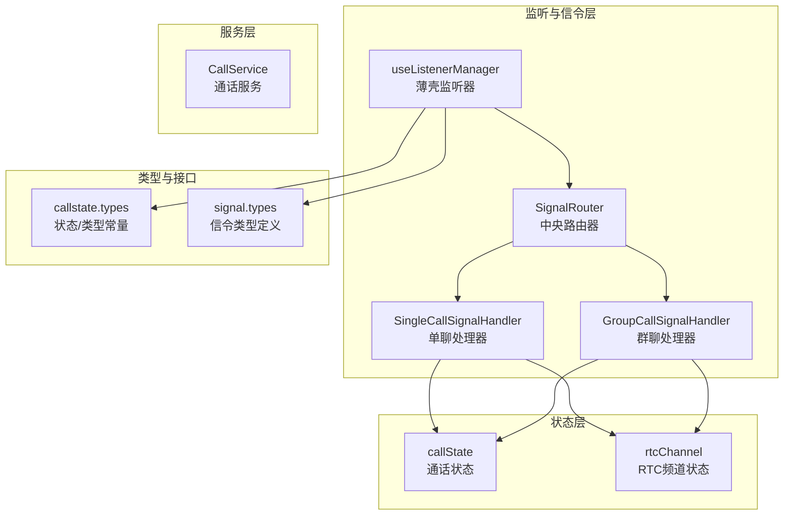
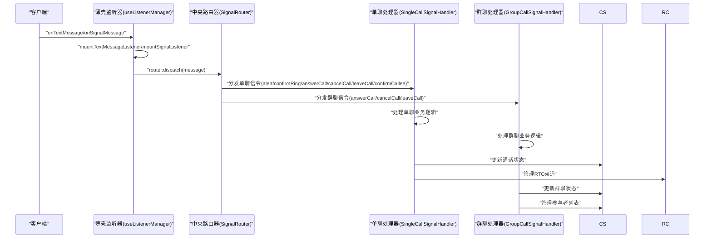
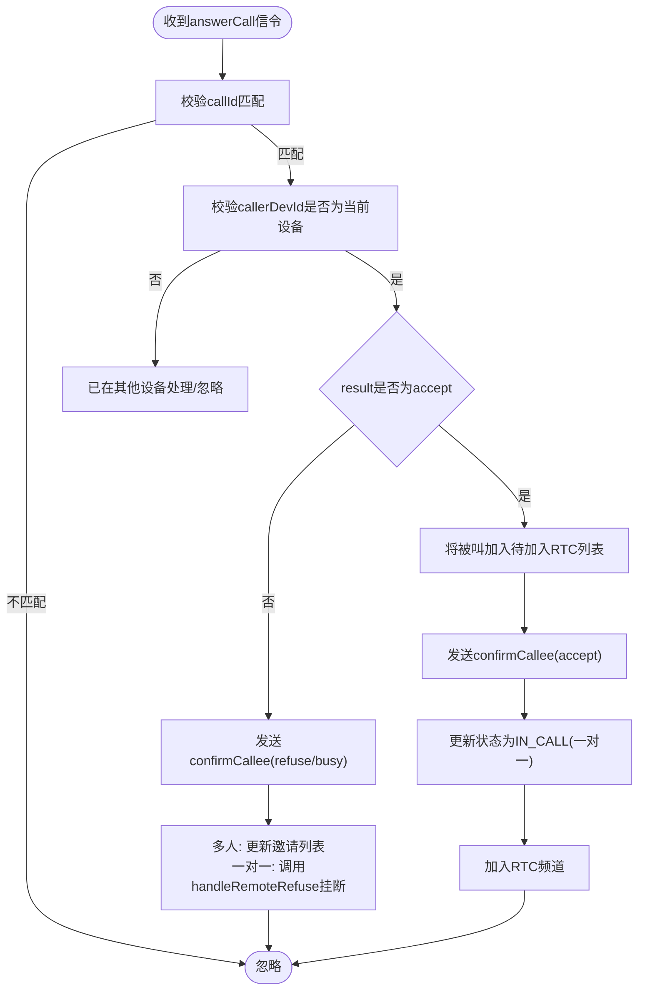
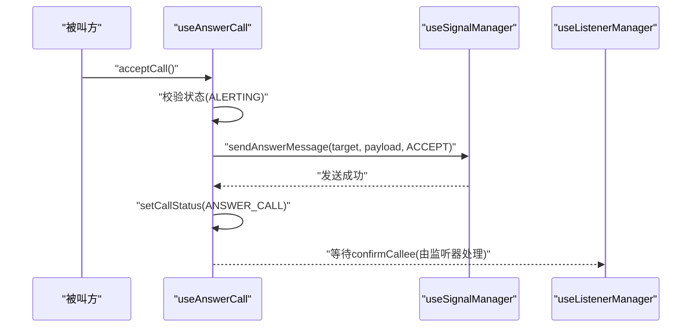
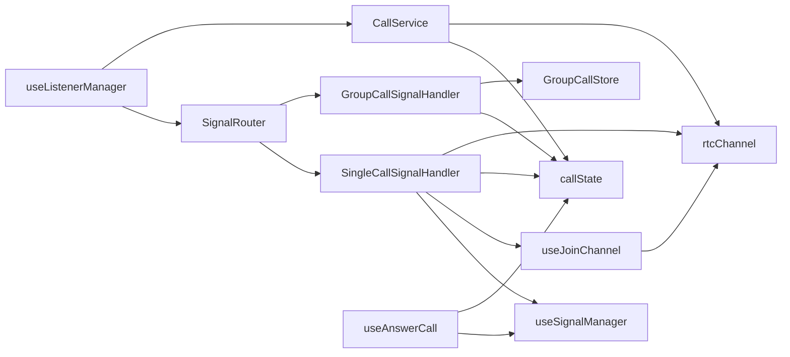

# 监听器管理

<cite>
**本文档引用的文件**
- [lib/composables/useListenerManager.ts](file://lib/composables/useListenerManager.ts)
- [lib/signaling/SignalRouter.ts](file://lib/signaling/SignalRouter.ts)
- [lib/signaling/SingleCallSignalHandler.ts](file://lib/signaling/SingleCallSignalHandler.ts)
- [lib/signaling/GroupCallSignalHandler.ts](file://lib/signaling/GroupCallSignalHandler.ts)
- [lib/composables/useSignalManager.ts](file://lib/composables/useSignalManager.ts)
- [lib/composables/useAnswerCall.ts](file://lib/composables/useAnswerCall.ts)
- [lib/composables/useJoinChannel.ts](file://lib/composables/useJoinChannel.ts)
- [lib/services/CallService.ts](file://lib/services/CallService.ts)
- [lib/store/callState.ts](file://lib/store/callState.ts)
- [lib/store/rtcChannel.ts](file://lib/store/rtcChannel.ts)
- [lib/types/callstate.types.ts](file://lib/types/callstate.types.ts)
- [lib/types/signal.types.ts](file://lib/types/signal.types.ts)
- [lib/SIGNALING_IMPLEMENTATION.md](file://lib/SIGNALING_IMPLEMENTATION.md)
- [lib/ARCHITECTURE.md](file://lib/ARCHITECTURE.md)
- [lib/index.ts](file://lib/index.ts)
</cite>

## 更新摘要
**变更内容**
- useListenerManager 从复杂的信令处理逻辑简化为薄壳包装
- 新增 SignalRouter 作为中央信令路由器
- 新增 SingleCallSignalHandler 和 GroupCallSignalHandler 专用处理器
- 重构信令处理架构，实现职责分离和更好的可维护性

## 目录
1. [简介](#简介)
2. [项目结构](#项目结构)
3. [核心组件](#核心组件)
4. [架构总览](#架构总览)
5. [详细组件分析](#详细组件分析)
6. [依赖关系分析](#依赖关系分析)
7. [性能考虑](#性能考虑)
8. [故障排查指南](#故障排查指南)
9. [结论](#结论)

## 简介
本文件聚焦于"监听器管理"子系统，系统化阐述重构后的信令监听与处理机制。经过架构升级，系统采用"薄壳监听器 + 中央路由器 + 专用处理器"的新模式，将复杂的信令处理逻辑分解为独立的处理器模块，显著提升了代码的可维护性和扩展性。重点解析 SignalRouter 的路由机制、SingleCallSignalHandler 和 GroupCallSignalHandler 的专业化处理逻辑，以及 handleAnswerCallMessage、handleConfirmCalleeMessage 等关键函数的重构实现。

## 项目结构
监听器管理位于组合式API层，围绕重构后的 useListenerManager 组合式API展开，通过 SignalRouter 将信令消息分发给专门的处理器模块。系统采用"薄壳监听器 + 中央路由器 + 专用处理器"的三层架构，配合 useSignalManager、useAnswerCall、useJoinChannel 等模块协同工作。

**图表来源**
- [lib/composables/useListenerManager.ts:38-57](file://lib/composables/useListenerManager.ts#L38-L57)
- [lib/signaling/SignalRouter.ts:12-35](file://lib/signaling/SignalRouter.ts#L12-L35)
- [lib/signaling/SingleCallSignalHandler.ts:17-46](file://lib/signaling/SingleCallSignalHandler.ts#L17-L46)
- [lib/signaling/GroupCallSignalHandler.ts:17-36](file://lib/signaling/GroupCallSignalHandler.ts#L17-L36)

**章节来源**
- [lib/ARCHITECTURE.md:79-82](file://lib/ARCHITECTURE.md#L79-L82)

## 核心组件
- **薄壳监听器管理器**：简化为纯粹的消息监听和路由转发，不再直接处理复杂的业务逻辑
- **中央信令路由器**：根据 action 将消息分发给对应的专用处理器，实现解耦和可扩展性
- **单聊专用处理器**：处理一对一通话的所有信令逻辑，包括状态流转和 RTC 集成
- **群聊专用处理器**：处理多人通话的特殊逻辑，与 GroupCallStore 协同工作
- **信令发送管理**：封装各类信令的发送逻辑，保证发送路径统一、错误可控
- **被叫应答**：提供 accept/reject/buys 拒绝三种应答能力，构建并发送 answerCall 信令
- **加入频道**：在信令确认后触发加入 RTC 频道，创建并发布本地音视频轨道
- **通话服务**：统一挂断策略与资源清理，支持多种挂断原因和场景

**章节来源**
- [lib/composables/useListenerManager.ts:32-37](file://lib/composables/useListenerManager.ts#L32-L37)
- [lib/signaling/SignalRouter.ts:8-11](file://lib/signaling/SignalRouter.ts#L8-L11)
- [lib/signaling/SingleCallSignalHandler.ts:12-16](file://lib/signaling/SingleCallSignalHandler.ts#L12-L16)
- [lib/signaling/GroupCallSignalHandler.ts:12-16](file://lib/signaling/GroupCallSignalHandler.ts#L12-L16)

## 架构总览
重构后的监听器管理采用"薄壳监听 + 中央路由 + 专用处理器"的模式，通过 SignalRouter 实现信令消息的智能分发，SingleCallSignalHandler 和 GroupCallSignalHandler 各自承担特定领域的处理逻辑，形成高度解耦的信令处理链路。

**图表来源**
- [lib/composables/useListenerManager.ts:213-238](file://lib/composables/useListenerManager.ts#L213-L238)
- [lib/signaling/SignalRouter.ts:22-34](file://lib/signaling/SignalRouter.ts#L22-L34)
- [lib/signaling/SingleCallSignalHandler.ts:24-46](file://lib/signaling/SingleCallSignalHandler.ts#L24-L46)
- [lib/signaling/GroupCallSignalHandler.ts:23-36](file://lib/signaling/GroupCallSignalHandler.ts#L23-L36)

## 详细组件分析

### 薄壳监听器管理器（useListenerManager）
**职责与要点**
- **文本消息监听**：识别 action=invite 的文本消息，验证接收者身份，更新通话状态，发送 alert 信令，启动超时计时
- **信令消息监听**：通过 SignalRouter 将 CMD 信令消息分发给专用处理器，不再直接处理业务逻辑
- **群聊初始化**：在收到群聊邀请时，委托给 GroupCallSignalHandler 进行专门处理
- **多端登录处理**：严格校验 callerDevId/calleeDevId 与当前设备ID，避免跨设备误处理
- **异常与超时**：对异常分支进行日志记录与状态保护，避免状态错乱

**关键改进**
- 从复杂的业务逻辑处理简化为纯粹的消息监听和路由转发
- 通过 SignalRouter 实现信令的智能分发，提升代码可维护性
- 保留原有的多端登录校验和超时控制机制

**章节来源**
- [lib/composables/useListenerManager.ts:58-157](file://lib/composables/useListenerManager.ts#L58-L157)
- [lib/composables/useListenerManager.ts:213-238](file://lib/composables/useListenerManager.ts#L213-L238)

### 中央信令路由器（SignalRouter）
**职责与要点**
- **消息路由**：根据 ext.action 字段将信令消息分发给对应的处理器
- **处理器注册**：支持动态注册和注销处理器，实现灵活的扩展机制
- **错误处理**：对缺失 action 或未注册处理器的情况进行警告和处理
- **批量处理**：同一 action 可以注册多个处理器，实现消息的多重处理

**核心功能**
- `register(action, handler)`：注册指定 action 的处理器
- `dispatch(message)`：分发消息给对应的处理器列表
- 内置处理器映射：alert/confirmRing/answerCall/cancelCall/leaveCall/confirmCallee

**章节来源**
- [lib/signaling/SignalRouter.ts:12-35](file://lib/signaling/SignalRouter.ts#L12-L35)

### 单聊专用处理器（SingleCallSignalHandler）
**职责与要点**
- **状态流转处理**：处理 alert、confirmRing、answerCall、cancelCall、leaveCall、confirmCallee 等所有单聊相关信令
- **多端登录校验**：严格校验 callerDevId/calleeDevId 与当前设备ID
- **RTC 集成**：在适当的时机调用 joinChannel 加入 RTC 频道
- **挂断处理**：根据不同的拒绝原因执行相应的挂断策略
- **状态同步**：更新 callStateStore 和 rtcChannelStore 的状态

**关键处理逻辑**
- `handleAlert`：收到 alert 后发送 confirmRing 并启动超时
- `handleConfirmRing`：确认被叫已响铃，更新状态为 RECEIVED_CONFIRM_RING
- `handleAnswerCall`：核心处理逻辑，区分 accept/refuse/busy，发送 confirmCallee
- `handleConfirmCallee`：被叫方收到 confirmCallee 后进入 IN_CALL 并 join RTC
- `handleCancelCall/handleLeaveCall`：处理取消与离开，触发挂断或成员移除

**图表来源**
- [lib/signaling/SingleCallSignalHandler.ts:172-270](file://lib/signaling/SingleCallSignalHandler.ts#L172-L270)

**章节来源**
- [lib/signaling/SingleCallSignalHandler.ts:17-46](file://lib/signaling/SingleCallSignalHandler.ts#L17-L46)
- [lib/signaling/SingleCallSignalHandler.ts:172-270](file://lib/signaling/SingleCallSignalHandler.ts#L172-L270)
- [lib/signaling/SingleCallSignalHandler.ts:405-431](file://lib/signaling/SingleCallSignalHandler.ts#L405-L431)

### 群聊专用处理器（GroupCallSignalHandler）
**职责与要点**
- **群聊初始化**：处理群聊邀请文本消息，初始化 GroupCallStore
- **成员管理**：处理 answerCall、cancelCall、leaveCall 等群聊成员相关信令
- **状态同步**：与 GroupCallStore 协同，维护群聊参与者的状态
- **容错处理**：对群聊场景下的 callId 不匹配等情况进行容错处理

**关键处理逻辑**
- `handleInviteTextMessage`：初始化群聊会话和参与者列表
- `handleAnswerCall`：群聊成员接受/拒绝时的处理逻辑
- `handleCancelCall`：群聊取消的容错处理
- `handleLeaveCall`：群聊成员离开时的处理逻辑

**章节来源**
- [lib/signaling/GroupCallSignalHandler.ts:17-36](file://lib/signaling/GroupCallSignalHandler.ts#L17-L36)
- [lib/signaling/GroupCallSignalHandler.ts:121-154](file://lib/signaling/GroupCallSignalHandler.ts#L121-L154)
- [lib/signaling/GroupCallSignalHandler.ts:159-194](file://lib/signaling/GroupCallSignalHandler.ts#L159-L194)
- [lib/signaling/GroupCallSignalHandler.ts:199-261](file://lib/signaling/GroupCallSignalHandler.ts#L199-L261)

### 信令发送管理（useSignalManager）
职责与要点
- 统一封装 sendInviteMessage、sendAlertMessage、sendConfirmRingMessage、sendAnswerMessage、sendConfirmCalleeMessage、sendCancelMessage、sendLeaveMessage。
- 每个发送方法均包含错误捕获与日志记录，确保调用方无需关心底层细节。
- 与 ChatService 协作，构造正确的 CMD 信令消息并发送。

关键点
- sendAnswerMessage：被叫方发送 answerCall 信令，支持 result=accept/refuse/busy。
- sendConfirmCalleeMessage：主叫收到 accept 后发送 confirmCallee，通知被叫已确认。
- sendLeaveMessage/sendCancelMessage：分别处理离开与取消场景。

**章节来源**
- [lib/composables/useSignalManager.ts:73-102](file://lib/composables/useSignalManager.ts#L73-L102)
- [lib/composables/useSignalManager.ts:110-139](file://lib/composables/useSignalManager.ts#L110-L139)
- [lib/composables/useSignalManager.ts:277-303](file://lib/composables/useSignalManager.ts#L277-L303)
- [lib/composables/useSignalManager.ts:311-341](file://lib/composables/useSignalManager.ts#L311-L341)

### 被叫应答（useAnswerCall）
职责与要点
- 提供 acceptCall/rejectCall/busyRejectCall 三类应答。
- 在 accept 时发送 answerCall(result=accept)，更新状态为 ANSWER_CALL，并预留加入 RTC 的位置。
- 在 reject/busy 时发送对应 result 的 answerCall，并重置通话状态。

**图表来源**
- [lib/composables/useAnswerCall.ts:27-73](file://lib/composables/useAnswerCall.ts#L27-L73)
- [lib/composables/useSignalManager.ts:110-139](file://lib/composables/useSignalManager.ts#L110-L139)
- [lib/composables/useListenerManager.ts:553-618](file://lib/composables/useListenerManager.ts#L553-L618)

**章节来源**
- [lib/composables/useAnswerCall.ts:19-169](file://lib/composables/useAnswerCall.ts#L19-L169)

### 加入频道（useJoinChannel）
职责与要点
- 在信令确认后触发加入 RTC 频道，获取并校验 Token，创建音视频轨道并发布。
- 支持单聊与多人场景，自动区分视频/音频类型。
- 与 rtcChannelStore 协作，维护连接状态、计时器与用户映射。

**章节来源**
- [lib/composables/useJoinChannel.ts:79-200](file://lib/composables/useJoinChannel.ts#L79-L200)
- [lib/store/rtcChannel.ts:242-272](file://lib/store/rtcChannel.ts#L242-L272)
- [lib/store/rtcChannel.ts:342-368](file://lib/store/rtcChannel.ts#L342-L368)

### 通话服务（CallService）
职责与要点
- 统一挂断策略：根据原因选择 cancel/remote-cancel/remote-refuse/busy/no-response/handle-on-other-device/abnormal-end 等策略。
- 资源清理：取消发布本地轨道、关闭本地轨道、离开频道并重置 RTC 状态。
- 状态重置：调用 callStateStore.resetCallState，确保 UI 与状态一致。

**章节来源**
- [lib/services/CallService.ts:25-72](file://lib/services/CallService.ts#L25-L72)
- [lib/services/CallService.ts:102-164](file://lib/services/CallService.ts#L102-L164)
- [lib/services/CallService.ts:195-257](file://lib/services/CallService.ts#L195-L257)
- [lib/services/CallService.ts:260-276](file://lib/services/CallService.ts#L260-L276)

### 状态存储（callState/rtcChannel）
职责与要点
- callState：管理通话状态机、超时计时、用户信息映射、群组成员列表等。
- rtcChannel：管理 RTC 连接、频道参与者、UID/UserId 映射、待加入/已离开用户集合、通话计时等。

**章节来源**
- [lib/store/callState.ts:11-37](file://lib/store/callState.ts#L11-L37)
- [lib/store/callState.ts:142-189](file://lib/store/callState.ts#L142-L189)
- [lib/store/rtcChannel.ts:11-28](file://lib/store/rtcChannel.ts#L11-L28)
- [lib/store/rtcChannel.ts:292-337](file://lib/store/rtcChannel.ts#L292-L337)

### 类型与接口（callstate.types/signal.types）
职责与要点
- 定义通话状态、通话类型、挂断原因、信令动作等常量与联合类型。
- 定义 Invite/Alert/ConfirmRing/AnswerCall/ConfirmCallee/Cancel/Leave 等信令扩展字段结构。

**章节来源**
- [lib/types/callstate.types.ts:13-48](file://lib/types/callstate.types.ts#L13-L48)
- [lib/types/callstate.types.ts:69-93](file://lib/types/callstate.types.ts#L69-L93)
- [lib/types/signal.types.ts:47-196](file://lib/types/signal.types.ts#L47-L196)

## 依赖关系分析
重构后的依赖关系更加清晰，useListenerManager 仅负责监听和路由，具体的业务逻辑由专用处理器承担，实现了真正的职责分离。

**图表来源**
- [lib/composables/useListenerManager.ts:38-57](file://lib/composables/useListenerManager.ts#L38-L57)
- [lib/signaling/SingleCallSignalHandler.ts:17-22](file://lib/signaling/SingleCallSignalHandler.ts#L17-L22)
- [lib/signaling/GroupCallSignalHandler.ts:17-21](file://lib/signaling/GroupCallSignalHandler.ts#L17-L21)

## 性能考虑
- **路由效率**：SignalRouter 使用 Map 数据结构存储处理器映射，查找复杂度为 O(1)
- **处理器复用**：SingleCallSignalHandler 和 GroupCallSignalHandler 作为单例使用，避免重复创建
- **消息分发**：同一 action 的多个处理器按注册顺序依次执行，支持并行处理
- **内存管理**：薄壳监听器不持有业务状态，减少内存占用
- **错误隔离**：处理器内部的错误不会影响其他处理器的正常运行

**章节来源**
- [lib/signaling/SignalRouter.ts:13-20](file://lib/signaling/SignalRouter.ts#L13-L20)
- [lib/composables/useListenerManager.ts:44-46](file://lib/composables/useListenerManager.ts#L44-L46)

## 故障排查指南
**常见问题与定位步骤**
- **问题：信令消息未被处理**
  - 现象：收到的信令消息没有任何反应
  - 根因：SignalRouter 未注册对应的处理器或消息缺少 action 字段
  - 解决：检查 router.register 调用和消息的 ext.action 字段
  - 参考：[lib/signaling/SignalRouter.ts:22-34](file://lib/signaling/SignalRouter.ts#L22-L34)

- **问题：单聊处理逻辑异常**
  - 现象：一对一通话状态流转异常
  - 根因：SingleCallSignalHandler 的状态校验或业务逻辑错误
  - 解决：检查 handleAnswerCall/handleConfirmCallee 等方法的实现
  - 参考：[lib/signaling/SingleCallSignalHandler.ts:172-270](file://lib/signaling/SingleCallSignalHandler.ts#L172-L270)

- **问题：群聊成员管理异常**
  - 现象：群聊成员状态不正确或离开后未移除
  - 根因：GroupCallSignalHandler 的成员管理逻辑错误
  - 解决：检查 handleAnswerCall/handleLeaveCall 的实现
  - 参考：[lib/signaling/GroupCallSignalHandler.ts:121-154](file://lib/signaling/GroupCallSignalHandler.ts#L121-L154)

- **问题：多端登录冲突**
  - 现象：其他设备已处理 answerCall，当前设备仍处理
  - 根因：未校验 callerDevId/calleeDevId
  - 解决：检查 SingleCallSignalHandler 中的设备ID校验逻辑
  - 参考：[lib/signaling/SingleCallSignalHandler.ts:200-218](file://lib/signaling/SingleCallSignalHandler.ts#L200-L218)

**调试技巧**
- 使用 SignalRouter 的日志输出定位消息分发问题
- 在处理器内部使用详细的日志记录业务逻辑执行路径
- 利用 CallService 的 hangup 方法观察资源清理过程
- 在多人通话场景下，关注 GroupCallStore 的状态变化

**章节来源**
- [lib/signaling/SignalRouter.ts:22-34](file://lib/signaling/SignalRouter.ts#L22-L34)
- [lib/signaling/SingleCallSignalHandler.ts:200-218](file://lib/signaling/SingleCallSignalHandler.ts#L200-L218)
- [lib/signaling/GroupCallSignalHandler.ts:121-154](file://lib/signaling/GroupCallSignalHandler.ts#L121-L154)
- [lib/services/CallService.ts:25-72](file://lib/services/CallService.ts#L25-L72)

## 结论
重构后的监听器管理通过"薄壳监听器 + 中央路由器 + 专用处理器"的架构，实现了信令处理逻辑的高度解耦和专业化分工。薄壳监听器专注于消息监听和路由转发，Central Router 负责智能分发，SingleCallSignalHandler 和 GroupCallSignalHandler 各自承担特定领域的处理逻辑。这种架构不仅提升了代码的可维护性和扩展性，还保持了原有的多端登录校验、超时控制与 RTC 频道接入等关键特性。新的架构为未来的功能扩展和维护提供了更好的基础。