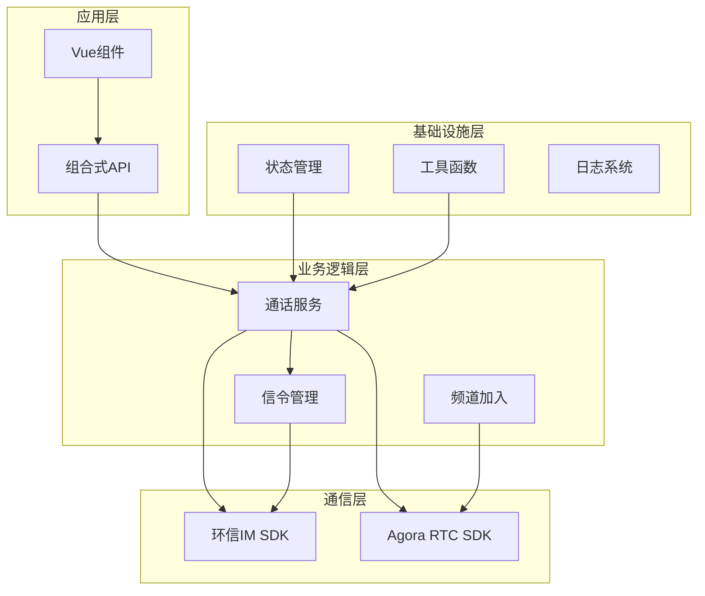
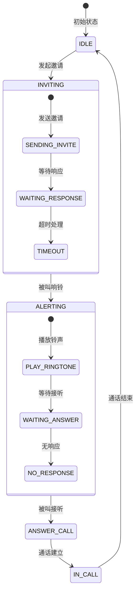
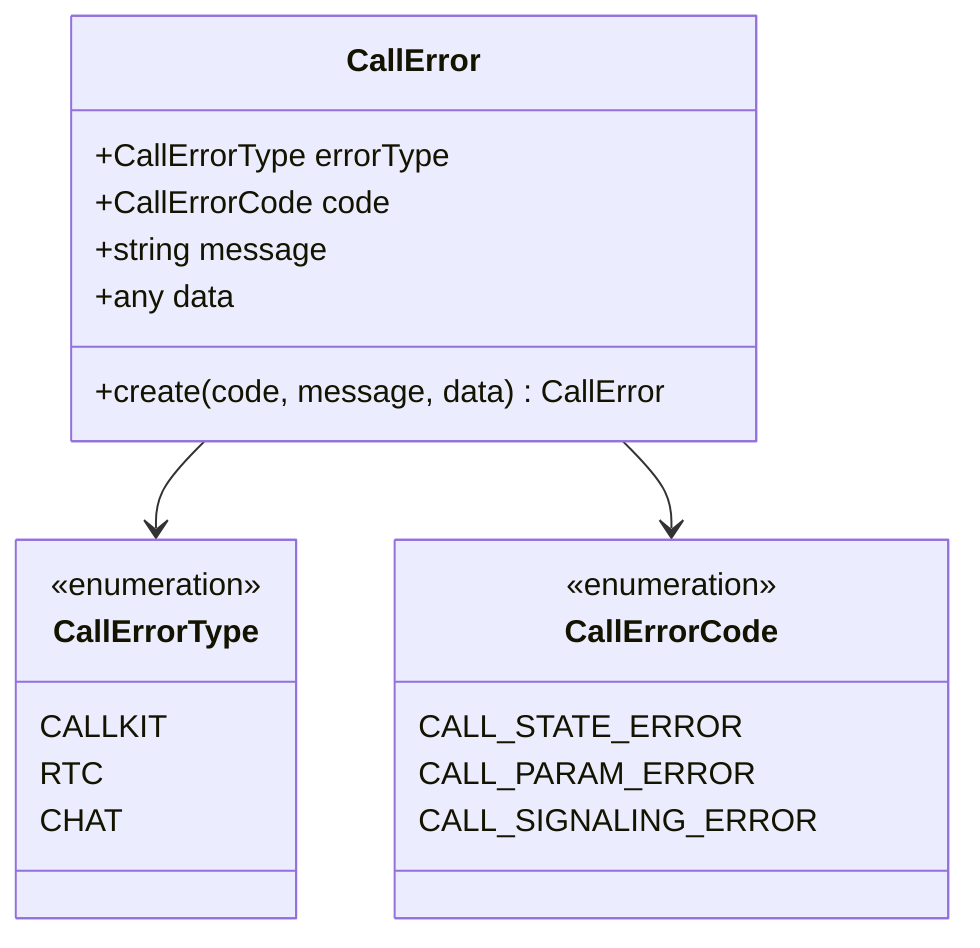
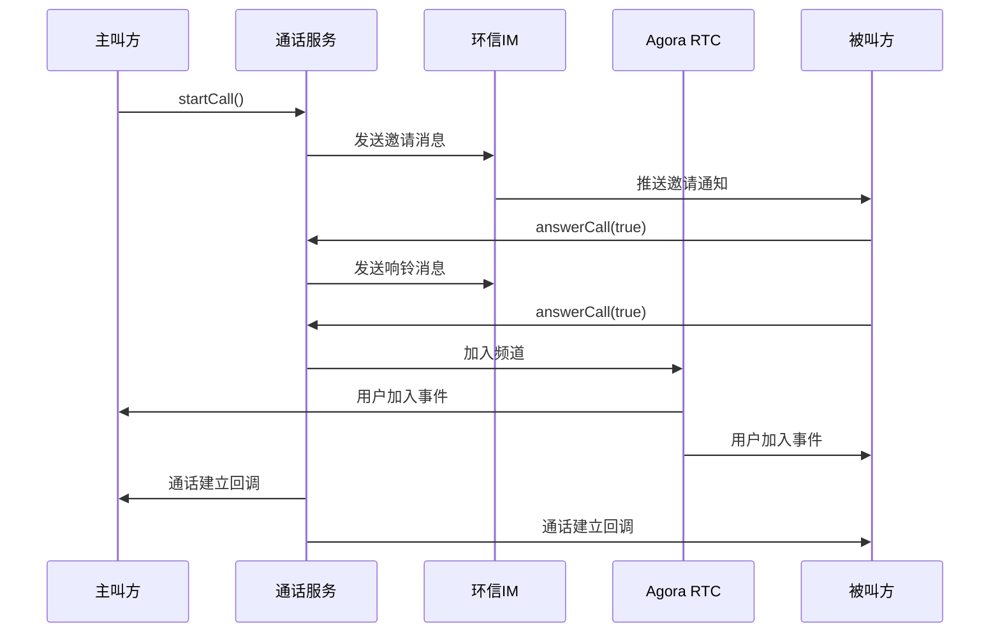
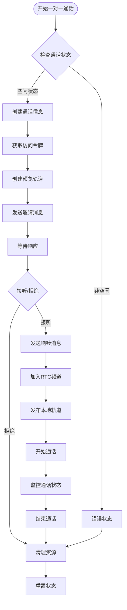
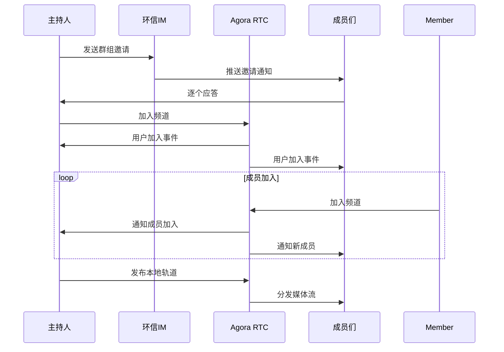
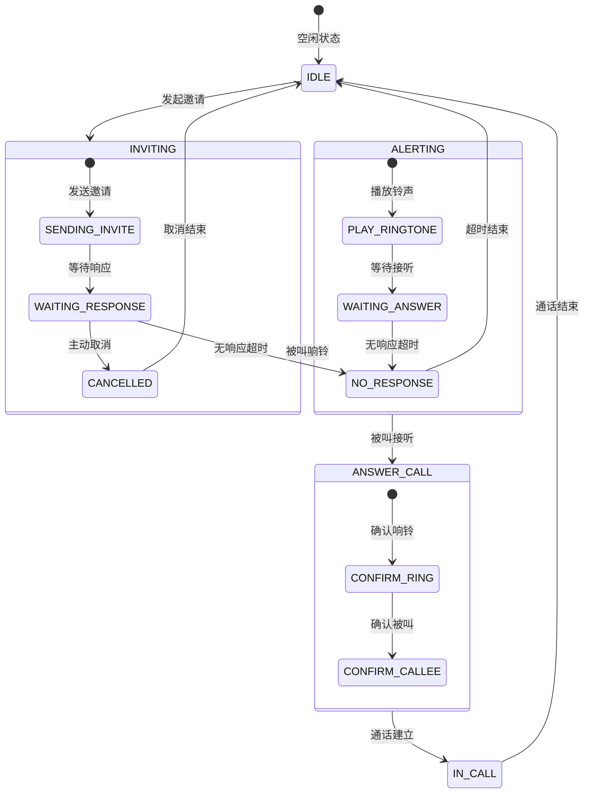
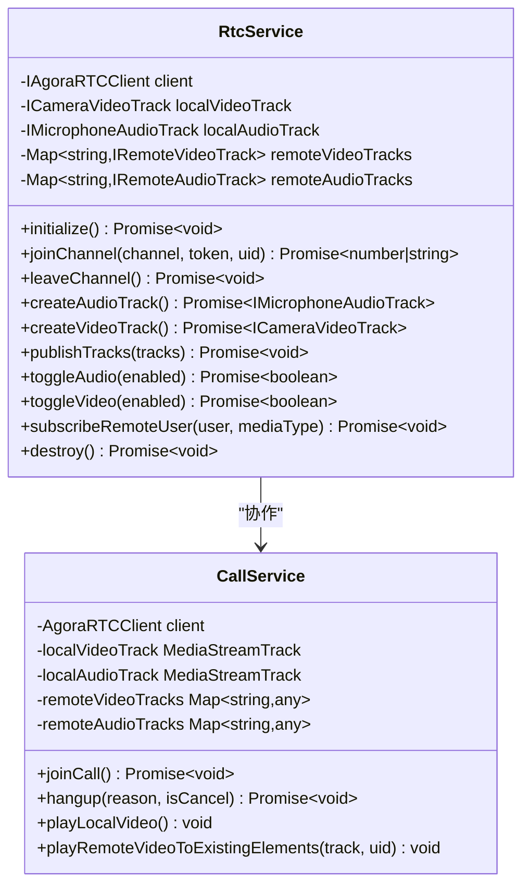
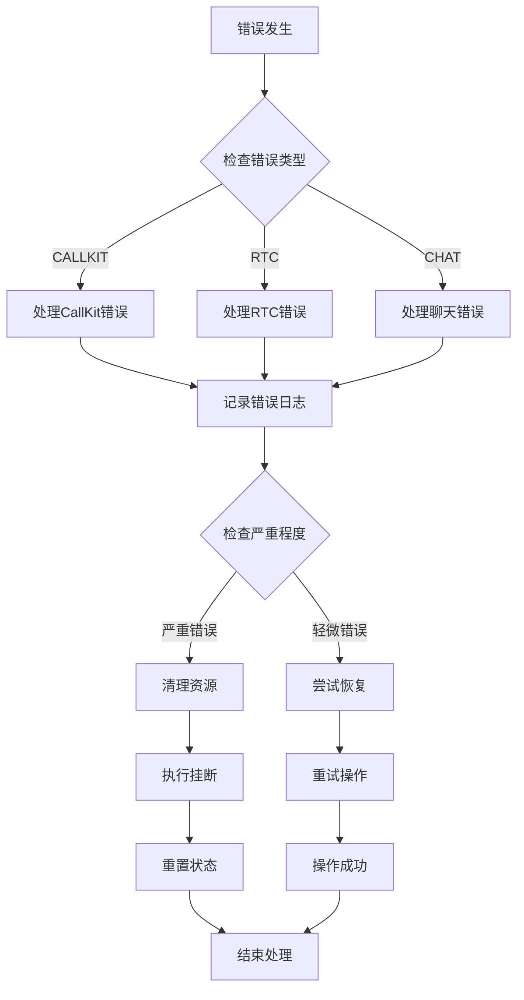
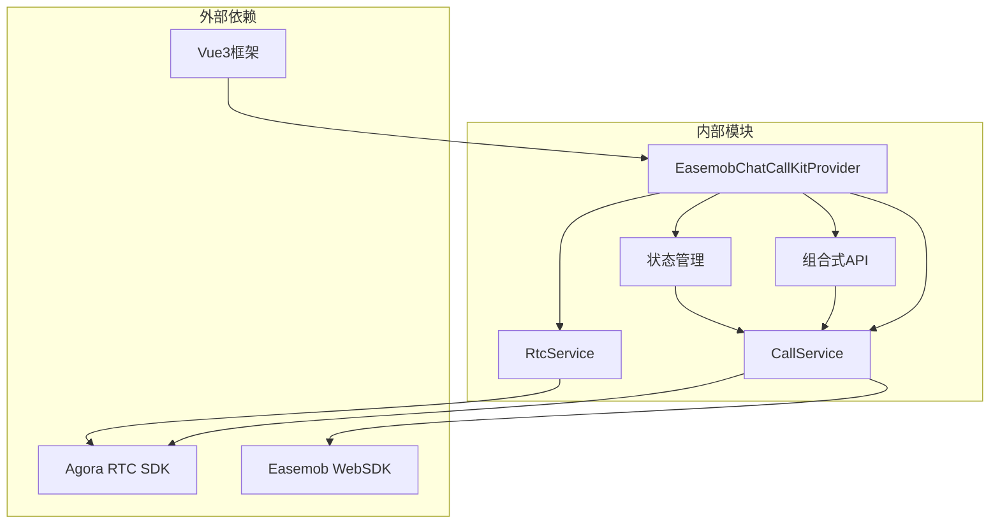

# 通话流程管理

<cite>
**本文档引用的文件**
- [callkit/services/CallService.ts](file://callkit/services/CallService.ts)
- [callkit/types/index.ts](file://callkit/types/index.ts)
- [callkit/services/CallError.ts](file://callkit/services/CallError.ts)
- [lib/index.ts](file://lib/index.ts)
- [lib/types.ts](file://lib/types.ts)
- [lib/core/sdk/imSDK/index.ts](file://lib/core/sdk/imSDK/index.ts)
- [lib/services/RtcService.ts](file://lib/services/RtcService.ts)
- [lib/components/EasemobChatCallKitProvider.vue](file://lib/components/EasemobChatCallKitProvider.vue)
- [lib/composables/useCallKit.ts](file://lib/composables/useCallKit.ts)
</cite>

## 目录
1. [简介](#简介)
2. [项目结构](#项目结构)
3. [核心组件](#核心组件)
4. [架构概览](#架构概览)
5. [详细组件分析](#详细组件分析)
6. [依赖关系分析](#依赖关系分析)
7. [性能考虑](#性能考虑)
8. [故障排除指南](#故障排除指南)
9. [结论](#结论)

## 简介

Easemob Chat CallKit Vue3 是一个基于 Vue3 和环信聊天 SDK 的音视频通话解决方案。该项目提供了完整的通话流程管理，包括一对一和群组通话的完整生命周期管理。

该系统采用模块化设计，主要包含以下核心功能：
- 通话状态管理（INVITING、ALERTING、ANSWER_CALL、IN_CALL 等）
- 邀请和应答机制
- 音视频轨道管理
- 群组通话支持
- 错误处理和异常恢复
- 超时处理机制

## 项目结构

项目采用分层架构设计，主要分为以下几个层次：

**图表来源**
- [lib/index.ts](file://lib/index.ts#L1-L58)
- [lib/components/EasemobChatCallKitProvider.vue](file://lib/components/EasemobChatCallKitProvider.vue#L1-L115)

**章节来源**
- [lib/index.ts](file://lib/index.ts#L1-L58)
- [lib/types.ts](file://lib/types.ts#L1-L91)

## 核心组件

### 通话状态管理

系统定义了完整的通话状态枚举，涵盖了从发起邀请到通话结束的各个阶段：

**图表来源**
- [callkit/services/CallService.ts](file://callkit/services/CallService.ts#L14-L32)

### 通话类型定义

系统支持多种通话类型，包括一对一和群组通话：

| 通话类型 | 数字标识 | 描述 | 支持媒体 |
|---------|---------|------|---------|
| AUDIO_1V1 | 0 | 一对一音频通话 | 音频 |
| VIDEO_1V1 | 1 | 一对一视频通话 | 音频+视频 |
| VIDEO_MULTI | 2 | 群组视频通话 | 音频+视频 |
| AUDIO_MULTI | 3 | 群组音频通话 | 音频 |

**章节来源**
- [callkit/services/CallService.ts](file://callkit/services/CallService.ts#L26-L32)

### 错误处理机制

系统采用统一的错误处理机制，定义了三种错误类型：

**图表来源**
- [callkit/services/CallError.ts](file://callkit/services/CallError.ts#L1-L43)

**章节来源**
- [callkit/services/CallError.ts](file://callkit/services/CallError.ts#L1-L43)

## 架构概览

系统采用事件驱动的架构模式，通过消息队列和事件监听器实现松耦合的组件通信。

**图表来源**
- [callkit/services/CallService.ts](file://callkit/services/CallService.ts#L345-L527)
- [callkit/services/CallService.ts](file://callkit/services/CallService.ts#L686-L727)

## 详细组件分析

### CallService 核心功能

CallService 是整个通话系统的核心，负责管理通话的完整生命周期。

#### 一对一通话流程

一对一通话流程包含了复杂的状态转换和信令交互：

**图表来源**
- [callkit/services/CallService.ts](file://callkit/services/CallService.ts#L345-L527)
- [callkit/services/CallService.ts](file://callkit/services/CallService.ts#L686-L727)

#### 群组通话流程

群组通话相比一对一通话更加复杂，需要处理多个参与者的加入和离开：

**图表来源**
- [callkit/services/CallService.ts](file://callkit/services/CallService.ts#L512-L526)
- [callkit/services/CallService.ts](file://callkit/services/CallService.ts#L806-L1358)

#### 通话状态转换

系统实现了完整的通话状态转换机制，确保状态的一致性和可预测性：

**图表来源**
- [callkit/services/CallService.ts](file://callkit/services/CallService.ts#L14-L32)

**章节来源**
- [callkit/services/CallService.ts](file://callkit/services/CallService.ts#L116-L285)

### 信令处理机制

系统实现了完善的信令处理机制，支持多种信令类型的处理：

| 信令类型 | 作用 | 触发条件 | 处理流程 |
|---------|------|---------|---------|
| invite | 邀请 | 主叫发起 | 创建通话信息 → 发送响铃 → 等待应答 |
| alert | 响铃 | 被叫收到邀请 | 发送确认响铃 → 等待应答 |
| answerCall | 应答 | 被叫接听/拒绝 | 发送确认 → 加入频道 → 开始通话 |
| confirmRing | 确认响铃 | 被叫确认 | 更新状态 → 等待确认被叫 |
| confirmCallee | 确认被叫 | 主叫确认 | 更新状态 → 通话建立 |
| cancelCall | 取消 | 主动取消 | 发送取消消息 → 清理资源 |
| leaveCall | 离开 | 用户离开 | 发送离开消息 → 更新状态 |

**章节来源**
- [callkit/services/CallService.ts](file://callkit/services/CallService.ts#L2335-L2366)

### 音视频轨道管理

系统提供了完整的音视频轨道管理功能，包括轨道创建、发布、订阅和清理：

**图表来源**
- [lib/services/RtcService.ts](file://lib/services/RtcService.ts#L42-L77)
- [callkit/services/CallService.ts](file://callkit/services/CallService.ts#L806-L1358)

**章节来源**
- [lib/services/RtcService.ts](file://lib/services/RtcService.ts#L1-L719)

### 错误处理和异常恢复

系统实现了多层次的错误处理和异常恢复机制：

**图表来源**
- [callkit/services/CallService.ts](file://callkit/services/CallService.ts#L1360-L1683)

**章节来源**
- [callkit/services/CallService.ts](file://callkit/services/CallService.ts#L1360-L1683)

## 依赖关系分析

系统采用模块化设计，各组件之间的依赖关系清晰明确：

**图表来源**
- [lib/index.ts](file://lib/index.ts#L1-L58)
- [lib/components/EasemobChatCallKitProvider.vue](file://lib/components/EasemobChatCallKitProvider.vue#L1-L115)

**章节来源**
- [lib/index.ts](file://lib/index.ts#L1-L58)
- [lib/core/sdk/imSDK/index.ts](file://lib/core/sdk/imSDK/index.ts#L1-L12)

## 性能考虑

系统在设计时充分考虑了性能优化，主要包括：

### 资源管理优化
- 音视频轨道的智能创建和复用
- 资源清理的异步处理
- 内存泄漏的预防措施

### 网络优化
- RTC Token的动态获取和缓存
- 网络质量的实时监控
- 媒体流的智能订阅

### 用户体验优化
- 预览模式的快速响应
- 铃声播放的异步处理
- UI更新的批量处理

## 故障排除指南

### 常见问题及解决方案

| 问题类型 | 症状 | 可能原因 | 解决方案 |
|---------|------|---------|---------|
| 无法发起通话 | 发送邀请失败 | 网络连接问题 | 检查网络状态，重试发送 |
| 通话无法建立 | 加入频道失败 | RTC Token过期 | 重新获取Token，检查权限 |
| 音频无声 | 麦克风权限被拒绝 | 浏览器权限设置 | 检查浏览器权限设置 |
| 视频黑屏 | 摄像头权限被拒绝 | 浏览器权限设置 | 检查摄像头权限设置 |
| 通话中断 | 网络不稳定 | 网络质量差 | 检查网络连接，降低视频质量 |

### 调试建议

1. **启用详细日志**：通过设置日志级别获取详细的调试信息
2. **检查状态机**：验证通话状态转换的正确性
3. **监控资源使用**：观察音视频轨道的创建和销毁情况
4. **网络质量检测**：监控网络质量变化对通话的影响

**章节来源**
- [callkit/services/CallService.ts](file://callkit/services/CallService.ts#L1777-L1791)

## 结论

Easemob Chat CallKit Vue3 提供了一个完整、稳定且高性能的音视频通话解决方案。系统通过模块化设计、完善的错误处理机制和优化的资源管理，为开发者提供了可靠的通话基础能力。

主要特点包括：
- 完整的通话生命周期管理
- 支持一对一和群组通话
- 健壮的错误处理和异常恢复
- 优化的性能表现
- 灵活的配置选项

该系统适用于各种音视频通话场景，为构建高质量的实时通信应用奠定了坚实的基础。