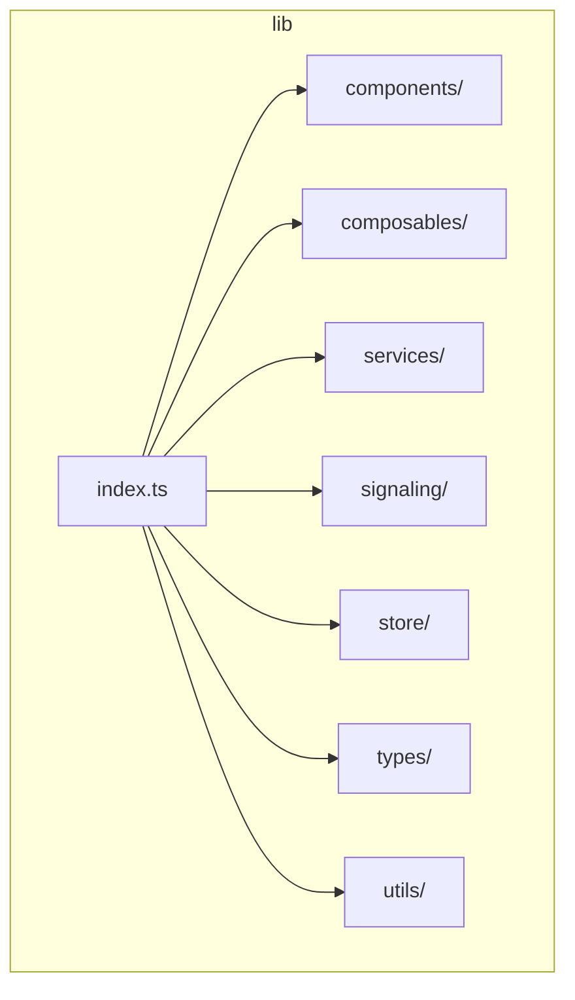
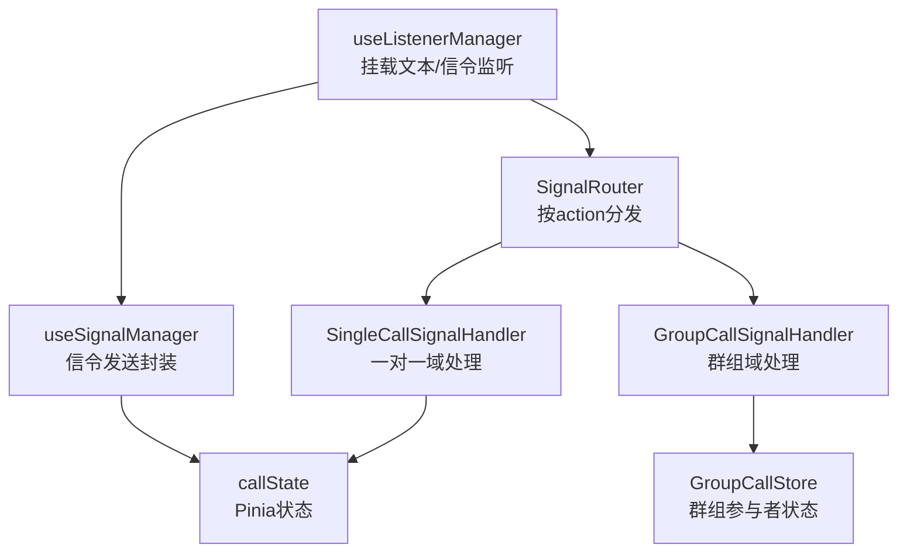
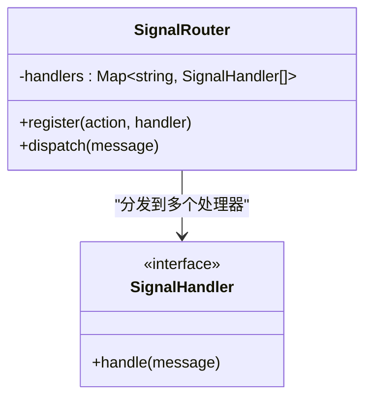
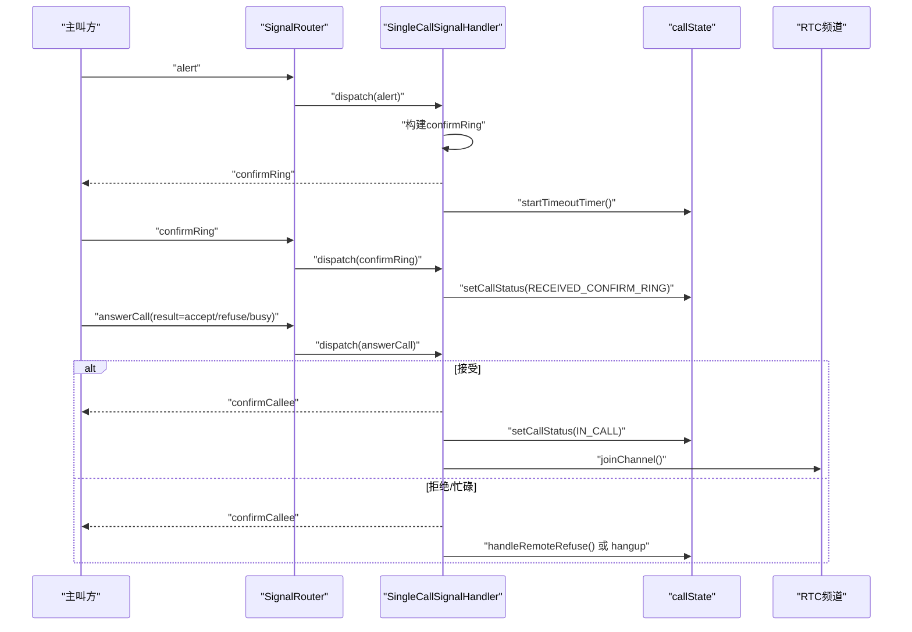
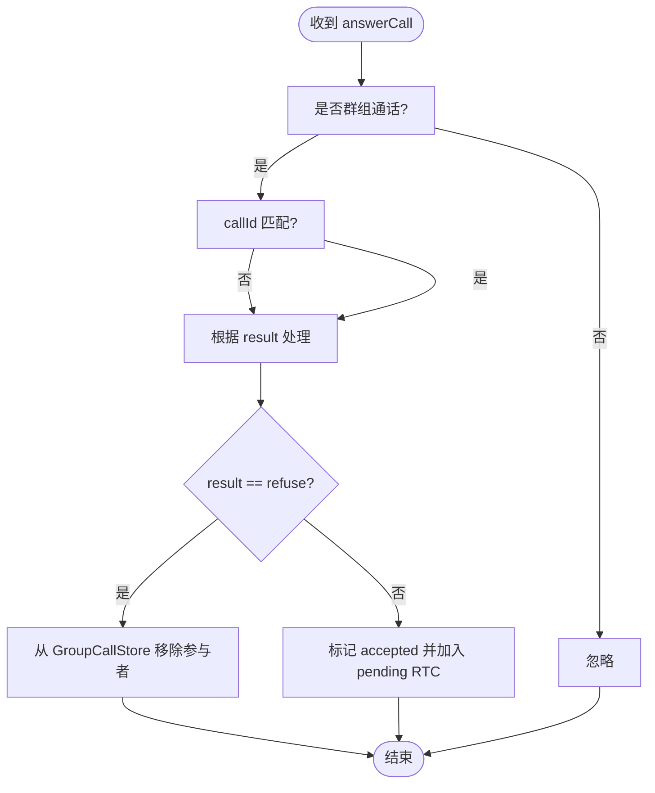
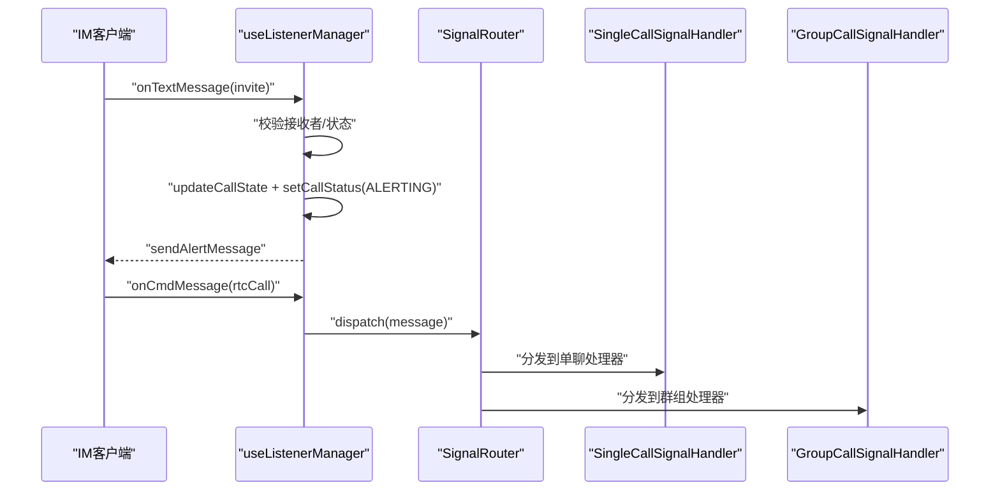
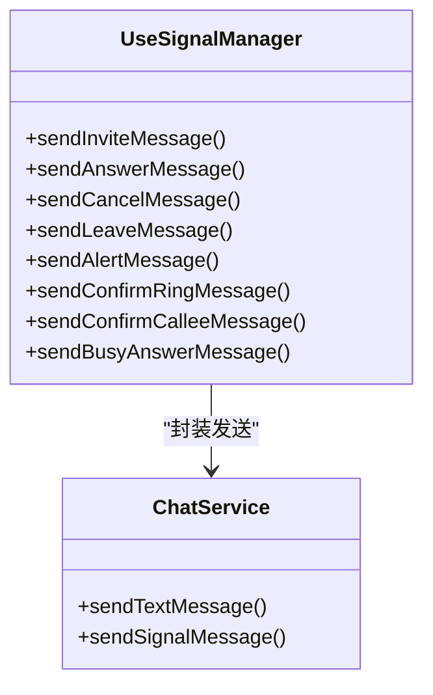
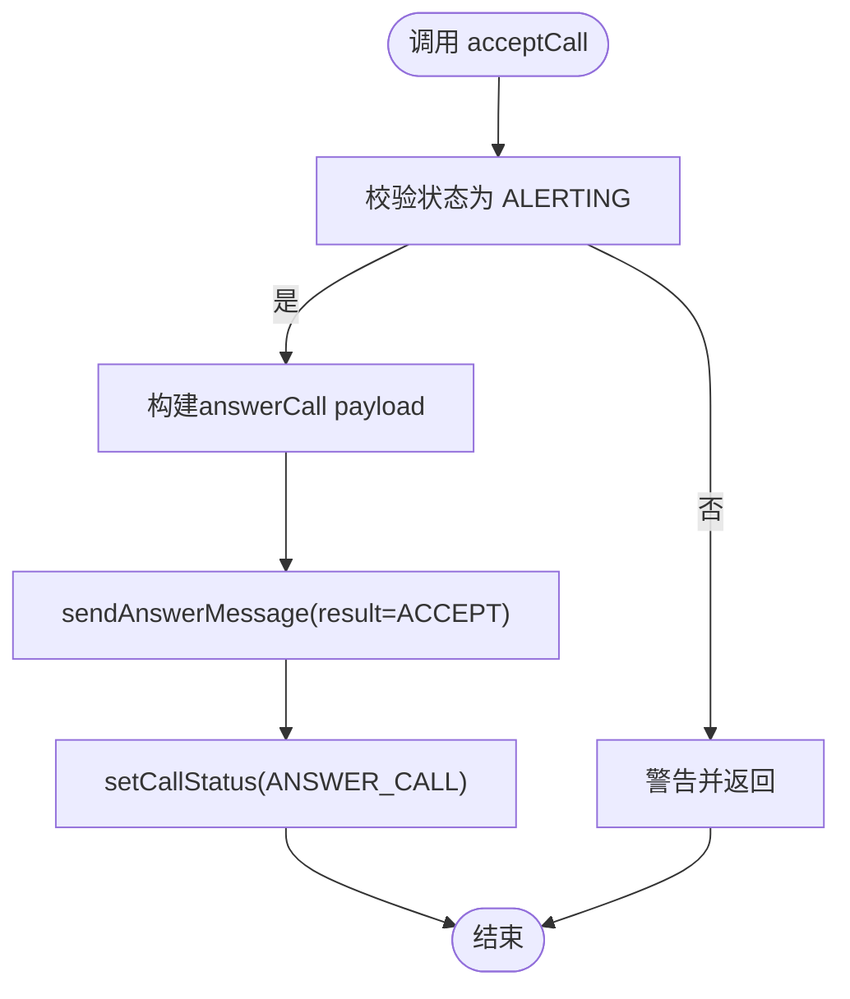
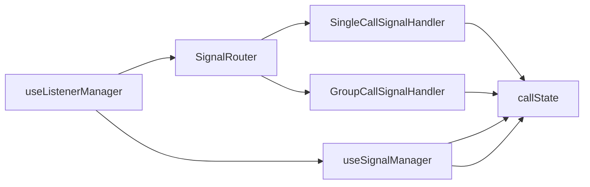

# 信号路由器

<cite>
**本文档引用的文件**
- [README.md](file://README.md)
- [index.ts](file://lib/index.ts)
- [SIGNALING_IMPLEMENTATION.md](file://lib/SIGNALING_IMPLEMENTATION.md)
- [useAnswerCall.ts](file://lib/composables/useAnswerCall.ts)
- [useListenerManager.ts](file://lib/composables/useListenerManager.ts)
- [useSignalManager.ts](file://lib/composables/useSignalManager.ts)
- [SignalRouter.ts](file://lib/signaling/SignalRouter.ts)
- [SingleCallSignalHandler.ts](file://lib/signaling/SingleCallSignalHandler.ts)
- [GroupCallSignalHandler.ts](file://lib/signaling/GroupCallSignalHandler.ts)
- [callState.ts](file://lib/store/callState.ts)
- [types.ts](file://lib/types.ts)
- [ARCHITECTURE.md](file://lib/ARCHITECTURE.md)
- [package.json](file://package.json)
</cite>

## 目录
1. [简介](#简介)
2. [项目结构](#项目结构)
3. [核心组件](#核心组件)
4. [架构总览](#架构总览)
5. [详细组件分析](#详细组件分析)
6. [依赖关系分析](#依赖关系分析)
7. [性能考虑](#性能考虑)
8. [故障排查指南](#故障排查指南)
9. [结论](#结论)

## 简介
本项目是一个基于 Vue3 的环信聊天与音视频通话插件，重点围绕“信号路由器”实现了一套可扩展的信令分发与处理体系。通过 SignalRouter 将不同类型的信令消息分发到对应的处理器（SingleCallSignalHandler、GroupCallSignalHandler），配合监听器管理器（useListenerManager）、信令发送器（useSignalManager）与状态存储（callState），实现了从邀请、响铃、接听/拒绝、确认被叫、取消/离开等完整的一对一与群组通话信令流程。

## 项目结构
项目采用分层架构，主要目录与职责如下：
- lib/components：可复用 UI 组件
- lib/composables：组合式 API，连接服务层与 UI
- lib/services：业务服务封装
- lib/signaling：信令路由与域处理器
- lib/store：Pinia 状态管理
- lib/types：类型定义
- lib/utils：工具函数
- lib/index.ts：插件入口与导出

**图表来源**
- [index.ts:1-70](file://lib/index.ts#L1-L70)

**章节来源**
- [README.md:5-31](file://README.md#L5-L31)
- [index.ts:1-70](file://lib/index.ts#L1-L70)

## 核心组件
- SignalRouter：根据 action 将信令消息分发给已注册的处理器集合
- SingleCallSignalHandler：处理一对一通话域的信令（alert、confirmRing、answerCall、cancelCall、leaveCall、confirmCallee）
- GroupCallSignalHandler：处理群组通话域的信令，维护 GroupCallStore 的参与者状态
- useListenerManager：挂载文本消息与信令监听，通过 SignalRouter 分发
- useSignalManager：封装各类信令发送（invite、answerCall、confirmRing、confirmCallee、cancel、leave、alert）
- useAnswerCall：被叫方接听/拒绝/忙碌拒绝的组合式 API
- callState：Pinia 状态存储，管理通话状态、超时计时等

**章节来源**
- [SignalRouter.ts:1-36](file://lib/signaling/SignalRouter.ts#L1-L36)
- [SingleCallSignalHandler.ts:1-433](file://lib/signaling/SingleCallSignalHandler.ts#L1-L433)
- [GroupCallSignalHandler.ts:1-263](file://lib/signaling/GroupCallSignalHandler.ts#L1-L263)
- [useListenerManager.ts:1-245](file://lib/composables/useListenerManager.ts#L1-L245)
- [useSignalManager.ts:1-354](file://lib/composables/useSignalManager.ts#L1-L354)
- [useAnswerCall.ts:1-169](file://lib/composables/useAnswerCall.ts#L1-L169)
- [callState.ts:1-187](file://lib/store/callState.ts#L1-L187)

## 架构总览
整体架构采用“监听器 → 路由器 → 处理器”的解耦设计，所有 IM 文本消息与 CMD 信令均由 useListenerManager 挂载监听，再通过 SignalRouter 按 action 分发到对应处理器。处理器内部协调状态存储与 RTC 加入逻辑，最终驱动 UI 组件更新。

**图表来源**
- [useListenerManager.ts:38-244](file://lib/composables/useListenerManager.ts#L38-L244)
- [SignalRouter.ts:12-35](file://lib/signaling/SignalRouter.ts#L12-L35)
- [SingleCallSignalHandler.ts:17-46](file://lib/signaling/SingleCallSignalHandler.ts#L17-L46)
- [GroupCallSignalHandler.ts:17-36](file://lib/signaling/GroupCallSignalHandler.ts#L17-L36)
- [useSignalManager.ts:50-353](file://lib/composables/useSignalManager.ts#L50-L353)
- [callState.ts:7-187](file://lib/store/callState.ts#L7-L187)

## 详细组件分析

### 信号路由器（SignalRouter）
- 职责：维护 action 到处理器列表的映射，接收消息后按 action 查找处理器并依次调用
- 特点：支持多处理器注册同一 action，便于扩展不同域的处理逻辑

**图表来源**
- [SignalRouter.ts:12-35](file://lib/signaling/SignalRouter.ts#L12-L35)

**章节来源**
- [SignalRouter.ts:1-36](file://lib/signaling/SignalRouter.ts#L1-L36)

### 单聊域处理器（SingleCallSignalHandler）
- 职责：处理一对一通话的完整信令流，包括 alert、confirmRing、answerCall、cancelCall、leaveCall、confirmCallee
- 关键行为：
  - 收到 alert：构建 confirmRing 并发送，启动超时计时
  - 收到 confirmRing：校验状态与设备 ID，更新状态为 RECEIVED_CONFIRM_RING
  - 收到 answerCall：
    - 拒绝/忙碌：发送 confirmCallee 并执行远端拒绝挂断（一对一）
    - 接受：发送 confirmCallee，一对一更新为 IN_CALL 并加入 RTC
  - 收到 cancelCall/leaveCall：根据状态与来源判断是否挂断
  - 收到 confirmCallee：若非 IN_CALL 则更新为 IN_CALL 并加入 RTC

**图表来源**
- [SingleCallSignalHandler.ts:24-270](file://lib/signaling/SingleCallSignalHandler.ts#L24-L270)
- [useSignalManager.ts:110-139](file://lib/composables/useSignalManager.ts#L110-L139)
- [callState.ts:58-108](file://lib/store/callState.ts#L58-L108)

**章节来源**
- [SingleCallSignalHandler.ts:1-433](file://lib/signaling/SingleCallSignalHandler.ts#L1-L433)

### 群组域处理器（GroupCallSignalHandler）
- 职责：处理群组通话的 answerCall、cancelCall、leaveCall，维护 GroupCallStore 的参与者状态
- 关键行为：
  - 初始化：根据 invite 文本消息初始化 GroupCallStore 与参与者列表
  - answerCall：拒绝则移除参与者；接受则标记 accepted 并加入 pending RTC 列表
  - cancelCall：在特定条件下进行容错挂断
  - leaveCall：根据状态与来源决定挂断整场或仅移除成员

**图表来源**
- [GroupCallSignalHandler.ts:121-154](file://lib/signaling/GroupCallSignalHandler.ts#L121-L154)

**章节来源**
- [GroupCallSignalHandler.ts:1-263](file://lib/signaling/GroupCallSignalHandler.ts#L1-L263)

### 监听器管理器（useListenerManager）
- 职责：挂载 IM 文本消息与 CMD 信令监听，解析 invite、userAttributes 等，通过 SignalRouter 分发
- 关键流程：
  - 文本消息：识别 action=invite，校验接收者，更新 callState，发送 alert，设置超时
  - 用户属性：更新全局用户信息
  - CMD 信令：过滤 action=rtcCall，按 ext.action 分发

**图表来源**
- [useListenerManager.ts:61-157](file://lib/composables/useListenerManager.ts#L61-L157)
- [useListenerManager.ts:194-238](file://lib/composables/useListenerManager.ts#L194-L238)
- [SignalRouter.ts:22-34](file://lib/signaling/SignalRouter.ts#L22-L34)

**章节来源**
- [useListenerManager.ts:1-245](file://lib/composables/useListenerManager.ts#L1-L245)

### 信令发送器（useSignalManager）
- 职责：封装各类信令发送接口，统一处理异常与日志
- 支持：invite、answerCall、cancelCall、leaveCall、alert、confirmRing、confirmCallee、busyAnswer
- 设计：每个发送方法内部获取最新 ChatClient 实例，调用 ChatService 发送

**图表来源**
- [useSignalManager.ts:50-353](file://lib/composables/useSignalManager.ts#L50-L353)

**章节来源**
- [useSignalManager.ts:1-354](file://lib/composables/useSignalManager.ts#L1-L354)

### 被叫方接听 API（useAnswerCall）
- 职责：提供 acceptCall、rejectCall、busyRejectCall 三个方法
- 行为：
  - acceptCall：校验状态为 ALERTING，构建 answerCall payload，发送 result=ACCEPT，更新状态为 ANSWER_CALL
  - rejectCall/busyRejectCall：发送对应 result，重置状态
  - 异常兜底：发送失败时也重置状态，避免 UI 卡死

**图表来源**
- [useAnswerCall.ts:27-73](file://lib/composables/useAnswerCall.ts#L27-L73)

**章节来源**
- [useAnswerCall.ts:1-169](file://lib/composables/useAnswerCall.ts#L1-L169)

### 状态存储（callState）
- 职责：集中管理通话状态、超时计时、设备与用户 ID 等
- 关键点：
  - initInviteInfo：初始化邀请信息，生成 callId/channel，设置状态为 INVITING，并启动超时
  - setCallStatus：状态从 IDLE 转换为其他时，清空 leftUsers（新通话开始）
  - resetCallState：重置所有通话相关字段，修复多端场景下的设备 ID 不一致问题

**章节来源**
- [callState.ts:1-187](file://lib/store/callState.ts#L1-L187)

### 插件入口与导出（index.ts）
- 职责：注册组件、导出组合式 API、服务与类型
- 导出：Provider、单/多方通话组件、GroupCallShell、useCallStateStore 等
- 类型：EasemobChatCallKitOptions、UseCallKitReturn、UseAnswerCallReturn 等

**章节来源**
- [index.ts:1-70](file://lib/index.ts#L1-L70)

## 依赖关系分析
- 组件耦合：
  - useListenerManager 依赖 SignalRouter，间接依赖两类处理器
  - SingleCallSignalHandler 与 GroupCallSignalHandler 依赖 callState 与 RTC 加入逻辑
  - useSignalManager 依赖 ChatService，统一发送信令
- 外部依赖：
  - easemob-websdk：IM SDK
  - agora-rtc-sdk-ng：音视频 SDK
  - pinia：状态管理

**图表来源**
- [useListenerManager.ts:43-56](file://lib/composables/useListenerManager.ts#L43-L56)
- [useSignalManager.ts:51-64](file://lib/composables/useSignalManager.ts#L51-L64)
- [SingleCallSignalHandler.ts:18-22](file://lib/signaling/SingleCallSignalHandler.ts#L18-L22)
- [GroupCallSignalHandler.ts:18-21](file://lib/signaling/GroupCallSignalHandler.ts#L18-L21)

**章节来源**
- [package.json:47-51](file://package.json#L47-L51)

## 性能考虑
- 事件监听与分发：通过 SignalRouter 将消息分发到多个处理器，避免在单一模块中堆积逻辑，提升可维护性与扩展性
- 超时控制：在 callState 中统一管理邀请超时，避免重复计时器与内存泄漏
- 异步发送：useSignalManager 对每个信令发送进行 try/catch，减少异常传播对 UI 的影响
- 状态重置：resetCallState 在异常路径中重置状态，防止 UI 卡死与状态不一致

## 故障排查指南
- 一对一通话被拒后立即挂断
  - 现象：主叫方收到 accept 后立即挂断
  - 原因：早期实现未更新状态为 IN_CALL 且未通知 UI 进入通话
  - 解决：参考 SIGNALING_IMPLEMENTATION.md，确保在收到 accept 后更新状态并加入 RTC
- 多端登录冲突
  - 现象：多端设备同时处理同一通电话
  - 处理：SingleCallSignalHandler 与 GroupCallSignalHandler 内部均校验 callerDevId/calleeDevId，不一致则忽略
- 信令超时
  - 现象：被叫方未及时接听，超时自动挂断
  - 处理：callState.startTimeoutTimer() 与 handleTimeout() 控制超时逻辑
- 被叫方状态异常
  - 现象：acceptCall/rejectCall 失败后 UI 卡住
  - 处理：useAnswerCall 在异常时重置状态，避免 UI 卡死

**章节来源**
- [SIGNALING_IMPLEMENTATION.md:1-183](file://lib/SIGNALING_IMPLEMENTATION.md#L1-L183)
- [SingleCallSignalHandler.ts:134-218](file://lib/signaling/SingleCallSignalHandler.ts#L134-L218)
- [callState.ts:58-88](file://lib/store/callState.ts#L58-L88)
- [useAnswerCall.ts:67-72](file://lib/composables/useAnswerCall.ts#L67-L72)

## 结论
本项目通过 SignalRouter 将信令处理解耦为多个域处理器，结合 useListenerManager 的统一监听与 useSignalManager 的标准化发送，形成了清晰、可扩展的信令处理链路。配合 Pinia 状态管理与组合式 API，能够稳定支撑一对一与群组通话的完整生命周期。建议在后续迭代中完善多人通话与 cancelCall/leaveCall 的处理细节，并持续优化多端登录场景下的容错与一致性。