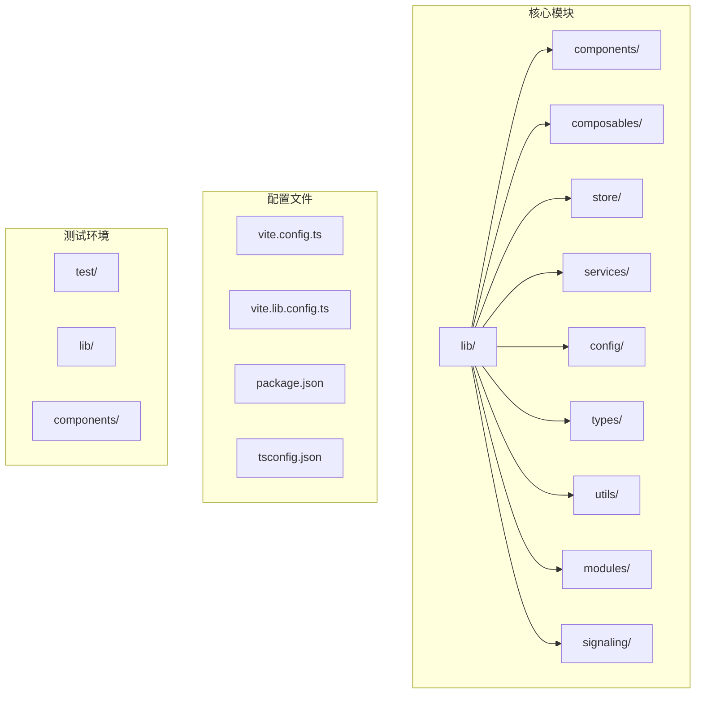
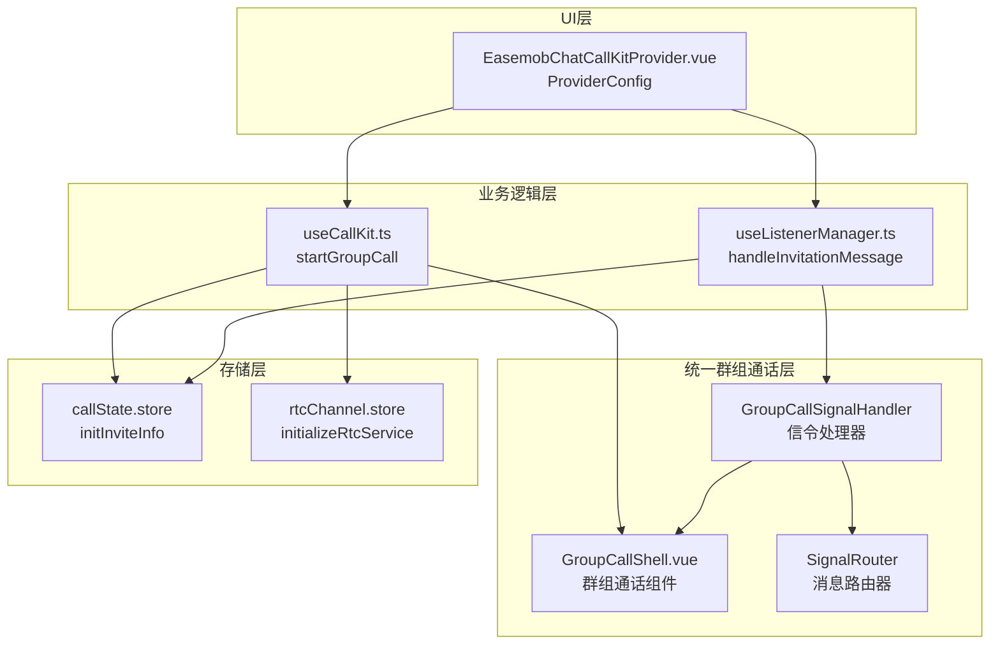
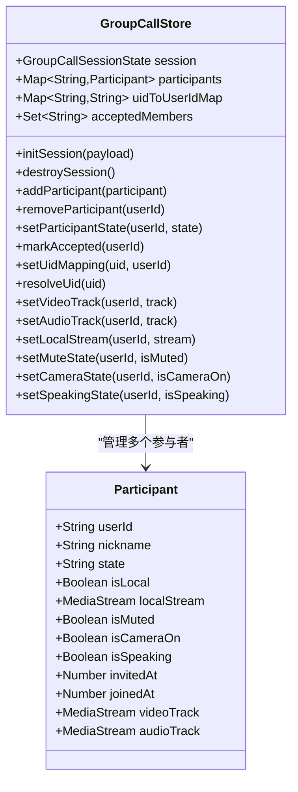
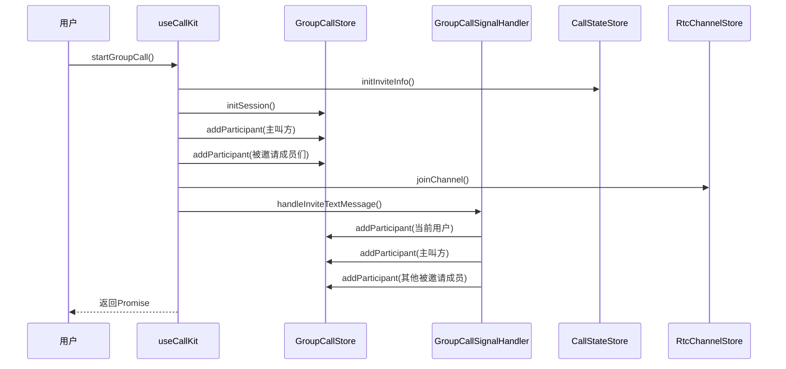
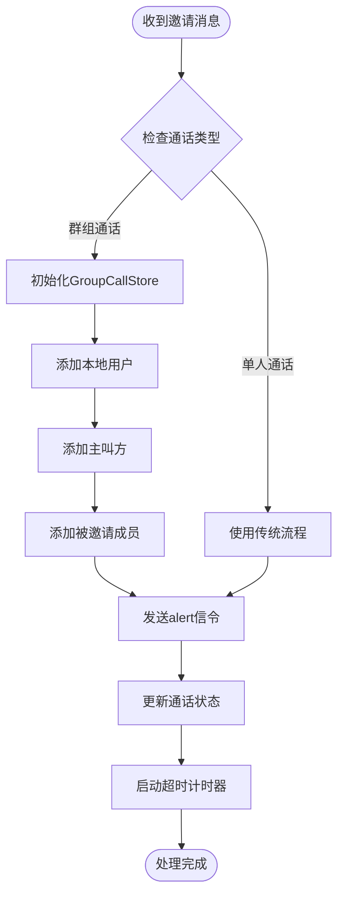
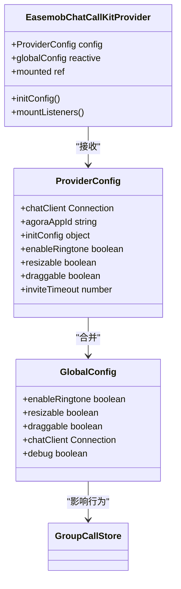
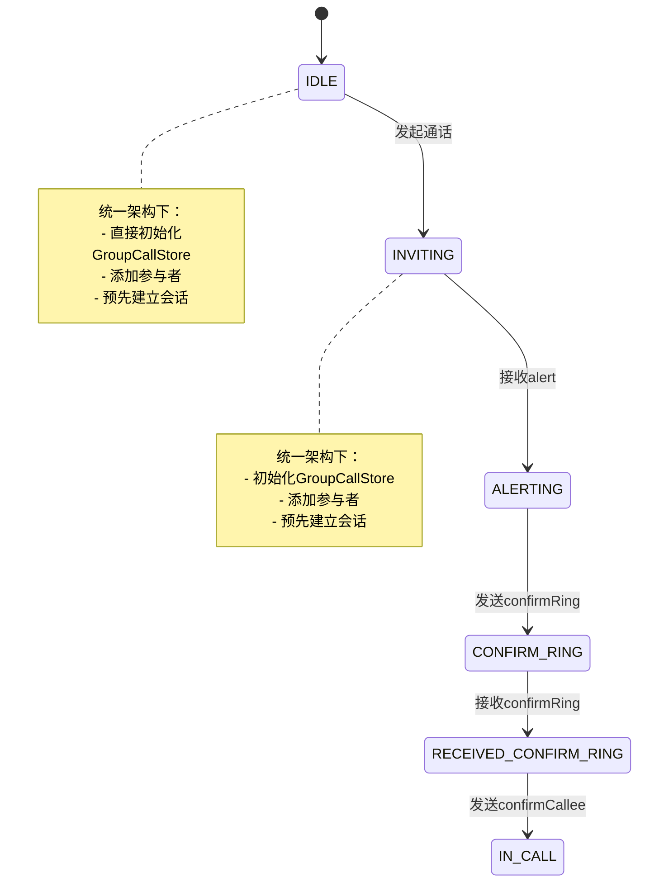
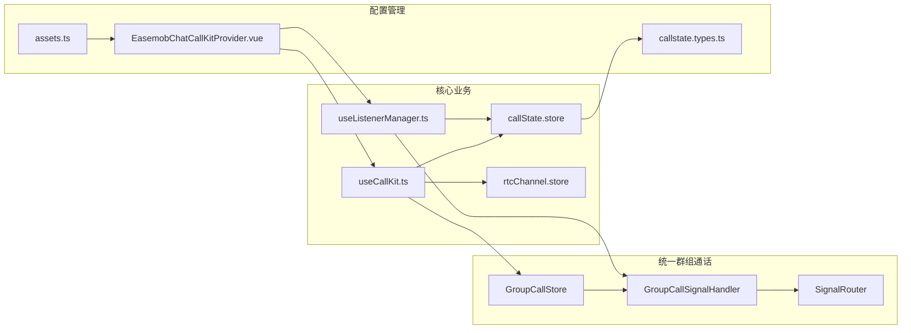

# 功能开关系统

<cite>
**本文档引用的文件**
- [README.md](file://README.md)
- [USAGE.md](file://USAGE.md)
- [lib/index.ts](file://lib/index.ts)
- [lib/components/EasemobChatCallKitProvider.vue](file://lib/components/EasemobChatCallKitProvider.vue)
- [lib/composables/useCallKit.ts](file://lib/composables/useCallKit.ts)
- [lib/composables/useListenerManager.ts](file://lib/composables/useListenerManager.ts)
- [lib/modules/groupCall/index.ts](file://lib/modules/groupCall/index.ts)
- [lib/modules/groupCall/viewModel/GroupCallStore.ts](file://lib/modules/groupCall/viewModel/GroupCallStore.ts)
- [lib/signaling/GroupCallSignalHandler.ts](file://lib/signaling/GroupCallSignalHandler.ts)
- [lib/signaling/SignalRouter.ts](file://lib/signaling/SignalRouter.ts)
- [lib/store/callState.ts](file://lib/store/callState.ts)
- [lib/store/rtcChannel.ts](file://lib/store/rtcChannel.ts)
- [lib/types/callstate.types.ts](file://lib/types/callstate.types.ts)
- [lib/utils/logger.ts](file://lib/utils/logger.ts)
- [lib/config/assets.ts](file://lib/config/assets.ts)
</cite>

## 更新摘要
**变更内容**
- 移除了已不存在的 `featureFlags.ts` 文件引用
- 更新了统一实现架构的描述，反映新的群组通话系统
- 新增了 GroupCallStore 和信号处理器的详细说明
- 更新了架构图以反映新的组件关系
- 移除了功能开关相关的过时内容

## 目录
1. [简介](#简介)
2. [项目结构](#项目结构)
3. [核心组件](#核心组件)
4. [架构概览](#架构概览)
5. [详细组件分析](#详细组件分析)
6. [依赖关系分析](#依赖关系分析)
7. [性能考虑](#性能考虑)
8. [故障排除指南](#故障排除指南)
9. [结论](#结论)

## 简介

功能开关系统是 EaseMob Chat CallKit Vue3 插件中的一个关键特性，用于控制新群组通话模块的功能启用和禁用。该系统允许开发者在不影响现有功能的情况下，逐步推出新功能或进行功能回滚。

**更新** 该系统现已演进为统一实现架构，不再依赖于 `featureFlags.ts` 文件中的功能开关常量。新的架构通过 `GroupCallStore` 和 `GroupCallSignalHandler` 提供了完整的群组通话功能支持。

## 项目结构

该项目采用模块化架构设计，主要包含以下核心目录：

**图表来源**
- [README.md:5-31](file://README.md#L5-L31)
- [lib/index.ts:1-70](file://lib/index.ts#L1-L70)

**章节来源**
- [README.md:5-31](file://README.md#L5-L31)
- [lib/index.ts:1-70](file://lib/index.ts#L1-L70)

## 核心组件

功能开关系统的核心组件包括：

### 1. 统一群组通话架构
- **文件**: `lib/modules/groupCall/viewModel/GroupCallStore.ts`
- **作用**: 管理群组通话的单一事实源
- **功能**: 参与者管理、状态跟踪、UID映射解析

### 2. 信号处理器
- **文件**: `lib/signaling/GroupCallSignalHandler.ts`
- **作用**: 处理群组通话相关的信令消息
- **功能**: 邀请处理、状态同步、成员管理

### 3. 信令路由器
- **文件**: `lib/signaling/SignalRouter.ts`
- **作用**: 分发信令消息到相应的处理器
- **功能**: 动态路由、处理器注册

### 4. 组合式API集成
- **文件**: `lib/composables/useCallKit.ts`
- **作用**: 在通话发起过程中初始化群组通话状态
- **集成点**: 群组通话发起时的参与者初始化

### 5. 监听器管理器集成
- **文件**: `lib/composables/useListenerManager.ts`
- **作用**: 在消息处理过程中应用群组通话逻辑
- **集成点**: 邀请消息处理和信令响应

### 6. Provider配置
- **文件**: `lib/components/EasemobChatCallKitProvider.vue`
- **作用**: 提供全局配置选项
- **相关配置**: `resizable`、`draggable`、`enableRingtone`

**章节来源**
- [lib/modules/groupCall/viewModel/GroupCallStore.ts:1-223](file://lib/modules/groupCall/viewModel/GroupCallStore.ts#L1-L223)
- [lib/signaling/GroupCallSignalHandler.ts:1-263](file://lib/signaling/GroupCallSignalHandler.ts#L1-L263)
- [lib/signaling/SignalRouter.ts:1-36](file://lib/signaling/SignalRouter.ts#L1-L36)
- [lib/composables/useCallKit.ts:1-157](file://lib/composables/useCallKit.ts#L1-L157)
- [lib/composables/useListenerManager.ts:1-245](file://lib/composables/useListenerManager.ts#L1-L245)
- [lib/components/EasemobChatCallKitProvider.vue:1-115](file://lib/components/EasemobChatCallKitProvider.vue#L1-L115)

## 架构概览

功能开关系统现已演进为统一的群组通话架构：

**图表来源**
- [lib/modules/groupCall/viewModel/GroupCallStore.ts:10-223](file://lib/modules/groupCall/viewModel/GroupCallStore.ts#L10-L223)
- [lib/signaling/GroupCallSignalHandler.ts:17-263](file://lib/signaling/GroupCallSignalHandler.ts#L17-L263)
- [lib/signaling/SignalRouter.ts:12-36](file://lib/signaling/SignalRouter.ts#L12-L36)
- [lib/composables/useCallKit.ts:52-151](file://lib/composables/useCallKit.ts#L52-L151)
- [lib/composables/useListenerManager.ts:38-245](file://lib/composables/useListenerManager.ts#L38-L245)
- [lib/store/callState.ts:41-141](file://lib/store/callState.ts#L41-L141)
- [lib/store/rtcChannel.ts:67-102](file://lib/store/rtcChannel.ts#L67-L102)

## 详细组件分析

### 统一群组通话架构实现分析

#### 1. GroupCallStore 设计模式

**图表来源**
- [lib/modules/groupCall/viewModel/GroupCallStore.ts:10-223](file://lib/modules/groupCall/viewModel/GroupCallStore.ts#L10-L223)

#### 2. 群组通话功能集成流程

**图表来源**
- [lib/composables/useCallKit.ts:52-151](file://lib/composables/useCallKit.ts#L52-L151)
- [lib/modules/groupCall/viewModel/GroupCallStore.ts:43-101](file://lib/modules/groupCall/viewModel/GroupCallStore.ts#L43-L101)
- [lib/signaling/GroupCallSignalHandler.ts:42-116](file://lib/signaling/GroupCallSignalHandler.ts#L42-L116)

#### 3. 邀请消息处理中的统一架构应用

**图表来源**
- [lib/composables/useListenerManager.ts:61-157](file://lib/composables/useListenerManager.ts#L61-L157)
- [lib/signaling/GroupCallSignalHandler.ts:42-116](file://lib/signaling/GroupCallSignalHandler.ts#L42-L116)

**章节来源**
- [lib/modules/groupCall/viewModel/GroupCallStore.ts:1-223](file://lib/modules/groupCall/viewModel/GroupCallStore.ts#L1-L223)
- [lib/signaling/GroupCallSignalHandler.ts:1-263](file://lib/signaling/GroupCallSignalHandler.ts#L1-L263)
- [lib/composables/useCallKit.ts:1-157](file://lib/composables/useCallKit.ts#L1-L157)
- [lib/composables/useListenerManager.ts:1-245](file://lib/composables/useListenerManager.ts#L1-L245)

### 组件交互分析

#### 1. Provider配置与统一架构的关系

**图表来源**
- [lib/components/EasemobChatCallKitProvider.vue:28-115](file://lib/components/EasemobChatCallKitProvider.vue#L28-L115)

#### 2. 存储层对统一架构的响应

**图表来源**
- [lib/store/callState.ts:41-141](file://lib/store/callState.ts#L41-L141)
- [lib/modules/groupCall/viewModel/GroupCallStore.ts:43-101](file://lib/modules/groupCall/viewModel/GroupCallStore.ts#L43-L101)

**章节来源**
- [lib/components/EasemobChatCallKitProvider.vue:28-115](file://lib/components/EasemobChatCallKitProvider.vue#L28-L115)
- [lib/store/callState.ts:41-141](file://lib/store/callState.ts#L41-L141)
- [lib/modules/groupCall/viewModel/GroupCallStore.ts:43-101](file://lib/modules/groupCall/viewModel/GroupCallStore.ts#L43-L101)

## 依赖关系分析

统一架构下的依赖关系如下：

**图表来源**
- [lib/modules/groupCall/viewModel/GroupCallStore.ts:1-223](file://lib/modules/groupCall/viewModel/GroupCallStore.ts#L1-L223)
- [lib/signaling/GroupCallSignalHandler.ts:1-263](file://lib/signaling/GroupCallSignalHandler.ts#L1-L263)
- [lib/signaling/SignalRouter.ts:1-36](file://lib/signaling/SignalRouter.ts#L1-L36)
- [lib/composables/useCallKit.ts:1-157](file://lib/composables/useCallKit.ts#L1-L157)
- [lib/composables/useListenerManager.ts:1-245](file://lib/composables/useListenerManager.ts#L1-L245)

**章节来源**
- [lib/modules/groupCall/viewModel/GroupCallStore.ts:1-223](file://lib/modules/groupCall/viewModel/GroupCallStore.ts#L1-L223)
- [lib/signaling/GroupCallSignalHandler.ts:1-263](file://lib/signaling/GroupCallSignalHandler.ts#L1-L263)
- [lib/signaling/SignalRouter.ts:1-36](file://lib/signaling/SignalRouter.ts#L1-L36)
- [lib/composables/useCallKit.ts:1-157](file://lib/composables/useCallKit.ts#L1-L157)
- [lib/composables/useListenerManager.ts:1-245](file://lib/composables/useListenerManager.ts#L1-L245)

## 性能考虑

统一架构在性能方面的考虑包括：

### 1. 内存优化
- 使用 `GroupCallStore` 作为单一事实源，减少状态分散
- 通过 `Map` 和 `Set` 数据结构提高查找效率
- 避免重复初始化，支持幂等操作

### 2. 响应式更新优化
- 使用 `Vue3 ref(Map)` 的浅响应特性，避免深层响应式开销
- 通过重新赋值触发更新，确保状态一致性
- 计算属性优化，减少不必要的重新计算

### 3. 资源管理
- 使用 `watchEffect` 进行响应式配置更新
- 合理的资源清理和销毁机制
- 通过 `SignalRouter` 实现动态处理器注册

**章节来源**
- [lib/modules/groupCall/viewModel/GroupCallStore.ts:18-49](file://lib/modules/groupCall/viewModel/GroupCallStore.ts#L18-L49)
- [lib/utils/logger.ts:91-94](file://lib/utils/logger.ts#L91-L94)
- [lib/components/EasemobChatCallKitProvider.vue:79-115](file://lib/components/EasemobChatCallKitProvider.vue#L79-L115)

## 故障排除指南

### 常见问题及解决方案

#### 1. 群组通话初始化失败
**症状**: 群组通话中参与者状态异常
**解决方案**:
- 检查 `GroupCallStore.initSession()` 的调用时机
- 验证参与者添加顺序和去重逻辑
- 确认状态同步机制的正确性

#### 2. 信令处理异常
**症状**: 群组通话中成员加入/离开状态不一致
**解决方案**:
- 检查 `GroupCallSignalHandler` 的信令处理逻辑
- 验证 `SignalRouter` 的处理器注册
- 确认 UID 映射解析的准确性

#### 3. 性能问题
**症状**: 启用群组通话后性能下降
**解决方案**:
- 检查 `GroupCallStore` 的响应式更新策略
- 优化计算属性的使用
- 减少不必要的状态更新

**章节来源**
- [lib/modules/groupCall/viewModel/GroupCallStore.ts:43-101](file://lib/modules/groupCall/viewModel/GroupCallStore.ts#L43-L101)
- [lib/signaling/GroupCallSignalHandler.ts:121-154](file://lib/signaling/GroupCallSignalHandler.ts#L121-L154)
- [lib/signaling/SignalRouter.ts:22-35](file://lib/signaling/SignalRouter.ts#L22-L35)

## 结论

功能开关系统已成功演进为统一的群组通话架构。通过 `GroupCallStore` 和 `GroupCallSignalHandler`，开发者可以获得：

1. **统一的群组通话体验**: 通过单一事实源管理所有群组通话状态
2. **更好的性能表现**: 减少状态分散，优化内存使用
3. **更清晰的代码结构**: 明确的职责分离和模块化设计
4. **更强的扩展能力**: 基于 `SignalRouter` 的动态处理器架构

该统一架构的设计充分考虑了代码的可维护性和扩展性，为未来的功能演进奠定了良好的基础。通过合理的架构设计和完善的错误处理机制，确保了群组通话系统在生产环境中的稳定运行。