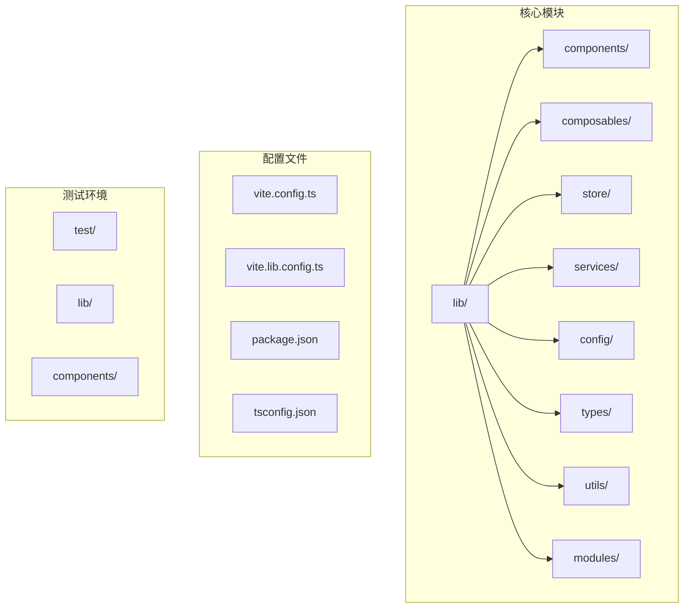
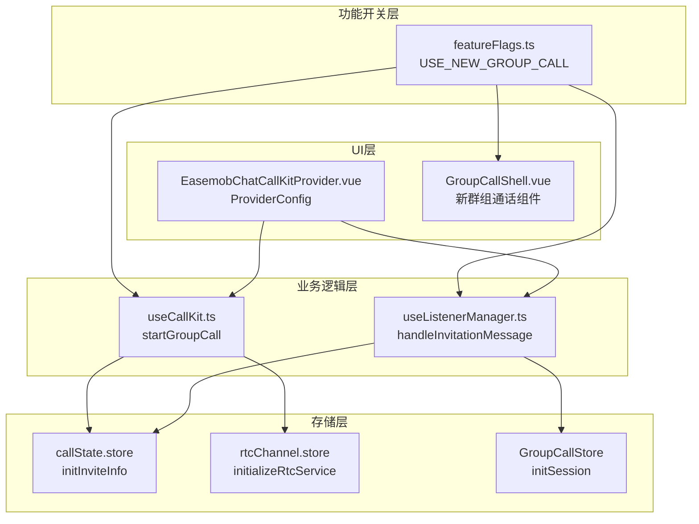
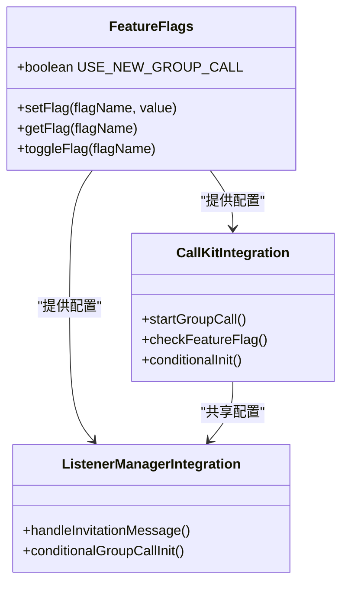
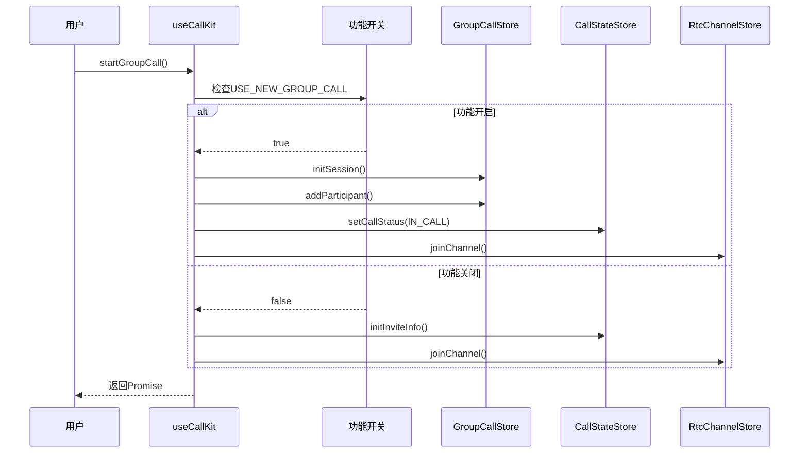
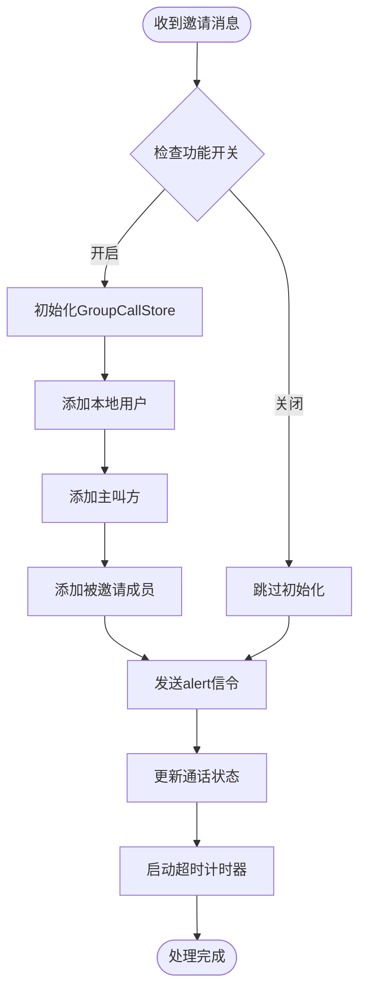
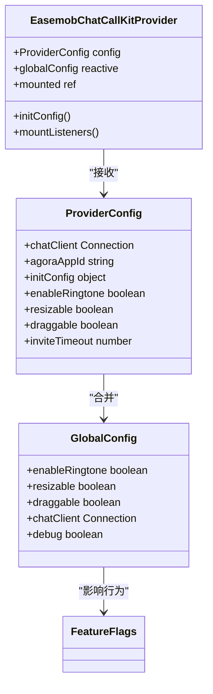
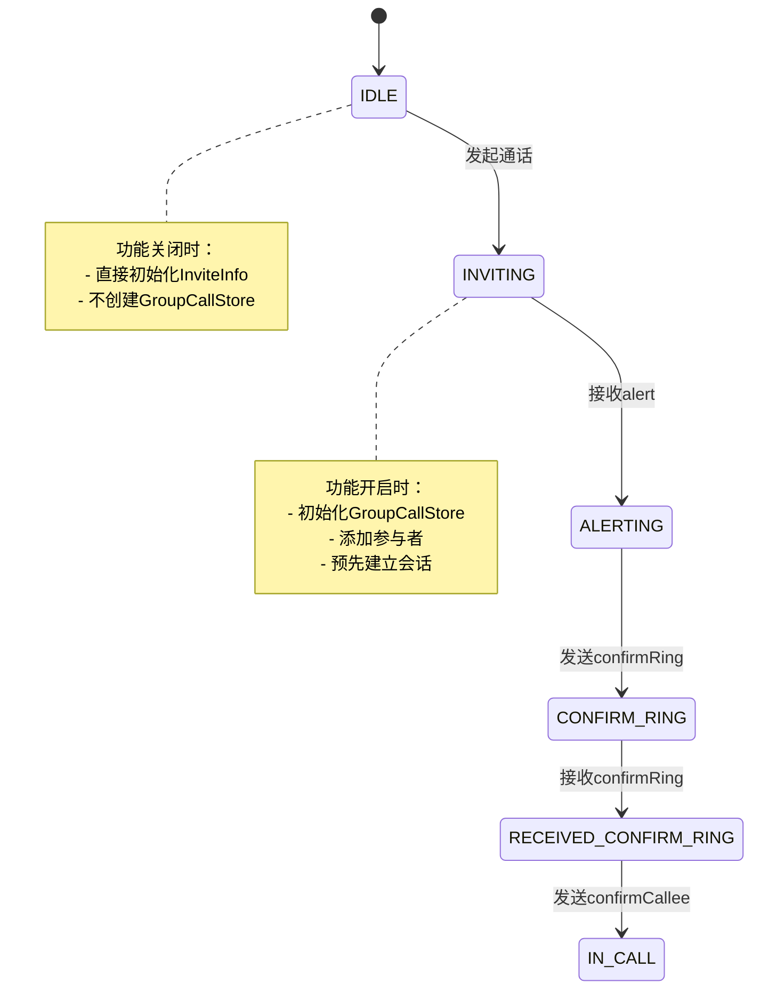
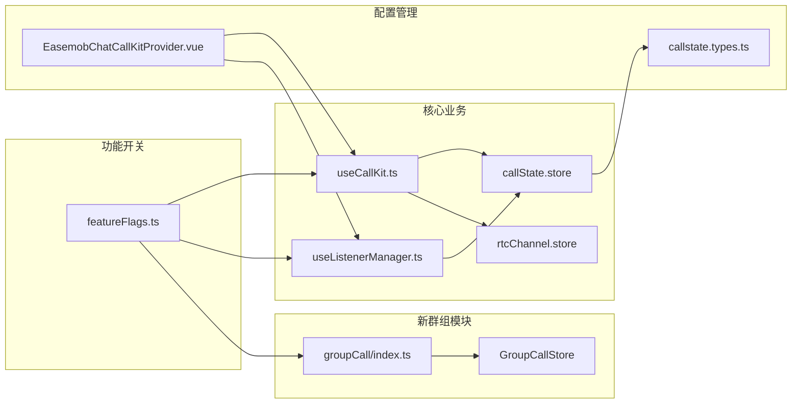

# 功能开关系统

<cite>
**本文档引用的文件**
- [README.md](file://README.md)
- [USAGE.md](file://USAGE.md)
- [lib/index.ts](file://lib/index.ts)
- [lib/components/EasemobChatCallKitProvider.vue](file://lib/components/EasemobChatCallKitProvider.vue)
- [lib/composables/useCallKit.ts](file://lib/composables/useCallKit.ts)
- [lib/composables/useListenerManager.ts](file://lib/composables/useListenerManager.ts)
- [lib/config/featureFlags.ts](file://lib/config/featureFlags.ts)
- [lib/modules/groupCall/index.ts](file://lib/modules/groupCall/index.ts)
- [lib/store/callState.ts](file://lib/store/callState.ts)
- [lib/store/rtcChannel.ts](file://lib/store/rtcChannel.ts)
- [lib/types/callstate.types.ts](file://lib/types/callstate.types.ts)
- [lib/utils/logger.ts](file://lib/utils/logger.ts)
</cite>

## 目录
1. [简介](#简介)
2. [项目结构](#项目结构)
3. [核心组件](#核心组件)
4. [架构概览](#架构概览)
5. [详细组件分析](#详细组件分析)
6. [依赖关系分析](#依赖关系分析)
7. [性能考虑](#性能考虑)
8. [故障排除指南](#故障排除指南)
9. [结论](#结论)

## 简介

功能开关系统是 EaseMob Chat CallKit Vue3 插件中的一个关键特性，用于控制新群组通话模块的功能启用和禁用。该系统允许开发者在不影响现有功能的情况下，逐步推出新功能或进行功能回滚。

该系统主要通过 `USE_NEW_GROUP_CALL` 常量实现，该常量位于 `lib/config/featureFlags.ts` 文件中，控制着新群组通话功能的启用状态。

## 项目结构

该项目采用模块化架构设计，主要包含以下核心目录：

**图表来源**
- [README.md:5-31](file://README.md#L5-L31)
- [lib/index.ts:1-67](file://lib/index.ts#L1-L67)

**章节来源**
- [README.md:5-31](file://README.md#L5-L31)
- [lib/index.ts:1-67](file://lib/index.ts#L1-L67)

## 核心组件

功能开关系统的核心组件包括：

### 1. 功能标志配置
- **文件**: `lib/config/featureFlags.ts`
- **作用**: 定义所有功能开关常量
- **当前状态**: `USE_NEW_GROUP_CALL = true`

### 2. 组合式API集成
- **文件**: `lib/composables/useCallKit.ts`
- **作用**: 在通话发起过程中检查功能开关状态
- **集成点**: 群组通话发起时的条件判断

### 3. 监听器管理器集成
- **文件**: `lib/composables/useListenerManager.ts`
- **作用**: 在消息处理过程中应用功能开关
- **集成点**: 邀请处理和信令响应

### 4. Provider配置
- **文件**: `lib/components/EasemobChatCallKitProvider.vue`
- **作用**: 提供全局配置选项
- **相关配置**: `resizable`、`draggable`、`enableRingtone`

**章节来源**
- [lib/config/featureFlags.ts:1-50](file://lib/config/featureFlags.ts#L1-L50)
- [lib/composables/useCallKit.ts:8-108](file://lib/composables/useCallKit.ts#L8-L108)
- [lib/composables/useListenerManager.ts:17-196](file://lib/composables/useListenerManager.ts#L17-L196)
- [lib/components/EasemobChatCallKitProvider.vue:20-57](file://lib/components/EasemobChatCallKitProvider.vue#L20-L57)

## 架构概览

功能开关系统的整体架构如下：

**图表来源**
- [lib/config/featureFlags.ts:1-50](file://lib/config/featureFlags.ts#L1-L50)
- [lib/composables/useCallKit.ts:53-158](file://lib/composables/useCallKit.ts#L53-L158)
- [lib/composables/useListenerManager.ts:132-197](file://lib/composables/useListenerManager.ts#L132-L197)
- [lib/store/callState.ts:44-71](file://lib/store/callState.ts#L44-L71)
- [lib/store/rtcChannel.ts:84-109](file://lib/store/rtcChannel.ts#L84-L109)

## 详细组件分析

### 功能开关实现分析

#### 1. 功能标志定义

**图表来源**
- [lib/config/featureFlags.ts:1-50](file://lib/config/featureFlags.ts#L1-L50)
- [lib/composables/useCallKit.ts:108-144](file://lib/composables/useCallKit.ts#L108-L144)
- [lib/composables/useListenerManager.ts:132-197](file://lib/composables/useListenerManager.ts#L132-L197)

#### 2. 群组通话功能集成流程

**图表来源**
- [lib/composables/useCallKit.ts:53-158](file://lib/composables/useCallKit.ts#L53-L158)
- [lib/config/featureFlags.ts:1-50](file://lib/config/featureFlags.ts#L1-L50)

#### 3. 邀请消息处理中的功能开关应用

**图表来源**
- [lib/composables/useListenerManager.ts:58-209](file://lib/composables/useListenerManager.ts#L58-L209)
- [lib/config/featureFlags.ts:1-50](file://lib/config/featureFlags.ts#L1-L50)

**章节来源**
- [lib/config/featureFlags.ts:1-50](file://lib/config/featureFlags.ts#L1-L50)
- [lib/composables/useCallKit.ts:108-144](file://lib/composables/useCallKit.ts#L108-L144)
- [lib/composables/useListenerManager.ts:132-197](file://lib/composables/useListenerManager.ts#L132-L197)

### 组件交互分析

#### 1. Provider配置与功能开关的关系

**图表来源**
- [lib/components/EasemobChatCallKitProvider.vue:28-77](file://lib/components/EasemobChatCallKitProvider.vue#L28-L77)
- [lib/components/EasemobChatCallKitProvider.vue:51-57](file://lib/components/EasemobChatCallKitProvider.vue#L51-L57)

#### 2. 存储层对功能开关的响应

**图表来源**
- [lib/store/callState.ts:44-71](file://lib/store/callState.ts#L44-L71)
- [lib/store/callState.ts:156-188](file://lib/store/callState.ts#L156-L188)

**章节来源**
- [lib/components/EasemobChatCallKitProvider.vue:28-77](file://lib/components/EasemobChatCallKitProvider.vue#L28-L77)
- [lib/store/callState.ts:44-71](file://lib/store/callState.ts#L44-L71)
- [lib/store/callState.ts:156-188](file://lib/store/callState.ts#L156-L188)

## 依赖关系分析

功能开关系统与其他组件的依赖关系如下：

**图表来源**
- [lib/config/featureFlags.ts:1-50](file://lib/config/featureFlags.ts#L1-L50)
- [lib/composables/useCallKit.ts:1-164](file://lib/composables/useCallKit.ts#L1-L164)
- [lib/composables/useListenerManager.ts:1-832](file://lib/composables/useListenerManager.ts#L1-L832)
- [lib/modules/groupCall/index.ts:1-18](file://lib/modules/groupCall/index.ts#L1-L18)

**章节来源**
- [lib/config/featureFlags.ts:1-50](file://lib/config/featureFlags.ts#L1-L50)
- [lib/composables/useCallKit.ts:1-164](file://lib/composables/useCallKit.ts#L1-L164)
- [lib/composables/useListenerManager.ts:1-832](file://lib/composables/useListenerManager.ts#L1-L832)
- [lib/modules/groupCall/index.ts:1-18](file://lib/modules/groupCall/index.ts#L1-L18)

## 性能考虑

功能开关系统在性能方面的考虑包括：

### 1. 条件加载优化
- 功能开启时才初始化 GroupCallStore，减少内存占用
- 功能关闭时直接使用传统流程，避免不必要的计算

### 2. 资源管理
- 使用 `watchEffect` 进行响应式配置更新
- 合理的资源清理和销毁机制

### 3. 日志级别控制
- 通过 `logger.setDebug()` 控制日志输出级别
- 生产环境默认关闭详细日志

**章节来源**
- [lib/utils/logger.ts:91-94](file://lib/utils/logger.ts#L91-L94)
- [lib/components/EasemobChatCallKitProvider.vue:66-76](file://lib/components/EasemobChatCallKitProvider.vue#L66-L76)

## 故障排除指南

### 常见问题及解决方案

#### 1. 功能开关不生效
**症状**: 修改 `USE_NEW_GROUP_CALL` 后新群组通话功能仍不启用
**解决方案**:
- 确认文件已正确保存
- 重启开发服务器
- 检查是否有缓存问题

#### 2. 群组通话异常
**症状**: 群组通话中参与者状态异常
**解决方案**:
- 检查 GroupCallStore 的初始化逻辑
- 验证参与者添加顺序
- 确认状态同步机制

#### 3. 性能问题
**症状**: 启用新功能后性能下降
**解决方案**:
- 检查功能开关的条件判断逻辑
- 优化存储层的状态更新
- 减少不必要的响应式更新

**章节来源**
- [lib/composables/useCallKit.ts:108-144](file://lib/composables/useCallKit.ts#L108-L144)
- [lib/composables/useListenerManager.ts:132-197](file://lib/composables/useListenerManager.ts#L132-L197)

## 结论

功能开关系统为 EaseMob Chat CallKit Vue3 插件提供了灵活的功能管理机制。通过 `USE_NEW_GROUP_CALL` 标志，开发者可以：

1. **渐进式发布**: 逐步推出新功能，降低风险
2. **快速回滚**: 发现问题时快速禁用功能
3. **A/B测试**: 对不同用户群体启用不同功能
4. **性能优化**: 在特定场景下禁用重型功能

该系统的设计充分考虑了代码的可维护性和扩展性，为未来的功能演进奠定了良好的基础。通过合理的架构设计和完善的错误处理机制，确保了功能开关系统在生产环境中的稳定运行。