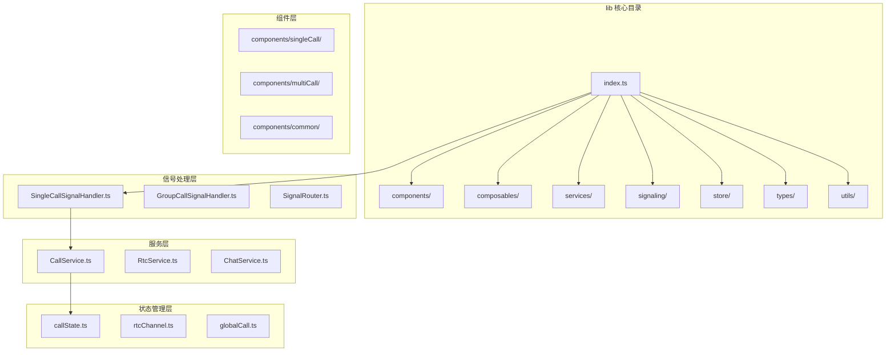
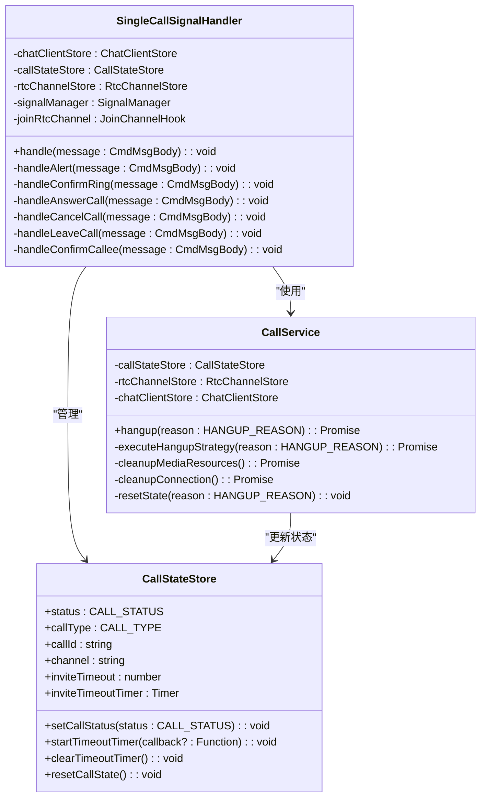
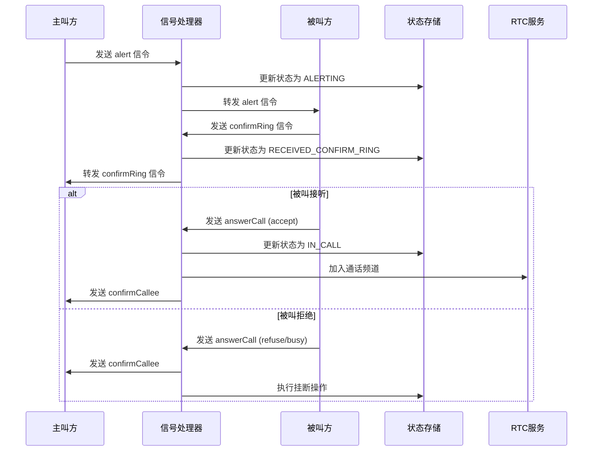
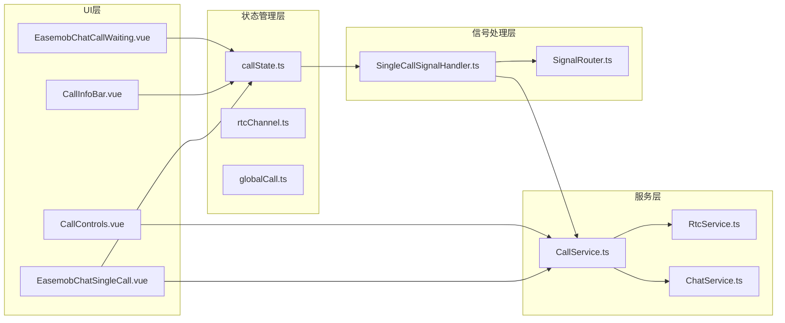
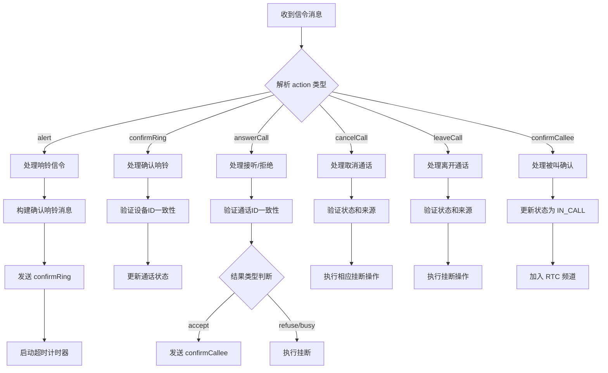
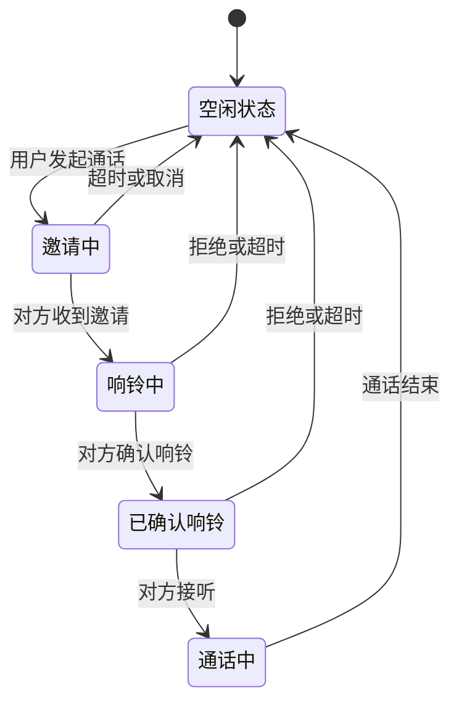
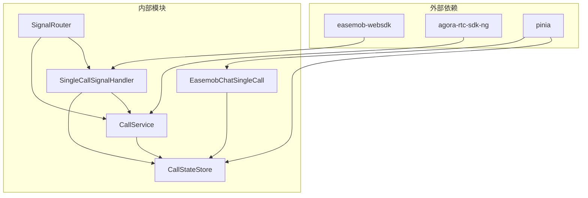
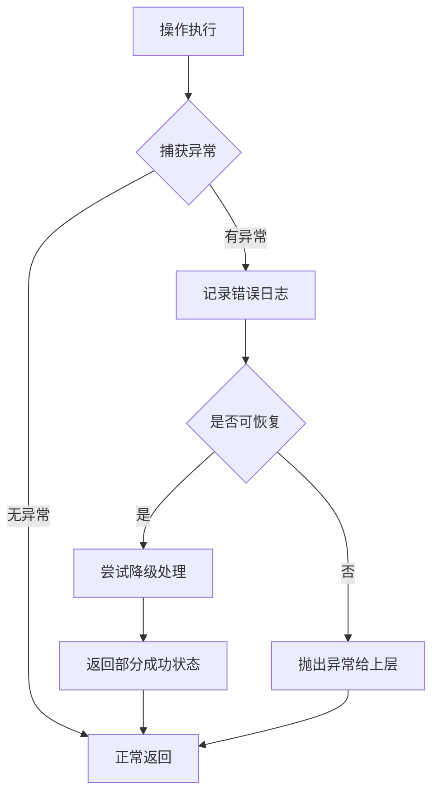

# 单人通话信号处理器

<cite>
**本文档引用的文件**
- [README.md](file://README.md)
- [USAGE.md](file://USAGE.md)
- [index.ts](file://lib/index.ts)
- [types.ts](file://lib/types.ts)
- [SingleCallSignalHandler.ts](file://lib/signaling/SingleCallSignalHandler.ts)
- [CallService.ts](file://lib/services/CallService.ts)
- [EasemobChatSingleCall.vue](file://lib/components/singleCall/EasemobChatSingleCall.vue)
- [callState.ts](file://lib/store/callState.ts)
</cite>

## 目录
1. [简介](#简介)
2. [项目结构](#项目结构)
3. [核心组件](#核心组件)
4. [架构概览](#架构概览)
5. [详细组件分析](#详细组件分析)
6. [依赖关系分析](#依赖关系分析)
7. [性能考虑](#性能考虑)
8. [故障排除指南](#故障排除指南)
9. [结论](#结论)

## 简介

单人通话信号处理器是基于 Vue 3 的环信聊天和音视频通话插件的核心组件。该项目集成了环信 IM 信令与声网 RTC 能力，提供了完整的音视频通话解决方案。本文档专注于单人通话信号处理机制，包括信令路由、状态管理和错误处理等关键功能。

该系统采用模块化设计，通过信号处理器、服务层和存储层的协作，实现了可靠的单人通话信令处理。系统支持多种通话状态转换，包括邀请、响铃、接听、挂断等完整流程。

## 项目结构

项目采用清晰的分层架构，主要包含以下核心目录：



**图表来源**
- [index.ts:1-70](file://lib/index.ts#L1-L70)
- [README.md:5-31](file://README.md#L5-L31)

**章节来源**
- [README.md:5-31](file://README.md#L5-L31)
- [index.ts:1-70](file://lib/index.ts#L1-L70)

## 核心组件

### 信号处理器架构

单人通话信号处理器采用职责分离的设计模式，主要包含以下核心组件：



**图表来源**
- [SingleCallSignalHandler.ts:17-433](file://lib/signaling/SingleCallSignalHandler.ts#L17-L433)
- [CallService.ts:10-360](file://lib/services/CallService.ts#L10-L360)
- [callState.ts:7-187](file://lib/store/callState.ts#L7-L187)

### 通话状态管理

系统通过 Pinia Store 实现状态管理，支持完整的通话生命周期：

| 状态 | 描述 | 用途 |
|------|------|------|
| IDLE | 空闲状态 | 初始状态，无正在进行的通话 |
| INVITING | 邀请中 | 主叫方已发送通话邀请 |
| ALERTING | 响铃中 | 被叫方已收到邀请并响铃 |
| RECEIVED_CONFIRM_RING | 确认响铃 | 被叫方确认已响铃 |
| IN_CALL | 通话中 | 通话已建立，媒体流传输中 |
| LEFT | 已离开 | 通话结束，用户已离开 |

**章节来源**
- [callState.ts:11-187](file://lib/store/callState.ts#L11-L187)
- [SingleCallSignalHandler.ts:24-46](file://lib/signaling/SingleCallSignalHandler.ts#L24-L46)

## 架构概览

### 信号处理流程

单人通话信号处理采用事件驱动的异步处理模式：



**图表来源**
- [SingleCallSignalHandler.ts:24-433](file://lib/signaling/SingleCallSignalHandler.ts#L24-L433)
- [CallService.ts:26-360](file://lib/services/CallService.ts#L26-L360)

### 组件交互关系



**图表来源**
- [EasemobChatSingleCall.vue:1-180](file://lib/components/singleCall/EasemobChatSingleCall.vue#L1-L180)
- [index.ts:1-70](file://lib/index.ts#L1-L70)

**章节来源**
- [EasemobChatSingleCall.vue:1-180](file://lib/components/singleCall/EasemobChatSingleCall.vue#L1-L180)
- [index.ts:1-70](file://lib/index.ts#L1-L70)

## 详细组件分析

### SingleCallSignalHandler 信号处理器

SingleCallSignalHandler 是单人通话的核心信号处理器，负责处理所有与通话状态相关的信令：

#### 核心处理流程



**图表来源**
- [SingleCallSignalHandler.ts:24-433](file://lib/signaling/SingleCallHandler.ts#L24-L433)

#### 设备ID验证机制

系统实现了严格的多端设备识别机制：

| 验证场景 | 验证条件 | 处理方式 |
|----------|----------|----------|
| 主叫设备ID | `ext.callerDevId !== getClientDeviceId` | 忽略消息，记录警告 |
| 被叫设备ID | `ext.calleeDevId !== calleeDevId` | 忽略消息，记录警告 |
| 通话ID一致性 | `ext.callId !== currentCallInfo.callId` | 忽略消息，记录警告 |
| 状态验证 | 当前状态不符合预期 | 忽略消息，记录警告 |

**章节来源**
- [SingleCallSignalHandler.ts:83-126](file://lib/signaling/SingleCallSignalHandler.ts#L83-L126)
- [SingleCallSignalHandler.ts:131-167](file://lib/signaling/SingleCallSignalHandler.ts#L131-L167)
- [SingleCallSignalHandler.ts:172-270](file://lib/signaling/SingleCallSignalHandler.ts#L172-L270)

### CallService 通话服务

CallService 提供了完整的通话生命周期管理：

#### 挂断策略执行

```mermaid
flowchart TD
A[调用 hangup(reason)] --> B{检查状态初始化}
B --> |失败| C[返回错误]
B --> |成功| D{检查当前状态}
D --> |IDLE| E[返回，不执行操作]
D --> |非IDLE| F{执行挂断策略}
F --> G{reason === CANCEL}
G --> |是| H[handleCancelStrategy]
G --> |否| I{是否远程原因}
I --> |是| J[直接返回]
I --> |否| K[handleNormalHangupStrategy]
H --> L[发送 cancelCall 信令]
K --> M[发送 leaveCall 信令]
L --> N[清理媒体资源]
M --> N
N --> O[清理连接]
O --> P[重置状态]
```

**图表来源**
- [CallService.ts:26-360](file://lib/services/CallService.ts#L26-L360)

#### 媒体资源清理

系统实现了完整的媒体资源清理机制：

| 清理阶段 | 操作内容 | 异常处理 |
|----------|----------|----------|
| 媒体轨道清理 | 取消发布所有本地轨道 | 记录错误但不中断流程 |
| RTC连接清理 | 关闭本地轨道，离开频道 | 记录错误但不中断流程 |
| 状态重置 | 重置所有通话状态字段 | 记录错误但不中断流程 |

**章节来源**
- [CallService.ts:252-315](file://lib/services/CallService.ts#L252-L315)
- [CallService.ts:317-338](file://lib/services/CallService.ts#L317-L338)

### EasemobChatSingleCall 组件

EasemobChatSingleCall 是单人通话的主要 UI 组件：

#### 状态管理机制

组件通过计算属性与 Pinia Store 进行双向绑定：



**图表来源**
- [EasemobChatSingleCall.vue:78-84](file://lib/components/singleCall/EasemobChatSingleCall.vue#L78-L84)
- [callState.ts:153-187](file://lib/store/callState.ts#L153-L187)

#### 背景图片配置

系统支持灵活的背景图片配置：

| 配置方式 | 优先级 | 说明 |
|----------|--------|------|
| props.backgroundImage | 最高 | 直接指定图片URL |
| DEFAULT_BACKGROUND_IMAGE | 中等 | 使用默认CDN图片 |
| 本地静态资源 | 最低 | 使用 `/callkit-static-assets/` 路径 |

**章节来源**
- [EasemobChatSingleCall.vue:148-153](file://lib/components/singleCall/EasemobChatSingleCall.vue#L148-L153)
- [index.ts:56-57](file://lib/index.ts#L56-L57)

## 依赖关系分析

### 模块间依赖关系



**图表来源**
- [USAGE.md:8-12](file://USAGE.md#L8-L12)
- [index.ts:1-70](file://lib/index.ts#L1-L70)

### 错误处理机制

系统实现了多层次的错误处理：



**章节来源**
- [SingleCallSignalHandler.ts:66-77](file://lib/signaling/SingleCallSignalHandler.ts#L66-L77)
- [CallService.ts:60-72](file://lib/services/CallService.ts#L60-L72)

## 性能考虑

### 内存管理

系统采用了及时的内存清理机制：

- **定时器清理**：每次状态变更时自动清理超时定时器
- **事件监听器**：组件卸载时自动移除事件监听
- **媒体资源**：通话结束后自动释放媒体轨道

### 异步处理优化

- **Promise 链式调用**：确保异步操作的顺序执行
- **错误边界**：每个异步操作都有独立的错误处理
- **超时机制**：防止长时间阻塞操作

## 故障排除指南

### 常见问题诊断

| 问题现象 | 可能原因 | 解决方案 |
|----------|----------|----------|
| 无法发起通话 | 网络连接异常 | 检查网络状态和防火墙设置 |
| 通话无法建立 | 设备ID不匹配 | 确认多端登录状态 |
| 响铃无响应 | 信令转发失败 | 检查环信服务器状态 |
| 媒体流无法传输 | RTC权限问题 | 检查浏览器权限设置 |

### 日志分析

系统提供了详细的日志记录机制：

- **调试日志**：开发模式下的详细操作记录
- **警告日志**：潜在问题的预警信息
- **错误日志**：异常情况的详细描述

**章节来源**
- [SingleCallSignalHandler.ts:51-78](file://lib/signaling/SingleCallSignalHandler.ts#L51-L78)
- [CallService.ts:36-48](file://lib/services/CallService.ts#L36-L48)

## 结论

单人通话信号处理器是一个设计精良的音视频通话解决方案，具有以下特点：

1. **模块化设计**：清晰的职责分离，便于维护和扩展
2. **状态管理完善**：通过 Pinia 实现可靠的全局状态管理
3. **错误处理健全**：多层次的错误处理机制确保系统稳定性
4. **性能优化**：合理的异步处理和资源管理机制
5. **扩展性强**：良好的架构设计支持未来功能扩展

该系统为开发者提供了完整的单人音视频通话能力，包括信令处理、状态管理、UI 组件和媒体服务等核心功能。通过标准化的 API 和完善的错误处理机制，开发者可以快速集成高质量的通话功能到自己的应用中。