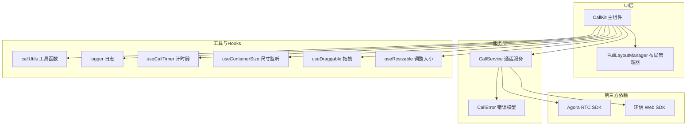
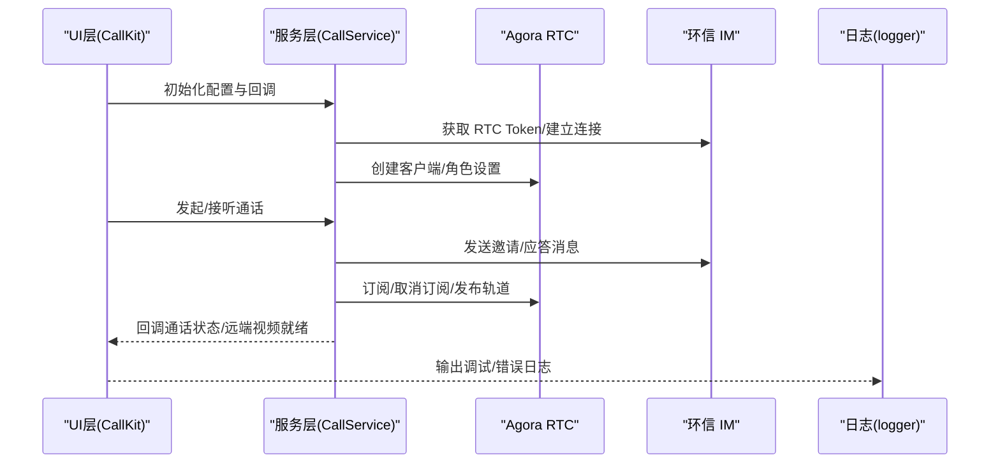
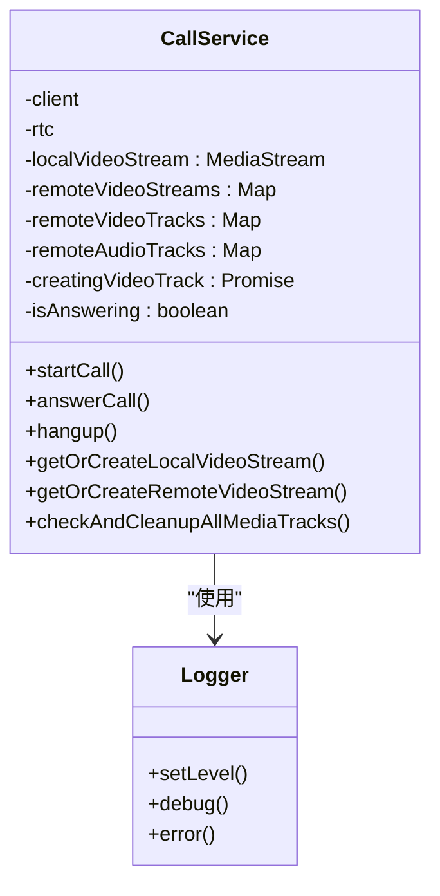
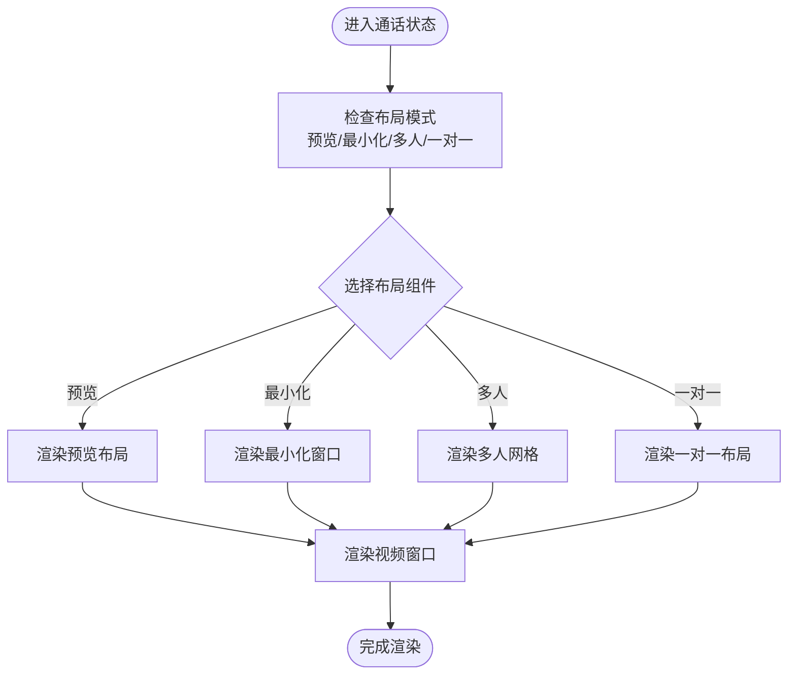
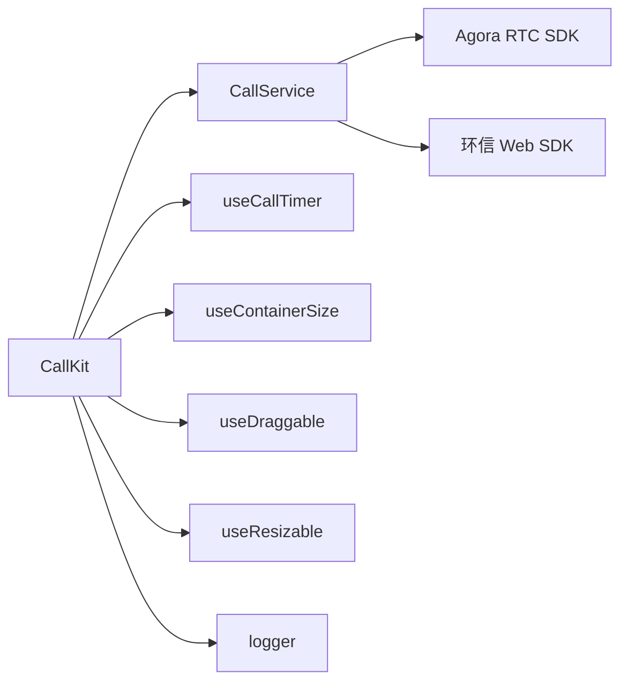

# 性能优化策略

<cite>
**本文档引用的文件**
- [README.md](file://README.md)
- [package.json](file://package.json)
- [CallService.ts](file://callkit/services/CallService.ts)
- [CallKit.tsx](file://callkit/CallKit.tsx)
- [callUtils.ts](file://callkit/utils/callUtils.ts)
- [useCallTimer.ts](file://callkit/hooks/useCallTimer.ts)
- [useContainerSize.ts](file://callkit/hooks/useContainerSize.ts)
- [useDraggable.ts](file://callkit/hooks/useDraggable.ts)
- [useResizable.ts](file://callkit/hooks/useResizable.ts)
- [logger.ts](file://callkit/utils/logger.ts)
- [FullLayoutManager.tsx](file://callkit/layouts/FullLayoutManager.tsx)
- [index.ts](file://callkit/types/index.ts)
- [CallError.ts](file://callkit/services/CallError.ts)
</cite>

## 目录
1. [引言](#引言)
2. [项目结构](#项目结构)
3. [核心组件](#核心组件)
4. [架构概览](#架构概览)
5. [详细组件分析](#详细组件分析)
6. [依赖关系分析](#依赖关系分析)
7. [性能考虑](#性能考虑)
8. [故障排查指南](#故障排查指南)
9. [结论](#结论)
10. [附录](#附录)

## 引言
本文件聚焦于音视频通话过程中的性能优化策略，结合代码库的实际实现，系统阐述内存管理、CPU 使用优化、网络带宽控制与电池消耗优化，并覆盖状态缓存策略、组件渲染优化与异步操作优化。同时提供性能监控指标与基准测试方法，以及常见性能问题的诊断与解决方案。

## 项目结构
该工程采用模块化组织，核心围绕 CallKit 主组件与 CallService 服务层协作，配合 Hooks 与工具函数实现高性能的音视频通话体验。关键模块如下：
- 服务层：CallService 负责与 Agora RTC 与环信 IM 的交互，管理通话生命周期与媒体轨道
- UI 层：CallKit 主组件协调布局、控制面板与状态展示
- Hooks：useCallTimer、useContainerSize、useDraggable、useResizable 等提升交互与渲染效率
- 工具与日志：callUtils 提供通用工具，logger 提供可控的日志级别与输出

图表来源
- [CallKit.tsx](file://callkit/CallKit.tsx#L1-L120)
- [CallService.ts](file://callkit/services/CallService.ts#L1-L120)
- [FullLayoutManager.tsx](file://callkit/layouts/FullLayoutManager.tsx#L1-L120)
- [useCallTimer.ts](file://callkit/hooks/useCallTimer.ts#L1-L50)
- [useContainerSize.ts](file://callkit/hooks/useContainerSize.ts#L1-L35)
- [useDraggable.ts](file://callkit/hooks/useDraggable.ts#L1-L120)
- [useResizable.ts](file://callkit/hooks/useResizable.ts#L1-L120)
- [callUtils.ts](file://callkit/utils/callUtils.ts#L1-L85)
- [logger.ts](file://callkit/utils/logger.ts#L1-L120)
- [CallError.ts](file://callkit/services/CallError.ts#L1-L43)

章节来源
- [README.md](file://README.md#L1-L181)
- [package.json](file://package.json#L1-L53)

## 核心组件
- CallService：集中管理通话状态、媒体轨道创建与销毁、远端流缓存、铃声播放、网络质量回调与错误处理
- CallKit：协调 UI 布局、控制面板、计时器、邀请与通话状态展示，并通过 Hooks 优化渲染与交互
- 工具与日志：提供格式化时间、生成随机频道、安全位置计算、日志级别控制与输出
- Hooks：useCallTimer、useContainerSize、useDraggable、useResizable 提升渲染与交互性能

章节来源
- [CallService.ts](file://callkit/services/CallService.ts#L116-L285)
- [CallKit.tsx](file://callkit/CallKit.tsx#L1-L120)
- [callUtils.ts](file://callkit/utils/callUtils.ts#L1-L85)
- [logger.ts](file://callkit/utils/logger.ts#L1-L120)

## 架构概览
整体架构采用“服务层 + UI 层 + 工具与 Hooks”的分层设计，服务层专注业务与媒体处理，UI 层专注渲染与交互，工具与 Hooks 提供性能优化与可维护性。

图表来源
- [CallService.ts](file://callkit/services/CallService.ts#L221-L285)
- [CallKit.tsx](file://callkit/CallKit.tsx#L685-L758)
- [logger.ts](file://callkit/utils/logger.ts#L104-L142)

## 详细组件分析

### CallService 性能优化要点
- 媒体轨道与流缓存
  - 本地视频轨道与流缓存：避免重复创建，降低 CPU 与内存压力
  - 远端视频流缓存：通过 Map 缓存 MediaStream，减少重复创建与 DOM 操作
  - 轨道清理：通话结束与异常场景下，逐项 stop 轨道并关闭底层 MediaStreamTrack，确保资源释放
- 异步与竞态控制
  - 创建轨道时记录 Promise 引用，避免状态变更导致的资源泄漏
  - 防重复接听标记，避免 UI 重复触发导致的资源竞争
- 网络质量与音量指示
  - 提供网络质量回调，便于 UI 动态调整渲染策略
  - 音量阈值配置，减少不必要的 UI 更新
- 铃声与音视频控制
  - 铃声播放/停止与音视频开关均通过统一接口，避免重复播放与资源占用

图表来源
- [CallService.ts](file://callkit/services/CallService.ts#L116-L220)
- [logger.ts](file://callkit/utils/logger.ts#L64-L86)

章节来源
- [CallService.ts](file://callkit/services/CallService.ts#L132-L150)
- [CallService.ts](file://callkit/services/CallService.ts#L292-L308)
- [CallService.ts](file://callkit/services/CallService.ts#L1513-L1561)
- [CallService.ts](file://callkit/services/CallService.ts#L2995-L3017)
- [CallService.ts](file://callkit/services/CallService.ts#L3544-L3601)
- [CallService.ts](file://callkit/services/CallService.ts#L4154-L4180)

### CallKit 组件渲染优化
- 布局管理与懒渲染
  - FullLayoutManager 根据状态与模式选择布局，避免不必要的组件渲染
  - 使用 memo 包装布局组件，减少重复渲染
- Hook 优化
  - useCallTimer：按需启动/停止计时器，避免常驻定时器
  - useContainerSize：使用 ResizeObserver 监听容器尺寸变化，避免频繁重排
  - useDraggable/useResizable：分离事件监听与状态更新，减少全局事件冲突
- 状态与回调
  - 通过回调函数传递状态变化，避免深层嵌套导致的无效更新

图表来源
- [FullLayoutManager.tsx](file://callkit/layouts/FullLayoutManager.tsx#L62-L85)
- [CallKit.tsx](file://callkit/CallKit.tsx#L42-L45)

章节来源
- [FullLayoutManager.tsx](file://callkit/layouts/FullLayoutManager.tsx#L1-L158)
- [CallKit.tsx](file://callkit/CallKit.tsx#L42-L45)
- [useCallTimer.ts](file://callkit/hooks/useCallTimer.ts#L1-L50)
- [useContainerSize.ts](file://callkit/hooks/useContainerSize.ts#L1-L35)
- [useDraggable.ts](file://callkit/hooks/useDraggable.ts#L1-L120)
- [useResizable.ts](file://callkit/hooks/useResizable.ts#L1-L120)

### 工具与日志优化
- 时间格式化与频道生成：避免复杂计算与字符串拼接开销
- 日志级别控制：生产环境默认低级别输出，开发环境可提升级别，便于性能分析
- 安全位置计算：避免越界渲染，减少无效绘制

章节来源
- [callUtils.ts](file://callkit/utils/callUtils.ts#L11-L85)
- [logger.ts](file://callkit/utils/logger.ts#L64-L86)

## 依赖关系分析
- 第三方依赖
  - Agora RTC SDK：负责音视频编解码与传输
  - 环信 Web SDK：负责信令与消息通道
- 内部依赖
  - CallKit 依赖 CallService 与各类 Hooks
  - CallService 依赖 Agora 与环信 SDK，并通过 logger 输出运行时信息

图表来源
- [CallKit.tsx](file://callkit/CallKit.tsx#L1-L120)
- [CallService.ts](file://callkit/services/CallService.ts#L1-L120)
- [useCallTimer.ts](file://callkit/hooks/useCallTimer.ts#L1-L50)
- [useContainerSize.ts](file://callkit/hooks/useContainerSize.ts#L1-L35)
- [useDraggable.ts](file://callkit/hooks/useDraggable.ts#L1-L120)
- [useResizable.ts](file://callkit/hooks/useResizable.ts#L1-L120)
- [logger.ts](file://callkit/utils/logger.ts#L1-L120)

章节来源
- [package.json](file://package.json#L47-L51)

## 性能考虑

### 内存管理
- 媒体资源释放
  - 通话结束与异常场景：逐项停止远端轨道、关闭本地轨道、清空缓存 Map 与流引用
  - 全局扫描：遍历页面 video 元素，停止活动轨道并清空 srcObject
- 缓存策略
  - 远端视频流缓存：避免重复创建 MediaStream，减少 GC 压力
  - 摄像头设备信息缓存：减少频繁查询设备列表带来的性能损耗
- 资源竞态
  - 创建轨道时记录 Promise 引用，状态变更时及时清理，避免泄漏

章节来源
- [CallService.ts](file://callkit/services/CallService.ts#L1513-L1561)
- [CallService.ts](file://callkit/services/CallService.ts#L2995-L3017)
- [CallService.ts](file://callkit/services/CallService.ts#L3544-L3601)
- [CallService.ts](file://callkit/services/CallService.ts#L4154-L4180)

### CPU 使用优化
- 渲染优化
  - 布局组件 memo 化，减少无效渲染
  - 按需启动计时器，避免常驻定时器
  - 使用 ResizeObserver 替代频繁的 DOM 查询
- 交互优化
  - 拖拽与调整大小事件分离，避免相互干扰
  - 防抖处理高频操作（如麦克风切换）

章节来源
- [FullLayoutManager.tsx](file://callkit/layouts/FullLayoutManager.tsx#L42-L45)
- [useCallTimer.ts](file://callkit/hooks/useCallTimer.ts#L10-L25)
- [useContainerSize.ts](file://callkit/hooks/useContainerSize.ts#L15-L28)
- [useDraggable.ts](file://callkit/hooks/useDraggable.ts#L141-L172)
- [useResizable.ts](file://callkit/hooks/useResizable.ts#L101-L120)

### 网络带宽控制
- 网络质量回调
  - 提供 uplink/downlink quality 回调，UI 可据此动态调整渲染策略（如降分辨率、减少渲染频率）
- 传输策略
  - 通过 encoderConfig 控制编码配置，平衡清晰度与带宽占用
- 信令与媒体分离
  - 信令通过环信 IM，媒体通过 Agora，避免互相阻塞

章节来源
- [CallService.ts](file://callkit/services/CallService.ts#L79-L84)
- [CallKit.tsx](file://callkit/CallKit.tsx#L716-L718)

### 电池消耗优化
- 按需渲染与计时
  - 通话连接时启动计时器，空闲时停止，降低 CPU 唤醒频率
- 视频播放控制
  - 预览与通话阶段分别管理本地视频播放，避免不必要的解码与渲染
- 交互事件节流
  - 拖拽与调整大小事件采用阈值与防抖，减少高频事件对电池的影响

章节来源
- [useCallTimer.ts](file://callkit/hooks/useCallTimer.ts#L28-L35)
- [CallKit.tsx](file://callkit/CallKit.tsx#L319-L353)
- [useDraggable.ts](file://callkit/hooks/useDraggable.ts#L150-L157)
- [useResizable.ts](file://callkit/hooks/useResizable.ts#L158-L167)

### 状态缓存策略
- 远端视频流缓存：避免重复创建 MediaStream
- 摄像头设备信息缓存：减少设备查询开销
- 用户信息缓存：通过 userInfoProvider 缓存用户头像与昵称

章节来源
- [CallService.ts](file://callkit/services/CallService.ts#L144-L146)
- [CallService.ts](file://callkit/services/CallService.ts#L606-L641)
- [useCameraDevices.ts](file://callkit/hooks/useCameraDevices.ts#L86-L126)

### 组件渲染优化
- 布局组件 memo 化，减少重复渲染
- 按状态选择布局，避免冗余组件挂载
- 使用 ResizeObserver 监听容器尺寸变化，避免频繁重排

章节来源
- [FullLayoutManager.tsx](file://callkit/layouts/FullLayoutManager.tsx#L42-L45)
- [useContainerSize.ts](file://callkit/hooks/useContainerSize.ts#L15-L28)

### 异步操作优化
- 防重复接听标记：避免 UI 重复触发导致的资源竞争
- 创建轨道时记录 Promise 引用：避免状态变更导致的资源泄漏
- 全局媒体轨道检查：通话结束后扫描并停止活动轨道

章节来源
- [CallService.ts](file://callkit/services/CallService.ts#L687-L727)
- [CallService.ts](file://callkit/services/CallService.ts#L4154-L4180)

### 性能监控指标与基准测试
- 监控指标建议
  - 媒体轨道数量与状态（活跃/停止）
  - 页面 video 元素数量与 srcObject 状态
  - 网络质量（上行/下行）与丢包率
  - UI 渲染帧率与布局计算耗时
  - 日志级别与错误统计
- 基准测试方法
  - 多人通话场景：逐步增加参与者，观察渲染卡顿与资源占用
  - 预览与通话切换：测量本地视频轨道创建与销毁耗时
  - 拖拽与调整大小：测量事件响应延迟与重绘次数
  - 日志输出：在不同日志级别下对比性能差异

章节来源
- [logger.ts](file://callkit/utils/logger.ts#L64-L86)
- [CallError.ts](file://callkit/services/CallError.ts#L1-L43)

## 故障排查指南
- 常见问题
  - 无法创建本地视频轨道：检查设备权限与编码配置，确认创建 Promise 引用与状态一致性
  - 远端视频流为空：检查轨道是否存在与 MediaStream 获取方法，必要时回退到不同获取策略
  - 资源未释放：检查通话结束后的轨道停止与缓存清理逻辑
  - 铃声异常：检查铃声初始化与播放状态，避免重复播放
- 诊断步骤
  - 启用详细日志，定位问题阶段
  - 检查媒体轨道状态与页面 video 元素
  - 验证回调链路与状态同步
  - 对比不同日志级别下的性能表现

章节来源
- [CallService.ts](file://callkit/services/CallService.ts#L4440-L4477)
- [logger.ts](file://callkit/utils/logger.ts#L104-L142)

## 结论
通过媒体资源缓存与及时释放、渲染组件 memo 化、按需启动计时器与事件监听、网络质量回调与编码配置控制，以及完善的日志与错误处理，本项目在保证功能完整性的同时，实现了较为全面的性能优化策略。建议在实际部署中结合监控指标持续评估与迭代。

## 附录
- 关键实现路径参考
  - 媒体轨道与流缓存：[CallService.ts](file://callkit/services/CallService.ts#L132-L150)
  - 资源清理与全局扫描：[CallService.ts](file://callkit/services/CallService.ts#L1513-L1561)
  - 布局组件 memo 化：[FullLayoutManager.tsx](file://callkit/layouts/FullLayoutManager.tsx#L42-L45)
  - 计时器按需启动/停止：[useCallTimer.ts](file://callkit/hooks/useCallTimer.ts#L10-L35)
  - ResizeObserver 监听容器尺寸：[useContainerSize.ts](file://callkit/hooks/useContainerSize.ts#L15-L28)
  - 拖拽与调整大小事件分离：[useDraggable.ts](file://callkit/hooks/useDraggable.ts#L241-L281)，[useResizable.ts](file://callkit/hooks/useResizable.ts#L544-L596)
  - 日志级别控制：[logger.ts](file://callkit/utils/logger.ts#L64-L86)