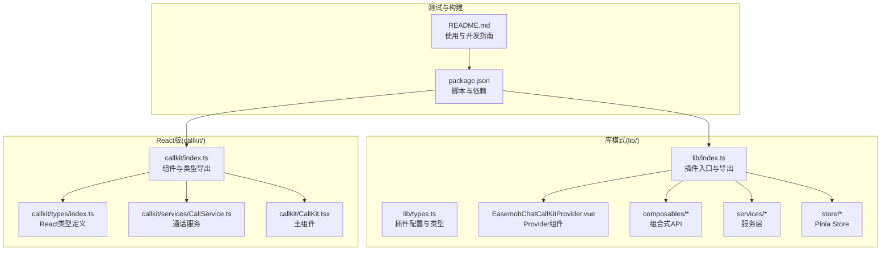
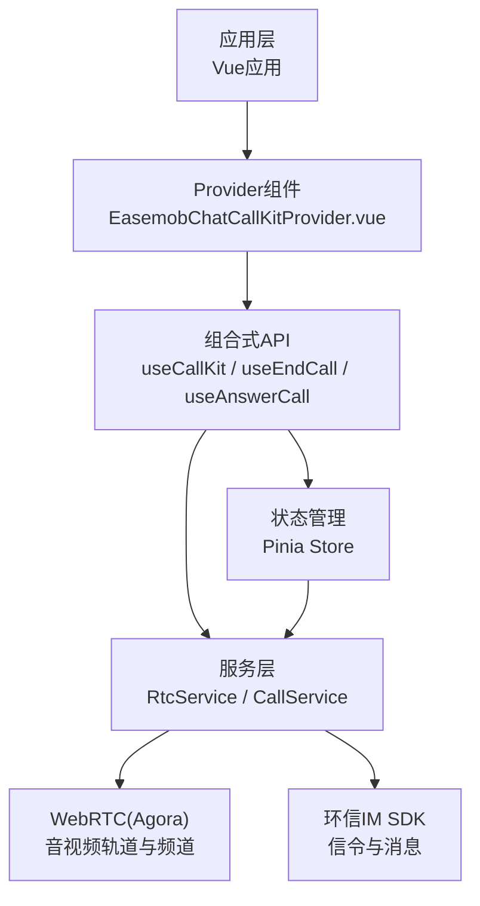
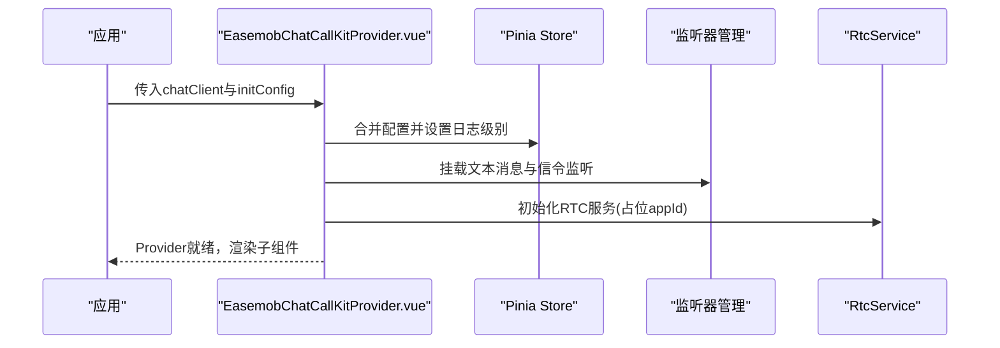
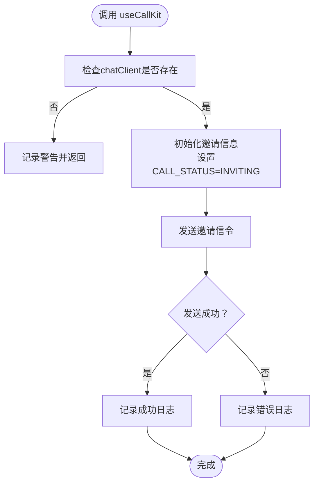
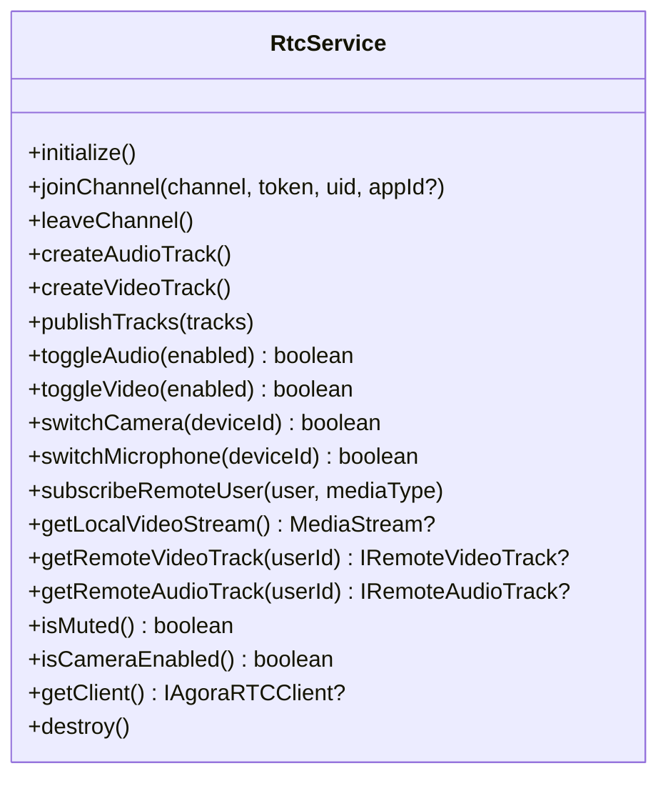
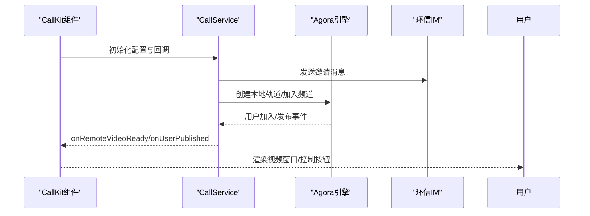
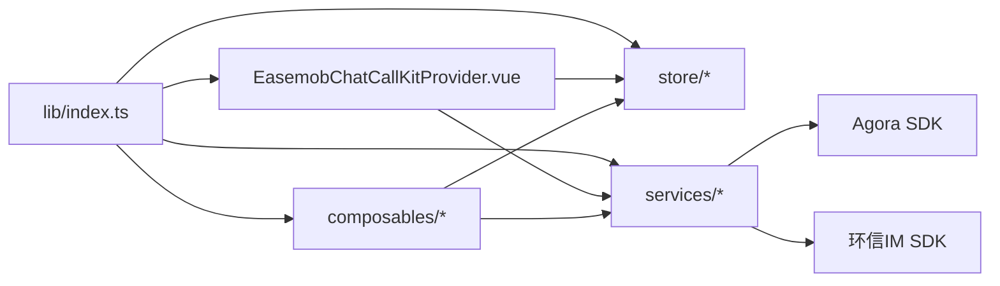

# 扩展机制与插件开发

<cite>
**本文档引用的文件**
- [README.md](file://README.md)
- [package.json](file://package.json)
- [lib/index.ts](file://lib/index.ts)
- [lib/types.ts](file://lib/types.ts)
- [lib/components/EasemobChatCallKitProvider.vue](file://lib/components/EasemobChatCallKitProvider.vue)
- [lib/composables/useCallKit.ts](file://lib/composables/useCallKit.ts)
- [lib/composables/useEndCall.ts](file://lib/composables/useEndCall.ts)
- [lib/composables/useAnswerCall.ts](file://lib/composables/useAnswerCall.ts)
- [lib/services/RtcService.ts](file://lib/services/RtcService.ts)
- [lib/store/callState.ts](file://lib/store/callState.ts)
- [lib/types/callstate.types.ts](file://lib/types/callstate.types.ts)
- [callkit/index.ts](file://callkit/index.ts)
- [callkit/CallKit.tsx](file://callkit/CallKit.tsx)
- [callkit/types/index.ts](file://callkit/types/index.ts)
- [callkit/services/CallService.ts](file://callkit/services/CallService.ts)
</cite>

## 目录
1. [简介](#简介)
2. [项目结构](#项目结构)
3. [核心组件](#核心组件)
4. [架构总览](#架构总览)
5. [详细组件分析](#详细组件分析)
6. [依赖关系分析](#依赖关系分析)
7. [性能考虑](#性能考虑)
8. [故障排查指南](#故障排查指南)
9. [结论](#结论)
10. [附录](#附录)

## 简介
本指南面向希望基于现有架构开发自定义组件与功能模块的开发者，系统阐述插件系统的扩展点、可定制化能力与最佳实践。文档覆盖以下主题：
- 插件系统的架构设计与扩展点识别
- 自定义通话组件与 UI 定制方法
- 业务逻辑扩展与组合式 API 的使用
- 兼容性保障与版本演进策略
- 完整的插件开发示例与集成步骤

## 项目结构
项目采用“库模式 + 示例模式”的双模式开发与验证体系，核心源码位于 lib/，React 版本位于 callkit/，二者共享统一的插件入口与类型定义。

**图表来源**
- [lib/index.ts](file://lib/index.ts#L1-L58)
- [lib/components/EasemobChatCallKitProvider.vue](file://lib/components/EasemobChatCallKitProvider.vue#L1-L115)
- [lib/types.ts](file://lib/types.ts#L1-L91)
- [callkit/index.ts](file://callkit/index.ts#L1-L46)
- [callkit/types/index.ts](file://callkit/types/index.ts#L1-L356)
- [callkit/services/CallService.ts](file://callkit/services/CallService.ts#L1-L800)
- [callkit/CallKit.tsx](file://callkit/CallKit.tsx#L1-L800)
- [package.json](file://package.json#L1-L53)
- [README.md](file://README.md#L1-L181)

**章节来源**
- [README.md](file://README.md#L1-L181)
- [package.json](file://package.json#L1-L53)

## 核心组件
- 插件入口与注册
  - lib/index.ts 提供默认导出与组件注册，通过 app.component 注册核心组件，便于在应用中直接使用。
  - 导出 useCallKit、useEndCall、useAnswerCall 等组合式 API，简化业务接入。
  - 导出 Pinia Store 访问器与 RTC 服务类，便于状态与媒体控制扩展。

- Provider 组件
  - EasemobChatCallKitProvider.vue 负责全局配置合并、日志级别设置、事件监听器挂载与 RTC 服务初始化，确保在应用上下文中统一管理。

- 组合式 API
  - useCallKit：封装发起单人/群组通话的信令发送与状态初始化。
  - useEndCall：封装挂断、取消、远程处理等场景。
  - useAnswerCall：封装被叫接听/拒绝/忙碌拒绝流程。

- 服务与状态
  - RtcService：封装 Agora WebRTC 能力，包括轨道创建、发布/订阅、设备切换、网络质量与音量指示。
  - callState Store：集中管理通话状态、邀请信息、超时计时与用户映射。

**章节来源**
- [lib/index.ts](file://lib/index.ts#L1-L58)
- [lib/components/EasemobChatCallKitProvider.vue](file://lib/components/EasemobChatCallKitProvider.vue#L1-L115)
- [lib/composables/useCallKit.ts](file://lib/composables/useCallKit.ts#L1-L123)
- [lib/composables/useEndCall.ts](file://lib/composables/useEndCall.ts#L1-L131)
- [lib/composables/useAnswerCall.ts](file://lib/composables/useAnswerCall.ts#L1-L168)
- [lib/services/RtcService.ts](file://lib/services/RtcService.ts#L1-L719)
- [lib/store/callState.ts](file://lib/store/callState.ts#L1-L263)

## 架构总览
插件采用“Provider + 组合式 API + 服务层 + Store”的分层架构，结合 React 版本的 CallKit 主组件，形成统一的插件生态。

**图表来源**
- [lib/components/EasemobChatCallKitProvider.vue](file://lib/components/EasemobChatCallKitProvider.vue#L1-L115)
- [lib/composables/useCallKit.ts](file://lib/composables/useCallKit.ts#L1-L123)
- [lib/composables/useEndCall.ts](file://lib/composables/useEndCall.ts#L1-L131)
- [lib/composables/useAnswerCall.ts](file://lib/composables/useAnswerCall.ts#L1-L168)
- [lib/services/RtcService.ts](file://lib/services/RtcService.ts#L1-L719)
- [callkit/services/CallService.ts](file://callkit/services/CallService.ts#L1-L800)

## 详细组件分析

### Provider 组件扩展点
- 全局配置合并与日志级别设置
  - 通过 defaultInitConfig 与用户传入 initConfig 合并，支持 debug、enableRingtone、resizable、draggable、inviteTimeout 等开关。
- 事件监听器挂载
  - 在 chatClientStore 可用时挂载文本消息与信令监听器，确保通话邀请与应答流程正常工作。
- RTC 服务初始化
  - 在 Provider 初始化阶段创建并挂载 RTC 服务，支持动态 appId（从环信服务器获取）。

**图表来源**
- [lib/components/EasemobChatCallKitProvider.vue](file://lib/components/EasemobChatCallKitProvider.vue#L1-L115)

**章节来源**
- [lib/components/EasemobChatCallKitProvider.vue](file://lib/components/EasemobChatCallKitProvider.vue#L1-L115)

### 组合式 API 扩展点
- useCallKit：封装发起单人/群组通话的信令发送与状态初始化，支持自定义消息体与群组信息提供器。
- useEndCall：提供多种挂断场景的封装，包含 canHangup/canCancel 等状态检查。
- useAnswerCall：封装被叫应答流程，支持 accept/refuse/busy 模式。

**图表来源**
- [lib/composables/useCallKit.ts](file://lib/composables/useCallKit.ts#L1-L123)

**章节来源**
- [lib/composables/useCallKit.ts](file://lib/composables/useCallKit.ts#L1-L123)
- [lib/composables/useEndCall.ts](file://lib/composables/useEndCall.ts#L1-L131)
- [lib/composables/useAnswerCall.ts](file://lib/composables/useAnswerCall.ts#L1-L168)

### 服务层扩展点
- RtcService：封装 WebRTC 生命周期与设备管理，支持动态 appId 更新、轨道创建/切换、发布/订阅、网络质量与音量指示。
- CallService（React版）：封装环信 IM 与 Agora 的交互，负责邀请发送、响铃、应答、通话状态流转与媒体事件回调。

**图表来源**
- [lib/services/RtcService.ts](file://lib/services/RtcService.ts#L1-L719)

**章节来源**
- [lib/services/RtcService.ts](file://lib/services/RtcService.ts#L1-L719)
- [callkit/services/CallService.ts](file://callkit/services/CallService.ts#L1-L800)

### UI 定制与 React 组件扩展点
- CallKit 主组件提供丰富的属性与回调，支持：
  - 布局模式、最大视频数、纵横比、间距等布局配置
  - 邀请通知自定义内容、铃声配置、拖拽与调整大小
  - 用户信息提供器与群组信息提供器，支持动态拉取头像与昵称
  - 事件回调：通话开始/结束、状态变化、网络质量、错误处理等

**图表来源**
- [callkit/CallKit.tsx](file://callkit/CallKit.tsx#L1-L800)
- [callkit/services/CallService.ts](file://callkit/services/CallService.ts#L1-L800)

**章节来源**
- [callkit/CallKit.tsx](file://callkit/CallKit.tsx#L1-L800)
- [callkit/types/index.ts](file://callkit/types/index.ts#L1-L356)

## 依赖关系分析
- 插件入口依赖
  - lib/index.ts 依赖 Vue 应用实例进行组件注册，导出组合式 API 与服务类，供上层业务调用。
- Provider 依赖
  - 依赖 Pinia Store、监听器管理与 RTC 服务，确保全局状态与媒体能力可用。
- 组合式 API 依赖
  - useCallKit 依赖 chatClientStore 与 signalManager；useEndCall/useAnswerCall 依赖 callStateStore 与服务层。
- 服务层依赖
  - RtcService 依赖 Agora SDK；CallService 依赖环信 SDK 与 Agora SDK。

**图表来源**
- [lib/index.ts](file://lib/index.ts#L1-L58)
- [lib/components/EasemobChatCallKitProvider.vue](file://lib/components/EasemobChatCallKitProvider.vue#L1-L115)
- [lib/services/RtcService.ts](file://lib/services/RtcService.ts#L1-L719)
- [callkit/services/CallService.ts](file://callkit/services/CallService.ts#L1-L800)

**章节来源**
- [lib/index.ts](file://lib/index.ts#L1-L58)
- [lib/components/EasemobChatCallKitProvider.vue](file://lib/components/EasemobChatCallKitProvider.vue#L1-L115)
- [lib/services/RtcService.ts](file://lib/services/RtcService.ts#L1-L719)
- [callkit/services/CallService.ts](file://callkit/services/CallService.ts#L1-L800)

## 性能考虑
- 组件级优化
  - React 版本对 FullLayoutManager 使用 React.memo，减少不必要的重渲染。
- 媒体资源管理
  - RtcService 对本地轨道与远程轨道进行缓存与复用，避免重复创建导致的资源浪费。
- 状态同步
  - Store 与服务层解耦，通过回调与事件驱动 UI 更新，降低耦合度与提升响应速度。
- 日志与调试
  - Provider 支持 debug 开关，可在开发阶段精细定位问题，生产环境建议关闭以减少开销。

[本节为通用指导，无需列出具体文件来源]

## 故障排查指南
- 无法发起通话
  - 检查 Provider 是否注入 chatClient，确认 useCallKit 调用前已初始化。
  - 查看日志级别与错误回调，定位信令发送失败或状态异常。
- 无法加入频道
  - 确认 RtcService 初始化与 appId 设置，检查 token 获取与频道加入流程。
- 邀请超时未自动隐藏
  - 多人通话场景下超时逻辑不同，需手动挂断以释放资源。
- 音视频异常
  - 检查轨道创建与发布状态，确认设备权限与切换逻辑。

**章节来源**
- [lib/components/EasemobChatCallKitProvider.vue](file://lib/components/EasemobChatCallKitProvider.vue#L1-L115)
- [lib/composables/useCallKit.ts](file://lib/composables/useCallKit.ts#L1-L123)
- [lib/composables/useEndCall.ts](file://lib/composables/useEndCall.ts#L1-L131)
- [lib/store/callState.ts](file://lib/store/callState.ts#L1-L263)
- [lib/services/RtcService.ts](file://lib/services/RtcService.ts#L1-L719)

## 结论
本插件体系通过 Provider 统一配置、组合式 API 简化接入、服务层隔离复杂度、Store 集中状态管理，形成高内聚低耦合的扩展架构。开发者可基于以下扩展点快速实现自定义通话组件、UI 定制与业务逻辑增强：
- Provider 配置项扩展与事件监听器扩展
- 组合式 API 场景化封装与状态检查
- 服务层能力补充（如新增媒体能力或信令协议）
- UI 层属性与回调的定制化

[本节为总结性内容，无需列出具体文件来源]

## 附录

### 插件开发最佳实践
- 保持 Provider 的单一职责：只负责初始化与全局配置，避免在 Provider 中直接处理业务逻辑。
- 使用组合式 API 封装业务场景，确保可测试性与可维护性。
- 服务层与 UI 层解耦，通过回调与事件驱动 UI 更新。
- 严格区分开发与生产环境的日志级别，避免性能影响。
- 在多人通话场景下，遵循超时与资源释放策略，防止资源泄漏。

[本节为通用指导，无需列出具体文件来源]

### 兼容性保证
- 版本升级策略
  - 保持 lib/index.ts 的导出稳定，新增能力通过扩展属性或新组合式 API 提供。
  - Provider 的 initConfig 保留向后兼容字段，新增字段提供默认值。
- 依赖版本
  - 通过 package.json 锁定关键依赖版本，避免第三方变更导致的破坏性影响。
- 模式切换
  - README 提供源码模式与 tgz 模式切换脚本，确保开发与发布一致性。

**章节来源**
- [README.md](file://README.md#L1-L181)
- [package.json](file://package.json#L1-L53)

### 完整插件开发示例与集成指南
- 安装与引入
  - 在应用中引入插件并传入 appKey、userId、accessToken 等基础配置。
  - 引入样式文件以确保 UI 正常渲染。
- Provider 配置
  - 在应用根部放置 Provider，传入 chatClient 与 initConfig，启用调试与铃声等功能。
- 组件使用
  - 在需要的位置使用插件提供的组件或组合式 API 发起通话。
- 业务扩展
  - 通过组合式 API 封装业务场景（如会议预约、通话统计），并通过服务层扩展媒体能力。

**章节来源**
- [README.md](file://README.md#L136-L166)
- [lib/index.ts](file://lib/index.ts#L48-L58)
- [lib/components/EasemobChatCallKitProvider.vue](file://lib/components/EasemobChatCallKitProvider.vue#L19-L57)