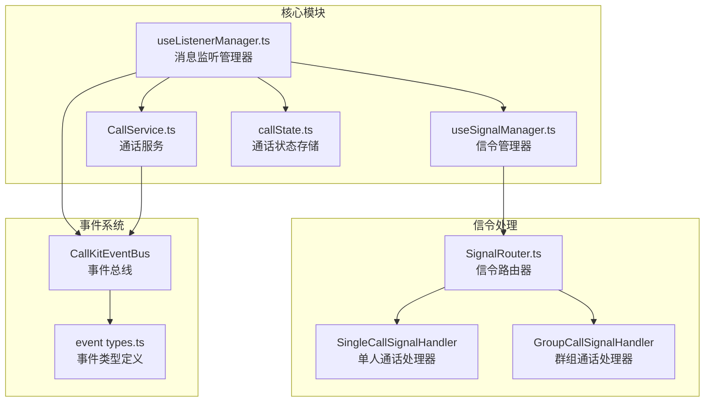
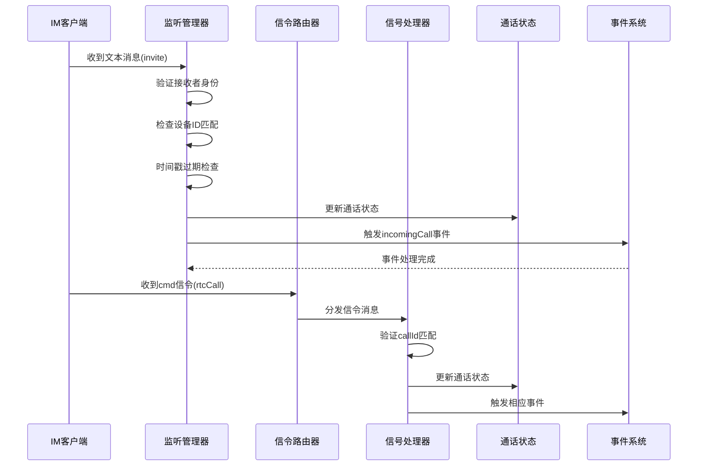
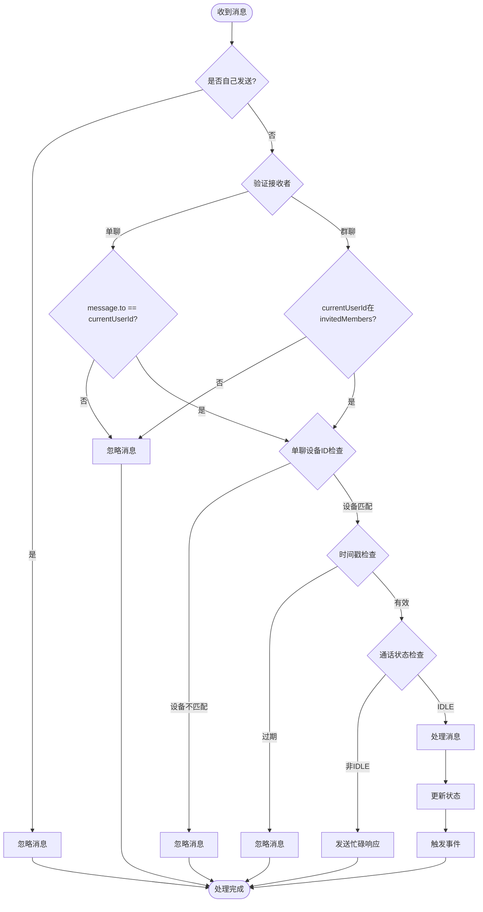
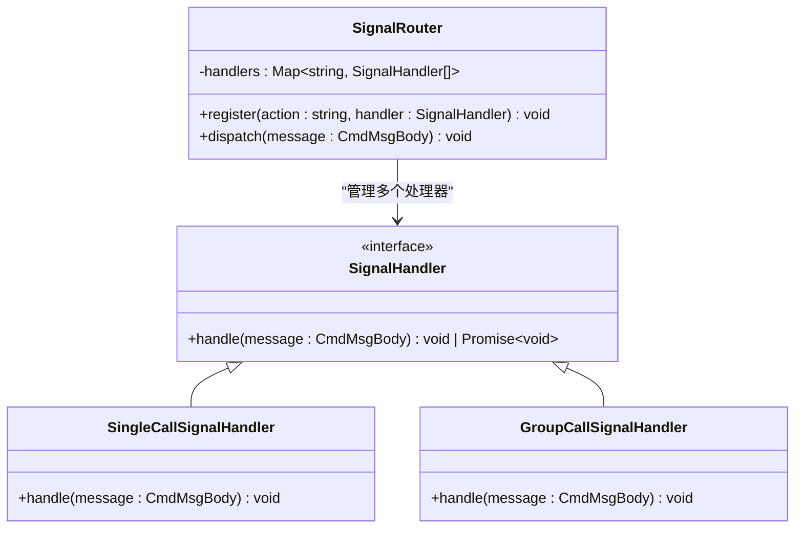
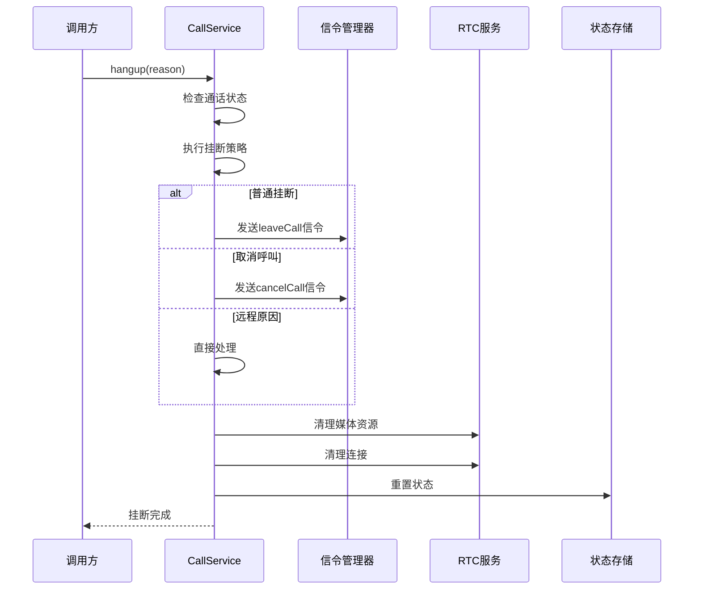
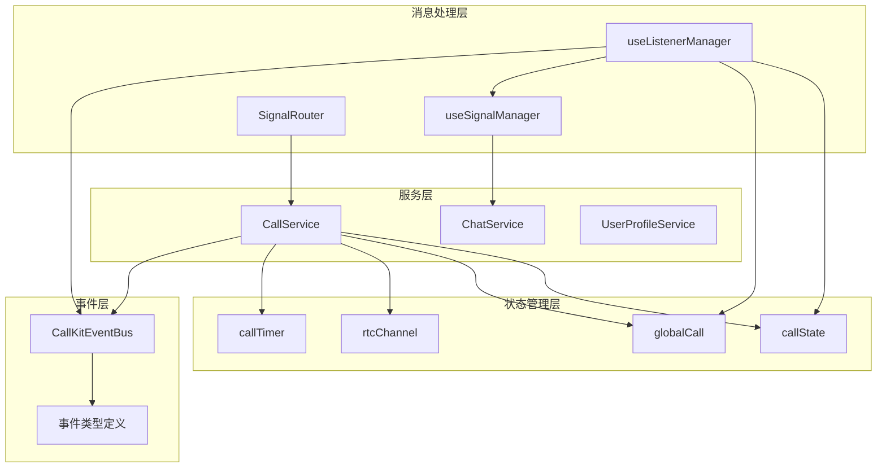

# 离线消息过滤与去重机制

<cite>
**本文档引用的文件**
- [lib/composables/useListenerManager.ts](file://lib/composables/useListenerManager.ts)
- [lib/composables/useSignalManager.ts](file://lib/composables/useSignalManager.ts)
- [lib/services/CallService.ts](file://lib/services/CallService.ts)
- [lib/store/callState.ts](file://lib/store/callState.ts)
- [lib/signaling/SignalRouter.ts](file://lib/signaling/SignalRouter.ts)
- [lib/core/events/types.ts](file://lib/core/events/types.ts)
- [skills/callkit-problems.md](file://skills/callkit-problems.md)
</cite>

## 目录
1. [简介](#简介)
2. [项目结构](#项目结构)
3. [核心组件](#核心组件)
4. [架构概览](#架构概览)
5. [详细组件分析](#详细组件分析)
6. [依赖关系分析](#依赖关系分析)
7. [性能考虑](#性能考虑)
8. [故障排除指南](#故障排除指南)
9. [结论](#结论)

## 简介

本文档深入分析 Easemob UIKit CallKit Vue3 项目中的离线消息过滤与去重机制。该机制旨在解决由于 resourceId 固定导致的离线消息重投问题，防止过期的通话邀请和信令消息引起重复弹窗和状态混乱。

主要问题背景：
- 同一用户在不同设备/浏览器登录（resourceId 固定为 `webim_web_xxxx`）
- 重新登录后 IM 服务端会把该用户在其他设备上已收到的离线消息重新投递一遍
- 过期的通话邀请（invite）文本消息会触发 `InvitationNotification` 弹窗
- 大量过期的 cancelCall / confirmCallee / leaveCall cmd 信令涌入

## 项目结构

该项目采用模块化架构，核心围绕以下几个关键模块：



**图表来源**
- [lib/composables/useListenerManager.ts:1-307](file://lib/composables/useListenerManager.ts#L1-L307)
- [lib/composables/useSignalManager.ts:1-365](file://lib/composables/useSignalManager.ts#L1-L365)
- [lib/services/CallService.ts:1-431](file://lib/services/CallService.ts#L1-L431)
- [lib/store/callState.ts:1-226](file://lib/store/callState.ts#L1-L226)

## 核心组件

### 离线消息过滤机制

项目实现了三层防护机制来过滤无效的离线消息：

1. **接收者身份验证**
   - 单聊：验证 `message.to` 是否等于当前用户ID
   - 群聊：验证当前用户是否在 `invitedMembers` 名单中

2. **设备级过滤**
   - 单聊：验证 `calleeDevId` 是否与当前设备ID匹配
   - 防止 resourceId 固定导致的多设备消息重投

3. **时间戳过期检查**
   - 邀请消息：超过 `inviteTimeout + 10s` 的消息将被忽略
   - 信令消息：超过 60 秒的 cmd 信令将被忽略

### 去重机制

通过以下方式实现消息去重：

1. **通话状态检查**
   - 仅当通话状态为 IDLE 时才处理新的邀请
   - 非 IDLE 状态下自动拒绝并发送忙碌响应

2. **callId 匹配**
   - 所有 cmd 信令都会验证 `callId` 是否与当前通话匹配
   - 不匹配的信令会被忽略

3. **状态重置**
   - 每次新通话开始时重置状态，清除之前的通话上下文

**章节来源**
- [lib/composables/useListenerManager.ts:64-212](file://lib/composables/useListenerManager.ts#L64-L212)
- [lib/composables/useListenerManager.ts:281-287](file://lib/composables/useListenerManager.ts#L281-L287)

## 架构概览



**图表来源**
- [lib/composables/useListenerManager.ts:239-300](file://lib/composables/useListenerManager.ts#L239-L300)
- [lib/signaling/SignalRouter.ts:23-35](file://lib/signaling/SignalRouter.ts#L23-L35)

## 详细组件分析

### 监听管理器 (useListenerManager)

监听管理器负责处理所有类型的通话相关消息，实现了完整的离线消息过滤逻辑：



**图表来源**
- [lib/composables/useListenerManager.ts:64-212](file://lib/composables/useListenerManager.ts#L64-L212)

### 信令路由器 (SignalRouter)

信令路由器实现了消息分发机制，确保不同类型的消息被正确处理：



**图表来源**
- [lib/signaling/SignalRouter.ts:1-36](file://lib/signaling/SignalRouter.ts#L1-L36)

### 通话服务 (CallService)

通话服务提供了统一的通话控制接口，包括挂断策略和状态管理：



**图表来源**
- [lib/services/CallService.ts:30-427](file://lib/services/CallService.ts#L30-L427)

**章节来源**
- [lib/composables/useListenerManager.ts:1-307](file://lib/composables/useListenerManager.ts#L1-L307)
- [lib/signaling/SignalRouter.ts:1-36](file://lib/signaling/SignalRouter.ts#L1-L36)
- [lib/services/CallService.ts:1-431](file://lib/services/CallService.ts#L1-L431)

## 依赖关系分析



**图表来源**
- [lib/composables/useListenerManager.ts:1-307](file://lib/composables/useListenerManager.ts#L1-L307)
- [lib/composables/useSignalManager.ts:1-365](file://lib/composables/useSignalManager.ts#L1-L365)
- [lib/services/CallService.ts:1-431](file://lib/services/CallService.ts#L1-L431)

**章节来源**
- [lib/composables/useListenerManager.ts:1-307](file://lib/composables/useListenerManager.ts#L1-L307)
- [lib/composables/useSignalManager.ts:1-365](file://lib/composables/useSignalManager.ts#L1-L365)
- [lib/services/CallService.ts:1-431](file://lib/services/CallService.ts#L1-L431)

## 性能考虑

### 内存管理
- 定时器在状态重置时自动清理，防止内存泄漏
- 事件处理器在组件卸载时自动移除

### 网络优化
- 仅在必要时发送信令消息，避免不必要的网络请求
- 批量处理群组通话的接收者列表

### 用户体验
- 实时状态更新，提供即时反馈
- 错误处理和降级策略，确保用户体验连续性

## 故障排除指南

### 常见问题诊断

1. **重复弹窗问题**
   - 检查 `calleeDevId` 校验是否正常工作
   - 验证时间戳过期检查逻辑
   - 确认通话状态检查是否正确

2. **消息延迟问题**
   - 检查 IM 客户端连接状态
   - 验证信令路由器的分发机制
   - 确认事件总线的处理性能

3. **状态同步问题**
   - 检查状态存储的持久化机制
   - 验证事件驱动的状态更新
   - 确认跨组件的状态共享

### 调试建议

1. **启用详细日志**
   ```typescript
   // 在开发环境中启用详细日志
   logger.setLevel('debug');
   ```

2. **监控关键指标**
   - 消息处理延迟
   - 通话成功率
   - 错误率统计

3. **性能分析**
   - 使用浏览器开发者工具分析内存使用
   - 监控网络请求频率
   - 分析事件处理耗时

**章节来源**
- [skills/callkit-problems.md:1-84](file://skills/callkit-problems.md#L1-L84)

## 结论

该离线消息过滤与去重机制通过多层防护设计，有效解决了 resourceId 固定导致的消息重投问题。主要特点包括：

1. **完整的过滤链路**：从接收者身份验证到设备级过滤，再到时间戳检查
2. **智能去重策略**：通过通话状态检查和 callId 匹配实现消息去重
3. **健壮的错误处理**：完善的异常捕获和降级机制
4. **可维护的架构**：清晰的模块划分和职责分离

该机制确保了在复杂网络环境下的稳定性和可靠性，为用户提供流畅的通话体验。