# 群组通话信号处理器

<cite>
**本文档引用的文件**
- [README.md](file://README.md)
- [index.ts](file://lib/index.ts)
- [SIGNALING_IMPLEMENTATION.md](file://lib/SIGNALING_IMPLEMENTATION.md)
- [GroupCallSignalHandler.ts](file://lib/signaling/GroupCallSignalHandler.ts)
- [SingleCallSignalHandler.ts](file://lib/signaling/SingleCallSignalHandler.ts)
- [SignalRouter.ts](file://lib/signaling/SignalRouter.ts)
- [GroupCallSignalingAdapter.ts](file://lib/modules/groupCall/signaling/GroupCallSignalingAdapter.ts)
- [GroupCallStore.ts](file://lib/modules/groupCall/viewModel/GroupCallStore.ts)
- [types.ts](file://lib/modules/groupCall/types.ts)
- [CallService.ts](file://lib/services/CallService.ts)
- [useSignalManager.ts](file://lib/composables/useSignalManager.ts)
- [callState.ts](file://lib/store/callState.ts)
- [useGroupCallViewModel.ts](file://lib/modules/groupCall/viewModel/useGroupCallViewModel.ts)
- [globalCall.ts](file://lib/store/globalCall.ts)
- [signal.types.ts](file://lib/types/signal.types.ts)
- [useListenerManager.ts](file://lib/composables/useListenerManager.ts)
- [ChatService.ts](file://lib/services/ChatService.ts)
- [RtcMediaBridge.ts](file://lib/modules/groupCall/media/RtcMediaBridge.ts)
- [UserProfileService.ts](file://lib/services/UserProfileService.ts)
- [useEndCall.ts](file://lib/composables/useEndCall.ts)
</cite>

## 更新摘要
**变更内容**
- 增强远程取消处理逻辑，改进 handleCancelCall() 方法的容错处理
- 优化 handleLeaveCall() 方法的状态检查和信号风暴防护
- 新增 callId 不匹配时的智能容错机制
- 完善远程挂断的条件判断和执行流程
- 增强信号风暴防护机制，防止重复处理和无限循环

## 目录
1. [简介](#简介)
2. [项目结构](#项目结构)
3. [核心组件](#核心组件)
4. [架构概览](#架构概览)
5. [详细组件分析](#详细组件分析)
6. [用户资料信息处理增强](#用户资料信息处理增强)
7. [信号风暴防护机制](#信号风暴防护机制)
8. [依赖关系分析](#依赖关系分析)
9. [性能考虑](#性能考虑)
10. [故障排除指南](#故障排除指南)
11. [结论](#结论)

## 简介

群组通话信号处理器是基于 Vue3 的环信聊天和音视频通话插件的核心组件之一。该系统实现了完整的群组通话信令处理机制，支持多人音视频通话、参与者管理、状态同步和媒体轨道管理。

该处理器采用模块化设计，通过信号路由器将不同类型的信令消息分发到相应的处理器，实现了清晰的职责分离和可扩展性。**最新版本显著增强了远程取消处理逻辑，改进了 handleCancelCall() 和 handleLeaveCall() 方法，有效防止了信号风暴问题的发生。**

## 项目结构

项目采用分层架构设计，主要包含以下核心目录：

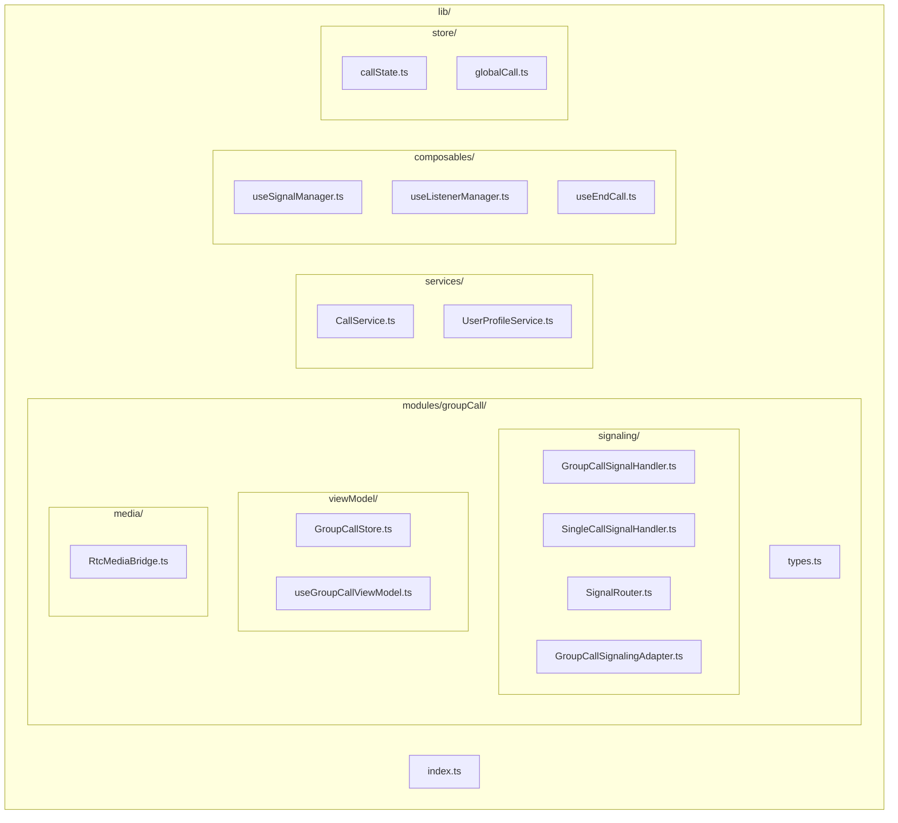
```mermaid
graph TB
subgraph "lib/"
subgraph "signaling/"
GCH[GroupCallSignalHandler.ts]
SCH[SingleCallSignalHandler.ts]
SR[SignalRouter.ts]
end
subgraph "modules/groupCall/"
subgraph "viewModel/"
GCS[GroupCallStore.ts]
UGCV[useGroupCallViewModel.ts]
end
subgraph "signaling/"
GSA[GroupCallSignalingAdapter.ts]
end
subgraph "media/"
RMB[RtcMediaBridge.ts]
end
TYPES[types.ts]
end
subgraph "services/"
CS[CallService.ts]
UPS[UserProfileService.ts]
end
subgraph "composables/"
USM[useSignalManager.ts]
ULM[useListenerManager.ts]
UEC[useEndCall.ts]
end
subgraph "store/"
CS2[callState.ts]
GCS3[globalCall.ts]
end
INDEX[index.ts]
end
```

**图表来源**
- [index.ts:1-70](file://lib/index.ts#L1-L70)
- [GroupCallSignalHandler.ts:1-321](file://lib/signaling/GroupCallSignalHandler.ts#L1-L321)
- [SingleCallSignalHandler.ts:1-512](file://lib/signaling/SingleCallSignalHandler.ts#L1-L512)

**章节来源**
- [README.md:5-31](file://README.md#L5-L31)
- [index.ts:1-70](file://lib/index.ts#L1-L70)

## 核心组件

### 信号路由器 (SignalRouter)

信号路由器是整个信令处理系统的核心中枢，负责将不同类型的消息分发到相应的处理器。

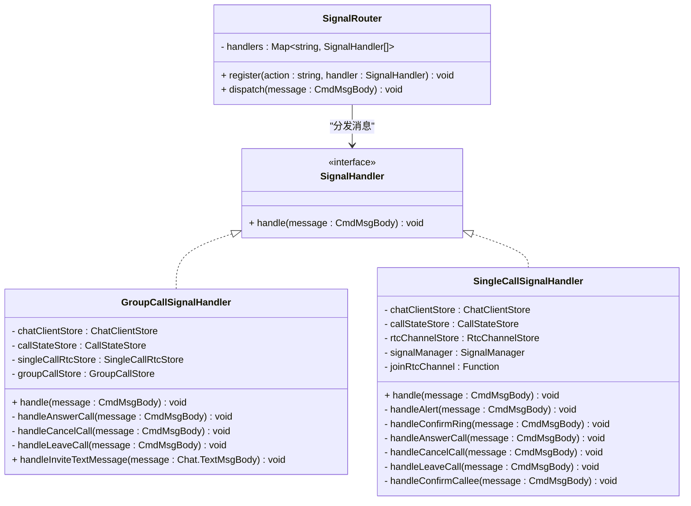
```mermaid
classDiagram
class SignalRouter {
- handlers : Map~string, SignalHandler[]~
+ register(action : string, handler : SignalHandler) void
+ dispatch(message : CmdMsgBody) void
}
class SignalHandler {
<<interface>>
+ handle(message : CmdMsgBody) void
}
class GroupCallSignalHandler {
- chatClientStore : ChatClientStore
- callStateStore : CallStateStore
- singleCallRtcStore : SingleCallRtcStore
- groupCallStore : GroupCallStore
+ handle(message : CmdMsgBody) void
- handleAnswerCall(message : CmdMsgBody) void
- handleCancelCall(message : CmdMsgBody) void
- handleLeaveCall(message : CmdMsgBody) void
+ handleInviteTextMessage(message : Chat.TextMsgBody) void
}
class SingleCallSignalHandler {
- chatClientStore : ChatClientStore
- callStateStore : CallStateStore
- rtcChannelStore : RtcChannelStore
- signalManager : SignalManager
- joinRtcChannel : Function
+ handle(message : CmdMsgBody) void
- handleAlert(message : CmdMsgBody) void
- handleConfirmRing(message : CmdMsgBody) void
- handleAnswerCall(message : CmdMsgBody) void
- handleCancelCall(message : CmdMsgBody) void
- handleLeaveCall(message : CmdMsgBody) void
- handleConfirmCallee(message : CmdMsgBody) void
}
SignalRouter --> SignalHandler : "分发消息"
SignalHandler <|.. GroupCallSignalHandler
SignalHandler <|.. SingleCallSignalHandler
```

**图表来源**
- [SignalRouter.ts:1-36](file://lib/signaling/SignalRouter.ts#L1-L36)
- [GroupCallSignalHandler.ts:17-36](file://lib/signaling/GroupCallSignalHandler.ts#L17-L36)
- [SingleCallSignalHandler.ts:17-46](file://lib/signaling/SingleCallSignalHandler.ts#L17-L46)

### 群组通话信号处理器

群组通话信号处理器专门处理群组通话相关的信令逻辑，包括参与者管理、状态同步和容错处理。**最新版本显著增强了远程取消处理逻辑，有效防止信号风暴问题。**

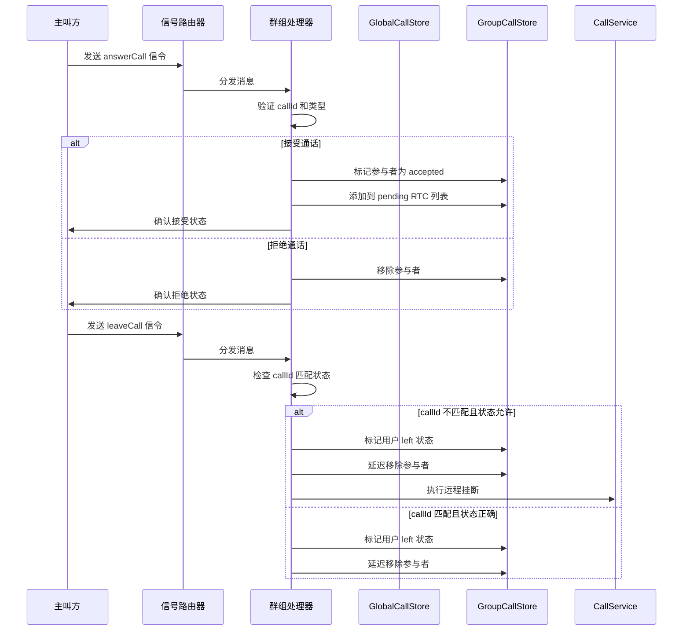
```mermaid
sequenceDiagram
participant Caller as 主叫方
participant Router as 信号路由器
participant Handler as 群组处理器
participant GlobalStore as GlobalCallStore
participant GroupStore as GroupCallStore
participant Service as CallService
Caller->>Router : 发送 answerCall 信令
Router->>Handler : 分发消息
Handler->>Handler : 验证 callId 和类型
alt 接受通话
Handler->>GroupStore : 标记参与者为 accepted
Handler->>GroupStore : 添加到 pending RTC 列表
Handler->>Caller : 确认接受状态
else 拒绝通话
Handler->>GroupStore : 移除参与者
Handler->>Caller : 确认拒绝状态
end
Caller->>Router : 发送 leaveCall 信令
Router->>Handler : 分发消息
Handler->>Handler : 检查 callId 匹配状态
alt callId 不匹配且状态允许
Handler->>GroupStore : 标记用户 left 状态
Handler->>GroupStore : 延迟移除参与者
Handler->>Service : 执行远程挂断
else callId 匹配且状态正确
Handler->>GroupStore : 标记用户 left 状态
Handler->>GroupStore : 延迟移除参与者
end
```

**图表来源**
- [GroupCallSignalHandler.ts:146-188](file://lib/signaling/GroupCallSignalHandler.ts#L146-L188)
- [GroupCallSignalHandler.ts:233-321](file://lib/signaling/GroupCallSignalHandler.ts#L233-L321)

### 单聊信号处理器

单聊信号处理器处理一对一通话的完整信令流程，包括响铃确认、通话建立和挂断逻辑。

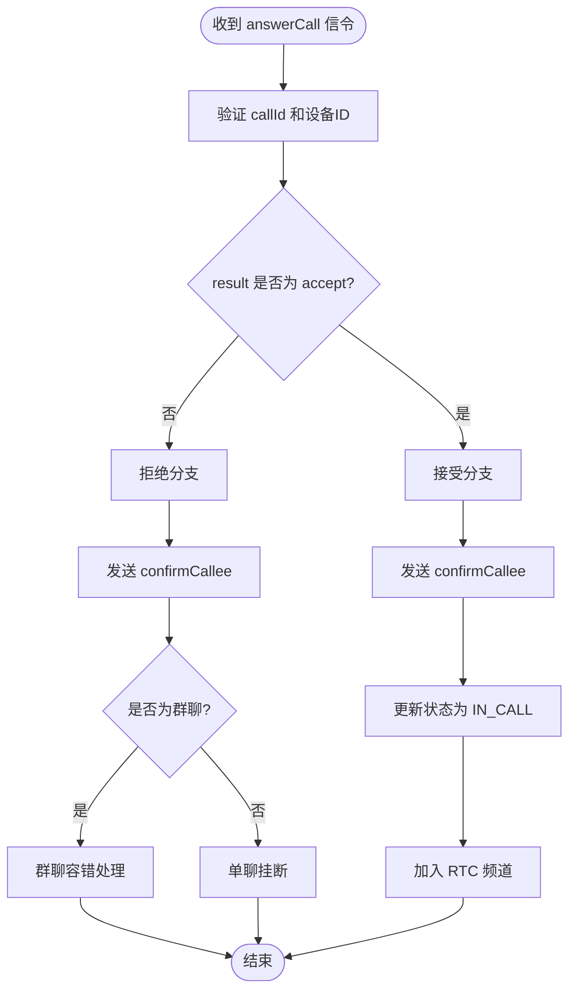
```mermaid
flowchart TD
Start([收到 answerCall 信令]) --> Validate["验证 callId 和设备ID"]
Validate --> CheckResult{"result 是否为 accept?"}
CheckResult --> |否| RejectBranch["拒绝分支"]
CheckResult --> |是| AcceptBranch["接受分支"]
RejectBranch --> SendConfirm["发送 confirmCallee"]
SendConfirm --> CheckType{"是否为群聊?"}
CheckType --> |是| GroupCallPath["群聊容错处理"]
CheckType --> |否| SingleCallPath["单聊挂断"]
AcceptBranch --> SendConfirm2["发送 confirmCallee"]
SendConfirm2 --> UpdateStatus["更新状态为 IN_CALL"]
UpdateStatus --> JoinRTC["加入 RTC 频道"]
GroupCallPath --> End([结束])
SingleCallPath --> End
JoinRTC --> End
```

**图表来源**
- [SingleCallSignalHandler.ts:170-307](file://lib/signaling/SingleCallSignalHandler.ts#L170-L307)

**章节来源**
- [SignalRouter.ts:1-36](file://lib/signaling/SignalRouter.ts#L1-L36)
- [GroupCallSignalHandler.ts:1-321](file://lib/signaling/GroupCallSignalHandler.ts#L1-L321)
- [SingleCallSignalHandler.ts:1-512](file://lib/signaling/SingleCallSignalHandler.ts#L1-L512)

## 架构概览

系统采用分层架构设计，实现了清晰的关注点分离：

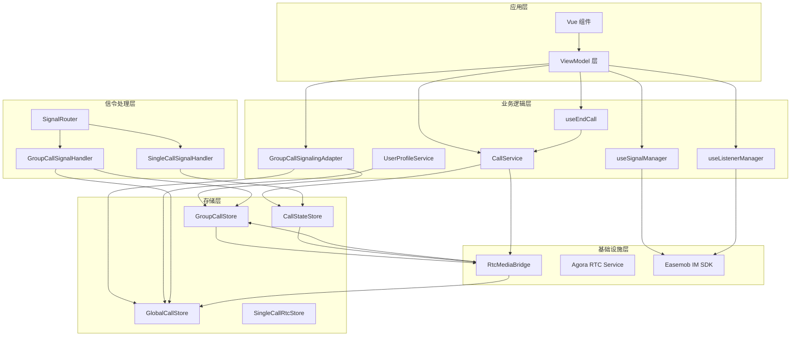
```mermaid
graph TB
subgraph "应用层"
UI[Vue 组件]
VM[ViewModel 层]
end
subgraph "业务逻辑层"
GSA[GroupCallSignalingAdapter]
CS[CallService]
USM[useSignalManager]
ULM[useListenerManager]
UPS[UserProfileService]
UEC[useEndCall]
end
subgraph "存储层"
GCS[GroupCallStore]
GCS3[GlobalCallStore]
CS2[CallStateStore]
SCRS[SingleCallRtcStore]
end
subgraph "信令处理层"
SR[SignalRouter]
GCH[GroupCallSignalHandler]
SCH[SingleCallSignalHandler]
end
subgraph "基础设施层"
RMB[RtcMediaBridge]
RTC[Agora RTC Service]
IM[Easemob IM SDK]
end
UI --> VM
VM --> GSA
VM --> CS
VM --> USM
VM --> ULM
VM --> UEC
GSA --> GCS
GSA --> GCS3
CS --> CS2
CS --> RMB
USM --> IM
ULM --> IM
UPS --> GCS3
UEC --> CS
SR --> GCH
SR --> SCH
GCH --> GCS
GCH --> GCS3
SCH --> CS2
GCS --> RMB
CS2 --> RMB
RMB --> GCS
RMB --> GCS3
```

**图表来源**
- [GroupCallSignalingAdapter.ts:1-66](file://lib/modules/groupCall/signaling/GroupCallSignalingAdapter.ts#L1-L66)
- [CallService.ts:1-397](file://lib/services/CallService.ts#L1-L397)
- [useSignalManager.ts:1-354](file://lib/composables/useSignalManager.ts#L1-L354)
- [GroupCallStore.ts:1-252](file://lib/modules/groupCall/viewModel/GroupCallStore.ts#L1-L252)
- [globalCall.ts:1-56](file://lib/store/globalCall.ts#L1-L56)
- [RtcMediaBridge.ts:1-277](file://lib/modules/groupCall/media/RtcMediaBridge.ts#L1-L277)
- [useEndCall.ts:1-131](file://lib/composables/useEndCall.ts#L1-L131)

## 详细组件分析

### 群组通话存储管理

GroupCallStore 是群组通话的核心状态管理器，提供了完整的参与者生命周期管理和状态同步机制。**新增的用户资料信息处理功能使其能够更好地管理参与者的显示信息。**

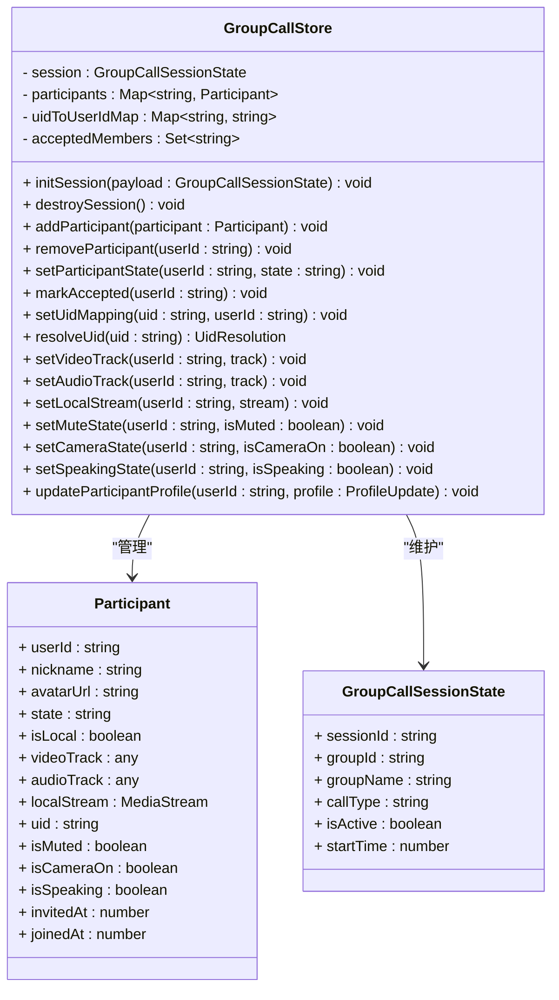
```mermaid
classDiagram
class GroupCallStore {
- session : GroupCallSessionState
- participants : Map~string, Participant~
- uidToUserIdMap : Map~string, string~
- acceptedMembers : Set~string~
+ initSession(payload : GroupCallSessionState) void
+ destroySession() void
+ addParticipant(participant : Participant) void
+ removeParticipant(userId : string) void
+ setParticipantState(userId : string, state : string) void
+ markAccepted(userId : string) void
+ setUidMapping(uid : string, userId : string) void
+ resolveUid(uid : string) UidResolution
+ setVideoTrack(userId : string, track) void
+ setAudioTrack(userId : string, track) void
+ setLocalStream(userId : string, stream) void
+ setMuteState(userId : string, isMuted : boolean) void
+ setCameraState(userId : string, isCameraOn : boolean) void
+ setSpeakingState(userId : string, isSpeaking : boolean) void
+ updateParticipantProfile(userId : string, profile : ProfileUpdate) void
}
class Participant {
+ userId : string
+ nickname : string
+ avatarUrl : string
+ state : string
+ isLocal : boolean
+ videoTrack : any
+ audioTrack : any
+ localStream : MediaStream
+ uid : string
+ isMuted : boolean
+ isCameraOn : boolean
+ isSpeaking : boolean
+ invitedAt : number
+ joinedAt : number
}
class GroupCallSessionState {
+ sessionId : string
+ groupId : string
+ groupName : string
+ callType : string
+ isActive : boolean
+ startTime : number
}
GroupCallStore --> Participant : "管理"
GroupCallStore --> GroupCallSessionState : "维护"
```

**图表来源**
- [GroupCallStore.ts:10-252](file://lib/modules/groupCall/viewModel/GroupCallStore.ts#L10-L252)
- [types.ts:16-56](file://lib/modules/groupCall/types.ts#L16-L56)

### 信令适配器模式

GroupCallSignalingAdapter 实现了适配器模式，将新的群组通话模块与现有的 CallKit 信令实现进行桥接。**该适配器现在集成了用户资料信息的处理逻辑，确保参与者信息的完整性和一致性。**

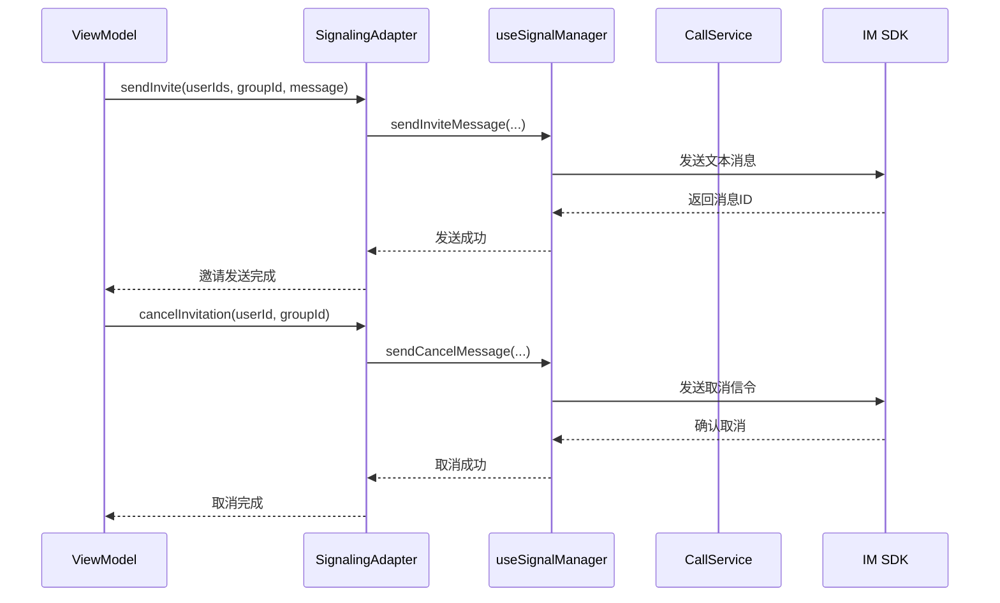
```mermaid
sequenceDiagram
participant VM as ViewModel
participant Adapter as SignalingAdapter
participant SignalManager as useSignalManager
participant CallService as CallService
participant IM as IM SDK
VM->>Adapter : sendInvite(userIds, groupId, message)
Adapter->>SignalManager : sendInviteMessage(...)
SignalManager->>IM : 发送文本消息
IM-->>SignalManager : 返回消息ID
SignalManager-->>Adapter : 发送成功
Adapter-->>VM : 邀请发送完成
VM->>Adapter : cancelInvitation(userId, groupId)
Adapter->>SignalManager : sendCancelMessage(...)
SignalManager->>IM : 发送取消信令
IM-->>SignalManager : 确认取消
SignalManager-->>Adapter : 取消成功
Adapter-->>VM : 取消完成
```

**图表来源**
- [GroupCallSignalingAdapter.ts:19-64](file://lib/modules/groupCall/signaling/GroupCallSignalingAdapter.ts#L19-L64)

### 信令管理器

useSignalManager 提供了统一的信令发送接口，封装了所有通话相关的信令发送逻辑。

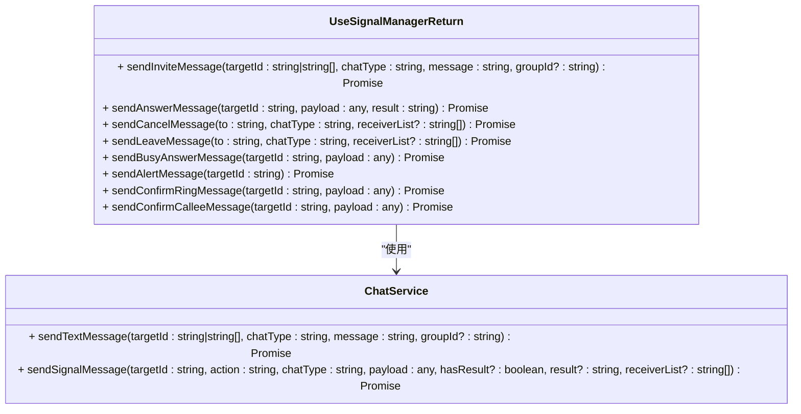
```mermaid
classDiagram
class UseSignalManagerReturn {
+ sendInviteMessage(targetId : string|string[], chatType : string, message : string, groupId? : string) Promise
+ sendAnswerMessage(targetId : string, payload : any, result : string) Promise
+ sendCancelMessage(to : string, chatType : string, receiverList? : string[]) Promise
+ sendLeaveMessage(to : string, chatType : string, receiverList? : string[]) Promise
+ sendBusyAnswerMessage(targetId : string, payload : any) Promise
+ sendAlertMessage(targetId : string) Promise
+ sendConfirmRingMessage(targetId : string, payload : any) Promise
+ sendConfirmCalleeMessage(targetId : string, payload : any) Promise
}
class ChatService {
+ sendTextMessage(targetId : string|string[], chatType : string, message : string, groupId? : string) Promise
+ sendSignalMessage(targetId : string, action : string, chatType : string, payload : any, hasResult? : boolean, result? : string, receiverList? : string[]) Promise
}
UseSignalManagerReturn --> ChatService : "使用"
```

**图表来源**
- [useSignalManager.ts:7-42](file://lib/composables/useSignalManager.ts#L7-L42)
- [useSignalManager.ts:50-354](file://lib/composables/useSignalManager.ts#L50-L354)

**章节来源**
- [GroupCallStore.ts:1-252](file://lib/modules/groupCall/viewModel/GroupCallStore.ts#L1-L252)
- [GroupCallSignalingAdapter.ts:1-66](file://lib/modules/groupCall/signaling/GroupCallSignalingAdapter.ts#L1-L66)
- [useSignalManager.ts:1-354](file://lib/composables/useSignalManager.ts#L1-L354)

## 用户资料信息处理增强

### GlobalCallStore 用户资料管理

**新增功能**：系统引入了GlobalCallStore来统一管理跨通话域的用户资料信息。这个存储层专门负责缓存和提供用户的基本信息，包括昵称和头像URL。

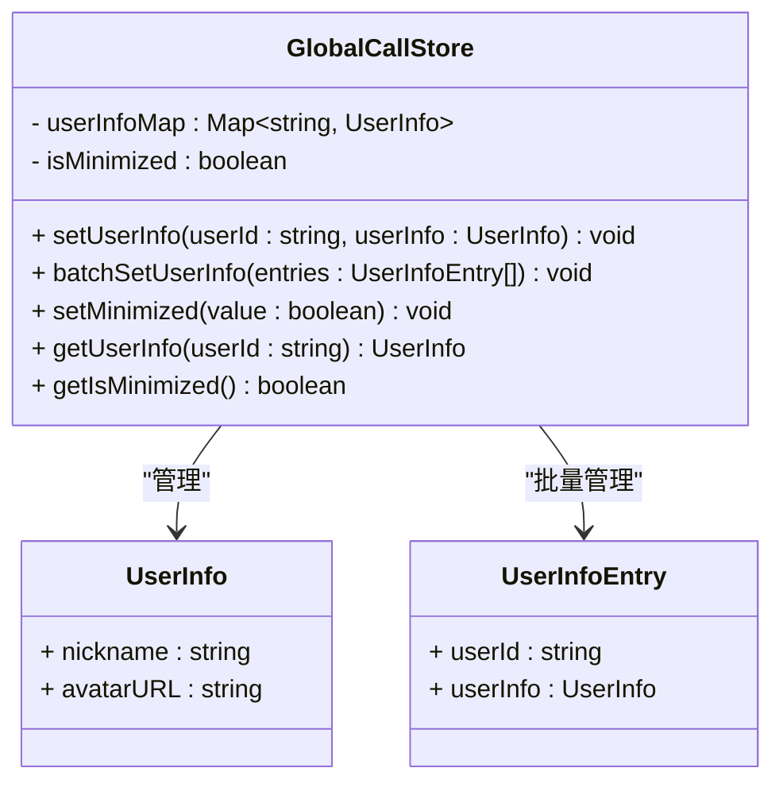
```mermaid
classDiagram
class GlobalCallStore {
- userInfoMap : Map~string, UserInfo~
- isMinimized : boolean
+ setUserInfo(userId : string, userInfo : UserInfo) void
+ batchSetUserInfo(entries : UserInfoEntry[]) void
+ setMinimized(value : boolean) void
+ getUserInfo(userId : string) UserInfo
+ getIsMinimized() boolean
}
class UserInfo {
+ nickname : string
+ avatarURL : string
}
class UserInfoEntry {
+ userId : string
+ userInfo : UserInfo
}
GlobalCallStore --> UserInfo : "管理"
GlobalCallStore --> UserInfoEntry : "批量管理"
```

**图表来源**
- [globalCall.ts:8-55](file://lib/store/globalCall.ts#L8-L55)

### 信令消息中的用户资料信息

**新增功能**：信令消息现在支持携带用户资料信息，通过`ease_chat_uikit_user_info`字段传递主叫方的昵称和头像信息。

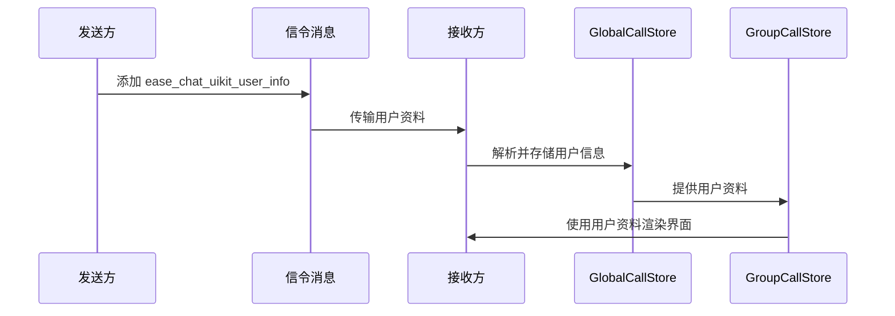
```mermaid
sequenceDiagram
participant Sender as 发送方
participant Message as 信令消息
participant Receiver as 接收方
participant GlobalStore as GlobalCallStore
participant GroupStore as GroupCallStore
Sender->>Message : 添加 ease_chat_uikit_user_info
Message->>Receiver : 传输用户资料
Receiver->>GlobalStore : 解析并存储用户信息
GlobalStore->>GroupStore : 提供用户资料
GroupStore->>Receiver : 使用用户资料渲染界面
```

**图表来源**
- [GroupCallSignalHandler.ts:60-67](file://lib/signaling/GroupCallSignalHandler.ts#L60-L67)
- [signal.types.ts:39-43](file://lib/types/signal.types.ts#L39-L43)

### 用户资料信息的解析和存储流程

**新增功能**：GroupCallSignalHandler现在包含完整的用户资料信息解析和存储逻辑，确保参与者信息的准确性和实时性。

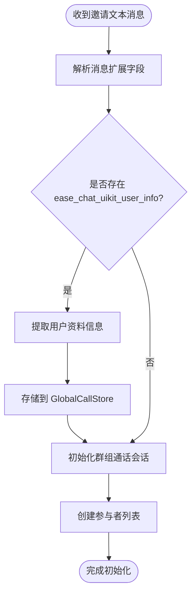
```mermaid
flowchart TD
Start([收到邀请文本消息]) --> ParseExt["解析消息扩展字段"]
ParseExt --> CheckUserInfo{"是否存在 ease_chat_uikit_user_info?"}
CheckUserInfo --> |是| ExtractUserInfo["提取用户资料信息"]
ExtractUserInfo --> StoreInGlobal["存储到 GlobalCallStore"]
StoreInGlobal --> InitGroupCall["初始化群组通话会话"]
CheckUserInfo --> |否| InitGroupCall
InitGroupCall --> CreateParticipants["创建参与者列表"]
CreateParticipants --> End([完成初始化])
```

**图表来源**
- [GroupCallSignalHandler.ts:44-141](file://lib/signaling/GroupCallSignalHandler.ts#L44-L141)

### RtcMediaBridge 用户资料丰富功能

**新增功能**：RtcMediaBridge现在集成了用户资料丰富功能，能够在用户UID解析成功后自动更新参与者的用户资料信息。

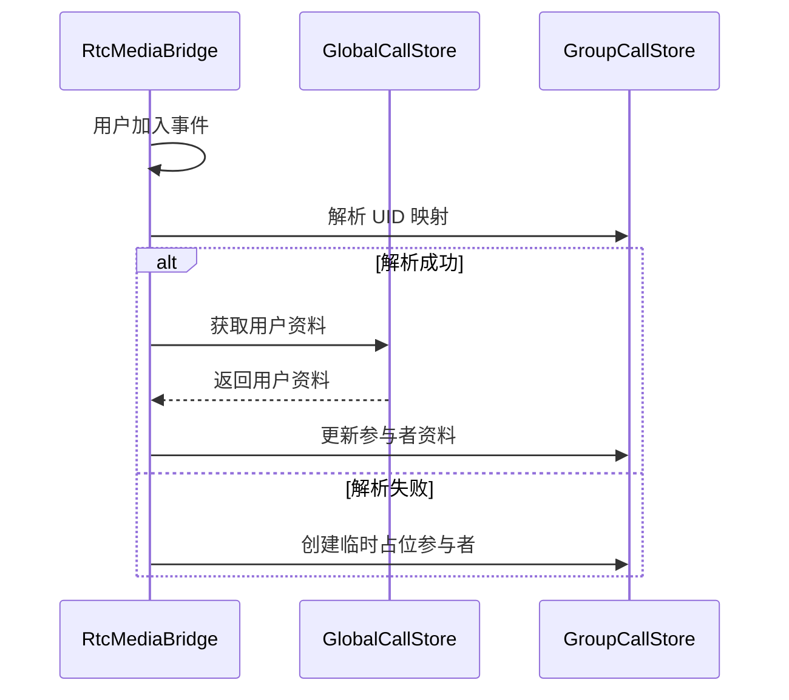
```mermaid
sequenceDiagram
participant Bridge as RtcMediaBridge
participant GlobalStore as GlobalCallStore
participant GroupStore as GroupCallStore
Bridge->>Bridge : 用户加入事件
Bridge->>GroupStore : 解析 UID 映射
alt 解析成功
Bridge->>GlobalStore : 获取用户资料
GlobalStore-->>Bridge : 返回用户资料
Bridge->>GroupStore : 更新参与者资料
else 解析失败
Bridge->>GroupStore : 创建临时占位参与者
end
```

**图表来源**
- [RtcMediaBridge.ts:65-110](file://lib/modules/groupCall/media/RtcMediaBridge.ts#L65-L110)
- [RtcMediaBridge.ts:245-257](file://lib/modules/groupCall/media/RtcMediaBridge.ts#L245-L257)

### UserProfileService 用户资料解析服务

**新增功能**：UserProfileService提供了统一的用户资料解析和缓存服务，支持批量解析用户信息并自动缓存到GlobalCallStore中。

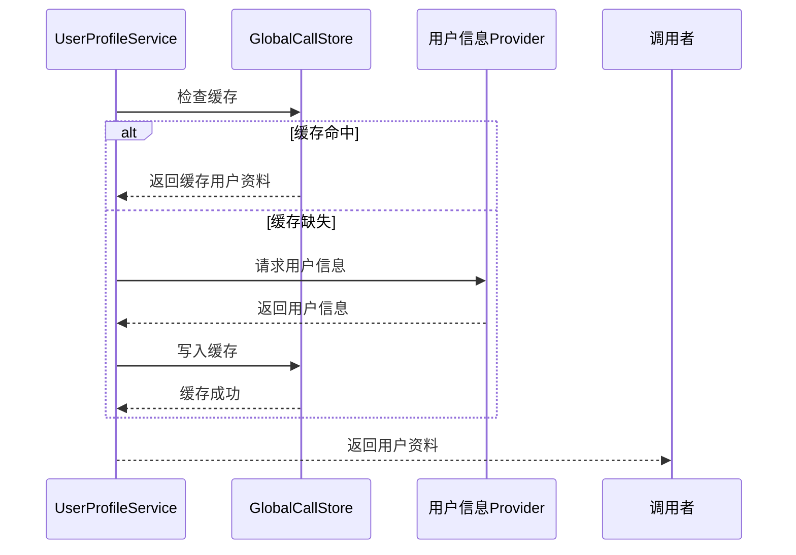
```mermaid
sequenceDiagram
participant Service as UserProfileService
participant GlobalStore as GlobalCallStore
participant Provider as 用户信息Provider
Service->>GlobalStore : 检查缓存
alt 缓存命中
GlobalStore-->>Service : 返回缓存用户资料
else 缓存缺失
Service->>Provider : 请求用户信息
Provider-->>Service : 返回用户信息
Service->>GlobalStore : 写入缓存
GlobalStore-->>Service : 缓存成功
end
Service-->>调用者 : 返回用户资料
```

**图表来源**
- [UserProfileService.ts:49-110](file://lib/services/UserProfileService.ts#L49-L110)

**章节来源**
- [globalCall.ts:1-56](file://lib/store/globalCall.ts#L1-L56)
- [signal.types.ts:39-51](file://lib/types/signal.types.ts#L39-L51)
- [GroupCallSignalHandler.ts:60-67](file://lib/signaling/GroupCallSignalHandler.ts#L60-L67)
- [RtcMediaBridge.ts:245-257](file://lib/modules/groupCall/media/RtcMediaBridge.ts#L245-L257)
- [UserProfileService.ts:49-110](file://lib/services/UserProfileService.ts#L49-L110)

## 信号风暴防护机制

### 增强的远程取消处理逻辑

**更新**：GroupCallSignalHandler 的 handleCancelCall() 方法经过重大改进，增加了智能容错处理机制，有效防止信号风暴问题。

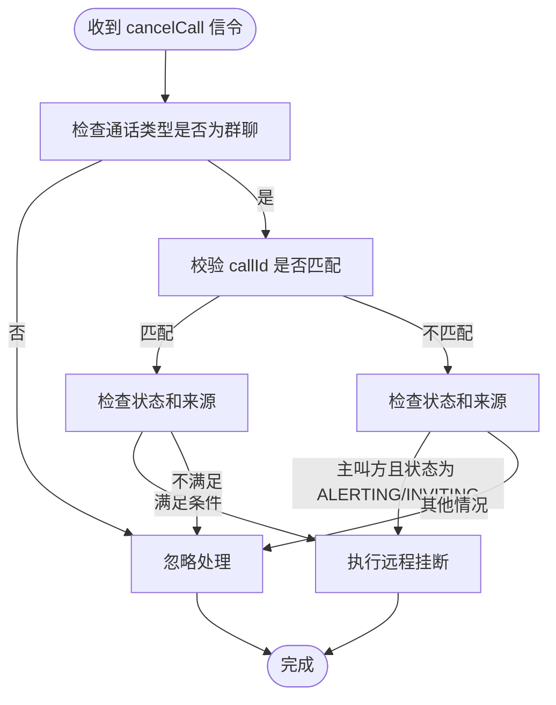
```mermaid
flowchart TD
Start([收到 cancelCall 信令]) --> CheckType["检查通话类型是否为群聊"]
CheckType --> |否| Ignore["忽略处理"]
CheckType --> |是| CheckCallId["校验 callId 是否匹配"]
CheckCallId --> |匹配| CheckStatus["检查状态和来源"]
CheckCallId --> |不匹配| CheckStatusMismatch["检查状态和来源"]
CheckStatus --> |满足条件| ExecuteCancel["执行远程挂断"]
CheckStatus --> |不满足| Ignore
CheckStatusMismatch --> |主叫方且状态为 ALERTING/INVITING| ExecuteCancel
CheckStatusMismatch --> |其他情况| Ignore
ExecuteCancel --> End([完成])
Ignore --> End
```

**图表来源**
- [GroupCallSignalHandler.ts:193-242](file://lib/signaling/GroupCallSignalHandler.ts#L193-L242)

### 优化的离开处理逻辑

**更新**：handleLeaveCall() 方法增加了更严格的状态检查和 callId 匹配验证，防止信号风暴和重复处理。

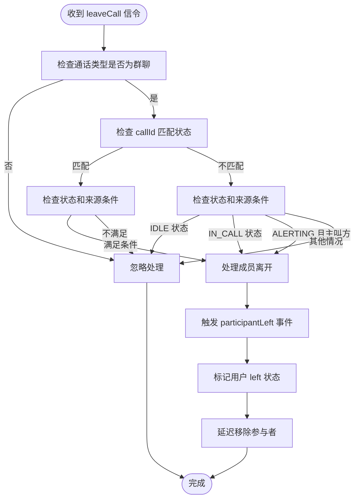
```mermaid
flowchart TD
Start([收到 leaveCall 信令]) --> CheckType["检查通话类型是否为群聊"]
CheckType --> |否| Ignore["忽略处理"]
CheckType --> |是| CheckCallId["检查 callId 匹配状态"]
CheckCallId --> |匹配| CheckConditions["检查状态和来源条件"]
CheckCallId --> |不匹配| CheckMismatch["检查状态和来源条件"]
CheckConditions --> |满足条件| ProcessLeave["处理成员离开"]
CheckConditions --> |不满足| Ignore
CheckMismatch --> |IDLE 状态| Ignore
CheckMismatch --> |IN_CALL 状态| ProcessLeave
CheckMismatch --> |ALERTING 且主叫方| ProcessLeave
CheckMismatch --> |其他情况| Ignore
ProcessLeave --> EmitEvent["触发 participantLeft 事件"]
EmitEvent --> MarkLeft["标记用户 left 状态"]
MarkLeft --> DelayRemove["延迟移除参与者"]
DelayRemove --> End([完成])
Ignore --> End
```

**图表来源**
- [GroupCallSignalHandler.ts:247-319](file://lib/signaling/GroupCallSignalHandler.ts#L247-L319)

### 远程挂断执行机制

**更新**：通过 useEndCall 组合式函数和 CallService 的 handleRemoteCancel() 方法，实现了统一的远程挂断执行机制。

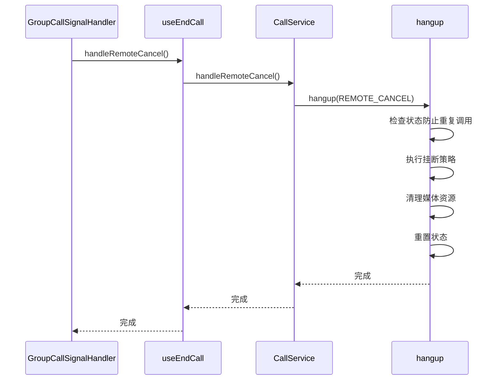
```mermaid
sequenceDiagram
participant Handler as GroupCallSignalHandler
participant EndCall as useEndCall
participant CallService as CallService
participant Hangup as hangup
Handler->>EndCall : handleRemoteCancel()
EndCall->>CallService : handleRemoteCancel()
CallService->>Hangup : hangup(REMOTE_CANCEL)
Hangup->>Hangup : 检查状态防止重复调用
Hangup->>Hangup : 执行挂断策略
Hangup->>Hangup : 清理媒体资源
Hangup->>Hangup : 重置状态
Hangup-->>CallService : 完成
CallService-->>EndCall : 完成
EndCall-->>Handler : 完成
```

**图表来源**
- [useEndCall.ts:60-70](file://lib/composables/useEndCall.ts#L60-L70)
- [CallService.ts:384-386](file://lib/services/CallService.ts#L384-L386)
- [CallService.ts:28-75](file://lib/services/CallService.ts#L28-L75)

### 信号风暴防护策略

**更新**：系统实现了多层次的信号风暴防护机制：

1. **callId 匹配验证**：严格检查信令消息的 callId 与当前通话状态是否匹配
2. **状态条件检查**：只有在特定状态下才执行相应的处理逻辑
3. **来源身份验证**：验证信令消息的发送方是否为主叫方
4. **重复调用防护**：通过 isRemoteReason() 方法判断远程原因，避免重复处理
5. **延迟移除机制**：使用 setTimeout 延迟移除参与者，防止状态冲突

**章节来源**
- [GroupCallSignalHandler.ts:193-319](file://lib/signaling/GroupCallSignalHandler.ts#L193-L319)
- [useEndCall.ts:60-70](file://lib/composables/useEndCall.ts#L60-L70)
- [CallService.ts:92-102](file://lib/services/CallService.ts#L92-L102)

## 依赖关系分析

系统采用了清晰的依赖层次结构，避免了循环依赖：

```mermaid
graph TD
subgraph "外部依赖"
AGORA[Agora RTC SDK]
EASEMOB[Easemob IM SDK]
PINIA[Pinia Store]
END
subgraph "核心模块"
SIGNALING[信令处理模块]
SERVICES[服务模块]
STORE[存储模块]
VIEWMODEL[视图模型模块]
MEDIA[媒体桥接模块]
COMPOSABLES[组合式函数模块]
END
subgraph "业务模块"
GROUPCALL[群组通话模块]
SINGLECALL[单聊通话模块]
END
subgraph "用户资料管理"
GLOBALCALL[GlobalCallStore]
USERPROFILE[UserProfileService]
END
AGORA --> SIGNALING
EASEMOB --> SIGNALING
PINIA --> STORE
SIGNALING --> SERVICES
SERVICES --> STORE
VIEWMODEL --> GROUPCALL
VIEWMODEL --> SINGLECALL
GROUPCALL --> STORE
SINGLECALL --> STORE
GLOBALCALL --> STORE
GROUPCALL --> GLOBALCALL
SINGLECALL --> GLOBALCALL
MEDIA --> GLOBALCALL
MEDIA --> USERPROFILE
USERPROFILE --> GLOBALCALL
COMPOSABLES --> SERVICES
COMPOSABLES --> SIGNALING
```

**图表来源**
- [GroupCallSignalHandler.ts:1-12](file://lib/signaling/GroupCallSignalHandler.ts#L1-L12)
- [SingleCallSignalHandler.ts:1-12](file://lib/signaling/SingleCallSignalHandler.ts#L1-L12)
- [CallService.ts:1-25](file://lib/services/CallService.ts#L1-L25)

### 关键依赖关系

1. **存储依赖**: 所有处理器都依赖于相应的 Store 来维护状态
2. **服务依赖**: CallService 依赖 RTC 和 IM 服务
3. **适配器模式**: SignalingAdapter 解耦了新模块与现有实现
4. **组合式函数**: useSignalManager 提供了统一的服务访问接口
5. **用户资料依赖**: GroupCallSignalHandler 依赖 GlobalCallStore 进行用户资料管理
6. **媒体桥接依赖**: RtcMediaBridge 依赖 GlobalCallStore 和 UserProfileService
7. **用户资料解析依赖**: UserProfileService 依赖 GlobalCallStore 进行缓存
8. **信号风暴防护依赖**: useEndCall 提供统一的远程挂断处理

**章节来源**
- [GroupCallSignalHandler.ts:17-23](file://lib/signaling/GroupCallSignalHandler.ts#L17-L23)
- [SingleCallSignalHandler.ts:17-22](file://lib/signaling/SingleCallSignalHandler.ts#L17-L22)
- [CallService.ts:10-25](file://lib/services/CallService.ts#L10-L25)

## 性能考虑

### 优化策略

1. **延迟初始化**: Store 采用延迟获取方式，确保在 Pinia 激活后再使用
2. **状态缓存**: 使用 Map 和 Set 数据结构提高查找效率
3. **异步处理**: 所有网络操作都采用异步方式，避免阻塞主线程
4. **内存管理**: 及时清理定时器和事件监听器
5. **用户资料缓存**: GlobalCallStore 提供了高效的用户资料缓存机制
6. **批量用户资料解析**: UserProfileService 支持批量解析用户信息，减少网络请求次数
7. **用户资料更新优化**: RtcMediaBridge 仅在用户资料发生变化时才更新参与者信息
8. **信号风暴防护**: 多层次的容错处理机制防止重复处理和无限循环
9. **callId 匹配优化**: 严格的 callId 验证减少无效处理
10. **状态检查优化**: 智能的状态条件检查避免不必要的操作

### 性能监控

系统内置了详细的日志记录机制，可以追踪信令处理的性能表现：

- 信令处理耗时统计
- 状态转换时间记录
- 网络请求成功率监控
- 异常处理和重试机制
- 用户资料解析性能监控
- 用户资料缓存命中率统计
- 信号风暴防护效果监控

## 故障排除指南

### 常见问题及解决方案

1. **信令处理异常**
   - 检查 SignalRouter 是否正确注册了处理器
   - 验证消息格式是否符合预期
   - 确认 callId 和设备ID匹配

2. **状态同步问题**
   - 检查 Store 的响应式更新机制
   - 验证状态转换的合法性
   - 确认异步操作的时序

3. **媒体连接问题**
   - 检查 RTC 服务的初始化状态
   - 验证权限和配置参数
   - 确认网络连接稳定性

4. **用户资料显示问题**
   - 检查 GlobalCallStore 中的用户资料缓存
   - 验证 ease_chat_uikit_user_info 字段的完整性
   - 确认用户资料提供器的配置
   - 检查 UserProfileService 的批量解析功能

5. **用户资料更新问题**
   - 检查 RtcMediaBridge 的用户资料丰富功能
   - 验证 UID 到用户ID的映射是否正确
   - 确认用户资料的更新时机和顺序

6. **信号风暴问题**
   - 检查 handleCancelCall() 和 handleLeaveCall() 的容错处理
   - 验证 callId 匹配和状态检查逻辑
   - 确认远程挂断执行的条件判断
   - 检查延迟移除机制的有效性

### 调试工具

系统提供了丰富的调试接口：

- 详细的日志输出
- 状态快照查看
- 信令流程追踪
- 性能指标监控
- 用户资料信息追踪
- 用户资料缓存状态监控
- 信号风暴防护效果监控

**章节来源**
- [callState.ts:13-131](file://lib/store/callState.ts#L13-L131)
- [CallService.ts:26-73](file://lib/services/CallService.ts#L26-L73)

## 结论

群组通话信号处理器是一个设计精良的模块化系统，具有以下特点：

1. **清晰的架构**: 采用分层设计，职责分离明确
2. **良好的扩展性**: 通过适配器模式支持新功能扩展
3. **完善的错误处理**: 提供全面的异常处理和恢复机制
4. **高性能实现**: 优化的数据结构和异步处理策略
5. **易于维护**: 清晰的代码结构和详细的文档说明
6. **用户资料管理**: 新增的用户资料信息处理功能提升了用户体验
7. **信号风暴防护**: 最新版本显著增强了远程取消处理逻辑，有效防止信号风暴问题

**最新版本的重大改进**：
- **增强的远程取消处理**：handleCancelCall() 方法增加了智能容错处理，防止信号风暴
- **优化的离开处理**：handleLeaveCall() 方法完善了状态检查和 callId 匹配验证
- **统一的远程挂断机制**：通过 useEndCall 和 CallService 实现了标准化的远程挂断处理
- **多层次防护策略**：实现了 callId 匹配、状态检查、来源验证等多重防护机制
- **延迟移除优化**：使用 setTimeout 延迟移除参与者，避免状态冲突和信号风暴
- **信号风暴监控**：内置了信号风暴防护效果监控机制

该系统为群组音视频通话提供了稳定可靠的技术基础，支持多种使用场景和复杂的业务需求。新增的信号风暴防护功能进一步增强了系统的健壮性和用户体验，确保在各种异常情况下都能保持稳定的通话质量。