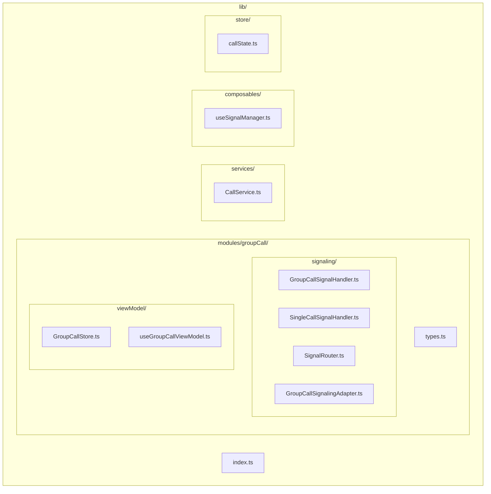
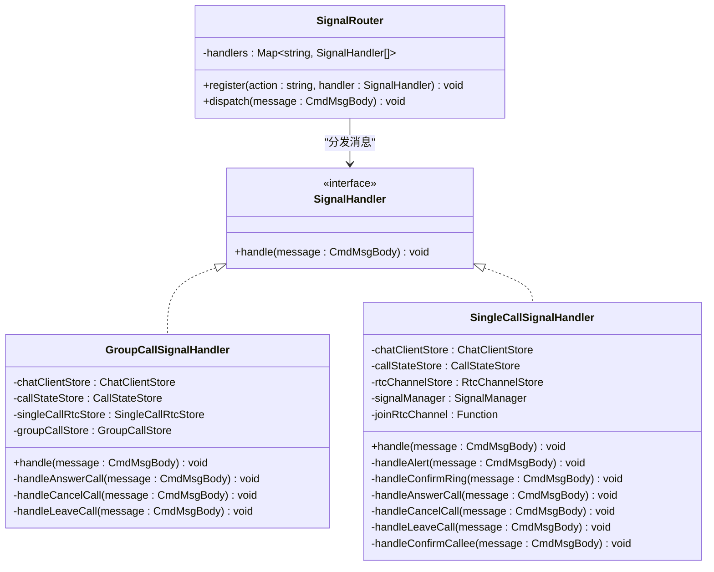
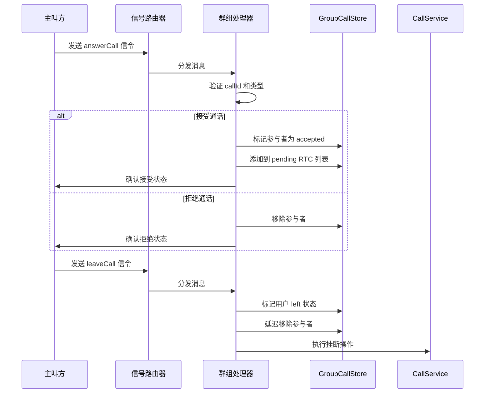
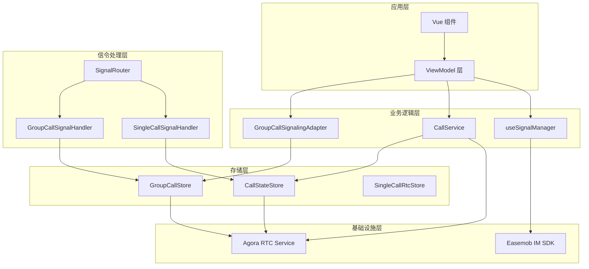
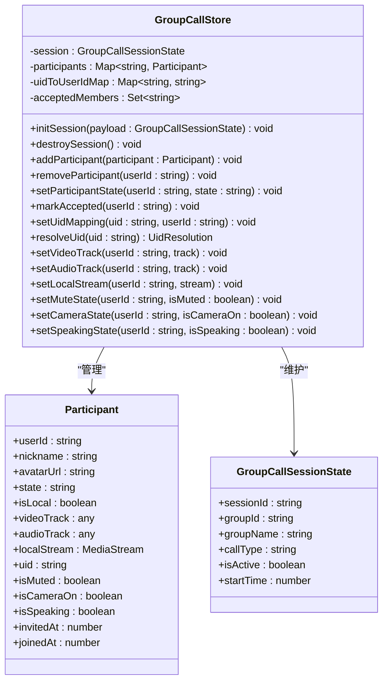
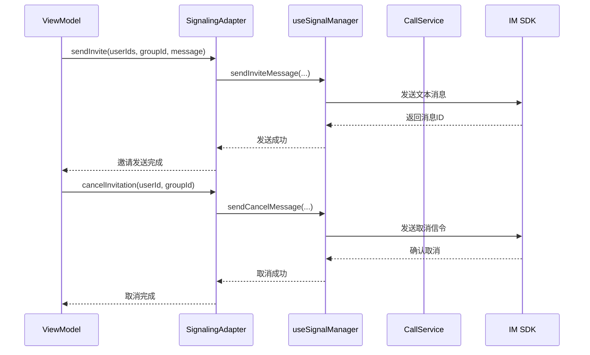
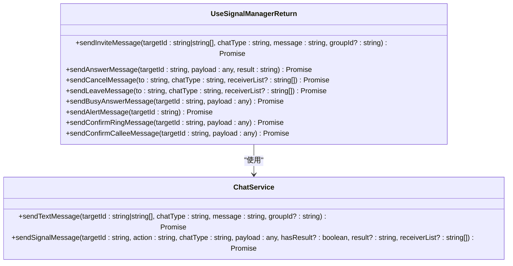
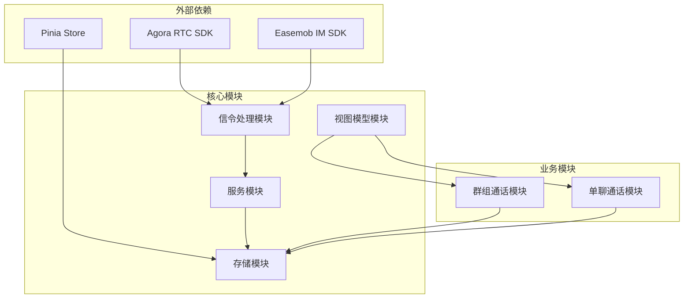

# 群组通话信号处理器

<cite>
**本文档引用的文件**
- [README.md](file://README.md)
- [index.ts](file://lib/index.ts)
- [SIGNALING_IMPLEMENTATION.md](file://lib/SIGNALING_IMPLEMENTATION.md)
- [GroupCallSignalHandler.ts](file://lib/signaling/GroupCallSignalHandler.ts)
- [SingleCallSignalHandler.ts](file://lib/signaling/SingleCallSignalHandler.ts)
- [SignalRouter.ts](file://lib/signaling/SignalRouter.ts)
- [GroupCallSignalingAdapter.ts](file://lib/modules/groupCall/signaling/GroupCallSignalingAdapter.ts)
- [GroupCallStore.ts](file://lib/modules/groupCall/viewModel/GroupCallStore.ts)
- [types.ts](file://lib/modules/groupCall/types.ts)
- [CallService.ts](file://lib/services/CallService.ts)
- [useSignalManager.ts](file://lib/composables/useSignalManager.ts)
- [callState.ts](file://lib/store/callState.ts)
- [useGroupCallViewModel.ts](file://lib/modules/groupCall/viewModel/useGroupCallViewModel.ts)
</cite>

## 目录
1. [简介](#简介)
2. [项目结构](#项目结构)
3. [核心组件](#核心组件)
4. [架构概览](#架构概览)
5. [详细组件分析](#详细组件分析)
6. [依赖关系分析](#依赖关系分析)
7. [性能考虑](#性能考虑)
8. [故障排除指南](#故障排除指南)
9. [结论](#结论)

## 简介

群组通话信号处理器是基于 Vue3 的环信聊天和音视频通话插件的核心组件之一。该系统实现了完整的群组通话信令处理机制，支持多人音视频通话、参与者管理、状态同步和媒体轨道管理。

该处理器采用模块化设计，通过信号路由器将不同类型的信令消息分发到相应的处理器，实现了清晰的职责分离和可扩展性。

## 项目结构

项目采用分层架构设计，主要包含以下核心目录：

**图表来源**
- [index.ts:1-70](file://lib/index.ts#L1-L70)
- [GroupCallSignalHandler.ts:1-263](file://lib/signaling/GroupCallSignalHandler.ts#L1-L263)
- [SingleCallSignalHandler.ts:1-433](file://lib/signaling/SingleCallSignalHandler.ts#L1-L433)

**章节来源**
- [README.md:5-31](file://README.md#L5-L31)
- [index.ts:1-70](file://lib/index.ts#L1-L70)

## 核心组件

### 信号路由器 (SignalRouter)

信号路由器是整个信令处理系统的核心中枢，负责将不同类型的消息分发到相应的处理器。

**图表来源**
- [SignalRouter.ts:1-36](file://lib/signaling/SignalRouter.ts#L1-L36)
- [GroupCallSignalHandler.ts:17-36](file://lib/signaling/GroupCallSignalHandler.ts#L17-L36)
- [SingleCallSignalHandler.ts:17-46](file://lib/signaling/SingleCallSignalHandler.ts#L17-L46)

### 群组通话信号处理器

群组通话信号处理器专门处理群组通话相关的信令逻辑，包括参与者管理、状态同步和容错处理。

**图表来源**
- [GroupCallSignalHandler.ts:121-154](file://lib/signaling/GroupCallSignalHandler.ts#L121-L154)
- [GroupCallSignalHandler.ts:199-261](file://lib/signaling/GroupCallSignalHandler.ts#L199-L261)

### 单聊信号处理器

单聊信号处理器处理一对一通话的完整信令流程，包括响铃确认、通话建立和挂断逻辑。

**图表来源**
- [SingleCallSignalHandler.ts:172-270](file://lib/signaling/SingleCallSignalHandler.ts#L172-L270)

**章节来源**
- [SignalRouter.ts:1-36](file://lib/signaling/SignalRouter.ts#L1-L36)
- [GroupCallSignalHandler.ts:1-263](file://lib/signaling/GroupCallSignalHandler.ts#L1-L263)
- [SingleCallSignalHandler.ts:1-433](file://lib/signaling/SingleCallSignalHandler.ts#L1-L433)

## 架构概览

系统采用分层架构设计，实现了清晰的关注点分离：

**图表来源**
- [GroupCallSignalingAdapter.ts:1-66](file://lib/modules/groupCall/signaling/GroupCallSignalingAdapter.ts#L1-L66)
- [CallService.ts:1-360](file://lib/services/CallService.ts#L1-L360)
- [useSignalManager.ts:1-354](file://lib/composables/useSignalManager.ts#L1-L354)
- [GroupCallStore.ts:1-223](file://lib/modules/groupCall/viewModel/GroupCallStore.ts#L1-L223)

## 详细组件分析

### 群组通话存储管理

GroupCallStore 是群组通话的核心状态管理器，提供了完整的参与者生命周期管理和状态同步机制。

**图表来源**
- [GroupCallStore.ts:10-223](file://lib/modules/groupCall/viewModel/GroupCallStore.ts#L10-L223)
- [types.ts:16-56](file://lib/modules/groupCall/types.ts#L16-L56)

### 信令适配器模式

GroupCallSignalingAdapter 实现了适配器模式，将新的群组通话模块与现有的 CallKit 信令实现进行桥接。

**图表来源**
- [GroupCallSignalingAdapter.ts:19-64](file://lib/modules/groupCall/signaling/GroupCallSignalingAdapter.ts#L19-L64)

### 信令管理器

useSignalManager 提供了统一的信令发送接口，封装了所有通话相关的信令发送逻辑。

**图表来源**
- [useSignalManager.ts:7-42](file://lib/composables/useSignalManager.ts#L7-L42)
- [useSignalManager.ts:50-354](file://lib/composables/useSignalManager.ts#L50-L354)

**章节来源**
- [GroupCallStore.ts:1-223](file://lib/modules/groupCall/viewModel/GroupCallStore.ts#L1-L223)
- [GroupCallSignalingAdapter.ts:1-66](file://lib/modules/groupCall/signaling/GroupCallSignalingAdapter.ts#L1-L66)
- [useSignalManager.ts:1-354](file://lib/composables/useSignalManager.ts#L1-L354)

## 依赖关系分析

系统采用了清晰的依赖层次结构，避免了循环依赖：

**图表来源**
- [GroupCallSignalHandler.ts:1-10](file://lib/signaling/GroupCallSignalHandler.ts#L1-L10)
- [SingleCallSignalHandler.ts:1-10](file://lib/signaling/SingleCallSignalHandler.ts#L1-L10)
- [CallService.ts:1-9](file://lib/services/CallService.ts#L1-L9)

### 关键依赖关系

1. **存储依赖**: 所有处理器都依赖于相应的 Store 来维护状态
2. **服务依赖**: CallService 依赖 RTC 和 IM 服务
3. **适配器模式**: SignalingAdapter 解耦了新模块与现有实现
4. **组合式函数**: useSignalManager 提供了统一的服务访问接口

**章节来源**
- [GroupCallSignalHandler.ts:17-22](file://lib/signaling/GroupCallSignalHandler.ts#L17-L22)
- [SingleCallSignalHandler.ts:17-22](file://lib/signaling/SingleCallSignalHandler.ts#L17-L22)
- [CallService.ts:10-25](file://lib/services/CallService.ts#L10-L25)

## 性能考虑

### 优化策略

1. **延迟初始化**: Store 采用延迟获取方式，确保在 Pinia 激活后再使用
2. **状态缓存**: 使用 Map 和 Set 数据结构提高查找效率
3. **异步处理**: 所有网络操作都采用异步方式，避免阻塞主线程
4. **内存管理**: 及时清理定时器和事件监听器

### 性能监控

系统内置了详细的日志记录机制，可以追踪信令处理的性能表现：

- 信令处理耗时统计
- 状态转换时间记录
- 网络请求成功率监控
- 异常处理和重试机制

## 故障排除指南

### 常见问题及解决方案

1. **信令处理异常**
   - 检查 SignalRouter 是否正确注册了处理器
   - 验证消息格式是否符合预期
   - 确认 callId 和设备ID匹配

2. **状态同步问题**
   - 检查 Store 的响应式更新机制
   - 验证状态转换的合法性
   - 确认异步操作的时序

3. **媒体连接问题**
   - 检查 RTC 服务的初始化状态
   - 验证权限和配置参数
   - 确认网络连接稳定性

### 调试工具

系统提供了丰富的调试接口：

- 详细的日志输出
- 状态快照查看
- 信令流程追踪
- 性能指标监控

**章节来源**
- [callState.ts:13-131](file://lib/store/callState.ts#L13-L131)
- [CallService.ts:26-73](file://lib/services/CallService.ts#L26-L73)

## 结论

群组通话信号处理器是一个设计精良的模块化系统，具有以下特点：

1. **清晰的架构**: 采用分层设计，职责分离明确
2. **良好的扩展性**: 通过适配器模式支持新功能扩展
3. **完善的错误处理**: 提供全面的异常处理和恢复机制
4. **高性能实现**: 优化的数据结构和异步处理策略
5. **易于维护**: 清晰的代码结构和详细的文档说明

该系统为群组音视频通话提供了稳定可靠的技术基础，支持多种使用场景和复杂的业务需求。