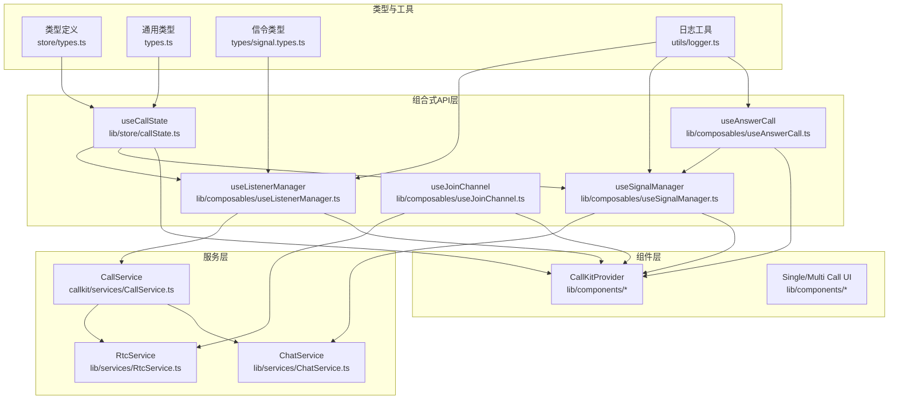
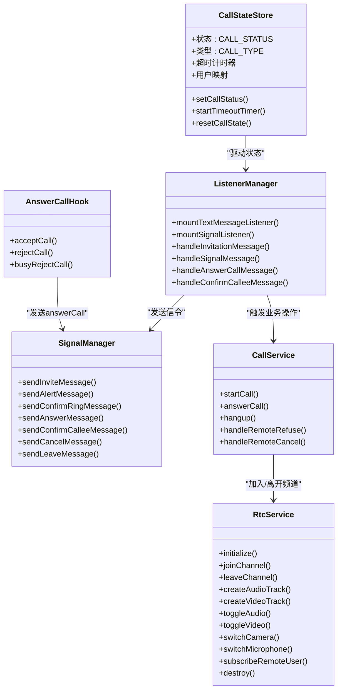
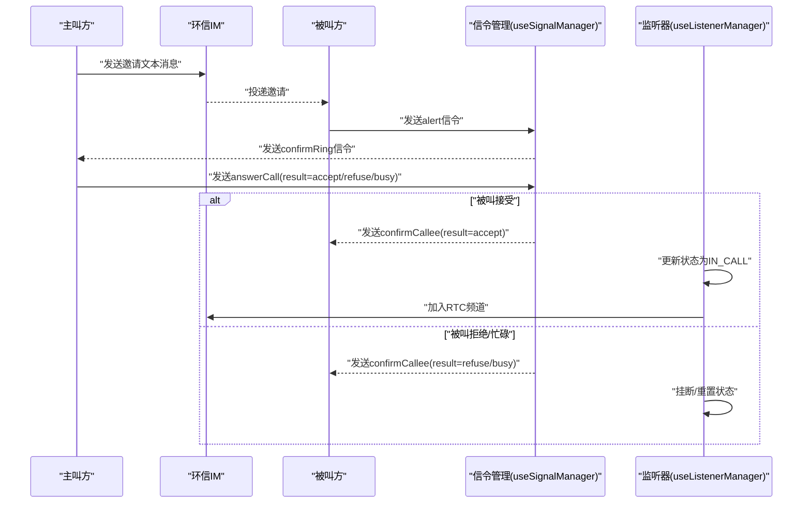
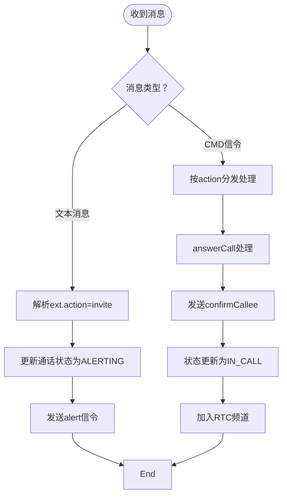
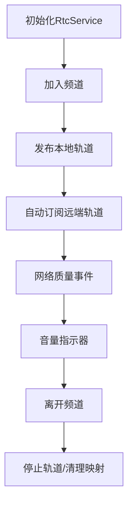
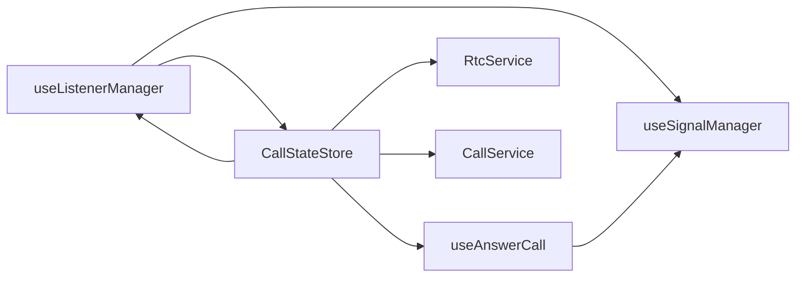

# 高级功能

<cite>
**本文引用的文件**
- [README.md](file://README.md)
- [ARCHITECTURE.md](file://lib/ARCHITECTURE.md)
- [SIGNALING_IMPLEMENTATION.md](file://lib/SIGNALING_IMPLEMENTATION.md)
- [index.ts](file://lib/index.ts)
- [callState.ts](file://lib/store/callState.ts)
- [useListenerManager.ts](file://lib/composables/useListenerManager.ts)
- [useSignalManager.ts](file://lib/composables/useSignalManager.ts)
- [useAnswerCall.ts](file://lib/composables/useAnswerCall.ts)
- [RtcService.ts](file://lib/services/RtcService.ts)
- [CallService.ts](file://callkit/services/CallService.ts)
- [logger.ts](file://lib/utils/logger.ts)
</cite>

## 目录
1. [引言](#引言)
2. [项目结构](#项目结构)
3. [核心组件](#核心组件)
4. [架构总览](#架构总览)
5. [详细组件分析](#详细组件分析)
6. [依赖关系分析](#依赖关系分析)
7. [性能考虑](#性能考虑)
8. [故障排除指南](#故障排除指南)
9. [结论](#结论)
10. [附录](#附录)

## 引言
本文件面向有经验的开发者，系统化梳理项目中的高级功能与实现原理，重点覆盖：
- 信令实现机制与流程完整性
- 事件监听管理与状态同步
- 网络状态处理与音视频质量控制
- 性能优化策略与资源生命周期管理
- 高级配置项、扩展点与插件化思路
- 复杂使用场景的实现方案与最佳实践
- 故障排除与调试技巧
- 扩展与集成第三方服务的方法

## 项目结构
项目采用“类型定义层 → 服务层 → 组合式API层 → 组件层”的分层架构，结合 Pinia 响应式状态管理，形成高内聚、低耦合的模块化体系。核心能力围绕“通话状态”“信令处理”“音视频通道”三大支柱展开。

图表来源
- [ARCHITECTURE.md](file://lib/ARCHITECTURE.md#L1-L190)
- [index.ts](file://lib/index.ts#L1-L58)
- [callState.ts](file://lib/store/callState.ts#L1-L263)
- [useListenerManager.ts](file://lib/composables/useListenerManager.ts#L1-L684)
- [useSignalManager.ts](file://lib/composables/useSignalManager.ts#L1-L354)
- [useAnswerCall.ts](file://lib/composables/useAnswerCall.ts#L1-L168)
- [RtcService.ts](file://lib/services/RtcService.ts#L1-L719)
- [CallService.ts](file://callkit/services/CallService.ts#L1-L800)

章节来源
- [README.md](file://README.md#L1-L181)
- [ARCHITECTURE.md](file://lib/ARCHITECTURE.md#L1-L190)

## 核心组件
- 响应式通话状态管理：通过 Pinia Store 管理通话状态、超时计时、用户映射等，提供类型安全的状态访问与更新。
- 信令监听与处理：集中于监听器管理器，按动作类型分发处理，保证状态与 UI 的一致性。
- 信令发送管理：统一封装信令发送接口，屏蔽底层 IM SDK 细节。
- 被叫方应答：提供 accept/reject/busyReject 三态操作，确保与主叫方信令闭环。
- RTC 服务：封装 Agora 客户端、轨道管理、设备切换、网络质量与音量指示等。
- CallService：高层业务编排，负责邀请、响铃、应答、挂断、时长统计、错误处理等。

章节来源
- [callState.ts](file://lib/store/callState.ts#L1-L263)
- [useListenerManager.ts](file://lib/composables/useListenerManager.ts#L1-L684)
- [useSignalManager.ts](file://lib/composables/useSignalManager.ts#L1-L354)
- [useAnswerCall.ts](file://lib/composables/useAnswerCall.ts#L1-L168)
- [RtcService.ts](file://lib/services/RtcService.ts#L1-L719)
- [CallService.ts](file://callkit/services/CallService.ts#L1-L800)

## 架构总览
整体采用“分层 + 组合式API + 响应式状态”的设计，职责边界清晰：
- 类型层：纯接口定义，确保跨模块契约稳定
- 服务层：业务逻辑实现，独立于 UI
- 组合式API层：连接服务与 UI，提供响应式状态与副作用
- 组件层：可复用 UI 组件，消费组合式 API

图表来源
- [callState.ts](file://lib/store/callState.ts#L1-L263)
- [useListenerManager.ts](file://lib/composables/useListenerManager.ts#L1-L684)
- [useSignalManager.ts](file://lib/composables/useSignalManager.ts#L1-L354)
- [useAnswerCall.ts](file://lib/composables/useAnswerCall.ts#L1-L168)
- [RtcService.ts](file://lib/services/RtcService.ts#L1-L719)
- [CallService.ts](file://callkit/services/CallService.ts#L1-L800)

## 详细组件分析

### 信令实现机制与流程
- 一对一语音/视频通话的信令闭环：invite → alert → confirmRing → answerCall(result: accept/refuse/busy) → confirmCallee → IN_CALL
- 被叫方应答：通过 useAnswerCall 提供 accept/reject/busyReject，发送 answerCall 并更新状态
- 主叫方处理：收到 answerCall 后发送 confirmCallee；若 accept，更新状态为 IN_CALL 并加入 RTC 频道
- 多人通话：当前实现聚焦一对一，多人通话的 cancelCall/leaveCall 等分支仍需完善

图表来源
- [SIGNALING_IMPLEMENTATION.md](file://lib/SIGNALING_IMPLEMENTATION.md#L105-L175)
- [useAnswerCall.ts](file://lib/composables/useAnswerCall.ts#L28-L76)
- [useListenerManager.ts](file://lib/composables/useListenerManager.ts#L319-L447)
- [useSignalManager.ts](file://lib/composables/useSignalManager.ts#L110-L139)

章节来源
- [SIGNALING_IMPLEMENTATION.md](file://lib/SIGNALING_IMPLEMENTATION.md#L1-L183)
- [useAnswerCall.ts](file://lib/composables/useAnswerCall.ts#L1-L168)
- [useListenerManager.ts](file://lib/composables/useListenerManager.ts#L1-L684)
- [useSignalManager.ts](file://lib/composables/useSignalManager.ts#L1-L354)

### 事件监听管理与状态同步
- 文本消息监听：识别 action=invite 的邀请消息，解析 ext，更新通话状态并发送 alert
- 信令监听：过滤 action=rtcCall 的 cmd 消息，按 action 分发处理（alert/confirmRing/answerCall/confirmCallee/cancelCall/leaveCall）
- 多端处理：对来自其他设备的信令进行校验，避免重复处理或状态错乱
- 超时与清理：基于 Pinia 状态的超时计时器，支持单人/多人场景差异化处理

图表来源
- [useListenerManager.ts](file://lib/composables/useListenerManager.ts#L619-L684)
- [callState.ts](file://lib/store/callState.ts#L89-L131)

章节来源
- [useListenerManager.ts](file://lib/composables/useListenerManager.ts#L1-L684)
- [callState.ts](file://lib/store/callState.ts#L1-L263)

### 网络状态处理与音视频质量控制
- RtcService 提供网络质量事件监听与音量指示器回调，便于 UI 展示实时质量
- CallService 内置网络质量变更回调，支持上/下行质量上报
- 设备切换与轨道管理：摄像头/麦克风切换、音视频开关、轨道重建与发布/取消发布
- 资源清理：离开频道前取消发布、停止轨道、清理映射，防止资源泄露

图表来源
- [RtcService.ts](file://lib/services/RtcService.ts#L82-L171)
- [RtcService.ts](file://lib/services/RtcService.ts#L544-L673)
- [CallService.ts](file://callkit/services/CallService.ts#L162-L168)

章节来源
- [RtcService.ts](file://lib/services/RtcService.ts#L1-L719)
- [CallService.ts](file://callkit/services/CallService.ts#L1-L800)

### 高级配置项与扩展点
- CallService 配置项：回调钩子（来电、远端加入/离开、网络质量、错误）、音量阈值、铃声配置、编码器配置、是否使用 RTC Token
- RtcService 配置项：编码器预设、网络质量/用户加入/离开/发布/取消发布/音量回调
- 组合式 API 扩展：可在 useCallState/useListenerManager/useSignalManager 基础上增加自定义状态与监听器
- 插件化思路：通过 Provider 注入 Chat/IM 客户端、用户/群组信息提供器，实现业务解耦

章节来源
- [CallService.ts](file://callkit/services/CallService.ts#L68-L114)
- [RtcService.ts](file://lib/services/RtcService.ts#L30-L40)
- [index.ts](file://lib/index.ts#L48-L57)

### 复杂使用场景与最佳实践
- 多端登录场景：监听器对 callerDevId/calleeDevId 校验，避免重复处理；收到其他设备 confirmCallee 时主动挂断
- 群组通话：邀请列表维护、leaveCall 仅移除成员而非整场通话；多人场景下超时不自动隐藏界面，需手动挂断
- 预览与进入通话：主叫方 1v1 视频在邀请前创建本地预览轨道；进入通话后加入 RTC 频道
- 错误与回退：统一通过 CallError 与 onCallError 回调上报；日志系统分级输出，便于定位

章节来源
- [useListenerManager.ts](file://lib/composables/useListenerManager.ts#L356-L371)
- [callState.ts](file://lib/store/callState.ts#L115-L131)
- [CallService.ts](file://callkit/services/CallService.ts#L408-L510)

## 依赖关系分析
- 组合式 API 与服务层：useListenerManager/useSignalManager/useAnswerCall 依赖 Chat/IM 客户端与 Pinia 状态
- 服务层内聚：CallService 聚合 IM 与 RTC 能力；RtcService 专注音视频通道
- 事件耦合：监听器对状态更新具有强约束，需保证信令顺序与状态一致性
- 外部依赖：Agora SDK、环信 Web SDK、Pinia、Vue3 响应式系统

图表来源
- [useListenerManager.ts](file://lib/composables/useListenerManager.ts#L1-L684)
- [useSignalManager.ts](file://lib/composables/useSignalManager.ts#L1-L354)
- [useAnswerCall.ts](file://lib/composables/useAnswerCall.ts#L1-L168)
- [callState.ts](file://lib/store/callState.ts#L1-L263)
- [RtcService.ts](file://lib/services/RtcService.ts#L1-L719)
- [CallService.ts](file://callkit/services/CallService.ts#L1-L800)

章节来源
- [useListenerManager.ts](file://lib/composables/useListenerManager.ts#L1-L684)
- [useSignalManager.ts](file://lib/composables/useSignalManager.ts#L1-L354)
- [useAnswerCall.ts](file://lib/composables/useAnswerCall.ts#L1-L168)
- [callState.ts](file://lib/store/callState.ts#L1-L263)
- [RtcService.ts](file://lib/services/RtcService.ts#L1-L719)
- [CallService.ts](file://callkit/services/CallService.ts#L1-L800)

## 性能考虑
- 轨道与流管理：避免重复创建本地轨道，发布/取消发布时检查状态，减少资源浪费
- 预览与进入通话：1v1 视频在邀请前创建本地预览轨道，降低首帧延迟
- 超时与清理：及时清除超时计时器与监听器，避免内存泄漏
- 日志分级：生产环境默认低级别日志，调试时开启详细日志，平衡可观测性与性能
- 网络质量：订阅远端轨道时自动处理，网络波动时及时回调 UI 更新

[本节为通用指导，无需列出章节来源]

## 故障排除指南
- 无法接收/发送信令
  - 检查 Provider 是否注入 Chat 客户端，确保 useSignalManager/getClient 正常
  - 查看日志级别，确认 VERBOSE/INFO 输出是否开启
- 被叫接受后主叫方立即挂断
  - 确认 handleAnswerCallMessage 中已发送 confirmCallee 并更新状态为 IN_CALL
  - 核对多端设备 ID 校验，避免其他设备处理导致的误判
- 多人通话成员离开
  - leaveCall 仅移除成员，不挂断整场通话；检查 invitedMembers 更新逻辑
- 预览与进入通话异常
  - 检查本地轨道创建与发布流程，确保状态切换顺序正确
- 日志与调试
  - 使用 logger 的 setDebug(true) 提升日志级别，定位问题
  - 在 CallService/RtcService 中关注 onCallError/onNetworkQualityChange 回调

章节来源
- [useSignalManager.ts](file://lib/composables/useSignalManager.ts#L57-L64)
- [useListenerManager.ts](file://lib/composables/useListenerManager.ts#L356-L371)
- [callState.ts](file://lib/store/callState.ts#L115-L131)
- [logger.ts](file://lib/utils/logger.ts#L91-L94)

## 结论
本项目通过清晰的分层架构与组合式 API，实现了从信令到 UI 的完整闭环。在一对一通话场景下，信令与状态机已较为完善；多人通话、cancelCall/leaveCall 等分支仍有扩展空间。借助完善的日志系统、状态管理与 RTC 服务，开发者可在此基础上快速扩展高级功能、集成第三方服务并实现复杂场景的最佳实践。

[本节为总结性内容，无需列出章节来源]

## 附录

### 信令流程速查
- 主叫方：invite → alert → confirmRing → answerCall → confirmCallee → IN_CALL
- 被叫方：收到 alert → accept/reject/busy → answerCall → confirmCallee → IN_CALL
- 多人通话：invite 列表维护，leaveCall 仅移除成员

章节来源
- [SIGNALING_IMPLEMENTATION.md](file://lib/SIGNALING_IMPLEMENTATION.md#L105-L175)

### 关键配置项速览
- CallService：回调钩子、音量阈值、铃声配置、编码器、是否使用 RTC Token
- RtcService：编码器预设、网络质量/用户事件/音量回调
- 日志：日志级别、前缀、控制台开关

章节来源
- [CallService.ts](file://callkit/services/CallService.ts#L68-L114)
- [RtcService.ts](file://lib/services/RtcService.ts#L30-L40)
- [logger.ts](file://lib/utils/logger.ts#L41-L47)